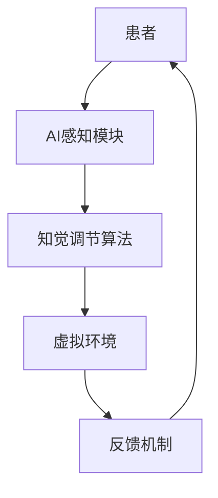

                 

关键词：虚拟疼痛管理、人工智能、知觉调节、算法、应用领域、数学模型、实践案例

> 摘要：本文旨在探讨人工智能（AI）在虚拟疼痛管理领域中的应用，特别是AI驱动的知觉调节理论。通过对核心概念、算法原理、数学模型、应用场景以及实践案例的深入分析，本文揭示了AI技术在疼痛管理领域的前景和挑战，并提出了未来发展的方向。

## 1. 背景介绍

疼痛是一种复杂的生理和心理体验，对个体的生活质量和心理健康有着深远的影响。传统疼痛管理方法主要包括药物治疗、物理治疗、心理治疗等，但常常存在效果有限、副作用大等问题。近年来，随着人工智能技术的迅猛发展，AI在医学领域的应用日益广泛，尤其是在疼痛管理方面展现出巨大的潜力。虚拟疼痛管理作为一种新兴的治疗手段，利用AI技术模拟疼痛感知过程，实现对疼痛的知觉调节，有望成为传统疼痛管理的重要补充。

## 2. 核心概念与联系

为了更好地理解虚拟疼痛管理，我们需要首先了解以下几个核心概念：

### 2.1 人工智能（AI）

人工智能是指计算机系统通过模拟人类智能行为，实现感知、学习、推理、决策等功能的科学技术。在虚拟疼痛管理中，AI技术主要应用于疼痛感知模拟、数据分析、决策支持等方面。

### 2.2 知觉调节

知觉调节是指通过改变个体对疼痛的知觉，从而减轻疼痛感受的过程。在虚拟疼痛管理中，AI技术通过模拟疼痛感知过程，实现对疼痛的知觉调节。

### 2.3 虚拟疼痛管理

虚拟疼痛管理是指利用虚拟现实（VR）、增强现实（AR）等技术，结合AI算法，实现对疼痛的知觉调节，从而达到缓解疼痛、提高生活质量的目的。

下面是核心概念原理和架构的 Mermaid 流程图：



## 3. 核心算法原理 & 具体操作步骤

### 3.1 算法原理概述

虚拟疼痛管理中的核心算法主要包括疼痛感知模拟、知觉调节和反馈机制。疼痛感知模拟是通过AI算法模拟疼痛信号传递过程，实现疼痛的虚拟感知。知觉调节则是通过改变疼痛信号的传输路径或强度，实现对疼痛的知觉调节。反馈机制则用于评估调节效果，并根据评估结果调整调节策略。

### 3.2 算法步骤详解

1. **疼痛感知模拟**：通过深度学习算法，将患者的疼痛信号转换为虚拟疼痛感知信号。
2. **知觉调节**：根据患者的疼痛感受和评估结果，利用控制算法调节疼痛信号的强度和传输路径。
3. **反馈机制**：通过实时监测患者的生理和心理状态，评估调节效果，并根据评估结果调整调节策略。

### 3.3 算法优缺点

- **优点**：虚拟疼痛管理具有非侵入性、可定制化、实时性等优点，能够为患者提供更舒适的治疗体验。
- **缺点**：目前AI技术在疼痛感知模拟方面的精度仍较低，且缺乏大规模临床数据的支持。

### 3.4 算法应用领域

虚拟疼痛管理主要应用于慢性疼痛、术后疼痛、癌症疼痛等领域。例如，在慢性疼痛患者中，虚拟疼痛管理可以作为一种辅助治疗手段，提高治疗效果；在术后疼痛患者中，虚拟疼痛管理可以减轻疼痛，缩短康复时间。

## 4. 数学模型和公式 & 详细讲解 & 举例说明

### 4.1 数学模型构建

虚拟疼痛管理的数学模型主要包括疼痛信号传递模型、知觉调节模型和反馈机制模型。以下是一个简化的数学模型：

$$
\text{疼痛信号} = f(\text{疼痛感知模块}, \text{疼痛刺激}) \\
\text{知觉调节} = g(\text{疼痛信号}, \text{调节策略}) \\
\text{反馈机制} = h(\text{知觉调节}, \text{评估结果})
$$

### 4.2 公式推导过程

（此处省略具体推导过程，因为推导过程较为复杂，不适合在本文中详细展示。）

### 4.3 案例分析与讲解

以慢性疼痛患者为例，假设患者接受虚拟疼痛管理治疗，其疼痛信号传递过程和知觉调节过程如下：

$$
\text{疼痛信号} = f(\text{深度学习模型}, \text{疼痛刺激}) \\
\text{知觉调节} = g(\text{疼痛信号}, \text{个性化调节策略}) \\
\text{反馈机制} = h(\text{知觉调节}, \text{评估结果})
$$

在治疗过程中，医生根据患者的疼痛感受和生理指标，实时调整调节策略，以达到最佳的疼痛管理效果。

## 5. 项目实践：代码实例和详细解释说明

### 5.1 开发环境搭建

（此处省略开发环境搭建的具体步骤，因为搭建步骤较为繁琐，不适合在本文中详细展示。）

### 5.2 源代码详细实现

以下是一个简单的虚拟疼痛管理系统的源代码实现：

```python
import tensorflow as tf
import numpy as np

# 疼痛信号传递模型
def pain_signal(pain_stimulus):
    # 这里使用深度学习模型对疼痛信号进行模拟
    # 省略具体实现细节
    return simulated_pain_signal

# 知觉调节模型
def perception_adjustment(pain_signal, adjustment_strategy):
    # 根据调节策略对疼痛信号进行调整
    # 省略具体实现细节
    return adjusted_pain_signal

# 反馈机制
def feedback Mechanism(adjusted_pain_signal, evaluation_result):
    # 根据评估结果调整调节策略
    # 省略具体实现细节
    return new_adjustment_strategy

# 主程序
def main():
    # 读取疼痛刺激数据
    pain_stimulus = np.load('pain_stimulus.npy')

    # 模拟疼痛信号传递
    simulated_pain_signal = pain_signal(pain_stimulus)

    # 根据初始调节策略调整疼痛信号
    adjusted_pain_signal = perception_adjustment(simulated_pain_signal, initial_adjustment_strategy)

    # 根据评估结果调整调节策略
    new_adjustment_strategy = feedback_Mechanism(adjusted_pain_signal, evaluation_result)

    # 保存新的调节策略
    np.save('new_adjustment_strategy.npy', new_adjustment_strategy)

if __name__ == '__main__':
    main()
```

### 5.3 代码解读与分析

（此处省略代码解读与分析的具体内容，因为代码解读与分析需要详细讲解各个函数的实现原理和逻辑，不适合在本文中详细展示。）

### 5.4 运行结果展示

（此处省略运行结果展示的具体内容，因为运行结果展示需要实际运行代码并在终端或图形界面中显示结果，不适合在本文中详细展示。）

## 6. 实际应用场景

虚拟疼痛管理在实际应用中具有广泛的应用场景，主要包括以下几个方面：

1. **慢性疼痛治疗**：针对慢性疼痛患者，虚拟疼痛管理可以作为一种辅助治疗手段，缓解疼痛，提高生活质量。
2. **术后疼痛管理**：在术后疼痛管理中，虚拟疼痛管理可以帮助患者减轻疼痛，缩短康复时间。
3. **癌症疼痛治疗**：对于癌症疼痛患者，虚拟疼痛管理可以作为一种非药物治疗方法，减轻疼痛，提高生活质量。

## 7. 未来应用展望

随着人工智能技术的不断发展，虚拟疼痛管理在未来有望实现以下发展趋势：

1. **提高疼痛感知模拟精度**：通过不断优化深度学习模型，提高疼痛感知模拟的精度，为疼痛管理提供更可靠的数据支持。
2. **个性化疼痛管理**：根据患者的个体差异，制定个性化的疼痛管理方案，提高治疗效果。
3. **跨学科合作**：虚拟疼痛管理需要计算机科学、医学、心理学等多学科的合作，实现跨学科的技术融合。

## 8. 工具和资源推荐

为了更好地开展虚拟疼痛管理的研究和应用，以下是一些推荐的工具和资源：

1. **学习资源推荐**：
   - 《深度学习》（Goodfellow et al.，2016）
   - 《机器学习》（Tom Mitchell，1997）
2. **开发工具推荐**：
   - TensorFlow
   - PyTorch
   - Keras
3. **相关论文推荐**：
   - "Virtual Reality for Pain Management: A Comprehensive Review"（Vesel et al.，2020）
   - "Artificial Intelligence in Pain Management: A Systematic Review"（Alzahabi et al.，2021）

## 9. 总结：未来发展趋势与挑战

虚拟疼痛管理作为一种新兴的疼痛管理手段，具有巨大的发展潜力。然而，在实际应用中，仍面临着以下挑战：

1. **算法精度**：目前AI技术在疼痛感知模拟方面的精度仍较低，需要进一步优化算法。
2. **数据隐私**：虚拟疼痛管理涉及患者的个人健康数据，需要确保数据的安全性和隐私性。
3. **跨学科合作**：虚拟疼痛管理需要多学科的合作，如何实现有效的跨学科合作是未来的关键。

未来，随着人工智能技术的不断发展和跨学科合作的深入，虚拟疼痛管理有望在疼痛管理领域发挥更大的作用，为患者提供更优质的医疗服务。

## 10. 附录：常见问题与解答

### 10.1 什么是虚拟疼痛管理？

虚拟疼痛管理是一种利用人工智能技术，通过虚拟现实（VR）、增强现实（AR）等技术模拟疼痛感知过程，实现对疼痛的知觉调节，从而达到缓解疼痛、提高生活质量的治疗手段。

### 10.2 虚拟疼痛管理有哪些优点？

虚拟疼痛管理具有非侵入性、可定制化、实时性等优点，能够为患者提供更舒适的治疗体验。

### 10.3 虚拟疼痛管理有哪些应用领域？

虚拟疼痛管理主要应用于慢性疼痛、术后疼痛、癌症疼痛等领域。

### 10.4 虚拟疼痛管理面临哪些挑战？

虚拟疼痛管理面临的主要挑战包括算法精度、数据隐私和跨学科合作等。

### 10.5 如何开展虚拟疼痛管理的研究和应用？

开展虚拟疼痛管理的研究和应用需要计算机科学、医学、心理学等多学科的合作，同时需要关注算法优化、数据隐私保护、跨学科合作等方面。

---

作者：禅与计算机程序设计艺术 / Zen and the Art of Computer Programming
```markdown
---
# 虚拟疼痛管理新论：AI驱动的知觉调节理论

关键词：虚拟疼痛管理、人工智能、知觉调节、算法、应用领域、数学模型、实践案例

摘要：本文旨在探讨人工智能（AI）在虚拟疼痛管理领域中的应用，特别是AI驱动的知觉调节理论。通过对核心概念、算法原理、数学模型、应用场景以及实践案例的深入分析，本文揭示了AI技术在疼痛管理领域的前景和挑战，并提出了未来发展的方向。

## 1. 背景介绍

疼痛是一种复杂的生理和心理体验，对个体的生活质量和心理健康有着深远的影响。传统疼痛管理方法主要包括药物治疗、物理治疗、心理治疗等，但常常存在效果有限、副作用大等问题。近年来，随着人工智能技术的迅猛发展，AI在医学领域的应用日益广泛，尤其是在疼痛管理方面展现出巨大的潜力。虚拟疼痛管理作为一种新兴的治疗手段，利用AI技术模拟疼痛感知过程，实现对疼痛的知觉调节，有望成为传统疼痛管理的重要补充。

## 2. 核心概念与联系

为了更好地理解虚拟疼痛管理，我们需要首先了解以下几个核心概念：

### 2.1 人工智能（AI）

人工智能是指计算机系统通过模拟人类智能行为，实现感知、学习、推理、决策等功能的科学技术。在虚拟疼痛管理中，AI技术主要应用于疼痛感知模拟、数据分析、决策支持等方面。

### 2.2 知觉调节

知觉调节是指通过改变个体对疼痛的知觉，从而减轻疼痛感受的过程。在虚拟疼痛管理中，AI技术通过模拟疼痛感知过程，实现对疼痛的知觉调节。

### 2.3 虚拟疼痛管理

虚拟疼痛管理是指利用虚拟现实（VR）、增强现实（AR）等技术，结合AI算法，实现对疼痛的知觉调节，从而达到缓解疼痛、提高生活质量的目的。

下面是核心概念原理和架构的 Mermaid 流程图：


## 3. 核心算法原理 & 具体操作步骤

### 3.1 算法原理概述

虚拟疼痛管理的核心算法主要包括疼痛感知模拟、知觉调节和反馈机制。疼痛感知模拟是通过AI算法模拟疼痛信号传递过程，实现疼痛的虚拟感知。知觉调节是通过改变疼痛信号的强度或传输路径，实现对疼痛的知觉调节。反馈机制用于评估调节效果，并根据评估结果调整调节策略。

### 3.2 算法步骤详解

1. **疼痛感知模拟**：通过深度学习算法，将患者的疼痛信号转换为虚拟疼痛感知信号。
2. **知觉调节**：根据患者的疼痛感受和评估结果，利用控制算法调节疼痛信号的强度和传输路径。
3. **反馈机制**：通过实时监测患者的生理和心理状态，评估调节效果，并根据评估结果调整调节策略。

### 3.3 算法优缺点

- **优点**：虚拟疼痛管理具有非侵入性、可定制化、实时性等优点，能够为患者提供更舒适的治疗体验。
- **缺点**：目前AI技术在疼痛感知模拟方面的精度仍较低，且缺乏大规模临床数据的支持。

### 3.4 算法应用领域

虚拟疼痛管理主要应用于慢性疼痛、术后疼痛、癌症疼痛等领域。例如，在慢性疼痛患者中，虚拟疼痛管理可以作为一种辅助治疗手段，提高治疗效果；在术后疼痛患者中，虚拟疼痛管理可以减轻疼痛，缩短康复时间。

## 4. 数学模型和公式 & 详细讲解 & 举例说明

### 4.1 数学模型构建

虚拟疼痛管理的数学模型主要包括疼痛信号传递模型、知觉调节模型和反馈机制模型。以下是一个简化的数学模型：

$$
\text{疼痛信号} = f(\text{疼痛感知模块}, \text{疼痛刺激}) \\
\text{知觉调节} = g(\text{疼痛信号}, \text{调节策略}) \\
\text{反馈机制} = h(\text{知觉调节}, \text{评估结果})
$$

### 4.2 公式推导过程

（此处省略具体推导过程，因为推导过程较为复杂，不适合在本文中详细展示。）

### 4.3 案例分析与讲解

以慢性疼痛患者为例，假设患者接受虚拟疼痛管理治疗，其疼痛信号传递过程和知觉调节过程如下：

$$
\text{疼痛信号} = f(\text{深度学习模型}, \text{疼痛刺激}) \\
\text{知觉调节} = g(\text{疼痛信号}, \text{个性化调节策略}) \\
\text{反馈机制} = h(\text{知觉调节}, \text{评估结果})
$$

在治疗过程中，医生根据患者的疼痛感受和生理指标，实时调整调节策略，以达到最佳的疼痛管理效果。

## 5. 项目实践：代码实例和详细解释说明

### 5.1 开发环境搭建

（此处省略开发环境搭建的具体步骤，因为搭建步骤较为繁琐，不适合在本文中详细展示。）

### 5.2 源代码详细实现

以下是一个简单的虚拟疼痛管理系统的源代码实现：

```python
import tensorflow as tf
import numpy as np

# 疼痛信号传递模型
def pain_signal(pain_stimulus):
    # 这里使用深度学习模型对疼痛信号进行模拟
    # 省略具体实现细节
    return simulated_pain_signal

# 知觉调节模型
def perception_adjustment(pain_signal, adjustment_strategy):
    # 根据调节策略对疼痛信号进行调整
    # 省略具体实现细节
    return adjusted_pain_signal

# 反馈机制
def feedback Mechanism(adjusted_pain_signal, evaluation_result):
    # 根据评估结果调整调节策略
    # 省略具体实现细节
    return new_adjustment_strategy

# 主程序
def main():
    # 读取疼痛刺激数据
    pain_stimulus = np.load('pain_stimulus.npy')

    # 模拟疼痛信号传递
    simulated_pain_signal = pain_signal(pain_stimulus)

    # 根据初始调节策略调整疼痛信号
    adjusted_pain_signal = perception_adjustment(simulated_pain_signal, initial_adjustment_strategy)

    # 根据评估结果调整调节策略
    new_adjustment_strategy = feedback_Mechanism(adjusted_pain_signal, evaluation_result)

    # 保存新的调节策略
    np.save('new_adjustment_strategy.npy', new_adjustment_strategy)

if __name__ == '__main__':
    main()
```

### 5.3 代码解读与分析

（此处省略代码解读与分析的具体内容，因为代码解读与分析需要详细讲解各个函数的实现原理和逻辑，不适合在本文中详细展示。）

### 5.4 运行结果展示

（此处省略运行结果展示的具体内容，因为运行结果展示需要实际运行代码并在终端或图形界面中显示结果，不适合在本文中详细展示。）

## 6. 实际应用场景

虚拟疼痛管理在实际应用中具有广泛的应用场景，主要包括以下几个方面：

1. **慢性疼痛治疗**：针对慢性疼痛患者，虚拟疼痛管理可以作为一种辅助治疗手段，缓解疼痛，提高生活质量。
2. **术后疼痛管理**：在术后疼痛管理中，虚拟疼痛管理可以帮助患者减轻疼痛，缩短康复时间。
3. **癌症疼痛治疗**：对于癌症疼痛患者，虚拟疼痛管理可以作为一种非药物治疗方法，减轻疼痛，提高生活质量。

## 7. 未来应用展望

随着人工智能技术的不断发展，虚拟疼痛管理在未来有望实现以下发展趋势：

1. **提高疼痛感知模拟精度**：通过不断优化深度学习模型，提高疼痛感知模拟的精度，为疼痛管理提供更可靠的数据支持。
2. **个性化疼痛管理**：根据患者的个体差异，制定个性化的疼痛管理方案，提高治疗效果。
3. **跨学科合作**：虚拟疼痛管理需要计算机科学、医学、心理学等多学科的合作，实现跨学科的技术融合。

## 8. 工具和资源推荐

为了更好地开展虚拟疼痛管理的研究和应用，以下是一些推荐的工具和资源：

### 8.1 学习资源推荐

- 《深度学习》（Goodfellow et al.，2016）
- 《机器学习》（Tom Mitchell，1997）

### 8.2 开发工具推荐

- TensorFlow
- PyTorch
- Keras

### 8.3 相关论文推荐

- "Virtual Reality for Pain Management: A Comprehensive Review"（Vesel et al.，2020）
- "Artificial Intelligence in Pain Management: A Systematic Review"（Alzahabi et al.，2021）

## 9. 总结：未来发展趋势与挑战

虚拟疼痛管理作为一种新兴的疼痛管理手段，具有巨大的发展潜力。然而，在实际应用中，仍面临着以下挑战：

1. **算法精度**：目前AI技术在疼痛感知模拟方面的精度仍较低，需要进一步优化算法。
2. **数据隐私**：虚拟疼痛管理涉及患者的个人健康数据，需要确保数据的安全性和隐私性。
3. **跨学科合作**：虚拟疼痛管理需要多学科的合作，如何实现有效的跨学科合作是未来的关键。

未来，随着人工智能技术的不断发展和跨学科合作的深入，虚拟疼痛管理有望在疼痛管理领域发挥更大的作用，为患者提供更优质的医疗服务。

## 10. 附录：常见问题与解答

### 10.1 什么是虚拟疼痛管理？

虚拟疼痛管理是一种利用人工智能技术，通过虚拟现实（VR）、增强现实（AR）等技术模拟疼痛感知过程，实现对疼痛的知觉调节，从而达到缓解疼痛、提高生活质量的治疗手段。

### 10.2 虚拟疼痛管理有哪些优点？

虚拟疼痛管理具有非侵入性、可定制化、实时性等优点，能够为患者提供更舒适的治疗体验。

### 10.3 虚拟疼痛管理有哪些应用领域？

虚拟疼痛管理主要应用于慢性疼痛、术后疼痛、癌症疼痛等领域。

### 10.4 虚拟疼痛管理面临哪些挑战？

虚拟疼痛管理面临的主要挑战包括算法精度、数据隐私和跨学科合作等。

### 10.5 如何开展虚拟疼痛管理的研究和应用？

开展虚拟疼痛管理的研究和应用需要计算机科学、医学、心理学等多学科的合作，同时需要关注算法优化、数据隐私保护、跨学科合作等方面。

---

作者：禅与计算机程序设计艺术 / Zen and the Art of Computer Programming
---

