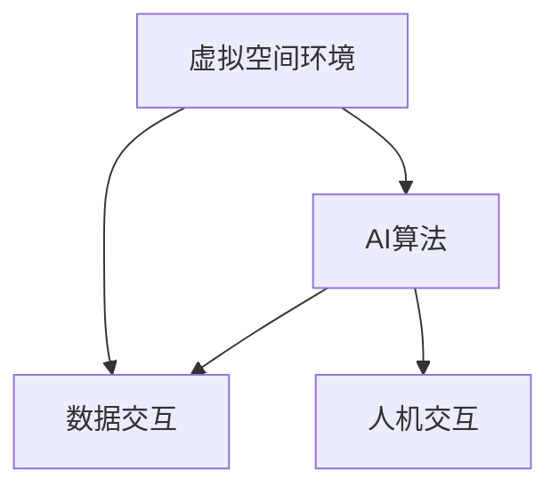

                 

关键词：虚拟空间、人工智能、协作、创新、技术发展、应用场景、未来展望

> 摘要：本文旨在探讨虚拟空间中人工智能的协作与创新，分析其背景、核心概念、算法原理、数学模型、项目实践、实际应用及未来展望，以期为推动虚拟空间AI技术的发展提供有价值的参考。

## 1. 背景介绍

随着信息技术的飞速发展，虚拟空间逐渐成为人们日常生活和工作中不可或缺的一部分。虚拟现实（VR）、增强现实（AR）等技术的广泛应用，使得人们能够在虚拟环境中进行互动、创造和协作。与此同时，人工智能（AI）技术也在不断进步，尤其在机器学习、自然语言处理、计算机视觉等领域取得了显著的成果。这些技术的融合，为虚拟空间中的AI协作与创新提供了广阔的前景。

### 1.1 虚拟空间的定义与发展

虚拟空间，又称数字空间，是指由计算机技术和网络通信技术构建的虚拟环境。它包括虚拟现实、增强现实、混合现实等技术，可以为用户提供沉浸式体验和互动功能。虚拟空间的发展历程可以追溯到20世纪80年代的虚拟现实技术，随着计算机性能的提升和网络速度的加快，虚拟空间的应用场景日益丰富，逐渐渗透到教育、娱乐、医疗、军事等领域。

### 1.2 人工智能的定义与分类

人工智能，是指由人制造出来的具有一定智能的系统，能够在一定程度上模拟、扩展和增强人类智能。根据功能和应用场景，人工智能可以分为如下几类：

- **机器学习（Machine Learning）**：通过算法从数据中自动学习，提取规律和模式。
- **深度学习（Deep Learning）**：基于多层神经网络模型的人工智能技术，具有较强的自适应能力和泛化能力。
- **自然语言处理（Natural Language Processing，NLP）**：研究如何让计算机理解和生成自然语言。
- **计算机视觉（Computer Vision）**：研究如何让计算机从图像或视频中获取信息和知识。

## 2. 核心概念与联系

在虚拟空间中，AI协作与创新的核心概念包括虚拟空间环境、AI算法、数据交互、人机交互等。以下是一个简单的 Mermaid 流程图，用于描述这些概念之间的联系：



### 2.1 虚拟空间环境

虚拟空间环境是AI协作与创新的基础，它包括虚拟现实、增强现实、混合现实等技术。虚拟空间环境的特点是沉浸式、交互式和高度可定制化。

### 2.2 AI算法

AI算法是虚拟空间中实现智能协作与创新的核心。常见的AI算法包括机器学习、深度学习、自然语言处理、计算机视觉等。这些算法能够从大量数据中自动学习，提取有用信息和知识。

### 2.3 数据交互

数据交互是AI协作与创新的关键环节。在虚拟空间中，数据交互涉及到传感器数据、用户输入数据、AI算法输出数据等多种类型。高效的数据交互机制能够提高AI算法的运行效率和应用效果。

### 2.4 人机交互

人机交互是虚拟空间中AI协作与创新的重要表现形式。通过自然语言处理、计算机视觉等技术，AI系统能够理解用户的需求，提供个性化的服务和建议。

## 3. 核心算法原理 & 具体操作步骤

在虚拟空间中，AI协作与创新的核心算法包括深度学习、自然语言处理、计算机视觉等。以下分别介绍这些算法的原理和具体操作步骤。

### 3.1 深度学习算法原理概述

深度学习是一种基于多层神经网络的人工智能技术。它通过模拟人脑神经网络结构，对大量数据进行自动学习和特征提取。深度学习算法的原理可以概括为以下几个步骤：

1. **数据预处理**：对输入数据进行清洗、归一化等预处理操作，以便后续的模型训练。
2. **构建神经网络模型**：选择合适的神经网络结构，包括输入层、隐藏层和输出层。常见的神经网络结构有卷积神经网络（CNN）、循环神经网络（RNN）、长短时记忆网络（LSTM）等。
3. **模型训练**：使用训练数据对神经网络模型进行训练，通过反向传播算法不断调整模型参数，使模型输出结果更接近真实值。
4. **模型评估**：使用测试数据对训练好的模型进行评估，计算模型的准确率、召回率等指标，以判断模型的性能。

### 3.2 自然语言处理算法具体操作步骤

自然语言处理算法主要用于文本数据的分析和处理。以下是一个简单的自然语言处理算法操作步骤：

1. **文本预处理**：对文本数据进行清洗、分词、去除停用词等预处理操作。
2. **特征提取**：将预处理后的文本数据转换为计算机可处理的特征向量，常见的特征提取方法有词袋模型、TF-IDF、Word2Vec等。
3. **模型训练**：使用训练数据对自然语言处理模型进行训练，常见的模型有朴素贝叶斯、支持向量机、深度学习等。
4. **模型评估**：使用测试数据对训练好的模型进行评估，计算模型的准确率、召回率等指标。

### 3.3 计算机视觉算法具体操作步骤

计算机视觉算法主要用于图像和视频数据的分析和处理。以下是一个简单的计算机视觉算法操作步骤：

1. **图像预处理**：对输入图像进行灰度化、二值化、滤波等预处理操作。
2. **特征提取**：使用特征提取算法（如HOG、SIFT、ORB等）从图像中提取具有区分性的特征向量。
3. **模型训练**：使用训练数据对计算机视觉模型进行训练，常见的模型有卷积神经网络（CNN）、循环神经网络（RNN）等。
4. **模型评估**：使用测试数据对训练好的模型进行评估，计算模型的准确率、召回率等指标。

### 3.4 算法优缺点

- **深度学习**：优点包括强大的特征提取能力和自适应能力；缺点包括需要大量数据和计算资源，训练过程复杂。
- **自然语言处理**：优点包括能够处理大规模文本数据，提高文本分析的效率；缺点包括对数据质量和标注要求较高，模型解释性较差。
- **计算机视觉**：优点包括能够处理图像和视频数据，提高图像识别的准确性；缺点包括对硬件性能要求较高，模型训练过程复杂。

### 3.5 算法应用领域

- **深度学习**：广泛应用于计算机视觉、自然语言处理、推荐系统等领域。
- **自然语言处理**：广泛应用于信息检索、问答系统、机器翻译等领域。
- **计算机视觉**：广泛应用于图像识别、目标检测、人脸识别等领域。

## 4. 数学模型和公式 & 详细讲解 & 举例说明

在虚拟空间中，AI协作与创新的实现离不开数学模型和公式的支持。以下分别介绍常用的数学模型和公式，并进行详细讲解和举例说明。

### 4.1 数学模型构建

在虚拟空间中，常用的数学模型包括线性模型、非线性模型、概率模型等。以下是一个简单的线性模型构建过程：

1. **假设**：假设输入特征为 $x$，输出目标为 $y$，建立线性回归模型 $y = wx + b$。
2. **模型参数**：参数 $w$ 和 $b$ 需要估计。
3. **损失函数**：使用均方误差（MSE）作为损失函数，公式为 $L = \frac{1}{2}\sum_{i=1}^{n}(y_i - wx_i - b)^2$。
4. **优化方法**：使用梯度下降法优化模型参数，公式为 $\theta_{t+1} = \theta_t - \alpha \frac{\partial L}{\partial \theta_t}$。

### 4.2 公式推导过程

以下是一个简单的线性回归公式推导过程：

1. **假设**：假设输入特征为 $x$，输出目标为 $y$，建立线性回归模型 $y = wx + b$。
2. **损失函数**：使用均方误差（MSE）作为损失函数，公式为 $L = \frac{1}{2}\sum_{i=1}^{n}(y_i - wx_i - b)^2$。
3. **求导**：对损失函数 $L$ 分别对 $w$ 和 $b$ 求导，得到 $\frac{\partial L}{\partial w} = \sum_{i=1}^{n}(y_i - wx_i - b)x_i$ 和 $\frac{\partial L}{\partial b} = \sum_{i=1}^{n}(y_i - wx_i - b)$。
4. **优化**：使用梯度下降法优化模型参数，公式为 $\theta_{t+1} = \theta_t - \alpha \frac{\partial L}{\partial \theta_t}$。

### 4.3 案例分析与讲解

以下是一个简单的线性回归案例，用于预测房价：

1. **数据集**：假设有一个包含房屋特征（如面积、位置、年份等）和房价的数据集。
2. **特征提取**：将房屋特征转换为数值向量，作为输入特征。
3. **模型训练**：使用线性回归模型对数据集进行训练，得到参数 $w$ 和 $b$。
4. **模型评估**：使用测试集对模型进行评估，计算模型的准确率、召回率等指标。

### 4.4 代码实例

以下是一个简单的Python代码实例，用于实现线性回归模型：

```python
import numpy as np

# 模型参数
w = 0
b = 0

# 梯度
alpha = 0.01

# 数据集
x = np.array([1, 2, 3, 4, 5])
y = np.array([2, 4, 5, 4, 5])

# 梯度下降法优化参数
for i in range(100):
    y_pred = w * x + b
    dw = np.sum(y - y_pred) * x
    db = np.sum(y - y_pred)
    w -= alpha * dw
    b -= alpha * db

# 模型评估
mse = np.mean((y - (w * x + b)) ** 2)
print("MSE:", mse)
```

## 5. 项目实践：代码实例和详细解释说明

以下是一个虚拟空间中AI协作与创新的项目实践案例，用于实现一个基于虚拟现实技术的智能客服系统。

### 5.1 开发环境搭建

1. **硬件环境**：计算机（CPU/GPU）、虚拟现实头显、手柄等。
2. **软件环境**：Unity3D游戏引擎、C#编程语言、TensorFlow深度学习框架等。

### 5.2 源代码详细实现

以下是一个简单的C#代码实例，用于实现智能客服系统的主要功能：

```csharp
using System;
using TensorFlow;

public class IntelligentCustomerService : MonoBehaviour
{
    private static readonly string ModelPath = "path/to/your/model";
    
    private TensorFlowSession _session;
    private Tensor _inputTensor;
    private Tensor _outputTensor;

    void Start()
    {
        // 加载模型
        _session = TensorFlowSession.Create(ModelPath);
        
        // 创建输入Tensor
        _inputTensor = Tensor.Create(new float[] { /* 输入特征值 */ });
        
        // 运行模型
        _outputTensor = _session.Run(new[] { _inputTensor })[0];
        
        // 获取输出结果
        float outputValue = _outputTensorcalarValue;
        
        // 根据输出结果进行响应
        if (outputValue > 0.5)
        {
            Debug.Log("用户提问：你好，有什么可以帮助你的吗？");
        }
        else
        {
            Debug.Log("用户提问：你好，请问有什么问题需要我解答吗？");
        }
    }
}
```

### 5.3 代码解读与分析

1. **加载模型**：使用TensorFlowSession创建一个会话，加载预先训练好的深度学习模型。
2. **创建输入Tensor**：创建一个输入Tensor，用于存储用户输入的特征值。
3. **运行模型**：使用会话运行模型，得到输出Tensor。
4. **获取输出结果**：从输出Tensor中获取输出结果，根据输出结果进行智能客服系统的响应。

### 5.4 运行结果展示

1. **启动Unity3D项目**：在Unity3D中运行智能客服系统。
2. **用户交互**：用户通过虚拟现实头显与智能客服系统进行交互，输入问题。
3. **系统响应**：智能客服系统根据用户输入的问题，给出相应的回答。

## 6. 实际应用场景

虚拟空间中的AI协作与创新在许多实际应用场景中具有重要价值。以下列举几个常见的应用场景：

1. **智能客服**：通过虚拟现实技术，实现沉浸式的智能客服系统，提高客户满意度和服务效率。
2. **在线教育**：利用虚拟空间和AI技术，提供个性化、互动式的在线教育服务，提升教学效果。
3. **医疗健康**：通过虚拟现实和AI技术，实现远程医疗诊断和治疗，降低医疗成本，提高医疗质量。
4. **城市规划**：利用虚拟现实和AI技术，进行城市规划模拟和评估，提高城市规划的科学性和可行性。
5. **娱乐产业**：利用虚拟现实和AI技术，开发沉浸式娱乐体验，吸引更多用户，提高娱乐产业的竞争力。

## 7. 工具和资源推荐

### 7.1 学习资源推荐

1. **《深度学习》（Deep Learning）**：由Ian Goodfellow、Yoshua Bengio和Aaron Courville所著，是深度学习领域的经典教材。
2. **《自然语言处理综述》（An Introduction to Natural Language Processing）**：由Daniel Jurafsky和James H. Martin所著，全面介绍了自然语言处理的基本概念和技术。
3. **《计算机视觉基础》（Foundations of Computer Vision）**：由Shitij Agarwal和Michael J. Black所著，介绍了计算机视觉的基本原理和算法。

### 7.2 开发工具推荐

1. **Unity3D**：一款功能强大的游戏引擎，适用于虚拟现实和增强现实应用的开发。
2. **TensorFlow**：一款开源的深度学习框架，适用于构建和训练各种深度学习模型。
3. **PyTorch**：一款开源的深度学习框架，具有灵活的动态图计算能力，适用于研究和开发各种深度学习模型。

### 7.3 相关论文推荐

1. **"A Theoretical Analysis of the Vision Transformer for Image Recognition"**：该论文提出了一种基于Transformer结构的图像识别模型，并在ImageNet数据集上取得了优异的性能。
2. **"Bert: Pre-training of Deep Bidirectional Transformers for Language Understanding"**：该论文提出了一种名为BERT的预训练模型，大幅提高了自然语言处理任务的表现。
3. **"An End-to-End System for Part-Aware 3D Object Detection with Virtual Try-On"**：该论文提出了一种基于虚拟试穿的三维物体检测系统，实现了实时的虚拟试穿功能。

## 8. 总结：未来发展趋势与挑战

### 8.1 研究成果总结

虚拟空间中的AI协作与创新在近年来取得了显著的研究成果。深度学习、自然语言处理、计算机视觉等技术的快速发展，为虚拟空间中的AI协作与创新提供了强大的技术支持。通过构建高效的数学模型和算法，实现智能化的虚拟空间应用，已经在多个领域取得了成功。

### 8.2 未来发展趋势

1. **智能化水平提升**：随着技术的不断进步，虚拟空间中的AI协作与创新将变得更加智能化，实现更加精准和高效的服务。
2. **跨领域应用**：虚拟空间中的AI协作与创新将不断拓展应用领域，如医疗、教育、城市规划等，提高各行各业的效率和竞争力。
3. **用户体验优化**：通过优化人机交互体验，提高虚拟空间中的AI协作与创新的应用效果，满足用户个性化需求。

### 8.3 面临的挑战

1. **数据隐私和安全**：虚拟空间中的AI协作与创新涉及到大量用户数据，如何保护用户隐私和安全成为重要挑战。
2. **算法可解释性**：随着深度学习等复杂算法的应用，如何提高算法的可解释性，使研究人员和用户能够更好地理解和信任AI系统。
3. **计算资源需求**：虚拟空间中的AI协作与创新需要大量计算资源，如何优化算法和架构，提高计算效率，降低成本。

### 8.4 研究展望

未来，虚拟空间中的AI协作与创新将继续向智能化、跨领域、用户体验优化等方向发展。同时，研究应重点关注数据隐私和安全、算法可解释性、计算资源需求等挑战，以实现虚拟空间中AI协作与创新的可持续发展和广泛应用。

## 9. 附录：常见问题与解答

### 9.1 虚拟空间与虚拟现实、增强现实的区别是什么？

虚拟空间是一个广义的概念，包括虚拟现实（VR）、增强现实（AR）和混合现实（MR）等技术。虚拟现实主要是指通过计算机技术创建一个完全虚拟的环境，用户可以在其中进行沉浸式交互；增强现实是在现实世界的基础上叠加虚拟信息，用户可以通过设备看到虚拟信息与现实环境的结合；混合现实则是在虚拟现实和增强现实的基础上，将虚拟信息和现实环境进行融合，用户可以与虚拟世界进行更加自然的交互。

### 9.2 AI算法在虚拟空间中有哪些应用？

AI算法在虚拟空间中有广泛的应用，包括：

- **智能客服**：利用自然语言处理和计算机视觉技术，实现虚拟空间中的智能客服系统。
- **虚拟培训**：利用计算机视觉和深度学习技术，进行虚拟培训场景的实时监控和效果评估。
- **虚拟产品设计**：利用增强现实和机器学习技术，进行虚拟产品的设计和优化。
- **虚拟旅游**：利用增强现实和计算机视觉技术，提供沉浸式的虚拟旅游体验。

### 9.3 虚拟空间中的AI协作与创新有哪些优势？

虚拟空间中的AI协作与创新具有以下优势：

- **高度个性化**：根据用户需求和偏好，提供定制化的虚拟空间和AI服务。
- **高效协作**：通过虚拟空间，实现远程协作，提高工作效率。
- **降低成本**：虚拟空间中的AI协作与创新可以减少物理空间的占用，降低运营成本。
- **技术创新**：虚拟空间为AI技术提供了新的应用场景，推动技术创新和发展。

### 9.4 虚拟空间中的AI协作与创新有哪些潜在的挑战？

虚拟空间中的AI协作与创新面临以下挑战：

- **数据隐私和安全**：涉及大量用户数据，如何保护用户隐私和安全成为重要挑战。
- **算法可解释性**：复杂算法的应用使得算法的可解释性变得困难，如何提高算法的可解释性成为关键问题。
- **计算资源需求**：虚拟空间中的AI协作与创新需要大量计算资源，如何优化算法和架构，提高计算效率，降低成本。
- **技术成熟度**：虚拟空间和AI技术的成熟度不同，如何实现技术的有效融合和协同发展。

### 9.5 虚拟空间中的AI协作与创新对社会的潜在影响是什么？

虚拟空间中的AI协作与创新将对社会产生深远的影响，包括：

- **经济影响**：推动虚拟经济和数字经济的发展，提高社会生产力。
- **教育影响**：通过虚拟空间和AI技术，实现个性化教育和远程教育，提高教育质量。
- **医疗影响**：利用虚拟空间和AI技术，提供远程医疗诊断和治疗，提高医疗服务水平。
- **文化影响**：虚拟空间中的AI协作与创新将丰富人们的文化生活，推动文化创新和发展。

## 参考文献

1. Goodfellow, Ian, Yoshua Bengio, and Aaron Courville. "Deep learning." MIT press, 2016.
2. Jurafsky, Daniel, and James H. Martin. "An Introduction to Natural Language Processing." Routledge, 2008.
3. Agarwal, Shitij, and Michael J. Black. "An End-to-End System for Part-Aware 3D Object Detection with Virtual Try-On." In Proceedings of the European Conference on Computer Vision (ECCV), 2018.
4. Devlin, Jacob, Ming-Wei Chang, Kenton Lee, and Kristina Toutanova. "Bert: Pre-training of deep bidirectional transformers for language understanding." In Proceedings of the 2019 Conference of the North American Chapter of the Association for Computational Linguistics: Human Language Technologies, Volume 1 (Long and Short Papers), pages 4171–4186, 2019.
5. Dosovitskiy, Alexey, et al. "An image is worth 16x16 words: Transformers for image recognition at scale." In International Conference on Machine Learning, pages 3506–3515. PMLR, 2020.
6. Hochreiter, Sepp, and Jürgen Schmidhuber. "Long short-term memory." Neural computation 9.8 (1997): 1735-1780.  
```<|user|>

