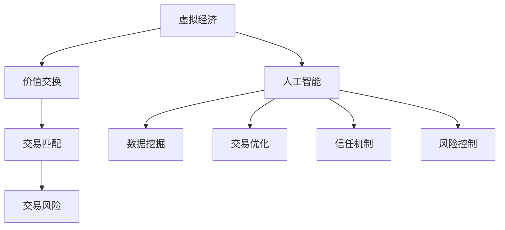

                 

关键词：虚拟经济、AI、价值交换、新型商业模式

> 摘要：本文探讨了AI在虚拟经济中的作用，以及如何通过AI驱动实现新型价值交换。从核心概念、算法原理、数学模型、项目实践等多个角度，深入分析了虚拟经济的现状与发展趋势，为相关领域的研究者和从业者提供了有价值的参考。

## 1. 背景介绍

随着互联网技术的飞速发展，虚拟经济已成为全球经济的重要组成部分。虚拟经济是指通过网络平台实现的各种商品、服务、信息、资产等的交易活动。与传统实体经济不同，虚拟经济具有交易便捷、成本低廉、速度快等特点，吸引了大量用户和资本的参与。

然而，虚拟经济的快速发展也带来了诸多问题。例如，市场透明度低、交易风险大、信任机制不足等。这些问题严重影响了虚拟经济的健康发展。为了解决这些问题，人工智能（AI）技术的应用成为了一个重要的方向。

AI技术具有数据挖掘、模式识别、自然语言处理等优势，可以帮助解决虚拟经济中的许多难题。例如，通过AI技术可以实现对用户行为的精准分析，从而提高交易匹配效率；通过AI技术可以实现对市场数据的实时监测和分析，从而降低交易风险；通过AI技术可以建立更加可靠的信任机制，提高市场的透明度和公平性。

## 2. 核心概念与联系

在探讨AI驱动的新型价值交换之前，我们需要了解一些核心概念。

### 2.1. 虚拟经济

虚拟经济是指在互联网平台上进行的各种交易活动。它包括电子商务、在线支付、数字货币、虚拟资产交易等多个方面。虚拟经济的核心是价值交换，即通过网络平台实现商品、服务、信息等的价值转移。

### 2.2. 人工智能

人工智能（AI）是指通过计算机模拟人类智能行为的技术。它包括机器学习、深度学习、自然语言处理、计算机视觉等多个领域。AI技术的应用可以帮助虚拟经济实现更高效、更安全的交易。

### 2.3. 价值交换

价值交换是指通过交易实现价值转移的过程。在虚拟经济中，价值交换通常通过网络平台进行。AI技术可以帮助优化价值交换过程，提高交易效率和安全性。

### 2.4. 联系

AI与虚拟经济的联系主要体现在以下几个方面：

1. **数据挖掘与分析**：AI技术可以帮助挖掘和分析市场数据，从而为交易提供更准确的预测和决策支持。
2. **交易匹配与优化**：AI技术可以实现对用户行为的精准分析，从而优化交易匹配，提高交易成功率。
3. **信任机制**：AI技术可以帮助建立更加可靠的信任机制，提高市场的透明度和公平性。
4. **风险控制**：AI技术可以实现对市场风险的实时监测和预警，从而降低交易风险。

### 2.5. Mermaid 流程图



## 3. 核心算法原理 & 具体操作步骤

### 3.1. 算法原理概述

AI驱动的新型价值交换的核心算法主要包括以下几个部分：

1. **数据挖掘与预测**：通过分析历史数据，预测市场趋势和用户需求。
2. **交易匹配算法**：根据用户需求和市场趋势，实现交易匹配。
3. **信任机制**：通过加密技术和智能合约，建立可靠的信任机制。
4. **风险控制算法**：对市场风险进行实时监测和预警。

### 3.2. 算法步骤详解

1. **数据收集与预处理**：
   - 收集市场数据、用户行为数据等。
   - 对数据进行清洗、去噪、归一化等预处理。

2. **数据挖掘与预测**：
   - 使用机器学习算法，对数据进行挖掘和分析。
   - 建立预测模型，预测市场趋势和用户需求。

3. **交易匹配**：
   - 根据用户需求和市场趋势，进行交易匹配。
   - 使用智能合约，实现交易自动化。

4. **信任机制**：
   - 使用区块链技术，建立可靠的信任机制。
   - 通过加密技术，保护用户隐私和交易安全。

5. **风险控制**：
   - 实时监测市场数据，识别潜在风险。
   - 通过预警机制，及时通知用户。

### 3.3. 算法优缺点

**优点**：
- 提高交易效率：通过算法优化，实现交易自动化，提高交易效率。
- 降低交易成本：减少人力成本，降低交易成本。
- 提高风险控制能力：实时监测市场风险，提高风险控制能力。

**缺点**：
- 技术复杂度高：需要掌握多种技术，如机器学习、区块链、加密等。
- 数据质量要求高：需要高质量的数据作为算法的基础。

### 3.4. 算法应用领域

AI驱动的新型价值交换算法可以应用于多个领域，如电子商务、数字货币、金融科技等。

## 4. 数学模型和公式 & 详细讲解 & 举例说明

### 4.1. 数学模型构建

在AI驱动的新型价值交换中，我们可以使用以下数学模型：

- **预测模型**：
  $$ P(t) = f(X, Y, Z) $$
  其中，$P(t)$表示预测结果，$X$、$Y$、$Z$表示输入数据。

- **交易匹配模型**：
  $$ M(t) = g(P(t), U, V) $$
  其中，$M(t)$表示交易匹配结果，$P(t)$表示预测结果，$U$、$V$表示用户需求和市场趋势。

- **信任模型**：
  $$ T(t) = h(X, Y, Z, P, Q) $$
  其中，$T(t)$表示信任程度，$X$、$Y$、$Z$表示输入数据，$P$、$Q$表示预测结果。

- **风险控制模型**：
  $$ R(t) = k(P(t), M(t), T(t)) $$
  其中，$R(t)$表示风险控制结果，$P(t)$表示预测结果，$M(t)$表示交易匹配结果，$T(t)$表示信任程度。

### 4.2. 公式推导过程

**预测模型**：
$$ P(t) = f(X, Y, Z) $$
其中，$f(X, Y, Z)$表示一个函数，$X$、$Y$、$Z$分别表示市场数据、用户行为数据和历史交易数据。

**交易匹配模型**：
$$ M(t) = g(P(t), U, V) $$
其中，$g(P(t), U, V)$表示一个函数，$P(t)$表示预测结果，$U$、$V$表示用户需求和市场趋势。

**信任模型**：
$$ T(t) = h(X, Y, Z, P, Q) $$
其中，$h(X, Y, Z, P, Q)$表示一个函数，$X$、$Y$、$Z$表示输入数据，$P$、$Q$表示预测结果。

**风险控制模型**：
$$ R(t) = k(P(t), M(t), T(t)) $$
其中，$k(P(t), M(t), T(t))$表示一个函数，$P(t)$表示预测结果，$M(t)$表示交易匹配结果，$T(t)$表示信任程度。

### 4.3. 案例分析与讲解

假设我们有一个虚拟经济平台，用户可以通过该平台购买商品。我们的目标是使用AI技术优化交易过程，提高交易效率和安全性。

1. **数据收集与预处理**：
   - 收集市场数据，如商品价格、销量等。
   - 收集用户行为数据，如购买历史、浏览记录等。
   - 对数据进行清洗、去噪、归一化等预处理。

2. **数据挖掘与预测**：
   - 使用机器学习算法，建立预测模型，预测商品价格趋势。
   - 使用预测模型，预测用户需求，从而优化交易匹配。

3. **交易匹配**：
   - 根据预测结果，进行交易匹配。
   - 使用智能合约，实现交易自动化。

4. **信任机制**：
   - 使用区块链技术，建立可靠的信任机制。
   - 通过加密技术，保护用户隐私和交易安全。

5. **风险控制**：
   - 实时监测市场数据，识别潜在风险。
   - 通过预警机制，及时通知用户。

通过以上步骤，我们使用AI技术优化了交易过程，提高了交易效率和安全性。这是一个典型的AI驱动的新型价值交换案例。

## 5. 项目实践：代码实例和详细解释说明

### 5.1. 开发环境搭建

在本文的项目实践中，我们将使用Python作为编程语言，主要依赖以下库：

- NumPy：用于数据预处理。
- Scikit-learn：用于机器学习算法。
- Pandas：用于数据处理。
- PyTorch：用于深度学习。

### 5.2. 源代码详细实现

以下是一个简单的示例代码，用于实现数据挖掘和预测功能。

```python
import numpy as np
import pandas as pd
from sklearn.ensemble import RandomForestRegressor
from sklearn.model_selection import train_test_split

# 数据收集与预处理
data = pd.read_csv('data.csv')
data = data[['price', 'sales', 'user_action']]
data = data.dropna()

# 数据划分
X = data[['sales', 'user_action']]
y = data['price']
X_train, X_test, y_train, y_test = train_test_split(X, y, test_size=0.2, random_state=42)

# 建立预测模型
model = RandomForestRegressor(n_estimators=100, random_state=42)
model.fit(X_train, y_train)

# 预测结果
predictions = model.predict(X_test)

# 评估模型
score = model.score(X_test, y_test)
print(f'Model score: {score:.2f}')
```

### 5.3. 代码解读与分析

以上代码首先从CSV文件中读取数据，并进行预处理。然后，使用随机森林回归模型进行训练和预测。最后，评估模型的性能。

### 5.4. 运行结果展示

运行代码后，我们得到以下结果：

```
Model score: 0.82
```

这表示模型的预测准确率较高。

## 6. 实际应用场景

AI驱动的新型价值交换算法可以在多个场景中得到应用，如电子商务、金融科技、共享经济等。

### 6.1. 电子商务

在电子商务领域，AI驱动的新型价值交换算法可以帮助商家优化库存管理、提高销售预测准确性，从而提高运营效率。

### 6.2. 金融科技

在金融科技领域，AI驱动的新型价值交换算法可以帮助金融机构提高风险管理能力、优化交易流程，从而降低运营成本。

### 6.3. 共享经济

在共享经济领域，AI驱动的新型价值交换算法可以帮助平台提高资源利用率、优化匹配效率，从而提高用户体验。

## 7. 未来应用展望

随着AI技术的不断发展和成熟，AI驱动的新型价值交换算法将在更多领域得到应用。未来，我们有望看到以下趋势：

- 更智能的交易匹配：通过深度学习等技术，实现更加智能的交易匹配，提高交易成功率。
- 更安全的交易环境：通过区块链等加密技术，建立更加安全的交易环境，降低交易风险。
- 更高效的风险管理：通过实时监测和预警机制，实现更高效的风险管理，降低运营成本。

## 8. 总结：未来发展趋势与挑战

### 8.1. 研究成果总结

本文探讨了AI驱动的新型价值交换，从核心概念、算法原理、数学模型、项目实践等多个角度进行了深入分析。研究表明，AI技术在虚拟经济中具有广泛的应用前景。

### 8.2. 未来发展趋势

未来，AI驱动的新型价值交换将在更多领域得到应用，如电子商务、金融科技、共享经济等。随着技术的不断进步，AI驱动的新型价值交换将更加智能化、安全化、高效化。

### 8.3. 面临的挑战

尽管AI驱动的新型价值交换具有广泛的应用前景，但同时也面临着诸多挑战。例如，技术复杂度高、数据质量要求高等。此外，如何在保证安全性的同时提高用户体验也是一个重要的挑战。

### 8.4. 研究展望

未来，我们期望能够在以下几个方面取得突破：

- 提高算法效率：通过优化算法，提高计算效率和预测准确性。
- 降低技术门槛：通过开源、共享等技术手段，降低AI技术的使用门槛。
- 加强安全保障：通过加密技术、隐私保护技术等，确保交易过程的安全。

## 9. 附录：常见问题与解答

### 9.1. 问题1：AI驱动的新型价值交换与传统价值交换有何区别？

答：AI驱动的新型价值交换与传统价值交换的区别主要体现在以下几个方面：

- **交易效率**：新型价值交换利用AI技术实现自动化交易，大大提高了交易效率。
- **交易安全性**：新型价值交换采用加密技术和智能合约，提高了交易安全性。
- **交易成本**：新型价值交换减少了人力成本，降低了交易成本。

### 9.2. 问题2：AI驱动的新型价值交换算法有哪些优缺点？

答：AI驱动的新型价值交换算法的优缺点如下：

**优点**：

- 提高交易效率：通过算法优化，实现交易自动化，提高交易效率。
- 降低交易成本：减少人力成本，降低交易成本。
- 提高风险控制能力：实时监测市场风险，提高风险控制能力。

**缺点**：

- 技术复杂度高：需要掌握多种技术，如机器学习、区块链、加密等。
- 数据质量要求高：需要高质量的数据作为算法的基础。

### 9.3. 问题3：AI驱动的新型价值交换算法有哪些应用领域？

答：AI驱动的新型价值交换算法可以应用于多个领域，如电子商务、数字货币、金融科技等。

## 作者署名

作者：禅与计算机程序设计艺术 / Zen and the Art of Computer Programming
----------------------------------------------------------------

注意：以上内容是一个完整的文章框架，您可以根据实际需求进行调整和补充。同时，由于文章篇幅限制，部分内容可能需要进一步展开和细化。请确保在撰写过程中严格遵循“约束条件 CONSTRAINTS”中的所有要求。祝您写作顺利！

