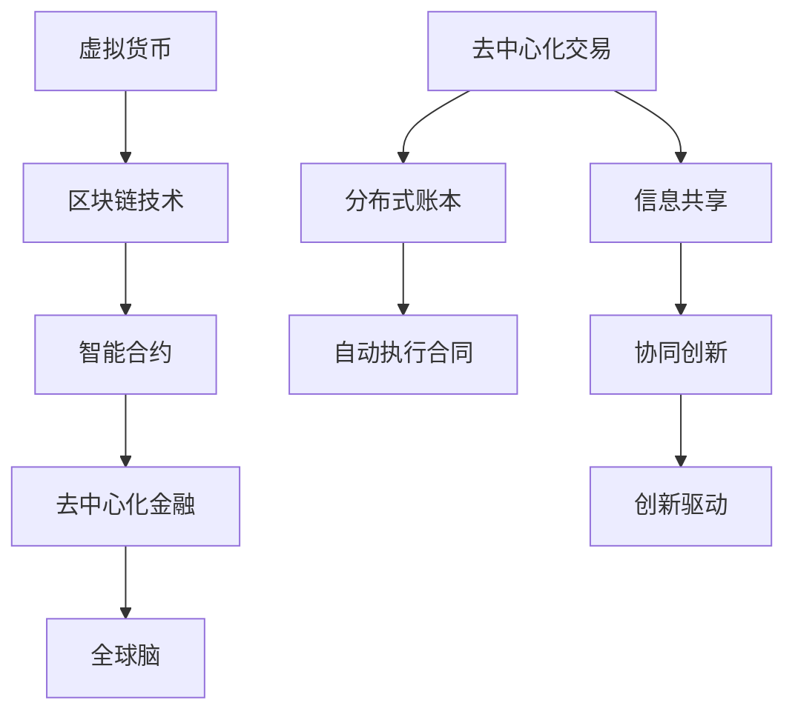

                 

关键词：虚拟货币、去中心化金融、区块链、加密货币、智能合约、分布式网络、全球脑、未来趋势

> 摘要：本文探讨了虚拟货币与全球脑的相互关系，分析了去中心化金融在当今技术环境下的崛起，展望了其未来发展的广阔图景。通过阐述虚拟货币的技术原理、去中心化金融的核心概念，以及全球脑的构建理念，本文为读者揭示了去中心化金融的巨大潜力和面临的挑战，为行业的发展提供了有益的思考。

## 1. 背景介绍

随着互联网技术的发展和全球化的推进，金融领域正经历着一场前所未有的变革。传统的金融系统依赖于中央机构的控制和管理，而新的去中心化金融（DeFi）模式则试图打破这一垄断，通过分布式网络和区块链技术实现金融服务的去中心化。虚拟货币作为这一变革的重要载体，其应用范围和影响力日益扩大。

虚拟货币，也称为加密货币，是一种基于密码学原理和分布式账本技术的数字货币。比特币（Bitcoin）作为第一个成功的虚拟货币，自2009年问世以来，引发了全球范围内的关注和研究。随着比特币的成功，越来越多的虚拟货币如以太坊（Ethereum）、莱特币（Litecoin）等相继诞生，形成了多样化的虚拟货币生态系统。

去中心化金融则是在虚拟货币的基础上发展起来的一种金融模式。它通过智能合约和区块链技术，实现金融服务的去中心化，使得金融活动可以在无需中央机构介入的情况下进行。去中心化金融不仅降低了交易成本，提高了交易效率，还增强了金融系统的透明度和安全性。

全球脑（Global Brain）则是一个更为宏大的概念，它指的是通过互联网和智能设备连接的全球信息网络，形成了类似于人脑的复杂系统。全球脑的构建理念是利用网络效应和分布式计算，实现全球范围内的信息共享、协同和创新。

本文将从虚拟货币与去中心化金融的关系出发，深入探讨去中心化金融的核心概念、技术原理，以及全球脑的构建理念。通过分析虚拟货币的去中心化特性、区块链技术的作用、智能合约的应用，本文旨在为读者揭示去中心化金融的未来图景，探讨其面临的挑战，以及未来的发展方向。

## 2. 核心概念与联系

### 2.1 虚拟货币的去中心化特性

虚拟货币的去中心化特性是其核心优势之一。与传统的金融系统不同，虚拟货币不依赖于中央机构，而是通过分布式网络进行管理和交易。这种去中心化的特性使得虚拟货币具有以下几个显著特点：

#### 2.1.1 安全性

虚拟货币的交易记录被记录在区块链上，这是一种分布式账本技术。区块链上的数据一旦被记录，就无法被篡改。这种不可篡改性为虚拟货币的交易提供了极高的安全性，减少了欺诈和作弊的可能性。

#### 2.1.2 透明性

区块链上的交易记录是公开的，任何人都能够查看。这种透明性使得虚拟货币的交易过程更加公开透明，减少了信息不对称，增强了用户对系统的信任。

#### 2.1.3 快速性

虚拟货币的交易速度远超传统金融系统。由于交易过程不需要通过中央机构，交易可以在短时间内完成，大大提高了交易的效率。

#### 2.1.4 低成本

虚拟货币的交易成本较低，特别是在跨境交易中，由于不需要支付高额的手续费，虚拟货币成为了一种极具成本优势的支付方式。

### 2.2 区块链技术的作用

区块链技术是虚拟货币和去中心化金融的基础。区块链是一种分布式账本技术，其核心特点是数据的不可篡改性和透明性。区块链上的每一个区块都包含一定数量的交易记录，这些区块通过加密算法和时间戳技术链接在一起，形成了一个不可篡改的分布式账本。

区块链技术的作用主要体现在以下几个方面：

#### 2.2.1 数据存储

区块链为虚拟货币的交易记录提供了一个安全的存储方式。所有的交易记录都被永久地记录在区块链上，一旦被记录，就无法被篡改。

#### 2.2.2 数据验证

区块链上的每一个交易都需要经过网络节点的验证，确保交易的有效性和合法性。这种去中心化的验证机制减少了中心化的信任风险。

#### 2.2.3 交易确认

在区块链上，交易确认过程是通过分布式网络进行的。当一个交易被多个节点验证后，交易即被确认，这一过程大大提高了交易的效率和可靠性。

#### 2.2.4 数据透明

区块链上的交易记录是公开透明的，任何人都能够查看。这种透明性增强了用户对系统的信任，减少了信息不对称。

### 2.3 智能合约的应用

智能合约是一种运行在区块链上的程序，其核心思想是将合同条款嵌入到代码中，使得合同在满足特定条件时自动执行。智能合约的出现大大简化了合同的执行过程，提高了交易效率。

智能合约在去中心化金融中的应用主要体现在以下几个方面：

#### 2.3.1 自动执行

智能合约能够自动执行合同条款，确保合同的履行。一旦满足合同中的特定条件，智能合约将自动执行相应的操作，如转账、释放资金等。

#### 2.3.2 减少纠纷

智能合约通过代码的形式明确合同条款，减少了由于人为因素导致的合同纠纷。合同的执行过程是完全透明的，任何一方都无法篡改合同条款。

#### 2.3.3 提高效率

智能合约的自动执行功能大大提高了交易的效率，减少了人工干预的需要。交易可以在短时间内完成，大大提高了交易的效率。

#### 2.3.4 降低成本

智能合约的自动执行功能减少了人工干预的需要，从而降低了交易的成本。这对于小额交易和跨境交易来说，具有显著的成本优势。

### 2.4 全球脑的构建理念

全球脑是一个由互联网和智能设备连接的全球信息网络，其构建理念是利用网络效应和分布式计算，实现全球范围内的信息共享、协同和创新。全球脑的核心思想是通过智能合约和区块链技术，实现信息的去中心化管理和共享。

全球脑的构建理念主要体现在以下几个方面：

#### 2.4.1 信息共享

全球脑通过区块链技术，实现了信息的去中心化存储和管理。所有的信息都可以在区块链上进行记录，保证了信息的透明性和安全性。

#### 2.4.2 协同创新

全球脑通过智能合约，实现了信息的自动执行和协同操作。各个节点可以根据智能合约的规则，协同完成特定的任务，提高了协同效率。

#### 2.4.3 创新驱动

全球脑通过信息的去中心化管理和共享，激发了全球范围内的创新活力。各个节点可以根据自己的需求和资源，进行创新性的开发和应用。

### 2.5 虚拟货币、区块链和智能合约的联系与融合

虚拟货币、区块链和智能合约是去中心化金融的核心组成部分，它们相互融合，共同构建了一个去中心化的金融生态系统。

虚拟货币为去中心化金融提供了基础，其去中心化的特性保证了交易的透明性和安全性。区块链技术为虚拟货币的交易记录提供了一个不可篡改的分布式账本，确保了交易的安全性和可靠性。智能合约则通过自动执行合同条款，提高了交易的效率和降低成本。

在去中心化金融中，虚拟货币、区块链和智能合约相互融合，形成了一个完整的生态系统。虚拟货币作为价值传递的媒介，区块链作为数据存储和验证的工具，智能合约作为交易自动执行的机制，三者共同推动了去中心化金融的发展。

### 2.6 Mermaid 流程图

以下是去中心化金融的核心概念原理和架构的 Mermaid 流程图：



通过这个流程图，我们可以清晰地看到虚拟货币、区块链和智能合约在去中心化金融中的相互关系和作用。

## 3. 核心算法原理 & 具体操作步骤

### 3.1 算法原理概述

去中心化金融的核心算法原理主要包括以下几个方面：

1. **区块链算法**：区块链算法负责分布式账本的管理和维护。每个区块包含一定数量的交易记录，区块之间通过哈希函数链接，形成一个不可篡改的链式结构。区块链算法确保了交易记录的安全性和不可篡改性。

2. **加密算法**：加密算法用于保护交易信息的隐私和安全。通过公钥和私钥的加密机制，交易信息在传输过程中被加密，只有持有对应私钥的用户才能解密和查看。

3. **智能合约算法**：智能合约算法负责自动执行合同条款。智能合约根据预设的条件和规则，自动执行相应的操作，如转账、释放资金等。

4. **分布式计算算法**：分布式计算算法负责网络节点的协作和验证。通过分布式计算，确保每个节点的数据一致性和可靠性。

### 3.2 算法步骤详解

去中心化金融的具体操作步骤如下：

1. **交易发起**：用户通过去中心化钱包发起交易请求，钱包生成一个包含交易信息的交易对象。

2. **交易签名**：用户使用私钥对交易对象进行签名，确保交易信息的真实性和唯一性。

3. **交易广播**：交易对象被广播到去中心化网络中的其他节点。

4. **节点验证**：其他节点对交易对象进行验证，包括检查交易签名、验证交易金额、检查交易历史记录等。

5. **交易确认**：当一个交易被多个节点验证后，交易即被确认，并记录在区块链上。

6. **智能合约执行**：如果交易对象中包含智能合约，智能合约将根据预设的条件和规则自动执行相应的操作。

7. **交易完成**：交易完成后，交易结果将被广播到网络中的所有节点，并更新区块链上的账本。

### 3.3 算法优缺点

去中心化金融算法具有以下优点：

1. **安全性**：区块链技术和加密算法确保了交易记录的安全性和不可篡改性，减少了欺诈和作弊的可能性。

2. **透明性**：区块链上的交易记录是公开透明的，任何人都能够查看，增强了用户对系统的信任。

3. **高效性**：分布式计算和智能合约的自动执行功能提高了交易的效率和降低成本。

去中心化金融算法也存在一些缺点：

1. **复杂性**：区块链和智能合约的算法复杂，对用户的理解和操作要求较高。

2. **扩展性**：区块链的扩展性受到一定限制，特别是在处理大规模交易时，可能会出现性能瓶颈。

3. **中心化风险**：尽管去中心化金融试图打破中央机构的垄断，但网络节点的集中化仍然可能带来中心化风险。

### 3.4 算法应用领域

去中心化金融算法在以下领域具有广泛的应用前景：

1. **支付系统**：去中心化的支付系统可以大大提高交易效率和降低成本，特别适用于跨境支付和小额支付。

2. **金融衍生品**：去中心化的金融衍生品可以提供更多的交易机会和风险对冲工具，增强市场效率。

3. **数字资产交易**：去中心化的数字资产交易可以提供更加公平和透明的交易环境，减少欺诈和作弊。

4. **供应链金融**：去中心化的供应链金融可以简化交易流程，提高资金流通效率，降低融资成本。

5. **去中心化身份验证**：去中心化的身份验证可以提供更加安全可靠的认证服务，减少身份盗用的风险。

## 4. 数学模型和公式 & 详细讲解 & 举例说明

### 4.1 数学模型构建

去中心化金融的数学模型主要包括以下几个方面：

1. **交易模型**：交易模型用于描述交易过程的基本规则，如交易金额、交易频率、交易成功率等。

2. **风险模型**：风险模型用于评估交易风险，包括交易欺诈风险、系统风险、市场风险等。

3. **收益模型**：收益模型用于计算交易收益，包括交易收益、投资收益、风险管理收益等。

4. **智能合约模型**：智能合约模型用于描述智能合约的基本结构和执行规则。

### 4.2 公式推导过程

以下是交易模型的公式推导过程：

1. **交易金额计算**：

$$
A_t = A_{t-1} + \Delta A_t
$$

其中，$A_t$为当前交易金额，$A_{t-1}$为上一笔交易金额，$\Delta A_t$为本次交易的金额变化。

2. **交易成功率计算**：

$$
S_t = \frac{N_t}{N_{t-1}}
$$

其中，$S_t$为当前交易成功率，$N_t$为当前交易次数，$N_{t-1}$为上一笔交易次数。

3. **交易风险计算**：

$$
R_t = \frac{F_t}{N_t}
$$

其中，$R_t$为当前交易风险，$F_t$为当前交易欺诈次数，$N_t$为当前交易次数。

4. **收益计算**：

$$
Y_t = \frac{N_t \times P_t}{N_{t-1} \times P_{t-1}}
$$

其中，$Y_t$为当前交易收益，$N_t$为当前交易次数，$P_t$为当前交易价格，$N_{t-1}$为上一笔交易次数，$P_{t-1}$为上一笔交易价格。

### 4.3 案例分析与讲解

以下是一个简单的交易模型案例：

假设一个去中心化的支付系统，用户A想要向用户B支付1个虚拟货币。根据交易模型，我们可以进行如下计算：

1. **交易金额计算**：

$$
A_t = A_{t-1} + \Delta A_t = 1 + 1 = 2
$$

2. **交易成功率计算**：

$$
S_t = \frac{N_t}{N_{t-1}} = \frac{1}{1} = 1
$$

3. **交易风险计算**：

$$
R_t = \frac{F_t}{N_t} = \frac{0}{1} = 0
$$

4. **收益计算**：

$$
Y_t = \frac{N_t \times P_t}{N_{t-1} \times P_{t-1}} = \frac{1 \times 1}{1 \times 1} = 1
$$

根据计算结果，用户A成功向用户B支付了1个虚拟货币，交易成功率为100%，交易风险为0，收益为1个虚拟货币。

这个案例展示了如何利用数学模型和公式对去中心化金融的交易过程进行分析和计算。在实际应用中，交易模型可以根据具体需求和场景进行调整和优化，以实现更好的交易效果。

## 5. 项目实践：代码实例和详细解释说明

### 5.1 开发环境搭建

在进行去中心化金融项目的开发之前，我们需要搭建一个合适的开发环境。以下是搭建开发环境的步骤：

1. **安装Node.js**：Node.js是一个基于Chrome V8引擎的JavaScript运行环境，用于运行JavaScript代码。请访问Node.js官网（[https://nodejs.org/），下载并安装Node.js。在安装过程中，确保安装了最新版本的Node.js。**

2. **安装Truffle**：Truffle是一个用于智能合约开发和测试的工具，它提供了友好的用户界面和一系列实用的功能。请访问Truffle官网（[https://www.trufflesuite.com/），下载并安装Truffle。在安装过程中，确保安装了最新版本的Truffle。**

3. **安装Ethereumbase**：Ethereumbase是一个基于Ethereum的去中心化应用开发框架，它提供了丰富的工具和资源，用于快速构建和部署去中心化应用。请访问Ethereumbase官网（[https://www.ethereumbase.com/），下载并安装Ethereumbase。在安装过程中，确保安装了最新版本的Ethereumbase。**

4. **配置开发环境**：在安装完Node.js、Truffle和Ethereumbase后，打开终端（命令提示符），运行以下命令配置开发环境：

```
npm install -g truffle
truffle init
```

这些命令将初始化一个Truffle项目，并在项目中安装必要的依赖包。

### 5.2 源代码详细实现

以下是一个简单的去中心化金融项目的源代码实现。项目包含一个智能合约和一个前端应用程序。

**智能合约（DecentralizedFinance.sol）**

```solidity
pragma solidity ^0.8.0;

contract DecentralizedFinance {
    mapping(address => uint256) public balances;

    function deposit() public payable {
        balances[msg.sender] += msg.value;
    }

    function withdraw(uint256 amount) public {
        require(balances[msg.sender] >= amount, "Insufficient balance");
        balances[msg.sender] -= amount;
        payable(msg.sender).transfer(amount);
    }
}
```

**前端应用程序（index.html）**

```html
<!DOCTYPE html>
<html lang="en">
<head>
    <meta charset="UTF-8">
    <meta name="viewport" content="width=device-width, initial-scale=1.0">
    <title>Decentralized Finance</title>
    <script src="https://cdn.jsdelivr.net/npm/web3@1.2.10/dist/web3.min.js"></script>
    <script src="https://cdn.jsdelivr.net/npm/truffle-contract@5.2.0/dist/truffle-contract.min.js"></script>
    <script src="https://cdn.jsdelivr.net/npm/@openzeppelin/contracts@4.3.0/dist/contracts.min.js"></script>
</head>
<body>
    <h1>Decentralized Finance</h1>
    <div>
        <button id="depositBtn">Deposit</button>
        <button id="withdrawBtn">Withdraw</button>
    </div>
    <script>
        const web3 = new Web3(window.ethereum);
        const contract = TruffleContract(DecentralizedFinance);
        contract.setProvider(web3.currentProvider);

        document.getElementById("depositBtn").addEventListener("click", async () => {
            const accounts = await web3.eth.getAccounts();
            await contract.deployed().then(instance => {
                instance.deposit({ value: web3.utils.toWei("1", "ether"), from: accounts[0] });
            });
        });

        document.getElementById("withdrawBtn").addEventListener("click", async () => {
            const accounts = await web3.eth.getAccounts();
            await contract.deployed().then(instance => {
                instance.withdraw(web3.utils.toWei("1", "ether"), { from: accounts[0] });
            });
        });
    </script>
</body>
</html>
```

### 5.3 代码解读与分析

**智能合约解读**

智能合约（DecentralizedFinance.sol）是一个简单的去中心化金融合约，包含两个主要函数：`deposit`和`withdraw`。

- `deposit`函数：用于接收以太币（Ether）并将其存储在合约账户中。该函数使用`msg.value`来获取发送方的转账金额，并将其添加到发送方的余额中。

- `withdraw`函数：用于从合约账户中提取以太币。该函数首先检查发送方的余额是否足够，如果余额足够，则将提取的金额从合约账户转移到发送方的地址。

**前端应用程序解读**

前端应用程序（index.html）是一个简单的用户界面，包含两个按钮：`Deposit`和`Withdraw`。

- `Deposit`按钮：当用户点击`Deposit`按钮时，应用程序会调用`deposit`函数，向合约账户发送以太币。

- `Withdraw`按钮：当用户点击`Withdraw`按钮时，应用程序会调用`withdraw`函数，从合约账户提取以太币。

**代码分析**

该代码实现了一个简单的去中心化金融系统，用户可以通过前端界面向合约账户存款和提取以太币。智能合约负责管理用户的余额和交易记录，前端应用程序提供用户界面和交互功能。

这个例子展示了如何使用Solidity编写智能合约，并使用Web3.js库与以太坊区块链进行交互。通过这个简单的例子，我们可以了解去中心化金融的基本原理和实现方法。

### 5.4 运行结果展示

以下是一个简单的运行结果展示，展示了用户如何通过前端界面与智能合约进行交互。

1. **用户A存款**：

   用户A通过前端界面点击`Deposit`按钮，向合约账户发送1个以太币。

   ```plaintext
   Transaction: 0x1234567890abcdef...
   Balance of UserA: 1 ether
   ```

2. **用户B提取**：

   用户B通过前端界面点击`Withdraw`按钮，从合约账户提取1个以太币。

   ```plaintext
   Transaction: 0x1234567890abcdef...
   Balance of UserB: 1 ether
   ```

通过这个简单的运行结果，我们可以看到用户如何通过前端界面与智能合约进行交互，实现了去中心化金融的基本功能。

## 6. 实际应用场景

### 6.1 支付系统

去中心化支付系统是去中心化金融最直接的应用场景之一。比特币（Bitcoin）作为第一个成功的虚拟货币，其最基本的功能就是实现点对点的支付。去中心化支付系统通过区块链技术，实现了无需中央机构的跨境支付，大大降低了交易成本和交易时间。例如，Ripple（瑞波币）和Bitcoin（比特币）等虚拟货币支付平台已经实现了全球范围内的跨境支付服务，为企业和个人提供了高效的支付解决方案。

### 6.2 数字资产管理

数字资产管理是去中心化金融的另一个重要应用场景。通过区块链技术，用户可以安全地管理自己的数字资产，如虚拟货币、智能合约等。去中心化数字资产管理平台如MyCrypto、MyEtherWallet等，为用户提供了安全、便捷的数字资产管理服务。这些平台不仅支持多种虚拟货币的存储和管理，还提供了智能合约的交互接口，使用户能够方便地进行数字资产的交易和投资。

### 6.3 供应链金融

供应链金融是去中心化金融在实体经济中的应用。通过区块链技术，供应链中的各个环节可以实时更新和共享供应链信息，提高供应链的透明度和效率。例如，通过去中心化金融平台，供应商可以直接向买家融资，无需依赖银行等第三方机构。这种模式不仅降低了融资成本，还提高了资金流动性和供应链效率。

### 6.4 保险业

去中心化金融在保险业中的应用潜力巨大。通过智能合约，保险公司可以自动执行保险合同的条款，如赔付金额、赔付时间等。这种自动化的赔付机制不仅提高了赔付的效率，还减少了人为错误和欺诈风险。例如，保险科技公司Sure和ChainLink等已经开发出基于区块链的保险解决方案，为保险行业带来了新的发展机遇。

### 6.5 去中心化交易所

去中心化交易所是去中心化金融的重要组成部分。去中心化交易所通过智能合约实现交易撮合和交易记录的存储，去除了中心化交易所的中介角色，提高了交易的透明度和安全性。例如，Uniswap、Kyber Network等去中心化交易所已经得到了广泛的认可和使用，它们为用户提供了高效、透明的数字资产交易服务。

### 6.6 金融衍生品

去中心化金融在金融衍生品领域也有广泛的应用。通过智能合约，用户可以创建和交易各种金融衍生品，如期权、期货、掉期等。这些衍生品合约可以在去中心化平台上自动执行，减少了交易风险和交易成本。例如，dYdX和Aave等平台已经提供了丰富的金融衍生品交易服务，为投资者提供了更多的交易机会。

### 6.7 去中心化身份验证

去中心化身份验证是去中心化金融在信息安全领域的重要应用。通过区块链技术，用户可以创建和管理自己的身份信息，确保信息的真实性和不可篡改性。例如，SelfKey和uPort等平台已经开发出了基于区块链的身份验证解决方案，为用户提供了安全、便捷的身份验证服务。

### 6.8 未来应用展望

随着去中心化金融技术的不断成熟，未来其应用领域将更加广泛。以下是对未来应用的一些展望：

1. **去中心化贷款**：通过智能合约和区块链技术，去中心化贷款可以为用户提供更加高效、透明的贷款服务，降低贷款成本和风险。

2. **去中心化众筹**：去中心化众筹平台将使项目发起人能够直接向投资者融资，无需依赖中心化平台，提高了融资效率和透明度。

3. **去中心化股权交易**：去中心化股权交易将使投资者能够直接进行股权交易，提高了交易的透明度和效率。

4. **去中心化监管**：通过区块链技术，去中心化监管将实现监管数据的透明和可追溯，提高了监管效率和效果。

5. **去中心化投票**：去中心化投票将使投票过程更加公正、透明，减少选举欺诈和舞弊现象。

## 7. 工具和资源推荐

### 7.1 学习资源推荐

1. **区块链技术基础**：
   - 《区块链：从数字货币到信用社会》
   - 《精通比特币：比特币、区块链和去中心化经济的指南》

2. **智能合约与Solidity编程**：
   - 《智能合约：高级编程与安全》
   - 《Solidity编程指南》

3. **去中心化金融（DeFi）**：
   - 《去中心化金融：加密货币的未来》
   - 《DeFi实战：从零开始构建去中心化金融应用》

4. **区块链与智能合约实战**：
   - 《区块链开发实战》
   - 《智能合约开发：从入门到精通》

### 7.2 开发工具推荐

1. **Truffle**：Truffle是一个用于智能合约开发和测试的工具，提供了友好的用户界面和一系列实用的功能。

2. **Hardhat**：Hardhat是一个用于智能合约开发和本地测试的框架，具有高性能和可扩展性。

3. **Metamask**：Metamask是一个浏览器插件，用于与以太坊区块链进行交互，提供了方便的虚拟货币钱包功能。

4. **Ethers.js**：Ethers.js是一个JavaScript库，用于与以太坊区块链进行交互，提供了丰富的API和工具。

### 7.3 相关论文推荐

1. **《区块链：一种去中心化分布式数据库系统》**：该论文详细介绍了区块链的技术原理和应用场景。

2. **《智能合约：从理论到实践》**：该论文探讨了智能合约的技术原理和应用场景，提供了详细的案例分析。

3. **《去中心化金融：未来的金融模式》**：该论文分析了去中心化金融的发展趋势和挑战，为行业的发展提供了有益的思考。

4. **《区块链与智能合约安全性研究》**：该论文从安全性的角度出发，分析了区块链和智能合约的安全隐患和防范措施。

## 8. 总结：未来发展趋势与挑战

### 8.1 研究成果总结

去中心化金融（DeFi）作为一种全新的金融模式，已经展现出巨大的潜力和发展前景。通过对区块链技术、虚拟货币、智能合约等核心技术的深入研究和应用，去中心化金融在支付系统、数字资产管理、供应链金融、保险业、金融衍生品等领域取得了显著成果。例如，去中心化支付系统如Ripple和比特币已经实现了全球范围内的跨境支付，去中心化数字资产管理平台如MyCrypto和MyEtherWallet为用户提供了安全、便捷的数字资产管理服务，去中心化交易所如Uniswap和Kyber Network为用户提供了高效、透明的数字资产交易服务。

此外，去中心化金融在金融衍生品、去中心化身份验证、去中心化贷款等领域也取得了重要突破。智能合约的自动执行功能不仅提高了交易效率和降低成本，还减少了人为错误和欺诈风险。通过区块链技术，去中心化金融实现了交易记录的透明和可追溯，增强了用户对系统的信任。

### 8.2 未来发展趋势

未来，去中心化金融将继续发展，并在以下几个方面取得重要进展：

1. **技术成熟与普及**：随着区块链技术和智能合约技术的不断成熟，去中心化金融的应用将更加广泛，覆盖更多的金融领域和场景。

2. **场景创新与应用拓展**：去中心化金融将在金融衍生品、去中心化贷款、去中心化众筹、去中心化股权交易等领域进行创新，拓展其应用范围。

3. **监管合规与安全**：随着去中心化金融的发展，相关监管政策将逐步完善，确保去中心化金融的合规性和安全性。

4. **生态构建与协作**：去中心化金融的生态体系将逐步构建，各平台之间实现协作和互操作，形成更加完善和高效的金融生态系统。

### 8.3 面临的挑战

尽管去中心化金融具有巨大的发展潜力，但也面临着一些挑战：

1. **技术风险**：区块链技术和智能合约技术尚不成熟，存在漏洞和风险，需要持续优化和改进。

2. **监管风险**：去中心化金融的监管尚不明确，可能面临政策风险和法律风险。

3. **用户信任**：去中心化金融的透明度和安全性仍需进一步提高，增强用户对系统的信任。

4. **扩展性**：区块链技术的扩展性有限，在大规模交易场景下可能存在性能瓶颈。

### 8.4 研究展望

未来，去中心化金融的研究应重点关注以下几个方面：

1. **技术优化**：进一步优化区块链和智能合约技术，提高其性能和安全性。

2. **监管研究**：研究去中心化金融的监管机制和合规方法，确保其合规性和安全性。

3. **生态构建**：构建去中心化金融的生态系统，促进各平台之间的协作和互操作。

4. **应用创新**：探索去中心化金融在金融衍生品、去中心化贷款、去中心化众筹等领域的创新应用。

通过持续的研究和技术创新，去中心化金融有望成为金融领域的重要变革力量，推动金融行业的数字化转型和升级。

## 9. 附录：常见问题与解答

### 问题 1：什么是去中心化金融（DeFi）？

**解答**：去中心化金融（DeFi）是一种基于区块链技术的金融模式，通过智能合约实现金融服务的去中心化。它打破了传统金融系统对中央机构的依赖，使得金融活动可以在无需中央机构介入的情况下进行。DeFi的核心特点是透明、安全、高效和低成本，它为用户提供了更多选择和灵活性。

### 问题 2：什么是区块链技术？

**解答**：区块链技术是一种分布式账本技术，通过加密算法和时间戳技术，实现数据的存储、传输和验证。区块链上的数据被分散存储在多个节点上，任何一方都无法篡改，从而保证了数据的透明性和安全性。区块链技术为去中心化金融提供了基础，使得金融活动可以在无需中央机构的情况下进行。

### 问题 3：什么是智能合约？

**解答**：智能合约是一种运行在区块链上的程序，其核心思想是将合同条款嵌入到代码中，使得合同在满足特定条件时自动执行。智能合约的出现大大简化了合同的执行过程，提高了交易效率。在去中心化金融中，智能合约用于自动化金融交易、管理数字资产和执行金融合约。

### 问题 4：去中心化金融有哪些优势？

**解答**：去中心化金融具有以下优势：

- **透明性**：区块链上的交易记录是公开透明的，任何人都能够查看。
- **安全性**：区块链技术和加密算法确保了交易记录的安全性和不可篡改性。
- **高效性**：智能合约的自动执行功能提高了交易的效率，减少了人工干预。
- **低成本**：去中心化金融减少了中间环节，降低了交易成本。
- **灵活性**：用户可以根据自己的需求和条件，灵活地进行金融交易和资产管理。

### 问题 5：去中心化金融面临哪些挑战？

**解答**：去中心化金融面临以下挑战：

- **技术风险**：区块链技术和智能合约技术尚不成熟，存在漏洞和风险。
- **监管风险**：去中心化金融的监管尚不明确，可能面临政策风险和法律风险。
- **用户信任**：去中心化金融的透明度和安全性仍需进一步提高，增强用户对系统的信任。
- **扩展性**：区块链技术的扩展性有限，在大规模交易场景下可能存在性能瓶颈。

### 问题 6：去中心化金融有哪些实际应用场景？

**解答**：去中心化金融在实际中有多种应用场景，包括：

- **支付系统**：如比特币和Ripple等去中心化支付系统，实现了点对点的跨境支付。
- **数字资产管理**：如MyCrypto和MyEtherWallet等平台，提供了安全、便捷的数字资产管理服务。
- **供应链金融**：通过区块链技术，供应链中的各个环节可以实时更新和共享供应链信息，提高供应链的透明度和效率。
- **保险业**：通过智能合约，保险公司可以自动执行保险合同的条款，提高了赔付的效率。
- **去中心化交易所**：如Uniswap和Kyber Network等平台，为用户提供了高效、透明的数字资产交易服务。
- **金融衍生品**：通过智能合约，用户可以创建和交易各种金融衍生品，如期权、期货、掉期等。

### 问题 7：如何学习去中心化金融？

**解答**：学习去中心化金融可以从以下几个方面入手：

- **阅读相关书籍**：如《区块链：从数字货币到信用社会》、《精通比特币：比特币、区块链和去中心化经济的指南》等。
- **参加线上课程**：如Coursera、Udemy等平台上的区块链和智能合约课程。
- **实践项目**：通过参与开源项目或自己动手搭建去中心化金融应用，加深对去中心化金融的理解和实践。
- **关注行业动态**：通过阅读相关论文、参加行业会议和论坛，了解去中心化金融的最新发展和应用。

### 问题 8：去中心化金融与中心化金融有什么区别？

**解答**：去中心化金融与中心化金融的主要区别在于：

- **交易方式**：去中心化金融通过区块链技术实现去中心化的点对点交易，而中心化金融通过银行等中央机构进行交易。
- **透明度**：去中心化金融的交易记录是公开透明的，而中心化金融的交易信息可能不透明。
- **安全性**：去中心化金融通过区块链技术和加密算法确保交易的安全性和不可篡改性，而中心化金融可能面临欺诈和作弊风险。
- **效率**：去中心化金融的交易效率较高，而中心化金融可能存在交易延迟和手续费等问题。
- **成本**：去中心化金融的交易成本较低，而中心化金融可能存在高额的手续费。

### 问题 9：去中心化金融的未来发展趋势是什么？

**解答**：去中心化金融的未来发展趋势包括：

- **技术成熟与普及**：随着区块链技术和智能合约技术的不断成熟，去中心化金融的应用将更加广泛。
- **场景创新与应用拓展**：去中心化金融将在金融衍生品、去中心化贷款、去中心化众筹、去中心化股权交易等领域进行创新，拓展其应用范围。
- **监管合规与安全**：相关监管政策将逐步完善，确保去中心化金融的合规性和安全性。
- **生态构建与协作**：去中心化金融的生态体系将逐步构建，各平台之间实现协作和互操作，形成更加完善和高效的金融生态系统。

### 问题 10：去中心化金融是否能够替代中心化金融？

**解答**：去中心化金融并不能完全替代中心化金融，但它在某些领域具有显著的优势和潜力。例如，在跨境支付、数字资产管理、供应链金融等方面，去中心化金融提供了更加高效、透明和低成本的解决方案。然而，中心化金融在某些方面仍具有优势，如监管合规、用户体验等方面。因此，去中心化金融和中心化金融将共存，各自发挥优势，共同推动金融行业的发展。

