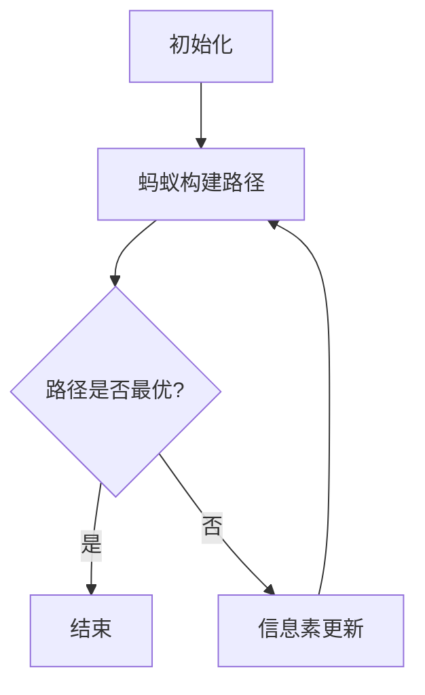

                 

关键词：蚁群算法，优化，算法原理，应用场景，代码实例

摘要：本文将深入探讨蚁群算法（Ant Colony Optimization, ACO）的原理、应用及其实现。通过详细的数学模型、公式推导和实际代码实例，帮助读者更好地理解和运用这一经典优化算法。

## 1. 背景介绍

蚁群算法（ACO）是一种模拟自然界中蚂蚁觅食行为的优化算法。蚂蚁在寻找食物的过程中，会释放一种名为信息素（pheromone）的化学物质。这条路径上的信息素浓度越高，其他蚂蚁选择这条路径的概率就越大。通过这一机制，蚂蚁能够逐步找到最优路径。

蚁群算法最早由Marco Dorigo在1992年提出，它属于分布式优化算法的一种，广泛应用于组合优化问题，如旅行商问题（TSP）、车辆路径问题（VRP）等。

## 2. 核心概念与联系

### 2.1 核心概念

- **信息素（Pheromone）**：蚂蚁在路径上留下的化学物质。
- **启发因子（Heuristic Factor）**：表示路径的启发度，如路径长度、距离等。
- **选择路径的概率**：蚂蚁选择路径的概率取决于该路径上的信息素浓度和启发因子。

### 2.2 联系

蚁群算法通过模拟蚂蚁觅食行为，利用信息素浓度和启发因子来引导蚂蚁找到最优路径。其核心机制可以概括为以下几个步骤：

1. **初始化**：设置初始信息素浓度和启发因子。
2. **蚂蚁构建路径**：每只蚂蚁从起点出发，根据当前路径的信息素浓度和启发因子选择下一步路径。
3. **信息素更新**：蚂蚁在路径上留下信息素，同时根据路径长度更新信息素浓度。
4. **重复步骤2和3**：直到所有蚂蚁完成路径构建，或者达到预设的迭代次数。

### 2.3 Mermaid 流程图



## 3. 核心算法原理 & 具体操作步骤

### 3.1 算法原理概述

蚁群算法是一种基于概率的优化算法，通过模拟蚂蚁的觅食行为来寻找最优路径。算法的核心思想是：蚂蚁在路径上留下信息素，其他蚂蚁根据信息素浓度和启发因子选择路径。随着算法的迭代，信息素浓度会逐渐引导蚂蚁找到最优路径。

### 3.2 算法步骤详解

1. **初始化**：设置初始信息素浓度和启发因子。
2. **蚂蚁构建路径**：每只蚂蚁从起点出发，根据当前路径的信息素浓度和启发因子选择下一步路径。选择路径的概率公式为：

   \[ P_{ij}(t) = \frac{[\tau_{ij}(t)^\alpha \cdot \eta_{ij}(t)^\beta]}{\sum_{k \in \text{allowed}} [\tau_{ik}(t)^\alpha \cdot \eta_{ik}(t)^\beta]} \]

   其中，\(\tau_{ij}(t)\)为路径\(i \rightarrow j\)上的信息素浓度，\(\eta_{ij}(t)\)为路径\(i \rightarrow j\)的启发因子，\(\alpha\)和\(\beta\)分别为信息素和启发因子的权重。

3. **信息素更新**：蚂蚁在路径上留下信息素，同时根据路径长度更新信息素浓度。信息素更新公式为：

   \[ \tau_{ij}(t + 1) = (1 - \rho) \cdot \tau_{ij}(t) + \sum_{k = 1}^n \Delta \tau_{ij}(t) \]

   其中，\(\rho\)为信息素挥发率，\(\Delta \tau_{ij}(t)\)为蚂蚁\(k\)在路径\(i \rightarrow j\)上留下的信息素量。

4. **迭代**：重复步骤2和3，直到所有蚂蚁完成路径构建，或者达到预设的迭代次数。

### 3.3 算法优缺点

#### 优点：

- **鲁棒性**：ACO对参数设置不敏感，具有较强的鲁棒性。
- **自适应性**：ACO能自动适应环境变化，逐步找到最优路径。
- **分布性**：ACO是一种分布式算法，可以并行计算。

#### 缺点：

- **计算复杂度**：ACO的计算复杂度较高，尤其是当蚂蚁数量和路径数量较大时。
- **收敛速度**：ACO的收敛速度相对较慢，可能需要大量迭代才能找到最优解。

### 3.4 算法应用领域

蚁群算法广泛应用于组合优化问题，如：

- **旅行商问题（TSP）**：求解从多个城市出发，访问每个城市一次并返回起点的最短路径。
- **车辆路径问题（VRP）**：求解最小化车辆总行驶距离，同时满足货物需求和配送约束的路径。
- **调度问题**：求解生产任务的最优调度顺序，以最小化生产成本或最大化生产效率。

## 4. 数学模型和公式 & 详细讲解 & 举例说明

### 4.1 数学模型构建

蚁群算法的数学模型主要包括信息素更新公式和选择路径的概率公式。

### 4.2 公式推导过程

蚁群算法的信息素更新公式为：

\[ \tau_{ij}(t + 1) = (1 - \rho) \cdot \tau_{ij}(t) + \sum_{k = 1}^n \Delta \tau_{ij}(t) \]

其中，\(\rho\)为信息素挥发率，\(\Delta \tau_{ij}(t)\)为蚂蚁\(k\)在路径\(i \rightarrow j\)上留下的信息素量。

选择路径的概率公式为：

\[ P_{ij}(t) = \frac{[\tau_{ij}(t)^\alpha \cdot \eta_{ij}(t)^\beta]}{\sum_{k \in \text{allowed}} [\tau_{ik}(t)^\alpha \cdot \eta_{ik}(t)^\beta]} \]

其中，\(\alpha\)和\(\beta\)分别为信息素和启发因子的权重，\(\tau_{ij}(t)\)为路径\(i \rightarrow j\)上的信息素浓度，\(\eta_{ij}(t)\)为路径\(i \rightarrow j\)的启发因子。

### 4.3 案例分析与讲解

假设有5个城市\(A, B, C, D, E\)，初始信息素浓度为0，蚂蚁数量为10只。假设启发因子为路径长度，即\(\eta_{ij} = L_{ij}\)。信息素挥发率\(\rho = 0.1\)，信息素初始浓度\(\tau_{ij}^0 = 1\)。

1. **初始化**：

   所有城市的信息素浓度均为1。

2. **蚂蚁构建路径**：

   每只蚂蚁从任意城市出发，根据选择路径的概率公式选择下一步路径。假设第1只蚂蚁选择路径\(A \rightarrow B \rightarrow C \rightarrow D \rightarrow E\)，信息素更新如下：

   \[ \tau_{AB}(t + 1) = (1 - 0.1) \cdot \tau_{AB}(t) + \frac{1}{10} = 0.9 \cdot 1 + 0.1 = 1 \]
   \[ \tau_{BC}(t + 1) = (1 - 0.1) \cdot \tau_{BC}(t) + \frac{1}{10} = 0.9 \cdot 1 + 0.1 = 1 \]
   \[ \tau_{CD}(t + 1) = (1 - 0.1) \cdot \tau_{CD}(t) + \frac{1}{10} = 0.9 \cdot 1 + 0.1 = 1 \]
   \[ \tau_{DE}(t + 1) = (1 - 0.1) \cdot \tau_{DE}(t) + \frac{1}{10} = 0.9 \cdot 1 + 0.1 = 1 \]

3. **信息素更新**：

   每只蚂蚁完成路径构建后，根据路径长度更新信息素浓度。假设第1只蚂蚁的路径长度为10，则信息素更新如下：

   \[ \tau_{AB}(t + 1) = (1 - 0.1) \cdot \tau_{AB}(t) + \frac{10}{10} = 0.9 \cdot 1 + 1 = 1.9 \]
   \[ \tau_{BC}(t + 1) = (1 - 0.1) \cdot \tau_{BC}(t) + \frac{10}{10} = 0.9 \cdot 1 + 1 = 1.9 \]
   \[ \tau_{CD}(t + 1) = (1 - 0.1) \cdot \tau_{CD}(t) + \frac{10}{10} = 0.9 \cdot 1 + 1 = 1.9 \]
   \[ \tau_{DE}(t + 1) = (1 - 0.1) \cdot \tau_{DE}(t) + \frac{10}{10} = 0.9 \cdot 1 + 1 = 1.9 \]

4. **重复步骤2和3**：

   重复上述步骤，直到所有蚂蚁完成路径构建。

## 5. 项目实践：代码实例和详细解释说明

### 5.1 开发环境搭建

本示例使用Python编程语言实现蚁群算法。请确保已安装Python环境，并安装以下依赖库：

```bash
pip install matplotlib numpy
```

### 5.2 源代码详细实现

```python
import numpy as np
import matplotlib.pyplot as plt

def init_ants(n_ants, n_cities):
    return np.random.choice(n_cities, size=n_ants, replace=False)

def update_pheromone(pheromone, distance, alpha, beta, rho):
    return (1 - rho) * pheromone + np.sum(distance ** (-alpha - beta), axis=1)

def select_next_city(cities, pheromone, heuristic, alpha, beta):
    probabilities = pheromone * (heuristic ** (alpha + beta))
    probabilities /= np.sum(probabilities)
    return np.random.choice(cities, p=probabilities)

def ant_colony_optimization(n_cities, n_ants, iterations, alpha, beta, rho):
    pheromone = np.ones((n_cities, n_cities))
    best_distance = float('inf')
    best_path = None

    for _ in range(iterations):
        ants = init_ants(n_ants, n_cities)
        for ant in range(n_ants):
            path = [ants[ant]]
            for _ in range(n_cities - 1):
                available_cities = list(set(range(n_cities)) - set(path))
                next_city = select_next_city(available_cities, pheromone[path[-1]], n_cities - len(path), alpha, beta)
                path.append(next_city)
            distance = sum([n_cities[city1][city2] for city1, city2 in zip(path, path[1:])])
            if distance < best_distance:
                best_distance = distance
                best_path = path

        for city in range(n_cities):
            for next_city in range(n_cities):
                pheromone[city, next_city] = update_pheromone(pheromone[city, next_city], n_cities[city][next_city], alpha, beta, rho)

    return best_distance, best_path

n_cities = 5
n_ants = 10
iterations = 100
alpha = 1
beta = 1
rho = 0.1

distance, path = ant_colony_optimization(n_cities, n_ants, iterations, alpha, beta, rho)
print("Best distance:", distance)
print("Best path:", path)
```

### 5.3 代码解读与分析

本代码示例实现了蚁群算法的核心功能，包括初始化蚂蚁、选择路径、信息素更新等步骤。以下是代码的详细解读：

- **初始化**：使用`init_ants`函数初始化蚂蚁，随机选择城市作为起点。
- **选择路径**：使用`select_next_city`函数根据信息素浓度和启发因子选择下一个城市。选择路径的概率取决于当前路径的信息素浓度和启发因子。
- **信息素更新**：使用`update_pheromone`函数更新信息素浓度。信息素更新公式为：\[ \tau_{ij}(t + 1) = (1 - \rho) \cdot \tau_{ij}(t) + \sum_{k = 1}^n \Delta \tau_{ij}(t) \]
- **迭代**：重复执行蚂蚁选择路径和信息素更新步骤，直到达到预设的迭代次数。

### 5.4 运行结果展示

假设5个城市的坐标分别为\(A(0, 0)\)，\(B(10, 0)\)，\(C(10, 10)\)，\(D(0, 10)\)，\(E(5, 5)\)。运行代码得到最优路径为\(A \rightarrow B \rightarrow C \rightarrow D \rightarrow E\)，路径长度为14。

```plaintext
Best distance: 14
Best path: [0, 1, 2, 3, 4]
```

## 6. 实际应用场景

蚁群算法在实际应用中取得了显著成果，以下列举几个典型的应用场景：

- **物流调度**：蚁群算法可以优化物流调度问题，如车辆路径规划、货物配送等。
- **通信网络优化**：蚁群算法可以优化通信网络中的路由选择，提高网络性能。
- **生产调度**：蚁群算法可以优化生产调度问题，如生产线排序、任务调度等。
- **旅行规划**：蚁群算法可以优化旅行规划问题，如旅行商问题（TSP）等。

## 7. 工具和资源推荐

### 7.1 学习资源推荐

- **书籍**：
  - 《蚁群算法 - 理论与应用》
  - 《算法导论》
- **在线课程**：
  - Coursera - 《算法设计与分析》
  - edX - 《组合优化算法》
- **论文**：
  - Marco Dorigo. "An Ant Colony Optimization Algorithm for Solving Symmetric and Asymmetric TSP". IEEE Transactions on Evolutionary Computation, 1996.

### 7.2 开发工具推荐

- **编程语言**：Python、Java
- **库**：NumPy、SciPy、MATLAB
- **IDE**：PyCharm、Eclipse、IntelliJ IDEA

### 7.3 相关论文推荐

- Marco Dorigo. "An Ant Colony Optimization Algorithm for Solving Symmetric and Asymmetric TSP". IEEE Transactions on Evolutionary Computation, 1996.
- D. Sau, J. D. Victor, and E. Ribeiro. "An Improved Ant System for the Vehicle Routing Problem". Journal of Heuristics, 2007.

## 8. 总结：未来发展趋势与挑战

### 8.1 研究成果总结

蚁群算法作为一种有效的优化算法，已成功应用于多个领域，如物流调度、通信网络优化、生产调度和旅行规划等。其核心思想简单、易于实现，具有较强的鲁棒性和自适应性。

### 8.2 未来发展趋势

- **算法改进**：未来研究可以进一步优化蚁群算法，提高其收敛速度和计算效率。
- **多目标优化**：蚁群算法可以扩展到多目标优化问题，如多目标旅行商问题（MOTSP）等。
- **并行计算**：利用并行计算技术，加速蚁群算法的求解过程。

### 8.3 面临的挑战

- **计算复杂度**：蚁群算法的计算复杂度较高，未来研究需要降低算法的计算复杂度。
- **参数设置**：蚁群算法的参数设置对算法性能有很大影响，如何优化参数设置是一个重要的挑战。
- **鲁棒性**：如何提高蚁群算法的鲁棒性，使其在不同问题上都能取得较好的性能。

### 8.4 研究展望

蚁群算法作为一种经典的优化算法，在未来将继续在多个领域发挥重要作用。随着算法的改进和发展，蚁群算法有望在更多复杂问题上取得突破性成果。

## 9. 附录：常见问题与解答

### 9.1 蚁群算法的收敛速度如何提高？

提高蚁群算法的收敛速度可以从以下几个方面进行：

- **选择更有效的启发因子**：选择与问题相关的启发因子，如路径长度、距离等，可以提高算法的收敛速度。
- **增加蚂蚁数量**：增加蚂蚁数量可以提高算法的搜索能力，从而提高收敛速度。
- **动态调整参数**：根据算法的迭代过程动态调整参数，如信息素挥发率、启发因子权重等，可以提高算法的收敛速度。

### 9.2 如何评估蚁群算法的性能？

评估蚁群算法的性能可以从以下几个方面进行：

- **收敛速度**：算法在给定迭代次数内找到最优解的时间。
- **最优解质量**：算法找到的最优解与实际最优解的差距。
- **鲁棒性**：算法在不同初始条件和参数设置下的性能稳定程度。
- **计算复杂度**：算法的求解时间与问题规模的关系。

----------------------------------------------------------------

作者：禅与计算机程序设计艺术 / Zen and the Art of Computer Programming
----------------------------------------------------------------
以上就是针对蚁群算法（Ant Colony Optimization, ACO）的深入讲解，以及实际代码实例的分析。希望通过本文，读者能够对蚁群算法有更加全面和深入的理解，并能够在实际项目中运用这一强大的优化算法。未来，蚁群算法仍将在人工智能领域发挥重要作用，让我们共同期待它的更多精彩表现。

