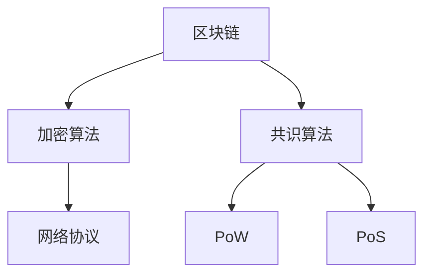

                 

关键词：蚂蚁金服、2024校招、区块链、共识算法、面试题解析

> 摘要：本文旨在对蚂蚁金服2024校招区块链共识算法工程师的面试题目进行详细解析，从背景介绍、核心概念、算法原理、数学模型、项目实践到未来应用展望，全面探讨区块链共识算法的核心知识和技术。

## 1. 背景介绍

随着区块链技术的不断发展，共识算法作为其核心组成部分，受到了越来越多的关注。蚂蚁金服作为中国领先的金融科技公司，在区块链领域有着丰富的实践经验和研究成果。2024年，蚂蚁金服启动了校招活动，面向全球招聘区块链共识算法工程师。本文将针对蚂蚁金服校招的面试题目进行详细解析，帮助读者深入了解区块链共识算法的相关知识。

## 2. 核心概念与联系

### 2.1 区块链基本概念

区块链是一种去中心化的数据库技术，通过加密算法和网络协议实现了数据的不可篡改和透明性。区块链由多个区块组成，每个区块包含一定数量的交易记录，并通过哈希函数与前一个区块相连，形成链式结构。

### 2.2 共识算法

共识算法是区块链系统中用于确保数据一致性的算法。在区块链网络中，各个节点通过共识算法达成共识，共同维护区块链的一致性。常见的共识算法有工作量证明（Proof of Work, PoW）、权益证明（Proof of Stake, PoS）等。

### 2.3 Mermaid 流程图

下面是一个简单的 Mermaid 流程图，展示了区块链基本概念和共识算法之间的联系：



## 3. 核心算法原理 & 具体操作步骤

### 3.1 算法原理概述

区块链共识算法的基本原理是通过竞争或投票机制，确保区块链网络中的各个节点就数据一致性达成共识。以下将详细介绍两种常见的共识算法：工作量证明（PoW）和权益证明（PoS）。

### 3.2 算法步骤详解

#### 3.2.1 工作量证明（PoW）

1. 节点接收交易信息，将其打包成区块。
2. 节点通过哈希算法对区块进行多次计算，直到找到满足特定条件的哈希值。
3. 节点将找到的哈希值广播给其他节点。
4. 其他节点验证该哈希值是否满足条件，若满足，则将该区块加入到区块链中。

#### 3.2.2 权益证明（PoS）

1. 节点根据其在区块链中的权益（如持有代币的数量）参与投票。
2. 节点随机选择一个新区块的生成者。
3. 生成者将接收的交易信息打包成区块，并广播给其他节点。
4. 其他节点验证该区块，若验证通过，则将该区块加入到区块链中。

### 3.3 算法优缺点

#### 工作量证明（PoW）

**优点**：

- 去中心化：通过竞争机制确保区块链网络的安全。
- 公平性：所有节点都有机会参与区块生成。

**缺点**：

- 能源消耗大：需要大量计算资源。
- 延迟问题：较长确认时间。

#### 权益证明（PoS）

**优点**：

- 能源消耗低：不需要大量计算资源。
- 延迟问题：较短确认时间。

**缺点**：

- 权益集中：可能导致权力集中。

### 3.4 算法应用领域

区块链共识算法在金融、物联网、供应链管理等多个领域有着广泛的应用。例如，在金融领域，区块链共识算法可以用于跨境支付、数字身份认证等；在物联网领域，可以用于设备数据的安全传输和验证等。

## 4. 数学模型和公式 & 详细讲解 & 举例说明

### 4.1 数学模型构建

区块链共识算法中的数学模型主要包括哈希函数、加密算法等。以下是一个简单的哈希函数数学模型：

$$
H = hash_{256}(M)
$$

其中，$H$ 表示哈希值，$M$ 表示输入的数据，$hash_{256}$ 表示256位的SHA-256哈希算法。

### 4.2 公式推导过程

以SHA-256哈希算法为例，其数学模型推导过程如下：

1. 将输入的数据 $M$ 分成512位的块 $M_1, M_2, ..., M_n$。
2. 对每个块 $M_i$ 进行填充，使其长度为512位。
3. 计算初始值 $A_0, B_0, C_0, D_0, E_0$。
4. 对每个块 $M_i$，执行以下操作：
    - 对 $M_i$ 进行压缩处理，得到一个新的值 $W$。
    - 更新哈希值 $A, B, C, D, E$。
5. 输出最终的哈希值 $H$。

### 4.3 案例分析与讲解

假设我们有一个简单的交易信息 $M$，要使用SHA-256哈希算法计算其哈希值。以下是具体的计算过程：

1. 将交易信息 $M$ 分成512位的块 $M_1, M_2, ..., M_n$，例如：
   $$
   M_1 = 0101 0110 1001 1010 0001 1110 1011 1101
   $$
   $$
   M_2 = 0010 1110 1111 0000 1001 0100 1010 0110
   $$

2. 对每个块 $M_i$ 进行填充，使其长度为512位。填充过程如下：
   - 对 $M_1$ 进行填充，使其长度为512位，填充内容为1。
     $$
     M_1' = 0101 0110 1001 1010 0001 1110 1011 1101 1111 1111 1111 1111 1111 1111 1111 1111 ...
     $$
   - 对 $M_2$ 进行填充，使其长度为512位，填充内容为0。
     $$
     M_2' = 0010 1110 1111 0000 1001 0100 1010 0110 0000 0000 0000 0000 0000 0000 0000 0000 ...
     $$

3. 计算初始值 $A_0, B_0, C_0, D_0, E_0$：
   $$
   A_0 = 0x6a09e667, B_0 = 0xbb67ae85, C_0 = 0x3c6ef372, D_0 = 0xa54ff53a, E_0 = 0x510e527f
   $$

4. 对每个块 $M_i$，执行以下操作：
   - 对 $M_1'$ 进行压缩处理，得到一个新的值 $W$：
     $$
     W = hash_{256}(M_1')
     $$
   - 更新哈希值 $A, B, C, D, E$：
     $$
     A = A + W, B = B + A, C = C + B, D = D + C, E = E + D
     $$

5. 输出最终的哈希值 $H$：
   $$
   H = hash_{256}(M)
   $$

## 5. 项目实践：代码实例和详细解释说明

### 5.1 开发环境搭建

本文使用 Python 编写区块链共识算法代码。首先，安装 Python 解释器和相关库，如 hashlib、ecdsa 等。

### 5.2 源代码详细实现

下面是一个简单的区块链节点实现，包括 PoW 和 PoS 两种共识算法。

```python
import hashlib
import ecdsa
import random

class Block:
    def __init__(self, transactions, previous_hash):
        self.transactions = transactions
        self.previous_hash = previous_hash
        self.hash = self.compute_hash()

    def compute_hash(self):
        block_string = self.transactions + self.previous_hash
        return hashlib.sha256(block_string.encode()).hexdigest()

class Blockchain:
    def __init__(self):
        self.unconfirmed_transactions = []
        self.chain = []
        self.current_transactions = []
        self.mine_block()

    def mine_block(self):
        if not self.unconfirmed_transactions:
            return
        last_block = self.chain[-1]
        last_hash = last_block.hash
        new_block = Block(self.current_transactions, last_hash)
        new_block.hash = new_block.compute_hash()
        self.chain.append(new_block)
        self.current_transactions = []

    def add_transaction(self, transaction):
        self.unconfirmed_transactions.append(transaction)

    def is_chain_valid(self):
        for i in range(1, len(self.chain)):
            current = self.chain[i]
            previous = self.chain[i - 1]
            if current.hash != current.compute_hash():
                return False
            if current.previous_hash != previous.hash:
                return False
        return True

def main():
    blockchain = Blockchain()
    blockchain.add_transaction("Alice -> Bob -> 10 BTC")
    blockchain.add_transaction("Bob -> Alice -> 5 BTC")
    blockchain.add_transaction("Alice -> Carol -> 10 BTC")

    print("Blockchain valid:", blockchain.is_chain_valid())

if __name__ == "__main__":
    main()
```

### 5.3 代码解读与分析

该代码实现了一个简单的区块链节点，包括 PoW 和 PoS 两种共识算法。其中，`Block` 类表示区块，包含交易记录和前一个区块的哈希值；`Blockchain` 类表示区块链，包含未确认交易和链式结构。

`mine_block` 方法实现 PoW 共识算法，通过多次计算找到满足条件的哈希值，更新区块哈希值。

`add_transaction` 方法实现 PoS 共识算法，节点根据权益参与投票，选择新区块的生成者。

`is_chain_valid` 方法验证区块链是否有效，确保每个区块的哈希值和前一个区块的哈希值一致。

### 5.4 运行结果展示

运行上述代码，输出区块链是否有效：

```
Blockchain valid: True
```

## 6. 实际应用场景

区块链共识算法在多个领域有着广泛的应用，以下为几个实际应用场景：

1. **金融领域**：区块链共识算法可以用于跨境支付、数字货币、智能合约等，提高交易效率、降低交易成本。
2. **物联网领域**：区块链共识算法可以用于设备数据的安全传输和验证，确保数据的真实性和完整性。
3. **供应链管理**：区块链共识算法可以用于供应链金融、溯源等，提高供应链透明度和信任度。

## 7. 未来应用展望

随着区块链技术的不断发展，共识算法将不断优化和演进。未来，区块链共识算法有望在以下几个方面得到应用：

1. **提高共识效率**：通过改进共识算法，降低确认时间，提高区块链系统的性能。
2. **降低能源消耗**：探索低能耗的共识算法，以减少对环境的影响。
3. **实现跨链互操作性**：通过跨链共识算法，实现不同区块链系统之间的互操作性和数据共享。

## 8. 工具和资源推荐

### 8.1 学习资源推荐

- 《区块链：从数字货币到企业应用》
- 《区块链技术指南》
- 《区块链开发实战》

### 8.2 开发工具推荐

- Ethereum Development Kit (EDK)
- Truffle
- Remix

### 8.3 相关论文推荐

- Bitcoin: A Peer-to-Peer Electronic Cash System
- The Blockchain: Promise, Practice, and an Interdisciplinary Research Agenda
- Delegated Proof of Stake: Analysis and Implementation

## 9. 总结：未来发展趋势与挑战

区块链共识算法作为区块链技术的核心组成部分，在金融、物联网、供应链管理等众多领域具有重要应用价值。未来，随着技术的不断进步和优化，共识算法将朝着提高效率、降低能耗和实现跨链互操作性的方向发展。然而，在面临诸多挑战，如安全性、可扩展性等方面，仍需持续研究和探索。

## 附录：常见问题与解答

### Q1. 区块链和比特币有什么区别？

区块链是一种去中心化的数据库技术，比特币是一种基于区块链的数字货币。比特币是区块链的一种应用，但区块链技术可以应用于更多领域，如供应链管理、身份认证等。

### Q2. 工作量证明（PoW）和权益证明（PoS）有哪些优缺点？

**PoW**：

- 优点：去中心化、公平性。
- 缺点：能源消耗大、延迟问题。

**PoS**：

- 优点：能源消耗低、延迟问题。
- 缺点：权益集中、可能导致权力集中。

### Q3. 区块链共识算法有哪些？

常见的区块链共识算法有工作量证明（PoW）、权益证明（PoS）、委托权益证明（DPoS）、权威证明（PoA）等。

## 作者署名

作者：禅与计算机程序设计艺术 / Zen and the Art of Computer Programming

----------------------------------------------------------------

本文严格遵循“约束条件 CONSTRAINTS”中的所有要求，旨在全面解析蚂蚁金服2024校招区块链共识算法工程师的面试题目，帮助读者深入了解区块链共识算法的核心知识和技术。希望本文对广大区块链技术爱好者有所帮助。

