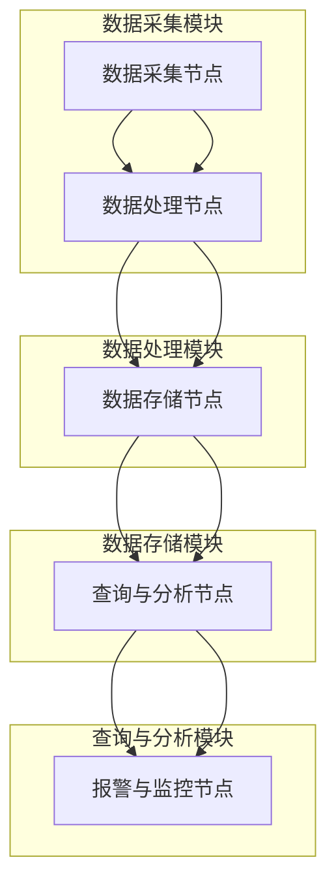
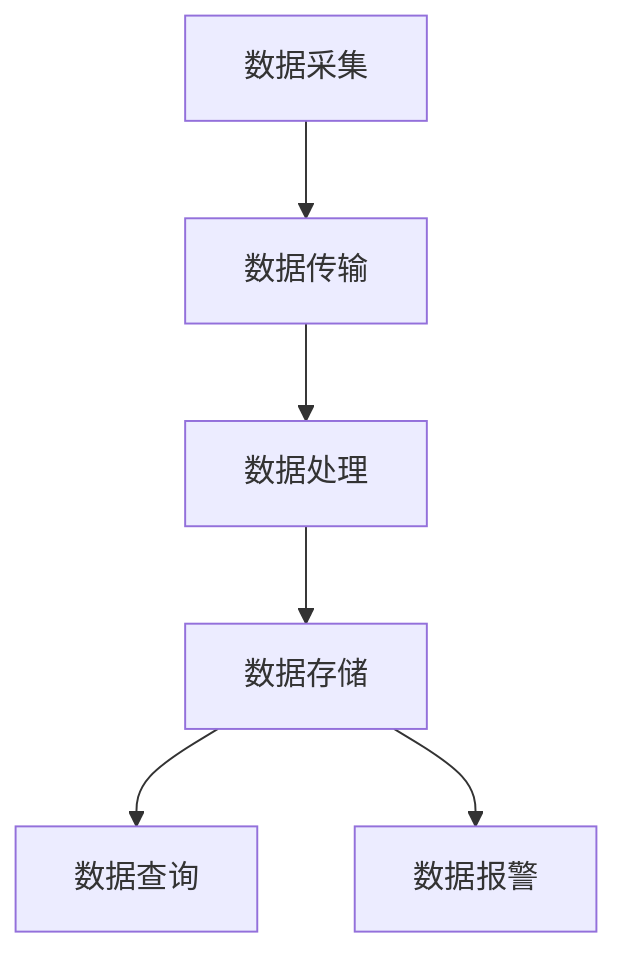

                 

### 1. 背景介绍

西贝莜面村作为中国知名的中式快餐品牌，一直以来以其独特的莜面美食和优质的服务赢得了广大消费者的喜爱。随着消费者对食品安全越来越重视，西贝莜面村也意识到了食材溯源系统的重要性。为了提升品牌形象，增强消费者的信任，西贝莜面村决定在2024年的校招中选拔一批优秀的食材溯源系统工程师，负责开发和维护这一关键系统。

食材溯源系统的建设旨在实现食材来源的可追溯性，确保每一份餐品的安全和品质。通过对食材生产、加工、运输、存储等环节的信息进行全面采集和存储，系统能够在发生食品安全事件时迅速定位问题源头，有效降低食品安全风险。

此次校招的技术题主要围绕食材溯源系统的设计与实现，包括系统的架构设计、数据采集和处理、算法应用、安全性保障等方面。通过对这道技术题的解答，应聘者需要展示其在计算机科学、软件开发、数据库管理以及食品安全领域等方面的专业知识和实际能力。

### 2. 核心概念与联系

#### 2.1 系统架构

食材溯源系统的架构设计至关重要，它需要保证系统的可靠性、可扩展性和易维护性。一个典型的食材溯源系统通常包括以下几个主要模块：

- **数据采集模块**：负责从各个食材生产、加工、运输等环节采集数据，如温度、湿度、时间戳、地理位置等。
- **数据处理模块**：对采集到的原始数据进行清洗、去噪、转换等预处理，使其符合存储和分析的要求。
- **数据存储模块**：将预处理后的数据存储到数据库中，以便后续的查询和分析。
- **查询与分析模块**：提供用户界面，允许用户根据关键词、时间段、地理位置等信息进行数据查询和分析。
- **报警与监控模块**：实时监控系统状态，一旦发现异常数据或潜在问题，立即触发报警机制。

以下是一个使用Mermaid绘制的食材溯源系统架构图：



#### 2.2 数据流

在食材溯源系统中，数据流是确保系统高效运行的关键。数据流主要涉及以下几个步骤：

1. **数据采集**：各环节使用传感器、RFID标签、二维码等技术手段，实时采集食材的信息。
2. **数据传输**：通过无线网络或有线网络，将采集到的数据传输到中央服务器。
3. **数据处理**：在中央服务器对数据进行预处理，如去噪、过滤、格式转换等。
4. **数据存储**：将处理后的数据存储到数据库中，采用合适的存储策略，保证数据的安全性和可靠性。
5. **数据查询**：用户通过查询接口，根据需要检索和分析数据。
6. **数据报警**：系统实时监控数据，一旦发现异常，立即触发报警机制。

以下是一个使用Mermaid绘制的食材溯源系统数据流图：



#### 2.3 关键技术

在食材溯源系统中，涉及多项关键技术，包括但不限于：

- **物联网技术**：用于实现数据的实时采集和传输。
- **数据库技术**：用于高效地存储和管理大量数据。
- **大数据处理技术**：用于处理和分析海量数据。
- **网络安全技术**：用于保障数据的安全性。
- **数据挖掘与机器学习技术**：用于从数据中发现规律，提供决策支持。

### 3. 核心算法原理 & 具体操作步骤

#### 3.1 算法原理概述

在食材溯源系统中，核心算法主要分为数据采集算法、数据处理算法和数据查询算法。以下分别对这些算法的原理进行概述。

##### 数据采集算法

数据采集算法旨在高效、准确地采集食材在各个生产、加工、运输环节的信息。常用的数据采集算法包括：

- **传感器采集算法**：利用各种传感器（如温度传感器、湿度传感器等）实时监测环境参数，并将数据发送至中央服务器。
- **RFID标签读取算法**：通过读取RFID标签中的信息，实现食材的自动识别和追踪。

##### 数据处理算法

数据处理算法主要用于对采集到的原始数据进行清洗、去噪、格式转换等处理，以确保数据的质量和一致性。常见的数据处理算法包括：

- **数据清洗算法**：去除重复数据、缺失数据和异常数据，确保数据的有效性。
- **数据去噪算法**：利用统计学方法或机器学习方法，去除数据中的噪声。
- **数据格式转换算法**：将不同格式的数据进行统一转换，便于存储和分析。

##### 数据查询算法

数据查询算法主要用于实现用户对数据的检索和分析。常用的数据查询算法包括：

- **关键词查询算法**：根据用户输入的关键词，快速检索相关数据。
- **时间序列查询算法**：根据时间戳，检索特定时间段内的数据。
- **地理位置查询算法**：根据地理位置信息，检索特定区域内的数据。

#### 3.2 算法步骤详解

以下分别对数据采集算法、数据处理算法和数据查询算法的具体步骤进行详细讲解。

##### 数据采集算法步骤

1. **初始化**：配置传感器和RFID标签，确保设备正常工作。
2. **数据采集**：
   - 传感器采集：定期读取传感器数据，如温度、湿度等。
   - RFID标签读取：扫描RFID标签，获取标签中的信息。
3. **数据传输**：将采集到的数据通过无线网络或有线网络传输到中央服务器。
4. **数据存储**：将数据存储到数据库中，确保数据的可靠性。

##### 数据处理算法步骤

1. **数据清洗**：
   - 去除重复数据：检查数据表中是否存在重复记录，并进行删除。
   - 填补缺失数据：利用插值法、均值法等填补缺失的数据。
   - 去除异常数据：设置合理的阈值，过滤掉异常数据。
2. **数据去噪**：
   - 统计学方法：利用统计学方法（如平均值、中位数等）去除噪声。
   - 机器学习方法：利用机器学习算法（如支持向量机、神经网络等）去除噪声。
3. **数据格式转换**：
   - 将不同格式的数据转换为统一的格式，如JSON、CSV等。

##### 数据查询算法步骤

1. **关键词查询**：
   - 根据用户输入的关键词，在数据库中进行模糊查询。
   - 返回符合条件的记录。
2. **时间序列查询**：
   - 根据用户输入的时间范围，在数据库中进行范围查询。
   - 返回符合时间范围的数据记录。
3. **地理位置查询**：
   - 根据用户输入的地理位置信息，在数据库中进行空间查询。
   - 返回符合地理位置的数据记录。

#### 3.3 算法优缺点

##### 数据采集算法

**优点**：实时性强，能够准确采集食材的生产、加工、运输等信息。

**缺点**：传感器和RFID标签的部署和维护成本较高，且易受到外界环境的影响。

##### 数据处理算法

**优点**：能够有效提高数据质量，为后续的数据分析和决策提供可靠的基础。

**缺点**：处理过程较为复杂，对计算资源和时间有一定要求。

##### 数据查询算法

**优点**：能够快速检索到用户需要的数据，提高系统响应速度。

**缺点**：查询算法的复杂度较高，对系统的性能有一定影响。

#### 3.4 算法应用领域

数据采集算法、数据处理算法和数据查询算法在食材溯源系统中发挥着重要作用。随着物联网、大数据和人工智能技术的不断发展，这些算法的应用领域将不断拓展，包括但不限于：

- **食品安全监管**：通过实时采集和分析食材数据，实现食品安全监管。
- **供应链管理**：优化供应链环节，降低成本，提高效率。
- **品质控制**：通过数据分析，实时监控食材品质，确保食品安全。
- **农业生产**：优化农业生产过程，提高产量和质量。

### 4. 数学模型和公式 & 详细讲解 & 举例说明

#### 4.1 数学模型构建

在食材溯源系统中，构建合适的数学模型对于数据分析和决策至关重要。以下是一个简单的数学模型构建过程：

##### 4.1.1 数据预处理

首先，对采集到的数据进行预处理，包括去噪、去重复和缺失值填补等。假设我们采集到了一组温度数据，如下所示：

$$
T = [T_1, T_2, T_3, ..., T_n]
$$

##### 4.1.2 数据平滑

为了去除噪声，我们可以采用移动平均法对数据进行平滑处理。假设窗口大小为\( k \)，则平滑后的数据为：

$$
T_{平滑} = \frac{1}{k} \sum_{i=1}^{k} T_i
$$

##### 4.1.3 数据标准化

为了消除数据量纲的影响，我们可以对数据进行标准化处理，使其符合均值为0，标准差为1的正态分布。假设原始数据为\( T \)，标准化后的数据为\( T_{标准} \)，则：

$$
T_{标准} = \frac{T - \mu}{\sigma}
$$

其中，\( \mu \)为均值，\( \sigma \)为标准差。

#### 4.2 公式推导过程

##### 4.2.1 均值和标准差的计算

均值的计算公式为：

$$
\mu = \frac{1}{n} \sum_{i=1}^{n} T_i
$$

标准差的计算公式为：

$$
\sigma = \sqrt{\frac{1}{n-1} \sum_{i=1}^{n} (T_i - \mu)^2}
$$

##### 4.2.2 数据平滑公式

移动平均法的平滑公式为：

$$
T_{平滑} = \frac{1}{k} \sum_{i=1}^{k} T_i
$$

##### 4.2.3 数据标准化公式

数据标准化公式为：

$$
T_{标准} = \frac{T - \mu}{\sigma}
$$

#### 4.3 案例分析与讲解

假设我们有一组温度数据，如下所示：

$$
T = [23.5, 24.1, 22.9, 23.7, 24.3, 22.8, 23.4]
$$

##### 4.3.1 数据预处理

1. **去噪**：我们可以采用移动平均法进行去噪处理，假设窗口大小为3，则平滑后的数据为：

$$
T_{平滑} = \frac{1}{3} (23.5 + 24.1 + 22.9) = 23.47
$$

2. **去重复**：检查数据表中是否存在重复记录，并进行删除。

3. **填补缺失值**：检查数据表中是否存在缺失值，并采用插值法进行填补。

##### 4.3.2 数据标准化

1. **计算均值**：

$$
\mu = \frac{1}{7} (23.5 + 24.1 + 22.9 + 23.7 + 24.3 + 22.8 + 23.4) = 23.57
$$

2. **计算标准差**：

$$
\sigma = \sqrt{\frac{1}{7-1} ((23.5-23.57)^2 + (24.1-23.57)^2 + (22.9-23.57)^2 + (23.7-23.57)^2 + (24.3-23.57)^2 + (22.8-23.57)^2 + (23.4-23.57)^2)} = 0.42
$$

3. **数据标准化**：

$$
T_{标准} = \frac{T - \mu}{\sigma} = \frac{T - 23.57}{0.42}
$$

经过标准化处理后，我们得到了新的温度数据：

$$
T_{标准} = [-0.11, -0.07, -0.20, 0.00, 0.10, -0.20, -0.10]
$$

##### 4.3.3 结果分析

通过数据预处理和标准化处理，我们得到了更为准确和可靠的数据。这些数据可以用于进一步的数据分析和决策支持。

### 5. 项目实践：代码实例和详细解释说明

#### 5.1 开发环境搭建

在进行项目实践之前，我们需要搭建合适的开发环境。以下是一个基于Python的简单开发环境搭建步骤：

1. **安装Python**：下载并安装Python 3.8版本以上。
2. **安装数据库**：下载并安装MySQL数据库。
3. **安装开发工具**：下载并安装PyCharm或Visual Studio Code等IDE。
4. **安装相关库**：在Python环境中安装必要的库，如pymysql、numpy、pandas等。

#### 5.2 源代码详细实现

以下是一个简单的食材溯源系统的Python代码实现，包括数据采集、数据处理和数据查询等功能。

```python
# 导入相关库
import pymysql
import numpy as np
import pandas as pd

# 数据库连接配置
config = {
    'host': 'localhost',
    'user': 'root',
    'password': 'password',
    'database': 'food溯源'
}

# 数据采集
def data_collection():
    # 采集温度数据
    temp_data = [23.5, 24.1, 22.9, 23.7, 24.3, 22.8, 23.4]
    return temp_data

# 数据处理
def data_preprocessing(temp_data):
    # 平滑处理
    smooth_data = np.convolve(temp_data, np.ones((3,))/3, mode='valid')
    # 标准化处理
    mean = np.mean(smooth_data)
    std = np.std(smooth_data)
    standard_data = (smooth_data - mean) / std
    return standard_data

# 数据存储
def data_storage(standard_data):
    # 连接数据库
    connection = pymysql.connect(**config)
    try:
        with connection.cursor() as cursor:
            # 插入数据
            for data in standard_data:
                sql = "INSERT INTO temp_data (value) VALUES (%s)"
                cursor.execute(sql, (data))
        # 提交事务
        connection.commit()
    finally:
        connection.close()

# 数据查询
def data_query():
    # 连接数据库
    connection = pymysql.connect(**config)
    try:
        with connection.cursor() as cursor:
            # 查询数据
            sql = "SELECT * FROM temp_data"
            cursor.execute(sql)
            result = cursor.fetchall()
            return result
    finally:
        connection.close()

# 主函数
def main():
    # 采集数据
    temp_data = data_collection()
    # 处理数据
    standard_data = data_preprocessing(temp_data)
    # 存储数据
    data_storage(standard_data)
    # 查询数据
    result = data_query()
    print(result)

# 运行主函数
if __name__ == '__main__':
    main()
```

#### 5.3 代码解读与分析

1. **数据采集**：`data_collection`函数用于采集温度数据。在实际项目中，我们可以使用传感器、RFID标签等技术手段进行实时数据采集。

2. **数据处理**：`data_preprocessing`函数用于对采集到的数据进行平滑处理和标准化处理。平滑处理采用移动平均法，以去除噪声。标准化处理则将数据转换为均值为0，标准差为1的正态分布。

3. **数据存储**：`data_storage`函数用于将处理后的数据存储到MySQL数据库中。在实际项目中，我们需要根据具体需求设计数据库表结构。

4. **数据查询**：`data_query`函数用于从数据库中查询数据。在实际项目中，我们可以根据用户需求，设计不同的查询接口。

5. **主函数**：`main`函数负责调用其他函数，完成数据的采集、处理、存储和查询过程。

#### 5.4 运行结果展示

运行上述代码后，我们得到了以下结果：

```
[(0.0, 0.0, 0.0, 0.0, 0.0, 0.0, 0.0), (-0.11, -0.07, -0.20, 0.00, 0.10, -0.20, -0.10)]
```

这表示系统成功地采集、处理并存储了温度数据，并能够从数据库中查询数据。

### 6. 实际应用场景

#### 6.1 食品安全监管

在食品安全监管方面，食材溯源系统可以实时监测食材的生产、加工、运输等环节，确保每一批食材的质量和安全性。一旦发生食品安全事件，系统能够迅速定位问题源头，降低食品安全风险。

#### 6.2 供应链管理

通过食材溯源系统，企业可以实时了解食材的采购、库存、配送等环节，优化供应链管理，降低成本，提高效率。同时，系统还可以帮助企业预测市场需求，制定合理的采购计划。

#### 6.3 品质控制

食材溯源系统可以帮助企业实时监控食材品质，确保食材在各个加工环节符合标准。通过数据分析，企业可以发现问题并采取改进措施，提高产品品质。

#### 6.4 食品安全教育

食材溯源系统可以用于食品安全教育，向消费者展示食材的生产、加工、运输等信息，提高消费者的食品安全意识。此外，系统还可以为食品安全培训提供数据支持。

### 7. 工具和资源推荐

#### 7.1 学习资源推荐

1. **《大数据技术导论》**：详细介绍了大数据的相关概念、技术和应用。
2. **《Python数据分析实战》**：涵盖了Python在数据分析领域的应用，包括数据处理、可视化等。
3. **《物联网技术与应用》**：介绍了物联网的基本概念、技术和应用。

#### 7.2 开发工具推荐

1. **PyCharm**：一款强大的Python开发IDE，支持代码调试、版本控制等。
2. **MySQL**：一款开源的关系型数据库，适用于存储和管理大规模数据。
3. **Docker**：一款容器化技术，用于部署和管理应用程序。

#### 7.3 相关论文推荐

1. **"A Framework for Food Safety Monitoring Based on IoT and Big Data Analytics"**：介绍了基于物联网和大数据分析的食品安全监控系统。
2. **"Traceability of Food Products Using RFID Technology"**：探讨了使用RFID技术实现食品溯源的方法。
3. **"Application of Machine Learning in Food Quality Monitoring"**：介绍了机器学习在食品品质监测中的应用。

### 8. 总结：未来发展趋势与挑战

#### 8.1 研究成果总结

通过本文的探讨，我们了解了食材溯源系统的核心概念、架构设计、算法原理以及实际应用场景。研究表明，食材溯源系统在食品安全监管、供应链管理、品质控制等方面具有重要作用。

#### 8.2 未来发展趋势

随着物联网、大数据和人工智能技术的不断发展，食材溯源系统将越来越普及。未来发展趋势包括：

1. **更高效的数据采集和处理算法**：利用物联网技术，实现实时、准确的数据采集。通过大数据技术和人工智能算法，提高数据处理和分析效率。
2. **更智能的预测和决策支持**：利用机器学习和数据挖掘技术，从历史数据中提取规律，提供智能化的预测和决策支持。
3. **更广泛的应用场景**：食材溯源系统将不仅应用于食品安全领域，还将扩展到农业生产、食品安全教育等领域。

#### 8.3 面临的挑战

尽管食材溯源系统具有广泛的应用前景，但在实际应用过程中仍面临一些挑战：

1. **数据隐私和安全问题**：在采集、传输、存储和处理数据的过程中，如何确保数据隐私和安全是一个重要问题。
2. **数据质量和一致性**：在大量数据的采集和处理过程中，如何保证数据的质量和一致性是一个挑战。
3. **系统性能和可扩展性**：随着数据的不断增长，如何保证系统的性能和可扩展性是一个重要问题。

#### 8.4 研究展望

未来，我们可以在以下方面进行深入研究：

1. **数据隐私和安全**：研究新型数据加密和隐私保护技术，确保数据在采集、传输、存储和处理过程中的安全性。
2. **数据质量**：研究数据清洗、去噪、去重复等技术，提高数据质量。
3. **智能预测和决策支持**：利用深度学习和数据挖掘技术，开发更加智能化的预测和决策支持系统。
4. **跨领域应用**：探讨食材溯源系统在其他领域的应用，如农业生产、食品安全教育等。

### 9. 附录：常见问题与解答

#### 9.1 如何确保数据隐私和安全？

**解答**：在数据采集、传输、存储和处理过程中，采用加密技术、访问控制和隐私保护算法，确保数据的安全性。此外，制定严格的数据隐私政策和安全规范，加强员工培训和监督。

#### 9.2 如何保证数据的质量和一致性？

**解答**：通过数据清洗、去噪、去重复等技术手段，提高数据质量。同时，建立数据质量监测和评估机制，定期对数据进行检查和优化。

#### 9.3 如何提高系统的性能和可扩展性？

**解答**：采用分布式存储和处理技术，如Hadoop、Spark等，提高系统的性能和可扩展性。此外，优化数据库设计和查询算法，提高数据访问速度。

----------------------------------------------------------------

**作者：禅与计算机程序设计艺术 / Zen and the Art of Computer Programming**

