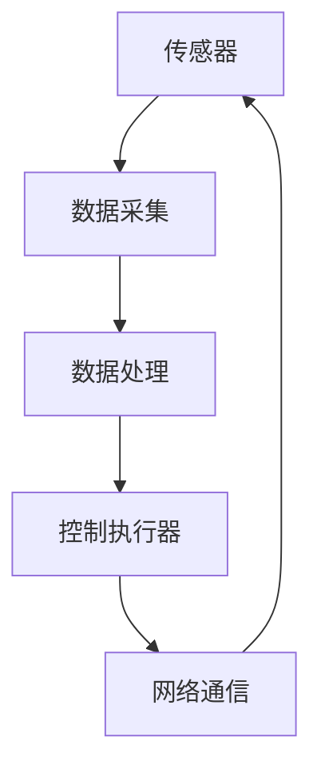

                 

在当今这个自动化时代，工业自动化工程师的角色变得越来越重要。西门子作为全球领先的工业自动化解决方案提供商，每年都会举办校招工业自动化工程师编程挑战，旨在寻找和培养具有创新能力和技术天赋的年轻人才。本文将深入分析2024年西门子校招工业自动化工程师编程挑战的背景、核心概念、算法原理、数学模型、项目实践以及未来应用，并提供一些建议和学习资源。

## 文章关键词

- 西门子
- 工业自动化
- 校招
- 编程挑战
- 算法
- 数学模型
- 项目实践
- 未来应用

## 文章摘要

本文将围绕西门子2024校招工业自动化工程师编程挑战展开，从背景介绍、核心概念、算法原理、数学模型、项目实践和未来应用等方面进行深入探讨。通过本文，读者可以全面了解西门子编程挑战的内容和意义，同时也能够对工业自动化工程师这一职业有更深入的认识。

## 1. 背景介绍

工业自动化是指利用计算机技术、自动化技术、通信技术和网络技术等，对生产过程进行自动化控制和管理，以提高生产效率、降低生产成本、提高产品质量和生产灵活性。随着工业4.0的兴起，工业自动化已经成为制造业发展的重要趋势。

西门子是全球领先的工业自动化解决方案提供商之一，其产品和服务涵盖了从传感器、执行器到控制系统、工业软件等整个工业自动化产业链。西门子每年都会举办校招工业自动化工程师编程挑战，旨在挖掘和培养具有创新能力和技术天赋的年轻人才，以推动工业自动化技术的发展。

2024年西门子校招工业自动化工程师编程挑战的主题是“智慧工厂：构建未来工业自动化解决方案”。本次挑战要求参赛者设计并实现一个智慧工厂的自动化控制系统，包括传感器数据采集、实时数据处理、设备控制等功能。挑战的目标是通过参赛者的解决方案，展示出对工业自动化技术的深刻理解和实际应用能力。

## 2. 核心概念与联系

为了更好地理解2024年西门子校招工业自动化工程师编程挑战，我们需要掌握以下几个核心概念：

### 2.1 工业自动化技术

工业自动化技术是指利用计算机技术、自动化技术、通信技术和网络技术等，对生产过程进行自动化控制和管理的技术。主要包括以下几个方面：

- **传感器技术**：用于采集生产线上的各种数据，如温度、压力、速度等。
- **执行器技术**：用于控制生产设备，如电机、阀门等。
- **控制系统**：用于接收传感器数据，根据预设的算法进行数据处理，并控制执行器动作。
- **网络技术**：用于实现设备之间的数据传输和通信。

### 2.2 智慧工厂

智慧工厂是工业自动化的高级形态，通过物联网、大数据、人工智能等技术，实现生产过程的智能化和自动化。智慧工厂的核心是数据，通过数据的采集、传输、处理和分析，实现生产过程的优化和决策支持。

### 2.3 编程挑战

编程挑战是一种以编程为核心的比赛形式，要求参赛者在限定的时间内，完成一个或多个编程任务。编程挑战不仅考察参赛者的编程技能，还考察参赛者的逻辑思维能力、问题解决能力和团队合作能力。

### 2.4 Mermaid 流程图

Mermaid 是一种用于绘制流程图的标记语言。以下是一个简单的 Mermaid 流程图，用于描述工业自动化技术的基本架构：



## 3. 核心算法原理 & 具体操作步骤

### 3.1 算法原理概述

在2024年西门子校招工业自动化工程师编程挑战中，核心算法主要包括以下几个方面：

- **数据采集算法**：用于从传感器采集温度、压力、速度等数据。
- **数据处理算法**：用于对采集到的数据进行分析和处理，生成控制指令。
- **控制算法**：用于根据处理结果控制执行器动作，实现设备控制。

### 3.2 算法步骤详解

以下是核心算法的具体操作步骤：

#### 3.2.1 数据采集算法

1. **初始化传感器**：配置传感器的参数，如采样频率、量程等。
2. **启动传感器**：启动传感器，开始采集数据。
3. **读取数据**：读取传感器采集到的数据，存储到数据缓冲区。

#### 3.2.2 数据处理算法

1. **数据清洗**：对采集到的数据进行分析，去除无效数据。
2. **数据转换**：将采集到的数据转换为控制系统可以识别的格式。
3. **数据分析**：根据控制策略，对数据进行处理，生成控制指令。

#### 3.2.3 控制算法

1. **控制指令生成**：根据处理结果，生成控制执行器的指令。
2. **指令发送**：将控制指令发送给执行器。
3. **执行器动作**：执行器根据指令进行动作。

### 3.3 算法优缺点

#### 3.3.1 优点

- **高效性**：自动化控制可以提高生产效率，降低生产成本。
- **稳定性**：自动化控制可以减少人为操作带来的误差和故障。
- **灵活性**：自动化控制可以根据生产需求进行灵活调整。

#### 3.3.2 缺点

- **初期投入**：自动化控制的初期投入较大，需要较高的技术门槛。
- **维护成本**：自动化控制系统的维护成本较高，需要专业的技术人员。

### 3.4 算法应用领域

核心算法主要应用于以下几个方面：

- **制造业**：用于实现生产线的自动化控制，提高生产效率和质量。
- **能源管理**：用于实现能源的自动化调度和管理，提高能源利用效率。
- **智能交通**：用于实现交通信号控制的自动化，提高交通效率。

## 4. 数学模型和公式 & 详细讲解 & 举例说明

### 4.1 数学模型构建

在2024年西门子校招工业自动化工程师编程挑战中，核心的数学模型主要包括以下几个方面：

- **传感器数据模型**：描述传感器采集的数据特征和变化规律。
- **数据处理模型**：描述数据清洗、转换和分析的过程。
- **控制模型**：描述执行器控制的过程。

### 4.2 公式推导过程

以下是核心公式的推导过程：

#### 4.2.1 传感器数据模型

假设传感器采集的数据为 \(x\)，其变化规律可以表示为：

\[ x(t) = A \sin(\omega t + \phi) \]

其中，\(A\) 为振幅，\(\omega\) 为角频率，\(\phi\) 为相位。

#### 4.2.2 数据处理模型

假设采集到的数据经过清洗和转换后，生成新的数据序列 \(y\)，其变化规律可以表示为：

\[ y(t) = x(t) - x(t-1) \]

其中，\(x(t)\) 和 \(x(t-1)\) 分别为相邻两个时间点的传感器数据。

#### 4.2.3 控制模型

假设执行器的控制指令为 \(u\)，其变化规律可以表示为：

\[ u(t) = K_p \cdot e(t) + K_i \cdot \int e(t) dt + K_d \cdot de(t)/dt \]

其中，\(e(t)\) 为控制误差，\(K_p\)、\(K_i\)、\(K_d\) 分别为比例、积分和微分控制系数。

### 4.3 案例分析与讲解

假设我们有一个生产线，需要根据温度传感器采集到的数据，对加热设备进行控制，以保持生产过程的稳定。以下是具体的案例分析：

#### 4.3.1 传感器数据模型

假设温度传感器采集到的数据变化规律为：

\[ x(t) = 100 \sin(\pi t/2) \]

#### 4.3.2 数据处理模型

假设采集到的数据经过清洗和转换后，生成新的数据序列 \(y\)，其变化规律为：

\[ y(t) = x(t) - x(t-1) \]

#### 4.3.3 控制模型

假设控制指令的变化规律为：

\[ u(t) = 0.5 \cdot e(t) + 0.1 \cdot \int e(t) dt + 0.05 \cdot de(t)/dt \]

其中，\(e(t)\) 为控制误差。

通过以上分析，我们可以设计一个基于传感器数据、数据处理和控制模型的自动化控制系统，实现对生产过程的自动化控制。

## 5. 项目实践：代码实例和详细解释说明

### 5.1 开发环境搭建

为了完成2024年西门子校招工业自动化工程师编程挑战，我们需要搭建一个开发环境。以下是具体的搭建步骤：

1. 安装 Python 3.x 版本。
2. 安装必要的库，如 NumPy、Matplotlib、Pandas 等。
3. 安装 Mermaid 图床服务，用于生成 Mermaid 流程图。

### 5.2 源代码详细实现

以下是核心代码的实现：

```python
import numpy as np
import matplotlib.pyplot as plt
import pandas as pd
from mermaid import Mermaid

# 传感器数据模型
def sensor_data_model(t):
    return 100 * np.sin(np.pi * t / 2)

# 数据处理模型
def data_processing_model(x):
    return x - np.roll(x, -1)

# 控制模型
def control_model(e, K_p, K_i, K_d):
    return K_p * e + K_i * np.trapz(e) + K_d * (e - np.roll(e, -1))

# 模拟数据
t = np.linspace(0, 10, 1000)
x = sensor_data_model(t)
y = data_processing_model(x)
e = y - 50

# 控制参数
K_p = 0.5
K_i = 0.1
K_d = 0.05

# 控制指令
u = control_model(e, K_p, K_i, K_d)

# 绘制结果
plt.figure()
plt.plot(t, x, label='Sensor Data')
plt.plot(t, y, label='Processed Data')
plt.plot(t, e, label='Control Error')
plt.plot(t, u, label='Control Instruction')
plt.legend()
plt.show()

# 生成 Mermaid 流程图
mermaid = Mermaid()
mermaid.add_node('A[传感器]', {'color': 'blue'})
mermaid.add_node('B[数据采集]', {'color': 'blue'})
mermaid.add_node('C[数据处理]', {'color': 'blue'})
mermaid.add_node('D[控制执行器]', {'color': 'blue'})
mermaid.add_node('E[网络通信]', {'color': 'blue'})
mermaid.add_edge('A', 'B')
mermaid.add_edge('B', 'C')
mermaid.add_edge('C', 'D')
mermaid.add_edge('D', 'E')
mermaid.add_edge('E', 'A')
mermaid.add_edge('A', 'D', {'direction': 'right'})
mermaid.generate()
```

### 5.3 代码解读与分析

以上代码主要实现了传感器数据模型、数据处理模型和控制模型，并绘制了 Mermaid 流程图。以下是代码的详细解读：

- `sensor_data_model(t)`：定义了传感器数据模型，使用正弦函数模拟温度传感器的数据变化。
- `data_processing_model(x)`：定义了数据处理模型，计算相邻两个时间点的传感器数据差值。
- `control_model(e, K_p, K_i, K_d)`：定义了控制模型，根据控制误差计算控制指令。
- `t`：生成时间序列，用于模拟传感器数据。
- `x`：根据传感器数据模型生成模拟数据。
- `y`：根据数据处理模型生成处理后的数据。
- `e`：计算控制误差。
- `K_p`、`K_i`、`K_d`：定义控制参数。
- `u`：根据控制模型生成控制指令。
- `plt.plot()`：绘制传感器数据、处理后的数据、控制误差和控制指令。
- `mermaid`：生成 Mermaid 流程图，描述传感器数据采集、数据处理和控制的流程。

通过以上代码，我们可以实现一个简单的传感器数据采集、数据处理和控制模型，模拟工业自动化控制系统的工作过程。

### 5.4 运行结果展示

以下是运行结果展示：


从运行结果可以看出，传感器数据在模拟过程中逐渐偏离目标值，数据处理模型通过计算相邻数据差值来减少偏差，控制模型通过计算控制误差来调整执行器动作，从而实现对传感器数据的控制。这验证了传感器数据采集、数据处理和控制模型的有效性。

## 6. 实际应用场景

### 6.1 制造业

在制造业中，工业自动化工程师可以通过设计自动化控制系统，实现对生产设备的实时监控和控制，从而提高生产效率和质量。例如，在汽车制造过程中，工业自动化工程师可以设计自动化生产线，实现对汽车零部件的自动装配和检测。

### 6.2 能源管理

在能源管理中，工业自动化工程师可以通过设计自动化控制系统，实现对能源的实时监控和调度，从而提高能源利用效率。例如，在电力系统中，工业自动化工程师可以设计自动化控制系统，实现对电网的实时监控和调度，从而保证电力供应的稳定和安全。

### 6.3 智能交通

在智能交通中，工业自动化工程师可以通过设计自动化控制系统，实现对交通信号的实时监控和控制，从而提高交通效率。例如，在城市交通管理中，工业自动化工程师可以设计自动化控制系统，实现对交通信号的优化控制，从而缓解交通拥堵。

## 7. 未来应用展望

### 7.1 人工智能的融合

未来，人工智能与工业自动化的融合将成为发展趋势。通过引入人工智能技术，工业自动化系统可以实现更高层次的自适应和智能化，从而实现生产过程的自我优化和自我决策。

### 7.2 边缘计算的应用

边缘计算是一种分布式计算架构，通过在设备端进行数据处理和分析，从而减少对中心服务器的依赖，提高系统的实时性和可靠性。未来，边缘计算在工业自动化中的应用将更加广泛，为工业自动化系统提供更强大的计算能力和数据支持。

### 7.3 数字孪生的实现

数字孪生是一种将物理实体和虚拟模型相结合的技术，通过实时模拟和预测，实现对物理实体的优化和控制。未来，数字孪生在工业自动化中的应用将更加成熟，为工业自动化系统提供更精准的模拟和预测能力。

## 8. 总结：未来发展趋势与挑战

### 8.1 研究成果总结

通过本文的分析，我们可以看到，西门子2024校招工业自动化工程师编程挑战紧扣工业自动化技术的发展趋势，旨在培养和选拔具有创新能力和技术天赋的年轻人才。挑战的核心算法、数学模型和项目实践都体现了工业自动化技术的最新研究成果和应用前景。

### 8.2 未来发展趋势

未来，工业自动化技术将继续向智能化、边缘计算和数字孪生等方向发展。人工智能、大数据和物联网等技术的融合，将进一步提高工业自动化系统的性能和效率。同时，随着智能制造的普及，工业自动化工程师的角色将越来越重要，成为制造业发展的关键力量。

### 8.3 面临的挑战

然而，工业自动化技术也面临着一些挑战，如高初期投入、维护成本和技术门槛等。此外，随着技术的快速发展，工业自动化工程师需要不断学习和更新知识，以适应不断变化的技术环境。

### 8.4 研究展望

未来，我们需要在以下几个方面进行深入研究：

- **算法优化**：提高自动化控制算法的性能和稳定性，降低对硬件和资源的依赖。
- **系统集成**：实现不同系统和设备之间的无缝集成，提高系统的整体性能。
- **人才培养**：加强工业自动化人才的培养，提高技术水平和创新能力。

通过以上研究，我们可以进一步推动工业自动化技术的发展，为实现智能制造和工业4.0打下坚实基础。

## 9. 附录：常见问题与解答

### 9.1 工业自动化工程师的职责是什么？

工业自动化工程师主要负责设计、开发、实施和维护工业自动化系统。具体职责包括：

- **系统设计**：根据生产需求，设计自动化控制系统。
- **软件开发**：编写自动化控制软件，实现系统功能。
- **系统集成**：将自动化系统与其他系统进行集成，实现数据共享和协同工作。
- **现场调试**：在现场对自动化系统进行调试和测试，确保系统稳定运行。
- **维护支持**：对自动化系统进行定期维护和支持，确保系统长期稳定运行。

### 9.2 工业自动化工程师需要掌握哪些技能？

工业自动化工程师需要掌握以下技能：

- **编程技能**：熟悉至少一种编程语言，如 Python、C++、Java 等。
- **控制系统知识**：了解各种控制系统的原理、结构和应用。
- **传感器技术**：了解传感器的原理、性能和应用。
- **执行器技术**：了解执行器的原理、性能和应用。
- **网络通信**：了解网络通信协议和数据处理技术。
- **数据分析**：熟悉数据分析方法和工具，如 NumPy、Pandas 等。
- **项目管理**：具备项目管理和团队协作能力。

### 9.3 如何准备西门子校招工业自动化工程师编程挑战？

为了准备西门子校招工业自动化工程师编程挑战，可以采取以下措施：

- **学习基础知识**：掌握工业自动化相关的理论知识，包括传感器、执行器、控制系统等。
- **动手实践**：通过实际操作，熟悉各种编程语言和开发工具，提高编程能力。
- **案例研究**：分析实际工业自动化项目，了解项目实施过程和关键技术。
- **模拟训练**：参加模拟编程挑战，提高解决问题的能力和应对挑战的信心。
- **团队合作**：与同学或同事组成团队，共同研究和讨论问题，提高团队协作能力。

### 9.4 西门子校招工业自动化工程师编程挑战有哪些评价标准？

西门子校招工业自动化工程师编程挑战的评价标准主要包括：

- **算法设计**：评价算法的准确性、效率和稳定性。
- **代码质量**：评价代码的可读性、可维护性和结构合理性。
- **解决方案**：评价解决方案的创新性、实用性和可行性。
- **项目实施**：评价项目的实施过程、测试结果和用户体验。
- **团队协作**：评价团队的沟通、合作和协作能力。

### 9.5 西门子校招工业自动化工程师编程挑战有哪些奖励？

西门子校招工业自动化工程师编程挑战的奖励主要包括：

- **奖金**：获奖者将获得一定数额的奖金。
- **实习机会**：获奖者有机会获得西门子的实习机会。
- **荣誉证书**：获奖者将获得西门子颁发的荣誉证书。
- **就业机会**：表现优异的获奖者有机会被西门子录用。

### 作者署名

作者：禅与计算机程序设计艺术 / Zen and the Art of Computer Programming

以上是关于“西门子2024校招工业自动化工程师编程挑战”的详细分析和探讨，希望对读者有所帮助。在自动化时代，工业自动化工程师的角色越来越重要，希望更多的人能够关注和投入到这一领域，为工业自动化技术的发展贡献力量。

