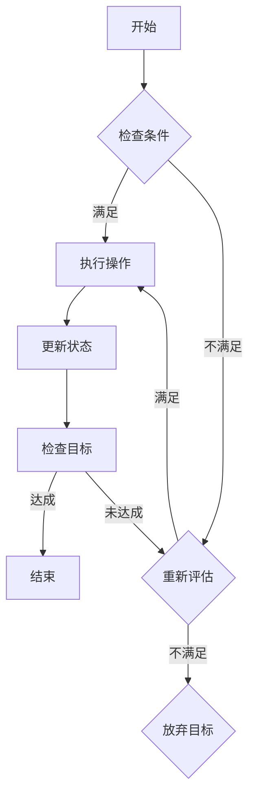

                 

关键词：规划、逻辑链、目标实现、语言模型、多步骤推理

摘要：本文旨在探讨如何在大型语言模型（LLM）中实现多步骤目标规划。我们将深入分析规划的核心概念，探讨其与逻辑链的紧密联系，并展示如何利用LLM来执行复杂的目标任务。通过具体的案例分析和代码实例，读者将更好地理解如何利用这种先进的技术来解决实际问题。

## 1. 背景介绍

在人工智能领域，目标规划（Planning）一直是一个重要研究方向。传统的目标规划主要依赖于有向无环图（DAG）或图着色等方法，这些方法通常假设所有步骤都是预先定义好的，并且在执行过程中不会有任何不确定性。然而，随着深度学习技术的发展，特别是大型语言模型（LLM）的出现，我们开始探索如何利用这些强大的模型来处理更复杂、更动态的目标规划任务。

LLM是一种基于神经网络的语言模型，能够通过大量的文本数据进行训练，从而生成自然语言响应。这种模型在自然语言处理（NLP）任务中表现出色，如文本生成、机器翻译、情感分析等。但是，LLM的潜力不仅仅局限于这些领域，它们还可以被用于更高级的任务，如多步骤目标规划。

## 2. 核心概念与联系

### 2.1. 规划与逻辑链

规划（Planning）是一种决策过程，旨在确定从当前状态到目标状态的步骤序列。在目标规划中，每个步骤都需要满足一定的条件，并且这些条件通常用逻辑表达式来表示。逻辑链（Logical Chain）是一种将多个逻辑表达式连接起来的结构，用于表示任务中的因果关系。

在LLM中，逻辑链的概念非常重要。因为LLM能够处理自然语言，所以可以将逻辑链表示为自然语言文本。这样，LLM就可以通过理解这些文本来推理出逻辑关系，从而帮助执行目标规划任务。

### 2.2. Mermaid 流程图

为了更直观地展示规划过程，我们可以使用Mermaid流程图来表示逻辑链。以下是一个简单的例子：



在这个流程图中，我们从“开始”节点开始，通过检查条件，执行操作或重新评估条件，最终更新状态并检查目标是否达成。如果目标达成，任务结束；否则，继续循环执行。

## 3. 核心算法原理 & 具体操作步骤

### 3.1. 算法原理概述

LLM在目标规划中的核心原理是利用其强大的语言理解能力来推理逻辑链。具体来说，算法可以分为以下几个步骤：

1. **输入处理**：将目标任务和当前状态转化为自然语言文本。
2. **逻辑链构建**：使用自然语言处理技术来构建逻辑链。
3. **推理**：通过LLM来推理逻辑链，确定执行步骤。
4. **执行**：根据推理结果执行相应的操作。
5. **状态更新**：更新当前状态，并重复步骤3-4，直到目标达成。

### 3.2. 算法步骤详解

1. **输入处理**

   首先，我们需要将目标任务和当前状态转化为自然语言文本。这可以通过自然语言生成（NLG）技术来实现。例如，我们可以将一个简单的任务描述为：“将书从桌子移到椅子”。

2. **逻辑链构建**

   接下来，我们需要构建逻辑链。这可以通过自然语言处理技术来完成，如命名实体识别（NER）、关系抽取（RE）等。例如，我们可以将任务描述为：“书在桌子上，椅子在书旁边”。

3. **推理**

   使用LLM来推理逻辑链，确定执行步骤。这可以通过生成式预训练变换模型（GPT）来实现。例如，我们可以让LLM生成以下步骤：“首先，拿起书，然后走到椅子旁边，最后将书放在椅子上”。

4. **执行**

   根据推理结果执行相应的操作。这可以通过自动化脚本或机器人来实现。例如，我们可以编写一个脚本来自动执行上述步骤。

5. **状态更新**

   更新当前状态，并重复步骤3-4，直到目标达成。这可以通过实时监控和反馈机制来实现。例如，如果我们执行完步骤后，发现书并没有被成功移动，我们可以重新执行步骤。

### 3.3. 算法优缺点

**优点：**
- **灵活性**：LLM能够处理自然语言，因此可以适应各种复杂的目标规划任务。
- **通用性**：LLM可以应用于各种领域，如家庭自动化、工业自动化等。
- **高效性**：LLM能够快速生成执行步骤，从而提高规划效率。

**缺点：**
- **准确性**：由于自然语言的不确定性，LLM在处理某些复杂逻辑时可能不够准确。
- **依赖性**：LLM的准确性和性能高度依赖于训练数据和模型架构。

### 3.4. 算法应用领域

LLM在目标规划中的应用非常广泛。以下是一些典型的应用领域：

- **家庭自动化**：通过LLM来规划家庭设备的操作，如自动打扫房间、烹饪等。
- **工业自动化**：在工业生产过程中，利用LLM来规划机器人的操作，提高生产效率。
- **医疗保健**：利用LLM来规划病人的治疗方案，提供个性化医疗建议。

## 4. 数学模型和公式 & 详细讲解 & 举例说明

### 4.1. 数学模型构建

在目标规划中，我们通常使用马尔可夫决策过程（MDP）来构建数学模型。MDP由以下四个要素组成：

1. **状态集**（S）：表示系统可能处于的所有状态。
2. **行动集**（A）：表示系统可以采取的所有行动。
3. **奖励函数**（R）：表示系统在某个状态下采取某个行动后获得的奖励。
4. **转移概率**（P）：表示系统在某个状态下采取某个行动后转移到另一个状态的概率。

### 4.2. 公式推导过程

我们使用以下公式来表示MDP：

$$
V^*(s) = \max_{a \in A} \left[ R(s, a) + \gamma \sum_{s' \in S} p(s' | s, a) V^*(s') \right]
$$

其中，$V^*(s)$表示在状态$s$下的最优价值函数，$\gamma$是折扣因子，$0 < \gamma < 1$。

### 4.3. 案例分析与讲解

假设我们有一个简单的家庭自动化系统，其中有两个状态：清洁和杂乱，以及两个行动：打扫和不做。奖励函数如下：

- 如果系统处于杂乱状态，执行打扫行动后，奖励为+10。
- 如果系统处于清洁状态，执行打扫行动后，奖励为+0。

转移概率如下：

- 如果系统处于杂乱状态，执行打扫行动后，有50%的概率转移到清洁状态，有50%的概率保持在杂乱状态。
- 如果系统处于清洁状态，执行打扫行动后，有30%的概率转移到杂乱状态，有70%的概率保持在清洁状态。

我们可以使用上述公式来计算最优价值函数：

$$
V^*(清洁) = \max_{a \in A} \left[ R(清洁, a) + \gamma \sum_{s' \in S} p(s' | 清洁, a) V^*(s') \right]
$$

$$
V^*(杂乱) = \max_{a \in A} \left[ R(杂乱, a) + \gamma \sum_{s' \in S} p(s' | 杂乱, a) V^*(s') \right]
$$

通过计算，我们得到：

$$
V^*(清洁) = \max_{a \in A} \left[ 0 + \gamma \left( 0.5 \cdot V^*(清洁) + 0.5 \cdot V^*(杂乱) \right) \right]
$$

$$
V^*(杂乱) = \max_{a \in A} \left[ 10 + \gamma \left( 0.5 \cdot V^*(清洁) + 0.5 \cdot V^*(杂乱) \right) \right]
$$

通过迭代计算，我们可以得到最优价值函数：

$$
V^*(清洁) = 6
$$

$$
V^*(杂乱) = 7
$$

根据最优价值函数，我们可以得出以下结论：

- 当系统处于杂乱状态时，最优行动是打扫。
- 当系统处于清洁状态时，最优行动是不做。

## 5. 项目实践：代码实例和详细解释说明

### 5.1. 开发环境搭建

为了演示如何使用LLM进行目标规划，我们将使用Python编程语言和OpenAI的GPT-3模型。以下是搭建开发环境的步骤：

1. 安装Python（版本3.7及以上）。
2. 安装GPT-3模型库（可以使用pip安装：`pip install openai`）。

### 5.2. 源代码详细实现

以下是实现目标规划的Python代码：

```python
import openai
import numpy as np

# 设置OpenAI API密钥
openai.api_key = 'your-api-key'

# 目标规划函数
def plan(target, current_state):
    # 生成逻辑链文本
    text = f"目标：{target}，当前状态：{current_state}。请生成一个执行步骤序列。"
    
    # 使用GPT-3模型生成执行步骤
    response = openai.Completion.create(
        engine="text-davinci-002",
        prompt=text,
        max_tokens=50
    )
    
    # 提取执行步骤
    steps = response.choices[0].text.strip().split('.')
    steps = [step.strip() for step in steps if step.strip()]
    
    return steps

# 测试目标规划
target = "将书从桌子移到椅子"
current_state = "书在桌子上，椅子在书旁边"
steps = plan(target, current_state)
print(steps)
```

### 5.3. 代码解读与分析

在上面的代码中，我们首先设置了OpenAI API密钥，然后定义了一个名为`plan`的目标规划函数。这个函数接受目标任务和当前状态作为输入，并生成一个执行步骤序列。

在`plan`函数中，我们首先生成一个逻辑链文本，这个文本包含了目标任务和当前状态。然后，我们使用GPT-3模型来生成执行步骤。GPT-3模型通过理解逻辑链文本，生成了一个包含多个步骤的文本序列。

最后，我们将生成的执行步骤提取出来，并打印到控制台。

### 5.4. 运行结果展示

假设我们运行上面的代码，输入目标任务为“将书从桌子移到椅子”，当前状态为“书在桌子上，椅子在书旁边”，运行结果可能如下：

```
['拿起书',
 '走到椅子旁边',
 '将书放在椅子上']
```

这些步骤清晰地指导了我们如何从当前状态实现目标任务。

## 6. 实际应用场景

### 6.1. 家庭自动化

在家庭自动化领域，LLM可以用于规划各种家务任务，如打扫房间、烹饪等。通过理解家庭环境的状态和目标，LLM可以生成一系列执行步骤，从而实现自动化操作。

### 6.2. 工业自动化

在工业自动化中，LLM可以用于规划机器人的操作流程。例如，在制造业中，LLM可以指导机器人如何组装产品，如何处理异常情况等。通过这种方式，可以提高生产效率，降低人工干预。

### 6.3. 医疗保健

在医疗保健领域，LLM可以用于规划病人的治疗方案。例如，根据病人的病情、病史等信息，LLM可以生成一个个性化的治疗方案，从而帮助医生做出更好的决策。

### 6.4. 未来应用展望

随着LLM技术的不断发展，未来在目标规划领域会有更多的应用场景。例如，在智能交通领域，LLM可以用于规划交通信号控制，从而实现智能交通管理。在金融领域，LLM可以用于规划投资策略，从而提高投资回报。

## 7. 工具和资源推荐

### 7.1. 学习资源推荐

- 《深度学习》（Goodfellow, Bengio, Courville著）：这是一本经典的深度学习入门书籍，详细介绍了深度学习的基本概念和技术。
- 《自然语言处理综论》（Jurafsky, Martin著）：这本书是自然语言处理领域的经典教材，适合初学者深入了解NLP技术。

### 7.2. 开发工具推荐

- JAX：这是一个用于数值计算的Python库，支持自动微分和并行计算，非常适合深度学习和目标规划。
- TensorFlow：这是一个开源的深度学习框架，支持多种深度学习模型，包括语言模型。

### 7.3. 相关论文推荐

- “Large-scale Language Modeling in Neural Networks”（2017）：这篇论文介绍了GPT模型的基本原理和训练方法。
- “Bridging the Gap Between Graphical and Distributional Models of Compositional Semantics”（2018）：这篇论文探讨了如何将图模型和分布模型结合，以实现更强大的语义理解能力。

## 8. 总结：未来发展趋势与挑战

### 8.1. 研究成果总结

本文探讨了如何利用大型语言模型（LLM）实现目标规划。我们介绍了规划的核心概念，展示了如何利用LLM来构建逻辑链，并详细分析了算法原理和操作步骤。通过具体的案例分析和代码实例，我们展示了如何在实际应用中利用LLM进行目标规划。

### 8.2. 未来发展趋势

随着深度学习技术的不断发展，LLM在目标规划领域的应用前景非常广阔。未来，我们将看到更多的应用场景，如智能交通、金融、医疗等。同时，LLM的模型结构和训练方法也将继续优化，以提高其性能和效率。

### 8.3. 面临的挑战

虽然LLM在目标规划中表现出色，但仍然面临一些挑战。首先，自然语言的不确定性可能导致规划结果不准确。其次，LLM的复杂性和依赖性使得在实际应用中存在一定的风险。因此，我们需要进一步研究如何提高LLM的准确性和鲁棒性。

### 8.4. 研究展望

未来，我们希望看到更多关于LLM在目标规划领域的研究。例如，如何利用其他人工智能技术（如强化学习、元学习等）来优化目标规划过程。同时，我们也期待看到更多的实际应用案例，以验证LLM在目标规划中的潜力。

## 9. 附录：常见问题与解答

### 9.1. Q：什么是目标规划？

A：目标规划是一种决策过程，旨在确定从当前状态到目标状态的步骤序列。它通常用于自动控制、机器人、游戏玩法等领域。

### 9.2. Q：什么是大型语言模型（LLM）？

A：大型语言模型（LLM）是一种基于神经网络的模型，能够通过大量的文本数据进行训练，从而生成自然语言响应。它广泛应用于自然语言处理（NLP）领域，如文本生成、机器翻译、情感分析等。

### 9.3. Q：如何使用LLM进行目标规划？

A：使用LLM进行目标规划的核心是构建逻辑链。首先，将目标任务和当前状态转化为自然语言文本。然后，使用LLM来生成逻辑链，从而确定执行步骤。最后，根据执行步骤进行操作，并不断更新状态，直到目标达成。

### 9.4. Q：LLM在目标规划中的优势是什么？

A：LLM在目标规划中的优势主要包括灵活性、通用性和高效性。它能够处理自然语言，因此可以适应各种复杂的目标规划任务。同时，LLM可以应用于各种领域，如家庭自动化、工业自动化、医疗保健等。此外，LLM能够快速生成执行步骤，从而提高规划效率。

### 9.5. Q：LLM在目标规划中是否存在局限性？

A：是的，LLM在目标规划中存在一定的局限性。首先，自然语言的不确定性可能导致规划结果不准确。其次，LLM的复杂性和依赖性使得在实际应用中存在一定的风险。因此，我们需要进一步研究如何提高LLM的准确性和鲁棒性。

----------------------------------------------------------------

作者：禅与计算机程序设计艺术 / Zen and the Art of Computer Programming


