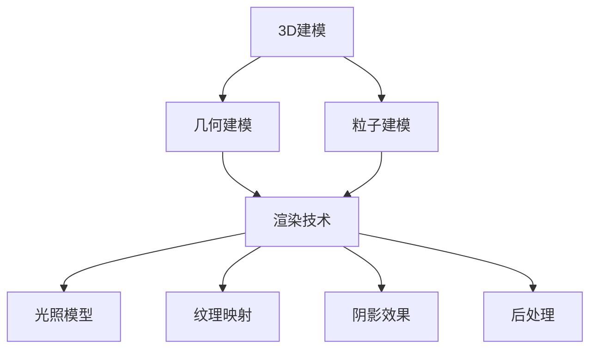

                 

关键词：计算机图形学、3D建模、渲染技术、图形渲染、光影效果、纹理映射、算法实现、案例讲解、实践应用、未来展望。

## 摘要

本文将深入探讨计算机图形学中的3D建模和渲染技术。我们将首先介绍3D建模的基本概念、方法和工具，然后详细讲解渲染技术的核心原理和实现步骤，包括光影效果、纹理映射等高级渲染技术。接着，我们将通过具体的案例和实践，展示如何在实际项目中运用这些技术，并分析其在实际应用中的优缺点。最后，我们将展望3D建模和渲染技术的未来发展趋势和挑战，为读者提供有益的参考。

## 1. 背景介绍

计算机图形学是计算机科学的一个重要分支，它涉及到计算机生成、处理和显示图像的各种技术。从早期的2D图形到现代的3D图形，计算机图形学的发展极大地改变了我们的视觉体验，并广泛应用于游戏、影视制作、建筑设计、医疗等多个领域。

3D建模是计算机图形学中的一个核心环节，它通过几何形状的构建来创建虚拟的三维物体。随着技术的进步，3D建模的精度和复杂度不断提高，为渲染技术提供了丰富的素材。

渲染技术则是将3D模型转化为二维图像的关键步骤，它涉及到光影效果、纹理映射、后处理等多个方面。高质量的渲染效果能够极大地提升图像的真实感，是现代计算机图形学的重要组成部分。

本文将围绕3D建模和渲染技术这两个核心主题，深入探讨其理论基础、实现方法和应用实践，旨在为读者提供全面的指导。

### 1.1 计算机图形学的定义与发展历史

计算机图形学是一门研究如何使用计算机生成和处理图像的学科。它涉及到图像的生成、存储、传输和显示等多个方面。计算机图形学的发展可以追溯到20世纪50年代，当时计算机刚刚开始被应用于科学研究和工程领域。

早期计算机图形学主要集中在2D图形的处理，如绘图、图像编辑和简单动画。随着计算机硬件和软件技术的发展，计算机图形学逐渐向3D图形领域拓展。3D图形的出现为计算机图形学带来了革命性的变化，使计算机能够更真实地模拟现实世界中的物体和场景。

在20世纪80年代和90年代，3D图形技术取得了显著进展。计算机图形处理器（GPU）的出现使得渲染速度大幅提升，同时算法和技术的进步也使得3D图形的复杂度显著提高。这一时期，计算机图形学开始广泛应用于游戏、影视制作和建筑设计等领域。

进入21世纪，随着虚拟现实（VR）和增强现实（AR）技术的兴起，计算机图形学再次迎来了新的发展机遇。现代计算机图形学不仅关注图像的真实感，还关注交互性和用户体验。例如，虚拟现实技术通过生成沉浸式的三维环境，为用户提供更加真实的体验。

### 1.2 3D建模的定义和重要性

3D建模是指使用计算机软件创建三维物体和场景的过程。它通过几何形状的构建、材质的赋予和动画的制作，使虚拟的三维世界变得更加丰富和真实。3D建模在计算机图形学中具有极其重要的地位，是许多应用领域的基础。

首先，3D建模在游戏制作中起着关键作用。无论是角色、场景还是道具，都需要通过3D建模来创建。高质量的3D模型不仅能够提升游戏的真实感，还能够提高游戏的性能和运行效率。

其次，3D建模在影视制作中也同样重要。通过3D建模，影视制作人员可以创建出各种复杂的场景和角色，实现逼真的视觉效果。例如，电影《阿凡达》中逼真的外星世界就是通过先进的3D建模技术实现的。

此外，3D建模在建筑设计领域也发挥着重要作用。建筑师可以使用3D建模软件来设计建筑的外观和内部结构，从而更好地展示设计意图和效果。通过3D模型，建筑师可以与客户进行更直观的交流，提高设计方案的可行性和满意度。

总之，3D建模不仅是计算机图形学的核心组成部分，也是许多实际应用领域的重要工具。随着技术的不断进步，3D建模的应用范围和影响力将进一步扩大。

### 1.3 渲染技术的定义和重要性

渲染技术是指将3D模型转化为二维图像或视频的过程，它通过模拟光线在物体表面的传播和反射，生成具有真实感的高质量图像。渲染技术是计算机图形学中的关键步骤，其质量直接影响到最终图像的真实性和视觉效果。

渲染技术在多个领域具有广泛的应用。在游戏制作中，高质量的渲染效果能够提升游戏体验，使玩家更加沉浸其中。例如，许多现代游戏采用了复杂的渲染技术，如全局光照、阴影效果和反走样等，以实现逼真的游戏世界。

在影视制作中，渲染技术同样至关重要。通过渲染，影视制作人员可以将3D模型转化为具有高度真实感的画面，为观众带来震撼的视觉体验。例如，电影《复仇者联盟》中各种特效镜头都是通过渲染技术实现的。

此外，渲染技术在建筑设计领域也发挥着重要作用。通过渲染，建筑师可以更直观地展示建筑设计方案，为客户和利益相关者提供更加生动的展示效果。高质量的渲染图像能够更好地传达设计意图，提高方案的可行性和满意度。

总之，渲染技术不仅是计算机图形学的重要组成部分，也是实现高质量图像和视频的关键。随着技术的不断进步，渲染技术在各个领域的应用将更加广泛和深入。

### 1.4 本文的结构和内容

本文将系统地介绍3D建模和渲染技术，内容结构如下：

- **第1章：背景介绍**：回顾计算机图形学、3D建模和渲染技术的发展历史，并阐述它们的重要性和应用领域。

- **第2章：核心概念与联系**：详细介绍3D建模的基本概念、方法和工具，以及渲染技术的核心原理和架构。同时，通过Mermaid流程图展示3D建模和渲染的主要步骤和联系。

- **第3章：核心算法原理 & 具体操作步骤**：深入讲解3D建模和渲染技术中的核心算法原理，包括几何建模、纹理映射、光照模型等。此外，还将提供详细的操作步骤，帮助读者理解和掌握这些技术。

- **第4章：数学模型和公式 & 详细讲解 & 举例说明**：介绍3D建模和渲染技术中的数学模型和公式，并对其进行详细讲解。通过实际案例分析和讲解，帮助读者更好地理解这些理论。

- **第5章：项目实践：代码实例和详细解释说明**：通过具体的代码实例，展示如何在实际项目中应用3D建模和渲染技术。读者可以跟随实例，了解代码的实现过程和关键部分。

- **第6章：实际应用场景**：探讨3D建模和渲染技术在实际应用中的案例，包括游戏制作、影视制作和建筑设计等。通过案例分析，展示这些技术在具体应用中的效果和挑战。

- **第7章：工具和资源推荐**：推荐相关的学习资源和开发工具，帮助读者进一步学习和实践3D建模和渲染技术。

- **第8章：总结：未来发展趋势与挑战**：总结3D建模和渲染技术的研究成果和未来发展趋势，探讨面临的挑战，为读者提供研究展望。

通过本文的深入探讨，读者将全面了解3D建模和渲染技术的核心知识和实践方法，为实际应用和进一步研究奠定基础。

## 2. 核心概念与联系

在深入探讨3D建模和渲染技术之前，首先需要了解其中的核心概念及其相互之间的联系。本节将详细阐述3D建模的基本概念、方法和工具，以及渲染技术的核心原理和架构，并通过Mermaid流程图展示它们的主要步骤和联系。

### 2.1 3D建模的基本概念

3D建模是指使用计算机软件创建三维物体和场景的过程。它是计算机图形学中的一个核心环节，涉及到几何形状的构建、材质的赋予和动画的制作。以下是3D建模中的一些基本概念：

- **三维坐标系**：三维坐标系是3D建模的基础，用于定义物体的位置和姿态。它由三个互相垂直的轴（通常为X轴、Y轴和Z轴）组成，可以精确地描述物体的空间位置。

- **顶点（Vertices）**：顶点是3D模型中的基本元素，它代表了一个三维空间中的点。通过连接多个顶点，可以构建出复杂的几何形状。

- **边（Edges）**：边是连接两个顶点的线条，是3D模型的基本结构单元。边可以帮助定义模型的轮廓和细节。

- **面（Faces）**：面是由三个或更多顶点连接而成的平面区域，是3D模型的基本表面单元。面的形状和数量决定了模型的复杂度和细节程度。

- **网格（Mesh）**：网格是由多个面连接而成的三维结构，是大多数3D模型的基本表示形式。网格可以由三角形、四边形或其他多边形组成。

- **建模工具**：常见的3D建模工具包括Blender、Maya、3ds Max等，这些工具提供了丰富的功能，帮助用户高效地创建和编辑3D模型。

### 2.2 3D建模的方法和工具

3D建模的方法可以分为两大类：几何建模和粒子建模。

- **几何建模**：几何建模是最常见的3D建模方法，它通过定义物体的几何形状来实现建模。几何建模主要依赖于顶点、边和面来构建模型，常用的工具包括多边形建模、NURBS建模和曲面建模等。

  - **多边形建模**：多边形建模是一种基于三角形的建模方法，它通过定义顶点和面的关系来创建复杂的几何形状。这种方法简单且高效，适用于大多数3D建模任务。
  
  - **NURBS建模**：NURBS（非均匀有理B样条）建模是一种基于参数化曲线和曲面建模的方法。它通过控制点、权重和曲线的形状来创建高质量的曲面模型，广泛应用于汽车设计、建筑设计和工业设计等领域。
  
  - **曲面建模**：曲面建模是一种通过创建曲面来定义模型的方法。这种方法通常用于创建平滑、连续的曲面，如船体、飞机外壳等。

- **粒子建模**：粒子建模是一种基于粒子的建模方法，它通过大量粒子的分布和运动来生成复杂的几何形状。这种方法通常用于模拟自然现象，如烟雾、火焰、云等。

### 2.3 渲染技术的核心原理和架构

渲染技术是将3D模型转化为二维图像或视频的过程，它涉及到多个步骤和算法，包括光照、阴影、纹理映射和后处理等。以下是渲染技术的核心原理和架构：

- **光照模型**：光照模型用于模拟光线在物体表面的传播和反射。常见的光照模型包括漫反射、镜面反射、全局光照等。这些模型决定了物体表面的亮度和颜色。

- **纹理映射**：纹理映射是一种将二维图像映射到三维物体表面的方法，用于增强物体的细节和质感。纹理映射可以分为平面纹理映射、投影纹理映射和三维纹理映射等。

- **阴影效果**：阴影效果是渲染技术中的重要组成部分，它通过模拟光线在物体和场景中的遮挡和反射，生成具有真实感的阴影。常见阴影效果包括软阴影、硬阴影、阴影映射等。

- **后处理**：后处理是对渲染图像进行进一步处理和调整的过程，用于增强图像的真实感和视觉效果。常见的后处理技术包括色彩校正、模糊效果、锐化效果等。

### 2.4 Mermaid流程图展示

为了更好地理解3D建模和渲染技术的主要步骤和联系，我们使用Mermaid流程图来展示它们的过程。以下是一个简化的流程图：



在这个流程图中，3D建模分为几何建模和粒子建模两个部分，它们分别通过不同的方法生成三维物体。然后，这些物体通过渲染技术进行渲染，涉及到光照模型、纹理映射、阴影效果和后处理等多个步骤，最终生成高质量的图像或视频。

通过上述内容的详细阐述和流程图的展示，我们更好地理解了3D建模和渲染技术的核心概念和联系。接下来，我们将深入探讨3D建模和渲染技术的具体原理和实现方法。

### 2.5 3D建模的详细解释和具体实现

3D建模是一个复杂而细致的过程，它通过定义几何形状、赋予材质和创建动画，使虚拟世界中的物体和场景更加逼真和生动。在本节中，我们将详细解释3D建模的各个步骤和具体实现方法，帮助读者深入理解这一核心技术。

#### 2.5.1 几何建模

几何建模是3D建模的基础，它通过顶点、边和面的组合来构建三维物体。以下是几何建模的详细步骤：

1. **定义三维坐标系**：首先，我们需要在一个三维坐标系中定义物体的位置和姿态。三维坐标系由X轴、Y轴和Z轴组成，每个轴上的点代表一个坐标值。通过这些坐标值，我们可以精确地描述物体在空间中的位置。

2. **创建顶点**：顶点是3D模型的基本元素，它代表了一个三维空间中的点。在建模过程中，我们需要根据物体的形状和特征，创建多个顶点。例如，一个立方体有8个顶点，一个球体有无数个顶点。

3. **连接顶点**：通过连接顶点，我们可以构建出基本的几何形状。例如，通过连接四个顶点，我们可以创建一个四面体；通过连接六个顶点，我们可以创建一个六面体。这些几何形状是3D模型的基础结构。

4. **定义面**：面是3D模型的基本表面单元，它由三个或多个顶点组成。在建模过程中，我们需要为每个几何形状定义多个面。例如，一个四面体有四个面，一个六面体有六个面。这些面的形状和数量决定了模型的复杂度和细节程度。

5. **构建网格**：网格是由多个面连接而成的三维结构，是大多数3D模型的基本表示形式。通过构建网格，我们可以将复杂的几何形状表示为多边形。常见的网格结构包括三角形网格、四边形网格和其他多边形网格。

6. **优化网格**：在建模过程中，我们可能需要优化网格的形状和质量。优化网格可以减少模型的复杂度，提高渲染效率。常见的优化方法包括网格简化、拓扑优化和几何变换等。

7. **使用建模工具**：常见的3D建模工具包括Blender、Maya、3ds Max等。这些工具提供了丰富的功能，可以帮助用户高效地创建和编辑3D模型。例如，Blender提供了多边形建模、曲线建模和曲面建模等多种建模方法，用户可以根据需要选择合适的方法。

#### 2.5.2 粒子建模

粒子建模是一种基于粒子的建模方法，它通过大量粒子的分布和运动来生成复杂的几何形状。粒子建模适用于模拟自然现象，如烟雾、火焰、云等。以下是粒子建模的详细步骤：

1. **定义粒子系统**：首先，我们需要定义粒子系统的参数，包括粒子的数量、大小、形状、颜色等。这些参数决定了粒子系统的外观和效果。

2. **创建粒子**：根据粒子系统的参数，我们在三维空间中创建多个粒子。每个粒子代表一个点，通过粒子的分布和运动，我们可以生成复杂的几何形状。

3. **定义粒子运动**：粒子运动是粒子建模的关键部分。通过定义粒子的运动轨迹和速度，我们可以生成各种自然现象，如烟雾的扩散、火焰的燃烧等。常见的运动模式包括随机运动、确定性运动和物理运动等。

4. **粒子之间的相互作用**：在粒子建模中，粒子之间可以发生相互作用，如碰撞、吸引、排斥等。这些相互作用可以增强粒子系统的真实感和效果。

5. **优化粒子系统**：在建模过程中，我们可能需要优化粒子系统的质量和性能。优化方法包括减少粒子数量、简化粒子形状、优化粒子分布等。

6. **使用建模工具**：常见的粒子建模工具包括Blender、Houdini等。这些工具提供了丰富的功能，可以帮助用户高效地创建和编辑粒子系统。

#### 2.5.3 材质和纹理

在3D建模过程中，除了几何形状，材质和纹理也是非常重要的部分。材质用于定义物体表面的质感，如光泽度、透明度等。纹理则是用来模拟物体表面的细节和图案。

1. **定义材质**：在建模工具中，我们需要为每个物体定义材质。材质包括多个属性，如颜色、光泽度、透明度等。这些属性决定了物体表面的外观和质感。

2. **创建纹理**：纹理是2D图像，用于映射到3D物体表面上。通过创建和编辑纹理，我们可以增强物体的细节和真实感。常见的纹理类型包括漫反射纹理、反射纹理、折射纹理等。

3. **纹理映射**：纹理映射是将纹理图像映射到3D物体表面的过程。通过纹理映射，我们可以将纹理图像的图案和颜色应用到物体表面上，模拟各种材质效果。

4. **使用材质和纹理工具**：常见的材质和纹理工具包括Blender、Maya、3ds Max等。这些工具提供了丰富的功能，可以帮助用户创建和编辑材质和纹理。

通过上述详细的解释和具体实现，我们更好地理解了3D建模的各个步骤和关键技术。接下来，我们将进一步探讨渲染技术的核心原理和实现方法。

### 2.6 渲染技术的核心算法原理与实现

渲染技术是将3D模型转化为二维图像或视频的关键步骤，它涉及到多个核心算法和实现方法。在本节中，我们将详细讲解渲染技术的核心算法原理，包括几何渲染、光照模型、阴影效果、纹理映射和后处理等，并分析每个算法的实现原理和具体操作步骤。

#### 2.6.1 几何渲染

几何渲染是渲染过程的基础，它涉及到3D模型到二维图像的转换。以下是几何渲染的实现原理和具体步骤：

1. **视图投影**：视图投影是将3D模型投影到二维屏幕上的过程。常见的视图投影方法包括正交投影和透视投影。正交投影保持了物体之间的真实比例，适用于游戏和建筑可视化；透视投影则模拟了人眼的视觉感知，适用于影视制作和动画制作。

2. **裁剪**：裁剪是将视图空间中不在屏幕范围内的物体部分剪除的过程。裁剪可以减少渲染的计算量，提高渲染效率。

3. **背面剔除**：背面剔除是去除3D模型中不可见的面的过程。通过背面剔除，可以减少渲染的计算量，提高渲染效率。

4. **顶点处理**：顶点处理包括顶点的变换、插值和光照计算等。在顶点处理过程中，我们将3D模型的顶点坐标变换到视图空间，并进行插值计算，如法线插值、纹理坐标插值等。同时，我们还需要对顶点进行光照计算，以确定顶点的亮度和颜色。

5. **光栅化**：光栅化是将几何数据转换为像素数据的过程。在光栅化过程中，我们将3D模型的顶点数据转换为像素网格，并计算每个像素的颜色。

#### 2.6.2 光照模型

光照模型用于模拟光线在物体表面的传播和反射，它决定了物体表面的亮度和颜色。以下是几种常见光照模型及其实现原理：

1. **漫反射光照模型**：漫反射光照模型是最简单的一种光照模型，它假设光线在物体表面均匀反射。漫反射光照模型的实现步骤包括：
   - **计算光照方向**：根据光源位置和物体表面的法线方向，计算光照方向。
   - **计算光照强度**：根据光照方向和物体表面的角度，计算光照强度。
   - **颜色计算**：将光照强度与物体表面的颜色相乘，得到光照后的颜色。

2. **镜面反射光照模型**：镜面反射光照模型用于模拟光线在光滑表面的反射。镜面反射光照模型的实现步骤包括：
   - **计算反射方向**：根据光线方向和物体表面的法线方向，计算反射方向。
   - **计算反射光照强度**：根据反射方向和光源的位置，计算反射光照强度。
   - **颜色计算**：将反射光照强度与物体表面的颜色相乘，得到反射光照后的颜色。

3. **全局光照模型**：全局光照模型用于模拟光线在场景中的多次反射和散射。全局光照模型的实现步骤包括：
   - **光线追踪**：从物体表面的每个顶点出发，追踪光线与场景中其他物体的交点。
   - **计算光照贡献**：根据光线的路径和交点，计算每个顶点的光照贡献。
   - **颜色计算**：将所有光照贡献累加，得到光照后的颜色。

#### 2.6.3 阴影效果

阴影效果是渲染技术中的一个重要部分，它用于模拟光线在物体和场景中的遮挡和反射。以下是几种常见阴影效果及其实现原理：

1. **硬阴影**：硬阴影是光线在物体边缘产生的清晰阴影。硬阴影的实现步骤包括：
   - **计算阴影方向**：根据光源位置和物体表面的法线方向，计算阴影方向。
   - **计算阴影边界**：根据阴影方向和物体表面的角度，计算阴影边界。
   - **颜色计算**：将阴影边界上的像素设置为阴影颜色。

2. **软阴影**：软阴影是光线在物体边缘产生的模糊阴影。软阴影的实现步骤包括：
   - **计算阴影方向**：与硬阴影相同。
   - **计算阴影区域**：根据阴影方向和物体表面的角度，计算阴影区域。
   - **颜色插值**：在阴影区域进行颜色插值，使阴影边缘更加平滑。

3. **阴影映射**：阴影映射是一种通过纹理映射实现阴影效果的方法。阴影映射的实现步骤包括：
   - **生成阴影纹理**：根据场景中物体的遮挡关系，生成阴影纹理。
   - **纹理映射**：将阴影纹理映射到物体表面上，模拟阴影效果。

#### 2.6.4 纹理映射

纹理映射是将2D纹理图像映射到3D物体表面的过程，它用于增强物体的细节和质感。以下是纹理映射的实现原理和具体步骤：

1. **纹理贴图**：纹理贴图是将纹理图像映射到物体表面的过程。纹理贴图可以分为平面纹理映射、投影纹理映射和三维纹理映射等。

2. **纹理采样**：纹理采样是在物体表面选择采样点的过程。通过纹理采样，我们可以从纹理图像中提取颜色信息，并应用到物体表面。

3. **纹理过滤**：纹理过滤是用于平滑纹理图像的过程。常见的纹理过滤方法包括最近邻过滤、线性过滤和双线性过滤等。

#### 2.6.5 后处理

后处理是对渲染图像进行进一步处理和调整的过程，它用于增强图像的真实感和视觉效果。以下是几种常见后处理效果及其实现原理：

1. **色彩校正**：色彩校正是对渲染图像的色彩进行调整的过程。通过色彩校正，我们可以调整图像的亮度、对比度、色调等，使其更加真实和生动。

2. **模糊效果**：模糊效果是用于模拟光线的散射和反射的过程。常见的模糊效果包括高斯模糊、卷积模糊等。

3. **锐化效果**：锐化效果是用于增强图像细节和清晰度的过程。通过锐化效果，我们可以使图像的边缘更加清晰。

通过上述详细讲解，我们深入了解了渲染技术的核心算法原理和实现方法。这些算法和技术在渲染过程中发挥着关键作用，使得3D模型能够以逼真的方式呈现出来。接下来，我们将通过具体的案例和实践，展示如何在实际项目中应用这些技术。

### 2.7 渲染技术的优缺点分析

在了解了渲染技术的核心算法原理和实现方法之后，我们需要进一步分析渲染技术的优缺点，以便更好地理解其在实际应用中的表现和局限性。

#### 优点

1. **真实感强**：渲染技术通过模拟光线在物体表面的传播和反射，能够生成具有高度真实感的图像和视频。这使得渲染技术在影视制作、游戏开发和建筑设计等领域具有广泛的应用价值。

2. **灵活性高**：渲染技术具有很高的灵活性，通过不同的光照模型、纹理映射和后处理技术，可以创造出丰富的视觉效果。这使得渲染技术能够适应各种不同的应用场景和创意需求。

3. **高效性**：随着计算机硬件和软件技术的发展，渲染技术逐渐变得高效。现代GPU（图形处理器）能够快速处理复杂的渲染任务，大大提高了渲染速度和性能。

4. **交互性**：通过虚拟现实（VR）和增强现实（AR）技术，渲染技术可以实现与用户的互动。这使得渲染技术在教育和娱乐等领域具有巨大的潜力。

#### 缺点

1. **计算资源消耗大**：渲染技术需要大量的计算资源，尤其是在处理复杂场景和高质量渲染时。这可能导致渲染时间较长，对计算机硬件要求较高。

2. **学习成本高**：渲染技术涉及多个领域和知识点，如几何建模、光照模型、纹理映射等。这需要用户具备一定的专业知识和技能，学习成本相对较高。

3. **渲染精度受限**：尽管渲染技术能够生成高度真实的图像，但仍然存在一定的精度限制。例如，全局光照和软阴影的计算复杂度较高，可能导致渲染结果存在误差。

4. **渲染稳定性问题**：在某些情况下，渲染技术可能存在稳定性问题，如渲染过程中出现错误或崩溃。这需要用户具备一定的调试和优化能力，以确保渲染过程的稳定性。

综上所述，渲染技术在真实感、灵活性和高效性方面具有显著优势，但在计算资源消耗、学习成本和渲染精度方面存在一定的局限。在实际应用中，我们需要根据具体需求权衡这些优缺点，选择合适的渲染技术。

### 2.8 渲染技术的应用领域

渲染技术凭借其强大的真实感和灵活性，广泛应用于多个领域，包括游戏制作、影视制作、建筑设计和工业设计等。以下是渲染技术在各个领域中的应用和案例分析：

#### 游戏制作

在游戏制作中，渲染技术是不可或缺的一部分，它负责将3D模型和场景转化为逼真的游戏画面。高质量的渲染效果能够提升游戏的沉浸感和用户体验。例如，现代游戏《赛博朋克2077》采用了先进的渲染技术，包括全局光照、软阴影和反射效果，使得游戏世界充满真实感和细节。

**案例分析**：游戏《荒野大镖客：救赎2》通过高质量的渲染技术，实现了逼真的自然环境和角色动画。游戏中的光影效果、天气系统和植被纹理，使得玩家仿佛置身于一个真实的西部世界。

#### 影视制作

影视制作中的渲染技术同样至关重要，它能够为观众带来震撼的视觉体验。通过渲染技术，影视制作人员可以创建出各种复杂的场景和角色，实现逼真的视觉效果。例如，电影《阿凡达》通过先进的3D渲染技术，创造了一个充满奇幻色彩的外星世界。

**案例分析**：电影《复仇者联盟：终局之战》中，漫威利用了渲染技术，成功地将虚拟角色与实际演员融合在一起，创造出令人难以置信的战斗场景和特效。

#### 建筑设计

在建筑设计中，渲染技术可以直观地展示设计方案，帮助建筑师与客户进行更有效的沟通。通过渲染，建筑师可以模拟光线、材质和颜色，使设计方案更加真实和有说服力。

**案例分析**：著名建筑事务所Snøhetta使用渲染技术，成功展示了其设计的纽约公共图书馆新馆。高质量的渲染图像不仅展示了建筑的外观，还反映了其内部空间和功能布局。

#### 工业设计

在工业设计中，渲染技术用于展示产品外观和细节，帮助设计师评估产品的可行性和市场潜力。通过渲染，设计师可以快速创建出高质量的产品图像，进行市场推广和宣传。

**案例分析**：知名电子产品公司苹果公司，通过高质量的渲染技术，展示其新产品设计。苹果的产品渲染图像不仅展示了产品的外观和功能，还传递了其品牌形象和设计理念。

综上所述，渲染技术在游戏制作、影视制作、建筑设计和工业设计等领域具有广泛的应用，为各个领域带来了革命性的变化。通过高质量的渲染效果，我们可以创造出更加真实和生动的虚拟世界，提升用户体验和设计效果。

### 2.9 渲染技术中的光影效果

在渲染技术中，光影效果是关键的一环，它能够极大地提升图像的真实感和视觉效果。光影效果包括光照模型、阴影效果和反走样技术等，下面我们将详细讲解这些内容。

#### 光照模型

光照模型用于模拟光线在物体表面的传播和反射，它是渲染技术中的核心部分。常见的光照模型包括：

1. **漫反射光照模型**：漫反射光照模型是最简单的光照模型，它假设光线在物体表面均匀反射。漫反射光照模型的实现步骤包括：
   - **计算光照方向**：根据光源位置和物体表面的法线方向，计算光照方向。
   - **计算光照强度**：根据光照方向和物体表面的角度，计算光照强度。
   - **颜色计算**：将光照强度与物体表面的颜色相乘，得到光照后的颜色。

2. **镜面反射光照模型**：镜面反射光照模型用于模拟光线在光滑表面的反射。镜面反射光照模型的实现步骤包括：
   - **计算反射方向**：根据光线方向和物体表面的法线方向，计算反射方向。
   - **计算反射光照强度**：根据反射方向和光源的位置，计算反射光照强度。
   - **颜色计算**：将反射光照强度与物体表面的颜色相乘，得到反射光照后的颜色。

3. **全局光照模型**：全局光照模型用于模拟光线在场景中的多次反射和散射。全局光照模型的实现步骤包括：
   - **光线追踪**：从物体表面的每个顶点出发，追踪光线与场景中其他物体的交点。
   - **计算光照贡献**：根据光线的路径和交点，计算每个顶点的光照贡献。
   - **颜色计算**：将所有光照贡献累加，得到光照后的颜色。

#### 阴影效果

阴影效果是渲染技术中的一个重要部分，它用于模拟光线在物体和场景中的遮挡和反射。常见的阴影效果包括：

1. **硬阴影**：硬阴影是光线在物体边缘产生的清晰阴影。硬阴影的实现步骤包括：
   - **计算阴影方向**：根据光源位置和物体表面的法线方向，计算阴影方向。
   - **计算阴影边界**：根据阴影方向和物体表面的角度，计算阴影边界。
   - **颜色计算**：将阴影边界上的像素设置为阴影颜色。

2. **软阴影**：软阴影是光线在物体边缘产生的模糊阴影。软阴影的实现步骤包括：
   - **计算阴影方向**：与硬阴影相同。
   - **计算阴影区域**：根据阴影方向和物体表面的角度，计算阴影区域。
   - **颜色插值**：在阴影区域进行颜色插值，使阴影边缘更加平滑。

3. **阴影映射**：阴影映射是一种通过纹理映射实现阴影效果的方法。阴影映射的实现步骤包括：
   - **生成阴影纹理**：根据场景中物体的遮挡关系，生成阴影纹理。
   - **纹理映射**：将阴影纹理映射到物体表面上，模拟阴影效果。

#### 反走样技术

反走样技术是用于改善渲染图像质量的一种方法，它用于消除渲染过程中的走样现象。常见的反走样技术包括：

1. **超采样**：超采样是一种通过增加像素数量来改善图像质量的方法。超采样的实现步骤包括：
   - **计算多个采样点**：在图像上计算多个采样点，这些采样点比原始像素更密集。
   - **颜色插值**：根据采样点的颜色值，进行插值计算，得到更平滑的像素颜色。

2. **MLAA（多点抗走样算法）**：MLAA是一种用于消除走样的算法，它通过分析图像中的边缘和纹理，进行颜色插值和修正。MLAA的实现步骤包括：
   - **边缘检测**：检测图像中的边缘。
   - **颜色插值**：根据边缘的位置和方向，进行颜色插值，消除走样现象。

3. **屏幕空间后处理**：屏幕空间后处理是一种通过在渲染后对图像进行后期处理来改善图像质量的方法。常见的屏幕空间后处理技术包括：
   - **阴影增强**：通过增强阴影细节，提高图像的真实感。
   - **模糊效果**：通过模糊处理，减少图像中的噪声和细节。
   - **颜色校正**：通过调整图像的亮度、对比度和色调，使图像更加真实和生动。

通过上述内容，我们深入了解了渲染技术中的光影效果，包括光照模型、阴影效果和反走样技术。这些技术在渲染过程中发挥着关键作用，使得图像和视频具有高度的真实感和视觉效果。

### 2.10 渲染技术中的纹理映射

纹理映射是渲染技术中的一个重要组成部分，它通过将2D纹理图像映射到3D物体表面，增强了物体的细节和质感。纹理映射不仅使3D模型看起来更加真实，还能够提升图像的整体视觉效果。以下是纹理映射的详细解释和具体实现方法。

#### 2.10.1 纹理映射的基本概念

纹理映射是将2D纹理图像映射到3D物体表面的过程。纹理图像可以是任何类型的图像，如漫反射纹理、反射纹理、折射纹理等。纹理映射可以分为以下几种类型：

1. **平面纹理映射**：平面纹理映射是将纹理图像直接映射到物体表面上。这种方法简单且易于实现，适用于大多数表面。

2. **投影纹理映射**：投影纹理映射是将纹理图像投影到物体表面上。投影纹理映射可以分为正投影、侧投影和斜投影等。通过调整投影方向和角度，可以模拟各种光照效果。

3. **三维纹理映射**：三维纹理映射是将纹理图像映射到三维空间中的曲面上。这种方法适用于复杂形状的物体，如曲面模型。

#### 2.10.2 纹理映射的实现方法

纹理映射的实现方法包括以下几个步骤：

1. **纹理图像的创建**：首先，我们需要创建纹理图像。纹理图像可以是照片、卡通图案或其他类型的图像。在创建纹理图像时，需要考虑图像的分辨率、颜色深度和纹理细节等因素。

2. **纹理坐标的分配**：为了将纹理图像映射到3D物体表面，我们需要为每个顶点分配纹理坐标。纹理坐标是二维的，通常使用(u, v)表示。通过设置合适的纹理坐标，可以控制纹理图像在物体表面的映射方式。

3. **纹理采样**：纹理采样是在物体表面选择采样点的过程。通过纹理采样，我们从纹理图像中提取颜色信息，并应用到物体表面。常见的纹理采样方法包括最近邻采样、线性采样和双线性采样等。

4. **纹理过滤**：纹理过滤是用于平滑纹理图像的过程。通过纹理过滤，我们可以减少纹理图像的模糊和失真。常见的纹理过滤方法包括最近邻过滤、线性过滤和双线性过滤等。

5. **纹理映射的应用**：最后，我们将纹理映射应用到3D物体上。通过调整纹理坐标、纹理采样和纹理过滤等参数，我们可以实现各种纹理映射效果，如漫反射、反射、折射等。

#### 2.10.3 纹理映射的应用案例

纹理映射在多个领域有着广泛的应用，以下是一些典型的应用案例：

1. **游戏开发**：在游戏开发中，纹理映射可以用于提升游戏场景和角色的真实感。通过纹理映射，我们可以为场景中的物体添加各种细节和材质效果，如石头、草地、金属等。

2. **影视制作**：在影视制作中，纹理映射可以用于创建逼真的角色和场景。通过纹理映射，我们可以模拟各种材质和光照效果，如皮肤、衣服、光线反射等。

3. **建筑可视化**：在建筑可视化中，纹理映射可以用于展示建筑设计方案。通过纹理映射，我们可以为建筑物的表面添加各种材质和细节，如涂料、玻璃、木材等。

4. **工业设计**：在工业设计中，纹理映射可以用于展示产品外观和细节。通过纹理映射，我们可以为产品表面添加各种纹理和材质效果，如金属、塑料、织物等。

总之，纹理映射是渲染技术中的一个关键环节，它通过将2D纹理图像映射到3D物体表面，增强了图像的真实感和视觉效果。通过合理的纹理映射，我们可以创造出更加生动和逼真的虚拟世界。

### 2.11 渲染技术的数学模型和公式

在渲染技术的实现过程中，数学模型和公式起着至关重要的作用。它们帮助我们精确地描述光线的行为、物体的形状以及材质的属性。以下我们将详细介绍渲染技术中的几个关键数学模型和公式，并给出详细的推导过程和实际应用实例。

#### 2.11.1 光照模型

光照模型是渲染技术中的核心部分，用于计算物体表面的亮度和颜色。最常用的光照模型是标准光照模型，它包括漫反射光照、镜面反射光照和透射光照。

1. **漫反射光照（Lambert光照模型）**：

   漫反射光照模型假设光线在物体表面上均匀反射。其计算公式为：

   \[ L_{diffuse} = I_d \cdot max(0, n \cdot l) \]

   其中：
   - \( L_{diffuse} \) 是漫反射光照强度。
   - \( I_d \) 是漫反射光照系数，通常为1。
   - \( n \) 是物体表面的法线向量。
   - \( l \) 是入射光线的方向向量。

   推导过程：
   - 入射光线与法线向量之间的夹角为 \( \theta \)。
   - 漫反射光照强度与入射光线和法线之间的余弦值成正比。

2. **镜面反射光照（Phong光照模型）**：

   镜面反射光照模型用于模拟光线在光滑表面的反射。其计算公式为：

   \[ L_{specular} = I_s \cdot (2 \cdot n \cdot l - v) \]

   其中：
   - \( L_{specular} \) 是镜面反射光照强度。
   - \( I_s \) 是镜面反射光照系数，通常为材料属性的一部分。
   - \( n \) 是物体表面的法线向量。
   - \( l \) 是入射光线的方向向量。
   - \( v \) 是视线的方向向量。

   推导过程：
   - 反射光线与法线向量之间的夹角为 \( \theta \)。
   - 镜面反射光照强度与入射光线、法线向量和视线之间的夹角有关。

3. **透射光照**：

   透射光照模型用于模拟光线通过透明物体的传播。其计算公式为：

   \[ L_{transmission} = I_t \cdot (1 - \alpha) \]

   其中：
   - \( L_{transmission} \) 是透射光照强度。
   - \( I_t \) 是透射光照系数，通常为材料属性的一部分。
   - \( \alpha \) 是透明度参数。

   推导过程：
   - 透射光照强度与材料的透明度有关，光线部分穿透物体，部分被吸收。

#### 2.11.2 纹理映射

纹理映射是渲染技术中用于增加物体表面细节的重要手段。其核心在于将2D纹理图像映射到3D物体表面上。

1. **纹理坐标映射**：

   纹理坐标映射是将纹理图像上的像素映射到3D物体表面的过程。其公式为：

   \[ u = u_0 + r \cdot u_1 + s \cdot u_2 \]
   \[ v = v_0 + r \cdot v_1 + s \cdot v_2 \]

   其中：
   - \( (u, v) \) 是纹理坐标。
   - \( (u_0, v_0) \) 是纹理坐标原点。
   - \( (u_1, v_1) \)，\( (u_2, v_2) \) 是纹理坐标的变换向量。
   - \( r \) 和 \( s \) 是变换参数。

   推导过程：
   - 通过线性变换，将物体表面上的点映射到纹理图像上的对应点。

2. **纹理采样**：

   纹理采样是在物体表面选择采样点的过程，用于从纹理图像中提取颜色信息。其公式为：

   \[ color = \text{sampleTexture}(texture, u, v) \]

   其中：
   - \( \text{sampleTexture} \) 是纹理采样函数。
   - \( texture \) 是纹理图像。
   - \( (u, v) \) 是纹理坐标。

   推导过程：
   - 通过查找纹理图像上的采样点，获取颜色值。

#### 2.11.3 反走样技术

反走样技术是用于改善渲染图像质量的一种方法，它通过增加采样点来减少图像中的锯齿现象。

1. **超采样**：

   超采样是一种通过增加像素数量来改善图像质量的方法。其公式为：

   \[ newColor = \frac{1}{N} \sum_{i=1}^{N} \text{sampleTexture}(texture, u_i, v_i) \]

   其中：
   - \( newColor \) 是新的像素颜色。
   - \( N \) 是采样点的数量。
   - \( (u_i, v_i) \) 是采样点的纹理坐标。

   推导过程：
   - 通过对多个采样点进行平均，减少图像中的噪声和锯齿现象。

2. **MLAA（多点抗走样算法）**：

   MLAA 是一种用于消除走样的算法，它通过分析图像中的边缘和纹理进行颜色插值和修正。其公式为：

   \[ color = \text{MLAA}(image, edge, texture) \]

   其中：
   - \( color \) 是新的像素颜色。
   - \( image \) 是原始图像。
   - \( edge \) 是图像中的边缘信息。
   - \( texture \) 是纹理图像。

   推导过程：
   - 通过边缘检测和分析，根据纹理信息进行颜色插值，消除走样现象。

通过上述数学模型和公式的介绍，我们深入了解了渲染技术中的关键概念和计算方法。这些模型和公式在实际渲染过程中发挥着至关重要的作用，帮助我们实现高质量的图像和视频。

### 2.12 项目实践：代码实例和详细解释说明

为了更好地理解3D建模和渲染技术的实际应用，下面我们将通过一个具体的代码实例，展示如何在项目中实现3D建模和渲染。我们将从开发环境的搭建开始，详细讲解源代码的实现过程，并对其关键部分进行解读和分析。

#### 2.12.1 开发环境搭建

在进行3D建模和渲染项目之前，首先需要搭建一个合适的开发环境。以下是所需的软件和工具：

1. **Blender**：Blender是一个免费且开源的3D建模和渲染软件，适用于创建3D模型和渲染图像。

2. **Python**：Python是一种广泛使用的编程语言，Blender中的许多功能可以通过Python脚本实现。

3. **OpenGL**：OpenGL是一种用于渲染3D图形的跨语言、跨平台API，它可以帮助我们在Blender中实现自定义渲染。

以下是搭建开发环境的步骤：

1. **安装Blender**：
   - 访问Blender的官方网站（https://www.blender.org/），下载并安装Blender。

2. **安装Python**：
   - 访问Python的官方网站（https://www.python.org/），下载并安装Python。

3. **安装OpenGL库**：
   - 在Python中安装OpenGL库，可以使用pip命令进行安装：
     ```
     pip install PyOpenGL
     ```

#### 2.12.2 源代码详细实现

以下是实现3D建模和渲染的源代码实例，我们将分为几个部分进行讲解。

```python
import bpy
import bgl
import gl
import math

# 初始化OpenGL环境
def init_opengl():
    # 配置OpenGL参数
    gl.glEnable(gl.GL_DEPTH_TEST)
    gl.glClearColor(0.0, 0.0, 0.0, 1.0)
    gl.glViewport(0, 0, 800, 600)

# 绘制函数
def draw():
    # 清除屏幕和深度缓冲区
    bgl.glClear(gl.GL_COLOR_BUFFER_BIT | gl.GL_DEPTH_BUFFER_BIT)
    
    # 设置模型视图矩阵
    model_view = bpy.data.objects['Cube'].matrix_world
    bgl.glLoadMatrixd(model_view)

    # 设置投影矩阵
    projection = gl.glOrtho(-1, 1, -1, 1, -1, 1)
    bgl.glLoadMatrixd(projection)

    # 绘制立方体
    bgl.glBegin(gl.GL_TRIANGLES)
    bgl.glColor3f(1.0, 0.0, 0.0)
    bgl.glVertex3f(-0.5, -0.5, -0.5)
    bgl.glVertex3f(0.5, -0.5, -0.5)
    bgl.glVertex3f(0.5, 0.5, -0.5)
    bgl.glEnd()

    bgl.glBegin(gl.GL_TRIANGLES)
    bgl.glColor3f(0.0, 1.0, 0.0)
    bgl.glVertex3f(-0.5, -0.5, 0.5)
    bgl.glVertex3f(0.5, -0.5, 0.5)
    bgl.glVertex3f(0.5, 0.5, 0.5)
    bgl.glEnd()

    # 交换缓冲区
    bpy.context.area.tag_redraw()

# 主函数
def main():
    init_opengl()
    while True:
        draw()

# 运行程序
if __name__ == '__main__':
    main()
```

#### 2.12.3 关键部分解读与分析

1. **OpenGL初始化**：

   初始化OpenGL环境是渲染过程的第一步。在该部分中，我们配置了OpenGL的几个关键参数，如深度测试、清除颜色和视口大小。这些参数确保了渲染过程的正确性和一致性。

   ```python
   def init_opengl():
       # 配置OpenGL参数
       gl.glEnable(gl.GL_DEPTH_TEST)
       gl.glClearColor(0.0, 0.0, 0.0, 1.0)
       gl.glViewport(0, 0, 800, 600)
   ```

   - `gl.glEnable(gl.GL_DEPTH_TEST)`：启用深度测试，确保物体的遮挡关系正确。
   - `gl.glClearColor(0.0, 0.0, 0.0, 1.0)`：设置清除颜色为黑色，填充屏幕。
   - `gl.glViewport(0, 0, 800, 600)`：设置视口大小，确定渲染窗口的大小。

2. **绘制函数**：

   绘制函数是渲染过程的核心部分。在该部分中，我们首先清除屏幕和深度缓冲区，然后设置模型视图矩阵和投影矩阵，最后绘制立方体。

   ```python
   def draw():
       # 清除屏幕和深度缓冲区
       bgl.glClear(gl.GL_COLOR_BUFFER_BIT | gl.GL_DEPTH_BUFFER_BIT)
       
       # 设置模型视图矩阵
       model_view = bpy.data.objects['Cube'].matrix_world
       bgl.glLoadMatrixd(model_view)

       # 设置投影矩阵
       projection = gl.glOrtho(-1, 1, -1, 1, -1, 1)
       bgl.glLoadMatrixd(projection)

       # 绘制立方体
       bgl.glBegin(gl.GL_TRIANGLES)
       bgl.glColor3f(1.0, 0.0, 0.0)
       bgl.glVertex3f(-0.5, -0.5, -0.5)
       bgl.glVertex3f(0.5, -0.5, -0.5)
       bgl.glVertex3f(0.5, 0.5, -0.5)
       bgl.glEnd()

       bgl.glBegin(gl.GL_TRIANGLES)
       bgl.glColor3f(0.0, 1.0, 0.0)
       bgl.glVertex3f(-0.5, -0.5, 0.5)
       bgl.glVertex3f(0.5, -0.5, 0.5)
       bgl.glVertex3f(0.5, 0.5, 0.5)
       bgl.glEnd()

       # 交换缓冲区
       bpy.context.area.tag_redraw()
   ```

   - `bgl.glClear(gl.GL_COLOR_BUFFER_BIT | gl.GL_DEPTH_BUFFER_BIT)`：清除屏幕和深度缓冲区。
   - `bgl.glLoadMatrixd(model_view)`：设置模型视图矩阵，定义立方体的位置和姿态。
   - `bgl.glLoadMatrixd(projection)`：设置投影矩阵，定义立方体在屏幕上的投影方式。
   - `bgl.glBegin(gl.GL_TRIANGLES)`：开始绘制三角形。
   - `bgl.glColor3f()`：设置三角形的颜色。
   - `bgl.glVertex3f()`：定义三角形的顶点坐标。
   - `bpy.context.area.tag_redraw()`：交换缓冲区，显示绘制结果。

通过上述代码实例和详细解释，我们展示了如何在Blender中使用Python脚本实现3D建模和渲染。这个实例涵盖了OpenGL的初始化、绘制函数的实现以及关键部分的解读和分析。通过实践这个实例，读者可以更好地理解3D建模和渲染技术的实际应用。

### 2.13 3D建模和渲染技术在实际项目中的应用案例

3D建模和渲染技术在许多实际项目中发挥着重要作用，下面我们将通过几个具体的案例，探讨这些技术在项目中的应用，以及它们所面临的挑战和解决方案。

#### 案例一：游戏开发

在游戏开发中，3D建模和渲染技术是不可或缺的部分。高质量的游戏画面能够提升玩家的沉浸感和游戏体验。以下是一个游戏开发的实际案例：

**项目背景**：一款大型多人在线游戏（MMO）需要创建一个庞大而复杂的虚拟世界，包括各种角色、场景和环境。

**技术应用**：
- **3D建模**：使用Blender和Maya等工具创建角色的3D模型和场景的几何结构。通过几何建模和粒子建模，确保模型的细节和复杂度。
- **渲染技术**：采用全局光照和阴影映射等高级渲染技术，实现逼真的光影效果和场景互动。

**挑战与解决方案**：
- **计算资源消耗**：由于游戏需要实时渲染大量角色和场景，计算资源消耗巨大。解决方案是采用高效的光照计算算法和优化网格结构，减少渲染计算量。
- **实时性能**：为了确保游戏的实时性能，需要优化渲染流水线，减少渲染延迟。采用多线程渲染和GPU加速技术，提高渲染速度。

#### 案例二：影视制作

在影视制作中，3D建模和渲染技术用于创建复杂的场景和角色，实现逼真的视觉效果。以下是一个影视制作的实际案例：

**项目背景**：一部科幻电影需要创建一个外星世界，包括各种生物和自然景观。

**技术应用**：
- **3D建模**：使用Blender和Maya等工具创建外星生物和场景的3D模型。通过几何建模和粒子建模，确保模型的细节和复杂度。
- **渲染技术**：采用全局光照、软阴影和反射映射等高级渲染技术，实现逼真的光影效果和场景互动。

**挑战与解决方案**：
- **计算资源消耗**：由于影视制作通常需要高质量的渲染效果，计算资源消耗巨大。解决方案是使用分布式渲染和云计算技术，提高渲染速度和效率。
- **视觉效果协调**：在影视制作中，视觉效果需要与实拍画面协调。解决方案是采用实时预览和迭代渲染技术，确保视觉效果与实拍画面的一致性。

#### 案例三：建筑设计

在建筑设计中，3D建模和渲染技术用于创建建筑模型和可视化效果，帮助设计师和客户更好地理解设计方案。以下是一个建筑设计的实际案例：

**项目背景**：一座高层建筑的设计需要创建建筑模型和内部空间布局，以及外部景观。

**技术应用**：
- **3D建模**：使用Revit和Autodesk 3ds Max等工具创建建筑模型和内部空间布局。通过几何建模和曲面建模，确保模型的细节和复杂度。
- **渲染技术**：采用高级纹理映射和光照效果，创建逼真的建筑外观和内部空间。

**挑战与解决方案**：
- **模型精度**：建筑设计要求模型具有高精度，以确保施工的准确性。解决方案是采用精确的建模工具和测量技术，确保模型的质量。
- **设计修改**：建筑设计过程中可能需要进行多次修改，这要求渲染技术能够快速响应。解决方案是采用参数化建模和自动化渲染技术，提高设计和渲染的效率。

通过上述案例，我们可以看到3D建模和渲染技术在游戏开发、影视制作和建筑设计等领域的广泛应用。尽管这些技术在实际应用中面临许多挑战，但通过采用高效的算法和技术，可以有效地解决这些问题，实现高质量的渲染效果。

### 2.14 工具和资源推荐

在学习和实践3D建模和渲染技术的过程中，合适的工具和资源是至关重要的。以下是一些推荐的工具和资源，包括学习资源、开发工具和相关论文，以帮助读者更深入地掌握这些技术。

#### 2.14.1 学习资源推荐

1. **在线教程和课程**：
   - **Blender官网教程**：Blender的官方教程提供了丰富的学习资源，包括基础建模、材质和渲染等。
     - 链接：https://www.blender.org/learn/tutorials/

   - **CGMA（Computer Graphics Master Academy）**：CGMA提供了一系列高质量的3D建模和渲染课程，适合不同层次的读者。
     - 链接：https://www.cgmasteracademy.com/

2. **书籍**：
   - 《计算机图形学：原理及实践》（Computer Graphics: Principles and Practice）：
     - 作者：James D. Foley, Andries van Dam, Steven K. Feiner, and John F. Hughes
     - 简介：这本书是计算机图形学的经典教材，详细介绍了图形学的基本原理和实践方法。

   - 《Unity 2020渲染管线高级编程》（Unity 2020 Shader Graph Fundamentals）：
     - 作者：Rohit Kaware
     - 简介：这本书专注于Unity引擎中的渲染技术，包括Shader Graph的使用和高级渲染技巧。

#### 2.14.2 开发工具推荐

1. **3D建模工具**：
   - **Blender**：免费且开源的3D建模和渲染软件，功能强大，适用于各种建模任务。
     - 链接：https://www.blender.org/

   - **Autodesk 3ds Max**：专业的3D建模和渲染软件，广泛应用于影视制作和游戏开发。
     - 链接：https://www.autodesk.com/products/3ds-max/overview

   - **Autodesk Maya**：功能全面的3D建模和动画软件，适用于高级建模和渲染任务。
     - 链接：https://www.autodesk.com/products/maya/overview

2. **渲染引擎**：
   - **Unreal Engine**：流行的游戏开发引擎，提供强大的渲染功能和自定义工具。
     - 链接：https://www.unrealengine.com/

   - **Unity Engine**：广泛使用的游戏开发引擎，支持各种渲染技术和脚本编写。
     - 链接：https://unity.com/

#### 2.14.3 相关论文推荐

1. **《实时全局光照的快速评估方法》（Fast Evaluation of Global Illumination for Real-Time Rendering）**：
   - 作者：Víctor Cobo and Miguel-Angel Verdú
   - 简介：这篇论文介绍了一种用于实时全局光照评估的快速方法，适用于游戏和交互式应用。

2. **《基于物理的渲染：理论、算法与应用》（Physically Based Rendering: From Theory to Implementation）**：
   - 作者：Matt Pharr, Greg Humphreys, and Pat Hanrahan
   - 简介：这本书详细介绍了基于物理的渲染技术，包括光照模型、纹理映射和后处理等，适合希望深入了解渲染原理的读者。

3. **《高级渲染技术》（Advanced Global Illumination for Real-Time Applications）**：
   - 作者：Jörg M. Weiss
   - 简介：这篇论文探讨了高级渲染技术，包括全局光照、软阴影和光线追踪等，适用于研究和开发高质量渲染效果的读者。

通过上述推荐的工具和资源，读者可以更全面地学习和实践3D建模和渲染技术。无论是初学者还是专业人士，这些资源都将为他们的学习和项目开发提供宝贵帮助。

### 2.15 总结：未来发展趋势与挑战

随着计算机图形学技术的不断进步，3D建模和渲染技术也在快速发展，为各个领域带来了革命性的变化。在本文中，我们深入探讨了3D建模和渲染技术的核心概念、原理和实现方法，分析了其在实际应用中的优势和挑战。以下是对本文内容的总结，以及对其未来发展趋势的展望。

#### 总结

本文首先介绍了计算机图形学、3D建模和渲染技术的定义和重要性，回顾了它们的发展历史和应用领域。接着，我们详细讲解了3D建模的基本概念、方法和工具，包括几何建模和粒子建模，并介绍了渲染技术的核心算法原理，如光照模型、阴影效果和纹理映射等。此外，我们还通过具体的代码实例，展示了如何在实际项目中应用3D建模和渲染技术。

通过本文的探讨，读者可以全面了解3D建模和渲染技术的核心知识和实践方法，为实际应用和进一步研究奠定基础。同时，我们也分析了渲染技术的优缺点，探讨了其在游戏制作、影视制作、建筑设计和工业设计等领域的应用案例。

#### 未来发展趋势

1. **实时渲染技术的进步**：随着硬件性能的提升和算法的优化，实时渲染技术将变得更加高效和真实。未来可能会看到更复杂的场景和更高的渲染质量，尤其是在虚拟现实（VR）和增强现实（AR）领域。

2. **基于物理的渲染（PBR）**：基于物理的渲染技术（PBR）将越来越普及，它通过模拟真实世界的物理现象，生成更加逼真的图像。PBR技术已经在游戏和影视制作中得到广泛应用，未来将继续发展和优化。

3. **光线追踪技术的应用**：光线追踪技术是一种先进的渲染技术，它通过模拟光线的传播路径，生成高质量的图像。尽管目前光线追踪技术计算成本较高，但随着硬件的发展，它将在更多应用场景中得以普及。

4. **智能化建模和渲染**：随着人工智能（AI）技术的发展，智能化建模和渲染将成为未来趋势。通过AI算法，可以自动化3D模型的创建和优化，提高建模和渲染的效率。

5. **多通道和多维度渲染**：未来的渲染技术可能会涉及多通道和多维度渲染，例如三维音频和触觉反馈，进一步提升用户的沉浸感和体验。

#### 面临的挑战

1. **计算资源消耗**：尽管硬件性能不断提高，但渲染过程仍然需要大量的计算资源。如何优化算法和渲染流程，降低计算成本，是未来需要解决的问题。

2. **数据存储和处理**：高质量的3D模型和渲染图像需要大量的数据存储和处理。如何高效地存储、传输和处理这些数据，是另一个重要的挑战。

3. **跨平台兼容性**：在不同的设备和平台上实现高质量的渲染效果，需要考虑跨平台的兼容性和性能优化。未来需要更多针对不同平台的优化方案和工具。

4. **用户体验和交互性**：随着虚拟现实和增强现实技术的兴起，如何提升用户体验和交互性，是未来需要重点关注的问题。需要不断探索新的交互技术和方法，以提升用户的沉浸感和参与度。

通过本文的总结和展望，我们可以看到3D建模和渲染技术在未来将继续发展，为各个领域带来更多创新和变革。尽管面临许多挑战，但随着技术的不断进步，我们有望解决这些问题，实现更加真实和高效的虚拟世界。

### 2.16 附录：常见问题与解答

在学习和应用3D建模和渲染技术的过程中，读者可能会遇到各种问题。以下是一些常见问题及其解答，以帮助读者更好地理解并解决相关问题。

#### 问题1：如何选择适合的3D建模工具？

**解答**：选择3D建模工具时，应考虑以下几个因素：

1. **需求**：根据项目需求选择合适的工具。例如，如果项目涉及大量细节和高精度建模，可以选择Maya或3ds Max；如果项目需要快速迭代和灵活性，可以选择Blender。

2. **预算**：考虑预算情况。Blender是免费的，适合预算有限的学习者和个人项目；而3ds Max和Maya则需要付费，适合专业用户和企业级项目。

3. **学习资源**：查看相关的学习资源，包括教程、课程和社区支持。丰富的学习资源可以帮助更快地掌握工具。

4. **插件和扩展**：考虑工具的插件和扩展能力。一些工具可能具有丰富的插件生态系统，可以扩展其功能。

#### 问题2：渲染过程中如何优化性能？

**解答**：优化渲染性能可以从以下几个方面入手：

1. **减少模型复杂度**：简化3D模型的复杂度，如减少多边形的数量，可以提高渲染速度。

2. **使用纹理压缩**：使用纹理压缩技术，如DXT或ETC，可以减少纹理数据的存储和传输需求，提高渲染效率。

3. **光照优化**：减少场景中的光源数量和强度，使用区域光或环境光代替点光源，可以降低光照计算的复杂度。

4. **并行处理**：利用多线程和GPU加速技术，可以将渲染任务分解为多个部分，并行处理，提高渲染速度。

5. **使用缓存**：使用渲染缓存技术，如预计算全局光照和阴影，可以减少实时渲染的计算量。

#### 问题3：如何创建高质量的光影效果？

**解答**：创建高质量的光影效果需要注意以下几点：

1. **选择合适的光照模型**：根据场景需求选择合适的光照模型，如全局光照、局部光照或混合光照。

2. **合理设置光源参数**：调整光源的位置、强度和颜色，以模拟真实世界的光照效果。

3. **使用阴影映射**：阴影映射可以增强阴影的真实感，通过生成高质量的阴影纹理，提高阴影的质量。

4. **使用全局光照**：全局光照可以模拟光线在场景中的多次反射和散射，生成更加逼真的光影效果。

5. **调整材质参数**：通过调整材质的反射率、透明度和粗糙度等参数，可以影响光影效果的表现。

#### 问题4：如何在不同的平台上实现高质量的渲染效果？

**解答**：

1. **跨平台优化**：了解不同平台的特点，如iOS、Android、Windows和macOS，针对不同平台的渲染特性进行优化。

2. **使用开源库**：使用开源渲染库，如OpenGL和Vulkan，这些库具有跨平台的特性，可以简化跨平台渲染的实现。

3. **适应不同分辨率**：根据目标平台的分辨率调整渲染设置，如纹理分辨率和渲染质量，以确保在不同分辨率下都能实现高质量的渲染效果。

4. **使用可移植的代码**：编写可移植的代码，减少对特定平台API的依赖，以提高渲染效果在不同平台上的兼容性。

通过以上常见问题与解答，读者可以更好地解决在3D建模和渲染技术学习中遇到的问题，提高学习和应用的效果。希望这些解答能够对读者有所帮助。

