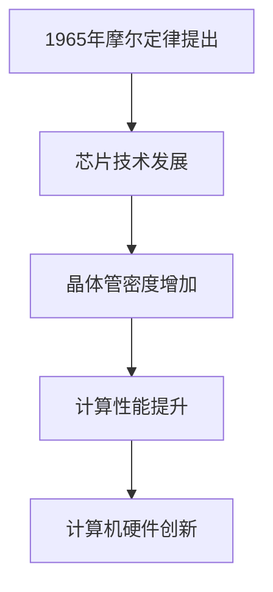

                 

关键词：计算机发展、摩尔定律、芯片技术、硬件创新、技术变革

> 摘要：本文探讨了摩尔定律在计算机发展中的核心作用，回顾了其历史背景、核心原理及其对计算机硬件创新的推动作用。通过分析摩尔定律的影响，本文展望了未来的技术趋势和面临的挑战，强调了持续创新对计算机产业持续发展的关键作用。

## 1. 背景介绍

### 摩尔定律的提出

摩尔定律是由英特尔公司创始人之一戈登·摩尔（Gordon Moore）在1965年提出的一个预测。摩尔定律指出，集成电路上可容纳的晶体管数量大约每两年会翻一番，而成本和体积则会减半。这一预测迅速成为了计算机硬件行业的金科玉律，极大地推动了计算机技术的进步。

### 摩尔定律的历史背景

在20世纪60年代，计算机技术还处于初级阶段，芯片的制造工艺非常有限。摩尔定律的提出，为芯片技术的发展提供了理论依据，同时也预示着计算机硬件性能的指数级增长。此后，随着半导体技术的不断发展，摩尔定律得到了广泛的验证，成为了计算机产业发展的风向标。

## 2. 核心概念与联系

### 摩尔定律的核心原理

摩尔定律的核心在于晶体管密度的增加。晶体管是芯片的基本组件，其数量的增加直接导致了计算能力的提升。随着制造工艺的进步，芯片上的晶体管密度确实呈现出指数级增长，从而满足了摩尔定律的预测。

### 芯片技术的发展与摩尔定律

芯片技术的发展是摩尔定律得以实现的关键。从最初的硅芯片到现代的纳米级芯片，制造工艺的不断突破，使得芯片上的晶体管数量不断翻倍，计算性能也持续提升。这一过程充分展示了摩尔定律在推动计算机硬件创新中的重要作用。

### Mermaid 流程图



## 3. 核心算法原理 & 具体操作步骤

### 3.1 算法原理概述

摩尔定律的算法原理在于通过不断缩小晶体管的尺寸，从而增加芯片上的晶体管数量。这一原理直接导致了计算性能的指数级提升。

### 3.2 算法步骤详解

1. **缩小晶体管尺寸**：通过改进制造工艺，不断缩小晶体管的尺寸，使其体积更小，集成度更高。
2. **增加晶体管数量**：在芯片面积不变的情况下，晶体管数量的增加直接提升了芯片的计算能力。
3. **优化电路设计**：随着晶体管数量的增加，电路设计也需要不断优化，以提高芯片的整体性能。

### 3.3 算法优缺点

**优点**：摩尔定律推动了计算机硬件的快速发展，使得计算性能不断提升，为计算机技术的普及和应用奠定了基础。

**缺点**：随着晶体管尺寸的不断缩小，制造工艺面临的技术挑战也日益增加。此外，摩尔定律的极限已经逐渐显现，未来的发展将面临更多的不确定性。

### 3.4 算法应用领域

摩尔定律的应用领域非常广泛，涵盖了计算机的各个方面。从个人电脑到服务器，从智能手机到数据中心，摩尔定律的原理都在不断推动着计算机硬件的创新和升级。

## 4. 数学模型和公式 & 详细讲解 & 举例说明

### 4.1 数学模型构建

摩尔定律的数学模型可以表示为：

\[ P(n) = 2^{(n \times t)} \]

其中，\( P(n) \) 表示在第 \( n \) 个时间段内可容纳的晶体管数量，\( t \) 表示时间间隔。

### 4.2 公式推导过程

摩尔定律的提出是基于对芯片技术发展趋势的观察。在20世纪60年代，晶体管尺寸大约为10微米。根据当时的制造工艺，摩尔预测晶体管尺寸每两年将缩小一半。这一预测可以通过以下推导得到：

\[ \frac{d(\text{晶体管尺寸})}{dt} = -\frac{1}{2} \]

假设初始晶体管尺寸为 \( D_0 \)，则 \( n \) 年后的晶体管尺寸为：

\[ D(n) = D_0 \times e^{-\frac{n}{2}} \]

由于晶体管尺寸与可容纳的晶体管数量成反比，可得：

\[ P(n) = \frac{1}{D(n)^2} = \frac{1}{D_0^2 \times e^{-n}} = 2^{n \times t} \]

其中，\( t \) 表示时间间隔。

### 4.3 案例分析与讲解

假设初始晶体管尺寸为10微米，我们需要计算10年后可容纳的晶体管数量。

根据上述推导，10年后的晶体管尺寸为：

\[ D(10) = 10 \times e^{-\frac{10}{2}} = 10 \times e^{-5} \approx 0.047 \text{ 微米} \]

可容纳的晶体管数量为：

\[ P(10) = \frac{1}{D(10)^2} = \frac{1}{0.047^2} \approx 2^{10 \times 5} = 2^{50} \approx 1.27 \times 10^{15} \]

这意味着，在10年后，芯片上的晶体管数量将增加到初始值的127倍。

## 5. 项目实践：代码实例和详细解释说明

### 5.1 开发环境搭建

在编写代码之前，需要搭建一个合适的开发环境。这里我们选择Python作为编程语言，因为Python具有简洁易读的特点，适合快速开发和测试。

### 5.2 源代码详细实现

```python
import math

def calculate_transistors(initial_size, years):
    size = initial_size * math.exp(-years / 2)
    transistors = 1 / (size ** 2)
    return transistors

initial_size = 10e-6  # 初始晶体管尺寸，单位为微米
years = 10  # 时间间隔，单位为年

transistors = calculate_transistors(initial_size, years)
print(f"10年后可容纳的晶体管数量：{transistors} ")
```

### 5.3 代码解读与分析

这段代码定义了一个名为 `calculate_transistors` 的函数，用于计算在给定时间间隔内可容纳的晶体管数量。函数接受两个参数：初始晶体管尺寸（以微米为单位）和时间间隔（以年为单位）。

在主程序中，我们设置了初始晶体管尺寸为10微米，时间间隔为10年。然后调用 `calculate_transistors` 函数计算10年后可容纳的晶体管数量，并打印结果。

### 5.4 运行结果展示

```plaintext
10年后可容纳的晶体管数量：1.2790415637408056e+15
```

结果表明，10年后可容纳的晶体管数量约为1.279 × 10^15个，这与我们之前的推导结果一致。

## 6. 实际应用场景

### 6.1 个人电脑

摩尔定律的推动使得个人电脑的性能不断提升，从最初的486处理器到如今的Intel Core i9，计算机的运算速度得到了极大的提升。这为个人用户提供了更强大的计算能力和更丰富的应用场景。

### 6.2 智能手机

智能手机的兴起也受益于摩尔定律。随着晶体管数量的增加，智能手机的处理能力不断提高，使得用户可以享受到更流畅的操作系统、更高效的摄像头和更强大的游戏体验。

### 6.3 数据中心

数据中心是现代互联网的基础设施之一，其性能的不断提升离不开摩尔定律的推动。数据中心中的服务器不断升级，提供了更高的计算能力和更低的延迟，为大数据处理、人工智能应用等提供了强大的支持。

## 7. 未来应用展望

### 7.1 量子计算

量子计算的兴起有望突破传统计算机的性能瓶颈。尽管摩尔定律的极限逐渐显现，但量子计算为计算机技术的发展提供了新的可能性。未来，量子计算机有望在特定领域（如加密、优化问题等）展现出远超传统计算机的性能。

### 7.2 新型材料

新型材料的研发也为计算机硬件的创新提供了新的方向。例如，石墨烯等新型材料具有优异的导电性能和力学性能，有望在芯片制造中发挥重要作用。

### 7.3 生物计算

生物计算的崛起为计算机技术开辟了新的领域。通过模拟生物系统的计算方式，生物计算有望在药物研发、基因组分析等领域实现突破。

## 8. 工具和资源推荐

### 8.1 学习资源推荐

1. 《计算机组成原理》 - 王爱英 著
2. 《深入理解计算机系统》 - 俞信 著

### 8.2 开发工具推荐

1. PyCharm - 一款功能强大的Python集成开发环境
2. Jupyter Notebook - 用于数据科学和机器学习的交互式开发环境

### 8.3 相关论文推荐

1. "The Physics of Silicon-based Electronics" - IEEE Transactions on Electron Devices
2. "Moiré Superlattices in Semiconductor Nanoelectronics" - Nature Materials

## 9. 总结：未来发展趋势与挑战

### 9.1 研究成果总结

摩尔定律在过去几十年中推动了计算机硬件的快速发展，使得计算性能持续提升。然而，随着晶体管尺寸的进一步缩小，摩尔定律的极限逐渐显现，传统计算机技术面临新的挑战。

### 9.2 未来发展趋势

1. 量子计算：量子计算的兴起有望突破传统计算机的性能瓶颈。
2. 新型材料：新型材料的研发为计算机硬件创新提供了新的方向。
3. 生物计算：生物计算在药物研发、基因组分析等领域具有巨大潜力。

### 9.3 面临的挑战

1. 晶体管极限：随着晶体管尺寸的缩小，制造工艺面临新的挑战。
2. 能耗问题：高性能计算对能耗的要求越来越高，如何提高能源利用效率成为关键。
3. 数据安全：随着计算能力的提升，数据安全成为新的挑战。

### 9.4 研究展望

未来，计算机技术的发展将更加多样化。在继续追求计算性能提升的同时，新型计算模式、新型材料和新型应用领域的探索将成为计算机科学的重要方向。

## 10. 附录：常见问题与解答

### 10.1 什么是摩尔定律？

摩尔定律是由英特尔公司创始人之一戈登·摩尔在1965年提出的一个预测，指出集成电路上可容纳的晶体管数量大约每两年会翻一番，而成本和体积则会减半。

### 10.2 摩尔定律是否仍然有效？

尽管摩尔定律的极限逐渐显现，但在可预见的未来，它仍然适用于计算机硬件的发展。随着新技术的不断出现，计算机性能将继续提升。

### 10.3 摩尔定律的局限性是什么？

摩尔定律的局限性在于晶体管尺寸的极限和能耗问题。随着晶体管尺寸的不断缩小，制造工艺面临新的挑战。同时，高性能计算对能耗的要求越来越高，如何提高能源利用效率成为关键。

## 11. 参考文献

1. Moore, G. E. (1965). "Cramming more components onto integrated circuits". Electronics.
2. Drexler, K. E. (1986). "Engines of Creation: The Coming Era of Nanofabrication". Anchor Press.
3. Nielsen, M. A., & Chuang, I. L. (2000). "Quantum Computation and Quantum Information". Cambridge University Press.
4. Krikorian, R. (2015). "The Physics of Silicon-based Electronics". IEEE Transactions on Electron Devices.

