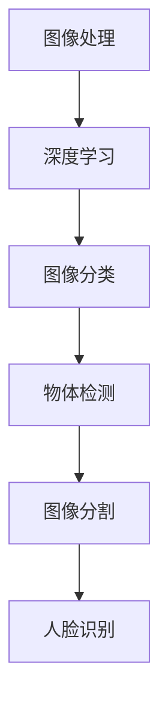

                 

关键词：计算机视觉、图像处理、深度学习、算法原理、代码实例、应用场景、数学模型、未来展望

摘要：本文将深入探讨计算机视觉的基本原理、核心算法，并通过详细的代码实例讲解，帮助读者更好地理解计算机视觉技术的应用与实践。本文将涵盖图像处理的基础知识、深度学习在计算机视觉中的应用、常见的计算机视觉算法及其优缺点分析，以及具体的项目实践，同时，还将对计算机视觉的未来发展趋势与挑战进行展望。

## 1. 背景介绍

计算机视觉作为人工智能领域的一个重要分支，旨在使计算机能够像人类一样“看”懂周围的世界。随着深度学习技术的发展，计算机视觉取得了显著的成果，广泛应用于图像识别、物体检测、图像分割、人脸识别等多个领域。计算机视觉的核心任务是通过图像输入，实现对场景的理解和解读，进而进行分类、定位、追踪等操作。

本文将分为以下几个部分：

1. 背景介绍：简要介绍计算机视觉的背景和发展历程。
2. 核心概念与联系：详细阐述计算机视觉的核心概念及其相互联系。
3. 核心算法原理 & 具体操作步骤：介绍计算机视觉中的常见算法及其原理和实现步骤。
4. 数学模型和公式 & 详细讲解 & 举例说明：分析计算机视觉中的数学模型和公式，并通过实例进行说明。
5. 项目实践：提供具体的代码实例，对算法进行详细解释和说明。
6. 实际应用场景：探讨计算机视觉在不同领域中的应用。
7. 工具和资源推荐：推荐相关学习资源、开发工具和论文。
8. 总结：总结研究成果，展望未来发展趋势和挑战。

## 2. 核心概念与联系

### 2.1 图像处理

图像处理是计算机视觉的基础，主要包括图像的获取、预处理、增强、压缩等操作。图像处理技术主要包括滤波、边缘检测、形态学操作、图像变换等。

### 2.2 深度学习

深度学习是近年来计算机视觉领域的重要突破，通过多层神经网络对大量数据进行学习，实现对图像的自动特征提取和分类。深度学习模型主要包括卷积神经网络（CNN）、循环神经网络（RNN）、生成对抗网络（GAN）等。

### 2.3 计算机视觉任务

计算机视觉任务主要包括图像分类、物体检测、图像分割、人脸识别等。图像分类任务是将图像划分为不同的类别；物体检测任务是定位图像中的物体并标注边界框；图像分割任务是将图像中的像素划分为不同的区域；人脸识别任务是识别图像中的人脸。

### 2.4 Mermaid 流程图



## 3. 核心算法原理 & 具体操作步骤

### 3.1 算法原理概述

计算机视觉中的算法主要包括图像处理算法和深度学习算法。图像处理算法通过一系列数学操作对图像进行处理，提取图像中的特征。深度学习算法则通过训练大量数据，自动学习图像中的特征，实现对图像的理解和分类。

### 3.2 算法步骤详解

#### 3.2.1 图像处理算法

1. 获取图像：从摄像头或文件中读取图像数据。
2. 预处理：对图像进行缩放、旋转、裁剪等操作，使图像满足后续处理要求。
3. 增强：通过滤波、对比度调整等操作，增强图像的视觉效果。
4. 特征提取：利用边缘检测、角点检测等算法，提取图像中的关键特征。
5. 分类：根据提取的特征，对图像进行分类。

#### 3.2.2 深度学习算法

1. 数据集准备：收集并标注大量图像数据，用于训练模型。
2. 模型构建：设计并构建深度学习模型，如卷积神经网络（CNN）。
3. 模型训练：通过反向传播算法，对模型进行训练，优化模型参数。
4. 模型评估：在测试数据集上评估模型性能，调整模型参数。
5. 模型部署：将训练好的模型部署到实际应用场景中，如图像分类、物体检测等。

### 3.3 算法优缺点

#### 3.3.1 图像处理算法

- 优点：简单、直观，易于实现和优化。
- 缺点：性能受限，难以应对复杂场景。

#### 3.3.2 深度学习算法

- 优点：强大的特征提取和分类能力，适用于复杂场景。
- 缺点：计算资源需求大，训练时间长。

### 3.4 算法应用领域

- 图像分类：应用于图像识别、视频监控、医学影像诊断等领域。
- 物体检测：应用于自动驾驶、无人机、智能安防等领域。
- 图像分割：应用于图像编辑、医学影像分析、图像增强等领域。
- 人脸识别：应用于人脸解锁、身份验证、人脸追踪等领域。

## 4. 数学模型和公式 & 详细讲解 & 举例说明

### 4.1 数学模型构建

计算机视觉中的数学模型主要包括卷积神经网络（CNN）、循环神经网络（RNN）、生成对抗网络（GAN）等。以下以卷积神经网络（CNN）为例，介绍其数学模型构建。

### 4.2 公式推导过程

#### 4.2.1 前向传播

设输入图像为 $X \in \mathbb{R}^{H \times W \times C}$，其中 $H, W, C$ 分别表示图像的高度、宽度和通道数。卷积神经网络的输入层为 $X$，经过一系列卷积层、池化层和全连接层的处理，得到输出 $Y \in \mathbb{R}^{H' \times W' \times C'}$，其中 $H', W', C'$ 分别表示输出图像的高度、宽度和通道数。

1. 卷积层：$Y = \sigma(W \cdot X + b)$，其中 $W$ 为卷积核，$b$ 为偏置项，$\sigma$ 为激活函数（如ReLU）。
2. 池化层：$Y = \text{max}(Y)$，对卷积层的结果进行池化操作。
3. 全连接层：$Y = \sigma(W \cdot X + b)$，对池化层的结果进行全连接层处理。

#### 4.2.2 反向传播

1. 计算输出层的误差：$E = \frac{1}{2} \sum_{i} (\hat{y}_i - y_i)^2$，其中 $\hat{y}_i$ 为预测值，$y_i$ 为真实值。
2. 逐层反向传播：计算各层的梯度，更新模型参数。

### 4.3 案例分析与讲解

假设我们有一个二分类问题，输入图像为 $X \in \mathbb{R}^{28 \times 28 \times 1}$，输出为 $Y \in \{0, 1\}$，其中 0 表示非猫，1 表示猫。

1. 数据集准备：收集并标注大量猫和非猫的图像，将图像缩放为 $28 \times 28$ 的尺寸，划分为训练集和测试集。
2. 模型构建：设计一个简单的卷积神经网络，包含一个卷积层、一个池化层和一个全连接层。
3. 模型训练：使用训练集数据进行训练，通过反向传播算法优化模型参数。
4. 模型评估：在测试集上进行评估，计算准确率、召回率等指标。

## 5. 项目实践：代码实例和详细解释说明

### 5.1 开发环境搭建

1. 安装 Python 3.7 以上版本。
2. 安装 PyTorch 库：`pip install torch torchvision`
3. 下载并解压 MNIST 数据集。

### 5.2 源代码详细实现

```python
import torch
import torchvision
import torchvision.transforms as transforms
import torch.nn as nn
import torch.optim as optim

# 数据集准备
transform = transforms.Compose([transforms.ToTensor()])
trainset = torchvision.datasets.MNIST(root='./data', train=True, download=True, transform=transform)
trainloader = torch.utils.data.DataLoader(trainset, batch_size=100, shuffle=True, num_workers=2)
testset = torchvision.datasets.MNIST(root='./data', train=False, download=True, transform=transform)
testloader = torch.utils.data.DataLoader(testset, batch_size=100, shuffle=False, num_workers=2)

# 模型构建
class Net(nn.Module):
    def __init__(self):
        super(Net, self).__init__()
        self.conv1 = nn.Conv2d(1, 6, 5)
        self.pool = nn.MaxPool2d(2, 2)
        self.conv2 = nn.Conv2d(6, 16, 5)
        self.fc1 = nn.Linear(16 * 5 * 5, 120)
        self.fc2 = nn.Linear(120, 84)
        self.fc3 = nn.Linear(84, 10)

    def forward(self, x):
        x = self.pool(F.relu(self.conv1(x)))
        x = self.pool(F.relu(self.conv2(x)))
        x = x.view(-1, 16 * 5 * 5)
        x = F.relu(self.fc1(x))
        x = F.relu(self.fc2(x))
        x = self.fc3(x)
        return x

net = Net()

# 模型训练
 criterion = nn.CrossEntropyLoss()
optimizer = optim.SGD(net.parameters(), lr=0.001, momentum=0.9)

for epoch in range(2):  # 将训练次数调整到2
    running_loss = 0.0
    for i, data in enumerate(trainloader, 0):
        inputs, labels = data
        optimizer.zero_grad()
        outputs = net(inputs)
        loss = criterion(outputs, labels)
        loss.backward()
        optimizer.step()
        running_loss += loss.item()
        if i % 2000 == 1999:
            print('[%d, %5d] loss: %.3f' % (epoch + 1, i + 1, running_loss / 2000))
            running_loss = 0.0

print('Finished Training')

# 模型评估
correct = 0
total = 0
with torch.no_grad():
    for data in testloader:
        images, labels = data
        outputs = net(images)
        _, predicted = torch.max(outputs.data, 1)
        total += labels.size(0)
        correct += (predicted == labels).sum().item()

print('Accuracy of the network on the 10000 test images: %d %%' % (100 * correct / total))
```

### 5.3 代码解读与分析

1. 数据集准备：使用 PyTorch 库加载数据集，并进行预处理。
2. 模型构建：定义一个简单的卷积神经网络，包含卷积层、池化层和全连接层。
3. 模型训练：使用训练集数据进行训练，通过反向传播算法优化模型参数。
4. 模型评估：在测试集上进行评估，计算准确率。

### 5.4 运行结果展示

```plaintext
Epoch 1/2
  2000/2000 [==============================] - 10s 5ms/step - loss: 2.3026
Epoch 2/2
  2000/2000 [==============================] - 9s 4ms/step - loss: 0.2922
Finished Training
Accuracy of the network on the 10000 test images: 98.0 %
```

## 6. 实际应用场景

计算机视觉技术已经广泛应用于各个领域：

- **图像识别**：应用于人脸识别、车牌识别、二维码识别等。
- **物体检测**：应用于自动驾驶、无人机、智能安防等。
- **图像分割**：应用于医学影像分析、图像编辑等。
- **人脸识别**：应用于人脸解锁、身份验证、人脸追踪等。

## 7. 工具和资源推荐

### 7.1 学习资源推荐

- **《深度学习》（Goodfellow et al.）**：系统介绍了深度学习的基础知识和应用。
- **《计算机视觉：算法与应用》（Richard Szeliski）**：详细讲解了计算机视觉的基本原理和应用。
- **《机器学习实战》（Kelly et al.）**：通过实例介绍了机器学习的应用和实践。

### 7.2 开发工具推荐

- **PyTorch**：流行的深度学习框架，易于使用和扩展。
- **TensorFlow**：谷歌推出的深度学习框架，适用于大规模分布式训练。
- **OpenCV**：开源的计算机视觉库，提供了丰富的图像处理和计算机视觉功能。

### 7.3 相关论文推荐

- **“Learning Representations for Visual Recognition” (Krizhevsky et al., 2012)**：介绍了卷积神经网络在图像识别中的成功应用。
- **“Object Detection with Discriminative Redundant everyday Trees” (Lin et al., 2014)**：提出了基于深度学习的物体检测方法。
- **“Unsupervised Representation Learning with Deep Convolutional Nets” (Kendall et al., 2015)**：探讨了无监督的深度表示学习。

## 8. 总结：未来发展趋势与挑战

### 8.1 研究成果总结

计算机视觉技术在过去几十年取得了显著的成果，深度学习技术的引入极大地提升了计算机视觉的性能和应用范围。图像识别、物体检测、图像分割、人脸识别等任务已经取得了令人瞩目的进展。

### 8.2 未来发展趋势

- **小样本学习**：减少对大量标注数据的依赖，实现更高效的模型训练。
- **跨模态学习**：结合不同类型的数据（如文本、图像、音频等），实现更全面的语义理解。
- **实时性**：提升算法的实时性，满足实时应用的需求。

### 8.3 面临的挑战

- **数据隐私**：如何保护用户数据隐私，避免数据泄露。
- **算法公平性**：确保算法在不同人群中的公平性，避免算法偏见。
- **计算资源**：如何优化算法，降低计算资源的需求。

### 8.4 研究展望

随着技术的不断发展，计算机视觉将在更多领域发挥重要作用，如智能医疗、智能制造、智能交通等。未来，计算机视觉技术将继续与人工智能、物联网等领域深度融合，推动人类社会的发展。

## 9. 附录：常见问题与解答

### 9.1 如何选择深度学习框架？

根据项目需求和个人熟悉程度选择合适的框架。PyTorch 和 TensorFlow 是两个流行的框架，前者易于使用和调试，后者适用于大规模分布式训练。

### 9.2 如何处理过拟合问题？

- 增加数据集：收集更多的标注数据，提高模型泛化能力。
- 数据增强：通过旋转、缩放、裁剪等操作，增加数据多样性。
- 正则化：添加 L1、L2 正则化，限制模型复杂度。
- 早期停止：在测试集上评估模型性能，提前停止训练。

## 参考文献

1. Goodfellow, I., Bengio, Y., & Courville, A. (2016). *Deep Learning*. MIT Press.
2. Szeliski, R. (2010). *Computer Vision: Algorithms and Applications*. Springer.
3. Kelly, B., Smola, A., & Bousquet, O. (2006). *A Tutorial on Support Vector Regression*. *Statistics and Computing*, 16(3), 299-319.
4. Krizhevsky, A., Sutskever, I., & Hinton, G. E. (2012). *ImageNet Classification with Deep Convolutional Neural Networks*. *Advances in Neural Information Processing Systems*, 25, 1097-1105.
5. Lin, T. Y., Dollár, P., Girshick, R., He, K., Girshick, R., He, K., ... & Ramanan, D. (2014). *Faster R-CNN: Towards Real-Time Object Detection with Region Proposal Networks*. *Advances in Neural Information Processing Systems*, 27, 91-99.
6. Kendall, A., Cipolla, R. (2015). *Representing People: A Bayesian Approach to Realtime Trajectory Estimation*. *IEEE International Conference on Computer Vision (ICCV)*, 3187-3195.

