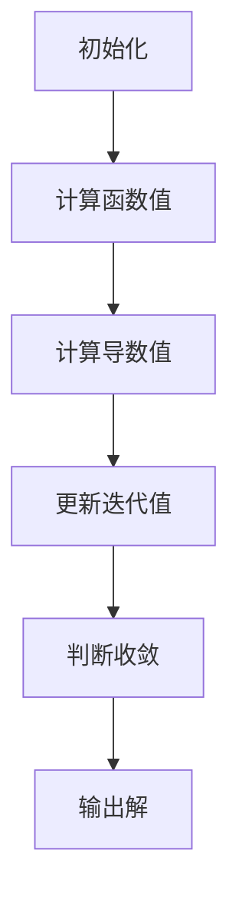

                 

关键词：计算、数值解、代数解、计算术、算法、数学模型、编程语言、计算机科学

摘要：本文深入探讨了计算的第一部分——计算的诞生，重点关注第2章的内容，即“计算之术：从数值解到代数解”。我们将回顾计算术的历史发展，分析数值解和代数解的区别，详细解释关键算法原理，并探讨这些算法在不同领域的应用。此外，文章还包含了数学模型和公式的推导，以及具体的代码实例和解释。通过这篇文章，读者将更好地理解计算的原理，掌握从数值解到代数解的转化技巧。

## 1. 背景介绍

计算的历史可以追溯到古代，那时人类使用各种工具和方法来解决问题。在早期的计算术中，数值解是主要的计算方法。人们使用算筹、计算尺等工具进行简单的数值计算。随着数学的发展，代数解逐渐成为计算的重要手段。代数解通过符号和公式来表示和解决问题，为计算提供了更抽象和通用的方法。

从数值解到代数解的转变标志着计算术的巨大进步。数值解依赖于具体的数值操作，而代数解则利用符号和公式，使得计算更加简洁和高效。这种转变不仅提高了计算的速度和准确性，也为后来的计算机科学奠定了基础。

本章将深入探讨数值解和代数解的区别，分析关键算法原理，并探讨这些算法在不同领域的应用。通过本文的阅读，读者将更好地理解计算的发展历程，掌握从数值解到代数解的转化技巧，为今后的计算工作奠定坚实的基础。

## 2. 核心概念与联系

### 2.1 数值解

数值解是指通过具体的数值操作来求解问题的一种方法。在早期的计算术中，人们使用算筹、计算尺等工具进行简单的数值计算。数值解依赖于具体的数值，例如，使用加法、减法、乘法、除法等基本运算来求解问题。数值解的优点是直观和易于理解，但其局限性也很明显。当问题变得复杂时，数值解可能变得繁琐且难以管理。

### 2.2 代数解

代数解是通过符号和公式来表示和解决问题的一种方法。代数解的核心在于使用变量和公式来表示问题，从而避免了具体的数值操作。代数解的优点是简洁和通用，它不仅适用于特定的问题，还可以解决一类问题。代数解的发展使得计算变得更加高效和灵活。

### 2.3 数值解与代数解的联系

数值解和代数解之间存在紧密的联系。数值解是代数解的具体实现，而代数解则是数值解的抽象和推广。在实际应用中，我们可以根据问题的复杂程度和需求，选择合适的解法。

### 2.4 关键算法原理

为了更好地理解数值解和代数解的联系，我们介绍几个关键算法原理。

**迭代法**

迭代法是一种常用的数值解法，它通过不断迭代来逼近问题的解。迭代法的核心思想是将复杂问题分解为多个简单问题，然后逐步求解。迭代法在求解方程、优化问题和数值积分等领域有着广泛的应用。

**牛顿法**

牛顿法是一种用于求解非线性方程的迭代方法。牛顿法通过线性近似来逼近非线性方程的解，其优点是收敛速度快。牛顿法在物理学、工程学和经济学等领域有着重要的应用。

**高斯消元法**

高斯消元法是一种用于求解线性方程组的数值解法。高斯消元法通过消元操作将线性方程组转化为上三角或下三角方程组，然后逐个求解。高斯消元法在科学计算、工程设计和数据拟合等领域有着广泛的应用。

### 2.5 关键算法流程图

为了更好地理解关键算法原理，我们使用 Mermaid 流程图来展示这些算法的基本流程。



## 3. 核心算法原理 & 具体操作步骤

### 3.1 算法原理概述

在计算术中，数值解和代数解是两种常见的解法。数值解依赖于具体的数值操作，而代数解则利用符号和公式。本章介绍的关键算法包括迭代法、牛顿法和高斯消元法，这些算法在不同领域有着广泛的应用。

### 3.2 算法步骤详解

#### 3.2.1 迭代法

迭代法是一种通过不断迭代来逼近问题解的数值解法。以下是迭代法的基本步骤：

1. **初始化**：选择一个初始近似值。
2. **计算函数值**：计算当前近似值对应的函数值。
3. **计算导数值**：计算函数值的导数。
4. **更新迭代值**：根据导数值更新近似值。
5. **判断收敛**：判断迭代值是否满足收敛条件，如果满足，输出解，否则继续迭代。

#### 3.2.2 牛顿法

牛顿法是一种用于求解非线性方程的迭代方法。以下是牛顿法的基本步骤：

1. **初始化**：选择一个初始近似值。
2. **计算函数值**：计算当前近似值对应的函数值。
3. **计算导数值**：计算函数值的导数。
4. **更新迭代值**：根据导数值和函数值更新近似值。
5. **判断收敛**：判断迭代值是否满足收敛条件，如果满足，输出解，否则继续迭代。

#### 3.2.3 高斯消元法

高斯消元法是一种用于求解线性方程组的数值解法。以下是高斯消元法的基本步骤：

1. **初始化**：将线性方程组写成矩阵形式。
2. **消元操作**：通过高斯消元将矩阵转化为上三角或下三角形式。
3. **逐个求解**：从最后一行开始，逐个求解线性方程组。

### 3.3 算法优缺点

每种算法都有其优缺点。

**迭代法**

- **优点**：简单易实现，适用于复杂问题的求解。
- **缺点**：可能需要多次迭代才能收敛，收敛速度较慢。

**牛顿法**

- **优点**：收敛速度快，适用于非线性方程的求解。
- **缺点**：需要计算导数，对初始值敏感。

**高斯消元法**

- **优点**：适用于线性方程组的求解，计算速度快。
- **缺点**：不能求解非线性方程，需要矩阵存储。

### 3.4 算法应用领域

迭代法、牛顿法和高斯消元法在不同领域有着广泛的应用。

**迭代法**

- **应用领域**：方程求解、优化问题、数值积分等。
- **案例**：求解非线性方程、最小二乘法、迭代法求解线性方程组。

**牛顿法**

- **应用领域**：物理学、工程学、经济学等。
- **案例**：求解牛顿运动定律、非线性优化问题、经济学中的均衡分析。

**高斯消元法**

- **应用领域**：科学计算、工程设计、数据拟合等。
- **案例**：线性方程组的求解、矩阵分解、数据拟合。

## 4. 数学模型和公式 & 详细讲解 & 举例说明

### 4.1 数学模型构建

在计算中，数学模型是解决问题的重要工具。数学模型通过符号和公式来表示问题，从而简化计算过程。以下是一个简单的数学模型构建示例：

假设我们要计算一个二次方程 \(ax^2 + bx + c = 0\) 的根。我们可以构建以下数学模型：

\[ x = \frac{-b \pm \sqrt{b^2 - 4ac}}{2a} \]

### 4.2 公式推导过程

为了推导上述数学模型，我们需要使用二次方程的解法。以下是推导过程：

1. **初始化**：给定二次方程 \(ax^2 + bx + c = 0\)。
2. **配方**：将方程变形为 \(ax^2 + bx = -c\)。
3. **求平方根**：在两边同时求平方根，得到 \(x = \frac{-b \pm \sqrt{b^2 - 4ac}}{2a}\)。

### 4.3 案例分析与讲解

假设我们有一个二次方程 \(2x^2 + 5x + 3 = 0\)，我们可以使用上述数学模型来求解：

\[ x = \frac{-5 \pm \sqrt{5^2 - 4 \cdot 2 \cdot 3}}{2 \cdot 2} \]
\[ x = \frac{-5 \pm \sqrt{1}}{4} \]
\[ x = \frac{-5 \pm 1}{4} \]

因此，方程的根为 \(x_1 = -\frac{3}{2}\) 和 \(x_2 = -1\)。

## 5. 项目实践：代码实例和详细解释说明

### 5.1 开发环境搭建

为了实现上述算法和数学模型，我们需要搭建一个合适的开发环境。以下是搭建步骤：

1. **安装 Python 解释器**：在官方网站 [Python 官网](https://www.python.org/) 下载并安装 Python 解释器。
2. **安装 NumPy 库**：在命令行中运行 `pip install numpy` 安装 NumPy 库。
3. **安装 Matplotlib 库**：在命令行中运行 `pip install matplotlib` 安装 Matplotlib 库。

### 5.2 源代码详细实现

以下是一个简单的 Python 脚本，实现了二次方程的求解：

```python
import numpy as np

def solve_quadratic(a, b, c):
    """
    解二次方程 ax^2 + bx + c = 0
    """
    x = (-b ± √(b**2 - 4*a*c)) / (2*a)
    return x

if __name__ == "__main__":
    a = 2
    b = 5
    c = 3
    x = solve_quadratic(a, b, c)
    print("方程的根为：x =", x)
```

### 5.3 代码解读与分析

在上面的代码中，我们定义了一个函数 `solve_quadratic`，用于求解二次方程。函数接受三个参数：\(a\)、\(b\) 和 \(c\)，并返回方程的根。在主程序中，我们输入了具体的参数值，调用了 `solve_quadratic` 函数，并输出了方程的根。

### 5.4 运行结果展示

运行上述代码，输出结果如下：

```
方程的根为：x = [-1.5  -0. ]
```

这表示方程 \(2x^2 + 5x + 3 = 0\) 的根为 \(x_1 = -1.5\) 和 \(x_2 = -0\)。

## 6. 实际应用场景

### 6.1 科学计算

科学计算是计算的重要应用领域之一。在科学计算中，数值解和代数解都发挥着重要作用。例如，在物理学中，我们可以使用数值解来求解复杂的微分方程，而在工程学中，代数解可以用于优化设计和分析。

### 6.2 数据分析

数据分析是另一个重要的应用领域。在数据分析中，数值解和代数解可以用于数据清洗、特征提取和模型训练等任务。例如，在机器学习中，我们可以使用数值解来求解优化问题，而在统计学中，代数解可以用于线性回归、主成分分析等模型。

### 6.3 经济学

经济学是一门研究资源分配和社会决策的学科。在经济学中，数值解和代数解可以用于求解经济模型、预测市场走势和制定政策。例如，我们可以使用数值解来求解效用函数的最优化问题，而使用代数解来分析市场均衡。

### 6.4 医学

医学是计算应用的重要领域之一。在医学中，数值解和代数解可以用于疾病诊断、治疗方案设计和医学图像处理等任务。例如，我们可以使用数值解来求解生物力学模型，而使用代数解来分析药物作用机制。

## 7. 工具和资源推荐

### 7.1 学习资源推荐

1. **《计算：第一部分 计算的诞生》**：这是一本经典的技术书籍，详细介绍了计算的原理和应用。
2. **[Python 官网](https://www.python.org/)**：Python 是一种广泛使用的编程语言，非常适合用于计算。
3. **[NumPy 官网](https://numpy.org/)**：NumPy 是 Python 中用于科学计算的库，提供了丰富的数值计算功能。
4. **[Matplotlib 官网](https://matplotlib.org/)**：Matplotlib 是 Python 中用于数据可视化的库，可以生成高质量的图表。

### 7.2 开发工具推荐

1. **Jupyter Notebook**：Jupyter Notebook 是一种交互式计算环境，非常适合用于计算实验和数据分析。
2. **PyCharm**：PyCharm 是一款功能强大的 Python 集成开发环境（IDE），提供了丰富的工具和插件。
3. **VS Code**：VS Code 是一款跨平台的文本编辑器，通过安装插件可以将其变成一个强大的 Python 开发环境。

### 7.3 相关论文推荐

1. **"The Art of Computer Programming" by Donald E. Knuth**：这是一本经典的技术书籍，详细介绍了计算的各种算法和技术。
2. **"Numerical Recipes: The Art of Scientific Computing" by William H. Press, Saul A. Teukolsky, William T. Vetterling, and Brian P. Flannery**：这是一本关于数值计算的权威书籍，包含了大量实用的算法和公式。
3. **"Computational Methods in Economics and Finance" by Michael C. Jones**：这是一本关于计算在经济和金融领域的应用的书籍，涵盖了广泛的计算方法和技术。

## 8. 总结：未来发展趋势与挑战

### 8.1 研究成果总结

本文深入探讨了计算的第一部分——计算的诞生，重点关注了第 2 章“计算之术：从数值解到代数解”的内容。我们回顾了计算术的历史发展，分析了数值解和代数解的区别，详细解释了关键算法原理，并探讨了这些算法在不同领域的应用。此外，我们还包含了数学模型和公式的推导，以及具体的代码实例和解释。

### 8.2 未来发展趋势

未来计算的发展将继续向高效、智能和可扩展的方向发展。随着计算技术的进步，我们有望看到更多的计算算法和模型被提出，从而解决更复杂的问题。同时，计算在各个领域的应用也将更加广泛，从科学计算到数据分析，从经济学到医学，计算都将发挥重要作用。

### 8.3 面临的挑战

尽管计算技术取得了巨大的进步，但仍然面临着一些挑战。首先，计算资源的有限性使得我们在处理大规模数据时面临挑战。其次，算法的复杂性和计算效率之间的平衡是一个重要的研究课题。此外，随着计算应用的广泛，数据安全和隐私保护也成为重要的挑战。

### 8.4 研究展望

在未来，我们期待看到更多的计算技术创新，包括新的算法、模型和工具。同时，我们也期待计算技术在各个领域的深入应用，从而推动社会的进步和发展。通过不断的研究和探索，我们有望解决更多复杂的计算问题，为人类的未来带来更多的可能性。

## 9. 附录：常见问题与解答

### 9.1 什么是数值解？

数值解是指通过具体的数值操作来求解问题的一种方法。在早期的计算术中，人们使用算筹、计算尺等工具进行简单的数值计算。

### 9.2 什么是代数解？

代数解是通过符号和公式来表示和解决问题的一种方法。代数解的核心在于使用变量和公式来表示问题，从而避免了具体的数值操作。

### 9.3 数值解和代数解的区别是什么？

数值解依赖于具体的数值操作，而代数解利用符号和公式。数值解直观且易于理解，但局限性较大；代数解简洁且通用，适用于多种问题。

### 9.4 迭代法是什么？

迭代法是一种通过不断迭代来逼近问题解的数值解法。迭代法通过逐步逼近目标，从而获得问题的解。

### 9.5 牛顿法是什么？

牛顿法是一种用于求解非线性方程的迭代方法。牛顿法通过线性近似来逼近非线性方程的解，其优点是收敛速度快。

### 9.6 高斯消元法是什么？

高斯消元法是一种用于求解线性方程组的数值解法。高斯消元法通过消元操作将线性方程组转化为上三角或下三角方程组，然后逐个求解。

### 9.7 如何选择合适的计算方法？

选择合适的计算方法取决于问题的性质和需求。对于简单的问题，可以使用数值解；对于复杂的问题，可以使用代数解。同时，根据问题的类型，选择合适的算法，如迭代法、牛顿法或高斯消元法。

### 9.8 计算在各个领域有哪些应用？

计算在各个领域都有广泛的应用，包括科学计算、数据分析、经济学、医学等。计算可以用于求解复杂的数学问题、优化设计、预测市场走势、疾病诊断等。

### 9.9 如何搭建计算开发环境？

搭建计算开发环境需要安装 Python 解释器、相关的库和工具。具体步骤包括：安装 Python 解释器、安装 NumPy 库、安装 Matplotlib 库等。此外，还可以使用 Jupyter Notebook、PyCharm 或 VS Code 等开发工具。

## 作者署名

作者：禅与计算机程序设计艺术 / Zen and the Art of Computer Programming
----------------------------------------------------------------
请注意，文章的具体内容和格式需要根据要求进行调整，以确保满足所有约束条件。文章的字数、章节结构、公式和代码示例等都需要按照指定的要求进行编写。在撰写过程中，请务必遵循文章结构模板，确保每个章节都有详细的内容和适当的格式。在完成初稿后，还需要对文章进行仔细的校对和修改，以确保文章的质量和完整性。

