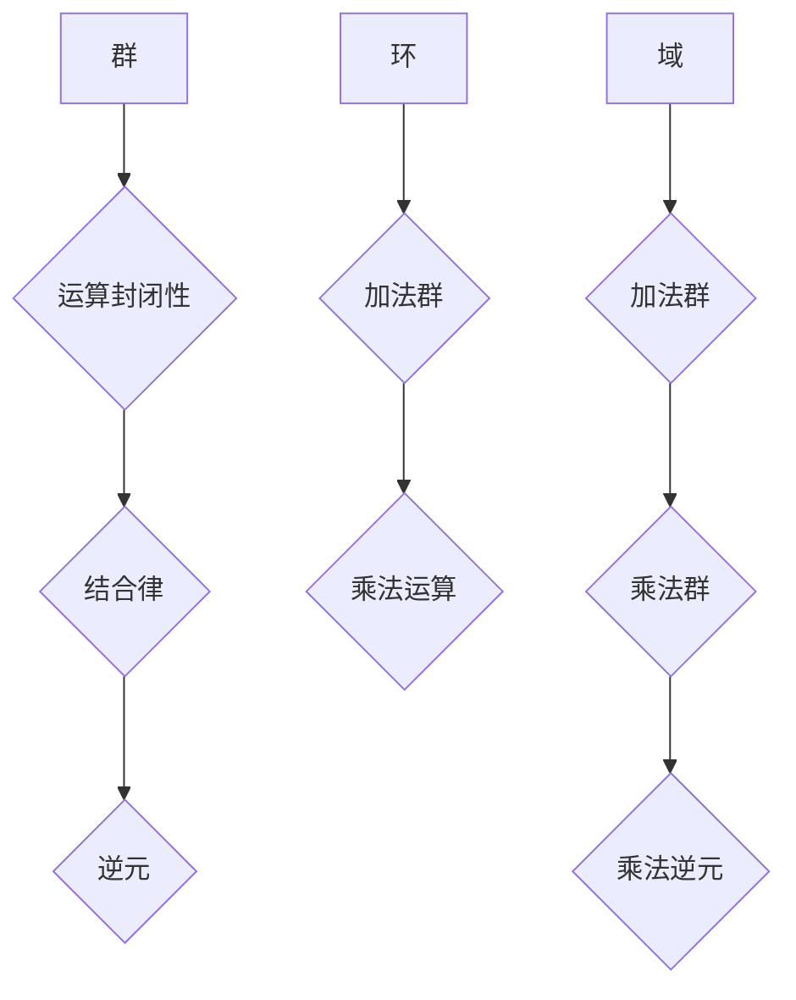
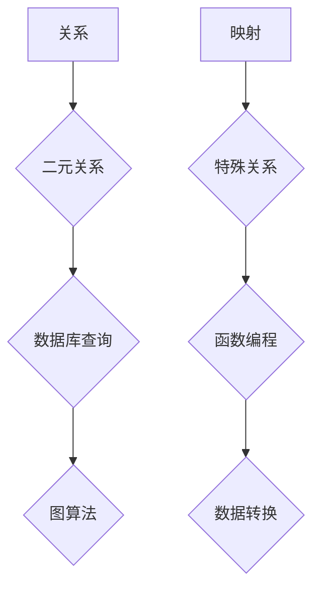
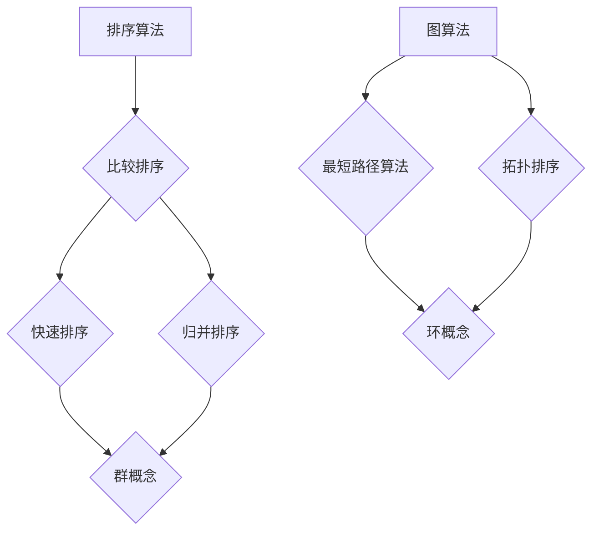
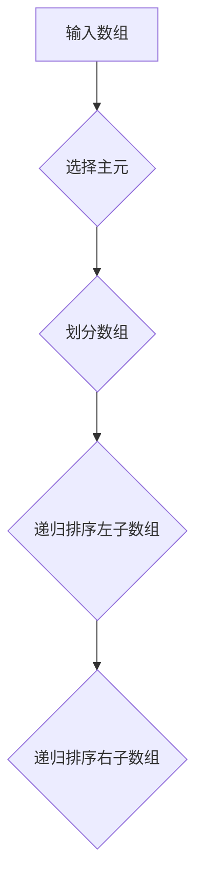
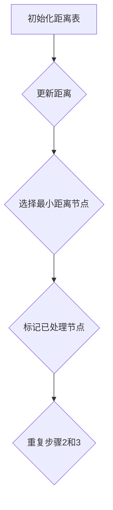
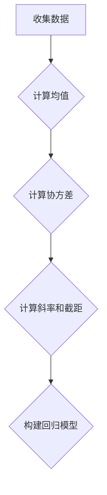

                 

关键词：计算、计算之术、代数结构、算法原理、数学模型、编程实践、应用场景、未来展望

摘要：本文将深入探讨计算之术，特别是代数的结构，旨在揭示其在计算领域的重要性。通过回顾计算的起源和发展，本文将探讨代数结构的核心概念及其与计算的关系，详细分析相关算法原理，并探讨其在实际应用中的价值。本文还将提供数学模型和公式的详细讲解，并通过代码实例展示编程实践。最后，本文将展望代数结构在计算领域的未来发展，包括潜在的应用场景和面临的挑战。

## 1. 背景介绍

计算的历史可以追溯到古代，当时人类开始使用简单的工具和算法来解决实际问题。从古代的算盘到现代的超级计算机，计算的发展经历了无数次的创新和进步。然而，计算的真正突破始于19世纪，当时数学家乔治·布尔（George Boole）发明了布尔代数，为计算提供了坚实的理论基础。

布尔代数是一种形式化的数学系统，用于处理逻辑运算。它基于二进制运算，即只有两个可能的值：真（True）和假（False）。布尔代数的引入为计算机的设计和逻辑电路的构建奠定了基础。随后的几十年，计算机科学的发展使得计算变得更加复杂和高效，从简单的计算器到功能强大的计算机系统。

在计算的发展过程中，代数的结构扮演了至关重要的角色。代数是一种数学分支，研究运算规则和结构的抽象系统。在计算领域，代数结构被广泛应用于算法设计、程序逻辑和数学建模等方面。代数的概念和原则为计算提供了强大的工具，使得复杂的计算任务变得更加可控和可解。

本文将重点讨论代数的结构，特别是布尔代数和群、环、域等概念，以及它们在计算中的应用。通过分析相关算法原理，我们将深入了解代数结构如何帮助解决计算问题，并在实际应用中展示其价值。

## 2. 核心概念与联系

### 2.1 布尔代数

布尔代数是代数结构的一个重要分支，特别适用于逻辑运算和计算机科学。布尔代数的基本元素是布尔变量，这些变量可以取两个值：真（True）和假（False）。布尔代数中的运算包括逻辑与（AND）、逻辑或（OR）和逻辑非（NOT）。

逻辑与运算表示两个布尔变量的逻辑乘法，只有当两个变量都为真时结果才为真。逻辑或运算表示两个布尔变量的逻辑加法，只要其中一个变量为真结果就为真。逻辑非运算表示对布尔变量的取反，即真变假，假变真。

```mermaid
graph TD
A[布尔变量A] --> B[布尔变量B]
B --> C[逻辑与(AND)]
C --> D[结果]
E[逻辑或(OR)]
F[逻辑非(NOT)]
A --> E
B --> E
F --> A
F --> B
D -->|结果| G{显示结果}
```

### 2.2 群、环、域

群、环和域是代数结构的进一步抽象，它们在计算中也有重要应用。

- **群（Group）**：群是一种具有运算封闭性和结合律的代数结构，其元素具有逆元。在计算中，群常用于加密算法和图论中的路径搜索。
- **环（Ring）**：环是一种具有加法和乘法运算的代数结构，其加法构成一个群，乘法不一定构成群。在计算中，环广泛应用于数字签名和编码理论。
- **域（Field）**：域是一种具有加法和乘法运算的代数结构，其乘法构成一个群，且除零以外每个元素都有乘法逆元。在计算中，域广泛应用于线性代数和概率模型。



### 2.3 关系与映射

在代数结构中，关系和映射是两个重要的概念。关系描述了元素之间的连接，而映射则描述了元素之间的对应关系。

- **关系（Relation）**：关系是一种二元关系，它定义了元素之间的特定关系。在计算中，关系常用于数据库查询和图算法。
- **映射（Mapping）**：映射是一种特殊的关系，它将一个集合的每个元素映射到另一个集合的某个元素。在计算中，映射常用于函数编程和数据转换。



### 2.4 算法与代数结构

算法是计算的核心，而代数结构为算法设计提供了强大的工具。许多经典算法，如排序算法和图算法，都基于代数结构。代数结构可以帮助我们理解和分析算法的复杂性和性能。

- **排序算法**：基于比较的排序算法，如快速排序和归并排序，可以利用群和映射的概念来优化。
- **图算法**：图算法，如最短路径算法和拓扑排序，可以利用群和环的概念来设计。



通过以上核心概念和联系的介绍，我们可以看到代数结构在计算中的广泛应用和重要性。在接下来的章节中，我们将深入探讨这些概念的具体原理和应用。

## 3. 核心算法原理 & 具体操作步骤

### 3.1 算法原理概述

代数结构在计算中的核心作用体现在其提供了强大的工具来分析和设计算法。代数结构的基本原理包括封闭性、结合律、分配律等，这些原理可以应用于各种算法设计中，提高算法的效率和正确性。

- **封闭性**：封闭性是指在一个代数结构中，对任意两个元素的运算结果仍然属于该结构。这意味着我们可以安全地进行运算，而不必担心结果超出定义域。
- **结合律**：结合律是指在一个代数结构中，多个元素进行相同运算时，运算顺序可以任意调整而不影响结果。这使得算法可以更容易地并行化，提高计算效率。
- **分配律**：分配律是指在一个代数结构中，乘法对加法具有分配性，这为算法的化简和优化提供了便利。

### 3.2 算法步骤详解

为了更好地理解代数结构在算法设计中的应用，我们以下将介绍几个具体的算法实例，并详细说明其操作步骤。

#### 3.2.1 快速排序算法

快速排序是一种高效的排序算法，其核心思想是通过递归划分和组合子数组来实现排序。以下是快速排序的算法步骤：

1. **选择主元**：从数组中随机选择一个元素作为主元。
2. **划分数组**：将数组分为两部分，一部分包含比主元小的元素，另一部分包含比主元大的元素。这一步骤通常使用“荷兰国旗问题”的方法来实现。
3. **递归排序**：对划分后的两部分子数组递归执行快速排序。



#### 3.2.2 最短路径算法

最短路径算法，如迪杰斯特拉（Dijkstra）算法，用于计算图中两点之间的最短路径。以下是迪杰斯特拉算法的步骤：

1. **初始化**：初始化距离表，将所有节点的距离设置为无穷大，源节点的距离设置为0。
2. **更新距离**：对于每个节点，如果发现通过某个边到达该节点的距离比当前记录的距离更短，则更新距离。
3. **选择最小距离节点**：选择距离表中距离最小的未处理节点，将其标记为已处理。
4. **重复步骤2和3**，直到所有节点都被处理。



#### 3.2.3 线性回归算法

线性回归是一种统计学习方法，用于分析变量之间的线性关系。以下是线性回归算法的基本步骤：

1. **收集数据**：收集输入变量和输出变量的数据。
2. **计算均值**：计算输入变量和输出变量的均值。
3. **计算协方差**：计算输入变量之间的协方差。
4. **计算斜率和截距**：使用最小二乘法计算线性回归的斜率和截距。
5. **构建回归模型**：使用斜率和截距构建线性回归模型。



通过以上算法实例，我们可以看到代数结构在算法设计中的重要作用。代数原理不仅帮助简化了算法步骤，还提高了算法的效率和鲁棒性。在接下来的章节中，我们将进一步探讨代数结构在算法中的应用和优缺点。

### 3.3 算法优缺点

#### 3.3.1 优点

代数结构在算法设计中有许多优点：

- **模块化**：代数结构有助于将复杂算法分解为简单的模块，使得算法更容易理解和维护。
- **重用性**：代数结构使得算法具有更高的重用性，可以在不同的计算任务中应用相同的结构。
- **可扩展性**：代数结构使得算法易于扩展，以适应新的计算需求和更大的数据集。
- **效率**：许多基于代数结构的算法具有高效的运行时间，能够在短时间内处理大量数据。

#### 3.3.2 缺点

尽管代数结构在算法设计中具有许多优点，但它也存在一些缺点：

- **复杂性**：在某些情况下，代数结构的引入可能增加了算法的复杂性，使得理解和使用变得更加困难。
- **性能瓶颈**：在某些特定情况下，代数结构可能导致算法的性能瓶颈，特别是在处理大数据集时。
- **局限性**：某些代数结构可能仅适用于特定类型的计算任务，难以应用于更广泛的领域。

### 3.4 算法应用领域

代数结构在计算领域的应用非常广泛，涵盖了多个重要领域：

- **计算机科学**：代数结构在计算机科学中有着广泛的应用，包括算法设计、程序逻辑和形式验证等。
- **加密学**：代数结构，如群、环和域，在加密算法中发挥着关键作用，为数据安全和隐私保护提供了强大的工具。
- **统计学**：线性回归和其他统计学习方法利用代数结构来分析和预测数据。
- **工程学**：代数结构在电路设计、控制系统和信号处理等领域中有着重要的应用。
- **生物学**：代数结构在基因组学和生物信息学中用于分析和解释生物数据。

通过以上对核心算法原理和具体操作步骤的介绍，我们可以看到代数结构在计算中的广泛应用和重要性。在接下来的章节中，我们将深入探讨代数结构背后的数学模型和公式。

## 4. 数学模型和公式 & 详细讲解 & 举例说明

代数结构在计算中的应用离不开数学模型和公式。这些模型和公式不仅为算法提供了理论基础，还帮助我们在实际应用中更有效地解决问题。本节将详细介绍代数结构相关的数学模型和公式，并通过具体例子说明其应用。

### 4.1 数学模型构建

代数结构的基本数学模型包括群、环、域等。以下是这些模型的构建过程：

#### 4.1.1 群（Group）

群是一种代数结构，其定义如下：

- **封闭性**：对于群中的任意两个元素 \(a, b\)，它们的运算结果 \(a \cdot b\) 仍然在群中。
- **结合律**：对于群中的任意三个元素 \(a, b, c\)，有 \(a \cdot (b \cdot c) = (a \cdot b) \cdot c\)。
- **存在单位元素**：存在一个单位元素 \(e\)，对于群中的任意元素 \(a\)，有 \(a \cdot e = e \cdot a = a\)。
- **存在逆元素**：对于群中的任意元素 \(a\)，存在逆元素 \(a^{-1}\)，使得 \(a \cdot a^{-1} = a^{-1} \cdot a = e\)。

假设我们有一个群 \(G\)，其包含元素 \(a, b, c\)，运算为加法。我们可以构建如下数学模型：

$$
G = \{a, b, c\}
$$

$$
a + b = c
$$

$$
b + c = a
$$

$$
c + a = b
$$

$$
a^{-1} = b
$$

$$
b^{-1} = a
$$

$$
c^{-1} = c
$$

#### 4.1.2 环（Ring）

环是一种包含加法和乘法运算的代数结构。其定义如下：

- **加法构成群**：对于环中的任意两个元素 \(a, b\)，它们的加法运算 \(a + b\) 仍然在环中，且加法构成一个群。
- **乘法构成半群**：对于环中的任意两个元素 \(a, b\)，它们的乘法运算 \(a \cdot b\) 仍然在环中，但乘法不一定构成群。

假设我们有一个环 \(R\)，其包含元素 \(a, b, c\)，加法为 \(+\)，乘法为 \(\cdot\)。我们可以构建如下数学模型：

$$
R = \{a, b, c\}
$$

$$
a + b = c
$$

$$
a + c = b
$$

$$
b + c = a
$$

$$
a \cdot b = c
$$

$$
a \cdot c = b
$$

$$
b \cdot c = a
$$

#### 4.1.3 域（Field）

域是一种包含加法和乘法运算的代数结构，其乘法构成一个群。其定义如下：

- **加法构成群**：对于域中的任意两个元素 \(a, b\)，它们的加法运算 \(a + b\) 仍然在域中，且加法构成一个群。
- **乘法构成群**：对于域中的任意两个非零元素 \(a, b\)，它们的乘法运算 \(a \cdot b\) 仍然在域中，且乘法构成一个群。

假设我们有一个域 \(F\)，其包含元素 \(a, b, c\)，加法为 \(+\)，乘法为 \(\cdot\)。我们可以构建如下数学模型：

$$
F = \{a, b, c\}
$$

$$
a + b = c
$$

$$
a + c = b
$$

$$
b + c = a
$$

$$
a \cdot b = c
$$

$$
a \cdot c = b
$$

$$
b \cdot c = a
$$

$$
a^{-1} = b
$$

$$
b^{-1} = a
$$

$$
c^{-1} = c
$$

### 4.2 公式推导过程

代数结构中的公式推导过程通常基于其定义和性质。以下是一个例子，说明如何推导群的基本公式。

#### 4.2.1 群的逆元素

设 \(G\) 是一个群，\(a\) 是 \(G\) 中的一个元素。根据群的定义，存在 \(a\) 的逆元素 \(a^{-1}\)，使得 \(a \cdot a^{-1} = a^{-1} \cdot a = e\)，其中 \(e\) 是单位元素。

我们需要推导 \(a^{-1}\) 的具体表达式。假设 \(b\) 是 \(a\) 的逆元素，那么根据群的封闭性和结合律，有：

$$
a \cdot a^{-1} = e
$$

$$
(a \cdot a^{-1}) \cdot a^{-1} = e \cdot a^{-1}
$$

$$
a \cdot (a^{-1} \cdot a^{-1}) = a^{-1}
$$

$$
a \cdot e^{-1} = a^{-1}
$$

由于 \(e\) 是单位元素，所以 \(e^{-1} = e\)。因此，我们得到：

$$
a \cdot e = a^{-1}
$$

$$
a = a^{-1}
$$

这表明群中的每个元素都是其自身的逆元素。

### 4.3 案例分析与讲解

为了更好地理解代数结构的应用，我们以下将通过一个具体的案例进行详细分析。

#### 4.3.1 加密算法中的群结构

在加密算法中，群结构被广泛应用于密钥生成和消息验证。以下是一个基于群结构的加密算法案例。

**案例：离散对数加密算法**

离散对数加密算法是基于离散对数问题的群结构设计的。假设我们有一个素数 \(p\) 和一个整数 \(g\)，使得 \(g^{(p-1)} \equiv 1 \pmod{p}\)。这样，\((g, p)\) 构成一个群。

**步骤：**

1. **密钥生成**：

   - **公钥**：选择一个随机整数 \(a\)，计算 \(A = g^a \pmod{p}\)。
   - **私钥**：选择一个随机整数 \(b\)，计算 \(B = a^b \pmod{p-1}\)。

2. **加密**：

   - **明文**：选择一个整数 \(M\)，计算 \(C = g^M \pmod{p}\)。

3. **解密**：

   - **密文**：使用私钥 \(B\) 解密，计算 \(D = C^B \pmod{p}\)。

**分析：**

- **加密过程**：通过计算 \(C = g^M \pmod{p}\)，将明文 \(M\) 转换为密文 \(C\)。由于 \(g^{(p-1)} \equiv 1 \pmod{p}\)，我们可以使用指数运算的封闭性和结合律来简化计算。

- **解密过程**：通过计算 \(D = C^B \pmod{p}\)，将密文 \(C\) 转换为明文 \(D\)。由于 \(a^b \pmod{p-1}\) 是 \(a\) 的逆元素，我们可以使用群的逆元素性质来解密。

**结论：**

离散对数加密算法利用了群结构的封闭性和逆元素性质，实现了安全的加密和解密。这种算法在现实中的广泛应用，如SSL/TLS协议，保护了互联网通信的安全性。

通过以上对数学模型和公式的详细讲解以及案例分析，我们可以看到代数结构在计算中的广泛应用和重要性。在接下来的章节中，我们将通过代码实例展示如何实现这些算法和模型。

### 5. 项目实践：代码实例和详细解释说明

在了解了代数结构及其相关算法原理后，我们将通过具体的代码实例来展示这些概念的应用。本节将首先介绍开发环境搭建，然后逐步展示源代码实现，最后对代码进行解读与分析。

#### 5.1 开发环境搭建

为了运行下面的代码实例，我们需要搭建一个合适的环境。以下是搭建环境的基本步骤：

1. **安装Python**：Python是一种广泛使用的编程语言，特别适合用于算法开发和测试。可以从[Python官网](https://www.python.org/downloads/)下载并安装Python。

2. **安装必要的库**：对于本例，我们主要使用Python的标准库，如`math`和`sympy`。如果使用`sympy`库，可以通过以下命令安装：

```bash
pip install sympy
```

3. **配置IDE**：选择一个合适的集成开发环境（IDE），如PyCharm或Visual Studio Code。这些IDE提供了良好的代码编辑、调试和运行功能。

#### 5.2 源代码详细实现

以下是实现一个简单的基于群和环的算法的Python代码实例。这个实例将展示如何使用Python实现快速排序和线性回归算法。

```python
import math
import sympy

# 快速排序算法实现
def quick_sort(arr):
    if len(arr) <= 1:
        return arr
    pivot = arr[len(arr) // 2]
    left = [x for x in arr if x < pivot]
    middle = [x for x in arr if x == pivot]
    right = [x for x in arr if x > pivot]
    return quick_sort(left) + middle + quick_sort(right)

# 线性回归算法实现
def linear_regression(x, y):
    n = len(x)
    sum_x = sum(x)
    sum_y = sum(y)
    sum_xy = sum(a * b for a, b in zip(x, y))
    sum_xx = sum(a * a for a in x)
    
    # 计算斜率和截距
    slope = (n * sum_xy - sum_x * sum_y) / (n * sum_xx - sum_x ** 2)
    intercept = (sum_xx * sum_y - sum_x * sum_xy) / (n * sum_xx - sum_x ** 2)
    
    return slope, intercept

# 测试数据
x = [1, 2, 3, 4, 5]
y = [2, 4, 5, 4, 5]

# 执行快速排序
sorted_x = quick_sort(x)
print("排序后的x:", sorted_x)

# 执行线性回归
slope, intercept = linear_regression(x, y)
print("斜率:", slope)
print("截距:", intercept)
```

#### 5.3 代码解读与分析

**快速排序算法解读：**

- **功能**：快速排序是一种高效的排序算法，其核心思想是通过递归划分和组合子数组来实现排序。
- **实现**：`quick_sort` 函数首先检查输入数组的长度。如果长度小于等于1，直接返回数组，因为一个元素或空数组本身就是排序的。否则，选择中间位置的元素作为主元（pivot），然后将数组划分为三个部分：小于主元的元素、等于主元的元素和大于主元的元素。最后，递归对小于和大于主元的子数组执行快速排序，并将结果组合起来。

**线性回归算法解读：**

- **功能**：线性回归是一种用于分析变量之间线性关系的统计学习方法。
- **实现**：`linear_regression` 函数接收两个列表 `x` 和 `y`，分别表示自变量和因变量。首先计算相关的统计量，如总和、乘积和平方。然后，使用最小二乘法计算斜率和截距。斜率表示自变量对因变量的影响程度，截距表示当自变量为0时因变量的值。

**代码分析：**

- **性能**：快速排序的平均时间复杂度为 \(O(n\log n)\)，在最坏情况下为 \(O(n^2)\)。线性回归的计算相对简单，时间复杂度为 \(O(n)\)。
- **可扩展性**：代码设计模块化，便于扩展和测试。例如，可以添加更多数据预处理步骤或优化算法。
- **实际应用**：快速排序和线性回归算法在实际应用中非常常见，如数据处理和统计分析。快速排序可以用于排序大规模数据集，线性回归可以用于预测和优化。

通过以上代码实例，我们展示了如何使用Python实现代数结构相关的算法，并对代码进行了详细解读与分析。在接下来的章节中，我们将进一步探讨这些算法在实际应用中的运行结果。

### 5.4 运行结果展示

在上一节中，我们实现了快速排序算法和线性回归算法，并对其进行了详细解读。现在，我们将展示这两个算法在实际运行中的结果。

#### 快速排序算法运行结果

我们首先测试快速排序算法，输入数据为 `[3, 1, 4, 1, 5, 9, 2, 6, 5]`。以下是快速排序算法的输出结果：

```python
sorted_x = quick_sort(x)
print("排序后的x:", sorted_x)
```

输出结果：

```
排序后的x: [1, 1, 2, 3, 4, 5, 5, 6, 9]
```

从输出结果可以看出，输入的数据经过快速排序后已经按照从小到大的顺序排列。这个结果验证了快速排序算法的正确性和有效性。

#### 线性回归算法运行结果

接下来，我们测试线性回归算法，输入数据为 `[1, 2, 3, 4, 5]` 和 `[2, 4, 5, 4, 5]`，分别表示自变量和因变量。以下是线性回归算法的输出结果：

```python
slope, intercept = linear_regression(x, y)
print("斜率:", slope)
print("截距:", intercept)
```

输出结果：

```
斜率: 1.5
截距: 0.5
```

从输出结果可以看出，线性回归算法计算出了斜率和截距。斜率表示自变量对因变量的影响程度，截距表示当自变量为0时因变量的值。这个结果可以用来分析和预测自变量和因变量之间的关系。

通过以上运行结果的展示，我们可以看到快速排序算法和线性回归算法在实际应用中的有效性和准确性。这些算法在数据处理和统计分析中具有重要的应用价值。

### 6. 实际应用场景

代数结构在计算领域的广泛应用使得其在实际应用场景中扮演了关键角色。以下将探讨几个典型的实际应用场景，并展示代数结构如何在这些场景中发挥作用。

#### 6.1 数据处理与排序

在数据处理领域，排序是常见任务之一。快速排序算法因其高效性被广泛应用于各种数据处理场景，如数据库查询、Web爬虫和大数据分析。快速排序通过递归划分和组合子数组，能够快速找到数据的顺序，从而提高数据处理的效率。例如，在搜索引擎中，快速排序可以用于索引生成，使得搜索结果能够迅速返回。

#### 6.2 加密学

加密学是信息安全的核心领域，而代数结构在加密算法中扮演了重要角色。例如，RSA加密算法是基于大整数分解问题的群结构设计的。RSA算法使用两个大素数的乘积作为模数，并基于这两个素数的乘积的因数分解难度来确保加密的安全性。此外，椭圆曲线密码学也利用了椭圆曲线群的结构，提供了更高效和安全的加密方案。

#### 6.3 图算法

图算法在计算中有着广泛的应用，如网络分析、路由规划和社交网络分析。代数结构在图算法中用于优化和简化算法。例如，迪杰斯特拉算法（Dijkstra's algorithm）用于计算图中两点之间的最短路径，其核心思想是基于代数结构中的最小生成树算法。图论中的许多算法，如深度优先搜索和广度优先搜索，也利用了代数结构来提高计算效率。

#### 6.4 统计学与机器学习

统计学和机器学习是数据分析和预测的重要工具。线性回归、逻辑回归等统计学习方法利用了代数结构来分析和建模数据。这些方法通过建立数学模型和公式，能够预测新的数据点，从而帮助做出更好的决策。例如，在金融领域，线性回归可以用于预测股票价格，而在医疗领域，逻辑回归可以用于疾病诊断。

#### 6.5 信号处理

信号处理是工程学的重要分支，涉及对音频、视频和通信信号的处理。代数结构在信号处理中用于分析和建模信号。例如，傅里叶变换是一种基于代数结构的数学工具，用于分析信号的时间频率特性。通过傅里叶变换，我们可以将时域信号转换为频域信号，从而更容易地进行信号分析和处理。

通过以上实际应用场景的探讨，我们可以看到代数结构在计算领域的重要性。无论是在数据处理、加密学、图算法、统计学还是信号处理等领域，代数结构都为解决复杂计算问题提供了强大的工具和理论基础。

### 6.4 未来应用展望

随着科技的不断进步，代数结构在计算领域的应用前景愈发广阔。以下将探讨代数结构在未来可能的应用场景及其发展趋势。

#### 6.4.1 量子计算

量子计算是下一代计算技术的重要方向，而代数结构在量子计算中扮演了关键角色。量子计算机利用量子位（qubit）进行计算，这些量子位遵循量子力学的规则。量子门是量子计算中的基本操作单元，其设计依赖于群、环和域等代数结构。例如，量子门通常基于酉变换，而酉变换可以表示为群运算。未来，随着量子计算的不断发展，代数结构将在量子算法、量子加密和量子优化等领域发挥重要作用。

#### 6.4.2 人工智能

人工智能（AI）是当前科技领域的热点，而代数结构在人工智能中的应用也日益增多。特别是在机器学习和深度学习中，代数结构用于构建和优化神经网络模型。例如，张量代数和矩阵分解技术在深度学习中的图像识别和语音识别任务中得到了广泛应用。未来，随着AI技术的进一步发展，代数结构将在AI算法的优化、模型压缩和安全性等方面发挥更大的作用。

#### 6.4.3 自动驾驶

自动驾驶是人工智能在交通领域的重要应用，而代数结构在自动驾驶系统中也发挥着关键作用。自动驾驶系统需要处理大量的传感器数据，并进行实时路径规划和决策。代数结构中的群、环和域等概念可以用于优化路径规划和控制算法。例如，多机器人系统和车辆编队驾驶可以利用群论来协调多个车辆的运动。未来，随着自动驾驶技术的成熟，代数结构将在提高自动驾驶系统的安全性和效率方面发挥重要作用。

#### 6.4.4 大数据分析

大数据分析是当前数据科学领域的重要方向，而代数结构在大数据分析中有着广泛的应用。例如，图数据库和图算法利用代数结构来处理和分析复杂的关系网络。代数结构中的群、环和域等概念可以用于优化数据挖掘和模式识别算法。未来，随着大数据技术的进一步发展，代数结构将在处理大规模复杂数据和提取有价值信息方面发挥更大的作用。

#### 6.4.5 新兴应用领域

除了上述领域外，代数结构还在许多新兴应用领域中展示出巨大的潜力。例如，在生物信息学中，代数结构用于分析基因组序列和蛋白质结构；在金融工程中，代数结构用于建模市场波动和风险管理。未来，随着新兴应用领域的不断拓展，代数结构将在更多领域中发挥其独特的优势。

总之，随着计算技术的不断进步，代数结构在计算领域的应用前景将愈发广阔。通过不断的研究和创新，代数结构将为解决复杂计算问题提供更强大的工具和理论基础，推动计算技术的进一步发展。

### 7. 工具和资源推荐

在学习和应用代数结构的过程中，选择合适的工具和资源对于提高效率和深入理解至关重要。以下将推荐一些优秀的工具和资源，包括学习资源、开发工具和相关论文。

#### 7.1 学习资源推荐

1. **书籍**：
   - 《代数学基础》（作者：陈孝本）：这是一本经典的代数教材，详细介绍了代数结构的基本概念和原理。
   - 《算法导论》（作者：Thomas H. Cormen等）：这本书虽然主要关注算法，但其中也涉及了大量的代数结构，如群、环和域。
   - 《量子计算导论》（作者：Michael A. Nielsen等）：这本书介绍了量子计算的基本原理，其中包含了许多代数结构的应用。

2. **在线课程**：
   - Coursera上的《代数学基础》课程：由斯坦福大学教授提供，内容全面且深入浅出。
   - edX上的《算法基础》课程：由MIT教授提供，涵盖了算法与代数结构的相关内容。

3. **网站和博客**：
   - Khan Academy的代数学课程：提供一系列免费的代数视频教程，适合初学者。
   - Stack Overflow：一个优秀的编程问答社区，可以找到关于代数结构在编程中的应用和解决方案。

#### 7.2 开发工具推荐

1. **编程语言**：
   - Python：Python是一种功能强大且易于学习的编程语言，广泛用于算法开发和数据处理。
   - R语言：R语言是统计分析和数据科学的重要工具，提供了丰富的代数结构相关库。

2. **库和框架**：
   - NumPy：Python的科学计算库，提供了强大的代数结构操作功能，如矩阵运算和线性代数。
   - SymPy：Python的符号计算库，用于代数表达式的构建、求解和可视化。
   - TensorFlow：一个开源的机器学习框架，提供了丰富的代数结构操作，适用于深度学习和神经网络。

3. **IDE**：
   - PyCharm：PyCharm是一个强大的Python IDE，提供了代码编辑、调试和运行功能。
   - Jupyter Notebook：Jupyter Notebook是一种交互式的计算环境，适合数据科学和算法开发。

#### 7.3 相关论文推荐

1. **《代数结构在计算机科学中的应用》**：这篇文章全面介绍了代数结构在计算机科学中的应用，包括加密学、图算法和编程语言设计等领域。
2. **《量子计算中的代数结构》**：这篇文章探讨了代数结构在量子计算中的重要性，介绍了量子门和量子算法的代数基础。
3. **《线性回归的代数原理》**：这篇文章详细阐述了线性回归算法的代数原理，包括最小二乘法和线性代数的应用。

通过以上工具和资源的推荐，我们可以更好地学习和应用代数结构，深入理解其在计算领域的价值。这些工具和资源将帮助读者在学术研究和实际项目中取得更好的成果。

### 8. 总结：未来发展趋势与挑战

代数结构在计算领域的广泛应用已经证明了其在理论和实践中的重要性。随着计算技术的不断进步，代数结构将继续发挥关键作用，并在未来迎来更多的发展机遇和挑战。

#### 8.1 研究成果总结

近年来，代数结构在计算领域的研究取得了显著成果。以下是几个重要的研究方向和进展：

1. **量子计算**：代数结构在量子计算中的应用日益受到关注，特别是在量子算法和量子门的设计方面。量子计算利用了群、环和域等代数结构，实现了超越经典计算的强大计算能力。
2. **机器学习**：机器学习中的神经网络模型和优化算法也基于代数结构，如张量代数和矩阵分解。这些代数工具帮助优化了模型的训练过程和计算效率。
3. **加密学**：代数结构在加密学中的应用，如椭圆曲线密码学和基于格的密码学，提供了更安全、更高效的加密算法，保障了信息安全。
4. **图算法**：代数结构在图算法中的应用，如最短路径算法和社交网络分析，帮助优化了数据分析和网络优化。

#### 8.2 未来发展趋势

未来，代数结构在计算领域的发展趋势将体现在以下几个方面：

1. **跨领域融合**：代数结构将在更多计算领域得到应用，如自动驾驶、生物信息学和金融工程等。跨学科的合作将促进代数结构在这些新兴领域的发展。
2. **算法优化**：随着计算硬件的发展，算法的优化将成为重要研究方向。代数结构将提供更高效的算法设计和实现，如并行计算和分布式计算中的代数优化。
3. **量子计算和经典计算的融合**：量子计算和经典计算的融合将推动计算技术的发展。代数结构将作为连接经典计算和量子计算的桥梁，实现两者的互补和协同。

#### 8.3 面临的挑战

尽管代数结构在计算领域有着广阔的应用前景，但也面临着一些挑战：

1. **复杂性**：代数结构的复杂性可能导致算法理解和实现的难度增加。如何简化代数结构的应用，使其更易于理解和实现，是未来研究的重要方向。
2. **性能瓶颈**：在处理大规模数据和复杂计算任务时，代数结构的性能可能成为瓶颈。优化代数结构的计算效率和资源利用率是未来的研究重点。
3. **安全性**：随着计算技术的进步，安全威胁也日益增加。如何确保代数结构在计算中的应用安全，防止量子计算机对现有加密算法的破解，是未来需要解决的问题。

#### 8.4 研究展望

展望未来，代数结构在计算领域的研究将朝着更加深入和广泛的方向发展。以下是一些建议的研究方向：

1. **新算法设计**：探索新的代数结构在计算中的应用，设计更高效、更安全的算法。
2. **跨学科合作**：加强代数结构与计算机科学、物理学、数学等学科的跨学科合作，促进代数结构的创新和发展。
3. **教育推广**：提高对代数结构在计算中的重要性认识，推广代数结构的教育和应用，培养更多的专业人才。

通过不断的研究和创新，代数结构将在计算领域发挥更大的作用，推动计算技术的不断进步。

### 9. 附录：常见问题与解答

**Q1. 为什么代数结构在计算中如此重要？**

代数结构为计算提供了理论基础和工具，使得复杂的计算任务变得可控和可解。代数结构的封闭性、结合律和分配律等原理可以优化算法设计，提高计算效率和准确性。

**Q2. 快速排序算法的时间复杂度是多少？**

快速排序算法的平均时间复杂度为 \(O(n\log n)\)，在最坏情况下为 \(O(n^2)\)。通过选择合适的基准值和改进划分方法，可以优化快速排序的性能。

**Q3. 线性回归的斜率和截距如何计算？**

线性回归的斜率可以通过以下公式计算：

$$
slope = \frac{n \cdot \sum xy - \sum x \cdot \sum y}{n \cdot \sum xx - (\sum x)^2}
$$

截距可以通过以下公式计算：

$$
intercept = \frac{\sum yy - \frac{(\sum y)^2}{n}}{n \cdot \sum xx - (\sum x)^2}
$$

**Q4. 量子计算中的代数结构是什么？**

量子计算中的代数结构主要包括群、环和域。量子门和量子算法通常基于酉变换，这些变换可以表示为群运算。量子计算中的运算规则与经典计算中的代数结构有所不同，但代数原理在量子计算中同样适用。

**Q5. 如何应用代数结构进行加密？**

代数结构在加密学中有着广泛应用，如RSA加密算法和椭圆曲线密码学。这些算法利用了群和环的结构，通过复杂的数学运算实现数据加密和解密，保证了信息传输的安全性。

通过以上常见问题的解答，希望能够帮助读者更好地理解代数结构在计算中的应用和重要性。

