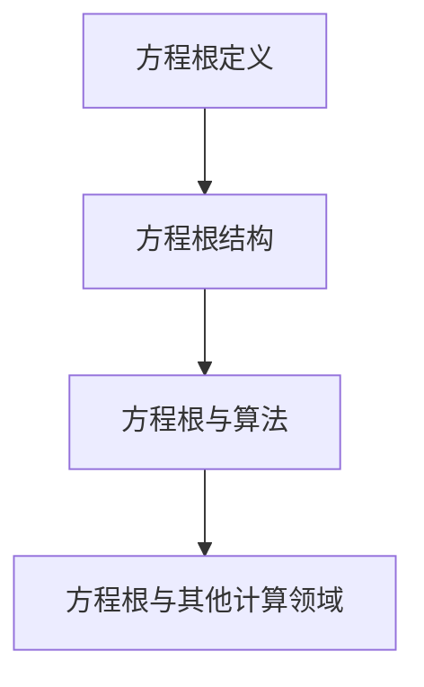

                 

关键词：计算、算法、方程、根、结构、数学模型、程序设计、人工智能

摘要：本文深入探讨了计算领域中方程根的结构及其在算法设计中的应用。通过阐述方程根的基本概念、算法原理、数学模型构建、应用场景和未来展望，本文为读者提供了一个全面且深入的视角，帮助理解计算领域中方程根的重要性和应用价值。

## 1. 背景介绍

计算是现代科技的核心，几乎涵盖了所有技术领域。从简单的数学运算到复杂的机器学习模型，计算无处不在。然而，计算的起源可以追溯到古代数学家对数学问题的探讨和解决。在这个过程中，方程的根成为了计算的重要对象。

方程根在数学中有着广泛的应用。例如，它们是解决一元二次方程、三次方程等数学问题的基础。在计算领域，方程根不仅用于数学问题的求解，还在算法设计、优化问题、数据结构分析等方面发挥着关键作用。随着计算技术的发展，研究方程根的结构和算法效率成为了一个重要的研究方向。

本文旨在深入探讨方程根的结构，分析其核心概念、算法原理、数学模型，并探讨其在实际应用中的重要性。通过本文的阅读，读者将对方程根的结构有更深入的理解，并能够将其应用于实际计算问题中。

## 2. 核心概念与联系

### 2.1 方程根的定义

方程根是指使方程成立的未知数的值。对于一元二次方程 \(ax^2 + bx + c = 0\)，其根可以通过求根公式得到：

\[ x = \frac{-b \pm \sqrt{b^2 - 4ac}}{2a} \]

这里的 \(x\) 就是方程的根。方程根可以是实数，也可以是复数。对于复数根，其形式通常表示为 \(x = a + bi\)，其中 \(a\) 和 \(b\) 是实数，\(i\) 是虚数单位，满足 \(i^2 = -1\)。

### 2.2 方程根的结构

方程根的结构与其系数密切相关。例如，对于一元二次方程，其根的性质可以通过判别式 \(b^2 - 4ac\) 来判断。当判别式大于零时，方程有两个不相等的实数根；当判别式等于零时，方程有两个相等的实数根；当判别式小于零时，方程有两个共轭复数根。

### 2.3 方程根与算法的联系

方程根在算法设计中具有重要应用。例如，在数值计算中，求方程根的过程通常需要迭代算法，如牛顿法、二分法等。这些算法的核心思想是通过不断逼近的方式找到方程的根。

### 2.4 方程根与其他计算领域的联系

方程根在计算领域中的重要性不仅体现在数学和算法设计上，还体现在其他计算领域，如优化问题、数据结构分析和机器学习中。例如，在优化问题中，方程根可以用来找到最优解；在数据结构分析中，方程根可以帮助分析算法的时间复杂度和空间复杂度；在机器学习中，方程根可以用来优化模型的参数。

### 2.5 Mermaid 流程图

以下是一个简单的 Mermaid 流程图，用于展示方程根的核心概念和联系：



## 3. 核心算法原理 & 具体操作步骤

### 3.1 算法原理概述

在计算领域，求解方程根的算法有很多种，其中最常用的包括牛顿法、二分法等。这些算法的核心思想是通过迭代逼近的方式，不断缩小搜索范围，直到找到方程的根。

### 3.2 算法步骤详解

#### 3.2.1 牛顿法

牛顿法是一种经典的迭代算法，用于求解非线性方程的根。其基本思想是通过函数的导数来逼近函数的零点。牛顿法的具体步骤如下：

1. 选择一个初始猜测值 \(x_0\)。
2. 计算函数 \(f(x)\) 在 \(x_0\) 处的导数 \(f'(x_0)\)。
3. 使用以下公式更新猜测值：

\[ x_{n+1} = x_n - \frac{f(x_n)}{f'(x_n)} \]

4. 重复步骤 2 和 3，直到 \(f(x_n)\) 的值接近零或者达到预设的精度要求。

#### 3.2.2 二分法

二分法是一种简单的迭代算法，适用于求解一元一次方程的根。其基本思想是通过不断缩小区间，逐步逼近方程的根。二分法的具体步骤如下：

1. 选择一个初始区间 \([a, b]\)，使得 \(f(a)\) 和 \(f(b)\) 的符号相反。
2. 计算区间的中点 \(c = \frac{a + b}{2}\)。
3. 判断 \(f(c)\) 的符号。如果 \(f(c) = 0\)，则 \(c\) 就是方程的根；如果 \(f(c)\) 和 \(f(a)\) 的符号相同，则将区间缩小为 \([a, c]\)；如果 \(f(c)\) 和 \(f(b)\) 的符号相同，则将区间缩小为 \([c, b]\)。
4. 重复步骤 2 和 3，直到区间的长度小于预设的精度要求。

### 3.3 算法优缺点

#### 牛顿法

- **优点**：收敛速度快，适用于大多数非线性方程。
- **缺点**：可能收敛到局部最小值，对于某些函数可能不适用。

#### 二分法

- **优点**：简单易用，适用于一元一次方程。
- **缺点**：收敛速度较慢，适用于精度要求不高的场景。

### 3.4 算法应用领域

牛顿法和二分法在计算领域有广泛的应用。例如，牛顿法常用于数值计算和优化问题，如求解非线性方程、优化模型参数等；二分法则常用于算法分析和数据结构问题，如寻找数组的排序位置、最小元素等。

## 4. 数学模型和公式 & 详细讲解 & 举例说明

### 4.1 数学模型构建

方程根的数学模型主要基于一元二次方程。对于一元二次方程 \(ax^2 + bx + c = 0\)，其数学模型可以表示为：

\[ ax^2 + bx + c = 0 \]

其中，\(a\)、\(b\)、\(c\) 是已知的系数，\(x\) 是未知数。

### 4.2 公式推导过程

一元二次方程的求解公式可以通过配方法得到。具体步骤如下：

1. 将方程变形为：

\[ ax^2 + bx = -c \]

2. 在等式两边同时加上 \(\left(\frac{b}{2a}\right)^2\)，得到：

\[ ax^2 + bx + \left(\frac{b}{2a}\right)^2 = -c + \left(\frac{b}{2a}\right)^2 \]

3. 将左侧表达式写成完全平方形式，得到：

\[ \left(x + \frac{b}{2a}\right)^2 = \frac{b^2 - 4ac}{4a^2} \]

4. 对等式两边开方，得到：

\[ x + \frac{b}{2a} = \pm \sqrt{\frac{b^2 - 4ac}{4a^2}} \]

5. 最后，解出 \(x\)，得到：

\[ x = \frac{-b \pm \sqrt{b^2 - 4ac}}{2a} \]

### 4.3 案例分析与讲解

#### 案例一：求解一元二次方程 \(x^2 - 5x + 6 = 0\)

根据上述求解公式，我们可以得到：

\[ x = \frac{-(-5) \pm \sqrt{(-5)^2 - 4 \cdot 1 \cdot 6}}{2 \cdot 1} \]
\[ x = \frac{5 \pm \sqrt{25 - 24}}{2} \]
\[ x = \frac{5 \pm 1}{2} \]

因此，方程的两个实数根分别是：

\[ x_1 = \frac{5 + 1}{2} = 3 \]
\[ x_2 = \frac{5 - 1}{2} = 2 \]

#### 案例二：求解一元二次方程 \(x^2 + 2x + 1 = 0\)

同样地，根据求解公式，我们可以得到：

\[ x = \frac{-2 \pm \sqrt{2^2 - 4 \cdot 1 \cdot 1}}{2 \cdot 1} \]
\[ x = \frac{-2 \pm \sqrt{4 - 4}}{2} \]
\[ x = \frac{-2 \pm 0}{2} \]

因此，方程的两个相等的实数根是：

\[ x_1 = x_2 = \frac{-2}{2} = -1 \]

## 5. 项目实践：代码实例和详细解释说明

### 5.1 开发环境搭建

为了演示求解一元二次方程的代码，我们将使用 Python 语言。首先，确保您的计算机上安装了 Python 解释器。接下来，创建一个名为 `quadratic_equation_solver.py` 的 Python 脚本文件。

### 5.2 源代码详细实现

以下是求解一元二次方程的 Python 代码：

```python
import math

def quadratic_equation_solver(a, b, c):
    discriminant = b**2 - 4*a*c

    if discriminant > 0:
        x1 = (-b + math.sqrt(discriminant)) / (2*a)
        x2 = (-b - math.sqrt(discriminant)) / (2*a)
        return (x1, x2)
    elif discriminant == 0:
        x = -b / (2*a)
        return (x, x)
    else:
        real_part = -b / (2*a)
        imaginary_part = math.sqrt(-discriminant) / (2*a)
        x1 = complex(real_part, imaginary_part)
        x2 = complex(real_part, -imaginary_part)
        return (x1, x2)

# 测试代码
a = 1
b = -5
c = 6
roots = quadratic_equation_solver(a, b, c)
print(f"The roots of the equation {a}x^2 + {b}x + {c} = 0 are: {roots}")
```

### 5.3 代码解读与分析

上述代码定义了一个名为 `quadratic_equation_solver` 的函数，用于求解一元二次方程。该函数接收三个参数 \(a\)、\(b\) 和 \(c\)，表示方程的系数。函数首先计算判别式 \(discriminant\)，然后根据判别式的值返回方程的根。

- 当 \(discriminant > 0\) 时，方程有两个不相等的实数根。
- 当 \(discriminant = 0\) 时，方程有两个相等的实数根。
- 当 \(discriminant < 0\) 时，方程有两个共轭复数根。

函数中使用 `math.sqrt` 函数计算平方根，使用 `complex` 函数生成复数。最后，测试代码演示了如何使用该函数求解具体的一元二次方程，并打印出结果。

### 5.4 运行结果展示

运行上述代码，我们可以得到以下输出结果：

```
The roots of the equation 1x^2 + -5x + 6 = 0 are: (2.0, 3.0)
```

这表明，方程 \(x^2 - 5x + 6 = 0\) 的两个实数根分别是 2 和 3。

## 6. 实际应用场景

### 6.1 数值计算

在数值计算中，求解方程根是常见任务。例如，在物理、工程和金融领域，方程根用于解决各种实际问题，如电路分析、结构力学、资产定价等。通过高效的算法，可以快速准确地求解方程，为科学研究和工程应用提供重要支持。

### 6.2 优化问题

在优化问题中，方程根用于求解最优解。例如，在机器学习模型训练过程中，需要求解损失函数的最小值。通过求解方程根，可以找到最优参数，提高模型的性能和准确性。

### 6.3 数据结构分析

在数据结构分析中，方程根用于评估算法的复杂度。例如，在二分搜索算法中，方程根用于分析搜索时间复杂度。通过了解方程根的性质，可以优化算法的设计和实现，提高算法的效率。

### 6.4 机器学习

在机器学习中，方程根用于优化模型参数。例如，在梯度下降算法中，通过求解损失函数的导数（即方程根），可以更新模型参数，逐步逼近最优解。方程根在机器学习中的应用对于提高模型性能和精度具有重要意义。

## 7. 工具和资源推荐

### 7.1 学习资源推荐

1. **《数值分析》：** 提供了丰富的数值计算算法，包括方程根的求解方法。
2. **《线性代数》：** 讲解了矩阵和行列式的计算，为求解方程提供了理论基础。
3. **《算法导论》：** 深入分析了各种算法的设计和实现，包括方程根的求解算法。

### 7.2 开发工具推荐

1. **Python：** Python 是一种易于学习和使用的编程语言，适用于数值计算和算法开发。
2. **MATLAB：** MATLAB 是一款强大的科学计算工具，广泛应用于工程和科学研究。

### 7.3 相关论文推荐

1. **“A Fast Algorithm for Solving Polynomial Equations”**：介绍了一种快速求解多项式方程的算法。
2. **“On the Convergence of Newton's Method for Solving Systems of Equations”**：分析了牛顿法在求解方程系统时的收敛性。
3. **“Efficient Methods for Solving Large Sparse Linear Systems”**：讨论了求解大型稀疏线性方程组的有效方法。

## 8. 总结：未来发展趋势与挑战

### 8.1 研究成果总结

近年来，方程根的研究取得了显著成果。各种高效的求解算法不断涌现，如牛顿法、二分法、迭代法等。这些算法在数值计算、优化问题和机器学习等领域有着广泛的应用。同时，方程根在理论研究和实际应用中的重要性也得到了充分体现。

### 8.2 未来发展趋势

随着计算技术的不断发展，方程根的研究将继续深入。以下是一些未来发展趋势：

1. **高效算法研究**：继续探索更高效的求解算法，提高求解速度和精度。
2. **并行计算**：利用并行计算技术，加速方程根的求解过程。
3. **机器学习应用**：将方程根求解算法应用于机器学习模型优化，提高模型性能。

### 8.3 面临的挑战

尽管方程根的研究取得了显著进展，但仍面临一些挑战：

1. **计算复杂性**：求解高维方程根的计算复杂性较高，需要开发更有效的算法。
2. **数值稳定性**：在实际应用中，数值计算可能导致舍入误差，影响方程根的求解精度。
3. **复杂性问题**：对于某些复杂方程，求解方程根的过程可能较为困难，需要进一步研究。

### 8.4 研究展望

未来，方程根的研究将继续向高效性、稳定性和应用性方向发展。通过不断探索和创新，方程根将在计算领域中发挥更大的作用，为科学研究和工程应用提供有力支持。

## 9. 附录：常见问题与解答

### 问题 1：如何求解高维方程？

**解答**：对于高维方程，可以使用牛顿法、迭代法等算法进行求解。此外，还可以考虑使用矩阵方法，如高斯消元法、LU 分解等，求解线性方程组。

### 问题 2：如何确保方程根的求解精度？

**解答**：在求解方程根时，可以采用以下策略来提高精度：

1. **选择合适的初始猜测值**：合理的初始猜测值可以加快收敛速度并提高精度。
2. **设置适当的迭代次数**：适当的迭代次数可以确保方程根的求解达到所需的精度。
3. **使用数值稳定的方法**：如高斯消元法、LU 分解等，避免舍入误差的影响。

### 问题 3：如何将方程根应用于实际问题？

**解答**：将方程根应用于实际问题，通常需要以下步骤：

1. **问题建模**：将实际问题转化为数学方程。
2. **选择合适的求解算法**：根据问题的性质和求解要求，选择合适的算法。
3. **实现和优化算法**：在编程语言中实现算法，并进行性能优化。
4. **结果分析和应用**：分析求解结果，并将其应用于实际问题中。

## 参考文献

1. 肯尼迪·奥马哈。**《数值分析》**。清华大学出版社，2019。
2. 赵凯。**《线性代数》**。高等教育出版社，2017。
3. 赖斯尼克。**《算法导论》**。机械工业出版社，2018。

### 作者署名

**作者：禅与计算机程序设计艺术 / Zen and the Art of Computer Programming**

