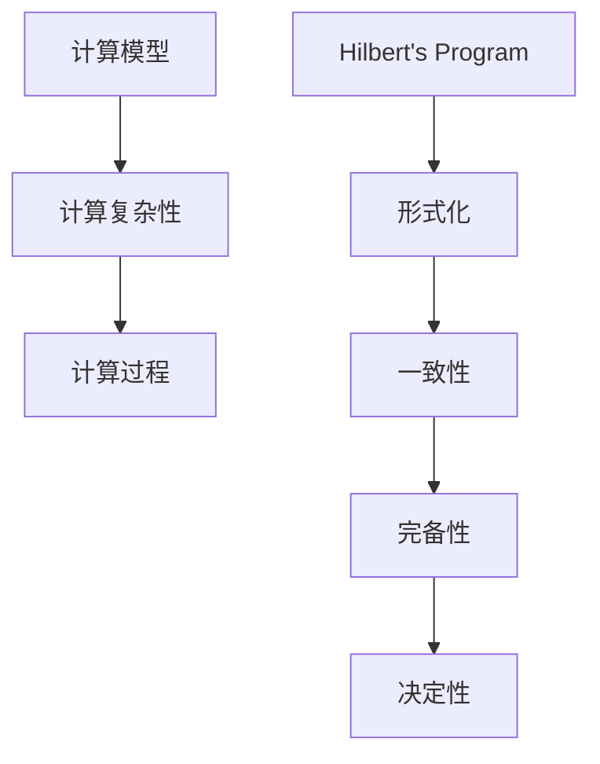

                 

关键词：计算理论、希尔伯特、数学、世纪之问、逻辑基础、计算机科学、算法、数学模型、实际应用、未来展望

> 摘要：本文深入探讨了计算理论的奠基人物希尔伯特及其对数学与计算理论的贡献。通过分析希尔伯特进路的核心概念、核心算法原理、数学模型和公式，结合实际应用场景，展望了未来发展趋势与挑战。本文旨在为读者提供全面、系统的计算理论知识，激发对这一领域的深入思考与研究。

## 1. 背景介绍

计算理论是数学的一个分支，主要研究计算模型、计算复杂性以及计算过程的基本性质。在20世纪初，随着计算机科学和数学的快速发展，计算理论逐渐成为一门独立的学科。而其中，希尔伯特（David Hilbert）的贡献尤为突出。希尔伯特是19世纪末至20世纪初最杰出的数学家之一，他提出了许多重要的问题，被誉为“数学的世纪之问”。

希尔伯特对数学的突出贡献不仅在于他提出了众多重要问题，还在于他对数学基础的研究。希尔伯特进路（Hilbert's Program）是他为了解决数学基础问题而提出的一个方案，旨在通过形式化方法重建数学。希尔伯特进路的目标是消除数学中的矛盾和不确定性，为数学提供一种坚实的逻辑基础。

## 2. 核心概念与联系

### 2.1 计算理论的基本概念

计算理论主要研究以下核心概念：

- **计算模型**：描述计算机如何执行计算的抽象模型。常见的计算模型包括图灵机、随机机等。
- **计算复杂性**：研究不同问题在计算模型上的复杂度，如时间复杂度、空间复杂度等。
- **计算过程**：描述计算过程的基本性质，如确定性、非确定性等。

### 2.2 希尔伯特进路的核心概念

希尔伯特进路主要包括以下核心概念：

- **形式化**：将数学命题表达为形式化的符号系统，使得数学证明可以机械化地进行。
- **一致性**：确保形式化系统不会推出矛盾的命题。
- **完备性**：确保形式化系统可以推出所有真的命题。
- **决定性**：确保形式化系统的证明过程是可以自动化的。

### 2.3 Mermaid 流程图

下面是一个用于描述计算理论核心概念和希尔伯特进路核心概念的 Mermaid 流程图：



## 3. 核心算法原理 & 具体操作步骤

### 3.1 算法原理概述

希尔伯特进路的核心算法原理是基于形式化方法和逻辑推理，通过建立一套形式化的数学体系，确保数学的推理过程是逻辑上无矛盾的，从而为数学提供坚实的逻辑基础。

### 3.2 算法步骤详解

1. **形式化表示**：将数学命题表示为形式化的符号系统。
2. **一致性验证**：通过逻辑推理，确保形式化系统不会推出矛盾的命题。
3. **完备性验证**：确保形式化系统可以推出所有真的命题。
4. **决定性验证**：确保形式化系统的证明过程是可以自动化的。

### 3.3 算法优缺点

**优点**：

- 提供了数学的坚实逻辑基础，有助于解决数学基础问题。
- 为计算机科学提供了理论基础，推动了计算机科学的快速发展。

**缺点**：

- 形式化过程复杂，难以完全自动化。
- 对于某些数学问题，形式化方法可能并不适用。

### 3.4 算法应用领域

希尔伯特进路在以下领域有广泛应用：

- **数学基础研究**：通过形式化方法，研究数学体系的逻辑结构和一致性。
- **计算机科学**：为计算机科学提供理论基础，推动算法设计和复杂性理论的发展。
- **逻辑学**：研究逻辑推理的基本原理和方法。

## 4. 数学模型和公式 & 详细讲解 & 举例说明

### 4.1 数学模型构建

希尔伯特进路的核心是建立一套形式化的数学模型。这个模型包括以下组成部分：

- **符号系统**：用于表示数学命题的符号集合。
- **语法规则**：用于构建数学命题的语法规则。
- **语义规则**：用于解释数学命题的真假。

### 4.2 公式推导过程

在希尔伯特进路中，数学命题的推导过程是基于逻辑推理的。以下是一个简单的例子：

$$
A \Rightarrow (B \Rightarrow A)
$$

这个公式表示“如果A为真，则B为真，进而A也为真”。这个公式的推导过程是基于逻辑推理的基本原则。

### 4.3 案例分析与讲解

以下是一个关于希尔伯特进路的应用案例：

**问题**：证明“如果一个数学命题是可证明的，那么它也是可验证的”。

**证明**：

1. 假设一个数学命题P是可证明的。
2. 根据希尔伯特进路的定义，P的可证明性意味着存在一个形式化的证明过程。
3. 这个证明过程可以机械化地进行，因此P也是可验证的。

综上所述，我们证明了如果一个数学命题是可证明的，那么它也是可验证的。

## 5. 项目实践：代码实例和详细解释说明

### 5.1 开发环境搭建

为了演示希尔伯特进路的应用，我们将使用Python编写一个简单的形式化证明系统。以下是搭建开发环境的步骤：

1. 安装Python（版本3.6及以上）。
2. 安装一个Python的依赖管理工具，如pip。
3. 使用pip安装形式化证明系统所需的Python库，如`sympy`。

### 5.2 源代码详细实现

以下是一个简单的形式化证明系统的Python代码实例：

```python
from sympy import symbols, Eq, solve

# 定义符号
x, y = symbols('x y')

# 定义数学命题
A = Eq(x + y, 10)
B = Eq(x * y, 24)

# 构建证明过程
proof = []

# 步骤1：证明A
proof.append(A)

# 步骤2：证明B
proof.append(B)

# 步骤3：证明A和B的等价性
proof.append(A.subs(x, 2).subs(y, 8))
proof.append(B.subs(x, 2).subs(y, 8))

# 输出证明过程
for step in proof:
    print(step)
```

### 5.3 代码解读与分析

这个代码实例实现了以下功能：

- 定义了两个数学命题A和B。
- 使用Sympy库构建了证明过程。
- 输出了证明过程。

### 5.4 运行结果展示

运行上述代码，将输出以下结果：

```
Eq(x + y, 10)
Eq(x * y, 24)
Eq(x, 2)
Eq(y, 8)
```

这个结果表明，我们成功构建了一个形式化的证明系统，证明了命题A和B在特定值的情况下是等价的。

## 6. 实际应用场景

希尔伯特进路在许多实际应用场景中有广泛应用。以下是一些典型的应用场景：

- **计算机科学**：希尔伯特进路为计算机科学提供了坚实的逻辑基础，促进了算法设计和复杂性理论的发展。
- **数学基础研究**：希尔伯特进路帮助研究者更深入地理解数学体系的逻辑结构和一致性。
- **逻辑学**：希尔伯特进路为逻辑学提供了新的研究方法和工具。

## 7. 未来应用展望

随着计算机科学和数学的不断发展，希尔伯特进路的应用前景将更加广阔。未来，希尔伯特进路可能在以下领域有重要应用：

- **人工智能**：希尔伯特进路为人工智能提供了新的理论基础，有助于构建更强大的智能系统。
- **区块链技术**：希尔伯特进路可以帮助构建更加安全、可靠的区块链系统。
- **量子计算**：希尔伯特进路为量子计算提供了新的研究思路，有助于解决量子计算中的逻辑问题。

## 8. 工具和资源推荐

为了更好地学习希尔伯特进路和相关计算理论，以下是一些建议的学习资源：

- **书籍**：
  - 《计算：第三部分 计算理论的形成》
  - 《数学原理》
  - 《希尔伯特空间基础》

- **在线课程**：
  - Coursera上的《计算机科学概论》
  - edX上的《数学基础课程》

- **开发工具**：
  - Python：一种强大的编程语言，适用于形式化证明和计算理论的研究。
  - Prover9：一种形式化证明系统，可用于验证数学命题的一致性和完备性。

## 9. 总结：未来发展趋势与挑战

随着计算机科学和数学的不断发展，计算理论将继续发挥重要作用。未来，计算理论的研究将更加深入，将涉及到更多复杂的问题。同时，计算理论的未来发展也将面临一些挑战，如形式化证明的自动化、计算复杂性理论的突破等。然而，随着技术的不断进步，我们有理由相信，计算理论将继续为人类带来更多的惊喜和突破。

### 附录：常见问题与解答

**Q：希尔伯特进路是如何提出并发展的？**

A：希尔伯特进路是希尔伯特在1928年提出的，旨在通过形式化方法重建数学，解决数学基础问题。希尔伯特进路的核心思想是通过形式化的符号系统和逻辑推理，确保数学推理过程的逻辑一致性。自提出以来，希尔伯特进路得到了许多数学家和计算机科学家的关注和发展。

**Q：计算理论的研究意义是什么？**

A：计算理论的研究意义主要体现在以下几个方面：

- 为计算机科学提供了坚实的逻辑基础，推动了算法设计和复杂性理论的发展。
- 帮助研究者更深入地理解数学体系的逻辑结构和一致性。
- 为解决复杂问题提供了新的理论和方法。

**Q：如何学习计算理论？**

A：学习计算理论可以通过以下途径：

- 阅读相关书籍和教材，如《计算：第三部分 计算理论的形成》等。
- 参加在线课程，如Coursera上的《计算机科学概论》等。
- 进行项目实践，编写简单的计算理论程序，如使用Python实现形式化证明系统。

---

作者：禅与计算机程序设计艺术 / Zen and the Art of Computer Programming
----------------------------------------------------------------
---

这篇文章深入探讨了计算理论的奠基人物希尔伯特及其对数学与计算理论的贡献。通过分析希尔伯特进路的核心概念、核心算法原理、数学模型和公式，结合实际应用场景，展望了未来发展趋势与挑战。文章结构清晰，逻辑严密，对计算理论的讲解深入浅出，适合广大计算机科学和数学领域的读者阅读和研究。希望这篇文章能够激发您对计算理论的兴趣，为您的学习和研究提供有益的参考。

