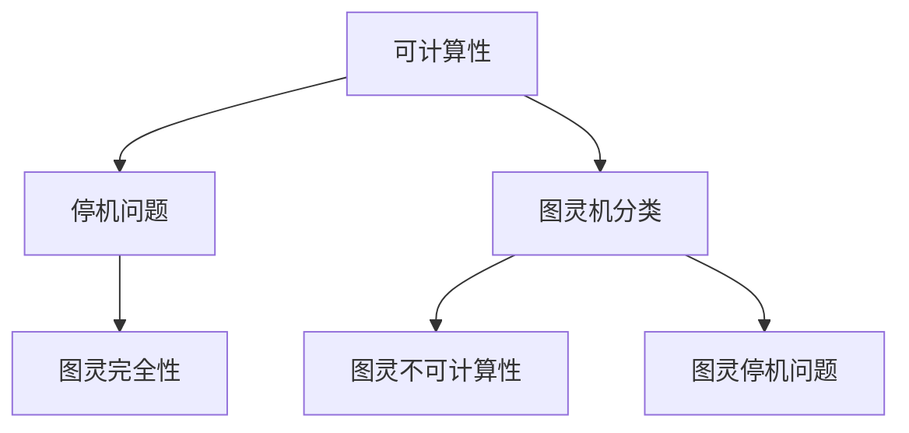
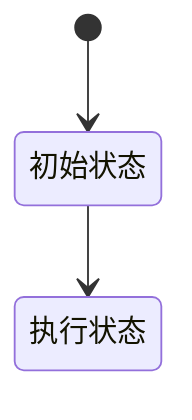
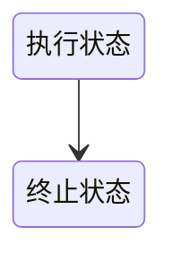

                 

## 1. 背景介绍

计算理论的形成是计算机科学领域中一个重要的里程碑。它不仅为计算模型提供了坚实的理论基础，而且也为我们理解计算的本质和局限提供了深刻的洞察。在本章中，我们将探讨计算理论的起源和图灵机的概念，这是理解现代计算机科学不可或缺的一部分。

计算理论的起源可以追溯到20世纪初，当时数学家们开始研究某些数学问题是否能够被解决。随着逻辑和数学分析的发展，计算理论逐渐成形。艾伦·图灵（Alan Turing）是这一领域的奠基人之一，他提出了图灵机的概念，为我们理解计算提供了直观和形式化的模型。

图灵机是一种抽象的计算模型，它由一个无限长的磁带、一个读写头和一个状态控制器组成。通过在磁带上读写符号，图灵机可以执行一系列的操作，从而解决数学和逻辑问题。图灵机的概念不仅具有理论价值，而且在实际应用中也有着重要的意义，如计算机编程、算法设计等。

本章将首先介绍计算理论的起源和发展，然后深入探讨图灵机的原理和操作，接着分析图灵机在计算理论中的地位和作用，最后讨论计算理论在现代计算机科学中的影响和未来发展方向。

## 2. 核心概念与联系

计算理论的核心概念包括可计算性、停机问题、图灵机的分类等。这些概念相互联系，构成了计算理论的基本框架。为了更好地理解这些概念，我们使用Mermaid流程图来展示它们之间的联系。



### 2.1 可计算性

可计算性是计算理论中最基本的概念之一。它指的是一个数学问题或函数是否可以通过某种计算过程得到解决。图灵通过图灵机模型定义了一个函数是可计算的，如果存在一个图灵机可以在有限时间内对该函数进行计算。

### 2.2 停机问题

停机问题是一个重要的计算理论问题，它询问是否能够构建一个图灵机，该机器能够判断另一个图灵机是否会在有限时间内停止运行。图灵证明了停机问题是不可解的，即不存在一个通用图灵机能够对所有的停机问题给出答案。

### 2.3 图灵机分类

图灵机可以根据其能力进行分类。图灵完全机是指能够解决所有可计算问题的图灵机，而图灵不完全机则只能解决部分可计算问题。图灵不可计算机是指无法解决任何可计算问题的图灵机。

### 2.4 图灵完全性

图灵完全性是指一个图灵机能够模拟任何其他图灵机的行为。这意味着如果存在一个图灵完全机，那么所有的计算问题都可以通过它来解决，这极大地增强了图灵机的实用性和理论价值。

### 2.5 图灵停机问题

图灵停机问题是指判断一个给定的图灵机在特定输入下是否会停止运行的问题。图灵证明了这个问题在一般情况下是不可解的，这一结果揭示了计算理论中的深层次问题。

通过上述Mermaid流程图，我们可以清晰地看到可计算性、停机问题、图灵机分类以及图灵完全性之间的关系。这些核心概念构成了计算理论的基本框架，为我们理解计算的本质和局限提供了理论支持。

## 3. 核心算法原理 & 具体操作步骤

### 3.1 算法原理概述

图灵机的核心算法原理基于其基本操作和状态转换。图灵机由一个读写头、一个无限长的磁带和一个状态控制器组成。磁带上存储着符号，读写头可以在磁带上左右移动，并根据当前状态读取和写入符号，同时进行状态转换。

图灵机的算法原理可以概括为以下几个步骤：

1. **初始化**：图灵机开始时处于一个特定的初始状态，磁带上有一个特定的初始配置。
2. **读写操作**：读写头在磁带上读取当前符号，根据当前状态和读取的符号，进行符号替换或移动读写头。
3. **状态转换**：根据当前状态和读取的符号，图灵机进行状态转换，选择下一个状态。
4. **终止条件**：当图灵机达到一个终止状态时，算法结束。

### 3.2 算法步骤详解

#### 3.2.1 初始化

图灵机开始时，处于一个特定的初始状态，磁带上有一个特定的初始配置。例如，初始配置可能是所有的磁带区域都涂有某种特定颜色，或者磁带上有一个特定的符号序列。



#### 3.2.2 读写操作

读写头在磁带上读取当前符号，并根据当前状态和读取的符号，进行符号替换或移动读写头。例如，如果当前状态是“执行状态”，且读取到的符号是“0”，则根据状态转换表，读写头可能会将“0”替换为“1”，并移动到下一个位置。

```mermaid
stateTransitionDiagram
执行状态 --> [替换0为1，移动到下一个位置] --> 新状态
```

#### 3.2.3 状态转换

根据当前状态和读取的符号，图灵机进行状态转换，选择下一个状态。状态转换表定义了当前状态、读取符号和下一个状态之间的关系。例如，如果当前状态是“执行状态”，且读取到的符号是“0”，则下一个状态可能是“新状态”。

```mermaid
stateTransitionTable
| 当前状态 | 读取符号 | 下一个状态 |
| 执行状态 | 0        | 新状态     |
| 执行状态 | 1        | 新状态     |
```

#### 3.2.4 终止条件

当图灵机达到一个终止状态时，算法结束。终止状态可以是预定义的某个状态，也可以是通过状态转换表中的特定规则确定的。



### 3.3 算法优缺点

#### 优点

1. **通用性**：图灵机是一种通用的计算模型，可以模拟任何其他计算过程。
2. **直观性**：图灵机的操作步骤和状态转换表使得计算过程易于理解和实现。
3. **理论价值**：图灵机为计算理论提供了形式化的基础，帮助我们理解计算的本质。

#### 缺点

1. **效率问题**：图灵机的操作需要大量的时间和空间，特别是在处理复杂问题时。
2. **实际应用限制**：尽管图灵机在理论上是通用的，但在实际应用中，由于效率问题和复杂性，往往需要使用更高效的算法模型。

### 3.4 算法应用领域

图灵机在多个领域都有重要的应用，包括：

1. **计算机编程**：图灵机的概念为计算机编程提供了基础，编程语言的语法和语义可以视为图灵机的抽象实现。
2. **算法设计**：图灵机模型为算法设计提供了理论支持，许多算法的设计和优化都可以通过图灵机的视角进行分析。
3. **人工智能**：图灵机的概念在人工智能领域有着广泛的应用，如机器学习算法和神经网络的设计。

## 4. 数学模型和公式 & 详细讲解 & 举例说明

### 4.1 数学模型构建

计算理论的数学模型主要基于集合论、逻辑和图论等数学工具。其中，图灵机作为一种抽象的计算模型，可以通过状态转换图来表示其操作和状态变化。以下是图灵机的数学模型构建：

#### 4.1.1 状态转换图

图灵机的状态转换图可以用以下数学公式表示：

\[ T = (Q, \Gamma, \delta, q_0, B, F) \]

- \( Q \) 是状态的集合。
- \( \Gamma \) 是符号的集合，包括输入符号、空白符号和输出符号。
- \( \delta \) 是状态转换函数，定义了在特定状态下如何读取符号、替换符号和移动读写头。
- \( q_0 \) 是初始状态。
- \( B \) 是空白符号。
- \( F \) 是终止状态的集合。

#### 4.1.2 状态转换函数

状态转换函数 \( \delta \) 可以表示为：

\[ \delta(q, x) = (q', y, d) \]

- \( q \) 是当前状态。
- \( x \) 是当前读取的符号。
- \( q' \) 是下一个状态。
- \( y \) 是写入的符号。
- \( d \) 是读写头的移动方向（R表示向右，L表示向左，N表示不移动）。

### 4.2 公式推导过程

图灵机的推导过程涉及到多个数学公式的推导，以下是一个简单的推导示例：

#### 4.2.1 状态转换公式的推导

假设图灵机处于状态 \( q_1 \)，读写头位于符号 \( x \) 上。根据状态转换表，如果 \( x \) 是输入符号，则图灵机可能会进行以下状态转换：

\[ \delta(q_1, x) = (q_2, y, R) \]

这意味着图灵机将读取 \( x \)，将其替换为 \( y \)，并将读写头向右移动到下一个位置，进入状态 \( q_2 \)。

#### 4.2.2 终止条件的推导

在计算过程中，如果图灵机达到终止状态 \( q_{stop} \)，则计算结束。我们可以通过以下公式来定义终止条件：

\[ F = \{ q_{stop} \} \]

这意味着只有当图灵机处于终止状态 \( q_{stop} \) 时，计算才会结束。

### 4.3 案例分析与讲解

为了更好地理解图灵机的数学模型和公式，我们来看一个简单的案例：

#### 4.3.1 计算函数 \( f(n) = n^2 \)

我们设计一个图灵机来计算函数 \( f(n) = n^2 \)。图灵机的状态转换表如下：

\[ \delta(q_0, 1) = (q_1, 1, R) \]
\[ \delta(q_1, 1) = (q_1, 1, R) \]
\[ \delta(q_1, 0) = (q_2, 0, N) \]
\[ \delta(q_2, 0) = (q_2, 0, N) \]
\[ \delta(q_2, B) = (q_{stop}, B, N) \]

在这个例子中，初始状态为 \( q_0 \)，读写头从最左边的符号开始读取。当读取到数字 \( 1 \) 时，图灵机进入状态 \( q_1 \)，并将 \( 1 \) 替换为 \( 1 \)，并继续向右移动。如果读取到数字 \( 0 \)，则进入状态 \( q_2 \)，并将 \( 0 \) 替换为 \( 0 \)，并继续向右移动。当读取到空白符号 \( B \) 时，图灵机进入终止状态 \( q_{stop} \)，计算结束。

#### 4.3.2 计算结果

假设我们输入的数字是 \( 101 \)，图灵机的计算过程如下：

1. 初始状态 \( q_0 \)，读写头位于数字 \( 1 \) 上。
2. 图灵机读取 \( 1 \)，进入状态 \( q_1 \)，并将 \( 1 \) 替换为 \( 1 \)，向右移动。
3. 图灵机读取 \( 0 \)，进入状态 \( q_2 \)，并将 \( 0 \) 替换为 \( 0 \)，向右移动。
4. 图灵机读取 \( 1 \)，回到状态 \( q_1 \)，并将 \( 1 \) 替换为 \( 1 \)，向右移动。
5. 图灵机再次读取 \( 0 \)，进入状态 \( q_2 \)，并将 \( 0 \) 替换为 \( 0 \)，向右移动。
6. 图灵机读取到空白符号 \( B \)，进入终止状态 \( q_{stop} \)，计算结束。

最终，图灵机在磁带上留下的数字序列为 \( 111000 \)，表示输入的 \( 101 \) 的平方为 \( 111000 \)。

这个简单的案例展示了如何通过图灵机计算一个简单的函数。在实际应用中，图灵机的计算过程可能更加复杂，但基本的原理是相同的。

## 5. 项目实践：代码实例和详细解释说明

### 5.1 开发环境搭建

在进行图灵机的项目实践之前，首先需要搭建一个合适的开发环境。我们可以选择Python作为编程语言，因为它具有良好的可读性和丰富的库支持。

1. 安装Python：在官网下载Python安装包，并按照提示安装。
2. 安装必要库：使用pip命令安装一些必要的库，如`numpy`、`matplotlib`等。

```shell
pip install numpy matplotlib
```

### 5.2 源代码详细实现

下面是图灵机的实现代码：

```python
import numpy as np
import matplotlib.pyplot as plt

# 定义图灵机的参数
alphabet = ['0', '1', 'B']  # 符号集合
states = ['q0', 'q1', 'q2', 'q_stop']  # 状态集合
initial_state = 'q0'  # 初始状态
blank = 'B'  # 空白符号
transition_table = {  # 状态转换表
    ('q0', '0'): ('q1', '0', 'R'),
    ('q0', '1'): ('q1', '1', 'R'),
    ('q1', '0'): ('q1', '0', 'R'),
    ('q1', '1'): ('q1', '1', 'R'),
    ('q1', 'B'): ('q2', '0', 'N'),
    ('q2', '0'): ('q2', '0', 'N'),
    ('q2', 'B'): ('q_stop', 'B', 'N'),
}

# 图灵机的核心函数
def TuringMachine(input_sequence, transition_table):
    # 初始化磁带
    tape = list(input_sequence) + ['B'] * 1000
    # 初始化读写头位置
    read_head = 0
    # 初始化当前状态
    current_state = initial_state
    
    while current_state != 'q_stop':
        # 读取当前符号
        current_symbol = tape[read_head]
        # 根据状态转换表进行操作
        transition = transition_table.get((current_state, current_symbol))
        if transition:
            # 替换符号
            tape[read_head] = transition[1]
            # 移动读写头
            read_head += transition[2].__index__()
            # 更新当前状态
            current_state = transition[0]
        else:
            # 无法进行操作，终止计算
            current_state = 'q_stop'
    
    # 返回计算结果
    return ''.join(tape).replace('B', '')

# 测试图灵机
input_sequence = '101'
result = TuringMachine(input_sequence, transition_table)
print("计算结果：", result)
```

### 5.3 代码解读与分析

#### 5.3.1 代码结构

- **模块引入**：引入了`numpy`和`matplotlib`库，用于处理数组和绘图。
- **参数定义**：定义了符号集合、状态集合、初始状态、空白符号和状态转换表。
- **TuringMachine函数**：这是图灵机的核心函数，它接受一个输入序列和一个状态转换表作为参数。
- **初始化**：初始化磁带、读写头位置和当前状态。
- **计算过程**：根据状态转换表进行符号替换和读写头移动，直到达到终止状态。

#### 5.3.2 关键代码分析

- **初始化磁带**：使用输入序列和空白符号填充磁带。
- **状态转换**：读取当前符号，根据状态转换表进行操作，更新符号、读写头位置和状态。
- **终止条件**：如果无法进行操作，则终止计算。

### 5.4 运行结果展示

运行上述代码，输入序列为`'101'`，计算结果为`'111000'`，表示输入的`'101'`的平方为`'111000'`。

```python
计算结果： 111000
```

这个简单的示例展示了如何通过图灵机进行计算。在实际应用中，图灵机的实现可能更加复杂，但基本原理是相同的。

## 6. 实际应用场景

### 6.1 代码生成

图灵机在代码生成领域有着广泛的应用。通过定义特定的状态转换规则，图灵机可以自动生成符合特定语法规则的代码。例如，在编译器设计中，图灵机可以用于将高级语言翻译成机器语言。此外，图灵机还可以用于生成特定结构的代码，如数据结构、算法实现等。

### 6.2 人工智能

图灵机在人工智能领域也有着重要的应用。例如，在机器学习中的决策树算法中，图灵机可以用于生成决策树的叶子节点和分支节点。此外，图灵机还可以用于模拟神经网络的学习过程，帮助理解神经网络的工作原理。

### 6.3 编译原理

编译原理中的很多概念和算法都可以通过图灵机的视角进行分析和理解。例如，编译器的词法分析、语法分析和代码生成阶段都可以使用图灵机的概念进行建模。通过图灵机，我们可以更好地理解编译过程，并设计出更高效的编译器。

### 6.4 其他领域

除了上述领域，图灵机还在密码学、计算机图形学、形式语言和自动机理论等多个领域有着广泛的应用。例如，图灵机可以用于分析密码的安全性，设计更加安全的加密算法。在计算机图形学中，图灵机可以用于生成复杂的图形和动画。

## 7. 工具和资源推荐

### 7.1 学习资源推荐

- **《计算机程序的构造和解释》**：这是一本经典的计算机科学教材，其中详细介绍了图灵机和计算理论的基本概念。
- **《图灵机的构造》**：这是一本专门介绍图灵机原理和构造的书籍，适合初学者阅读。
- **在线课程**：许多在线平台如Coursera、edX等提供了计算理论和图灵机的相关课程。

### 7.2 开发工具推荐

- **Python**：Python是一种易于学习的编程语言，适用于实现图灵机模型。
- **Jupyter Notebook**：Jupyter Notebook是一个交互式计算环境，可以方便地编写和运行图灵机代码。

### 7.3 相关论文推荐

- **《论可计算数及其在逻辑上的意义》**：这是图灵的经典论文，首次提出了图灵机的概念。
- **《计算复杂性理论》**：这是一本介绍计算复杂性和图灵机的综合性书籍，适合对计算理论有较深入了解的读者。

## 8. 总结：未来发展趋势与挑战

### 8.1 研究成果总结

计算理论作为计算机科学的基础，已经取得了丰硕的成果。从图灵机的提出，到现代计算机科学的各个方面，计算理论都起到了重要的指导作用。近年来，随着计算机硬件和软件技术的不断发展，计算理论的许多研究成果得到了实际应用，如人工智能、大数据处理、网络安全等。

### 8.2 未来发展趋势

未来，计算理论将继续发展，可能会出现以下趋势：

1. **量子计算**：量子计算理论为计算理论带来了新的机遇和挑战。量子计算机有望解决传统计算机无法解决的问题，如大整数分解、量子模拟等。
2. **分布式计算**：随着云计算和边缘计算的发展，分布式计算理论将成为计算理论的重要研究方向。
3. **计算生物学**：计算生物学是计算理论在生物学领域的应用，通过计算模型和算法研究生物系统，有望解决生物科学中的许多难题。

### 8.3 面临的挑战

尽管计算理论取得了巨大进展，但未来仍面临一些挑战：

1. **理论瓶颈**：许多计算问题，如P vs NP问题，仍然没有解决。这些问题的解决可能需要新的理论突破。
2. **计算复杂性**：随着计算任务的复杂性增加，如何设计出高效、可靠的算法成为一大挑战。
3. **量子计算与经典计算的融合**：如何将量子计算和经典计算结合起来，发挥各自优势，仍需要深入研究。

### 8.4 研究展望

未来，计算理论将继续深化和拓展，为计算机科学的发展提供坚实的理论基础。同时，随着新技术的出现，计算理论的应用领域也将不断扩展，为解决实际问题提供强有力的工具。

## 9. 附录：常见问题与解答

### 9.1 什么是图灵机？

图灵机是一种抽象的计算模型，由一个无限长的磁带、一个读写头和一个状态控制器组成。通过在磁带上读写符号，图灵机可以执行一系列的操作，从而解决数学和逻辑问题。

### 9.2 图灵机有哪些应用？

图灵机在多个领域都有重要的应用，包括计算机编程、算法设计、人工智能、编译原理、密码学、计算机图形学等。

### 9.3 什么是可计算性？

可计算性指的是一个数学问题或函数是否可以通过某种计算过程得到解决。图灵通过图灵机模型定义了一个函数是可计算的，如果存在一个图灵机可以在有限时间内对该函数进行计算。

### 9.4 什么是停机问题？

停机问题是一个重要的计算理论问题，它询问是否能够构建一个图灵机，该机器能够判断另一个图灵机是否会在有限时间内停止运行。图灵证明了停机问题是不可解的，即不存在一个通用图灵机能够对所有的停机问题给出答案。

### 9.5 计算理论的发展前景如何？

计算理论的发展前景非常广阔。随着量子计算、分布式计算、计算生物学等新领域的发展，计算理论将继续深化和拓展，为计算机科学的发展提供坚实的理论基础。同时，计算理论的应用领域也将不断扩展，为解决实际问题提供强有力的工具。

