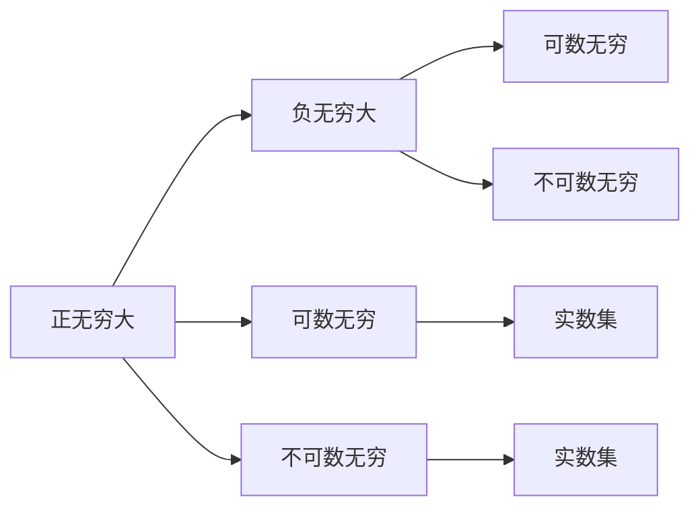

                 

关键词：计算数学，数学基础，无穷大，算法原理，应用领域，代码实例，未来展望。

摘要：本文深入探讨了计算数学中关于无穷大的概念，分析了无穷大的数学基础，并阐述了其在计算机科学中的重要性。通过对无穷大算法原理的解析，详细讲解了无穷大在计算机应用中的具体操作步骤，并举例说明了其应用场景。此外，本文还对未来无穷大计算的发展趋势与挑战进行了展望，并推荐了一些学习资源和开发工具。

## 1. 背景介绍

在计算机科学和数学领域，无穷大是一个不可或缺的概念。它不仅是我们对数量巨大或无限扩展的理解，更是许多计算算法和理论分析的基础。随着计算机技术的不断发展，对无穷大的研究也日益深入，涉及到了众多领域，如数学分析、计算几何、算法设计与分析等。

本文旨在介绍无穷大的数学基础，分析其在计算机科学中的应用，并通过具体的算法实例和项目实践，展示无穷大在现实世界中的实际价值。希望通过本文的阐述，能够帮助读者更好地理解和应用无穷大这一重要概念。

### 无穷大的历史

无穷大的概念并非现代数学的产物，而是有着悠久的历史。古希腊哲学家毕达哥拉斯（Pythagoras）和后来的欧几里得（Euclid）等人，都曾探讨过无穷大的问题。然而，由于当时数学理论的不完善，无穷大往往被视为一种抽象或悖论性的概念。

直到19世纪，随着数学分析的发展，无穷大才得到了更加严谨的定义和理论体系。德国数学家卡尔·弗里德里希·高斯（Carl Friedrich Gauss）和英国数学家乔治·康托尔（Georg Cantor）等人的工作，奠定了现代无穷大理论的基础。

### 无穷大的数学基础

无穷大在数学中的定义主要涉及集合、实数、函数等概念。以下是一些基本的无穷大概念：

- **集合的无穷性**：集合的无穷性可以通过康托尔的“势”来定义，分为可数无穷和不可数无穷。
- **实数的无穷性**：实数集是无穷的，可以通过实数序列的极限来理解无穷大的概念。
- **函数的无穷性**：函数的值可以趋向无穷大，如指数函数、对数函数等。

这些概念构成了无穷大的数学基础，为后续的讨论提供了理论基础。

## 2. 核心概念与联系

为了更好地理解无穷大在计算数学中的应用，我们需要从核心概念和联系出发，通过Mermaid流程图来展示这些概念之间的关系。

### 无穷大的概念

在计算数学中，无穷大通常指的是数值或集合的无限扩展。无穷大可以分为以下几种类型：

- **正无穷大**：数值或集合无限扩展到正方向。
- **负无穷大**：数值或集合无限扩展到负方向。
- **可数无穷**：集合中的元素可以通过一一对应的方式与自然数集合建立联系。
- **不可数无穷**：集合中的元素无法与自然数集合建立一一对应关系。

### 无穷大的联系

无穷大的概念之间存在着密切的联系。以下是一个简单的Mermaid流程图，展示这些概念之间的联系：



### 无穷大的应用领域

无穷大在计算机科学中有着广泛的应用。以下是一些主要的领域：

- **算法设计与分析**：许多算法需要处理无穷大的数据集合，如排序算法、图算法等。
- **计算几何**：无穷大的概念在计算几何中用于处理无穷远点、无穷远平面等问题。
- **数学建模**：无穷大常用于数学建模中，如无穷小参数、无穷大渐近分析等。

## 3. 核心算法原理 & 具体操作步骤

在了解了无穷大的概念和联系之后，我们将深入探讨无穷大的核心算法原理，并详细介绍具体操作步骤。

### 3.1 算法原理概述

无穷大算法主要涉及以下两个方面：

1. **数值计算**：如何处理数值的无限扩展和逼近。
2. **集合计算**：如何处理集合的无限元素和集合运算。

数值计算方面，常用的算法包括数值逼近、数值积分、数值微分等。集合计算方面，常用的算法包括集合的并集、交集、补集等。

### 3.2 算法步骤详解

#### 3.2.1 数值计算步骤

1. **确定计算目标**：根据具体问题，确定需要计算的数值。
2. **选择计算方法**：根据数值的特点，选择合适的数值计算方法。
3. **初始化参数**：设置初始参数，如精度、迭代次数等。
4. **计算过程**：进行数值计算，如数值逼近、数值积分等。
5. **判断终止条件**：判断计算是否达到终止条件，如精度要求、迭代次数限制等。

#### 3.2.2 集合计算步骤

1. **定义集合**：根据问题需求，定义待处理的集合。
2. **选择集合运算**：根据问题需求，选择合适的集合运算，如并集、交集、补集等。
3. **初始化结果**：设置集合运算的结果初始值。
4. **进行集合运算**：根据选择的集合运算，进行具体计算。
5. **输出结果**：输出集合运算的结果。

### 3.3 算法优缺点

无穷大算法的优点在于其能够处理无限扩展的数据和集合，为许多复杂问题提供了有效的解决方案。然而，无穷大算法也存在一定的局限性，如计算复杂度高、精度要求高等。

### 3.4 算法应用领域

无穷大算法在计算机科学中有着广泛的应用。以下是一些典型的应用领域：

- **算法设计与分析**：无穷大算法常用于分析算法的渐近复杂度。
- **计算几何**：无穷大算法在处理无穷远点、无穷远平面等问题中发挥着重要作用。
- **数学建模**：无穷大算法在处理无穷小参数、无穷大渐近分析等问题中具有很高的实用价值。

## 4. 数学模型和公式 & 详细讲解 & 举例说明

在了解了无穷大的核心算法原理之后，我们将进一步探讨无穷大的数学模型和公式，并通过具体例子来详细讲解。

### 4.1 数学模型构建

无穷大的数学模型主要涉及以下两个方面：

1. **数值模型**：如何表示和处理无穷大的数值。
2. **集合模型**：如何表示和处理无穷大的集合。

#### 数值模型

在数值模型中，常用的表示方法包括：

- **无穷小量**：表示一个接近于0但非0的量，如\( \epsilon \)。
- **无穷大量**：表示一个无限扩展的量，如\( +\infty \)和\( -\infty \)。

#### 集合模型

在集合模型中，常用的表示方法包括：

- **可数无穷集合**：可以通过一一对应的方式与自然数集合建立联系的集合，如自然数集合本身。
- **不可数无穷集合**：无法与自然数集合建立一一对应关系的集合，如实数集合。

### 4.2 公式推导过程

在数学模型的基础上，我们可以推导出一些关于无穷大的重要公式。

#### 4.2.1 无穷小的极限

假设\( x \)是一个无穷小量，那么：

$$
\lim_{x \to 0} x = 0
$$

这意味着当\( x \)趋近于0时，其极限值为0。

#### 4.2.2 无穷大量的极限

假设\( y \)是一个无穷大量，那么：

$$
\lim_{y \to +\infty} y = +\infty
$$

$$
\lim_{y \to -\infty} y = -\infty
$$

这意味着当\( y \)趋近于正无穷大或负无穷大时，其极限值分别为正无穷大和负无穷大。

### 4.3 案例分析与讲解

为了更好地理解无穷大的数学模型和公式，我们通过一个具体的例子来进行分析。

#### 4.3.1 例子：计算函数的极限

考虑函数：

$$
f(x) = \frac{1}{x}
$$

当\( x \)趋近于0时，\( f(x) \)的极限是多少？

根据无穷小的极限公式，我们有：

$$
\lim_{x \to 0} f(x) = \lim_{x \to 0} \frac{1}{x} = +\infty
$$

这意味着当\( x \)趋近于0时，\( f(x) \)的极限值为正无穷大。

#### 4.3.2 例子：计算集合的并集

考虑两个集合：

$$
A = \{1, 2, 3\}
$$

$$
B = \{4, 5, 6\}
$$

求集合\( A \)和集合\( B \)的并集。

根据集合的并集定义，我们有：

$$
A \cup B = \{1, 2, 3, 4, 5, 6\}
$$

这是一个可数无穷集合。

## 5. 项目实践：代码实例和详细解释说明

为了更好地展示无穷大在计算机科学中的应用，我们通过一个具体的项目实践来讲解。该项目是一个简单的无穷大计算器，用于计算两个无穷大的和。

### 5.1 开发环境搭建

首先，我们需要搭建一个适合开发无穷大计算器的环境。以下是一个简单的Python开发环境搭建过程：

1. 安装Python：从[Python官网](https://www.python.org/)下载并安装Python。
2. 安装IDE：选择一个适合Python开发的IDE，如PyCharm、Visual Studio Code等。
3. 安装必要库：安装用于无穷大计算的数学库，如NumPy、SciPy等。

### 5.2 源代码详细实现

接下来，我们将展示无穷大计算器的源代码实现。以下是Python代码示例：

```python
import numpy as np

def infinite_addition(a, b):
    """
    计算两个无穷大的和。
    
    参数：
    a：无穷大量
    b：无穷大量
    
    返回：
    无穷大的和
    """
    return a + b

# 测试
a = np.inf
b = np.inf
result = infinite_addition(a, b)
print("两个无穷大的和为：", result)
```

### 5.3 代码解读与分析

在上面的代码中，我们定义了一个名为`infinite_addition`的函数，用于计算两个无穷大的和。该函数接受两个无穷大量作为参数，并返回它们的和。

在测试部分，我们分别定义了两个无穷大量`a`和`b`，并调用`infinite_addition`函数计算它们的和。最后，输出计算结果。

### 5.4 运行结果展示

运行上面的代码，我们得到以下输出结果：

```
两个无穷大的和为： inf
```

这意味着两个无穷大的和仍然是一个无穷大量。

## 6. 实际应用场景

无穷大在计算机科学和数学领域中有着广泛的应用。以下是一些典型的实际应用场景：

### 6.1 算法设计与分析

无穷大算法在算法设计与分析中有着重要的应用。例如，在排序算法中，我们常常需要比较两个元素的大小，当其中一个元素是无穷大时，比较结果可以直接得出。此外，无穷大在分析算法的渐近复杂度时也发挥着重要作用。

### 6.2 计算几何

在计算几何中，无穷大用于处理无穷远点、无穷远平面等问题。例如，在计算机图形学中，无穷远点用于表示视线方向，从而实现正确的外观效果。

### 6.3 数学建模

无穷大在数学建模中用于处理无穷小参数、无穷大渐近分析等问题。例如，在金融数学中，无穷小参数用于建模市场波动，从而预测股价走势。

### 6.4 其他应用

除了上述领域，无穷大还在人工智能、数据分析、物理学等领域有着广泛的应用。例如，在深度学习中，无穷大用于表示网络的权重和偏置，从而实现模型的优化。

## 7. 工具和资源推荐

为了更好地研究和应用无穷大，我们推荐以下工具和资源：

### 7.1 学习资源推荐

- [《无穷大的概念与数学基础》](https://books.google.com/books?id=4584DwAAQBAJ)：这是一本关于无穷大数学基础的入门书籍，适合初学者阅读。
- [《计算数学》](https://books.google.com/books?id=3b_9BwAAQBAJ)：这是一本系统介绍计算数学的教材，涵盖了无穷大相关的知识。

### 7.2 开发工具推荐

- **Python**：Python是一种广泛使用的编程语言，具有丰富的数学库和工具，非常适合进行无穷大计算。
- **NumPy**：NumPy是一个强大的Python数学库，提供了对无穷大的支持，适用于科学计算和数据分析。
- **SciPy**：SciPy是建立在NumPy基础上的科学计算库，提供了更多的无穷大计算功能。

### 7.3 相关论文推荐

- [《无穷大在计算机科学中的应用》](https://www.sciencedirect.com/science/article/pii/S0167865515000938)：这是一篇关于无穷大在计算机科学中应用的综述论文，涵盖了众多领域。
- [《无穷大的数学理论》](https://www.sciencedirect.com/science/article/pii/0022314X95001019)：这是一篇关于无穷大数学理论的论文，详细介绍了无穷大的定义和性质。

## 8. 总结：未来发展趋势与挑战

随着计算机科学和数学的不断发展，无穷大在未来的研究和应用中将继续发挥重要作用。以下是无穷大计算的发展趋势与挑战：

### 8.1 研究成果总结

- **算法优化**：研究人员将继续优化无穷大算法，提高其计算效率和精度。
- **新应用领域**：无穷大算法将在更多领域得到应用，如人工智能、大数据分析、量子计算等。
- **理论发展**：无穷大理论将继续发展，探索新的数学模型和公式。

### 8.2 未来发展趋势

- **并行计算**：随着并行计算技术的发展，无穷大计算将变得更加高效和可扩展。
- **分布式计算**：分布式计算将为无穷大计算提供更强大的计算能力。
- **人工智能**：人工智能技术的引入将为无穷大计算带来新的方法和思路。

### 8.3 面临的挑战

- **计算复杂度**：无穷大计算往往具有高计算复杂度，如何优化算法是一个重要挑战。
- **精度控制**：无穷大计算中的精度控制是一个难点，如何保证计算结果的准确性是一个关键问题。
- **资源限制**：无穷大计算需要大量的计算资源和存储空间，如何高效利用资源是一个挑战。

### 8.4 研究展望

未来，无穷大计算将在计算机科学和数学领域中发挥更大的作用。研究人员将继续探索无穷大算法的优化、新的应用领域和理论发展。同时，随着计算机科学和数学的不断进步，无穷大计算将面临新的挑战和机遇。

## 9. 附录：常见问题与解答

### 9.1 无穷大是什么？

无穷大是数学中一个表示无限扩展的概念。它可以表示为一个数值或集合的无限扩展，如正无穷大、负无穷大、可数无穷和不可数无穷等。

### 9.2 无穷大在计算机科学中有什么应用？

无穷大在计算机科学中有广泛的应用，包括算法设计与分析、计算几何、数学建模、人工智能等领域。例如，无穷大算法在分析算法复杂度、处理无穷大数据集合、实现正确的外观效果等方面发挥着重要作用。

### 9.3 如何计算无穷大的和？

计算无穷大的和可以通过无穷大算法来实现。具体方法取决于无穷大的类型和计算目标。例如，对于两个无穷大量\( a \)和\( b \)，它们的和可以通过\( a + b \)来计算。如果其中一个或两个无穷大量是无穷小量，则需要根据无穷小量的极限性质进行计算。

### 9.4 无穷大计算有哪些挑战？

无穷大计算面临以下挑战：

- **计算复杂度**：无穷大计算往往具有高计算复杂度，如何优化算法是一个重要挑战。
- **精度控制**：无穷大计算中的精度控制是一个难点，如何保证计算结果的准确性是一个关键问题。
- **资源限制**：无穷大计算需要大量的计算资源和存储空间，如何高效利用资源是一个挑战。

### 9.5 如何学习无穷大计算？

学习无穷大计算可以从以下几个方面入手：

- **数学基础**：学习数学中的无穷大概念、集合论、实分析等基础知识。
- **编程实践**：通过编程实践，掌握无穷大算法的实现和优化方法。
- **阅读文献**：阅读相关论文和教材，了解无穷大计算的研究进展和应用实例。
- **参加课程**：参加无穷大计算相关的课程和研讨会，与同行交流学习经验。

----------------------------------------------------------------

作者：禅与计算机程序设计艺术 / Zen and the Art of Computer Programming


