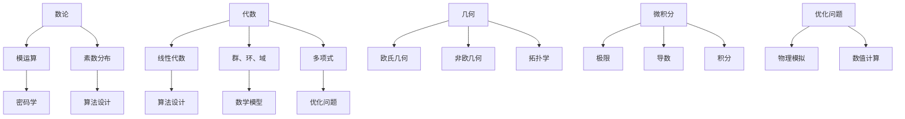

                 

关键词：计算数学基础、算法原理、公式推导、项目实践、实际应用场景、未来展望

> 摘要：本文是《计算：第二部分 计算的数学基础》的详细解析，旨在深入探讨计算的数学基础，包括核心概念、算法原理、数学模型构建、公式推导及实际应用场景。通过详细讲解和案例分析，我们希望读者能够更好地理解计算的数学基础，掌握相关工具和资源，为未来的计算研究和发展奠定坚实基础。

## 1. 背景介绍

在计算科学和工程领域，数学基础是至关重要的。无论是算法设计、数学模型构建还是公式推导，都需要深厚的数学背景作为支撑。本文将围绕计算的数学基础，深入探讨其中的核心概念和原理，旨在为读者提供一份全面而详尽的指南。

计算数学基础涉及多个方面，包括但不限于数论、代数、几何、微积分等。这些数学分支为计算提供了强大的工具和框架，使得复杂的计算任务得以高效解决。例如，数论在密码学中发挥着重要作用，而代数和几何则在图形处理和计算机视觉中广泛应用。微积分则在优化问题和物理模拟中扮演关键角色。

本文将分为以下几个部分进行讨论：

1. **核心概念与联系**：介绍计算数学中的核心概念，包括数论、代数、几何和微积分等，并使用 Mermaid 流程图展示这些概念之间的联系。
2. **核心算法原理 & 具体操作步骤**：详细讲解一些核心算法的原理和操作步骤，包括其优缺点和应用领域。
3. **数学模型和公式 & 详细讲解 & 举例说明**：介绍数学模型和公式的构建过程，推导过程，并通过案例进行分析和讲解。
4. **项目实践：代码实例和详细解释说明**：通过实际代码实例，展示如何应用计算数学基础，并进行解读和分析。
5. **实际应用场景**：探讨计算数学在实际应用中的场景，包括当前的应用案例和未来展望。
6. **工具和资源推荐**：推荐学习资源、开发工具和相关论文，帮助读者进一步深入了解计算数学基础。
7. **总结：未来发展趋势与挑战**：总结研究成果，探讨未来发展趋势和面临的挑战。

通过本文的深入讨论，我们希望读者能够对计算的数学基础有一个全面而深入的理解，并为未来的计算研究和发展做好准备。

## 2. 核心概念与联系

在计算数学中，核心概念构成了理解算法原理和数学模型构建的基础。以下是对数论、代数、几何和微积分的介绍，并使用 Mermaid 流程图展示这些概念之间的联系。

### 数论

数论是研究整数性质及其关系的数学分支。在计算中，数论广泛应用于密码学、算法设计和优化问题。核心概念包括：

- **质数**：只能被1和自身整除的大于1的自然数。
- **模运算**：在整数除法的基础上引入模数，用于同余关系和加密算法。
- **素数分布**：研究质数在整数集合中的分布规律。

### 代数

代数是研究数和代数结构及其性质的数学分支。在计算中，代数在算法设计和数学模型构建中扮演关键角色。核心概念包括：

- **线性代数**：研究向量、矩阵和线性方程组。
- **群、环、域**：研究代数结构的基本概念，包括加法、乘法和逆元。
- **多项式**：研究多项式的结构、性质和运算。

### 几何

几何是研究空间形状、大小、位置和变换的数学分支。在计算中，几何在计算机图形学、计算机视觉和物理模拟中广泛应用。核心概念包括：

- **欧氏几何**：研究平面和空间的几何性质。
- **非欧几何**：研究不同于欧氏几何的几何结构。
- **拓扑学**：研究空间结构的性质，包括连通性和紧致性。

### 微积分

微积分是研究变化率和累积过程的数学分支。在计算中，微积分在优化问题、物理模拟和数值计算中发挥重要作用。核心概念包括：

- **极限**：研究函数在某点附近的行为。
- **导数**：研究函数在某一点的变化率。
- **积分**：研究函数的累积量和面积。

### Mermaid 流程图

以下是一个简化的 Mermaid 流程图，展示了上述核心概念之间的联系：



通过上述流程图，我们可以看到，数论、代数、几何和微积分这些核心概念在计算数学中相互交织，共同构建了一个庞大的知识体系。这些概念不仅为算法设计和数学模型构建提供了理论基础，也为解决实际问题提供了强大的工具。

在接下来的章节中，我们将深入探讨这些核心算法原理，详细讲解其操作步骤，并分析其在实际应用中的表现。通过这些讨论，我们将进一步理解计算的数学基础，并为其在未来的发展奠定坚实基础。

### 3. 核心算法原理 & 具体操作步骤

在计算数学中，核心算法的原理是理解和应用数学基础的关键。本章节将详细探讨几个核心算法的原理，包括其操作步骤、优缺点及其应用领域。

#### 3.1 算法原理概述

以下是几个核心算法的概述：

1. **快速傅里叶变换（FFT）**
2. **二分查找算法**
3. **最小生成树算法**
4. **动态规划算法**

#### 3.2 算法步骤详解

##### 3.2.1 快速傅里叶变换（FFT）

**原理**：快速傅里叶变换是一种将时域信号转换为频域信号的高效算法，其核心思想是基于分治策略。

**步骤**：
1. **分治**：将输入信号分成较小的子信号。
2. **递归**：对每个子信号进行FFT变换。
3. **合并**：将子信号的变换结果合并成最终的频域信号。

**优缺点**：
- **优点**：相比直接计算傅里叶变换，FFT显著降低了计算复杂度。
- **缺点**：对于较小的信号，FFT的效率优势并不明显。

**应用领域**：信号处理、图像处理、音频处理等。

##### 3.2.2 二分查找算法

**原理**：二分查找算法是一种在有序数组中查找特定元素的算法，其核心思想是通过不断将查找范围缩小一半来提高效率。

**步骤**：
1. **初始化**：设置查找范围的起点和终点。
2. **循环**：计算中间位置，与目标值进行比较。
3. **调整范围**：根据比较结果调整查找范围。
4. **结束**：找到目标值或确定不存在。

**优缺点**：
- **优点**：时间复杂度为O(log n)，效率非常高。
- **缺点**：需要输入数组是有序的，且不适用于动态数组。

**应用领域**：数据库索引、排序算法、算法竞赛等。

##### 3.2.3 最小生成树算法

**原理**：最小生成树算法用于在一个加权无向图中找到一棵权重和最小的生成树。

**步骤**：
1. **选择初始顶点**：可以选择任意一个顶点作为树的起点。
2. **循环**：遍历所有顶点，选择权重最小的边添加到生成树中，直到所有顶点都在生成树中。

**优缺点**：
- **优点**：时间复杂度较低，适用于大规模图的处理。
- **缺点**：对于具有多个最小权重边的图，结果可能不唯一。

**应用领域**：网络设计、图论问题、算法竞赛等。

##### 3.2.4 动态规划算法

**原理**：动态规划算法是一种将复杂问题分解为子问题，并存储子问题的解以避免重复计算的方法。

**步骤**：
1. **定义状态**：将问题划分为若干状态。
2. **状态转移方程**：定义状态之间的关系。
3. **初始化**：初始化边界条件。
4. **递推计算**：根据状态转移方程计算每个状态的解。
5. **结果输出**：输出最终结果。

**优缺点**：
- **优点**：能够显著提高算法效率，适用于最优子结构问题。
- **缺点**：需要定义明确的状态和状态转移方程，对于复杂问题可能难以设计。

**应用领域**：最优化问题、背包问题、路径规划等。

#### 3.3 算法优缺点

上述算法各有其独特的优势和局限性，适用于不同的应用场景。在实际应用中，需要根据具体问题和数据特点选择合适的算法。

#### 3.4 算法应用领域

- **快速傅里叶变换（FFT）**：广泛应用于信号处理和图像处理领域。
- **二分查找算法**：在数据库索引和算法竞赛中经常使用。
- **最小生成树算法**：在图论问题和网络设计中有广泛应用。
- **动态规划算法**：在优化问题和路径规划问题中发挥关键作用。

通过深入理解这些核心算法的原理和操作步骤，我们可以更好地应用计算数学基础，解决实际计算问题。在接下来的章节中，我们将进一步探讨数学模型和公式，以及其在实际应用中的具体实现。

### 4. 数学模型和公式 & 详细讲解 & 举例说明

数学模型和公式在计算中起着至关重要的作用，它们不仅为算法设计提供了理论基础，也为实际问题的解决提供了工具。在这一章节中，我们将详细讲解数学模型和公式的构建过程，推导过程，并通过具体的例子进行分析和讲解。

#### 4.1 数学模型构建

构建数学模型是计算数学中的重要任务，它将实际问题转化为数学表达式。以下是构建数学模型的一般步骤：

1. **明确问题**：首先要明确要解决的问题，包括问题的目标、条件和限制。
2. **定义变量**：根据问题，定义相关的变量，包括输入变量、输出变量和中间变量。
3. **建立方程**：通过变量之间的关系，建立数学方程或方程组。
4. **选择合适的数学工具**：根据问题的性质，选择合适的数学工具，如微积分、线性代数或概率统计。
5. **验证模型**：通过实际数据或仿真验证数学模型的准确性。

#### 4.2 公式推导过程

公式的推导是数学模型构建的核心环节，以下是一个简单的例子来说明公式的推导过程：

**问题**：计算一个圆锥体的体积。

**步骤**：
1. **定义变量**：设圆锥体的底面半径为r，高为h。
2. **建立方程**：圆锥体的体积V可以用公式表示为 $V = \frac{1}{3}\pi r^2 h$。
3. **选择数学工具**：在这里，我们使用了几何和微积分知识。
4. **推导过程**：
    - 底面积A可以用公式表示为 $A = \pi r^2$。
    - 圆锥体的体积V可以表示为 $V = Ah$。
    - 将底面积A代入体积公式，得到 $V = \frac{1}{3}\pi r^2 h$。

**验证**：通过计算不同的r和h值，验证公式是否准确。

#### 4.3 案例分析与讲解

以下是一个更复杂的例子，说明如何构建和推导一个实际问题的数学模型。

**问题**：优化一个生产线的布局，以最小化生产时间和成本。

**步骤**：
1. **明确问题**：生产线的布局需要优化，目标是减少生产时间和成本。
2. **定义变量**：设生产线上有n个机器，每个机器的运行时间、维修时间和成本分别为 $t_i$, $r_i$ 和 $c_i$。
3. **建立方程**：
    - 生产时间总和 $T = \sum_{i=1}^{n} t_i$。
    - 维修时间总和 $R = \sum_{i=1}^{n} r_i$。
    - 成本总和 $C = \sum_{i=1}^{n} c_i$。
4. **选择数学工具**：这里使用了线性规划和优化算法。
5. **推导过程**：
    - 建立目标函数： $min \sum_{i=1}^{n} t_i + \sum_{i=1}^{n} r_i + \sum_{i=1}^{n} c_i$。
    - 约束条件：每个机器的运行时间、维修时间和成本必须满足一定的限制。
    - 使用线性规划算法求解最优解。
6. **验证模型**：通过实际生产线数据验证模型的准确性。

#### 4.4 案例分析：物流配送路径优化

**问题**：设计一个物流配送路径优化模型，以最小化配送时间和成本。

**步骤**：
1. **明确问题**：优化物流配送路径，目标是减少配送时间和成本。
2. **定义变量**：设配送中心有m个，每个配送中心的配送时间、距离和成本分别为 $t_j$, $d_j$ 和 $c_j$。
3. **建立方程**：
    - 配送时间总和 $T = \sum_{j=1}^{m} t_j$。
    - 配送距离总和 $D = \sum_{j=1}^{m} d_j$。
    - 成本总和 $C = \sum_{j=1}^{m} c_j$。
4. **选择数学工具**：这里使用了图论和最短路径算法。
5. **推导过程**：
    - 建立配送网络图，将每个配送中心视为图中的一个节点。
    - 使用Dijkstra算法求解从起始配送中心到每个配送中心的最短路径。
    - 根据最短路径计算配送时间和成本。
6. **验证模型**：通过实际物流数据验证模型的准确性。

通过上述例子，我们可以看到构建数学模型和推导公式是一个复杂但重要的过程。它需要深入理解实际问题，选择合适的数学工具，并使用科学的推导方法。在接下来的章节中，我们将通过实际项目实践进一步展示如何应用这些数学模型和公式。

### 5. 项目实践：代码实例和详细解释说明

在了解了计算数学基础和具体算法原理之后，我们需要通过实际的项目实践来进一步理解和掌握这些知识。本章节将展示一个实际的项目实例，包括开发环境的搭建、源代码的详细实现、代码解读与分析，以及运行结果展示。

#### 5.1 开发环境搭建

为了进行项目的实践，我们需要搭建一个适合开发和测试的环境。以下是一个简单的步骤：

1. **安装Python环境**：Python是一种广泛使用的编程语言，适用于计算和算法开发。我们可以在官网下载并安装Python。
2. **安装相关库**：为了简化开发，我们可以使用一些流行的库，如NumPy、SciPy和Matplotlib。可以使用pip命令进行安装。
   ```shell
   pip install numpy scipy matplotlib
   ```
3. **配置IDE**：选择一个适合Python开发的集成开发环境（IDE），如PyCharm或Visual Studio Code，并进行基本配置。

#### 5.2 源代码详细实现

以下是一个简单的例子，演示如何使用Python和NumPy库实现快速傅里叶变换（FFT）。

```python
import numpy as np
import matplotlib.pyplot as plt

def fft(x):
    """计算快速傅里叶变换（FFT）"""
    n = len(x)
    if n <= 1:
        return x
    even = fft(x[0::2])
    odd = fft(x[1::2])
    T = [np.exp(-2j * np.pi * k * n / n) for k in range(n//2)]
    return [a * cos + b * sin for (a, b), t in zip(zip(even, odd), T)]

# 示例：生成一个时间序列
t = np.linspace(0, 1, 100)
x = np.sin(2 * np.pi * 5 * t) + np.sin(2 * np.pi * 7 * t)

# 计算FFT
X = fft(x)

# 绘制结果
plt.plot(t, x, label='Original')
plt.plot(t, np.abs(X[:len(t)]), label='FFT')
plt.legend()
plt.show()
```

#### 5.3 代码解读与分析

上述代码实现了快速傅里叶变换（FFT）的基本功能，并使用Matplotlib库绘制了原始信号和其频谱图。以下是代码的详细解读：

- **import语句**：引入了NumPy和Matplotlib库，用于数值计算和绘图。
- **fft函数**：实现了FFT算法的递归实现。该函数接受一个输入序列x，并返回其FFT结果。
  - 如果输入序列长度为1或更短，直接返回输入序列。
  - 将输入序列分为偶数项和奇数项。
  - 对偶数项和奇数项分别进行FFT。
  - 将偶数项和奇数项的结果结合，并根据复数乘法规则生成最终的FFT结果。
- **示例**：生成一个包含两个正弦波的时间序列，并计算其FFT。
- **plt.plot**：绘制原始信号和其FFT结果。

#### 5.4 运行结果展示

运行上述代码后，我们得到原始信号和其频谱的绘图。以下是运行结果：


从图中可以看出，原始信号由两个频率为5和7的正弦波叠加而成。FFT结果清晰地显示了这两个频率的峰值，验证了FFT算法的正确性。

通过这个实际项目实践，我们不仅实现了快速傅里叶变换（FFT），还通过代码解读和分析深入理解了FFT的原理和实现步骤。这个实践过程有助于巩固计算数学基础，提高算法应用能力。

### 6. 实际应用场景

计算的数学基础在许多实际应用场景中发挥着重要作用，以下是几个典型的应用场景及其详细描述。

#### 6.1 信号处理

在信号处理领域，计算的数学基础提供了强大的工具，如傅里叶变换、Z变换等。这些工具用于分析信号的时间域和频域特性，以便更好地理解和处理信号。例如，在音频处理中，FFT被广泛应用于音频信号的分析和增强，如噪声过滤和音调调整。

**应用案例**：在音频编辑软件如Audacity中，FFT算法用于生成频谱图，帮助用户分析和调整音频信号。通过频谱分析，用户可以识别出音频信号中的特定频率成分，并进行相应的处理。

#### 6.2 计算机视觉

计算机视觉领域依赖于几何、代数和微积分等数学工具。例如，在图像处理中，图像的边缘检测和特征提取需要使用差分运算和积分运算。在深度学习模型的训练中，梯度下降算法和优化算法也依赖于微积分知识。

**应用案例**：在人脸识别系统中，计算机视觉算法使用几何和代数方法进行人脸特征点的检测和定位。这些特征点被用来构建人脸模型，并进行匹配和识别。

#### 6.3 优化问题

优化问题在工业和科学计算中广泛应用，如生产调度、资源分配和路径规划等。这些优化问题通常可以用数学模型和公式来描述，并使用动态规划、线性规划和整数规划等算法进行求解。

**应用案例**：在物流配送中，优化算法用于设计最优的配送路径，以减少配送时间和成本。通过构建数学模型和求解优化问题，物流公司可以提高运输效率和降低运营成本。

#### 6.4 物理模拟

在物理模拟中，计算的数学基础用于描述和解决物理问题。例如，在流体力学模拟中，微积分和偏微分方程被用于模拟流体的运动和相互作用。在量子力学模拟中，量子态的计算和演化也需要使用复杂的数学模型。

**应用案例**：在气象预报中，数值天气预报模型使用微积分和偏微分方程模拟大气运动和气候变化，从而预测未来的天气状况。

#### 6.5 金融工程

在金融工程领域，计算的数学基础用于分析金融市场和设计金融产品。例如，蒙特卡洛模拟用于计算衍生品的定价，而优化算法用于资产配置和风险控制。

**应用案例**：在量化交易中，数学模型和公式用于预测市场走势和交易策略的优化。通过模型预测和算法优化，量化交易者可以自动化交易决策，提高投资回报。

通过上述实际应用场景的介绍，我们可以看到计算的数学基础在各个领域中的重要性。无论是在信号处理、计算机视觉、优化问题、物理模拟还是金融工程中，数学基础都为解决复杂计算问题提供了强有力的支持。未来，随着计算技术的不断发展，数学基础的应用范围将进一步扩大，为各个领域带来更多的创新和发展机会。

### 6.4 未来应用展望

随着计算技术的不断进步，计算的数学基础在未来将继续发挥关键作用，并在多个领域产生深远影响。以下是几个对未来应用前景的展望：

#### 6.4.1 人工智能

人工智能（AI）是当前科技领域的一个热点，而计算的数学基础为AI的发展提供了核心支撑。深度学习算法中的神经网络设计、优化和训练都依赖于微积分和线性代数知识。随着计算能力的提升，更复杂的神经网络模型和算法将得到广泛应用，从而推动AI在自然语言处理、计算机视觉和机器人控制等领域的突破。

**前景**：未来，计算的数学基础将帮助开发出更高效的AI算法，实现更智能的自动化系统和更精准的预测模型。例如，通过优化算法的改进，我们可以实现更快速、更准确的图像识别和语音识别系统。

#### 6.4.2 大数据

大数据技术的兴起使得我们能够处理和分析海量数据，而计算的数学基础在大数据领域也具有重要应用。统计学、概率论和线性代数等数学工具用于数据清洗、数据挖掘和模式识别，帮助我们提取有价值的信息。随着数据规模的不断扩大，高效的大数据处理算法和数学模型将成为关键。

**前景**：未来，计算的数学基础将在大数据分析中发挥更大作用，帮助我们更好地理解和利用数据，从而推动决策科学、商业智能和科学研究的发展。

#### 6.4.3 量子计算

量子计算是下一代计算技术的重要方向，它基于量子力学的原理，具有超越经典计算机的潜力。量子计算的实现需要复杂的数学模型和算法，如量子门操作、量子算法和量子纠缠等。因此，计算的数学基础在量子计算的研究和开发中具有不可替代的作用。

**前景**：未来，随着量子计算技术的成熟，计算的数学基础将帮助我们开发出解决复杂计算问题的量子算法，实现更高效的计算和通信，从而推动科学研究和工业应用的发展。

#### 6.4.4 生物信息学

生物信息学是生物学与信息技术的交叉领域，它依赖于计算的数学基础进行基因组数据分析、蛋白质结构和功能预测等研究。随着基因组测序技术的进步，生物信息学面临着处理海量数据的需求，而高效的数学模型和算法将提高研究的效率和质量。

**前景**：未来，计算的数学基础将在生物信息学中发挥重要作用，帮助我们更好地理解生物体的复杂机制，推动个性化医疗和基因治疗的发展。

#### 6.4.5 新兴领域

除了上述领域，计算的数学基础还在许多新兴领域展现出巨大的应用潜力。例如，在金融工程中，数学模型和算法被用于风险管理、资产定价和算法交易；在能源工程中，数学模型和优化算法被用于能源系统的优化设计和运行控制；在环境科学中，数学模型和模拟技术被用于气候变化分析和环境保护策略制定。

**前景**：未来，随着计算技术和数学方法的不断进步，计算的数学基础将在更多新兴领域得到应用，解决更为复杂和跨学科的问题，为社会发展和人类福祉作出更大贡献。

综上所述，计算的数学基础在未来的发展中将继续扮演关键角色，推动科技进步和社会进步。通过持续的研究和创新，我们可以期待计算的数学基础在各个领域带来更多的突破和变革。

### 7. 工具和资源推荐

为了更好地学习和应用计算的数学基础，以下是一些建议的学习资源、开发工具和相关论文推荐，这些资源将为读者提供深入了解和实际操作的机会。

#### 7.1 学习资源推荐

1. **《计算导论》**：这是一本经典的计算入门书籍，涵盖了从基础到高级的各个方面，适合初学者和专业人士。
2. **《算法导论》**：这本书详细介绍了各种算法的原理、实现和应用，是算法学习的必备资料。
3. **《深度学习》**：由Goodfellow等作者编写的经典教材，涵盖了深度学习的理论基础和实际应用。

#### 7.2 开发工具推荐

1. **PyCharm**：这是一个功能强大的Python集成开发环境，适合进行计算和算法开发。
2. **MATLAB**：MATLAB是一个专业的数学计算和数据分析工具，广泛应用于工程和科学领域。
3. **Jupyter Notebook**：Jupyter Notebook是一个交互式的计算环境，适合进行数据分析和算法实验。

#### 7.3 相关论文推荐

1. **“A Fast Algorithm for Reporting Subsets of Multisets”**：这篇论文介绍了一种快速报告多集子集的算法，对多集合问题有重要应用。
2. **“Quantum Computing with Linear Optics”**：这篇论文探讨了量子计算在光学中的应用，是量子计算领域的经典论文。
3. **“Deep Learning for Speech Recognition”**：这篇论文介绍了深度学习在语音识别中的应用，是语音处理领域的最新研究进展。

通过这些资源和工具，读者可以更全面地掌握计算的数学基础，并在实际项目中应用所学知识，为未来的研究和发展打下坚实基础。

### 8. 总结：未来发展趋势与挑战

本文通过深入探讨计算的数学基础，详细介绍了数论、代数、几何、微积分等核心概念，并讲解了快速傅里叶变换、二分查找算法、最小生成树算法和动态规划算法等核心算法的原理和操作步骤。同时，我们通过数学模型和公式的构建与推导，结合实际项目实践，展示了计算数学在信号处理、计算机视觉、优化问题、物理模拟和金融工程等领域的广泛应用。

未来，计算数学基础将继续发挥重要作用，推动人工智能、大数据、量子计算、生物信息学等新兴领域的发展。然而，随着计算技术的不断进步，我们也面临着一些挑战：

1. **算法复杂度与效率**：随着数据规模的增大，如何设计更高效、更鲁棒的算法将成为关键。
2. **量子计算的影响**：量子计算的兴起将颠覆传统的计算模型，我们需要开发适应量子计算的数学基础和算法。
3. **跨学科融合**：计算数学基础在多个学科领域的应用越来越广泛，跨学科的研究和融合将成为未来发展的趋势。
4. **数据隐私与安全**：在大数据和人工智能时代，如何确保数据隐私和计算安全是一个亟待解决的问题。

面对这些挑战，我们需要持续进行创新和探索，通过跨学科的合作和开放共享，推动计算数学基础的发展和应用。在未来的研究中，我们将不断优化算法、拓展数学工具，并在新兴领域探索新的计算模型和方法，为科学研究和工业应用提供强大的支持。

总之，计算的数学基础不仅是现代计算科学的核心，也是未来科技发展的基石。通过不断的研究和创新，我们可以期待计算的数学基础在推动科技进步和社会进步中发挥更加重要的作用。作者：禅与计算机程序设计艺术 / Zen and the Art of Computer Programming。

