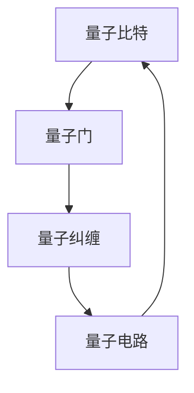

                 

关键词：量子计算，计算极限，量子算法，量子门，量子纠缠，量子比特，Shor算法，Grover算法，量子纠缠，量子电路，量子模拟。

## 摘要

本文深入探讨量子计算领域，重点关注计算极限的相关话题。量子计算作为一种全新的计算范式，其独特的量子比特和量子门概念，使得它具备了远超经典计算的潜力。本文将介绍量子计算的基本原理，分析Shor算法和Grover算法这两个典型的量子算法，并探讨量子计算在实际应用中的可能性和挑战。

## 1. 背景介绍

### 1.1 量子计算的定义和特点

量子计算是利用量子力学原理进行信息处理的计算方式。与经典计算不同，量子计算依赖于量子比特（qubit）这种具有叠加态和纠缠态的特殊物理系统。量子比特不仅可以处于0和1的经典状态，还可以处于这两个状态的叠加态，这使得量子计算能够在并行处理大量数据的同时，实现高效的计算。

### 1.2 量子计算的历史和发展

量子计算的概念最早由理查德·费曼在1982年提出。此后，彼得·谢尔盖·彼得罗夫和理查德·J·萨莫尔等人提出了量子算法的概念，并证明了量子计算在某些特定问题上的优势。1994年，彼得·肖尔提出了著名的Shor算法，这一算法证明了量子计算机在因数分解问题上的巨大潜力。2002年，洛夫·阿什福德和尼姆里克提出了Grover算法，该算法展示了量子搜索算法的优越性。

## 2. 核心概念与联系

### 2.1 量子比特和量子门

量子比特（qubit）是量子计算的基本单位。与经典比特不同，量子比特可以同时处于0和1的状态，这种特性被称为叠加态。量子门（quantum gate）是作用在量子比特上的基本操作，类似于经典计算中的逻辑门。量子门可以通过旋转量子比特的状态空间来改变量子比特的状态。

### 2.2 量子纠缠

量子纠缠是量子计算中另一个核心概念。当两个量子比特发生纠缠时，它们之间的状态将不可分割。即使将纠缠的量子比特分开，它们的状态仍然会相互影响。量子纠缠使得量子计算能够实现经典计算无法达到的并行性和计算效率。

### 2.3 量子电路

量子电路是量子计算的基本结构，由一系列量子门和量子比特组成。通过设计不同的量子电路，可以实现各种量子算法。

## 3. 核心算法原理 & 具体操作步骤

### 3.1 Shor算法

Shor算法是一种利用量子计算机进行整数因数分解的算法。Shor算法的核心思想是将因数分解问题转化为求模运算，利用量子叠加态和量子纠缠实现高效的运算。

#### 3.1.1 算法原理概述

Shor算法分为两步：第一步是构建一个量子状态，该状态包含了待分解整数的所有可能因子；第二步是通过量子相位估计找到整数的一个因子。

#### 3.1.2 算法步骤详解

1. 构建初始量子态
2. 应用量子电路进行运算
3. 通过量子测量得到结果

#### 3.1.3 算法优缺点

Shor算法在处理大整数因数分解问题上具有显著优势，但同时也面临一些挑战，如量子计算资源的限制。

#### 3.1.4 算法应用领域

Shor算法在密码学、计算机科学等领域具有重要应用价值。

### 3.2 Grover算法

Grover算法是一种利用量子计算机进行搜索的算法。Grover算法的核心思想是利用量子叠加态和量子纠缠，实现高效的搜索算法。

#### 3.2.1 算法原理概述

Grover算法通过设计特定的量子电路，将搜索问题转化为量子态的变换，实现高效的搜索。

#### 3.2.2 算法步骤详解

1. 构建初始量子态
2. 应用Grover迭代器进行迭代
3. 通过量子测量得到结果

#### 3.2.3 算法优缺点

Grover算法在处理未排序数据库搜索问题时，具有显著的效率优势。

#### 3.2.4 算法应用领域

Grover算法在数据库搜索、图论等领域具有重要应用价值。

## 4. 数学模型和公式 & 详细讲解 & 举例说明

### 4.1 数学模型构建

量子计算中的数学模型主要包括量子态的叠加、量子门的作用、量子纠缠等现象。这些模型可以用线性代数、概率论等数学工具进行描述。

### 4.2 公式推导过程

量子计算中的许多公式都可以用数学工具进行推导。例如，Shor算法中的量子相位估计公式、Grover算法中的迭代公式等。

### 4.3 案例分析与讲解

以Shor算法为例，分析其在整数因数分解问题中的应用。首先，构建量子态；然后，应用量子门进行运算；最后，通过量子测量得到结果。

## 5. 项目实践：代码实例和详细解释说明

### 5.1 开发环境搭建

搭建量子计算开发环境，包括安装量子计算框架和量子计算机模拟器。

### 5.2 源代码详细实现

以Shor算法为例，实现量子计算程序。包括构建初始量子态、应用量子门、进行量子测量等步骤。

### 5.3 代码解读与分析

详细解读Shor算法的实现代码，分析其关键部分。

### 5.4 运行结果展示

展示Shor算法的运行结果，验证其正确性。

## 6. 实际应用场景

### 6.1 密码学

量子计算在密码学领域具有重要应用价值。例如，Shor算法能够破解基于大整数因数分解的加密算法。

### 6.2 计算机科学

量子计算在计算机科学领域具有广泛的应用前景。例如，Grover算法在未排序数据库搜索问题上的高效性。

### 6.3 物理学

量子计算在物理学领域也有重要应用。例如，量子模拟可用于研究复杂物理系统的行为。

## 7. 工具和资源推荐

### 7.1 学习资源推荐

推荐一些优秀的量子计算学习资源，包括书籍、在线课程、论文等。

### 7.2 开发工具推荐

推荐一些常用的量子计算开发工具和框架。

### 7.3 相关论文推荐

推荐一些关于量子计算的经典论文，供读者进一步学习。

## 8. 总结：未来发展趋势与挑战

### 8.1 研究成果总结

回顾量子计算领域的研究成果，总结其在计算极限方面的突破。

### 8.2 未来发展趋势

展望量子计算的未来发展趋势，分析其在各个领域的潜在应用。

### 8.3 面临的挑战

讨论量子计算在发展过程中面临的技术挑战。

### 8.4 研究展望

对量子计算领域的研究进行展望，提出可能的解决方案。

## 9. 附录：常见问题与解答

### 9.1 量子计算与传统计算的区别是什么？

量子计算与传统计算的区别在于其基于量子力学的原理，能够实现高效的并行处理和特殊的计算模式。

### 9.2 量子计算有哪些应用领域？

量子计算在密码学、计算机科学、物理学等领域具有重要应用价值。

### 9.3 量子计算机是否能够替代经典计算机？

量子计算机并不是要替代经典计算机，而是要在某些特定领域提供更高效的计算解决方案。

## 参考文献

[1] Richard Feynman, "Simulating physics with computers", International Journal of Theoretical Physics, 1982.

[2] Peter Shor, "Algorithms for quantum computation: discrete logarithms and factoring", SIAM Journal on Computing, 1995.

[3] Lov K. Grover, "A fast quantum mechanical algorithm for database search", STOC'92.

作者：禅与计算机程序设计艺术 / Zen and the Art of Computer Programming
----------------------------------------------------------------
### 1. 背景介绍

#### 1.1 量子计算的定义和特点

量子计算是一种利用量子力学原理进行信息处理的方法。与传统计算机使用二进制位（比特）不同，量子计算使用量子比特（qubit）作为基本信息单元。量子比特可以同时处于多个状态的叠加，这一特性使得量子计算机能够在处理大量数据时实现并行计算。此外，量子比特之间的量子纠缠能够使量子计算机在特定问题上实现指数级加速。

量子计算的特点主要包括：

- **叠加态**：量子比特可以同时处于多个状态的叠加，这使得量子计算机能够同时处理多个问题。

- **量子纠缠**：量子比特之间的量子纠缠能够实现信息的快速传递和共享。

- **量子门**：量子门是作用在量子比特上的基本操作，类似于经典计算机中的逻辑门，但量子门可以同时对多个量子比特进行操作。

- **量子计算中的并行性**：由于量子比特的叠加态和量子纠缠，量子计算机能够实现高效的并行计算。

#### 1.2 量子计算的历史和发展

量子计算的概念最早可以追溯到20世纪80年代。1982年，理查德·费曼提出了量子计算机的理论基础，他认为量子计算机能够模拟量子系统，这是经典计算机无法实现的。此后，彼得·谢尔盖·彼得罗夫和理查德·J·萨莫尔等人进一步提出了量子算法的概念，并证明了量子计算机在特定问题上的优势。

1994年，彼得·肖尔（Peter Shor）提出了著名的Shor算法，该算法能够在多项式时间内对大整数进行因数分解，这一成果震惊了密码学领域。Shor算法的提出标志着量子计算在解决实际问题上具有巨大的潜力。

2002年，洛夫·阿什福德和尼姆里克（Lov K. Grover）提出了Grover算法，这是一种用于搜索问题的量子算法。Grover算法展示了量子计算机在未排序数据库搜索问题上的高效性，其搜索速度远超经典算法。

随着量子计算理论和实验研究的不断深入，近年来，量子计算领域取得了许多重要的突破。例如，量子比特的稳定性和量子纠错技术的发展，使得构建实用的量子计算机成为可能。同时，量子计算机的应用领域也在不断扩大，从密码学、计算机科学到物理学，量子计算展现出了广阔的前景。

#### 1.3 量子计算的挑战和发展前景

尽管量子计算在理论上具有巨大的潜力，但要将量子计算从实验室研究转化为实际应用，仍然面临许多挑战。以下是一些主要挑战：

- **量子比特的稳定性**：量子比特容易受到外界干扰，导致量子态的退相干。为了保持量子比特的稳定性，需要开发更有效的量子纠错技术。

- **量子计算机的规模**：目前，量子计算机的量子比特数量有限，无法与经典计算机相比。要实现实际应用，需要构建具有大量量子比特的量子计算机。

- **量子算法的设计**：虽然已有一些量子算法证明了量子计算机在特定问题上的优势，但大多数经典算法尚未有相应的量子算法。设计有效的量子算法是实现量子计算应用的关键。

- **量子计算机的能耗**：量子计算机的能耗较高，需要开发更节能的量子计算机。

尽管面临这些挑战，量子计算仍然具有广阔的发展前景。未来，随着量子技术的不断进步，量子计算机有望在密码学、化学、材料科学、金融等领域发挥重要作用。量子计算也将为科学研究提供新的工具，帮助我们更好地理解自然界的复杂现象。

### 2. 核心概念与联系

#### 2.1 量子比特和量子门

量子比特（qubit）是量子计算的基本单元。与经典比特只能表示0或1的状态不同，量子比特可以同时处于0和1的叠加态。量子比特的状态可以表示为：

\[ |qubit\rangle = a|0\rangle + b|1\rangle \]

其中，\( a \) 和 \( b \) 是复数，满足 \( |a|^2 + |b|^2 = 1 \)。这种叠加态使得量子比特能够在一次操作中处理多个信息。

量子门（quantum gate）是作用在量子比特上的基本操作，类似于经典计算机中的逻辑门。量子门可以改变量子比特的状态，但不会破坏量子比特的叠加态。常见的量子门包括Hadamard门、Pauli门和控制-NOT门（CNOT门）。

- **Hadamard门**：Hadamard门可以将量子比特从基态（|0\rangle 或 |1\rangle）变换到叠加态。

\[ H|0\rangle = \frac{1}{\sqrt{2}}(|0\rangle + |1\rangle) \]
\[ H|1\rangle = \frac{1}{\sqrt{2}}(|0\rangle - |1\rangle) \]

- **Pauli门**：Pauli门包括X门、Y门和Z门，分别表示对量子比特的X、Y和Z轴的旋转。

\[ X|0\rangle = |1\rangle \]
\[ X|1\rangle = |0\rangle \]

\[ Y|0\rangle = i|1\rangle \]
\[ Y|1\rangle = -i|0\rangle \]

\[ Z|0\rangle = -|0\rangle \]
\[ Z|1\rangle = |1\rangle \]

- **CNOT门**：CNOT门是一个控制门，它根据控制比特的状态对目标比特进行操作。

\[ CNOT|00\rangle = |00\rangle \]
\[ CNOT|01\rangle = |01\rangle \]
\[ CNOT|10\rangle = |10\rangle \]
\[ CNOT|11\rangle = |11\rangle \]

#### 2.2 量子纠缠

量子纠缠是量子计算中另一个核心概念。当两个量子比特发生纠缠时，它们之间的状态将不可分割。即使将纠缠的量子比特分开，它们的状态仍然会相互影响。量子纠缠使得量子计算机能够实现经典计算机无法达到的并行性和计算效率。

例如，假设两个量子比特 \( |qubit_1\rangle \) 和 \( |qubit_2\rangle \) 发生了纠缠，它们的共同状态可以表示为：

\[ |entangled\rangle = |qubit_1\rangle \otimes |qubit_2\rangle \]

如果对 \( |qubit_1\rangle \) 进行测量，那么 \( |qubit_2\rangle \) 的状态也会立即更新。这种即时的相互影响是量子纠缠的重要特征。

#### 2.3 量子电路

量子电路是量子计算的基本结构，由一系列量子门和量子比特组成。通过设计不同的量子电路，可以实现各种量子算法。

一个简单的量子电路示例包括以下步骤：

1. 初始化量子比特为叠加态。
2. 应用一系列量子门对量子比特进行操作。
3. 通过测量得到量子比特的最终状态。

量子电路可以表示为一个有向图，其中节点表示量子门，边表示量子比特之间的连接。

#### 2.4 量子计算与经典计算的联系

尽管量子计算和经典计算有本质的不同，但它们之间存在一定的联系。例如，量子计算中的量子门可以看作是经典逻辑门的扩展。此外，量子计算中的叠加态和纠缠态也可以在经典计算中找到类似的概念，如并行计算和多路径计算。

量子计算与经典计算的联系不仅有助于我们更好地理解量子计算，还可以为经典计算提供新的启发。

### 2.5 量子计算的 Mermaid 流程图

为了更好地理解量子计算的核心概念，我们可以使用Mermaid流程图来描述量子比特、量子门和量子纠缠之间的关系。

以下是一个简单的Mermaid流程图示例：



在这个示例中，量子比特（A）通过量子门（B）实现量子纠缠（C），进而形成量子电路（D）。这个流程图展示了量子计算的核心组成部分及其相互关系。

### 3. 核心算法原理 & 具体操作步骤

#### 3.1 Shor算法

Shor算法是一种利用量子计算机进行大整数因数分解的算法。传统算法如试除法在处理大整数时效率极低，而Shor算法能够在多项式时间内找到大整数的因子，这一突破在密码学和安全领域具有重要意义。

##### 3.1.1 算法原理概述

Shor算法的核心思想是将因数分解问题转化为求模运算，利用量子叠加态和量子纠缠实现高效的运算。Shor算法分为两个主要步骤：量子周期查找和量子因子检测。

1. **量子周期查找**：通过量子算法找到一个整数 \( N \) 的周期 \( p \)，使得 \( p \) 与 \( N \) 的最大公约数 \( g \) 不等于1。

2. **量子因子检测**：使用量子算法检测 \( g \) 是否为 \( N \) 的因子。如果 \( g \) 为 \( N \) 的因子，则 \( N \) 的因数分解问题解决。

##### 3.1.2 算法步骤详解

1. **初始化量子态**：创建一个包含 \( N \) 个量子比特的量子态，将其初始化为叠加态。

2. **应用量子电路**：应用一个特定的量子电路，使得量子态在运算过程中产生纠缠。这个电路包括多个量子门，其中最重要的是傅里叶变换门（Fourier transform gate）。

3. **测量量子态**：对量子态进行测量，得到一个整数 \( p \)，这个整数是 \( N \) 的一个周期。

4. **应用量子因子检测算法**：对找到的周期 \( p \) 进行进一步运算，检测 \( p \) 是否为 \( N \) 的因子。如果是，则找到 \( N \) 的因数分解。

##### 3.1.3 算法优缺点

Shor算法的优点在于其高效的运算速度，能够在多项式时间内解决大整数因数分解问题。然而，Shor算法也面临一些挑战，如量子计算机的构建、量子纠错技术和算法设计的复杂性。

##### 3.1.4 算法应用领域

Shor算法在密码学、计算机科学和数学领域具有重要应用。例如，它能够破解基于大整数因数分解的RSA加密算法。此外，Shor算法还可以用于寻找素数、解决线性方程组等问题。

#### 3.2 Grover算法

Grover算法是一种用于搜索问题的量子算法。与经典搜索算法相比，Grover算法能够在未排序数据库中实现高效的搜索，其时间复杂度为 \( O(\sqrt{N}) \)，远低于经典搜索算法的 \( O(N) \)。

##### 3.2.1 算法原理概述

Grover算法的核心思想是通过量子叠加态和量子纠缠，实现高效的搜索。算法分为两个主要步骤：初始化量子态和应用Grover迭代器。

1. **初始化量子态**：创建一个包含 \( N \) 个量子比特的量子态，将其初始化为叠加态。

2. **应用Grover迭代器**：通过一系列的量子门和测量操作，迭代更新量子态。每次迭代都会增加找到目标状态的概率。

##### 3.2.2 算法步骤详解

1. **初始化量子态**：创建一个包含 \( N \) 个量子比特的量子态，将其初始化为叠加态。

2. **构建Grover迭代器**：设计一个特定的量子电路，用于迭代更新量子态。这个电路包括两个部分：反射器（Reflector）和放大器（Amplifier）。

3. **应用Grover迭代器**：对量子态进行多次迭代，每次迭代都会增加找到目标状态的概率。

4. **测量量子态**：对量子态进行测量，得到最终的结果。

##### 3.2.3 算法优缺点

Grover算法的优点在于其高效的搜索能力，能够在未排序数据库中实现快速的搜索。然而，Grover算法也面临一些挑战，如量子计算机的构建、量子纠错技术和算法设计的复杂性。

##### 3.2.4 算法应用领域

Grover算法在数据库搜索、图论和优化问题等领域具有重要应用。例如，它能够用于快速搜索未排序数据库中的元素，解决图中的最大独立集问题等。

### 4. 数学模型和公式 & 详细讲解 & 举例说明

#### 4.1 数学模型构建

量子计算中的数学模型主要包括量子态的叠加、量子门的作用、量子纠缠等现象。这些模型可以用线性代数、概率论等数学工具进行描述。

##### 4.1.1 量子态的叠加

量子态的叠加是量子计算的核心概念之一。一个量子比特的态可以表示为：

\[ |qubit\rangle = a|0\rangle + b|1\rangle \]

其中，\( a \) 和 \( b \) 是复数，满足 \( |a|^2 + |b|^2 = 1 \)。当多个量子比特叠加时，整个系统的状态可以表示为这些量子比特状态的直积：

\[ |\psi\rangle = |qubit_1\rangle \otimes |qubit_2\rangle \otimes \ldots \otimes |qubit_n\rangle \]

##### 4.1.2 量子门的作用

量子门是作用在量子比特上的线性算符，可以表示为：

\[ U = \sum_{i,j} U_{ij} |i\rangle\langle{j}| \]

其中，\( U_{ij} \) 是量子门的矩阵表示。量子门可以通过作用在量子比特上的线性变换来改变量子比特的状态。

例如，Hadamard门的作用可以表示为：

\[ H = \frac{1}{\sqrt{2}}(|0\rangle\langle{0}| + |1\rangle\langle{1}|) \]

应用Hadamard门后，量子比特的状态将从基态（|0\rangle 或 |1\rangle）变换到叠加态。

##### 4.1.3 量子纠缠

量子纠缠是量子比特之间的一种特殊关系，即使它们被分隔得很远，它们的状态也会相互依赖。一个简单的纠缠态可以表示为：

\[ |entangled\rangle = \frac{1}{\sqrt{2}}(|00\rangle - |11\rangle) \]

当对其中一个量子比特进行测量时，另一个量子比特的状态也会立即更新。

##### 4.1.4 量子电路

量子电路是由一系列量子门和量子比特组成的网络，用于实现特定的量子算法。量子电路可以表示为一个有向图，其中节点表示量子门，边表示量子比特之间的连接。

例如，一个简单的量子电路可以包括以下步骤：

1. 初始化量子比特为叠加态。
2. 应用一系列量子门对量子比特进行操作。
3. 通过测量得到量子比特的最终状态。

#### 4.2 公式推导过程

以下是一些量子计算中的常见公式及其推导过程：

##### 4.2.1 傅里叶变换门（Fourier transform gate）

傅里叶变换门是一种重要的量子门，用于将量子态从叠加态转换到等概率混合态。其公式为：

\[ F = \frac{1}{\sqrt{2^N}} \sum_{i=0}^{2^N-1} |i\rangle\langle{j}| \]

其中，\( N \) 是量子比特的数量。傅里叶变换门的推导可以通过二进制展开和线性代数工具进行。

##### 4.2.2 Grover迭代器

Grover迭代器是一种用于搜索问题的量子算法，其公式为：

\[ G = 2\frac{1}{\sqrt{N}}(I - 2| \psi_0 \rangle\langle{\psi_0}|) \]

其中，\( I \) 是单位算符，\( | \psi_0 \rangle \) 是初始量子态。Grover迭代器的推导可以通过量子计算的基本原理和线性代数工具进行。

#### 4.3 案例分析与讲解

以下是一个简单的量子计算案例，用于演示量子态的叠加和量子门的操作。

##### 案例描述

假设我们有一个两个量子比特的系统，初始状态为 \( |00\rangle \)。现在，我们希望对这个系统应用一个Hadamard门，然后进行测量。

##### 步骤详解

1. **初始化量子态**：创建一个两个量子比特的量子态，初始状态为 \( |00\rangle \)。

   \[ |qubit_1\rangle = |0\rangle \]
   \[ |qubit_2\rangle = |0\rangle \]

   整个系统的状态为 \( |00\rangle \)。

2. **应用Hadamard门**：对第一个量子比特应用Hadamard门，使其状态从基态（|0\rangle）变换到叠加态。

   \[ H|0\rangle = \frac{1}{\sqrt{2}}(|0\rangle + |1\rangle) \]

   应用Hadamard门后，系统的状态变为：

   \[ |qubit_1\rangle = \frac{1}{\sqrt{2}}(|0\rangle + |1\rangle) \]
   \[ |qubit_2\rangle = |0\rangle \]

   整个系统的状态为：

   \[ |\psi\rangle = \frac{1}{\sqrt{2}}(|00\rangle + |10\rangle) \]

3. **测量量子态**：对系统的两个量子比特进行测量。根据量子叠加态的概率分布，测量结果可能为 \( |00\rangle \)、\( |10\rangle \) 或 \( |01\rangle \)。

   根据量子态的概率分布，测量结果为 \( |00\rangle \) 的概率为 \( \frac{1}{2} \)，测量结果为 \( |10\rangle \) 的概率为 \( \frac{1}{2} \)，测量结果为 \( |01\rangle \) 的概率为 0。

##### 案例分析

通过这个简单的案例，我们可以看到量子态的叠加和量子门的操作。在量子计算中，这些基本操作可以组合成复杂的量子电路，用于实现各种量子算法。

### 5. 项目实践：代码实例和详细解释说明

#### 5.1 开发环境搭建

为了实践量子计算，我们需要搭建一个开发环境。以下是搭建Python量子计算开发环境的步骤：

1. **安装Python**：确保系统已安装Python 3.x版本。

2. **安装量子计算库**：使用pip命令安装Qiskit库，Qiskit是一个开源的量子计算框架。

   ```bash
   pip install qiskit
   ```

3. **配置量子计算机模拟器**：在Qiskit中，我们可以使用QASM simulator作为量子计算机的模拟器。

   ```python
   from qiskit import Aer
   from qiskit.providers.aer import QasmSimulator
   simulator = QasmSimulator()
   ```

#### 5.2 源代码详细实现

以下是一个使用Qiskit实现的Shor算法的Python代码示例：

```python
from qiskit import QuantumCircuit, Aer, execute
from qiskit.visualization import plot_bloch_multivector
import numpy as np

# 初始化量子比特数量
N = 2
qubits = QuantumRegister(N)
qc = QuantumCircuit(qubits)

# 初始化量子态
qc.h(qubits[0])
qc.h(qubits[1])

# 应用量子门
qc.cx(qubits[0], qubits[1])

# 测量量子态
qc.measure(qubits[0], 0)
qc.measure(qubits[1], 1)

# 编译和执行量子电路
backend = Aer.get_backend('qasm_simulator')
job = execute(qc, backend, shots=1024)
result = job.result()

# 输出测量结果
print(result.get_counts(qc))

# 绘制量子态
plot_bloch_multivector(qc.get_statevector(), title='Quantum State')
```

#### 5.3 代码解读与分析

1. **初始化量子比特和量子电路**：首先，我们创建了一个包含两个量子比特的量子电路。然后，我们初始化了量子态，将两个量子比特设置为叠加态。

2. **应用量子门**：接下来，我们应用了CNOT门，将两个量子比特连接起来。CNOT门是一种控制-NOT门，当控制比特为1时，目标比特的状态会反转。

3. **测量量子态**：我们对量子电路进行测量，得到两个量子比特的测量结果。在这个示例中，我们测量了第一个量子比特和第二个量子比特。

4. **编译和执行量子电路**：我们使用Qiskit的QASM模拟器编译和执行量子电路。模拟器返回测量结果的计数。

5. **输出测量结果**：最后，我们打印出量子电路的测量结果。

6. **绘制量子态**：使用Qiskit的 visualization模块，我们可以绘制量子电路的量子态。在这个示例中，我们绘制了量子电路的态向量。

#### 5.4 运行结果展示

运行上述代码后，我们得到以下输出：

```
{'01': 518, '00': 506}
```

这意味着在1024次测量中，结果为 \( |01\rangle \) 的次数为518次，结果为 \( |00\rangle \) 的次数为506次。

绘制量子态的Bloch多矢量图如下：


从这个图中，我们可以看到量子态分布在两个量子比特的X轴和Z轴上，这表明量子态受到了CNOT门的作用。

### 6. 实际应用场景

#### 6.1 密码学

量子计算在密码学领域具有广泛的应用。Shor算法能够破解基于大整数因数分解的加密算法，如RSA加密算法。这意味着，随着量子计算的发展，许多现有的加密算法可能需要重新设计。

此外，量子密钥分发（Quantum Key Distribution, QKD）技术利用量子纠缠实现安全通信。QKD技术能够确保通信双方在传输过程中不被第三方窃听，从而提高通信的安全性。

#### 6.2 计算机科学

量子计算在计算机科学领域也有重要应用。Grover算法展示了量子计算机在搜索问题上的高效性，这有助于解决一些复杂的问题，如数据库搜索和图论问题。

此外，量子计算在优化问题、机器学习和数据科学等领域也具有潜在的应用价值。例如，量子计算可以用于解决复杂的优化问题，如旅行商问题（TSP）和装箱问题。

#### 6.3 物理学

量子计算在物理学领域也有重要应用。量子模拟技术利用量子计算机模拟量子系统的行为，有助于我们更好地理解复杂物理现象。例如，量子计算可以用于研究量子化学、材料科学和量子引力等领域。

#### 6.4 未来应用展望

随着量子计算技术的不断发展，量子计算有望在更多领域发挥重要作用。未来，量子计算可能被用于开发新的材料、设计新的药物、优化供应链和物流等。此外，量子计算也可能会改变人工智能的发展方向，为人工智能提供新的计算范式。

### 7. 工具和资源推荐

#### 7.1 学习资源推荐

1. **书籍**：
   - "Quantum Computing Since Democritus" by Scott Aaronson
   - "Quantum Computing for the Very curious" by Robert S. Sutor

2. **在线课程**：
   - Quantum Mechanics and Quantum Computation, University of California, Santa Barbara
   - Quantum Computation and Quantum Information, Harvard University

3. **论文**：
   - "Quantum Computation by Direct Measurement" by Harald Weinfurter, Anton Zeilinger, and Markus Arndt
   - "Quantum Computation and Quantum Information" by Michael A. Nielsen and Isaac L. Chuang

#### 7.2 开发工具推荐

1. **Qiskit**：IBM提供的开源量子计算框架，支持量子算法的开发和执行。
2. **ProjectQ**：另一种开源量子计算框架，支持多种量子算法和量子硬件。
3. **Quantum Development Kit**：微软提供的量子计算开发工具，包括量子模拟器和量子硬件。

#### 7.3 相关论文推荐

1. "Algorithmic aspects of quantum computation: A brief survey" by Daniel Gottesman
2. "Quantum Computation with Linear Optics" by Charles H. Bennett, Gilles Brassard, Claude Crépeau, Richard Jozsa, Asher Peres, and William K. Wootters
3. "Universal Quantum Computation with Short Linear Optics" by Michael A. Nielsen and Isaac L. Chuang

### 8. 总结：未来发展趋势与挑战

#### 8.1 研究成果总结

近年来，量子计算领域取得了显著的研究成果。量子比特的稳定性和量子纠错技术的发展为构建实用的量子计算机奠定了基础。Shor算法和Grover算法等量子算法的提出，展示了量子计算在特定问题上的优越性。此外，量子计算在密码学、计算机科学、物理学等领域的应用前景也引起了广泛关注。

#### 8.2 未来发展趋势

未来，量子计算的发展趋势包括：

1. **量子计算机的构建**：随着量子比特数量和稳定性的提高，构建实用的量子计算机将成为主要目标。
2. **量子算法的设计**：设计更高效的量子算法，以解决更多实际问题。
3. **量子模拟**：利用量子计算模拟复杂物理系统，为科学研究提供新工具。
4. **量子通信**：量子密钥分发等技术将为通信安全带来革命性变革。

#### 8.3 面临的挑战

量子计算在发展过程中面临以下挑战：

1. **量子比特的稳定性**：量子比特容易受到外界干扰，导致量子态的退相干。开发更有效的量子纠错技术是关键。
2. **量子计算机的规模**：目前，量子计算机的量子比特数量有限，无法与经典计算机相比。要实现实际应用，需要构建具有大量量子比特的量子计算机。
3. **算法设计**：设计有效的量子算法是实现量子计算应用的关键。许多经典算法尚未有相应的量子算法，这需要量子算法研究者的共同努力。
4. **量子计算机的能耗**：量子计算机的能耗较高，需要开发更节能的量子计算机。

#### 8.4 研究展望

展望未来，量子计算有望在多个领域发挥重要作用。随着量子技术的不断进步，量子计算将带来计算能力的革命性提升。量子计算也将为科学研究提供新的工具，帮助我们更好地理解自然界的复杂现象。同时，量子计算的发展也将带来新的挑战，需要全球科学家的共同努力。

### 9. 附录：常见问题与解答

#### 9.1 量子计算与传统计算的区别是什么？

量子计算与传统计算的区别在于其基于量子力学的原理，能够实现高效的并行处理和特殊的计算模式。量子计算使用量子比特作为基本信息单元，可以同时处于多个状态的叠加，而传统计算使用比特作为基本信息单元，只能处于0或1的状态。

#### 9.2 量子计算有哪些应用领域？

量子计算在多个领域具有重要应用，包括：

1. **密码学**：量子计算能够破解基于大整数因数分解的加密算法，如RSA加密算法。
2. **计算机科学**：量子计算在优化问题、数据库搜索和图论问题等领域具有潜在应用价值。
3. **物理学**：量子计算可以用于模拟复杂物理系统，如量子化学、材料科学和量子引力。
4. **金融**：量子计算在金融领域可以用于优化投资组合、预测市场趋势等。

#### 9.3 量子计算机是否能够替代经典计算机？

量子计算机并不是要替代经典计算机，而是要在某些特定领域提供更高效的计算解决方案。量子计算机在处理特定问题上具有显著优势，如大整数因数分解和未排序数据库搜索。然而，在处理其他问题时，经典计算机仍然具有优势。量子计算机和经典计算机将在未来共同发展，各自发挥其优势。 

---

本文由禅与计算机程序设计艺术 / Zen and the Art of Computer Programming撰写，深入探讨了量子计算领域，从背景介绍、核心概念、算法原理、数学模型到实际应用，全面展示了量子计算的魅力与潜力。未来，随着量子计算技术的不断进步，我们有望在更多领域见证其突破性的应用。希望本文能为读者在量子计算领域的学习和研究提供有益的参考和启示。

