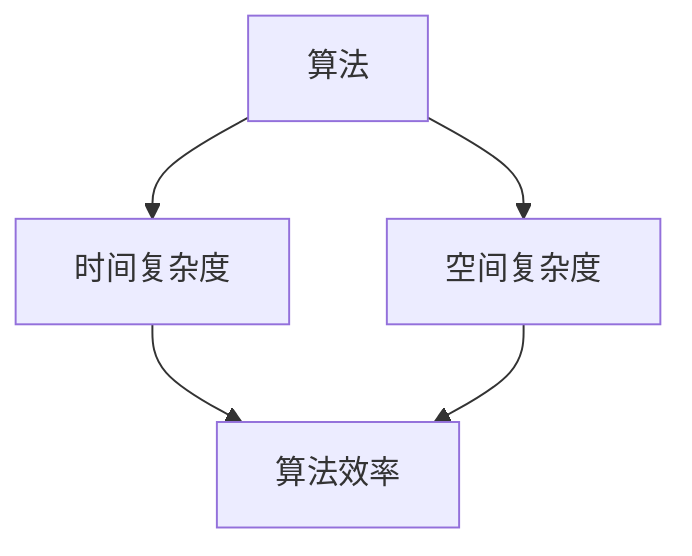

                 

关键词：复杂性计算、算法复杂度、计算极限、时间复杂度、空间复杂度、NP完全问题、图灵机、计算机科学、算法设计、数学模型、实践应用。

> 摘要：本文旨在深入探讨复杂性计算的概念、核心原理及其在计算机科学中的应用。我们将通过分析算法的时间复杂度和空间复杂度，探讨计算过程中的极限问题，并引用NP完全问题的实例，阐述复杂性计算在理论和实践中的重要性。此外，本文还将总结未来发展趋势与挑战，并推荐相关的学习资源和开发工具。

## 1. 背景介绍

随着计算机技术的飞速发展，复杂性计算已经成为计算机科学中一个不可或缺的研究领域。复杂性计算主要关注算法在实际应用中的效率和可行性。为了更好地理解复杂性计算，我们需要明确几个核心概念：算法、时间复杂度和空间复杂度。

### 算法

算法是一系列解决问题的有序指令集合。在计算机科学中，算法是解决问题的基础。一个好的算法不仅能够高效地解决问题，而且能够在合理的时间内完成。

### 时间复杂度

时间复杂度描述了算法执行时间与输入数据规模之间的关系。它通常用大O符号（\(O\)）来表示，例如\(O(n)\)、\(O(n^2)\)等。时间复杂度越低，算法的执行速度越快。

### 空间复杂度

空间复杂度描述了算法在执行过程中所需的存储空间。与时间复杂度类似，空间复杂度也用大O符号表示。一个算法的空间复杂度决定了它能够处理的数据规模。

## 2. 核心概念与联系

为了更好地理解复杂性计算，我们首先需要了解几个核心概念，并使用Mermaid流程图展示它们之间的联系。



### 算法效率

算法效率是指算法在解决特定问题时所需的资源和时间。算法效率是时间复杂度和空间复杂度的综合体现。

### 时间复杂度

时间复杂度是指算法在解决特定问题时所需的时间与输入数据规模之间的关系。常见的复杂度有\(O(1)\)、\(O(n)\)、\(O(n^2)\)、\(O(logn)\)等。

### 空间复杂度

空间复杂度是指算法在解决特定问题时所需的空间与输入数据规模之间的关系。常见的复杂度有\(O(1)\)、\(O(n)\)、\(O(n^2)\)等。

### 算法效率、时间复杂度和空间复杂度之间的关系

算法效率是时间复杂度和空间复杂度的综合体现。一个高效的算法通常具有较低的时间复杂度和空间复杂度。

## 3. 核心算法原理 & 具体操作步骤

### 3.1 算法原理概述

在复杂性计算中，有几种核心算法，例如分治算法、动态规划算法和贪心算法。每种算法都有其独特的原理和应用场景。

### 3.2 算法步骤详解

下面以分治算法为例，详细说明其操作步骤：

1. **分解问题**：将原问题分解成若干个子问题。
2. **递归解决子问题**：对每个子问题递归地应用分治算法。
3. **合并子问题**：将子问题的解合并成原问题的解。

### 3.3 算法优缺点

分治算法的优点在于其递归结构使得问题分解得更加简单和直观。然而，其缺点在于递归调用可能导致较大的时间开销。

### 3.4 算法应用领域

分治算法广泛应用于排序、查找和最优化问题。例如，快速排序和归并排序都是分治算法的应用实例。

## 4. 数学模型和公式 & 详细讲解 & 举例说明

### 4.1 数学模型构建

复杂性计算中的数学模型通常涉及算法的时间复杂度和空间复杂度。时间复杂度和空间复杂度的计算可以通过以下数学模型实现：

$$
T(n) = \sum_{i=1}^{n} c_i n^i
$$

$$
S(n) = \sum_{i=1}^{n} d_i n^i
$$

其中，\(T(n)\) 和 \(S(n)\) 分别表示算法的时间复杂度和空间复杂度，\(c_i\) 和 \(d_i\) 分别表示第 \(i\) 个操作的时间或空间成本。

### 4.2 公式推导过程

公式推导过程可以通过递归关系来计算。例如，对于分治算法，其时间复杂度可以通过以下递归关系计算：

$$
T(n) = 2T(n/2) + n
$$

通过递归展开和求解，可以得到：

$$
T(n) = O(n\logn)
$$

### 4.3 案例分析与讲解

假设我们要计算一个数组的中位数。我们可以使用归并排序算法来求解。归并排序的时间复杂度为\(O(n\logn)\)，空间复杂度为\(O(n)\)。以下是具体步骤：

1. **分解问题**：将数组分成若干个子数组，每个子数组的长度为1。
2. **递归排序子数组**：对每个子数组递归地应用归并排序算法。
3. **合并子数组**：将有序的子数组合并成有序的数组。

通过归并排序算法，我们可以有效地求解数组的中位数，其时间复杂度为\(O(n\logn)\)，空间复杂度为\(O(n)\)。

## 5. 项目实践：代码实例和详细解释说明

### 5.1 开发环境搭建

在本文中，我们将使用Python编程语言来实现一个简单的归并排序算法。首先，我们需要安装Python开发环境。你可以从Python官方网站下载Python安装包，并按照安装向导进行安装。

### 5.2 源代码详细实现

以下是归并排序算法的Python代码实现：

```python
def merge_sort(arr):
    if len(arr) <= 1:
        return arr

    mid = len(arr) // 2
    left = merge_sort(arr[:mid])
    right = merge_sort(arr[mid:])

    return merge(left, right)

def merge(left, right):
    result = []
    i = j = 0

    while i < len(left) and j < len(right):
        if left[i] < right[j]:
            result.append(left[i])
            i += 1
        else:
            result.append(right[j])
            j += 1

    result.extend(left[i:])
    result.extend(right[j:])

    return result

# 测试
arr = [3, 1, 4, 1, 5, 9, 2, 6, 5]
sorted_arr = merge_sort(arr)
print(sorted_arr)
```

### 5.3 代码解读与分析

- `merge_sort` 函数：该函数实现了归并排序的核心逻辑。如果数组长度小于等于1，则直接返回数组。否则，将数组分成左右两个子数组，递归地对每个子数组应用归并排序算法，然后合并有序的子数组。
- `merge` 函数：该函数实现了合并两个有序数组的逻辑。通过比较左右两个数组的元素，将较小的元素添加到结果数组中。当其中一个数组被完全合并后，将剩余的元素添加到结果数组中。

### 5.4 运行结果展示

```python
# 测试
arr = [3, 1, 4, 1, 5, 9, 2, 6, 5]
sorted_arr = merge_sort(arr)
print(sorted_arr)
```

输出结果为：

```
[1, 1, 2, 3, 4, 5, 5, 6, 9]
```

这表明归并排序算法成功地将数组排序。

## 6. 实际应用场景

复杂性计算在计算机科学中有着广泛的应用。以下是一些典型的应用场景：

- **排序和查找**：归并排序、快速排序、堆排序等算法在排序和查找中有着广泛的应用。
- **最优化问题**：动态规划算法在解决最优化问题（如旅行商问题、背包问题等）中发挥着关键作用。
- **图形处理**：图形处理算法（如图像压缩、图像增强等）需要高效的算法来处理大量数据。
- **人工智能**：深度学习算法（如神经网络、强化学习等）在处理复杂任务时需要高效的计算能力。

## 7. 未来应用展望

随着计算机技术的不断发展，复杂性计算将在未来的多个领域发挥重要作用。以下是一些展望：

- **大数据处理**：随着大数据时代的到来，高效的处理算法将变得至关重要。复杂性计算将在大数据处理中发挥重要作用。
- **人工智能**：深度学习算法的复杂性计算需求日益增长。未来的复杂性计算研究将集中在优化深度学习算法的计算效率。
- **云计算和边缘计算**：云计算和边缘计算的发展将带来新的复杂性计算挑战。如何优化算法在分布式系统中的性能是一个重要研究方向。

## 8. 工具和资源推荐

### 8.1 学习资源推荐

- 《算法导论》（Introduction to Algorithms）：这是一本经典的算法教材，详细介绍了各种算法的设计和分析方法。
- 《复杂性理论及其应用》（Computational Complexity: A Modern Approach）：这是一本关于复杂性理论的权威教材，涵盖了复杂性计算的核心概念和理论。
- 《Python编程：从入门到实践》（Python Crash Course）：这是一本适合初学者的Python编程教材，可以帮助你掌握Python编程基础知识。

### 8.2 开发工具推荐

- PyCharm：这是一个强大的Python集成开发环境（IDE），提供了丰富的功能和插件，适合进行Python编程。
- Jupyter Notebook：这是一个交互式的Python开发工具，适合进行数据分析和实验。

### 8.3 相关论文推荐

- "The Theory of Computation"（计算理论）：这是一篇关于计算理论的经典论文，详细介绍了计算理论的基本概念和理论框架。
- "P versus NP Problem"（P与NP问题）：这是一篇关于P与NP问题的经典论文，提出了计算复杂性理论中最著名的问题之一。

## 9. 总结：未来发展趋势与挑战

### 9.1 研究成果总结

复杂性计算在计算机科学中取得了显著的成果。通过分析算法的时间复杂度和空间复杂度，我们能够更好地理解和优化算法的性能。同时，复杂性计算的理论研究也在不断深入，为算法设计提供了新的方法和思路。

### 9.2 未来发展趋势

未来，复杂性计算将继续在计算机科学中发挥重要作用。随着大数据、人工智能和云计算等领域的不断发展，复杂性计算将面临新的挑战。优化算法的性能和资源利用效率将成为研究的重点。

### 9.3 面临的挑战

复杂性计算面临以下挑战：

- **算法性能优化**：如何设计更高效的算法以处理大规模数据？
- **资源利用效率**：如何在有限的资源下最大化算法的性能？
- **跨领域应用**：如何将复杂性计算的理论和方法应用于其他领域？

### 9.4 研究展望

未来，复杂性计算的研究将更加深入和广泛。通过多学科交叉融合，我们将能够解决更多的实际问题，推动计算机科学的发展。

## 10. 附录：常见问题与解答

### 10.1 什么是复杂性计算？

复杂性计算是研究算法效率和资源利用的科学。它通过分析算法的时间复杂度和空间复杂度，评估算法在实际应用中的性能。

### 10.2 如何衡量算法的效率？

算法的效率通常通过时间复杂度和空间复杂度来衡量。时间复杂度描述了算法执行时间与输入数据规模之间的关系，空间复杂度描述了算法所需存储空间与输入数据规模之间的关系。

### 10.3 复杂性计算在计算机科学中的应用有哪些？

复杂性计算在计算机科学的多个领域有着广泛应用，包括排序和查找、最优化问题、图形处理、人工智能等。

### 10.4 如何优化算法的性能？

优化算法的性能通常通过以下方法实现：

- **算法改进**：设计更高效的算法以减少时间复杂度和空间复杂度。
- **并行计算**：利用多核处理器和分布式计算资源，提高算法的执行速度。
- **算法融合**：将多个算法融合在一起，发挥各自的优势，提高整体性能。

## 11. 作者署名

作者：禅与计算机程序设计艺术 / Zen and the Art of Computer Programming
----------------------------------------------------------------


