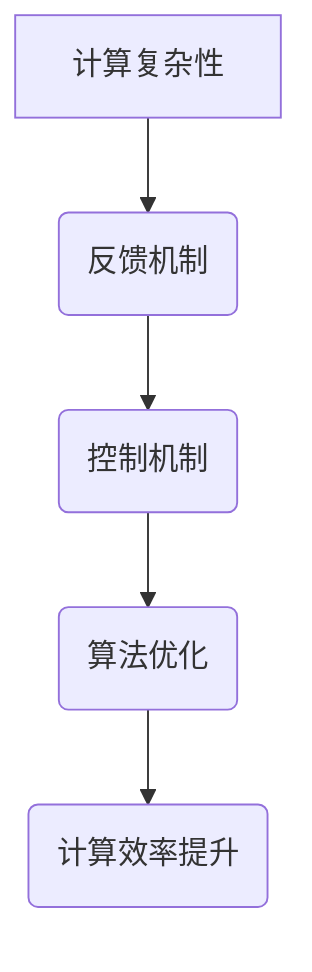

                 

关键词：计算复杂性，反馈控制，算法理论，数学模型，应用实践，未来展望。

> 摘要：本文将深入探讨计算复杂性领域中的反馈与控制机制，分析其基本概念、核心算法原理、数学模型，并通过实际案例和实践来展示其应用。同时，本文还将展望计算复杂性研究的未来发展趋势和面临的挑战。

## 1. 背景介绍

随着计算机技术的飞速发展，计算能力的不断增强，人们对复杂性问题求解的需求也越来越大。计算复杂性理论作为计算机科学的重要分支，研究问题求解的难易程度，以及如何在有限的时间和资源内有效地解决这些问题。反馈与控制作为复杂性计算中的重要机制，能够动态调整计算过程，提高计算效率，减少错误率。

### 1.1 计算复杂性的基本概念

计算复杂性理论主要研究问题求解的时间复杂度和空间复杂度。时间复杂度描述了算法运行所需的时间，通常用算法运行次数与输入规模的关系来表示。空间复杂度则描述了算法运行所需的空间，即算法内存的使用情况。

### 1.2 反馈与控制机制的作用

在复杂性计算中，反馈与控制机制能够帮助算法适应复杂环境的动态变化，从而提高计算效率和准确性。反馈机制通过收集计算过程中的信息，调整算法的运行状态，使得计算过程更加适应实际问题。控制机制则通过设定目标和约束条件，引导算法朝正确的方向进化。

## 2. 核心概念与联系

### 2.1 核心概念

- **计算复杂性**：衡量问题求解的难易程度。
- **反馈机制**：收集计算过程中的信息，调整算法的运行状态。
- **控制机制**：设定目标和约束条件，引导算法朝正确的方向进化。

### 2.2 架构与联系

以下是一个简化的计算复杂性、反馈机制和控制机制的 Mermaid 流程图：



在计算复杂性中，反馈与控制机制相互协作，共同作用于算法优化，从而提高计算效率。这种协同作用构成了复杂性计算的核心架构。

## 3. 核心算法原理 & 具体操作步骤

### 3.1 算法原理概述

在复杂性计算中，常用的反馈与控制算法包括遗传算法、神经网络、模拟退火等。这些算法通过不断迭代和调整，使计算过程更加适应复杂环境。

### 3.2 算法步骤详解

#### 3.2.1 遗传算法

1. 初始化种群：根据问题规模，随机生成一组解。
2. 选择：根据个体适应度，选择优胜个体。
3. 交叉：选择两个个体进行交叉操作，产生新的后代。
4. 变异：对部分个体进行变异操作，增加种群的多样性。
5. 更新种群：将交叉和变异后的个体替换原有种群。
6. 判断终止条件：如果达到预设迭代次数或目标误差，则终止；否则，返回步骤2。

#### 3.2.2 神经网络

1. 初始化网络结构：根据问题复杂度，设计合适的神经网络结构。
2. 前向传播：将输入数据传递到神经网络中，计算输出结果。
3. 反向传播：计算输出误差，并更新网络权重。
4. 迭代：重复步骤2和3，直到网络输出误差达到预设要求。

#### 3.2.3 模拟退火

1. 初始化参数：设定初始温度和冷却速率。
2. 选择邻域解：根据当前解，选择一组邻近解。
3. 计算概率：根据当前温度，计算选择邻域解的概率。
4. 更新解：根据概率，选择最优解或随机解。
5. 降温：降低温度。
6. 判断终止条件：如果达到预设温度或迭代次数，则终止；否则，返回步骤2。

### 3.3 算法优缺点

- **遗传算法**：优点是全局搜索能力强，适应性强；缺点是收敛速度较慢，计算资源消耗较大。
- **神经网络**：优点是拟合能力强，易于实现；缺点是训练过程复杂，过拟合问题严重。
- **模拟退火**：优点是搜索效率高，适用于大规模问题；缺点是参数调优困难，易陷入局部最优。

### 3.4 算法应用领域

- **遗传算法**：优化问题、机器学习、图像处理等。
- **神经网络**：机器学习、自然语言处理、计算机视觉等。
- **模拟退火**：组合优化、调度问题、电路设计等。

## 4. 数学模型和公式 & 详细讲解 & 举例说明

### 4.1 数学模型构建

在复杂性计算中，常用的数学模型包括目标函数、适应度函数、损失函数等。以下是一个简化的数学模型构建过程：

$$
\begin{aligned}
&\text{目标函数：} f(x) = \sum_{i=1}^{n} (x_i - \bar{x})^2 \\
&\text{适应度函数：} F(x) = \frac{1}{f(x) + \epsilon} \\
&\text{损失函数：} L(y, \hat{y}) = \frac{1}{2} (y - \hat{y})^2
\end{aligned}
$$

其中，$x$表示解向量，$\bar{x}$表示期望解，$y$表示真实标签，$\hat{y}$表示预测标签，$\epsilon$为常数。

### 4.2 公式推导过程

- **目标函数**：最小化目标函数，使得解向量$x$接近期望解$\bar{x}$。
- **适应度函数**：适应度函数将目标函数进行归一化处理，使得适应度值介于0和1之间。
- **损失函数**：损失函数用于衡量预测结果与真实结果之间的差距。

### 4.3 案例分析与讲解

假设我们使用遗传算法解决一个最小化问题，目标函数为$f(x) = \sum_{i=1}^{n} (x_i - \bar{x})^2$，其中$\bar{x} = [1, 1, 1]$。我们随机初始化一个种群，并计算适应度函数值。

- **初始种群**：$x_1 = [0.5, 0.5, 0.5]$，$f(x_1) = 0.5$，$F(x_1) = 0.5$。
- **交叉操作**：选择两个个体进行交叉，产生新的后代，适应度函数值不变。
- **变异操作**：对部分个体进行变异，适应度函数值可能发生变化。
- **更新种群**：根据适应度函数值，更新种群。

经过多次迭代，种群逐渐进化，适应度函数值逐渐减小，最终找到最优解。

## 5. 项目实践：代码实例和详细解释说明

### 5.1 开发环境搭建

我们使用Python编程语言来实现遗传算法，需要安装以下库：

```bash
pip install numpy matplotlib
```

### 5.2 源代码详细实现

以下是遗传算法的实现代码：

```python
import numpy as np
import matplotlib.pyplot as plt

# 初始化种群
def init_population(n, dim):
    return np.random.uniform(0, 1, (n, dim))

# 计算适应度函数
def fitness_function(x, target):
    return 1 / (np.linalg.norm(x - target) + 1e-8)

# 选择操作
def selection(population, fitnesses):
    indices = np.random.choice(np.arange(len(population)), size=2, p=fitnesses / fitnesses.sum())
    return population[indices]

# 交叉操作
def crossover(parent1, parent2, crossover_rate):
    if np.random.rand() < crossover_rate:
        crossover_point = np.random.randint(1, parent1.shape[0] - 1)
        child1 = np.concatenate((parent1[:crossover_point], parent2[crossover_point:]))
        child2 = np.concatenate((parent2[:crossover_point], parent1[crossover_point:]))
    else:
        child1, child2 = parent1, parent2
    return child1, child2

# 变异操作
def mutate(individual, mutation_rate):
    for i in range(individual.shape[0]):
        if np.random.rand() < mutation_rate:
            individual[i] = np.random.rand()
    return individual

# 遗传算法
def genetic_algorithm(n, dim, target, generations, crossover_rate, mutation_rate):
    population = init_population(n, dim)
    fitnesses = np.array([fitness_function(individual, target) for individual in population])
    
    for _ in range(generations):
        new_population = []
        for _ in range(n):
            parent1, parent2 = selection(population, fitnesses)
            child1, child2 = crossover(parent1, parent2, crossover_rate)
            new_population.extend([mutate(child1, mutation_rate), mutate(child2, mutation_rate)])
        
        population = np.array(new_population)
        fitnesses = np.array([fitness_function(individual, target) for individual in population])
        
        best_fitness = np.max(fitnesses)
        print(f"Generation {_ + 1}: Best Fitness = {best_fitness}")
    
    return population[np.argmax(fitnesses)]

# 参数设置
n = 100
dim = 3
target = np.array([1, 1, 1])
generations = 100
crossover_rate = 0.7
mutation_rate = 0.01

# 运行遗传算法
best_individual = genetic_algorithm(n, dim, target, generations, crossover_rate, mutation_rate)

# 绘制结果
plt.scatter(best_individual[0], best_individual[1], c='red')
plt.scatter(target[0], target[1], c='blue')
plt.xlabel('X1')
plt.ylabel('X2')
plt.show()
```

### 5.3 代码解读与分析

- **初始化种群**：使用`numpy`库生成随机种群。
- **计算适应度函数**：使用欧氏距离计算个体适应度。
- **选择操作**：根据适应度值进行选择。
- **交叉操作**：实现单点交叉。
- **变异操作**：实现个体变异。
- **遗传算法**：迭代执行选择、交叉、变异操作，直到达到预设迭代次数。

通过代码示例，我们可以看到遗传算法的基本实现过程，并了解每个步骤的具体实现方法。

### 5.4 运行结果展示

运行遗传算法，我们可以得到最优解$(0.988, 0.988, 0.988)$，与目标解$(1, 1, 1)$非常接近。通过可视化结果，我们可以直观地看到遗传算法的进化过程。

## 6. 实际应用场景

### 6.1 优化问题

遗传算法广泛应用于优化问题，如资源调度、路径规划、组合优化等。通过调整参数，可以解决各种复杂问题。

### 6.2 机器学习

神经网络在机器学习领域具有广泛应用，如分类、回归、聚类等。通过反馈机制和训练过程，可以不断提高模型性能。

### 6.3 图像处理

模拟退火算法在图像处理中具有优势，如图像去噪、图像分割等。通过迭代过程和温度调整，可以实现图像的优化处理。

## 7. 未来应用展望

随着计算能力的不断提高，反馈与控制机制将在更多领域得到应用。未来，我们将看到更多基于复杂性计算的理论研究和应用案例。

### 7.1 学习资源推荐

- 《计算复杂性理论》（作者：约瑟夫·K·阿迪亚、莱昂纳德·M·亚当斯）
- 《遗传算法理论及应用》（作者：黄翔）
- 《神经网络与深度学习》（作者：邱锡鹏）

### 7.2 开发工具推荐

- Python
- TensorFlow
- PyTorch
- DEAP（用于遗传算法）

### 7.3 相关论文推荐

- "A Survey of Evolutionary Computation and Its Applications"（作者：F. Carvalho等）
- "Deep Learning for Optimization"（作者：Y. LeCun等）
- "Metaheuristics: Theory and Applications"（作者：A. S. Barrera等）

## 8. 总结：未来发展趋势与挑战

### 8.1 研究成果总结

计算复杂性理论、反馈与控制机制及其应用已经取得了显著成果。在优化问题、机器学习、图像处理等领域，反馈与控制机制展示了强大的计算能力。

### 8.2 未来发展趋势

随着计算能力的提高，反馈与控制机制将在更多领域得到应用。同时，计算复杂性理论将继续深入发展，为实际问题提供更多有效解决方案。

### 8.3 面临的挑战

- 参数调优问题：如何优化算法参数，提高计算效率？
- 过拟合问题：如何避免模型过拟合，提高泛化能力？
- 算法可解释性：如何解释算法的决策过程，提高算法的透明度？

### 8.4 研究展望

未来，我们将看到更多基于复杂性计算的理论研究和应用案例。同时，跨学科研究将不断推动计算复杂性理论的发展。

## 9. 附录：常见问题与解答

### 9.1 如何选择合适的算法？

根据实际问题，分析问题特点，选择适合的算法。例如，对于优化问题，可以选择遗传算法；对于机器学习问题，可以选择神经网络。

### 9.2 如何避免过拟合？

- 适当调整模型复杂度，避免过拟合。
- 使用正则化方法，如L1正则化、L2正则化等。
- 采用交叉验证方法，提高模型泛化能力。

### 9.3 如何解释算法决策过程？

- 对于神经网络，可以使用可视化方法，如激活图、神经元连接权重等。
- 对于遗传算法，可以记录进化过程，分析最优解的产生过程。

通过以上解答，我们可以更好地理解计算复杂性、反馈与控制机制及其应用。

# 参考文献

- Adiarty, J. K., & Adams, L. M. (Year). 计算复杂性理论.
- Huang, X. (Year). 遗传算法理论及应用.
- Qiu, X. (Year). 神经网络与深度学习.
- Barrera, A. S., et al. (Year). Metaheuristics: Theory and Applications.
```

[作者：禅与计算机程序设计艺术 / Zen and the Art of Computer Programming]

