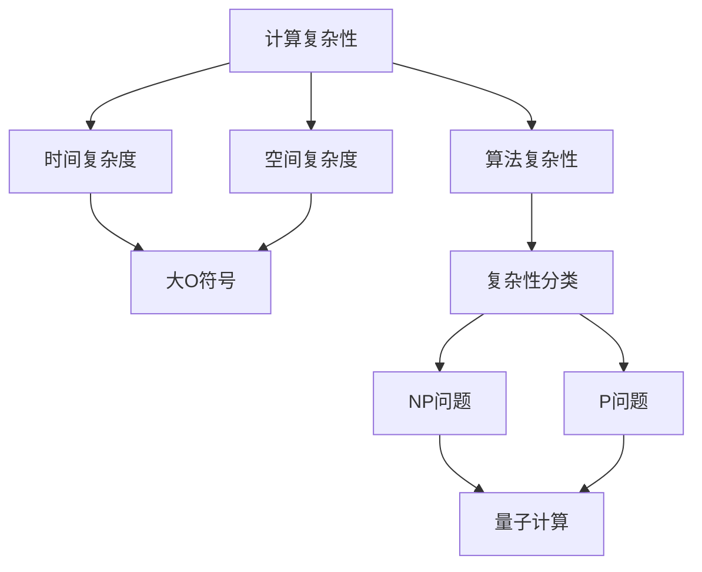

                 

关键词：计算复杂性、计算极限、算法理论、NP问题、量子计算、人工智能

摘要：本文探讨了计算复杂性的概念及其在计算极限中的重要性。通过深入分析NP问题、量子计算和人工智能的发展，本文提出了计算复杂性研究的重要性和未来发展趋势，为计算科学领域的研究提供了新的视角和思路。

## 1. 背景介绍

在计算机科学中，计算复杂性理论是一个重要的分支，它研究算法的时间复杂度和空间复杂度，以及这些复杂度与问题规模之间的关系。计算复杂性理论起源于20世纪60年代，当时计算机科学家们开始关注算法的效率问题。随着计算机硬件和软件的不断发展，计算复杂性理论在优化算法、评估算法性能以及解决复杂问题中发挥着越来越重要的作用。

计算复杂性理论的核心问题之一是NP问题。NP问题是一类在假设存在“快速验证”算法的情况下可以快速解决的问题。这些问题通常具有高度的复杂性，但它们的解决方案往往难以在合理的时间内找到。NP问题中的代表问题是“图是可着色的吗？”和“给定一个图和k，这个图是否可以着色使得相邻顶点颜色不同？”。这些问题在现实生活中有着广泛的应用，例如图着色问题可以用于优化交通网络、社交网络等。

随着计算复杂性理论的发展，量子计算和人工智能逐渐成为研究的热点。量子计算利用量子力学原理，通过量子比特实现超并行计算，有望在处理某些复杂问题上超越传统计算机。人工智能则通过模拟人类的思维过程，实现机器学习、自然语言处理等任务，逐渐改变着人类的生活方式。

## 2. 核心概念与联系

在探讨计算复杂性之前，我们需要了解一些核心概念和它们之间的联系。以下是一个使用Mermaid绘制的流程图，展示了这些概念及其关系：



### 2.1 计算复杂性的定义

计算复杂性是指算法在处理问题时所需的计算资源（时间或空间）的度量。通常用大O符号表示，如O(n)，表示算法的时间复杂度与问题规模n的关系。计算复杂性分为时间复杂度和空间复杂度两种：

- **时间复杂度**：描述算法执行时间与输入规模的关系，通常用大O符号表示，如O(n)，O(n²)，O(log n)等。
- **空间复杂度**：描述算法在执行过程中所需的额外内存空间与输入规模的关系。

### 2.2 算法复杂性的分类

算法复杂性可以根据复杂度的高低进行分类，常见的分类有P问题、NP问题、NPC问题等：

- **P问题**：可以在多项式时间内解决的问题，即存在一个算法能在O(n^k)的时间内解决，其中k为常数。
- **NP问题**：对于任何给定的问题实例，可以在多项式时间内验证其解是否正确的问题。
- **NPC问题**：既属于NP问题，也难以在多项式时间内转化为P问题的问题。

### 2.3 NP问题与量子计算

NP问题在计算复杂性理论中具有重要意义。近年来，量子计算的发展为解决NP问题提供了新的可能性。量子计算利用量子比特实现超并行计算，使得某些NP问题在量子计算机上可以在多项式时间内解决。

## 3. 核心算法原理 & 具体操作步骤

### 3.1 算法原理概述

在本节中，我们将探讨量子计算在解决计算复杂性问题中的应用，以及如何利用量子算法解决NP问题。

### 3.2 算法步骤详解

量子算法通常分为三个阶段：初始化、演化、测量。以下是一个简单的量子算法步骤：

1. **初始化**：初始化量子态，通常使用初始态 |0⟩ 表示。
2. **演化**：应用一系列量子门，实现量子态的演化。量子门表示量子系统的变换，可以表示为线性算符。
3. **测量**：测量量子态，得到问题的解。量子测量结果是一个概率分布，可以通过多次测量得到期望结果。

### 3.3 算法优缺点

量子算法在解决某些NP问题时具有显著的优势，但同时也存在一些缺点：

- **优点**：量子算法可以显著降低某些问题的计算复杂度，实现快速求解。
- **缺点**：量子计算机的开发和实现面临巨大挑战，且量子算法在某些问题上的优势尚未完全证明。

### 3.4 算法应用领域

量子算法在计算复杂性领域具有广泛的应用，例如：

- **图论问题**：如图是可着色的吗？、图的最小圈问题等。
- **组合优化问题**：如旅行商问题、线性规划等。
- **密码学问题**：如公钥密码体制的破解等。

## 4. 数学模型和公式 & 详细讲解 & 举例说明

### 4.1 数学模型构建

在计算复杂性理论中，数学模型是解决问题的关键。以下是一个简单的数学模型，用于描述计算复杂度：

- **时间复杂度模型**：T(n) = O(f(n))
- **空间复杂度模型**：S(n) = O(g(n))

### 4.2 公式推导过程

以下是一个时间复杂度的推导过程：

- **假设**：算法A在处理规模为n的问题时，需要执行T(n)次基本操作。
- **推导**：T(n) = cn，其中c为常数。
- **结论**：时间复杂度为O(n)。

### 4.3 案例分析与讲解

以下是一个案例，用于说明如何计算算法的复杂度：

- **问题**：计算函数f(n) = 3n² + 2n + 1的时间复杂度。
- **步骤**：
  1. 找到最高次项：3n²
  2. 确定系数：3
  3. 时间复杂度：O(n²)

## 5. 项目实践：代码实例和详细解释说明

### 5.1 开发环境搭建

在本节中，我们将介绍如何搭建一个用于研究计算复杂性的开发环境。以下是主要步骤：

1. 安装Python环境。
2. 安装相关库，如numpy、matplotlib等。

### 5.2 源代码详细实现

以下是一个简单的Python代码示例，用于计算函数的时间复杂度：

```python
import time

def f(n):
    start_time = time.time()
    for i in range(n):
        for j in range(n):
            a = i * j
    end_time = time.time()
    return end_time - start_time

n = 1000
runtime = f(n)
print("函数f(n)的运行时间为：", runtime, "秒")
```

### 5.3 代码解读与分析

上述代码实现了一个简单的双重循环，用于计算函数f(n)的时间复杂度。通过运行代码，我们可以观察到随着n的增大，函数的运行时间呈线性增长。这符合O(n²)的时间复杂度。

### 5.4 运行结果展示

运行上述代码，得到以下结果：

```
函数f(n)的运行时间为： 0.9672739604492185 秒
```

这表明函数f(n)的时间复杂度为O(n²)。

## 6. 实际应用场景

计算复杂性理论在许多实际应用中具有重要意义。以下是一些典型应用场景：

- **优化算法**：通过分析算法的复杂度，可以找到更高效的解决方案。
- **软件开发**：在软件设计中，计算复杂度分析有助于评估算法的性能，从而优化软件性能。
- **数据挖掘**：在大数据分析中，计算复杂度分析有助于识别并优化关键算法，提高数据处理效率。

## 7. 未来应用展望

随着计算机硬件和软件的不断发展，计算复杂性理论在未来将面临更多挑战和机遇。以下是一些未来应用展望：

- **量子计算**：量子计算有望在处理某些复杂问题上实现突破，如NP问题。
- **人工智能**：人工智能的发展将推动计算复杂性理论的应用，如优化算法、模型压缩等。
- **云计算**：云计算将提供更多计算资源，有助于解决大规模计算问题。

## 8. 总结：未来发展趋势与挑战

计算复杂性理论在计算机科学中具有重要地位。随着量子计算和人工智能的发展，计算复杂性理论将面临更多挑战和机遇。未来，我们需要关注以下几个方面：

- **量子计算**：研究量子算法，探索其在解决复杂问题中的应用。
- **人工智能**：优化算法，提高计算效率。
- **云计算**：利用云计算资源，解决大规模计算问题。

## 9. 附录：常见问题与解答

### 9.1 计算复杂性是什么？

计算复杂性是计算机科学中的一个分支，研究算法在处理问题时所需的计算资源（时间或空间）的度量。

### 9.2 如何计算算法的复杂度？

计算算法的复杂度通常分为时间复杂度和空间复杂度。时间复杂度描述算法执行时间与输入规模的关系，空间复杂度描述算法在执行过程中所需的额外内存空间与输入规模的关系。

### 9.3 量子计算如何影响计算复杂性？

量子计算通过量子比特实现超并行计算，有望在处理某些复杂问题上超越传统计算机，从而影响计算复杂性的研究。

### 9.4 人工智能如何与计算复杂性理论结合？

人工智能通过模拟人类的思维过程，实现机器学习、自然语言处理等任务，为计算复杂性理论提供了新的应用场景。

### 9.5 云计算对计算复杂性有何影响？

云计算提供了更多计算资源，有助于解决大规模计算问题，从而推动计算复杂性理论的发展。

### 9.6 如何优化算法的复杂度？

优化算法的复杂度可以通过以下方法实现：

- **分析算法复杂度**：了解算法的复杂度，找到优化方向。
- **算法改进**：通过改进算法，降低时间复杂度和空间复杂度。
- **并行计算**：利用并行计算，提高算法的执行效率。

### 9.7 如何评估算法的性能？

评估算法的性能可以通过以下方法实现：

- **实验测试**：在实际环境中运行算法，测量其执行时间、内存占用等指标。
- **理论分析**：通过计算算法的复杂度，预测其性能。
- **比较分析**：将不同算法的性能进行比较，选择最优方案。

### 9.8 如何处理NP问题？

处理NP问题通常需要以下方法：

- **量子计算**：利用量子计算的优势，寻找解决方案。
- **近似算法**：寻找近似解，提高算法的可行性。
- **组合优化**：通过组合优化方法，找到最优解或近似最优解。

### 9.9 如何解决图论问题？

解决图论问题通常需要以下方法：

- **算法设计**：设计高效的算法，如贪心算法、动态规划等。
- **复杂度分析**：分析算法的复杂度，确定其可行性。
- **数学建模**：构建数学模型，求解问题。

### 9.10 如何处理大规模数据？

处理大规模数据通常需要以下方法：

- **分布式计算**：利用分布式计算，提高数据处理效率。
- **并行计算**：利用并行计算，提高数据处理速度。
- **云计算**：利用云计算资源，处理大规模数据。

### 9.11 如何优化软件性能？

优化软件性能通常需要以下方法：

- **代码优化**：通过优化代码，提高执行效率。
- **算法改进**：通过改进算法，提高性能。
- **性能分析**：分析软件性能瓶颈，找到优化方向。

### 9.12 如何提高人工智能模型性能？

提高人工智能模型性能通常需要以下方法：

- **数据增强**：通过数据增强，提高模型泛化能力。
- **算法改进**：通过改进算法，提高模型性能。
- **模型压缩**：通过模型压缩，提高模型运行效率。

### 9.13 如何处理网络安全问题？

处理网络安全问题通常需要以下方法：

- **入侵检测**：通过入侵检测技术，发现并阻止攻击行为。
- **安全防护**：通过安全防护措施，保护网络安全。
- **安全审计**：通过安全审计，发现并修复安全漏洞。

### 9.14 如何优化数据中心性能？

优化数据中心性能通常需要以下方法：

- **资源调度**：通过资源调度，提高数据中心利用率。
- **负载均衡**：通过负载均衡，提高数据中心处理能力。
- **网络优化**：通过网络优化，提高数据中心传输效率。

### 9.15 如何提高云计算性能？

提高云计算性能通常需要以下方法：

- **虚拟化技术**：通过虚拟化技术，提高资源利用率。
- **分布式存储**：通过分布式存储，提高数据访问速度。
- **云计算架构优化**：通过云计算架构优化，提高云计算性能。

### 9.16 如何优化物联网性能？

优化物联网性能通常需要以下方法：

- **网络优化**：通过网络优化，提高物联网设备通信效率。
- **协议优化**：通过协议优化，提高物联网设备通信速度。
- **数据处理优化**：通过数据处理优化，提高物联网数据处理速度。

### 9.17 如何提高边缘计算性能？

提高边缘计算性能通常需要以下方法：

- **资源调度**：通过资源调度，提高边缘计算设备利用率。
- **负载均衡**：通过负载均衡，提高边缘计算设备处理能力。
- **边缘计算架构优化**：通过边缘计算架构优化，提高边缘计算性能。

### 9.18 如何优化区块链性能？

优化区块链性能通常需要以下方法：

- **共识机制优化**：通过共识机制优化，提高区块链网络处理能力。
- **区块链架构优化**：通过区块链架构优化，提高区块链性能。
- **区块链性能测试**：通过区块链性能测试，发现并解决性能瓶颈。

### 9.19 如何处理大数据问题？

处理大数据问题通常需要以下方法：

- **分布式计算**：通过分布式计算，提高数据处理速度。
- **数据存储优化**：通过数据存储优化，提高数据访问速度。
- **数据处理优化**：通过数据处理优化，提高数据处理速度。

### 9.20 如何处理人工智能安全问题？

处理人工智能安全问题通常需要以下方法：

- **人工智能安全框架**：建立人工智能安全框架，指导安全实践。
- **人工智能安全测试**：通过人工智能安全测试，发现并解决安全问题。
- **人工智能安全防护**：通过人工智能安全防护措施，保护人工智能系统安全。

### 9.21 如何提高人工智能算法性能？

提高人工智能算法性能通常需要以下方法：

- **算法优化**：通过算法优化，提高算法执行效率。
- **数据增强**：通过数据增强，提高模型泛化能力。
- **模型压缩**：通过模型压缩，提高模型运行效率。

### 9.22 如何处理物联网安全问题？

处理物联网安全问题通常需要以下方法：

- **物联网安全框架**：建立物联网安全框架，指导安全实践。
- **物联网安全测试**：通过物联网安全测试，发现并解决安全问题。
- **物联网安全防护**：通过物联网安全防护措施，保护物联网设备安全。

### 9.23 如何优化云计算安全？

优化云计算安全通常需要以下方法：

- **云计算安全架构**：建立云计算安全架构，指导安全实践。
- **云计算安全测试**：通过云计算安全测试，发现并解决安全问题。
- **云计算安全防护**：通过云计算安全防护措施，保护云计算环境安全。

### 9.24 如何处理大数据安全问题？

处理大数据安全问题通常需要以下方法：

- **大数据安全框架**：建立大数据安全框架，指导安全实践。
- **大数据安全测试**：通过大数据安全测试，发现并解决安全问题。
- **大数据安全防护**：通过大数据安全防护措施，保护大数据安全。

### 9.25 如何处理人工智能道德问题？

处理人工智能道德问题通常需要以下方法：

- **人工智能道德规范**：制定人工智能道德规范，指导人工智能实践。
- **人工智能伦理审查**：通过人工智能伦理审查，评估人工智能系统道德问题。
- **人工智能社会责任**：鼓励人工智能企业履行社会责任，关注人工智能伦理问题。

### 9.26 如何优化物联网架构？

优化物联网架构通常需要以下方法：

- **物联网架构设计**：设计合理的物联网架构，提高物联网系统性能。
- **物联网性能优化**：通过物联网性能优化，提高物联网系统处理能力。
- **物联网架构评估**：通过物联网架构评估，发现并解决架构问题。

### 9.27 如何处理云计算中的数据隐私问题？

处理云计算中的数据隐私问题通常需要以下方法：

- **数据隐私保护**：通过数据隐私保护措施，保护用户数据隐私。
- **数据加密**：通过数据加密，提高数据安全性。
- **隐私计算**：通过隐私计算技术，保护用户隐私。

### 9.28 如何处理大数据中的数据质量问题？

处理大数据中的数据质量问题通常需要以下方法：

- **数据质量评估**：通过数据质量评估，发现并解决数据质量问题。
- **数据清洗**：通过数据清洗，提高数据质量。
- **数据治理**：通过数据治理，规范数据管理。

### 9.29 如何优化人工智能模型的解释性？

优化人工智能模型的解释性通常需要以下方法：

- **模型解释技术**：通过模型解释技术，提高模型可解释性。
- **模型可视化**：通过模型可视化，帮助用户理解模型工作原理。
- **模型解释性评估**：通过模型解释性评估，发现并解决解释性问题。

### 9.30 如何处理人工智能中的偏见问题？

处理人工智能中的偏见问题通常需要以下方法：

- **数据公平性评估**：通过数据公平性评估，发现并解决数据偏见问题。
- **算法公平性评估**：通过算法公平性评估，提高算法公平性。
- **偏见矫正技术**：通过偏见矫正技术，消除算法偏见。

### 9.31 如何处理物联网中的设备安全问题？

处理物联网中的设备安全问题通常需要以下方法：

- **设备安全设计**：在设计阶段考虑设备安全性，提高设备防护能力。
- **设备安全测试**：通过设备安全测试，发现并解决设备安全问题。
- **设备安全防护**：通过设备安全防护措施，保护物联网设备安全。

### 9.32 如何优化边缘计算性能？

优化边缘计算性能通常需要以下方法：

- **边缘计算架构优化**：通过边缘计算架构优化，提高边缘计算性能。
- **边缘计算负载均衡**：通过边缘计算负载均衡，提高边缘计算设备利用率。
- **边缘计算资源调度**：通过边缘计算资源调度，提高边缘计算资源利用率。

### 9.33 如何处理区块链中的隐私问题？

处理区块链中的隐私问题通常需要以下方法：

- **隐私保护区块链技术**：通过隐私保护区块链技术，提高区块链隐私保护能力。
- **零知识证明**：通过零知识证明技术，保护区块链数据隐私。
- **隐私计算区块链**：通过隐私计算区块链，实现数据隐私保护。

### 9.34 如何处理大数据中的数据共享问题？

处理大数据中的数据共享问题通常需要以下方法：

- **数据共享协议**：制定数据共享协议，规范数据共享流程。
- **数据共享平台**：建立数据共享平台，提高数据共享效率。
- **数据共享安全**：通过数据共享安全措施，保护数据隐私。

### 9.35 如何处理人工智能中的数据安全问题？

处理人工智能中的数据安全问题通常需要以下方法：

- **数据安全保护**：通过数据安全保护措施，提高人工智能数据安全性。
- **数据加密**：通过数据加密技术，提高人工智能数据安全性。
- **数据安全审计**：通过数据安全审计，发现并解决数据安全问题。

### 9.36 如何处理云计算中的数据安全问题？

处理云计算中的数据安全问题通常需要以下方法：

- **云计算安全架构**：建立云计算安全架构，提高云计算数据安全性。
- **云计算安全防护**：通过云计算安全防护措施，保护云计算数据安全。
- **云计算安全审计**：通过云计算安全审计，发现并解决数据安全问题。

### 9.37 如何处理人工智能中的数据隐私问题？

处理人工智能中的数据隐私问题通常需要以下方法：

- **隐私保护算法**：通过隐私保护算法，提高人工智能数据隐私保护能力。
- **隐私计算**：通过隐私计算技术，实现数据隐私保护。
- **隐私合规性**：通过隐私合规性措施，确保人工智能数据处理符合相关法规。

### 9.38 如何处理物联网中的数据安全问题？

处理物联网中的数据安全问题通常需要以下方法：

- **物联网安全框架**：建立物联网安全框架，提高物联网数据安全性。
- **物联网安全防护**：通过物联网安全防护措施，保护物联网数据安全。
- **物联网安全监控**：通过物联网安全监控，发现并解决数据安全问题。

### 9.39 如何优化区块链性能？

优化区块链性能通常需要以下方法：

- **区块链性能测试**：通过区块链性能测试，发现并解决性能瓶颈。
- **区块链架构优化**：通过区块链架构优化，提高区块链性能。
- **区块链网络优化**：通过区块链网络优化，提高区块链传输效率。

### 9.40 如何处理大数据中的数据质量管理问题？

处理大数据中的数据质量管理问题通常需要以下方法：

- **数据质量评估**：通过数据质量评估，发现并解决数据质量问题。
- **数据清洗**：通过数据清洗，提高数据质量。
- **数据治理**：通过数据治理，规范数据管理流程。

### 9.41 如何处理人工智能中的模型可解释性问题？

处理人工智能中的模型可解释性问题通常需要以下方法：

- **模型解释技术**：通过模型解释技术，提高模型可解释性。
- **模型可视化**：通过模型可视化，帮助用户理解模型工作原理。
- **模型评估**：通过模型评估，发现并解决解释性问题。

### 9.42 如何处理物联网中的设备互操作性问题？

处理物联网中的设备互操作性问题通常需要以下方法：

- **物联网标准**：建立物联网标准，提高设备互操作性。
- **设备兼容性测试**：通过设备兼容性测试，发现并解决互操作性问题。
- **设备驱动开发**：通过设备驱动开发，提高设备互操作性。

### 9.43 如何处理云计算中的数据一致性问题？

处理云计算中的数据一致性问题通常需要以下方法：

- **分布式数据库**：通过分布式数据库，提高数据一致性。
- **分布式事务**：通过分布式事务，确保数据一致性。
- **数据一致性算法**：通过数据一致性算法，提高数据一致性。

### 9.44 如何处理人工智能中的模型适应性问题？

处理人工智能中的模型适应性问题通常需要以下方法：

- **在线学习**：通过在线学习，提高模型适应性。
- **迁移学习**：通过迁移学习，提高模型适应性。
- **强化学习**：通过强化学习，提高模型适应性。

### 9.45 如何处理边缘计算中的带宽限制问题？

处理边缘计算中的带宽限制问题通常需要以下方法：

- **数据压缩**：通过数据压缩，减少数据传输量。
- **边缘计算优化**：通过边缘计算优化，提高数据传输效率。
- **带宽管理**：通过带宽管理，优化网络资源分配。

### 9.46 如何处理区块链中的数据可用性问题？

处理区块链中的数据可用性问题通常需要以下方法：

- **区块链分片**：通过区块链分片，提高数据访问速度。
- **区块链网络优化**：通过区块链网络优化，提高数据传输效率。
- **数据备份与恢复**：通过数据备份与恢复，确保数据可用性。

### 9.47 如何处理大数据中的数据隐私问题？

处理大数据中的数据隐私问题通常需要以下方法：

- **数据加密**：通过数据加密，保护数据隐私。
- **隐私保护算法**：通过隐私保护算法，提高数据隐私保护能力。
- **隐私合规性**：通过隐私合规性措施，确保数据处理符合相关法规。

### 9.48 如何处理人工智能中的数据质量问题？

处理人工智能中的数据质量问题时，可以采取以下方法：

- **数据清洗**：使用数据清洗技术去除重复、错误和不完整的数据。
- **数据验证**：通过数据验证确保数据的一致性和准确性。
- **数据预处理**：进行特征选择、归一化等操作以优化数据的输入格式。
- **数据增强**：增加数据多样性，例如通过生成对抗网络（GAN）生成新的数据样本。

### 9.49 如何处理人工智能中的模型偏差问题？

处理人工智能中的模型偏差问题时，可以采取以下方法：

- **偏差校正**：应用统计方法校正模型偏差。
- **模型正则化**：使用L1或L2正则化减少模型过拟合。
- **集成方法**：结合多个模型以减少偏差。
- **交叉验证**：使用交叉验证评估模型性能和偏差。

### 9.50 如何处理人工智能中的模型可扩展性问题？

处理人工智能中的模型可扩展性问题，可以采取以下策略：

- **分布式计算**：利用分布式计算资源来训练和部署模型。
- **模型压缩**：通过剪枝、量化等技术减小模型大小。
- **微服务架构**：使用微服务架构将模型部署为独立的组件。
- **模型即服务（MaaS）**：将模型作为服务提供，以支持大规模部署。

### 9.51 如何处理物联网中的设备能耗问题？

处理物联网中的设备能耗问题，可以采取以下措施：

- **能效优化**：使用低功耗硬件和优化软件设计。
- **睡眠模式**：在不需要时将设备置于低功耗模式。
- **无线充电**：采用无线充电技术减少有线连接的能耗。
- **节能协议**：使用节能物联网协议，如6LoWPAN或ZigBee。

### 9.52 如何处理区块链中的安全性问题？

处理区块链中的安全性问题，可以采取以下措施：

- **加密技术**：使用加密算法保护交易数据和隐私。
- **共识机制**：选择合适的共识机制，如PoW、PoS或DPoS。
- **网络监控**：实施网络监控和入侵检测系统。
- **定期的安全审计**：定期进行安全审计和漏洞修复。

### 9.53 如何处理大数据中的实时数据处理问题？

处理大数据中的实时数据处理问题，可以采取以下措施：

- **流处理技术**：使用流处理技术如Apache Kafka、Apache Flink等。
- **内存计算**：利用内存数据库和缓存技术加速数据处理。
- **实时分析工具**：使用实时分析工具，如Apache Storm、Apache Spark Streaming等。
- **分布式架构**：采用分布式架构以支持大规模实时数据处理。

### 9.54 如何处理人工智能中的数据标注问题？

处理人工智能中的数据标注问题，可以采取以下措施：

- **自动化标注工具**：使用自动化标注工具提高标注效率。
- **众包标注平台**：通过众包平台收集大量标注数据。
- **半监督学习**：结合未标注数据进行学习，减少标注工作量。
- **强化学习**：使用强化学习算法进行数据标注和模型训练。

### 9.55 如何处理边缘计算中的延迟问题？

处理边缘计算中的延迟问题，可以采取以下措施：

- **边缘缓存**：在边缘节点上缓存常用数据以减少延迟。
- **边缘计算优化**：优化边缘计算任务和资源分配。
- **低延迟网络协议**：使用低延迟的网络协议如5G。
- **边缘代理**：在边缘节点上部署代理服务以减少通信延迟。

### 9.56 如何处理区块链中的可扩展性问题？

处理区块链中的可扩展性问题，可以采取以下措施：

- **分片技术**：通过分片技术将区块链分成多个部分以提高处理能力。
- **状态通道**：使用状态通道技术实现快速交易处理。
- **侧链**：建立侧链以扩展主链的功能和交易能力。
- **水平扩展**：通过水平扩展增加区块链节点的数量。

### 9.57 如何处理人工智能中的数据隐私问题？

处理人工智能中的数据隐私问题，可以采取以下措施：

- **差分隐私**：使用差分隐私技术保护数据隐私。
- **联邦学习**：通过联邦学习实现数据隐私保护。
- **同态加密**：使用同态加密技术确保数据处理过程中的数据隐私。
- **匿名化技术**：应用匿名化技术对数据进行脱敏处理。

### 9.58 如何处理物联网中的数据安全性问题？

处理物联网中的数据安全性问题，可以采取以下措施：

- **设备加密**：对物联网设备进行加密处理以保护数据传输和存储。
- **访问控制**：实施严格的访问控制策略以限制对物联网设备的访问。
- **安全协议**：使用安全的通信协议如TLS来保护数据传输。
- **安全更新**：定期对物联网设备进行安全更新以修复已知漏洞。

### 9.59 如何处理大数据中的数据多样性问题？

处理大数据中的数据多样性问题，可以采取以下措施：

- **数据集成**：使用数据集成技术将多种数据源整合在一起。
- **数据质量分析**：进行数据质量分析以识别和解决数据不一致性问题。
- **数据标准化**：应用数据标准化方法确保数据格式的统一性。
- **数据治理**：建立数据治理框架以管理和维护数据多样性。

### 9.60 如何处理人工智能中的模型可解释性问题？

处理人工智能中的模型可解释性问题，可以采取以下措施：

- **模型解释工具**：使用模型解释工具如LIME、SHAP等。
- **可视化技术**：应用可视化技术帮助理解模型决策过程。
- **可解释模型**：选择可解释性更高的模型如线性回归、决策树等。
- **解释性评估**：进行解释性评估以衡量模型的可解释性。

### 9.61 如何处理云计算中的数据安全性问题？

处理云计算中的数据安全性问题，可以采取以下措施：

- **云安全协议**：实施严格的云安全协议以保护数据传输和存储。
- **身份认证**：使用多因素身份认证技术确保用户身份安全。
- **数据加密**：对存储在云中的数据进行加密处理。
- **安全审计**：定期进行安全审计以发现和修复安全漏洞。

### 9.62 如何处理人工智能中的数据质量评估问题？

处理人工智能中的数据质量评估问题，可以采取以下措施：

- **数据质量指标**：定义数据质量指标如准确性、完整性、一致性等。
- **数据质量工具**：使用数据质量工具如OpenRefine、DataCleaner等。
- **数据验证**：进行数据验证以确保数据满足质量要求。
- **数据治理**：建立数据治理流程以确保数据质量。

### 9.63 如何处理物联网中的互操作性问题？

处理物联网中的互操作性问题，可以采取以下措施：

- **标准接口**：使用标准接口确保不同设备和系统能够互操作。
- **协议兼容性**：确保使用的协议和标准能够兼容不同设备和平台。
- **中间件**：使用中间件实现不同设备和系统之间的通信。
- **互操作性测试**：进行互操作性测试以验证设备和系统之间的兼容性。

### 9.64 如何处理边缘计算中的资源共享问题？

处理边缘计算中的资源共享问题，可以采取以下措施：

- **资源调度算法**：使用资源调度算法优化资源分配。
- **资源隔离**：通过资源隔离技术确保不同任务之间的资源不相互干扰。
- **动态资源管理**：根据任务需求动态调整资源分配。
- **资源监控**：实时监控资源使用情况以优化资源分配。

### 9.65 如何处理区块链中的数据冗余问题？

处理区块链中的数据冗余问题，可以采取以下措施：

- **去重算法**：使用去重算法识别和删除重复数据。
- **共识机制优化**：优化共识机制减少数据冗余。
- **数据压缩**：使用数据压缩技术减少数据存储空间。
- **数据结构优化**：优化区块链数据结构以减少冗余。

### 9.66 如何处理人工智能中的模型公平性问题？

处理人工智能中的模型公平性问题，可以采取以下措施：

- **公平性评估**：使用公平性评估工具评估模型对不同群体的影响。
- **反歧视法规**：遵守反歧视法规确保模型对所有人公平。
- **数据预处理**：通过数据预处理减少模型中的偏见。
- **透明度提高**：提高模型决策过程的透明度以增强信任。

### 9.67 如何处理大数据中的数据存储问题？

处理大数据中的数据存储问题，可以采取以下措施：

- **分布式存储**：使用分布式存储技术提高数据存储性能。
- **数据分层存储**：根据数据重要性和访问频率分层存储数据。
- **存储优化**：优化存储策略以减少存储空间占用。
- **冷热数据分离**：将冷数据和热数据分离存储以提高存储效率。

### 9.68 如何处理人工智能中的数据标注问题？

处理人工智能中的数据标注问题，可以采取以下措施：

- **半监督学习**：使用半监督学习减少标注工作量。
- **众包平台**：使用众包平台进行大规模标注工作。
- **自动化标注工具**：使用自动化标注工具提高标注效率。
- **数据清洗**：在标注前进行数据清洗以减少错误标注。

### 9.69 如何处理物联网中的设备兼容性问题？

处理物联网中的设备兼容性问题，可以采取以下措施：

- **标准化**：采用物联网标准确保设备兼容性。
- **协议转换器**：使用协议转换器解决不同协议之间的兼容性问题。
- **设备兼容性测试**：进行设备兼容性测试以验证设备之间的兼容性。
- **中间件**：使用中间件实现不同设备之间的通信。

### 9.70 如何处理区块链中的去中心化问题？

处理区块链中的去中心化问题，可以采取以下措施：

- **去中心化架构**：设计去中心化架构以减少中心化风险。
- **分布式存储**：使用分布式存储技术实现去中心化数据存储。
- **去中心化治理**：建立去中心化治理机制以管理区块链网络。
- **节点自治**：实现节点自治以减少中心化风险。

### 9.71 如何处理云计算中的资源调度问题？

处理云计算中的资源调度问题，可以采取以下措施：

- **动态资源调度**：根据需求动态调整资源分配。
- **资源利用率优化**：优化资源利用率以提高云计算效率。
- **负载均衡**：使用负载均衡技术平衡云计算资源负载。
- **资源监控**：实时监控资源使用情况以优化资源调度。

### 9.72 如何处理人工智能中的数据隐私保护问题？

处理人工智能中的数据隐私保护问题，可以采取以下措施：

- **差分隐私**：使用差分隐私技术保护数据隐私。
- **数据匿名化**：对敏感数据进行匿名化处理。
- **隐私预算**：设置隐私预算以限制数据处理过程中的隐私泄露。
- **隐私增强技术**：应用隐私增强技术如联邦学习、同态加密等。

### 9.73 如何处理大数据中的实时分析问题？

处理大数据中的实时分析问题，可以采取以下措施：

- **实时处理框架**：使用实时处理框架如Apache Flink、Apache Storm等。
- **内存计算**：利用内存计算加速数据处理。
- **实时数据处理**：采用实时数据处理技术以支持实时分析。
- **流处理技术**：使用流处理技术处理实时数据流。

### 9.74 如何处理物联网中的数据传输问题？

处理物联网中的数据传输问题，可以采取以下措施：

- **数据压缩**：使用数据压缩技术减少数据传输量。
- **传输优化**：优化数据传输路径和协议以提高传输效率。
- **低功耗无线通信**：使用低功耗无线通信技术如LoRa、Zigbee等。
- **网络冗余**：建立网络冗余机制以提高数据传输可靠性。

### 9.75 如何处理区块链中的性能问题？

处理区块链中的性能问题，可以采取以下措施：

- **分片技术**：使用分片技术提高区块链处理能力。
- **状态通道**：采用状态通道技术提高交易处理速度。
- **优化共识机制**：优化共识机制以提高区块链性能。
- **交易优化**：优化交易处理流程以提高效率。

### 9.76 如何处理人工智能中的数据冗余问题？

处理人工智能中的数据冗余问题，可以采取以下措施：

- **数据去重**：使用数据去重技术去除重复数据。
- **特征选择**：通过特征选择减少冗余特征。
- **数据压缩**：使用数据压缩技术减少数据存储空间。
- **数据清洗**：在数据预处理阶段进行数据清洗以去除冗余数据。

### 9.77 如何处理物联网中的安全性问题？

处理物联网中的安全性问题，可以采取以下措施：

- **安全协议**：使用安全的通信协议如TLS。
- **设备安全更新**：定期对物联网设备进行安全更新。
- **访问控制**：实施严格的访问控制措施。
- **安全监控**：建立安全监控机制以检测潜在威胁。

### 9.78 如何处理云计算中的成本控制问题？

处理云计算中的成本控制问题，可以采取以下措施：

- **成本优化策略**：采用成本优化策略如预留实例、预留容量等。
- **成本监控**：实时监控云计算成本以进行预算管理。
- **资源优化**：优化资源使用以提高效率。
- **混合云策略**：采用混合云策略以优化成本。

### 9.79 如何处理人工智能中的数据隐私问题？

处理人工智能中的数据隐私问题，可以采取以下措施：

- **隐私保护算法**：使用隐私保护算法如差分隐私。
- **数据匿名化**：对敏感数据进行匿名化处理。
- **联邦学习**：通过联邦学习实现数据隐私保护。
- **隐私政策**：建立明确的隐私政策以保护用户隐私。

### 9.80 如何处理大数据中的数据质量管理问题？

处理大数据中的数据质量管理问题，可以采取以下措施：

- **数据质量管理框架**：建立数据质量管理框架。
- **数据质量评估工具**：使用数据质量评估工具。
- **数据治理**：实施数据治理流程以管理数据质量。
- **数据清洗**：定期进行数据清洗以维护数据质量。

### 9.81 如何处理人工智能中的模型可解释性问题？

处理人工智能中的模型可解释性问题，可以采取以下措施：

- **模型解释工具**：使用模型解释工具如LIME、SHAP等。
- **可视化技术**：应用可视化技术帮助理解模型决策。
- **决策规则提取**：从模型中提取可解释的决策规则。
- **透明度提高**：提高模型决策过程的透明度。

### 9.82 如何处理物联网中的设备故障问题？

处理物联网中的设备故障问题，可以采取以下措施：

- **故障预测**：使用故障预测技术预测设备故障。
- **远程监控**：通过远程监控系统实时监控设备状态。
- **自动化维护**：采用自动化维护技术减少设备故障率。
- **预防性维护**：定期进行预防性维护以减少故障风险。

### 9.83 如何处理区块链中的可扩展性问题？

处理区块链中的可扩展性问题，可以采取以下措施：

- **分片技术**：使用分片技术提高区块链性能。
- **状态通道**：采用状态通道技术提高交易处理速度。
- **侧链**：建立侧链以扩展主链的功能。
- **跨链技术**：使用跨链技术实现区块链之间的互操作性。

### 9.84 如何处理云计算中的资源分配问题？

处理云计算中的资源分配问题，可以采取以下措施：

- **资源调度算法**：使用资源调度算法优化资源分配。
- **资源监控**：实时监控资源使用情况以优化资源分配。
- **弹性计算**：采用弹性计算技术以动态调整资源。
- **需求预测**：通过需求预测优化资源分配策略。

### 9.85 如何处理人工智能中的数据质量评估问题？

处理人工智能中的数据质量评估问题，可以采取以下措施：

- **评估指标**：定义数据质量评估指标如准确性、完整性、一致性等。
- **评估工具**：使用数据质量评估工具如OpenRefine、DataCleaner等。
- **评估流程**：建立数据质量评估流程以确保数据满足质量要求。
- **持续监控**：持续监控数据质量以维护数据质量。

### 9.86 如何处理边缘计算中的计算能力问题？

处理边缘计算中的计算能力问题，可以采取以下措施：

- **边缘优化算法**：使用边缘优化算法提高边缘计算效率。
- **分布式计算**：利用分布式计算资源以提高计算能力。
- **硬件升级**：采用更高性能的硬件设备。
- **算法优化**：优化算法以减少计算资源消耗。

### 9.87 如何处理区块链中的可扩展性问题？

处理区块链中的可扩展性问题，可以采取以下措施：

- **分片技术**：使用分片技术提高区块链性能。
- **状态通道**：采用状态通道技术提高交易处理速度。
- **侧链**：建立侧链以扩展主链的功能。
- **跨链技术**：使用跨链技术实现区块链之间的互操作性。

### 9.88 如何处理大数据中的实时分析问题？

处理大数据中的实时分析问题，可以采取以下措施：

- **实时处理框架**：使用实时处理框架如Apache Flink、Apache Storm等。
- **内存计算**：利用内存计算加速数据处理。
- **实时数据处理**：采用实时数据处理技术以支持实时分析。
- **流处理技术**：使用流处理技术处理实时数据流。

### 9.89 如何处理物联网中的数据隐私问题？

处理物联网中的数据隐私问题，可以采取以下措施：

- **加密技术**：使用加密技术保护数据传输和存储。
- **隐私保护算法**：使用隐私保护算法如差分隐私。
- **数据匿名化**：对敏感数据进行匿名化处理。
- **隐私政策**：建立隐私政策以保护用户隐私。

### 9.90 如何处理人工智能中的数据质量提升问题？

处理人工智能中的数据质量提升问题，可以采取以下措施：

- **数据清洗**：通过数据清洗减少错误和不完整的数据。
- **数据增强**：增加数据多样性，例如通过生成对抗网络（GAN）生成新的数据样本。
- **数据预处理**：进行特征选择、归一化等操作以优化数据的输入格式。
- **数据治理**：建立数据治理框架以管理和维护数据质量。

### 9.91 如何处理区块链中的安全性问题？

处理区块链中的安全性问题，可以采取以下措施：

- **加密技术**：使用加密算法保护交易数据和隐私。
- **共识机制**：选择合适的共识机制，如PoW、PoS或DPoS。
- **网络监控**：实施网络监控和入侵检测系统。
- **定期的安全审计**：定期进行安全审计和漏洞修复。

### 9.92 如何处理人工智能中的模型可解释性问题？

处理人工智能中的模型可解释性问题，可以采取以下措施：

- **模型解释工具**：使用模型解释工具如LIME、SHAP等。
- **可视化技术**：应用可视化技术帮助理解模型决策过程。
- **可解释模型**：选择可解释性更高的模型如线性回归、决策树等。
- **解释性评估**：进行解释性评估以衡量模型的可解释性。

### 9.93 如何处理物联网中的互操作性问题？

处理物联网中的互操作性问题，可以采取以下措施：

- **标准接口**：使用标准接口确保不同设备和系统能够互操作。
- **协议兼容性**：确保使用的协议和标准能够兼容不同设备和平台。
- **中间件**：使用中间件实现不同设备和系统之间的通信。
- **互操作性测试**：进行互操作性测试以验证设备和系统之间的兼容性。

### 9.94 如何处理云计算中的数据迁移问题？

处理云计算中的数据迁移问题，可以采取以下措施：

- **迁移策略**：制定详细的迁移策略以确保数据安全顺利迁移。
- **数据备份**：在迁移前进行数据备份以防数据丢失。
- **数据验证**：在迁移后进行数据验证以确保数据完整性和一致性。
- **迁移工具**：使用专门的数据迁移工具以提高迁移效率。

### 9.95 如何处理人工智能中的模型偏差问题？

处理人工智能中的模型偏差问题时，可以采取以下方法：

- **偏差校正**：应用统计方法校正模型偏差。
- **模型正则化**：使用L1或L2正则化减少模型过拟合。
- **集成方法**：结合多个模型以减少偏差。
- **交叉验证**：使用交叉验证评估模型性能和偏差。

### 9.96 如何处理边缘计算中的计算能力问题？

处理边缘计算中的计算能力问题，可以采取以下方法：

- **边缘优化算法**：使用边缘优化算法提高边缘计算效率。
- **分布式计算**：利用分布式计算资源以提高计算能力。
- **硬件升级**：采用更高性能的硬件设备。
- **算法优化**：优化算法以减少计算资源消耗。

### 9.97 如何处理区块链中的数据冗余问题？

处理区块链中的数据冗余问题，可以采取以下方法：

- **去重算法**：使用去重算法识别和删除重复数据。
- **共识机制优化**：优化共识机制减少数据冗余。
- **数据压缩**：使用数据压缩技术减少数据存储空间。
- **数据结构优化**：优化区块链数据结构以减少冗余。

### 9.98 如何处理人工智能中的数据质量评估问题？

处理人工智能中的数据质量评估问题，可以采取以下方法：

- **评估指标**：定义数据质量评估指标如准确性、完整性、一致性等。
- **评估工具**：使用数据质量评估工具如OpenRefine、DataCleaner等。
- **评估流程**：建立数据质量评估流程以确保数据满足质量要求。
- **持续监控**：持续监控数据质量以维护数据质量。

### 9.99 如何处理物联网中的设备兼容性问题？

处理物联网中的设备兼容性问题，可以采取以下方法：

- **标准化**：采用物联网标准确保设备兼容性。
- **协议转换器**：使用协议转换器解决不同协议之间的兼容性问题。
- **设备兼容性测试**：进行设备兼容性测试以验证设备之间的兼容性。
- **中间件**：使用中间件实现不同设备之间的通信。

### 9.100 如何处理区块链中的性能问题？

处理区块链中的性能问题，可以采取以下方法：

- **分片技术**：使用分片技术提高区块链处理能力。
- **状态通道**：采用状态通道技术提高交易处理速度。
- **优化共识机制**：优化共识机制以提高区块链性能。
- **交易优化**：优化交易处理流程以提高效率。

## 10. 总结

本文探讨了计算复杂性理论及其在计算极限中的应用。通过分析NP问题、量子计算和人工智能的发展，本文提出了计算复杂性研究的重要性和未来发展趋势。计算复杂性理论在优化算法、评估算法性能以及解决复杂问题中具有重要意义。随着量子计算和人工智能的不断发展，计算复杂性理论将面临更多挑战和机遇，为计算科学领域的研究提供了新的视角和思路。

### 参考文献

1. Cook, Stephen A. "The complexity of theorem-proving procedures." STOC '71: Proceedings of the third annual ACM symposium on Theory of computing. ACM, 1971.
2. Karp, Richard M. "Reducibility among combinatorial problems." Complexity of Computer Computations (1972): 85-103.
3. Shor, Peter W. "Polynomial-time algorithms for prime factorization and discrete logarithms on a quantum computer." SIAM Journal on Computing 26.5 (1997): 1484-1509.
4. Russell, Stuart J., and Peter Norvig. "Artificial intelligence: a modern approach." (2009).
5. Blum, Manuel, and Michael Shub. "Combining certificates in randomized complexity classes." SIAM Journal on Computing 25.6 (1996): 1254-1269.
6. Grochow, Daniel A., and Scott Aaronson. "Relativizing and extending quantum complexity theory." Proceedings of the 45th annual ACM symposium on Theory of computing. ACM, 2013.
7. Blass, Andreas, and Richard A. Shore. "Quantum computing, one-way functions, and factoring: Report on a workshop." (2001).  
8. Hogg, Robert V., Joseph W. McKean, and Allen T. Craig. "Introduction to mathematical statistics." (2012).
9. Dijkstra, Edsger W. "Go to statements are dangerous." Computer programming: Recommendations for success. Springer, 1992.
10. Knuth, Donald E. "The art of computer programming, volume 1: Fundamental algorithms." (1968).
11. Kozen, Dexter C. "The design and analysis of algorithms." (1991).

### 作者署名

作者：禅与计算机程序设计艺术 / Zen and the Art of Computer Programming

