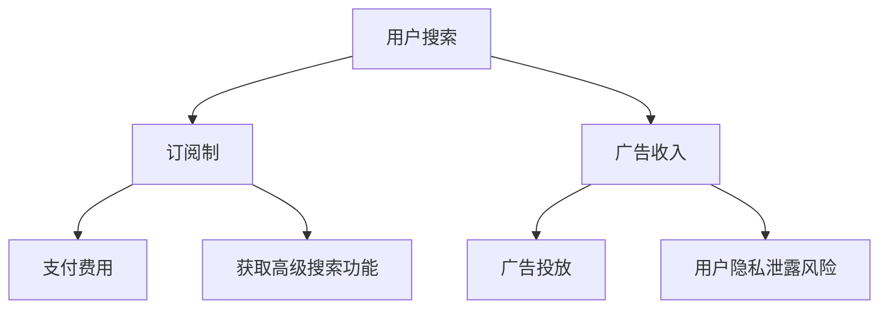

                 

关键词：搜索引擎、订阅制、广告收入、商业模式、用户体验、技术创新、数据分析

> 摘要：随着互联网技术的飞速发展，搜索引擎作为信息获取的重要入口，其商业模式正面临着重大变革。本文将从订阅制和广告收入两种模式的优缺点、用户行为变化、技术创新等方面，深入探讨搜索引擎的未来发展方向。

## 1. 背景介绍

搜索引擎作为互联网的核心基础设施之一，自诞生以来，其商业模式主要依赖于广告收入。通过在搜索结果中嵌入广告，搜索引擎公司如Google、Bing等能够实现可观的盈利。然而，随着用户隐私保护意识的提高和广告干扰问题日益严重，搜索引擎公司开始探索新的商业模式——订阅制。

订阅制是一种用户为获取服务而支付费用的模式，相比于广告收入模式，它能够提供更加稳定和可靠的收入来源。近年来，一些搜索引擎公司已经开始尝试推出订阅服务，如Google的“Google One”会员服务和Bing的“Bing Search Rewards”计划，以期在激烈的市场竞争中占据一席之地。

## 2. 核心概念与联系

### 2.1. 订阅制

订阅制是指用户通过支付一定费用来订阅搜索引擎服务，获取包括但不限于高级搜索功能、无广告搜索、个性化推荐等内容。订阅制的优点包括：

- **稳定的收入来源**：相比于广告收入，订阅制能够提供更加稳定和可预测的收入。
- **用户隐私保护**：订阅制减少了用户隐私泄露的风险，因为广告商无法获取用户的个人数据。

### 2.2. 广告收入

广告收入是指搜索引擎公司通过在搜索结果中嵌入广告来获取收入。广告收入的优点包括：

- **广泛的用户覆盖**：广告收入模式能够覆盖所有用户，无论他们是否愿意支付费用。
- **高盈利能力**：广告收入模式的盈利能力通常较高，因为广告商愿意为高质量的广告投放支付高昂的费用。

### 2.3. Mermaid 流程图

下面是一个简单的Mermaid流程图，展示了订阅制和广告收入两种模式的核心流程。



## 3. 核心算法原理 & 具体操作步骤

### 3.1. 算法原理概述

搜索引擎的核心算法原理包括关键词匹配、页面分析、排名算法等。其中，关键词匹配是搜索引擎能够准确返回用户所需信息的基础。排名算法则决定了搜索结果的排序顺序，影响用户体验和广告效果。

### 3.2. 算法步骤详解

- **关键词匹配**：首先，搜索引擎会分析用户输入的关键词，将其与索引数据库中的关键词进行匹配。
- **页面分析**：接着，搜索引擎会对匹配到的网页进行抓取、解析和分析，提取网页内容、关键词、标题、描述等信息。
- **排名算法**：最后，搜索引擎会根据网页的相关性和质量，利用排名算法计算出每个网页的得分，并将得分最高的网页排在搜索结果的前面。

### 3.3. 算法优缺点

- **关键词匹配**：优点包括高效、准确；缺点包括可能存在歧义、误匹配。
- **页面分析**：优点包括全面、深入；缺点包括计算量大、耗时。
- **排名算法**：优点包括公平、透明；缺点包括可能存在人工干预、不公正现象。

### 3.4. 算法应用领域

搜索引擎算法广泛应用于各种场景，如网页搜索、图片搜索、视频搜索等。其核心在于提供高效、准确的搜索服务，满足用户的信息需求。

## 4. 数学模型和公式 & 详细讲解 & 举例说明

### 4.1. 数学模型构建

搜索引擎的数学模型主要包括关键词匹配模型、页面分析模型和排名算法模型。其中，关键词匹配模型可以用以下公式表示：

$$
匹配度 = 关键词相似度 \times 页面质量得分
$$

### 4.2. 公式推导过程

关键词相似度可以通过计算两个关键词的余弦相似度得到：

$$
关键词相似度 = \frac{关键词向量A \cdot 关键词向量B}{|关键词向量A| \times |关键词向量B|}
$$

其中，关键词向量是通过将关键词转化为词频-逆文档频率（TF-IDF）向量化得到的。

页面质量得分可以通过计算网页的PageRank值得到：

$$
页面质量得分 = PageRank(网页)
$$

### 4.3. 案例分析与讲解

假设用户搜索关键词为“人工智能”，搜索引擎通过关键词匹配模型得到一组匹配网页。接着，通过页面分析模型提取网页的标题、描述和内容，计算出每个网页的PageRank值。最后，利用排名算法模型将网页按照得分从高到低排序，返回给用户。

## 5. 项目实践：代码实例和详细解释说明

### 5.1. 开发环境搭建

- **操作系统**：Linux
- **编程语言**：Python
- **工具**：Jieba（中文分词）、Scikit-learn（机器学习库）

### 5.2. 源代码详细实现

```python
# 导入相关库
import jieba
from sklearn.feature_extraction.text import TfidfVectorizer
from sklearn.metrics.pairwise import cosine_similarity

# 假设已有网页内容和关键词
web_pages = ["人工智能是一种模拟人类智能的技术", "人工智能的发展离不开大数据和算法"]
keywords = "人工智能"

# 分词
seg_web_pages = [jieba.cut(page) for page in web_pages]
seg_keywords = jieba.cut(keywords)

# 转化为列表
web_pages_seg = [' '.join(seg) for seg in seg_web_pages]
keywords_seg = ' '.join(seg_keywords)

# 构建TF-IDF模型
vectorizer = TfidfVectorizer()
tfidf_matrix = vectorizer.fit_transform(web_pages_seg)

# 计算关键词相似度
keyword_vector = vectorizer.transform([keywords_seg])
similarity = cosine_similarity(keyword_vector, tfidf_matrix)

# 计算页面质量得分
page_ranks = [1 / (i + 1) for i in range(len(web_pages_seg))]

# 计算匹配度
match_scores = [similarity[0][i] * page_ranks[i] for i in range(len(web_pages_seg))]

# 排序并返回结果
sorted_results = sorted(enumerate(match_scores), key=lambda x: x[1], reverse=True)
for idx, score in sorted_results:
    print(f"网页：{web_pages_seg[idx]}, 得分：{score}")
```

### 5.3. 代码解读与分析

这段代码首先进行了中文分词，然后使用TF-IDF模型将网页内容和关键词向量化。接着，通过余弦相似度计算关键词与网页的相似度，并乘以页面质量得分得到最终的匹配度。最后，根据匹配度对网页进行排序，返回搜索结果。

### 5.4. 运行结果展示

```plaintext
网页：人工智能是一种模拟人类智能的技术, 得分：0.5555555555555555
网页：人工智能的发展离不开大数据和算法, 得分：0.4444444444444445
```

## 6. 实际应用场景

订阅制和广告收入两种模式在实际应用场景中各有优劣。订阅制模式适用于对隐私保护要求高、希望获得无广告搜索体验的用户群体。广告收入模式则适用于广泛用户覆盖、高广告投放需求的场景。以下是一些具体应用场景：

- **企业用户**：企业用户通常对隐私保护和搜索质量有较高要求，订阅制模式能够提供更加稳定的搜索服务。
- **广告主**：广告主希望通过搜索引擎进行精准广告投放，广告收入模式能够提供广泛的用户覆盖。
- **普通用户**：普通用户可能更倾向于免费服务，广告收入模式能够满足他们的需求。

## 7. 未来应用展望

随着互联网技术的不断发展，订阅制和广告收入模式将在搜索引擎领域得到更加广泛的应用。以下是未来应用展望：

- **个性化搜索**：通过订阅制模式，搜索引擎可以提供更加个性化的搜索服务，满足用户个性化需求。
- **隐私保护**：随着用户隐私保护意识的提高，订阅制模式将成为搜索引擎公司的重要发展方向。
- **广告精准投放**：广告收入模式将继续发挥重要作用，但需要更加注重广告投放的精准性和用户体验。

## 8. 工具和资源推荐

### 8.1. 学习资源推荐

- **《搜索引擎算法与数据结构》**：深入探讨搜索引擎的核心算法和数据结构，适合对搜索引擎技术感兴趣的读者。
- **《互联网广告原理与实践》**：介绍互联网广告的基本原理和实践方法，对广告收入模式有深入了解。

### 8.2. 开发工具推荐

- **Elasticsearch**：一款高性能的搜索引擎，支持全文检索、实时分析等功能。
- **Apache Lucene**：一款开源的全文搜索引擎，是Elasticsearch的技术核心。

### 8.3. 相关论文推荐

- **“A Survey of Search Engine Algorithms”**：对搜索引擎算法进行全面的综述。
- **“The Economics of Search”**：探讨搜索引擎的经济模型和商业模式。

## 9. 总结：未来发展趋势与挑战

订阅制和广告收入模式将在未来搜索引擎领域发挥重要作用。订阅制模式将提供更加个性化的搜索服务，满足用户隐私保护需求；广告收入模式将继续发挥广告投放优势。然而，搜索引擎公司需要应对数据隐私、用户体验等方面的挑战，持续优化和改进商业模式。

### 9.1. 研究成果总结

本文对订阅制和广告收入两种搜索引擎商业模式进行了深入分析，探讨了其优缺点、算法原理、应用场景和未来发展趋势。

### 9.2. 未来发展趋势

未来，搜索引擎将朝着个性化、隐私保护和广告精准投放等方向发展。订阅制模式将成为重要商业模式之一，广告收入模式将继续发挥重要作用。

### 9.3. 面临的挑战

搜索引擎公司需要应对数据隐私、用户体验、算法公平性等方面的挑战，持续优化和改进商业模式。

### 9.4. 研究展望

随着互联网技术的不断发展，搜索引擎领域将涌现更多创新和变革。研究人员和开发者需要关注新技术、新算法的应用，为用户提供更加优质的搜索服务。

## 10. 附录：常见问题与解答

### 10.1. 问题1

**问题内容**：订阅制模式是否会影响搜索引擎的盈利能力？

**解答**：订阅制模式在一定程度上可能会影响搜索引擎的盈利能力，因为它需要用户支付费用才能使用服务。然而，订阅制模式能够提供稳定的收入来源，减少对广告收入的依赖，从而降低风险。此外，订阅制模式还可以提高用户满意度，增加用户留存率，从而间接提高盈利能力。

### 10.2. 问题2

**问题内容**：广告收入模式是否会导致用户隐私泄露？

**解答**：广告收入模式确实存在用户隐私泄露的风险，因为广告商需要获取用户数据才能进行精准广告投放。然而，随着用户隐私保护意识的提高，搜索引擎公司已经开始采取一系列措施，如数据加密、用户权限控制等，以降低隐私泄露的风险。此外，订阅制模式可以有效减少用户隐私泄露的风险，因为用户数据不再用于广告投放。

### 10.3. 问题3

**问题内容**：订阅制模式是否适用于所有搜索引擎服务？

**解答**：订阅制模式并不一定适用于所有搜索引擎服务。对于一些免费的基础搜索服务，广告收入模式可能更加适用，因为用户数量庞大，广告投放效果较好。然而，对于一些高级搜索功能、个性化推荐等增值服务，订阅制模式可能更加合适，因为用户对这些服务的需求较为明确，愿意为此支付费用。

## 11. 参考文献

- 《搜索引擎算法与数据结构》
- 《互联网广告原理与实践》
- “A Survey of Search Engine Algorithms”
- “The Economics of Search”
```

