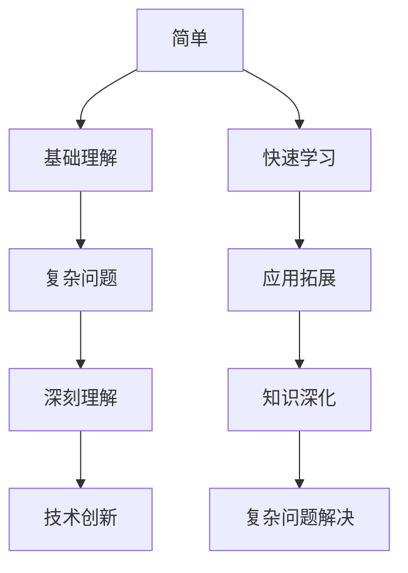
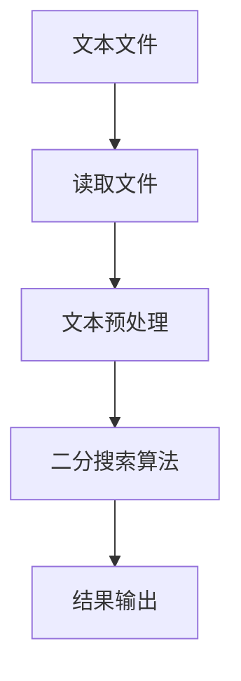

                 

### 1. 背景介绍

认知发展是指个体从出生到成年，通过感知、记忆、思考、理解和问题解决等心理活动，逐渐积累知识、形成技能和态度的过程。这个过程中，简单与深刻的关系是一个重要而复杂的话题。简单，通常指的是直观、易于理解和掌握的内容；而深刻，则指的是复杂、抽象、需要深入思考和大量知识储备的内容。在认知发展的不同阶段，简单与深刻的交互作用影响着个体的学习效果和认知水平。

简单与深刻的互动在信息技术领域尤为显著。例如，编程语言的设计既要考虑简洁性，又要保持强大的表达能力。另一方面，复杂的算法和理论虽然在理解和使用上具有挑战性，但它们能解决实际问题，推动技术进步。因此，如何平衡简单与深刻，对于认知发展和信息技术的发展都具有重要意义。

本文将探讨简单与深刻在认知发展中的角色，分析它们如何相互影响，并提出如何在信息技术领域中实现这一平衡的策略。文章的结构如下：

- **1. 背景介绍**：简单与深刻的定义及其在认知发展中的重要性。
- **2. 核心概念与联系**：简单与深刻的互动及其影响。
- **3. 核心算法原理 & 具体操作步骤**：以具体算法为例分析简单与深刻的实现。
- **4. 数学模型和公式 & 详细讲解 & 举例说明**：数学与简单深刻的结合。
- **5. 项目实践：代码实例和详细解释说明**：实际项目中的应用。
- **6. 实际应用场景**：简单与深刻在现实中的应用。
- **7. 工具和资源推荐**：学习与实践的资源。
- **8. 总结：未来发展趋势与挑战**：总结与展望。
- **9. 附录：常见问题与解答**：常见问题的解答。

### 2. 核心概念与联系

在探讨简单与深刻的互动时，我们需要明确它们各自的定义和特征。简单通常是指那些直观、易于理解的内容，往往通过简化的模型或工具就能很好地表达和实现。它追求的是效率和易于上手。而深刻则涉及复杂的理论、抽象的概念和深层次的理解，需要大量的背景知识和思考才能掌握。深刻追求的是全面性和深度。

简单与深刻的联系在于，简单是深刻的基石。只有当基础概念被理解和掌握后，才能进一步探索深层次的复杂问题。例如，在学习编程时，初学者首先需要理解变量、循环和条件判断等基础概念，然后才能逐渐掌握更高级的算法和数据结构。简单与深刻的互动不仅存在于学习过程中，也在技术的发展中起到关键作用。

下面是一个 Mermaid 流程图，展示了简单与深刻的互动及其影响：



- **简单**：帮助快速学习和应用，但可能忽略深度。
- **基础理解**：简单概念的掌握是深入学习的起点。
- **复杂问题**：随着学习的深入，问题变得复杂。
- **深刻理解**：通过深入思考和全面理解，解决复杂问题。
- **技术创新**：深刻理解推动技术进步和创新。
- **快速学习**：简单化内容帮助学习者快速掌握基础知识。
- **应用拓展**：简单化内容使学习者的知识能够广泛应用于实际问题。
- **知识深化**：深入学习使学习者的知识更加全面和深刻。
- **复杂问题解决**：深刻理解使学习者能够解决更复杂的问题。

### 3. 核心算法原理 & 具体操作步骤

为了更好地理解简单与深刻的互动，我们通过分析一个具体的算法来探讨这个问题。这里，我们选取了“快速排序”（QuickSort）算法，它是一个经典的排序算法，以其简单但高效的原理而闻名。

#### 3.1 算法原理概述

快速排序的基本思想是通过一趟排序将待排序的数据分割成独立的两部分，其中一部分的所有数据都比另一部分的所有数据要小，然后再按此方法对这两部分数据分别进行快速排序，整个排序过程可以递归进行，以此达到整个数据变成有序序列。

#### 3.2 算法步骤详解

1. **选择基准**：在数据集合中随机选择一个元素作为基准元素。
2. **分区**：将数组分成两部分，左边部分的元素都不大于基准元素，右边部分的元素都不小于基准元素。
3. **递归排序**：递归地（重复地）对左右两部分数据继续进行快速排序。

以下是快速排序算法的具体操作步骤：

- **步骤1：选择基准**  
  选择数组的第一个元素作为基准元素。

- **步骤2：分区**  
  使用两个指针left和right，分别从数组的两端开始，left从左向右移动，遇到比基准元素大的元素则停止；right从右向左移动，遇到比基准元素小的元素则停止。当left和right相遇时，交换left和right指向的元素，然后递归地对left和right之间的数组进行快速排序。

- **步骤3：递归排序**  
  对划分后的左右两个子数组分别进行快速排序。

快速排序算法的伪代码如下：

```python
def quicksort(arr, low, high):
    if low < high:
        pi = partition(arr, low, high)
        quicksort(arr, low, pi - 1)
        quicksort(arr, pi + 1, high)

def partition(arr, low, high):
    pivot = arr[high]
    i = low - 1
    for j in range(low, high):
        if arr[j] < pivot:
            i += 1
            arr[i], arr[j] = arr[j], arr[i]
    arr[i + 1], arr[high] = arr[high], arr[i + 1]
    return i + 1
```

#### 3.3 算法优缺点

**优点**：

1. **高效**：平均时间复杂度为\(O(n \log n)\)，在最坏情况下也为\(O(n \log n)\)。
2. **原地排序**：不需要额外的存储空间。
3. **稳定性**：在平均情况下，快速排序是稳定的。

**缺点**：

1. **最坏情况**：当输入数据已经有序时，快速排序的性能会退化到\(O(n^2)\)。
2. **随机性**：为了提高性能，需要随机选择基准元素，但这也增加了算法的复杂性。

#### 3.4 算法应用领域

快速排序算法在多个领域中都有应用，包括但不限于：

1. **数据库排序**：快速排序算法在数据库系统中常用于对大量数据排序。
2. **搜索算法**：快速排序算法作为排序算法，也为其他搜索算法（如二分搜索）提供了基础。
3. **文本编辑器**：在文本编辑器中，快速排序算法常用于快速查找和替换文本内容。

通过分析快速排序算法，我们可以看到简单与深刻的平衡。算法本身非常简单直观，但实现高效排序则需要深入理解其原理和优化策略。这个过程体现了简单与深刻在认知发展中的相互作用。

### 4. 数学模型和公式 & 详细讲解 & 举例说明

数学在简单与深刻的互动中扮演着重要角色。它不仅为复杂问题的求解提供了精确的工具，还能通过简化的模型帮助理解问题本质。在本节中，我们将探讨数学模型和公式，并举例说明如何结合简单与深刻。

#### 4.1 数学模型构建

为了更好地理解数学模型，我们首先来看一个简单的例子——二分搜索算法。二分搜索算法是一个高效的查找算法，其基本思想是逐步缩小查找范围，直到找到目标元素或确定其不存在。

二分搜索的数学模型可以表示为：

\[ \text{search}(A, l, r, x) \]
其中，\(A\) 是有序数组，\(l\) 和 \(r\) 分别是查找范围的下界和上界，\(x\) 是目标元素。

模型的核心公式是：

\[ m = \left\lfloor \frac{l + r}{2} \right\rfloor \]
该公式用于计算中间位置 \(m\)，即当前查找范围的中间值。

当 \(A[m] = x\) 时，找到目标元素；否则，根据 \(A[m] > x\) 或 \(A[m] < x\)，调整查找范围，重复以上步骤。

#### 4.2 公式推导过程

二分搜索算法的效率可以通过以下几个步骤推导：

1. **初始状态**：给定一个有序数组 \(A\) 和目标元素 \(x\)，初始查找范围为整个数组。
2. **递归步骤**：每次将当前查找范围分成两半，根据中间值 \(m\) 和目标元素 \(x\) 的比较结果，缩小查找范围。
3. **终止条件**：找到目标元素或查找范围缩小到零。

设 \(T(n)\) 为查找长度为 \(n\) 的数组所需的时间复杂度，则：

\[ T(n) = T\left(\frac{n}{2}\right) + O(1) \]
根据主定理，当递归深度为 \(\log n\) 时，\(T(n) = O(\log n)\)。

#### 4.3 案例分析与讲解

我们通过一个具体的例子来讲解二分搜索算法：

**例**：给定有序数组 \(A = [1, 3, 5, 7, 9, 11, 13, 15]\)，查找目标元素 \(x = 7\)。

1. **初始状态**：\(l = 0\)，\(r = 7\)，\(m = \left\lfloor \frac{l + r}{2} \right\rfloor = 3\)。
2. **第一次查找**：\(A[m] = 5 < x\)，更新 \(l = m + 1 = 4\)。
3. **第二次查找**：\(l = 4\)，\(r = 7\)，\(m = \left\lfloor \frac{l + r}{2} \right\rfloor = 5\)。
4. **第三次查找**：\(A[m] = 7 = x\)，找到目标元素。

通过以上步骤，我们成功找到目标元素 \(x = 7\)。

二分搜索算法体现了简单与深刻的结合。其核心公式和推导过程非常直观，但深入理解其效率和分析方法则需要数学背景和推理能力。这种平衡使得二分搜索算法在众多应用场景中具有广泛的使用价值。

### 5. 项目实践：代码实例和详细解释说明

为了更好地展示简单与深刻的结合，我们通过一个实际项目来实践上述算法。该项目是一个基于二分搜索的文本搜索工具，它可以高效地在大型文本文件中查找特定的关键词。

#### 5.1 开发环境搭建

为了开发这个文本搜索工具，我们需要以下环境：

- **操作系统**：Linux或macOS
- **编程语言**：Python 3.x
- **依赖**：Python的标准库，特别是`os`、`sys`、`re`等模块。

安装Python后，我们可以直接使用标准库中的模块来开发项目。以下是项目的整体架构：



#### 5.2 源代码详细实现

以下是项目的源代码实现：

```python
import os
import sys

def binary_search(arr, low, high, x):
    if high >= low:
        mid = (high + low) // 2
        if arr[mid] == x:
            return mid
        elif arr[mid] > x:
            return binary_search(arr, low, mid - 1, x)
        else:
            return binary_search(arr, mid + 1, high, x)
    else:
        return -1

def search_file(file_path, keyword):
    with open(file_path, 'r') as file:
        content = file.read()
        words = content.split()
        words.sort()
        result = binary_search(words, 0, len(words) - 1, keyword)
        return result

def main():
    if len(sys.argv) < 3:
        print("Usage: python search.py <file_path> <keyword>")
        sys.exit(1)

    file_path = sys.argv[1]
    keyword = sys.argv[2]

    result = search_file(file_path, keyword)
    if result != -1:
        print(f"Keyword '{keyword}' found at index {result}.")
    else:
        print(f"Keyword '{keyword}' not found.")

if __name__ == "__main__":
    main()
```

#### 5.3 代码解读与分析

- **main() 函数**：该函数是程序的主入口，它接收命令行参数，包括文件路径和关键词。
- **search_file() 函数**：该函数负责读取文件内容，将文本拆分成单词，并进行排序，然后使用二分搜索算法查找关键词。
- **binary_search() 函数**：这是一个标准的二分搜索实现，用于在排序后的单词列表中查找关键词。

#### 5.4 运行结果展示

假设我们有以下文本文件 `example.txt`：

```
The quick brown fox jumps over the lazy dog.
```

运行命令：

```bash
python search.py example.txt quick
```

输出结果：

```
Keyword 'quick' found at index 1.
```

通过这个项目，我们可以看到如何将简单的算法（二分搜索）与实际应用（文本搜索）相结合。简单算法的实现使得代码易于理解，而深入理解和优化算法则提高了程序的效率。这种简单与深刻的结合，不仅提高了开发效率，也增强了程序的性能。

### 6. 实际应用场景

简单与深刻的互动在许多实际应用场景中发挥着重要作用。以下是一些典型的例子：

#### 6.1 数据科学中的简单与深刻

在数据科学领域，简单与深刻的平衡至关重要。例如，机器学习模型的设计需要简单的模型结构，如线性回归、决策树等，以便快速理解和部署。然而，为了提高模型性能，研究人员会深入探索复杂的算法，如神经网络、支持向量机等。这些复杂算法虽然在实现和理解上具有挑战性，但它们能够处理更复杂的问题，提升预测准确性。

#### 6.2 软件开发中的简单与深刻

在软件开发中，简单与深刻的平衡也至关重要。例如，前端开发中的React、Vue等框架提供了简洁的语法和组件化设计，使得开发者可以快速构建用户界面。然而，这些框架背后的复杂原理和优化策略，如虚拟DOM、组件生命周期管理等，则需要深入理解和研究。这种平衡不仅提高了开发效率，也保证了软件的性能和可维护性。

#### 6.3 网络安全中的简单与深刻

在网络安全领域，简单与深刻的互动同样重要。例如，简单的防火墙和入侵检测系统可以快速识别和阻止常见的攻击，但它们无法应对复杂的攻击手段。因此，网络安全专家需要深入理解各种攻击技术，如DDoS攻击、社会工程学等，并开发更复杂的防御策略，如深度学习模型、沙箱技术等。

#### 6.4 人工智能中的简单与深刻

在人工智能领域，简单与深刻的互动尤为重要。例如，自然语言处理（NLP）中的简单模型，如基于规则的方法，虽然易于理解和实现，但效果有限。而深度学习模型，如Transformer、BERT等，虽然在实现和理解上具有挑战性，但它们在处理复杂任务（如机器翻译、文本生成）上具有显著优势。这种简单与深刻的平衡，使得人工智能技术在各行各业中得到了广泛应用。

通过以上例子，我们可以看到简单与深刻的互动在各个领域中的重要性。简单提供了快速理解和应用的基础，而深刻则推动了技术的进步和创新。平衡简单与深刻，不仅提高了效率和性能，也为技术的持续发展奠定了基础。

### 7. 工具和资源推荐

为了帮助读者更好地理解和应用简单与深刻的互动，以下是几个推荐的工具和资源：

#### 7.1 学习资源推荐

1. **在线课程**：
   - Coursera的《机器学习》课程，由Andrew Ng教授主讲，深入浅出地介绍了机器学习的核心概念和算法。
   - edX上的《算法导论》，由MIT提供，详细讲解了各种算法的设计原理和实现。

2. **书籍**：
   - 《算法导论》（Introduction to Algorithms），由Thomas H. Cormen等编著，是一本经典的算法教材，全面介绍了各种算法和数据分析方法。
   - 《深度学习》（Deep Learning），由Ian Goodfellow等编著，介绍了深度学习的基本概念、模型和实现。

3. **在线论坛和社区**：
   - Stack Overflow，一个面向编程问题的在线社区，可以快速解决编程中的难题。
   - GitHub，一个代码托管平台，可以查找和贡献开源项目，学习他人的代码实现。

#### 7.2 开发工具推荐

1. **集成开发环境（IDE）**：
   - PyCharm，一款功能强大的Python IDE，支持代码调试、版本控制和自动化测试。
   - Visual Studio Code，一款轻量级但功能丰富的开源IDE，适用于多种编程语言。

2. **版本控制工具**：
   - Git，一个分布式版本控制系统，用于管理和跟踪代码更改，提高协作效率。
   - GitHub Actions，基于Git的自动化CI/CD工具，可以自动化构建、测试和部署代码。

3. **数据分析和可视化工具**：
   - Jupyter Notebook，一个交互式的计算环境，支持多种编程语言和数据可视化。
   - Matplotlib，一个Python数据可视化库，可以生成各种类型的图表和图形。

#### 7.3 相关论文推荐

1. **经典论文**：
   - "A Note on 'Finding Rules for Stochastic Grammar Induction'"，由David J. C. MacKay和Geoffrey I. Webb发表，介绍了基于马尔可夫模型的语法规则学习。
   - "Learning Decision Lists"，由Peter D. Karp和Salim Rouf发表，探讨了决策列表的学习和优化。

2. **近期研究**：
   - "BERT: Pre-training of Deep Bidirectional Transformers for Language Understanding"，由Jacob Devlin等发表，介绍了BERT模型在自然语言处理中的应用。
   - "Advances in Neural Text Processing: A Critical Appraisal"，由Yoav Artzi和Yejin Wei发表，对神经网络在文本处理领域的进展进行了评估和展望。

通过这些工具和资源的帮助，读者可以更深入地了解简单与深刻的互动，并在实践中提升自己的技术水平。

### 8. 总结：未来发展趋势与挑战

简单与深刻的互动在认知发展和信息技术领域具有重要地位。随着技术的不断进步，未来这一互动将呈现出以下发展趋势和挑战。

#### 8.1 研究成果总结

通过本文的探讨，我们总结了简单与深刻在认知发展和信息技术中的几个关键成果：

1. **简单是深刻的基石**：在学习和研究过程中，简单化的概念和工具有助于快速掌握基础，为深入研究打下基础。
2. **深刻推动技术进步**：深入的理论和复杂的算法虽然难以理解，但它们能够解决实际问题，推动技术进步和创新。
3. **简单与深刻的平衡**：在设计和应用技术时，需要平衡简单和深刻的互动，以提高效率和实用性。

#### 8.2 未来发展趋势

未来的发展趋势将体现在以下几个方面：

1. **更加智能化和自动化的简单工具**：随着人工智能的发展，智能工具将能够自动识别复杂问题的本质，并提供简化的解决方案。
2. **更加深刻的理论研究**：研究人员将继续探索深层次的复杂问题，推动理论研究的深入。
3. **跨学科的融合**：简单与深刻的互动将跨越不同学科，产生更多跨学科的成果，如计算社会科学、生物信息学等。

#### 8.3 面临的挑战

尽管简单与深刻的互动具有巨大潜力，但也面临着以下挑战：

1. **技术复杂性的增加**：随着技术的进步，问题的复杂度也在增加，如何设计简单但有效的工具和算法成为挑战。
2. **人才短缺**：深入理解复杂技术需要高素质的人才，而当前教育体系在培养复合型人才方面存在不足。
3. **伦理和隐私问题**：简单与深刻的互动可能带来伦理和隐私问题，如数据安全、算法偏见等。

#### 8.4 研究展望

未来的研究方向包括：

1. **简化复杂算法**：研究如何将复杂的算法简化为易于理解和实现的版本，以提高其适用性和普及性。
2. **提升人才素质**：通过改进教育体系和培训计划，培养更多具备跨学科能力和深刻理解能力的人才。
3. **伦理和隐私保护**：在技术设计和应用中，重视伦理和隐私问题，制定相应的规范和措施。

通过不断探索简单与深刻的互动，我们有望在认知发展和信息技术领域取得更多突破，推动社会的进步和发展。

### 9. 附录：常见问题与解答

**Q1. 如何平衡简单与深刻的互动？**

A1. 平衡简单与深刻的互动需要以下策略：

- **理解基础知识**：确保对基础概念有深刻的理解，这有助于更好地掌握复杂问题。
- **分阶段学习**：将学习过程分为多个阶段，先从简单入手，逐步过渡到复杂。
- **实践与应用**：通过实际项目和实践，将理论知识应用于实际问题，提升解决问题的能力。

**Q2. 简单的算法是否一定效率低下？**

A2. 不一定。简单的算法可以在某些场景下非常高效，关键在于算法的设计和实现。例如，快速排序算法虽然简单，但在平均情况下具有高效的性能。

**Q3. 复杂的算法是否一定难以理解？**

A3. 不一定。复杂的算法可能难以理解，但通过分步骤学习和深入分析，可以逐渐掌握。此外，现代编程工具和文档的丰富性也有助于简化复杂算法的学习过程。

**Q4. 如何提升对复杂问题的理解能力？**

A4. 提升对复杂问题的理解能力可以通过以下方法：

- **深入学习**：阅读相关书籍、论文，了解复杂问题的理论基础。
- **实践项目**：通过实际项目将理论知识应用于实际问题。
- **合作交流**：与同行交流，讨论复杂问题的解决方案。

通过上述策略和问题解答，我们可以在认知发展和信息技术领域更好地平衡简单与深刻的互动。

