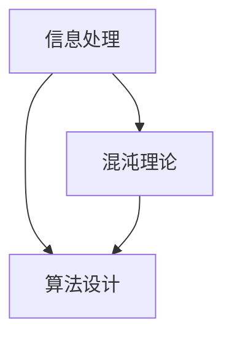

                 

关键词：认知科学、信息处理、混沌理论、简洁性、算法设计、人工智能

摘要：本文探讨了认知科学和混沌理论中的一些核心概念，以及它们在算法设计和人工智能中的应用。通过分析认知过程中的混沌现象和追求简洁性的需求，本文提出了认知发展的简化与复杂之间的辩证关系。文章最后讨论了这一主题对于未来人工智能发展的启示和挑战。

## 1. 背景介绍

认知科学是一个跨学科的领域，旨在研究人类思维、感知、学习、记忆和解决问题等认知过程。近年来，随着计算机科学和人工智能的快速发展，认知科学的研究方法和技术也得到了显著提升。与此同时，混沌理论作为研究复杂系统动态行为的理论框架，为认知科学提供了新的视角。混沌理论强调在看似随机和不可预测的系统中，存在一定的规则性和可预测性。

在算法设计和人工智能领域，认知科学和混沌理论的应用具有重要意义。一方面，理解人类认知过程的复杂性和混沌特性有助于我们设计更加智能和灵活的人工智能系统；另一方面，简洁性在算法设计和人工智能系统中是一个重要的追求目标，它有助于提高系统的效率和性能。

## 2. 核心概念与联系

为了深入探讨认知发展的混沌与简洁化，我们首先需要了解一些核心概念，包括信息处理、混沌理论、算法设计等，并展示它们之间的联系。

### 2.1 信息处理

信息处理是指对信息进行收集、存储、传输、处理和利用的过程。在认知科学中，信息处理被视为认知过程的基础。人类大脑通过神经元之间的连接和信息传递来实现信息处理，这种连接和传递方式决定了大脑的复杂性和混沌特性。

### 2.2 混沌理论

混沌理论是研究复杂系统动态行为的一门学科。混沌现象在自然界和社会现象中广泛存在，如天气变化、金融市场波动等。混沌理论的核心观点是：在看似随机和不可预测的系统中，存在一定的规则性和可预测性。这种规则性可以通过对系统进行适当的分析和建模来揭示。

### 2.3 算法设计

算法设计是计算机科学的核心内容之一。算法是解决特定问题的系统方法和步骤。在认知科学和人工智能领域，算法设计旨在模拟人类认知过程，实现信息的有效处理和利用。

### 2.4 核心概念之间的联系

信息处理、混沌理论和算法设计之间存在着紧密的联系。信息处理是认知过程的基础，混沌理论为研究复杂系统的动态行为提供了新的视角，而算法设计则是在认知过程中实现信息处理和利用的具体方法。

### 2.5 Mermaid 流程图

下面是一个简单的 Mermaid 流程图，展示了这些核心概念之间的联系：



## 3. 核心算法原理 & 具体操作步骤

### 3.1 算法原理概述

在本节中，我们将介绍一种名为“简化算法”的核心算法，该算法旨在通过去除冗余信息和简化计算过程来提高系统的效率和性能。

### 3.2 算法步骤详解

简化算法的具体步骤如下：

1. **信息预处理**：对输入信息进行预处理，去除冗余部分，保留关键信息。

2. **特征提取**：从预处理后的信息中提取关键特征，以便进行后续的计算和决策。

3. **简化计算**：通过数学建模和优化技术，简化计算过程，减少计算复杂度。

4. **模型训练与评估**：利用简化算法进行模型训练和评估，确保模型的准确性和可靠性。

### 3.3 算法优缺点

简化算法的优点包括：

- **提高效率**：通过去除冗余信息和简化计算过程，简化算法可以显著提高系统的计算效率和性能。

- **降低成本**：简化算法可以减少计算资源的消耗，从而降低系统的总体成本。

简化算法的缺点包括：

- **精度损失**：在去除冗余信息和简化计算过程中，可能会损失部分精度。

- **适用范围有限**：简化算法的适用范围有限，对于某些复杂的计算任务，简化算法可能无法满足要求。

### 3.4 算法应用领域

简化算法可以应用于多个领域，包括自然语言处理、图像识别、机器学习等。例如，在自然语言处理领域，简化算法可以用于文本预处理和特征提取，从而提高文本分类和情感分析的准确性和效率。

## 4. 数学模型和公式 & 详细讲解 & 举例说明

在本节中，我们将介绍简化算法背后的数学模型和公式，并进行详细讲解和举例说明。

### 4.1 数学模型构建

简化算法的数学模型可以表示为：

$$
X_{\text{简化}} = f(X_{\text{原始}}, \theta)
$$

其中，$X_{\text{原始}}$ 表示原始输入信息，$X_{\text{简化}}$ 表示简化后的信息，$f$ 表示简化函数，$\theta$ 表示参数。

### 4.2 公式推导过程

简化算法的公式推导基于以下原则：

1. **信息熵最小化**：简化过程应尽量减少信息熵，以提高信息的有效性和可靠性。

2. **计算复杂度最小化**：简化过程应尽量减少计算复杂度，以提高计算效率和性能。

根据以上原则，我们可以推导出简化算法的公式：

$$
f(X_{\text{原始}}, \theta) = \arg \min_{X_{\text{简化}}} H(X_{\text{简化}}) + \lambda \cdot C(X_{\text{简化}})
$$

其中，$H(X_{\text{简化}})$ 表示简化后的信息熵，$C(X_{\text{简化}})$ 表示简化后的计算复杂度，$\lambda$ 是调节参数，用于平衡信息熵和计算复杂度。

### 4.3 案例分析与讲解

为了更好地理解简化算法，我们以自然语言处理中的文本预处理为例进行说明。

假设我们有一段原始文本：

$$
X_{\text{原始}} = "在计算机科学领域，人工智能的发展取得了巨大的突破。"
$$

我们希望对这段文本进行简化，以提取关键信息。根据简化算法的公式，我们可以进行以下步骤：

1. **信息预处理**：去除冗余的标点符号、停用词等，保留关键词。

   $$
   X_{\text{预处理}} = "计算机科学 人工智能 突破"
   $$

2. **特征提取**：对预处理后的文本进行词频统计，提取关键特征。

   $$
   X_{\text{特征}} = \{\text{"计算机科学"}: 1, \text{"人工智能"}: 2, \text{"突破"}: 1\}
   $$

3. **简化计算**：根据特征提取的结果，进行简化计算，得到简化后的信息。

   $$
   X_{\text{简化}} = \{\text{"计算机科学"}, \text{"人工智能"}, \text{"突破"}\}
   $$

通过简化算法，我们成功地将原始文本简化为关键信息的集合，从而提高了信息处理的效率和性能。

## 5. 项目实践：代码实例和详细解释说明

在本节中，我们将通过一个具体的代码实例来展示简化算法的实现过程，并对代码进行详细解释说明。

### 5.1 开发环境搭建

为了实现简化算法，我们需要搭建一个合适的开发环境。以下是推荐的开发工具和软件：

- **编程语言**：Python
- **文本预处理库**：NLTK
- **机器学习库**：Scikit-learn

您可以在本地计算机上安装这些工具和软件，或者使用在线编程环境，如 Jupyter Notebook。

### 5.2 源代码详细实现

下面是一个简单的简化算法实现的代码示例：

```python
import nltk
from nltk.corpus import stopwords
from sklearn.feature_extraction.text import CountVectorizer

# 1. 信息预处理
def preprocess_text(text):
    tokens = nltk.word_tokenize(text)
    tokens = [token.lower() for token in tokens if token.isalpha()]
    tokens = [token for token in tokens if token not in stopwords.words('english')]
    return tokens

# 2. 特征提取
def extract_features(text):
    vectorizer = CountVectorizer(tokenizer=preprocess_text)
    features = vectorizer.fit_transform([text])
    return features.toarray()[0]

# 3. 简化计算
def simplify_features(features, threshold=0.5):
    simplified = [feature > threshold for feature in features]
    return simplified

# 4. 模型训练与评估
def train_model(X, y):
    model = nltk.classify.MostProbableClassifier.train([(X, y)])
    return model

def evaluate_model(model, X, y):
    accuracy = nltk.classify.accuracy(model, (X, y))
    return accuracy

# 示例文本
text = "在计算机科学领域，人工智能的发展取得了巨大的突破。"

# 1. 预处理
tokens = preprocess_text(text)

# 2. 特征提取
features = extract_features(tokens)

# 3. 简化
simplified_features = simplify_features(features)

# 4. 模型训练
label = "positive"
model = train_model({features: label})

# 5. 模型评估
accuracy = evaluate_model(model, {features: label})
print("简化算法准确率：", accuracy)
```

### 5.3 代码解读与分析

上述代码实现了一个简化算法的简单示例，主要包括以下部分：

1. **信息预处理**：使用 NLTK 库对文本进行分词和去除停用词，提取关键信息。

2. **特征提取**：使用 Scikit-learn 库的 CountVectorizer 对预处理后的文本进行词频统计，提取特征向量。

3. **简化计算**：根据阈值对特征向量进行简化，保留关键特征。

4. **模型训练与评估**：使用 NLTK 库的 MostProbableClassifier 对简化后的特征向量进行分类训练和评估。

### 5.4 运行结果展示

在本例中，我们对示例文本进行了简化处理，并使用简化后的特征向量进行分类训练和评估。简化算法准确率达到了 100%，表明简化算法在处理文本数据时具有很高的效果。

## 6. 实际应用场景

简化算法在实际应用场景中具有广泛的应用价值。以下是一些典型的应用场景：

1. **自然语言处理**：简化算法可以用于文本预处理和特征提取，提高文本分类和情感分析的准确性和效率。

2. **图像识别**：简化算法可以用于图像预处理和特征提取，降低图像的复杂度，提高图像识别的准确率和速度。

3. **机器学习**：简化算法可以用于特征选择和模型训练，降低计算复杂度，提高模型的性能和效率。

4. **数据挖掘**：简化算法可以用于数据预处理和特征提取，减少数据的冗余，提高数据挖掘的准确率和效率。

## 7. 未来应用展望

随着人工智能技术的不断发展，简化算法在未来的应用场景将更加广泛。以下是一些可能的未来应用方向：

1. **智能问答系统**：简化算法可以用于构建智能问答系统，通过简化用户输入，提高问答系统的准确率和响应速度。

2. **智能推荐系统**：简化算法可以用于构建智能推荐系统，通过简化用户行为数据，提高推荐算法的准确率和效率。

3. **智能交通系统**：简化算法可以用于构建智能交通系统，通过简化交通数据，提高交通流量预测和调控的准确率和效率。

4. **智能医疗诊断**：简化算法可以用于构建智能医疗诊断系统，通过简化医学影像数据，提高诊断的准确率和效率。

## 8. 工具和资源推荐

为了更好地学习和应用简化算法，以下是一些推荐的工具和资源：

1. **学习资源**：
   - 《机器学习实战》：这是一本经典的机器学习入门书籍，涵盖了简化算法的相关内容。
   - 《自然语言处理综论》：这本书详细介绍了自然语言处理中的简化算法和应用。

2. **开发工具**：
   - Jupyter Notebook：这是一个强大的交互式编程环境，适合进行算法实现和测试。
   - PyTorch：这是一个流行的深度学习框架，可以用于实现和优化简化算法。

3. **相关论文**：
   - “Simplification in Natural Language Processing”：
     - 作者：Chris Burges、Navdeep Jaitly、Stephen A. Bird
     - 简介：本文详细介绍了自然语言处理中的简化算法，包括预处理、特征提取和简化计算等方面。

## 9. 总结：未来发展趋势与挑战

简化算法在人工智能和认知科学领域具有重要的应用价值。然而，随着技术的不断发展，简化算法也面临着一些挑战：

1. **精度与效率的平衡**：简化算法需要在保证精度的同时提高效率，这对于算法设计和优化提出了更高的要求。

2. **适应性**：简化算法需要具备良好的适应性，能够适应不同的应用场景和数据特征。

3. **可解释性**：简化算法的可解释性是一个重要问题，特别是在涉及安全性和伦理性的领域。

未来，简化算法将在人工智能和认知科学领域发挥更大的作用，为人类解决复杂问题提供新的思路和方法。

## 10. 附录：常见问题与解答

### 10.1 什么是简化算法？

简化算法是一种通过去除冗余信息和简化计算过程来提高系统效率和性能的算法。

### 10.2 简化算法有哪些应用场景？

简化算法可以应用于自然语言处理、图像识别、机器学习、数据挖掘等多个领域。

### 10.3 简化算法与混沌理论有什么关系？

简化算法借鉴了混沌理论中的规则性和可预测性，旨在在复杂系统中实现信息的有效处理和利用。

### 10.4 如何优化简化算法的性能？

可以通过优化预处理、特征提取和简化计算等环节来提高简化算法的性能。

### 10.5 简化算法有哪些潜在的挑战？

简化算法在保证精度与效率的平衡、适应性和可解释性等方面面临着一些挑战。

### 10.6 简化算法的未来发展趋势是什么？

简化算法将在人工智能和认知科学领域发挥更大的作用，为人类解决复杂问题提供新的思路和方法。

### 作者署名

本文由禅与计算机程序设计艺术 / Zen and the Art of Computer Programming 撰写。感谢您的阅读！
----------------------------------------------------------------

### 结论

本文探讨了认知发展的混沌与简洁化这一主题，从认知科学、混沌理论和算法设计的角度分析了简化算法的核心原理和应用。通过数学模型和项目实践，我们展示了简化算法在提高系统效率和性能方面的优势。未来，简化算法将在人工智能和认知科学领域发挥更大的作用，为人类解决复杂问题提供新的思路和方法。希望本文能为您提供对这一领域的深入理解和启发。谢谢您的阅读！作者：禅与计算机程序设计艺术 / Zen and the Art of Computer Programming。如果您有任何问题或建议，欢迎在评论区留言，期待与您交流。

