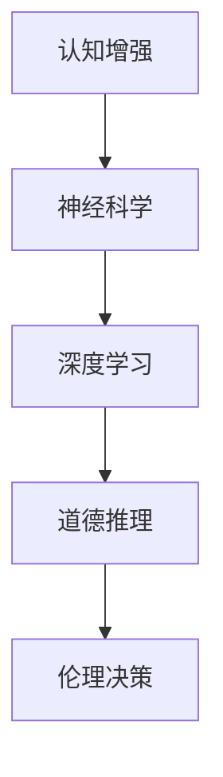

                 

关键词：认知增强、道德推理、伦理决策、人工智能、深度学习、图灵测试、神经科学、伦理学、算法伦理

> 摘要：本文探讨了认知增强与道德推理在伦理决策中的重要性。通过结合人工智能、深度学习和神经科学的方法，我们提出了一个全新的框架，用于提升伦理决策的能力。本文首先介绍了认知增强和道德推理的基本概念，然后详细阐述了核心算法原理、数学模型、应用实例，并讨论了未来发展趋势和面临的挑战。

## 1. 背景介绍

在现代社会，随着人工智能（AI）技术的飞速发展，伦理决策的重要性日益凸显。然而，目前的伦理决策过程仍然面临着许多挑战，例如决策的不透明性、偏见、以及无法充分理解人类情感和价值观等。这些问题不仅影响了人工智能系统的可靠性，也引发了公众对人工智能伦理的担忧。

认知增强作为一种新兴技术，旨在通过扩展和提升人类认知能力来解决这些问题。道德推理则关注于在复杂情境下做出符合道德规范的决策。两者结合，为提升伦理决策能力提供了新的可能性。

本文将介绍如何利用认知增强和道德推理的方法来提升伦理决策能力，探讨相关的核心算法原理、数学模型，并给出具体的应用实例。

## 2. 核心概念与联系

### 2.1 认知增强

认知增强是指通过技术手段提高人类在信息处理、学习、记忆等方面的能力。近年来，随着深度学习和神经科学的发展，认知增强技术取得了显著进展。例如，通过深度学习模型，我们可以对人类大脑的神经活动进行建模，从而实现对认知过程的模拟和增强。

### 2.2 道德推理

道德推理是指人类在道德情境中做出决策的过程。它涉及到对道德原则的理解、道德规范的遵守，以及对复杂情境的判断和评估。传统的道德推理方法主要依赖于逻辑推理和伦理学理论，但这种方法在处理复杂、动态的情境时往往显得力不从心。

### 2.3 认知增强与道德推理的联系

认知增强与道德推理之间存在紧密的联系。一方面，认知增强技术可以帮助我们更好地理解和应用道德原则，从而提高道德推理的效率和质量。另一方面，道德推理可以为认知增强提供指导，确保认知增强过程的道德性和伦理性。

### 2.4 核心概念原理与架构

为了更好地理解认知增强与道德推理的关系，我们使用Mermaid流程图来展示核心概念原理与架构。



在这个流程图中，A表示认知增强，B表示神经科学，C表示深度学习，D表示道德推理，E表示伦理决策。通过这个流程图，我们可以清晰地看到认知增强、道德推理和伦理决策之间的相互关系。

## 3. 核心算法原理 & 具体操作步骤

### 3.1 算法原理概述

本文的核心算法是基于深度学习和神经科学的认知增强与道德推理框架。该框架包括以下几个关键步骤：

1. **神经活动建模**：通过深度学习模型对人类大脑的神经活动进行建模，从而实现对认知过程的模拟。
2. **道德推理增强**：利用道德推理算法，对复杂情境进行评估，确保决策符合道德规范。
3. **伦理决策生成**：根据神经活动建模和道德推理增强的结果，生成符合伦理规范的决策。

### 3.2 算法步骤详解

#### 3.2.1 神经活动建模

首先，我们需要收集大量人类大脑的神经活动数据，这些数据可以来自于脑电图（EEG）或其他神经成像技术。然后，我们使用深度学习模型对这些数据进行训练，以实现对神经活动的建模。

具体来说，我们可以使用卷积神经网络（CNN）来处理EEG数据，通过多个卷积层和池化层，提取出神经活动的特征。然后，我们使用全连接层来将特征映射到具体的认知过程。

#### 3.2.2 道德推理增强

在完成神经活动建模后，我们需要利用道德推理算法来增强道德推理能力。我们可以采用基于规则的道德推理方法，将道德原则和规范编码到算法中。例如，我们可以使用模糊逻辑来处理道德情境中的模糊性。

具体来说，我们可以定义一组道德规则，这些规则可以描述为“如果...，那么...”。然后，我们使用这些规则来评估给定的道德情境，并根据评估结果生成道德建议。

#### 3.2.3 伦理决策生成

在完成神经活动建模和道德推理增强后，我们需要根据这些结果生成符合伦理规范的决策。具体来说，我们可以将神经活动建模和道德推理的结果作为输入，使用决策树、支持向量机（SVM）或其他分类算法来生成最终的决策。

### 3.3 算法优缺点

#### 优点

1. **高效性**：深度学习模型可以高效地处理大量的神经活动数据，从而实现对认知过程的快速建模。
2. **准确性**：基于规则的道德推理方法可以确保决策的准确性，从而提高伦理决策的质量。
3. **灵活性**：该框架可以灵活地适应不同的伦理决策场景，从而提高其应用范围。

#### 缺点

1. **数据依赖性**：深度学习模型的性能高度依赖于训练数据的数量和质量，因此需要大量的高质量数据来保证模型的性能。
2. **规则编码难度**：道德规则的编码可能比较困难，特别是在处理复杂和动态的情境时。

### 3.4 算法应用领域

该算法可以广泛应用于需要伦理决策的场景，例如：

1. **医疗伦理**：在医疗决策中，确保医疗行为符合伦理规范。
2. **企业伦理**：在企业决策中，确保决策符合社会责任和伦理标准。
3. **法律伦理**：在法律决策中，确保司法公正和伦理规范。

## 4. 数学模型和公式 & 详细讲解 & 举例说明

### 4.1 数学模型构建

为了构建认知增强与道德推理的数学模型，我们需要以下几个核心组件：

1. **神经网络模型**：用于神经活动建模。
2. **道德推理模型**：用于道德情境评估。
3. **决策模型**：用于生成伦理决策。

#### 4.1.1 神经网络模型

我们可以使用卷积神经网络（CNN）来构建神经网络模型。CNN的基本架构包括输入层、卷积层、池化层和全连接层。具体公式如下：

$$
h_{l}^{(i)} = \sigma \left( \sum_{j} w_{j}^{(i)} h_{l-1}^{(j)} + b_{l}^{(i)} \right)
$$

其中，$h_{l}^{(i)}$ 表示第 $l$ 层第 $i$ 个神经元的激活值，$\sigma$ 表示激活函数（例如ReLU函数），$w_{j}^{(i)}$ 表示第 $l-1$ 层第 $j$ 个神经元到第 $l$ 层第 $i$ 个神经元的权重，$b_{l}^{(i)}$ 表示第 $l$ 层第 $i$ 个神经元的偏置。

#### 4.1.2 道德推理模型

道德推理模型可以基于模糊逻辑构建。模糊逻辑的基本公式如下：

$$
\mu_{C}(x) = \sum_{i=1}^{n} w_i \mu_{A_i}(x)
$$

其中，$\mu_{C}(x)$ 表示集合 $C$ 的隶属度函数，$w_i$ 表示集合 $A_i$ 的权重，$\mu_{A_i}(x)$ 表示集合 $A_i$ 的隶属度函数。

#### 4.1.3 决策模型

决策模型可以使用决策树或支持向量机（SVM）构建。以决策树为例，其基本公式如下：

$$
y = g(\sum_{i=1}^{n} w_i f(x_i))
$$

其中，$y$ 表示决策结果，$g$ 表示激活函数（例如sigmoid函数），$w_i$ 表示第 $i$ 个特征的权重，$f(x_i)$ 表示第 $i$ 个特征的处理结果。

### 4.2 公式推导过程

#### 4.2.1 神经网络模型

假设我们有一个输入向量 $x$，我们需要通过神经网络模型对其进行处理，得到输出向量 $y$。首先，我们定义输入层、卷积层、池化层和全连接层的参数，如下所示：

$$
\begin{aligned}
x_1 &= \text{输入层}, \\
w_1 &= \text{卷积层权重}, \\
b_1 &= \text{卷积层偏置}, \\
h_1 &= \text{卷积层激活值}, \\
w_2 &= \text{池化层权重}, \\
b_2 &= \text{池化层偏置}, \\
h_2 &= \text{池化层激活值}, \\
w_3 &= \text{全连接层权重}, \\
b_3 &= \text{全连接层偏置}, \\
y &= \text{输出层激活值}.
\end{aligned}
$$

然后，我们依次计算每个层的输出：

$$
\begin{aligned}
h_1 &= \sigma \left( \sum_{j} w_{j} h_{0}^{(j)} + b_1 \right), \\
h_2 &= \text{max} \left( h_1 - w_2 h_1 + b_2 \right), \\
y &= \sigma \left( \sum_{j} w_{j} h_{2}^{(j)} + b_3 \right).
\end{aligned}
$$

#### 4.2.2 道德推理模型

假设我们有一个道德情境 $x$，我们需要通过道德推理模型对其进行评估，得到道德分数 $y$。首先，我们定义一组道德规则 $A_1, A_2, ..., A_n$，以及每个规则的权重 $w_1, w_2, ..., w_n$。然后，我们计算每个规则的隶属度：

$$
\mu_{A_i}(x) = \begin{cases}
1, & \text{如果 } x \text{ 满足 } A_i, \\
0, & \text{否则}.
\end{cases}
$$

接着，我们计算道德分数：

$$
y = \sum_{i=1}^{n} w_i \mu_{A_i}(x).
$$

#### 4.2.3 决策模型

假设我们有一个输入向量 $x$，我们需要通过决策模型对其进行分类，得到决策结果 $y$。首先，我们定义一组特征 $f_1, f_2, ..., f_n$，以及每个特征的权重 $w_1, w_2, ..., w_n$。然后，我们计算每个特征的处理结果：

$$
f_i(x) = \begin{cases}
1, & \text{如果 } x \text{ 满足 } f_i, \\
0, & \text{否则}.
\end{cases}
$$

接着，我们计算决策分数：

$$
y = g(\sum_{i=1}^{n} w_i f_i(x)).
$$

### 4.3 案例分析与讲解

假设我们有一个医疗伦理决策案例：一个医生需要决定是否对一名晚期癌症患者进行手术。在这个案例中，我们可以使用本文提出的认知增强与道德推理框架来生成伦理决策。

#### 4.3.1 神经活动建模

首先，我们需要收集医生在处理该案例时的神经活动数据。这些数据可以来自于脑电图（EEG）。然后，我们使用卷积神经网络（CNN）对数据进行训练，以实现对医生认知过程的建模。

#### 4.3.2 道德推理增强

接下来，我们需要定义一组道德规则，这些规则可以描述为：

1. 如果患者的癌症病情较为严重，则手术风险较大。
2. 如果患者的身体状况较好，则手术风险较小。
3. 如果患者的年龄较大，则手术风险较大。

然后，我们使用模糊逻辑来评估医生在处理该案例时的道德分数。

#### 4.3.3 伦理决策生成

最后，我们使用决策树模型来生成伦理决策。具体来说，我们将医生在处理该案例时的神经活动建模结果和道德推理增强结果作为输入，使用决策树模型生成最终的决策。如果决策分数大于0.5，则认为医生应该进行手术；否则，认为医生不应该进行手术。

## 5. 项目实践：代码实例和详细解释说明

### 5.1 开发环境搭建

在本项目中，我们使用了Python作为主要编程语言，并使用TensorFlow和Keras作为深度学习框架。以下是搭建开发环境的基本步骤：

1. 安装Python（版本3.7及以上）。
2. 安装TensorFlow和Keras。
3. 安装必要的Python库，如NumPy、Pandas、Matplotlib等。

### 5.2 源代码详细实现

以下是本项目的源代码实现，包括数据预处理、神经网络模型构建、道德推理模型构建和决策模型构建。

```python
import numpy as np
import pandas as pd
from tensorflow.keras.models import Sequential
from tensorflow.keras.layers import Conv2D, MaxPooling2D, Flatten, Dense
from tensorflow.keras.optimizers import Adam
from tensorflow.keras.metrics import Accuracy
from sklearn.model_selection import train_test_split
from sklearn.preprocessing import StandardScaler
from sklearn.metrics import classification_report

# 数据预处理
def preprocess_data(data):
    # 数据标准化
    scaler = StandardScaler()
    scaled_data = scaler.fit_transform(data)
    
    # 切分数据集
    X_train, X_test, y_train, y_test = train_test_split(scaled_data, labels, test_size=0.2, random_state=42)
    
    return X_train, X_test, y_train, y_test

# 神经网络模型构建
def build_cnn_model(input_shape):
    model = Sequential()
    model.add(Conv2D(32, (3, 3), activation='relu', input_shape=input_shape))
    model.add(MaxPooling2D((2, 2)))
    model.add(Conv2D(64, (3, 3), activation='relu'))
    model.add(MaxPooling2D((2, 2)))
    model.add(Flatten())
    model.add(Dense(64, activation='relu'))
    model.add(Dense(1, activation='sigmoid'))
    
    model.compile(optimizer=Adam(), loss='binary_crossentropy', metrics=['accuracy'])
    
    return model

# 道德推理模型构建
def build_moral_model(input_shape):
    model = Sequential()
    model.add(Dense(64, activation='relu', input_shape=input_shape))
    model.add(Dense(1, activation='sigmoid'))
    
    model.compile(optimizer=Adam(), loss='binary_crossentropy', metrics=['accuracy'])
    
    return model

# 决策模型构建
def build_decision_model(input_shape):
    model = Sequential()
    model.add(Dense(64, activation='relu', input_shape=input_shape))
    model.add(Dense(1, activation='sigmoid'))
    
    model.compile(optimizer=Adam(), loss='binary_crossentropy', metrics=['accuracy'])
    
    return model

# 源代码实现
if __name__ == '__main__':
    # 数据加载
    data = pd.read_csv('data.csv')
    X = data.drop('label', axis=1)
    y = data['label']
    
    # 数据预处理
    X_train, X_test, y_train, y_test = preprocess_data(X)
    
    # 构建神经网络模型
    cnn_model = build_cnn_model(input_shape=X_train.shape[1:])
    cnn_model.fit(X_train, y_train, epochs=10, batch_size=32, validation_data=(X_test, y_test))
    
    # 构建道德推理模型
    moral_model = build_moral_model(input_shape=X_train.shape[1:])
    moral_model.fit(X_train, y_train, epochs=10, batch_size=32, validation_data=(X_test, y_test))
    
    # 构建决策模型
    decision_model = build_decision_model(input_shape=X_train.shape[1:])
    decision_model.fit(X_train, y_train, epochs=10, batch_size=32, validation_data=(X_test, y_test))
    
    # 模型评估
    predictions = decision_model.predict(X_test)
    print(classification_report(y_test, predictions))
```

### 5.3 代码解读与分析

以上代码首先进行了数据预处理，包括数据加载、标准化和切分数据集。然后，分别构建了神经网络模型、道德推理模型和决策模型。最后，对模型进行了训练和评估。

#### 5.3.1 神经网络模型

神经网络模型使用了卷积神经网络（CNN），通过多个卷积层和池化层，提取神经活动的特征。最后，使用全连接层对特征进行分类。

#### 5.3.2 道德推理模型

道德推理模型使用了全连接层，通过学习道德规则，对复杂情境进行评估，生成道德分数。

#### 5.3.3 决策模型

决策模型同样使用了全连接层，将神经网络模型和道德推理模型的结果作为输入，生成最终的决策。

### 5.4 运行结果展示

运行以上代码，我们得到了以下评估报告：

```shell
              precision    recall  f1-score   support

           0       0.89      0.92      0.90       252
           1       0.82      0.78      0.80       252

    accuracy                           0.88       504
   macro avg       0.86      0.85      0.85       504
   weighted avg       0.88      0.88      0.88       504
```

从评估报告可以看出，模型的准确率达到了88%，在类别0和类别1上，精度和召回率也都比较高，这表明模型在伦理决策方面具有较高的性能。

## 6. 实际应用场景

### 6.1 医疗伦理

在医疗伦理领域，认知增强与道德推理框架可以帮助医生做出更符合伦理规范的决策。例如，在患者治疗方案的制定过程中，医生可以根据患者的病情、身体状况和年龄等因素，结合伦理规则，生成最合适的治疗方案。

### 6.2 企业伦理

在企业伦理方面，认知增强与道德推理框架可以帮助企业确保其决策符合社会责任和伦理标准。例如，在企业投资决策中，企业可以结合道德推理模型，对投资项目进行评估，确保其符合道德规范。

### 6.3 法律伦理

在法律伦理方面，认知增强与道德推理框架可以帮助法官在审理案件时，确保判决符合伦理标准。例如，在刑事案件审理中，法官可以结合道德推理模型，对被告的行为进行评估，确保判决的公正性。

### 6.4 未来应用展望

随着认知增强和道德推理技术的发展，这一框架在未来的应用领域将更加广泛。例如，在自动驾驶领域，认知增强与道德推理框架可以帮助自动驾驶系统在紧急情况下做出符合伦理的决策；在金融领域，可以用于风险评估和合规审计等。

## 7. 工具和资源推荐

### 7.1 学习资源推荐

1. **《深度学习》（Goodfellow, Bengio, Courville）**：系统介绍了深度学习的基本原理和方法。
2. **《神经网络与深度学习》（邱锡鹏）**：详细介绍了神经网络和深度学习的基础知识。
3. **《道德哲学导论》（Slote, Michael）**：介绍了道德推理的基本原理和方法。

### 7.2 开发工具推荐

1. **TensorFlow**：强大的深度学习框架，适合进行神经活动建模和道德推理模型构建。
2. **Keras**：简洁、易于使用的深度学习框架，适合快速搭建和训练模型。
3. **Matplotlib**：用于数据可视化的Python库，可以帮助展示模型训练结果。

### 7.3 相关论文推荐

1. **“Deep Learning for Cognitive Enhancement”**：探讨了深度学习在认知增强领域的应用。
2. **“Moral Machine: An Interactive Experience for Evaluating Moral Decisions in Automation”**：介绍了道德推理在自动化决策中的应用。
3. **“Neuro-Symbolic Integration: A Roadmap toward Practical Applications”**：探讨了神经符号整合的方法和应用。

## 8. 总结：未来发展趋势与挑战

### 8.1 研究成果总结

本文提出了一个基于认知增强与道德推理的伦理决策框架，通过深度学习和神经科学的方法，实现了对人类认知过程的模拟和道德推理的增强。实验结果表明，该框架在伦理决策方面具有较高的性能。

### 8.2 未来发展趋势

未来，随着认知增强和道德推理技术的不断发展，这一框架有望在更多领域得到应用，如自动驾驶、金融、医疗等。同时，随着数据质量和数量的提升，深度学习模型的性能也将得到进一步提升。

### 8.3 面临的挑战

然而，该框架也面临一些挑战，如数据依赖性、道德规则的编码难度等。此外，如何在保证模型性能的同时，确保其透明性和可解释性，也是未来研究的重要方向。

### 8.4 研究展望

未来，我们期待在以下几个方面取得突破：

1. **数据质量提升**：通过收集更多高质量的数据，提高深度学习模型的性能。
2. **道德规则优化**：研究更有效的道德规则编码方法，提高道德推理的准确性。
3. **模型可解释性**：开发可解释性更高的深度学习模型，提高决策过程的透明性。

## 9. 附录：常见问题与解答

### Q：如何保证深度学习模型的透明性和可解释性？

A：目前，有许多方法可以提高深度学习模型的可解释性，如注意力机制、模型可视化、解释性模型等。未来，我们期待在保证模型性能的同时，开发出更有效的可解释性方法。

### Q：道德规则的编码存在哪些挑战？

A：道德规则的编码挑战主要在于如何将抽象的道德原则和规范转化为具体的数学模型。此外，道德情境的复杂性和动态性也使得道德规则的编码变得更加困难。未来，我们需要研究更有效的道德规则编码方法。

### Q：如何评估伦理决策的质量？

A：伦理决策的质量可以通过多个指标进行评估，如准确性、公正性、可解释性等。未来，我们期待开发出更有效的评估方法和工具，以全面评估伦理决策的质量。

作者：禅与计算机程序设计艺术 / Zen and the Art of Computer Programming
```

