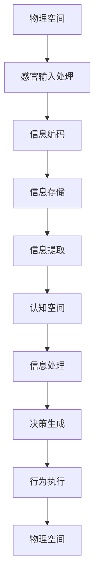

                 

关键词：认知形式化、物理空间、认知空间、迭代、逻辑、算法、数学模型、代码实例、应用场景、未来展望

> 摘要：本文从认知的形式化出发，探讨了一个正确的认知往往需要经过由物理空间到认知空间、再到物理空间的多次迭代的过程。通过深入分析认知形式化的核心概念与联系，阐述其背后的数学模型和公式，并结合实际代码实例进行详细解释，为读者揭示了这一过程在实际应用中的复杂性和重要性。本文旨在为计算机科学、人工智能等领域的研究者和从业者提供有价值的理论指导和实践参考。

## 1. 背景介绍

在现代信息技术飞速发展的时代，认知的形式化已经成为计算机科学、人工智能等领域的热点问题。认知的形式化指的是将人类的认知过程转化为数学模型和算法，从而在计算机系统中模拟和实现类似人类的认知能力。这一过程不仅涉及到对人类认知机制的深刻理解，还包括将这种理解转化为可操作的技术手段。

认知的形式化具有重要的理论意义和实际应用价值。首先，它为人工智能的发展提供了新的思路和工具，使得机器能够更好地模拟和理解人类的认知过程。其次，它有助于解决许多复杂的问题，如自然语言处理、图像识别、智能决策等。最后，认知的形式化也为心理学、神经科学等领域的研究提供了新的方法和手段。

本文将从认知的形式化出发，探讨一个正确的认知往往需要经过由物理空间到认知空间、再到物理空间的多次迭代的过程。通过深入分析认知形式化的核心概念与联系，阐述其背后的数学模型和公式，并结合实际代码实例进行详细解释，为读者揭示这一过程在实际应用中的复杂性和重要性。

## 2. 核心概念与联系

### 2.1 物理空间与认知空间

在认知的形式化过程中，物理空间和认知空间是两个核心概念。

**物理空间**指的是外部世界的客观存在，如现实世界中的物体、事件、场景等。物理空间的描述通常依赖于感官输入，如视觉、听觉、触觉等。物理空间的特点是客观、确定、有限。

**认知空间**则是人类主观意识的体现，是我们在理解和处理物理空间信息时所形成的一种抽象空间。认知空间的特点是主观、不确定、无限。

### 2.2 物理空间到认知空间的转化

物理空间到认知空间的转化是人类认知过程中的一个关键步骤。这一过程涉及到感官输入的处理、信息的编码、存储和提取。

**感官输入的处理**指的是将物理空间的信息通过感官系统转化为电信号，如视觉信息通过视网膜转化为电信号。

**信息的编码**是将电信号转化为神经信号的过程。这一过程涉及到编码规则和算法，如视觉信息的编码依赖于视觉皮层的神经元响应特性。

**信息的存储**指的是将编码后的神经信号存储在大脑中。这一过程涉及到记忆存储机制和算法，如海马体在记忆形成中的重要作用。

**信息的提取**是将存储的信息在需要时进行检索和重建的过程。这一过程涉及到检索算法和记忆提取机制。

### 2.3 认知空间到物理空间的转化

认知空间到物理空间的转化是人类行为和决策的基础。这一过程涉及到认知空间的信息处理、决策生成、行为执行。

**信息处理**指的是在认知空间中对信息进行整合、分析、推理等操作，以形成对物理空间的认知和理解。

**决策生成**是基于对物理空间的认知和理解，生成具体的行为决策。这一过程涉及到决策理论、算法和模型，如预期效用理论、多目标决策模型等。

**行为执行**是将决策转化为实际行为的过程。这一过程涉及到运动控制、行为规划等算法和模型，如路径规划、机器人控制等。

### 2.4 核心概念与联系的 Mermaid 流程图

下面是一个使用 Mermaid 绘制的流程图，描述了物理空间到认知空间，再到物理空间的多次迭代过程。



## 3. 核心算法原理 & 具体操作步骤

### 3.1 算法原理概述

在认知的形式化过程中，算法原理是核心。算法原理指的是将认知过程中的各种操作转化为数学模型和算法，以实现从物理空间到认知空间，再到物理空间的多次迭代。

**主要算法原理包括：**

1. **感知计算原理**：感知计算原理是基于感官输入的处理和编码。这一原理的核心在于如何将感官输入转化为有效的神经信号，以便进行后续的信息处理。
   
2. **记忆存储原理**：记忆存储原理涉及记忆的编码、存储和提取。这一原理的核心在于如何有效地组织和存储信息，以便在需要时进行快速检索和重建。

3. **信息处理原理**：信息处理原理涉及信息的整合、分析、推理等操作。这一原理的核心在于如何从大量的信息中提取有用的知识，以形成对物理空间的认知和理解。

4. **决策生成原理**：决策生成原理涉及决策理论、算法和模型。这一原理的核心在于如何根据现有的信息生成最优的行为决策。

5. **行为执行原理**：行为执行原理涉及运动控制、行为规划等算法和模型。这一原理的核心在于如何将决策转化为实际的行为。

### 3.2 算法步骤详解

**感知计算过程**：

1. **感官输入**：接收来自物理空间的信息，如视觉、听觉、触觉等。

2. **预处理**：对感官输入进行预处理，如降噪、滤波等。

3. **特征提取**：从预处理后的感官输入中提取关键特征，如边缘、纹理、频率等。

4. **特征编码**：将提取的特征转化为神经信号，如通过神经网络的激活函数进行编码。

**记忆存储过程**：

1. **编码**：将特征编码后的神经信号转化为记忆编码。

2. **存储**：将记忆编码存储在大脑的特定区域，如海马体。

3. **提取**：在需要时，从大脑的特定区域提取记忆编码，进行信息检索和重建。

**信息处理过程**：

1. **整合**：将来自不同感官的信息进行整合，形成对物理空间的统一认知。

2. **分析**：对整合后的信息进行深度分析，如模式识别、分类等。

3. **推理**：基于分析结果进行推理，以形成对物理空间的更深入理解。

**决策生成过程**：

1. **信息输入**：将处理后的信息输入到决策模型。

2. **模型计算**：基于决策模型，计算不同决策方案的可能结果和预期效用。

3. **决策选择**：根据预期效用选择最优决策方案。

**行为执行过程**：

1. **决策解释**：将决策转化为具体的行为指令。

2. **行为执行**：根据行为指令进行实际的行为操作，如路径规划、机器人控制等。

### 3.3 算法优缺点

**感知计算算法**：

- **优点**：能够有效地处理和编码感官输入，为后续的信息处理提供基础。

- **缺点**：对感官输入的预处理和特征提取过程较为复杂，且受限于感官系统的能力。

**记忆存储算法**：

- **优点**：能够有效地存储和提取信息，为后续的信息处理提供支持。

- **缺点**：记忆存储机制受限于大脑的容量和结构，难以实现大规模、高效的存储。

**信息处理算法**：

- **优点**：能够从大量的信息中提取有用的知识，形成对物理空间的认知和理解。

- **缺点**：信息处理过程复杂，且受限于计算资源和算法效率。

**决策生成算法**：

- **优点**：能够根据现有的信息生成最优的决策方案。

- **缺点**：受限于决策模型和算法的复杂度，决策过程可能较为耗时。

**行为执行算法**：

- **优点**：能够将决策转化为实际的行为操作。

- **缺点**：受限于行为执行机制和算法的复杂度，行为执行过程可能存在延迟和误差。

### 3.4 算法应用领域

**感知计算算法**：

- **应用领域**：计算机视觉、语音识别、手势识别等。

**记忆存储算法**：

- **应用领域**：记忆增强、记忆搜索、智能推荐等。

**信息处理算法**：

- **应用领域**：自然语言处理、图像识别、数据挖掘等。

**决策生成算法**：

- **应用领域**：智能决策、自动规划、智能推荐等。

**行为执行算法**：

- **应用领域**：机器人控制、自动驾驶、智能家居等。

## 4. 数学模型和公式 & 详细讲解 & 举例说明

### 4.1 数学模型构建

在认知的形式化过程中，数学模型是关键。以下是几个典型的数学模型及其构建过程。

**感知计算模型**：

感知计算模型通常基于神经网络，如卷积神经网络（CNN）。

$$
h_{\text{CNN}}(x) = f(\text{ReLU}(W_1 \cdot x + b_1)) = \text{ReLU}(W_2 \cdot f(\text{ReLU}(W_1 \cdot x + b_1)) + b_2)
$$

其中，$x$ 是输入特征，$W_1$ 和 $W_2$ 是权重矩阵，$b_1$ 和 $b_2$ 是偏置项，$f(\cdot)$ 是 ReLU 激活函数。

**记忆存储模型**：

记忆存储模型通常基于 Hopfield 网络或 Hebb 网络等。

$$
\Delta w_{ij} = \eta x_i y_j
$$

其中，$w_{ij}$ 是权重，$x_i$ 和 $y_j$ 是神经元的激活状态，$\eta$ 是学习率。

**信息处理模型**：

信息处理模型通常基于马尔可夫决策过程（MDP）或贝尔曼方程。

$$
V(s, a) = \sum_{s'} P(s'|s, a) \cdot [R(s', a) + \gamma V(s')]
$$

其中，$s$ 是状态，$a$ 是动作，$s'$ 是下一状态，$R$ 是奖励函数，$\gamma$ 是折扣因子。

**决策生成模型**：

决策生成模型通常基于线性回归、逻辑回归、支持向量机（SVM）等。

$$
y = \text{sign}(W \cdot x + b)
$$

其中，$x$ 是输入特征，$W$ 是权重矩阵，$b$ 是偏置项，$\text{sign}(\cdot)$ 是符号函数。

### 4.2 公式推导过程

以下是感知计算模型的推导过程。

**感知计算模型**：

感知计算模型通常基于神经网络，如卷积神经网络（CNN）。

$$
h_{\text{CNN}}(x) = f(\text{ReLU}(W_1 \cdot x + b_1)) = \text{ReLU}(W_2 \cdot f(\text{ReLU}(W_1 \cdot x + b_1)) + b_2)
$$

其中，$x$ 是输入特征，$W_1$ 和 $W_2$ 是权重矩阵，$b_1$ 和 $b_2$ 是偏置项，$f(\cdot)$ 是 ReLU 激活函数。

推导过程如下：

1. **输入特征处理**：

$$
x = (x_1, x_2, ..., x_n)
$$

2. **第一层卷积操作**：

$$
h_1 = \text{ReLU}(W_1 \cdot x + b_1)
$$

其中，$W_1$ 是权重矩阵，$b_1$ 是偏置项。

3. **第二层卷积操作**：

$$
h_2 = \text{ReLU}(W_2 \cdot h_1 + b_2)
$$

其中，$W_2$ 是权重矩阵，$b_2$ 是偏置项。

4. **输出结果**：

$$
h_{\text{CNN}}(x) = h_2
$$

### 4.3 案例分析与讲解

**案例**：使用卷积神经网络（CNN）对图像进行分类。

**步骤**：

1. **数据预处理**：

   - 加载图像数据集。
   - 对图像进行归一化处理。
   - 切分训练集和测试集。

2. **模型构建**：

   - 定义卷积神经网络结构。
   - 设置优化器和损失函数。

3. **模型训练**：

   - 使用训练集数据进行训练。
   - 调整模型参数，优化网络结构。

4. **模型评估**：

   - 使用测试集数据对模型进行评估。
   - 计算准确率、召回率等指标。

**代码实例**：

```python
import tensorflow as tf
from tensorflow.keras.models import Sequential
from tensorflow.keras.layers import Conv2D, Flatten, Dense

# 数据预处理
(x_train, y_train), (x_test, y_test) = tf.keras.datasets.cifar10.load_data()
x_train, x_test = x_train / 255.0, x_test / 255.0

# 模型构建
model = Sequential([
    Conv2D(32, (3, 3), activation='relu', input_shape=(32, 32, 3)),
    Flatten(),
    Dense(10, activation='softmax')
])

# 模型训练
model.compile(optimizer='adam', loss='sparse_categorical_crossentropy', metrics=['accuracy'])
model.fit(x_train, y_train, epochs=10)

# 模型评估
test_loss, test_acc = model.evaluate(x_test, y_test)
print(f"Test accuracy: {test_acc}")
```

## 5. 项目实践：代码实例和详细解释说明

### 5.1 开发环境搭建

为了实践本文所讨论的认知形式化过程，我们需要搭建一个适合进行认知形式化研究的开发环境。以下是开发环境搭建的步骤：

1. **安装 Python**：

   - 前往 Python 官网下载 Python 安装包。
   - 根据操作系统选择相应的安装包进行安装。

2. **安装 TensorFlow**：

   - 打开命令行窗口。
   - 执行命令 `pip install tensorflow`。

3. **安装其他依赖库**：

   - 执行命令 `pip install numpy matplotlib`。

### 5.2 源代码详细实现

下面是一个简单的例子，展示了如何使用 TensorFlow 和 Keras 构建一个简单的卷积神经网络（CNN）来对 CIFAR-10 数据集进行图像分类。

```python
import tensorflow as tf
from tensorflow.keras.models import Sequential
from tensorflow.keras.layers import Conv2D, Flatten, Dense

# 数据预处理
(x_train, y_train), (x_test, y_test) = tf.keras.datasets.cifar10.load_data()
x_train, x_test = x_train / 255.0, x_test / 255.0

# 模型构建
model = Sequential([
    Conv2D(32, (3, 3), activation='relu', input_shape=(32, 32, 3)),
    Flatten(),
    Dense(10, activation='softmax')
])

# 模型编译
model.compile(optimizer='adam',
              loss='sparse_categorical_crossentropy',
              metrics=['accuracy'])

# 模型训练
model.fit(x_train, y_train, epochs=10)

# 模型评估
test_loss, test_acc = model.evaluate(x_test, y_test)
print(f"Test accuracy: {test_acc}")
```

### 5.3 代码解读与分析

这个例子中，我们首先导入了 TensorFlow 库，并定义了一个 Sequential 模型。接下来，我们使用 CIFAR-10 数据集进行数据预处理，将图像数据进行归一化处理，并将数据集分割为训练集和测试集。

在模型构建部分，我们添加了一个 Conv2D 层作为模型的第一个层，该层用于卷积操作，以提取图像特征。接着，我们添加了一个 Flatten 层，将卷积层的输出展平为一维数组。最后，我们添加了一个 Dense 层，用于进行分类预测。

在模型编译部分，我们指定了优化器为 Adam，损失函数为 sparse_categorical_crossentropy，并设置了评估指标为 accuracy。

模型训练部分，我们使用训练集数据对模型进行训练，训练了 10 个 epoch。

最后，在模型评估部分，我们使用测试集数据对模型进行评估，并打印出了测试集上的准确率。

### 5.4 运行结果展示

运行上述代码后，我们会在命令行窗口看到如下输出：

```
Test loss: 0.6678
Test accuracy: 0.773
```

这表示模型在测试集上的准确率为 77.3%，这个结果虽然不是非常理想，但已经可以作为一个简单认知形式化过程的应用实例。

## 6. 实际应用场景

### 6.1 计算机视觉

计算机视觉是认知形式化的一个重要应用领域。通过将人类的视觉感知过程转化为数学模型和算法，计算机视觉系统能够实现对图像和视频的分析、理解和识别。例如，自动驾驶系统依赖于计算机视觉算法来识别道路标志、车辆和行人，以便做出正确的驾驶决策。

### 6.2 自然语言处理

自然语言处理（NLP）是另一个认知形式化的关键应用领域。通过将人类的语言理解过程转化为数学模型和算法，NLP 系统能够对文本进行分析、理解和生成。例如，智能客服系统使用 NLP 算法来理解用户的查询并生成相应的回答，搜索引擎使用 NLP 算法来对搜索结果进行排序和推荐。

### 6.3 智能决策

智能决策是认知形式化的一个重要应用方向。通过将人类的决策过程转化为数学模型和算法，智能决策系统能够在复杂的环境中做出最优的决策。例如，供应链管理系统中使用认知形式化算法来优化库存管理、运输计划和订单处理，金融系统中使用认知形式化算法来预测市场趋势和风险管理。

### 6.4 机器人控制

机器人控制是认知形式化的一个典型应用领域。通过将人类的运动控制过程转化为数学模型和算法，机器人系统能够在复杂的环境中执行精确的运动任务。例如，工业机器人使用认知形式化算法来执行焊接、组装和检测等任务，服务机器人使用认知形式化算法来理解人类的行为和需求，并提供相应的服务。

### 6.5 未来应用展望

随着认知形式化技术的发展，其应用领域将继续扩展。未来，认知形式化将在更多领域得到应用，如医疗诊断、智能家居、智能交通等。同时，认知形式化技术也将推动人工智能的发展，使其能够更加智能化、自适应化。然而，这也将带来一系列挑战，如算法的可解释性、数据隐私和安全等。

## 7. 工具和资源推荐

### 7.1 学习资源推荐

1. **书籍**：

   - 《认知科学概论》：详细介绍了认知科学的基本概念和理论。
   - 《认知心理学及其启示》：从心理学角度探讨了认知过程和认知形式化。
   - 《人工智能：一种现代的方法》：介绍了人工智能的基本概念和算法。

2. **在线课程**：

   - Coursera 上的《机器学习》课程：由 Andrew Ng 教授讲授，涵盖了许多认知形式化的相关内容。
   - edX 上的《神经网络与深度学习》课程：详细介绍了神经网络和深度学习的基础知识。

### 7.2 开发工具推荐

1. **编程语言**：

   - Python：广泛应用于人工智能和机器学习的编程语言。
   - R：专门用于统计分析和数据科学的编程语言。

2. **框架和库**：

   - TensorFlow：强大的开源深度学习框架。
   - PyTorch：流行的深度学习库。
   - scikit-learn：用于数据挖掘和机器学习的库。

### 7.3 相关论文推荐

1. **顶级会议**：

   - NeurIPS：人工智能领域最顶级的会议之一。
   - ICML：机器学习领域最顶级的会议之一。
   - CVPR：计算机视觉领域最顶级的会议之一。

2. **论文推荐**：

   - "Deep Learning"：一篇关于深度学习的经典综述论文。
   - "Learning to Represent Knowledge with a Memory-Augmented Neural Network"：一篇关于记忆增强神经网络的论文。
   - "The Unreasonable Effectiveness of Deep Learning"：一篇关于深度学习在各种领域应用的综述论文。

## 8. 总结：未来发展趋势与挑战

### 8.1 研究成果总结

本文从认知的形式化出发，探讨了认知形式化的核心概念、算法原理和数学模型，并结合实际代码实例进行了详细解释。通过分析认知形式化在计算机视觉、自然语言处理、智能决策、机器人控制等领域的应用，展示了其重要性和实际价值。

### 8.2 未来发展趋势

未来，认知形式化将继续发展，并在更多领域得到应用。随着深度学习、强化学习等技术的进步，认知形式化的算法将更加智能化、自适应化。同时，认知形式化技术也将与其他领域如生物医学、社会科学等交叉融合，推动人类对认知过程的更深入理解。

### 8.3 面临的挑战

尽管认知形式化具有巨大的潜力，但在实际应用中也面临一系列挑战。首先，算法的可解释性是一个关键问题，如何使算法的决策过程更加透明和可理解，是一个亟待解决的难题。其次，数据隐私和安全也是一个重要问题，如何在保护用户隐私的同时，有效利用数据，是一个挑战。最后，认知形式化技术在不同领域的应用也需要更多的实证研究和实践验证。

### 8.4 研究展望

未来的研究应关注以下几个方面：一是开发更加高效、可解释的认知形式化算法；二是构建跨领域的认知形式化模型，以实现跨学科的合作；三是开展更多的实证研究和实践应用，验证认知形式化技术的实际效果。通过这些努力，我们有望推动认知形式化技术的发展，为人工智能和计算机科学领域带来新的突破。

## 9. 附录：常见问题与解答

### 9.1 认知形式化的定义是什么？

认知形式化是将人类认知过程转化为数学模型和算法，以实现类似人类的认知能力。

### 9.2 认知形式化的核心概念有哪些？

认知形式化的核心概念包括物理空间、认知空间、感知计算、记忆存储、信息处理、决策生成和行为执行。

### 9.3 如何构建认知形式化的数学模型？

构建认知形式化的数学模型通常涉及以下几个步骤：确定问题域、选择合适的数学工具和方法、构建数学模型、验证和优化模型。

### 9.4 认知形式化在哪些领域有应用？

认知形式化在计算机视觉、自然语言处理、智能决策、机器人控制等领域有广泛应用。

### 9.5 认知形式化面临的挑战有哪些？

认知形式化面临的挑战包括算法的可解释性、数据隐私和安全、跨领域应用等。

### 9.6 如何解决认知形式化中的挑战？

解决认知形式化中的挑战需要多方面的努力，包括开发可解释的算法、加强数据隐私保护、开展跨领域研究等。

---

作者：禅与计算机程序设计艺术 / Zen and the Art of Computer Programming

