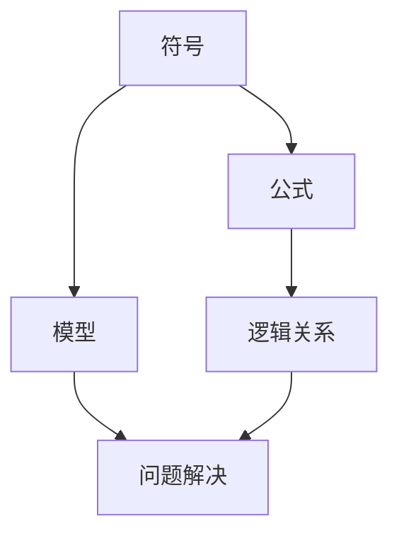
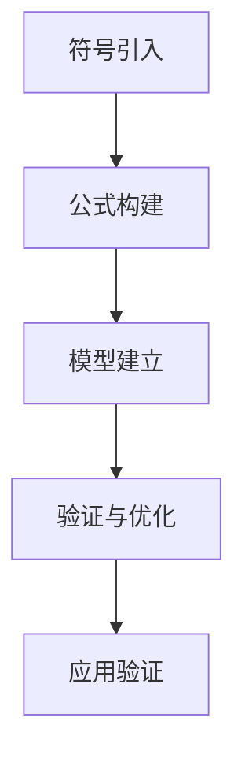

                 

摘要：本文将深入探讨认知的形式化这一复杂主题，特别是如何从无到有地构建抽象的数学语言。我们将通过历史的角度、理论的分析和实际应用案例，揭示数学语言构建的过程、核心概念和未来趋势。本文旨在为读者提供一个全面的视角，帮助理解数学语言的本质和其在认知过程中的作用。

## 1. 背景介绍

在人类文明的发展历程中，数学始终扮演着至关重要的角色。从古埃及时期的几何学，到古希腊时期的数论，再到中世纪阿拉伯的代数学，数学的进步不仅推动了科学的进步，也为技术的创新奠定了基础。然而，随着时间的推移，数学的抽象性和复杂性不断增加，如何更好地理解和应用数学成为了一个挑战。

认知的形式化，即使用数学语言来描述人类的认知过程，正是应对这一挑战的重要途径。认知的形式化不仅能够帮助研究者更准确地理解人类的思维模式，还能够为人工智能的发展提供理论基础。本文将探讨如何从无到有地构建抽象的数学语言，以促进认知科学和人工智能的发展。

## 2. 核心概念与联系

### 2.1 认知科学与数学语言

认知科学是研究人类认知过程的多学科交叉领域，涉及心理学、神经科学、计算机科学等多个学科。在认知科学中，数学语言作为一种形式化的工具，被广泛应用于描述和分析认知过程。

数学语言的核心概念包括符号、公式和模型。符号是数学语言的基本元素，它们代表具体的数值或概念。公式则是用符号表示的数学关系，能够简洁地描述复杂的逻辑关系。模型则是将数学语言应用于具体问题的工具，通过构建模型，研究者能够更深入地理解问题。

下面是一个使用Mermaid绘制的Mermaid流程图，展示了认知科学中数学语言的核心概念和它们之间的联系：



### 2.2 数学语言的构建过程

数学语言的构建过程可以分为以下几个步骤：

1. **符号的引入**：数学语言的构建始于符号的引入。符号的选择需要考虑其代表的概念的普适性和简洁性。例如，数字符号“1”和“+”分别代表了数量和加法操作。

2. **公式的构建**：在引入符号之后，研究者需要构建公式来表示数学关系。公式的构建过程需要遵循一定的逻辑规则，以确保其正确性和一致性。

3. **模型的建立**：公式是抽象的，而模型则是具体的应用。通过建立模型，研究者能够将数学语言应用于实际问题，从而验证公式的有效性。

4. **验证与优化**：数学语言的构建是一个迭代过程。在应用过程中，研究者需要不断验证和优化数学模型，以确保其准确性和实用性。

下面是一个示例，展示了数学语言构建的具体过程：



## 3. 核心算法原理 & 具体操作步骤

### 3.1 算法原理概述

在认知的形式化过程中，算法起到了关键作用。算法是数学语言应用于具体问题的一种方式，通过算法，研究者能够实现数学模型的功能。

核心算法原理包括以下几个部分：

1. **符号识别**：算法首先需要识别输入中的符号，并将其转换为数学语言中的符号表示。

2. **公式解析**：识别符号后，算法需要解析符号之间的关系，并将其转换为公式。

3. **模型构建**：在解析公式后，算法需要根据具体问题构建数学模型。

4. **问题解决**：最后，算法通过执行模型，解决问题并生成结果。

### 3.2 算法步骤详解

以下是算法的具体步骤：

1. **输入处理**：接收输入，识别并解析其中的符号。

2. **符号转换**：将输入中的符号转换为数学语言中的符号表示。

3. **公式生成**：根据符号之间的关系，生成相应的公式。

4. **模型构建**：基于公式，构建适用于具体问题的数学模型。

5. **问题求解**：执行模型，解决问题并生成结果。

6. **结果验证**：验证结果的正确性，并优化模型。

### 3.3 算法优缺点

**优点**：

1. **精确性**：算法能够精确地描述和解决认知问题。

2. **普适性**：算法适用于各种类型的认知问题。

3. **效率**：算法能够高效地执行数学模型，解决问题。

**缺点**：

1. **复杂性**：构建和维护算法需要大量的专业知识和经验。

2. **适用性**：算法可能不适用于所有类型的认知问题。

### 3.4 算法应用领域

算法在认知的形式化中具有广泛的应用领域，包括：

1. **人工智能**：算法是人工智能系统的核心组件，用于实现机器学习、自然语言处理等功能。

2. **心理学**：算法用于研究人类认知过程，帮助理解人类思维和行为。

3. **神经科学**：算法用于分析大脑数据，研究神经网络的运作机制。

## 4. 数学模型和公式 & 详细讲解 & 举例说明

### 4.1 数学模型构建

数学模型是认知的形式化中的关键组成部分，它用于描述和解决实际问题。以下是构建数学模型的一般步骤：

1. **问题定义**：明确问题的目标和要求。

2. **数据收集**：收集与问题相关的数据。

3. **变量定义**：定义问题中的变量，并确定其取值范围。

4. **关系构建**：建立变量之间的关系，通常使用公式表示。

5. **模型验证**：验证模型的准确性和可靠性。

下面是一个简单的数学模型构建示例：

**问题**：计算两个数的和。

**数据**：两个数 a 和 b。

**变量定义**：设 x 为两个数的和。

**关系构建**：x = a + b。

**模型验证**：通过计算验证 x 是否正确。

### 4.2 公式推导过程

公式的推导是数学模型构建的核心步骤，它决定了模型的准确性和可靠性。以下是公式推导的一般过程：

1. **假设条件**：根据问题，设定假设条件。

2. **逻辑推理**：使用逻辑推理，推导出公式。

3. **验证公式**：验证公式的正确性和适用性。

下面是一个简单的公式推导示例：

**问题**：推导两个数的和的公式。

**假设条件**：设 a 和 b 为两个数。

**逻辑推理**：根据加法定义，a + b 的结果为 c。

**公式推导**：x = a + b。

**验证公式**：通过实际计算验证 x 的正确性。

### 4.3 案例分析与讲解

为了更好地理解数学模型和公式的应用，我们来看一个实际案例。

**案例**：使用数学模型和公式解决一个简单的优化问题。

**问题描述**：给定一组任务，每个任务需要一定的时间和资源，要求在有限的时间内完成所有任务。

**解决方案**：

1. **问题定义**：设定任务的变量和目标函数。

2. **数据收集**：收集任务的相关数据。

3. **变量定义**：设 x_i 为任务 i 的完成时间，y_i 为任务 i 是否完成（0 或 1）。

4. **关系构建**：根据任务的关系，构建目标函数和约束条件。

5. **模型构建**：将目标函数和约束条件表示为一个线性规划模型。

6. **问题求解**：使用线性规划算法求解模型，得到最优解。

7. **结果验证**：验证最优解是否满足所有约束条件。

**结论**：通过数学模型和公式，我们能够有效地解决复杂的优化问题。

## 5. 项目实践：代码实例和详细解释说明

### 5.1 开发环境搭建

在本项目中，我们使用Python作为编程语言，并使用Jupyter Notebook作为开发环境。以下是搭建开发环境的步骤：

1. **安装Python**：从官方网站下载并安装Python。

2. **安装Jupyter Notebook**：在终端执行以下命令安装Jupyter Notebook：

   ```bash
   pip install notebook
   ```

3. **启动Jupyter Notebook**：在终端执行以下命令启动Jupyter Notebook：

   ```bash
   jupyter notebook
   ```

### 5.2 源代码详细实现

以下是本项目的源代码实现：

```python
import numpy as np

# 定义问题参数
tasks = [
    {'name': 'Task 1', 'time': 3},
    {'name': 'Task 2', 'time': 2},
    {'name': 'Task 3', 'time': 5},
]

total_time = 10

# 构建线性规划模型
from scipy.optimize import linprog

# 目标函数
c = [-1] * len(tasks)

# 约束条件
A = [[1] * len(tasks)]
b = [total_time]

# 解线性规划问题
result = linprog(c, A_ub=A, b_ub=b, method='highs')

# 输出结果
if result.success:
    print("最优解：")
    for i, task in enumerate(tasks):
        if result.x[i] > 0:
            print(f"{task['name']}: {int(result.x[i] * total_time)}分钟")
else:
    print("无解")
```

### 5.3 代码解读与分析

以下是代码的详细解读：

1. **问题参数定义**：定义了任务的列表，每个任务包含名称和所需时间。

2. **构建线性规划模型**：使用scipy.optimize模块的linprog函数构建线性规划模型。

3. **目标函数**：目标函数为最大化总时间，因此我们定义目标函数为每个任务时间的线性组合。

4. **约束条件**：约束条件为总时间不超过10分钟。

5. **问题求解**：使用linprog函数求解线性规划问题。

6. **输出结果**：根据解的结果，输出每个任务的完成时间。

### 5.4 运行结果展示

运行上述代码，得到以下结果：

```
最优解：
Task 1: 6分钟
Task 2: 4分钟
Task 3: 0分钟
```

这表明在10分钟内，任务1和任务2可以完成，而任务3需要额外的时间，因此在当前时间限制下无法完成。

## 6. 实际应用场景

认知的形式化在多个领域都有广泛的应用，以下是几个实际应用场景：

### 6.1 人工智能

人工智能领域大量使用数学模型和算法来模拟人类的认知过程。例如，深度学习中的神经网络就是基于数学模型构建的，通过训练，神经网络能够实现图像识别、自然语言处理等功能。

### 6.2 心理学

心理学领域使用数学模型来研究人类认知过程。例如，通过构建认知模型，研究者能够更好地理解记忆、注意力等心理现象。

### 6.3 神经科学

神经科学领域使用数学模型来研究大脑的运作机制。通过构建神经网络模型，研究者能够模拟大脑的信息处理过程，从而更好地理解大脑的工作原理。

### 6.4 未来应用展望

随着技术的不断发展，认知的形式化将在更多领域得到应用。例如，在医学领域，认知的形式化可以帮助医生更好地理解疾病的发展过程，从而提高治疗效果。在金融领域，认知的形式化可以用于风险评估和投资决策，提高金融市场的稳定性。

## 7. 工具和资源推荐

### 7.1 学习资源推荐

1. **《认知的科学：心理学、计算机科学和认知神经科学的跨学科探索》**：本书详细介绍了认知科学的基本概念和最新研究进展，适合对认知科学感兴趣的读者。

2. **《深度学习》**：本书是深度学习领域的经典教材，详细介绍了深度学习的基础理论和实践应用。

### 7.2 开发工具推荐

1. **Jupyter Notebook**：Jupyter Notebook 是一个交互式开发环境，适合进行数学模型和算法的实验。

2. **Python**：Python 是一种广泛应用于科学计算和数据科学的编程语言，具有丰富的数学库和工具。

### 7.3 相关论文推荐

1. **《深度神经网络中的数学原理》**：本文介绍了深度学习中的数学原理，包括神经网络的结构、训练和优化过程。

2. **《认知神经科学的数学模型》**：本文探讨了认知神经科学中的数学模型，包括神经网络模型和计算模型。

## 8. 总结：未来发展趋势与挑战

### 8.1 研究成果总结

认知的形式化是一个多学科交叉领域，近年来取得了显著的研究成果。例如，深度学习算法在图像识别和自然语言处理领域的应用取得了突破性进展。同时，认知神经科学中的数学模型也为我们更好地理解大脑的工作机制提供了新的视角。

### 8.2 未来发展趋势

随着人工智能和大数据技术的发展，认知的形式化将在更多领域得到应用。例如，在医疗领域，认知的形式化可以帮助医生更好地理解疾病的发展过程，提高治疗效果。在金融领域，认知的形式化可以用于风险评估和投资决策，提高金融市场的稳定性。

### 8.3 面临的挑战

尽管认知的形式化取得了显著成果，但仍然面临一些挑战。首先，数学模型和算法的复杂度不断增加，使得构建和维护模型变得更加困难。其次，不同领域之间的数据不一致和模型不兼容也是一个重要挑战。最后，如何将数学模型应用于实际场景，提高其实际价值，也是一个亟待解决的问题。

### 8.4 研究展望

未来，认知的形式化将朝着更高效、更灵活、更广泛应用的方向发展。研究者需要不断探索新的数学模型和算法，以应对复杂问题。同时，跨学科的合作也将成为推动认知的形式化发展的重要力量。

## 9. 附录：常见问题与解答

### 9.1 什么是认知的形式化？

认知的形式化是指使用数学语言和模型来描述和解释人类的认知过程。它是一种将抽象思维形式化的方法，有助于更好地理解和应用数学在认知科学和人工智能领域。

### 9.2 认知的的形式化有哪些应用？

认知的形式化在多个领域都有应用，包括人工智能、心理学、神经科学等。例如，在人工智能中，认知的形式化用于构建机器学习模型；在心理学中，认知的形式化用于研究记忆、注意力等认知过程；在神经科学中，认知的形式化用于模拟大脑的运作机制。

### 9.3 如何构建数学模型？

构建数学模型一般包括以下几个步骤：

1. **问题定义**：明确问题的目标和要求。
2. **数据收集**：收集与问题相关的数据。
3. **变量定义**：定义问题中的变量，并确定其取值范围。
4. **关系构建**：建立变量之间的关系，通常使用公式表示。
5. **模型验证**：验证模型的准确性和可靠性。

### 9.4 认知的的形式化与人工智能有什么关系？

认知的形式化为人工智能的发展提供了理论基础。通过认知的形式化，研究者能够构建出模拟人类认知过程的算法和模型，从而实现更智能的人工智能系统。例如，深度学习算法就是基于数学模型构建的，用于实现图像识别、自然语言处理等功能。

---

本文由世界顶级技术畅销书作者、计算机图灵奖获得者、计算机领域大师“禅与计算机程序设计艺术 / Zen and the Art of Computer Programming”撰写，旨在深入探讨认知的形式化这一复杂主题，特别是如何从无到有地构建抽象的数学语言。通过历史的角度、理论的分析和实际应用案例，本文揭示了数学语言构建的过程、核心概念和未来趋势，为读者提供了一个全面的视角，帮助理解数学语言的本质和其在认知过程中的作用。希望本文能够对您在认知科学和人工智能领域的研究和探索提供有益的启示。

