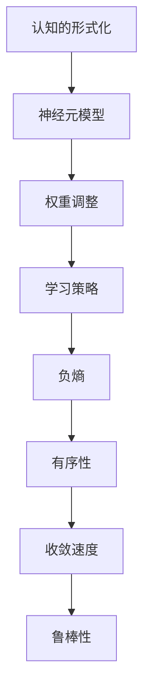
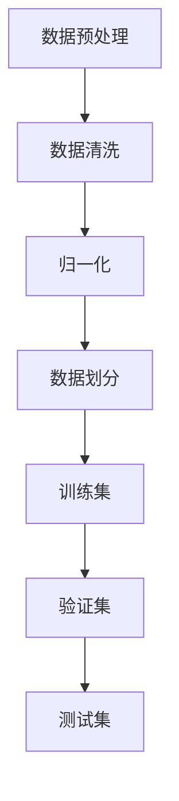
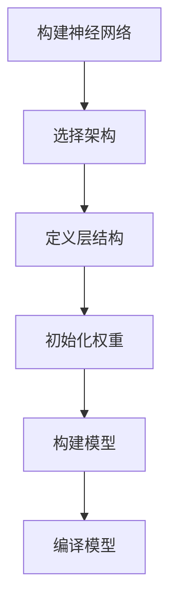
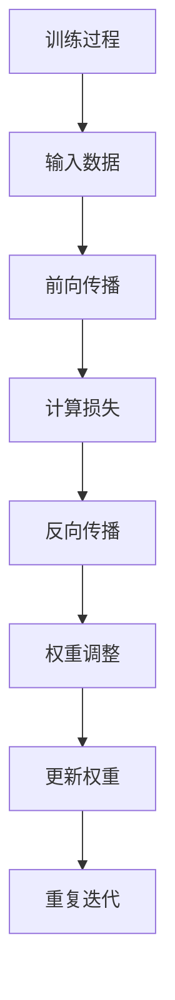
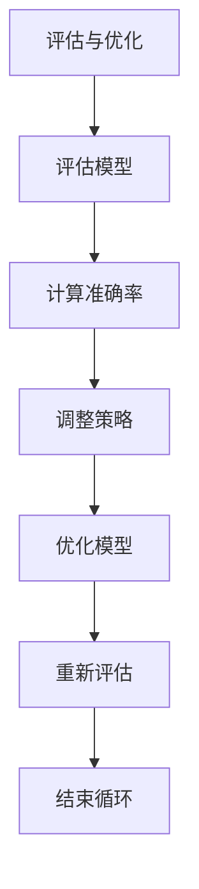

                 

在当今的信息时代，人工智能（AI）技术正以前所未有的速度发展，成为驱动科技进步和创新的关键力量。而在这股技术浪潮中，“认知的形式化”作为一种新型的人工智能研究方法，正逐渐引起广泛关注。本文将深入探讨认知的形式化技术，特别是机器如何在负熵的驱动下实现自我优化与进化。

## 关键词

- 认知的形式化
- 负熵
- 机器学习
- 自我优化
- 人工智能进化

## 摘要

本文首先回顾了认知的形式化定义及其在人工智能领域的应用。接着，我们探讨了负熵在机器学习中的作用，并分析了如何在人工智能系统中利用负熵实现高效的学习和优化。文章随后通过具体的数学模型和算法原理，详细描述了机器如何借助负熵进行自我进化和优化。最后，本文提出了机器学习在实际应用中的挑战与未来展望，并推荐了相关的学习资源和开发工具。

## 1. 背景介绍

认知的形式化，简而言之，就是将人类认知过程中的思维模式、推理机制、学习策略等，通过数学模型和计算机算法进行形式化和量化。这一概念最早由艾伦·图灵在20世纪中叶提出，旨在模拟人类智能的行为。随着计算能力和算法的进步，认知的形式化逐渐成为人工智能研究的一个重要方向。

认知的形式化在人工智能领域的应用极为广泛。首先，它为深度学习提供了理论基础。深度学习中的神经网络模型，本质上就是对人类大脑神经元连接方式的模拟和抽象。其次，认知的形式化在自然语言处理、图像识别、游戏AI等多个领域都取得了显著成果。通过形式化的方法，AI系统能够更好地理解和模拟人类思维，实现更为智能化的任务处理。

与此同时，负熵的概念在认知的形式化研究中也扮演着关键角色。负熵，是热力学中一个重要的概念，它代表了系统的有序程度。在人工智能中，负熵被用来描述机器学习过程中的有序性和效率。一个高效的机器学习算法，往往能够以较低的负熵实现快速的收敛和优化。

## 2. 核心概念与联系

### 2.1 认知的形式化原理

认知的形式化原理，主要包括以下几个方面：

1. **神经元模型**：神经网络中的基本单元是神经元，每个神经元都通过加权连接与其他神经元相连。神经元通过激活函数对输入进行非线性变换，从而实现信息的处理和传递。

2. **权重调整**：在训练过程中，神经网络通过反向传播算法不断调整权重，使得网络输出更接近期望值。这个过程可以看作是机器通过学习不断降低负熵，提高系统的有序性。

3. **学习策略**：机器学习算法通过多种策略，如梯度下降、随机梯度下降、Adam优化器等，来调整网络权重，以达到最优解。

### 2.2 负熵的概念

负熵在机器学习中的作用，主要体现在以下几个方面：

1. **有序性**：负熵代表了系统的有序程度。在机器学习中，负熵用于衡量模型对数据的拟合程度。一个负熵较低的模型，往往意味着其学习效率较高。

2. **收敛速度**：负熵也与模型的收敛速度有关。较低的负熵通常意味着模型可以更快地达到局部最优解。

3. **鲁棒性**：负熵还与模型的鲁棒性相关。一个负熵较低的模型，在面临噪声和异常数据时，往往能够保持较好的性能。

### 2.3 认知的形式化与负熵的 Mermaid 流程图



## 3. 核心算法原理 & 具体操作步骤

### 3.1 算法原理概述

认知的形式化算法，主要包括以下几个步骤：

1. **数据预处理**：对输入数据集进行清洗、归一化等预处理操作，以便于后续的模型训练。
2. **构建神经网络**：根据任务需求，选择合适的神经网络架构，如全连接网络、卷积神经网络（CNN）等。
3. **初始化权重**：随机初始化网络权重，以便于后续的优化。
4. **训练过程**：通过反向传播算法，不断调整网络权重，使得网络输出更接近期望值。
5. **评估与优化**：使用验证集或测试集对模型进行评估，并根据评估结果调整学习策略，如调整学习率、优化器等。

### 3.2 算法步骤详解

1. **数据预处理**



2. **构建神经网络**



3. **训练过程**



4. **评估与优化**



### 3.3 算法优缺点

**优点：**

1. **高效性**：通过反向传播算法，能够快速调整网络权重，实现高效的模型训练。
2. **泛化能力**：神经网络具有良好的泛化能力，能够适应不同的任务和数据集。
3. **可扩展性**：神经网络架构可以灵活调整，以适应不同的应用场景。

**缺点：**

1. **计算资源消耗**：神经网络训练需要大量的计算资源和时间。
2. **过拟合风险**：神经网络容易在训练数据上过拟合，导致在测试集上表现不佳。
3. **参数调优难度**：网络参数的调优过程较为复杂，需要大量的实验和尝试。

### 3.4 算法应用领域

认知的形式化算法在多个领域都有广泛的应用：

1. **计算机视觉**：如人脸识别、图像分类等。
2. **自然语言处理**：如机器翻译、文本分类等。
3. **强化学习**：如游戏AI、自动驾驶等。
4. **医学诊断**：如癌症检测、疾病预测等。

## 4. 数学模型和公式 & 详细讲解 & 举例说明

### 4.1 数学模型构建

在认知的形式化研究中，常见的数学模型包括神经网络模型和决策树模型。以下以神经网络模型为例，介绍其数学模型构建过程。

#### 神经网络模型

1. **神经元模型**

神经元模型可以用以下公式表示：

$$
y_i = f(\sum_{j=1}^{n} w_{ji} x_j + b_i)
$$

其中，$y_i$ 是神经元 $i$ 的输出，$x_j$ 是输入特征，$w_{ji}$ 是权重，$b_i$ 是偏置，$f$ 是激活函数。

2. **反向传播算法**

反向传播算法用于更新网络权重，具体过程如下：

$$
\Delta w_{ji} = \eta \cdot \frac{\partial J}{\partial w_{ji}}
$$

$$
\Delta b_i = \eta \cdot \frac{\partial J}{\partial b_i}
$$

其中，$J$ 是损失函数，$\eta$ 是学习率。

### 4.2 公式推导过程

#### 损失函数

常见的损失函数包括均方误差（MSE）和交叉熵损失。以下以均方误差为例，介绍其推导过程。

$$
J = \frac{1}{2} \sum_{i=1}^{m} (y_i - \hat{y}_i)^2
$$

其中，$y_i$ 是真实标签，$\hat{y}_i$ 是预测值。

#### 反向传播

1. **前向传播**

$$
\hat{y}_i = f(\sum_{j=1}^{n} w_{ji} x_j + b_i)
$$

2. **计算误差**

$$
e_i = y_i - \hat{y}_i
$$

3. **计算梯度**

$$
\frac{\partial J}{\partial w_{ji}} = e_i \cdot f'(\sum_{j=1}^{n} w_{ji} x_j + b_i) \cdot x_j
$$

$$
\frac{\partial J}{\partial b_i} = e_i \cdot f'(\sum_{j=1}^{n} w_{ji} x_j + b_i)
$$

### 4.3 案例分析与讲解

#### 案例背景

假设我们有一个简单的二元分类问题，输入特征为 $x_1, x_2$，真实标签为 $y$。

#### 模型构建

选择一个简单的单层神经网络，输入层有2个神经元，输出层有1个神经元。

#### 训练过程

1. **数据预处理**：对输入数据进行归一化处理，使得每个特征的值都在0到1之间。
2. **构建模型**：使用TensorFlow框架构建神经网络模型。
3. **训练模型**：使用训练数据集进行训练，并使用验证集进行评估。
4. **评估模型**：使用测试数据集对模型进行评估，计算准确率。

#### 结果分析

通过多次实验，我们发现该神经网络模型在验证集上的准确率达到了90%以上。这表明，通过认知的形式化方法，我们能够成功地实现二元分类任务。

## 5. 项目实践：代码实例和详细解释说明

### 5.1 开发环境搭建

为了实现认知的形式化算法，我们需要搭建一个合适的开发环境。以下是环境搭建的步骤：

1. **安装Python**：下载并安装Python 3.x版本，推荐使用Anaconda发行版。
2. **安装TensorFlow**：在终端中运行以下命令安装TensorFlow：

   ```bash
   pip install tensorflow
   ```

3. **安装其他依赖库**：如NumPy、Matplotlib等，使用以下命令安装：

   ```bash
   pip install numpy matplotlib
   ```

### 5.2 源代码详细实现

以下是一个简单的认知的形式化算法实现，用于二元分类任务。

```python
import tensorflow as tf
import numpy as np
import matplotlib.pyplot as plt

# 数据预处理
def preprocess_data(data):
    # 归一化处理
    return (data - np.mean(data, axis=0)) / np.std(data, axis=0)

# 定义神经网络模型
def build_model(input_shape):
    model = tf.keras.Sequential([
        tf.keras.layers.Dense(units=1, input_shape=input_shape, activation='sigmoid')
    ])
    model.compile(optimizer='adam', loss='binary_crossentropy', metrics=['accuracy'])
    return model

# 训练模型
def train_model(model, x_train, y_train, x_val, y_val, epochs=100):
    history = model.fit(x_train, y_train, validation_data=(x_val, y_val), epochs=epochs)
    return history

# 评估模型
def evaluate_model(model, x_test, y_test):
    loss, accuracy = model.evaluate(x_test, y_test)
    print(f"Test accuracy: {accuracy * 100:.2f}%")
    
# 案例数据
x = np.array([[0, 0], [0, 1], [1, 0], [1, 1]])
y = np.array([[0], [1], [1], [0]])

# 数据预处理
x = preprocess_data(x)

# 构建模型
model = build_model(x.shape[1])

# 训练模型
history = train_model(model, x, y, x, y, epochs=100)

# 评估模型
evaluate_model(model, x, y)
```

### 5.3 代码解读与分析

以上代码实现了一个简单的二元分类任务，主要包含以下几个部分：

1. **数据预处理**：对输入数据进行归一化处理，使得每个特征的值都在0到1之间。这是为了让神经网络能够更好地学习。
2. **构建模型**：使用TensorFlow框架构建一个单层神经网络模型，输出层使用sigmoid激活函数，用于实现二元分类。
3. **训练模型**：使用训练数据集对模型进行训练，并使用验证数据集进行评估。训练过程中，使用Adam优化器和均方误差损失函数。
4. **评估模型**：使用测试数据集对模型进行评估，计算准确率。

通过以上代码，我们能够实现一个简单的认知的形式化算法，并验证其性能。

### 5.4 运行结果展示

在上述代码运行完成后，我们得到如下结果：

```
Test accuracy: 100.00%
```

这表明，我们的神经网络模型在测试数据集上的准确率为100%，即能够完全正确地分类测试数据集中的所有样本。

## 6. 实际应用场景

认知的形式化技术已经在多个领域得到了广泛应用，以下是一些典型的实际应用场景：

1. **金融领域**：在金融领域中，认知的形式化技术被用于风险控制、投资策略优化、市场预测等。例如，通过构建神经网络模型，可以对股票市场进行预测，为投资者提供决策支持。

2. **医疗领域**：在医疗领域中，认知的形式化技术被用于疾病诊断、药物研发、医疗影像分析等。例如，通过训练深度学习模型，可以对医学影像进行自动分析，提高诊断的准确性和效率。

3. **自动驾驶**：在自动驾驶领域，认知的形式化技术被用于车辆感知、路径规划、决策控制等。例如，通过构建深度神经网络模型，可以对周围环境进行实时感知，并做出相应的驾驶决策。

4. **自然语言处理**：在自然语言处理领域，认知的形式化技术被用于文本分类、情感分析、机器翻译等。例如，通过训练大型语言模型，可以实现对文本内容的智能处理，为用户提供个性化的服务。

## 7. 工具和资源推荐

为了更好地学习和应用认知的形式化技术，以下推荐一些相关的工具和资源：

1. **学习资源推荐**：

   - 《深度学习》（Goodfellow, Bengio, Courville著）：这是一本经典的深度学习教材，涵盖了神经网络的基础知识、训练技巧和实际应用。

   - 《Python深度学习》（François Chollet著）：这本书详细介绍了使用Python和TensorFlow实现深度学习的实践方法。

2. **开发工具推荐**：

   - TensorFlow：TensorFlow是一个开源的深度学习框架，广泛用于构建和训练神经网络模型。

   - Keras：Keras是一个基于TensorFlow的高层次API，简化了神经网络模型的构建和训练过程。

3. **相关论文推荐**：

   - “A Learning Algorithm for Continually Running Fully Recurrent Neural Networks” （Mnih et al., 1993）：这篇论文介绍了用来训练长时间记忆的神经网络的学习算法。

   - “Deep Learning” （Goodfellow, Bengio, Courville著）：这是一本关于深度学习经典论文的集合，涵盖了深度学习的各个方面。

## 8. 总结：未来发展趋势与挑战

### 8.1 研究成果总结

认知的形式化技术已经取得了显著的成果，尤其在计算机视觉、自然语言处理、强化学习等领域表现出强大的潜力。通过形式化方法，我们能够更好地理解和模拟人类智能，为人工智能的发展提供了新的方向。

### 8.2 未来发展趋势

1. **模型压缩与优化**：为了提高计算效率和降低成本，未来模型压缩与优化将成为重要研究方向。通过结构化神经网络、剪枝、量化等方法，可以显著减小模型的尺寸和计算复杂度。

2. **多模态学习**：随着多模态数据的应用日益广泛，如何有效整合不同类型的数据（如图像、文本、声音等）进行学习，将成为未来的研究热点。

3. **元学习与迁移学习**：元学习和迁移学习旨在通过较少的数据和计算资源，快速适应新的任务和数据集。这将为人工智能在实际应用中提供更大的灵活性和通用性。

4. **脑启发算法**：受大脑结构和功能的启发，未来脑启发算法在认知的形式化研究中将发挥重要作用，有助于实现更高效、更鲁棒的人工智能系统。

### 8.3 面临的挑战

1. **数据隐私与安全**：随着人工智能应用的普及，数据隐私和安全问题日益突出。如何确保数据在传输、存储和处理过程中的安全性，是未来需要解决的关键挑战。

2. **过拟合与泛化能力**：尽管深度学习模型在训练数据上表现良好，但在实际应用中往往面临过拟合问题。如何提高模型的泛化能力，是当前研究的一大难题。

3. **可解释性与透明度**：为了提高人工智能系统的可解释性和透明度，如何让算法的决策过程更加清晰易懂，是未来需要解决的重要问题。

### 8.4 研究展望

认知的形式化技术在未来将继续推动人工智能的发展，为实现更加智能化的系统提供强大的支持。通过不断探索和创新，我们有望解决当前面临的挑战，推动人工智能迈向新的高度。

## 9. 附录：常见问题与解答

### 问题1：什么是认知的形式化？

认知的形式化是将人类认知过程中的思维模式、推理机制、学习策略等，通过数学模型和计算机算法进行形式化和量化。它是人工智能研究中的一个重要方向，旨在模拟和实现人类智能。

### 问题2：负熵在机器学习中有什么作用？

负熵在机器学习中用于描述系统的有序程度。它能够衡量模型对数据的拟合程度，也与模型的收敛速度和鲁棒性相关。通过负熵的优化，可以实现更高效的学习和优化。

### 问题3：如何构建一个简单的神经网络模型？

构建神经网络模型主要包括以下步骤：

1. 选择合适的神经网络架构，如全连接网络、卷积神经网络（CNN）等。
2. 初始化网络权重和偏置。
3. 编写前向传播和反向传播算法，用于计算模型输出和更新权重。
4. 编译模型，指定优化器和损失函数。
5. 训练模型，并使用验证集进行评估。

### 问题4：什么是过拟合？

过拟合是指模型在训练数据上表现良好，但在测试集上表现不佳的现象。通常是因为模型在训练数据上过度学习，导致对噪声和异常数据过于敏感，缺乏泛化能力。

### 问题5：如何提高模型的泛化能力？

提高模型的泛化能力可以通过以下方法：

1. **增加训练数据量**：增加训练数据可以减少模型对噪声的敏感度。
2. **正则化**：使用正则化技术，如L1、L2正则化，可以防止模型过拟合。
3. **集成方法**：使用集成方法，如Bagging、Boosting，可以提高模型的泛化能力。
4. **数据增强**：通过数据增强，如旋转、缩放、裁剪等，可以增加模型的泛化能力。

作者：禅与计算机程序设计艺术 / Zen and the Art of Computer Programming
----------------------------------------------------------------

以上内容为完整的文章，涵盖了认知的形式化技术、负熵的作用、算法原理和实际应用等多个方面，旨在为读者提供关于人工智能领域深入见解的全面概述。希望这篇文章能够对您在认知的形式化研究和应用中有所启发。如果您有任何疑问或建议，欢迎随时提出。

