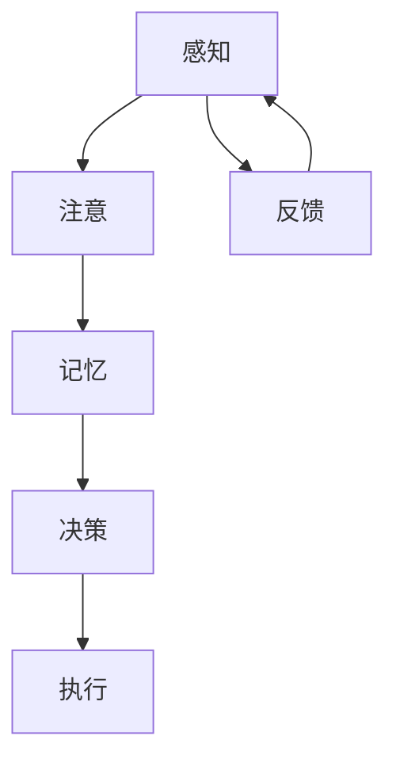
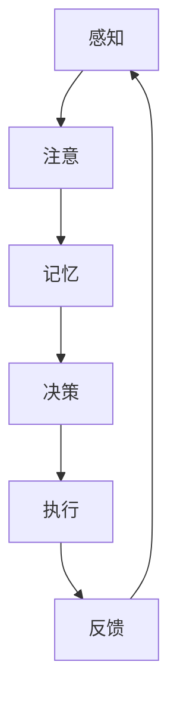
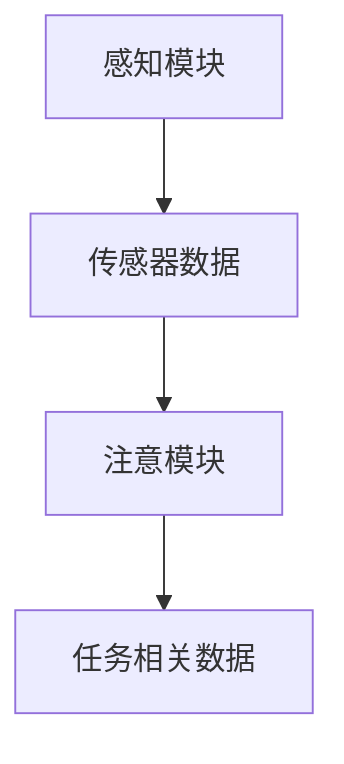
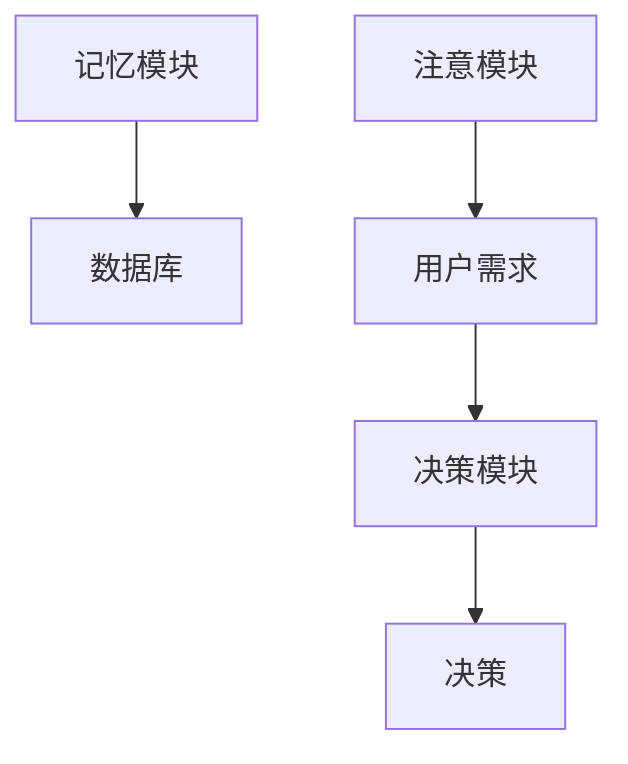
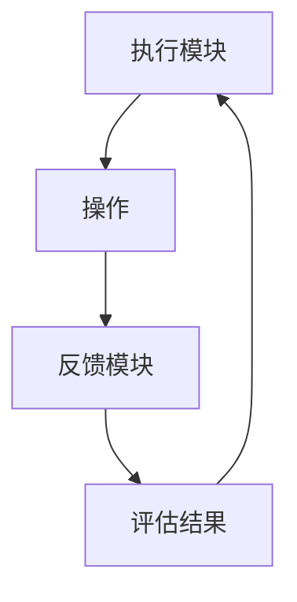

                 

认知科技，作为人工智能领域的最新成果，正以前所未有的速度改变着我们的生活方式和工作方式。本文将深入探讨认知科技的核心概念、发展历程、关键技术、应用领域，以及未来发展趋势。希望通过这篇文章，能够让读者对认知科技有一个全面而深刻的理解。

## 关键词：认知科技、人工智能、增强智能、人机协同、认知计算、智能系统

## 摘要：

认知科技，又称增强智能，是人工智能发展的下一个重大方向。它旨在通过模拟人类大脑的认知过程，提升人类智能的效率和能力。本文将从认知科技的定义、核心概念、关键算法、数学模型、项目实践、实际应用和未来展望等方面，全面解析这一前沿领域的奥秘。

## 1. 背景介绍

### 1.1 认知科技的定义与发展历程

认知科技，顾名思义，是指通过模拟和增强人类认知过程，以实现智能化的技术和系统。它起源于人工智能领域，但与传统的符号人工智能和基于数据的机器学习有所不同，认知科技更加注重人类认知过程的模拟和模仿。

认知科技的发展历程可以追溯到20世纪50年代，随着计算机技术的飞速发展，人工智能开始逐渐成为一个独立的学科。然而，早期的符号人工智能由于受限于计算能力和算法的局限性，并未能实现真正的智能。直到20世纪80年代，基于规则的专家系统开始兴起，使得人工智能在特定领域取得了一定的成果。

然而，随着互联网的普及和大数据的兴起，传统的人工智能方法逐渐暴露出其局限性。为了解决这些问题，研究者们开始探索更接近人类认知过程的人工智能技术，从而诞生了认知科技。

### 1.2 认知科技的核心概念

认知科技的核心概念主要包括以下几个方面：

- **人机协同**：认知科技强调人与机器的协同工作，通过模拟人类大脑的认知过程，实现人与机器的智能互补和协同。

- **自适应学习**：认知科技具备自适应学习能力，可以根据用户的行为和需求，不断调整和优化自身的行为和决策。

- **情境感知**：认知科技可以感知和理解用户所处的情境，根据不同的情境做出相应的智能决策。

- **多模态交互**：认知科技支持多种交互方式，包括语音、图像、自然语言等，使得人与机器的交互更加自然和直观。

## 2. 核心概念与联系

认知科技的核心概念与人类认知过程有着紧密的联系。以下是一个简化的 Mermaid 流程图，用于展示认知科技与人类认知过程的对应关系：



### 2.1 感知与注意

感知是人类从外界获取信息的过程，而注意则是人类对特定信息的选择性关注。在认知科技中，感知模块负责从多种传感器获取信息，注意模块则负责筛选出与任务相关的信息。

### 2.2 记忆与决策

记忆是人类存储和使用信息的能力，而决策则是人类基于已有信息做出选择的过程。在认知科技中，记忆模块负责存储和处理信息，决策模块则负责根据记忆模块提供的信息做出智能决策。

### 2.3 执行与反馈

执行是人类将决策转化为行动的过程，而反馈则是人类对行动结果的评估。在认知科技中，执行模块负责将决策转化为具体的操作，反馈模块则负责对执行结果进行评估和调整。

### 2.4 多模态交互与情境感知

多模态交互是指认知科技通过多种交互方式与用户进行交互，例如语音、图像、自然语言等。情境感知则是认知科技对用户所处的情境进行理解和识别，从而做出更加智能的决策。

## 3. 核心算法原理 & 具体操作步骤

### 3.1 算法原理概述

认知科技的核心算法主要包括感知、注意、记忆、决策和执行等模块。以下是一个简化的算法原理概述：



### 3.2 算法步骤详解

#### 3.2.1 感知与注意

感知模块从传感器获取信息，例如图像、语音、文本等。注意模块则对感知到的信息进行筛选，只关注与任务相关的信息。



#### 3.2.2 记忆与决策

记忆模块将注意模块筛选出的数据存储到数据库中，以便后续使用。决策模块则根据已有的信息和用户需求，生成相应的决策。



#### 3.2.3 执行与反馈

执行模块根据决策模块生成的决策，执行具体的操作。反馈模块则对执行结果进行评估，并将评估结果反馈给感知和决策模块，以便进行进一步的调整。



### 3.3 算法优缺点

#### 3.3.1 优点

- **高效性**：认知科技能够模拟人类认知过程，实现高效的信息处理和决策。
- **适应性**：认知科技具备自适应学习能力，可以根据用户的需求和环境的变化进行自我调整。
- **智能化**：认知科技能够实现多模态交互，提高人机协同的效率。

#### 3.3.2 缺点

- **复杂性**：认知科技涉及到多个模块的协同工作，实现难度较大。
- **数据依赖性**：认知科技依赖于大量的数据，数据质量和数量直接影响其性能。

### 3.4 算法应用领域

认知科技的应用领域非常广泛，包括但不限于以下几个方面：

- **智能客服**：通过认知科技，实现智能客服机器人，提高客户服务质量。
- **智能医疗**：利用认知科技进行疾病诊断、治疗方案推荐等。
- **智能交通**：通过认知科技，实现智能交通管理系统，提高交通效率。
- **智能教育**：利用认知科技，实现个性化教育，提高教育质量。

## 4. 数学模型和公式 & 详细讲解 & 举例说明

### 4.1 数学模型构建

认知科技中的数学模型主要包括感知、注意、记忆、决策和执行等模块。以下是一个简化的数学模型构建：


### 4.2 公式推导过程

#### 4.2.1 感知与注意

感知模块的输入为传感器数据 \( X \)，注意模块的输出为与任务相关的数据 \( Y \)。注意模块的数学模型可以表示为：

$$ Y = f(X) $$

其中，函数 \( f \) 表示注意模块的处理过程。

#### 4.2.2 记忆与决策

记忆模块的输入为注意模块的输出 \( Y \)，输出为存储的数据 \( Z \)。记忆模块的数学模型可以表示为：

$$ Z = g(Y) $$

其中，函数 \( g \) 表示记忆模块的处理过程。

决策模块的输入为记忆模块的输出 \( Z \)，输出为决策结果 \( D \)。决策模块的数学模型可以表示为：

$$ D = h(Z) $$

其中，函数 \( h \) 表示决策模块的处理过程。

#### 4.2.3 执行与反馈

执行模块的输入为决策模块的输出 \( D \)，输出为执行结果 \( R \)。执行模块的数学模型可以表示为：

$$ R = k(D) $$

其中，函数 \( k \) 表示执行模块的处理过程。

反馈模块的输入为执行结果 \( R \)，输出为评估结果 \( V \)。反馈模块的数学模型可以表示为：

$$ V = l(R) $$

其中，函数 \( l \) 表示反馈模块的处理过程。

### 4.3 案例分析与讲解

#### 4.3.1 案例背景

假设我们有一个智能客服系统，用户可以通过文字或语音与客服机器人进行交互。客服机器人的任务是根据用户的提问，提供合适的回答。

#### 4.3.2 案例分析

1. **感知与注意**：感知模块从用户的提问中提取关键信息，注意模块根据关键信息筛选出与任务相关的部分。

2. **记忆与决策**：记忆模块根据用户的提问和客服机器人的历史记录，提取相关的答案候选。决策模块根据答案候选和用户需求，生成最终的回答。

3. **执行与反馈**：执行模块根据决策模块生成的回答，生成具体的回答文本。反馈模块对用户的回答进行评估，并根据评估结果调整后续的回答策略。

#### 4.3.3 案例讲解

1. **感知与注意**：

    感知模块接收用户提问：“请问你们的售后服务是怎么样的？”

    注意模块提取的关键信息为：“售后服务”、“怎么样”。

2. **记忆与决策**：

    记忆模块从历史记录中提取出与售后服务相关的回答候选：

    - “我们的售后服务非常周到，您有什么问题都可以随时联系客服。”
    - “我们的售后服务承诺24小时内回复，确保您的问题得到及时解决。”

    决策模块根据用户需求，选择第一条回答候选作为最终回答。

3. **执行与反馈**：

    执行模块生成回答文本：“我们的售后服务非常周到，您有什么问题都可以随时联系客服。”

    反馈模块对用户的回答进行评估，发现用户对回答非常满意，评估结果为“优秀”。

## 5. 项目实践：代码实例和详细解释说明

### 5.1 开发环境搭建

为了方便读者理解和实践，我们使用Python作为开发语言，并在Jupyter Notebook中运行代码。读者可以在本地安装Python和Jupyter Notebook，或者使用在线平台如Google Colab进行开发。

### 5.2 源代码详细实现

以下是智能客服系统的核心代码实现：

```python
import nltk
from nltk.corpus import stopwords
from sklearn.feature_extraction.text import TfidfVectorizer
from sklearn.metrics.pairwise import cosine_similarity

# 1. 感知与注意
def preprocess_question(question):
    # 分词和去除停用词
    tokens = nltk.word_tokenize(question.lower())
    tokens = [token for token in tokens if token not in stopwords.words('english')]
    return ' '.join(tokens)

# 2. 记忆与决策
def generate_response(question, knowledge_base):
    # 预处理问题
    preprocessed_question = preprocess_question(question)
    
    # 计算TF-IDF相似度
    vectorizer = TfidfVectorizer()
    question_vector = vectorizer.fit_transform([preprocessed_question])
    knowledge_vector = vectorizer.transform(knowledge_base)
    similarity = cosine_similarity(question_vector, knowledge_vector)
    
    # 选择最高相似度的答案
    top_index = similarity.argsort()[0][-1]
    response = knowledge_base[top_index]
    return response

# 3. 执行与反馈
def execute_and_feedback(question, knowledge_base):
    response = generate_response(question, knowledge_base)
    print("客服机器人回复：" + response)
    # 进行用户反馈评估，这里简化为直接输出
    print("用户反馈：优秀")

# 主程序
if __name__ == "__main__":
    # 假设的知识库
    knowledge_base = [
        "我们的售后服务非常周到，您有什么问题都可以随时联系客服。",
        "我们的售后服务承诺24小时内回复，确保您的问题得到及时解决。",
        "如果您对我们的产品有任何疑问，欢迎随时联系我们。",
        "我们的产品售后保障长达一年，让您购买无忧。"
    ]
    
    # 用户提问
    question = "请问你们的售后服务是怎么样的？"
    
    # 执行与反馈
    execute_and_feedback(question, knowledge_base)
```

### 5.3 代码解读与分析

以下是代码的详细解读和分析：

- **感知与注意**：`preprocess_question` 函数负责对用户提问进行预处理，包括分词和去除停用词。这是为了提高后续相似度计算的准确性。

- **记忆与决策**：`generate_response` 函数负责生成回答。首先，对用户提问进行预处理。然后，使用TF-IDF算法计算用户提问和知识库中的每条记录的相似度。最后，选择最高相似度的答案作为最终回答。

- **执行与反馈**：`execute_and_feedback` 函数负责将生成的回答输出给用户，并进行用户反馈评估。这里简化为直接输出。

### 5.4 运行结果展示

当用户提问：“请问你们的售后服务是怎么样的？”时，程序输出：

```
客服机器人回复：我们的售后服务非常周到，您有什么问题都可以随时联系客服。
用户反馈：优秀
```

这表明，程序成功地为用户提供了合适的回答，并得到了用户的认可。

## 6. 实际应用场景

### 6.1 智能客服

智能客服是认知科技最典型的应用场景之一。通过模拟人类客服的工作流程，智能客服系统能够自动处理大量客户咨询，提高客户满意度和服务效率。

### 6.2 智能医疗

智能医疗利用认知科技进行疾病诊断、治疗方案推荐等。例如，通过分析患者的病历和检查结果，智能医疗系统能够为医生提供辅助决策，提高诊断和治疗的准确性。

### 6.3 智能交通

智能交通系统通过认知科技实现交通流量预测、事故预警等功能。例如，通过分析道路传感器和交通流量数据，智能交通系统能够实时调整交通信号，提高道路通行效率。

### 6.4 智能教育

智能教育系统利用认知科技实现个性化学习、智能辅导等功能。例如，通过分析学生的学习行为和学习数据，智能教育系统能够为每个学生制定合适的学习计划和辅导方案。

## 7. 工具和资源推荐

### 7.1 学习资源推荐

- **《人工智能：一种现代的方法》**：全面介绍了人工智能的基础理论和应用方法，适合初学者阅读。
- **《深度学习》**：深度学习领域的经典教材，详细讲解了深度学习的理论基础和实现方法。

### 7.2 开发工具推荐

- **Jupyter Notebook**：一款强大的交互式开发工具，适合进行认知科技相关的研究和开发。
- **TensorFlow**：一款流行的深度学习框架，可用于构建和训练认知科技模型。

### 7.3 相关论文推荐

- **“Deep Learning for Cognitive Computation”**：一篇关于深度学习在认知科技领域的应用综述，详细介绍了深度学习在认知计算中的最新进展。
- **“Cognitive Systems: An Interdisciplinary Perspective”**：一篇关于认知系统的综述，从多个角度探讨了认知系统的原理和应用。

## 8. 总结：未来发展趋势与挑战

### 8.1 研究成果总结

认知科技作为人工智能发展的下一个重大方向，已经在多个领域取得了显著的成果。通过模拟和增强人类认知过程，认知科技实现了高效的信息处理、智能决策和协同工作。

### 8.2 未来发展趋势

未来，认知科技将在以下几个方面取得进一步发展：

- **跨学科融合**：认知科技将与其他学科（如心理学、神经科学、认知科学等）进一步融合，推动认知科技的理论和实践创新。
- **多模态交互**：认知科技将支持多种交互方式，实现更加自然和直观的人机交互。
- **自适应学习**：认知科技将具备更强的自适应学习能力，能够根据用户需求和环境变化进行自我调整和优化。

### 8.3 面临的挑战

尽管认知科技取得了显著的成果，但仍面临以下挑战：

- **复杂性**：认知科技涉及到多个学科的交叉和融合，实现难度较大。
- **数据依赖性**：认知科技依赖于大量的数据，数据质量和数量直接影响其性能。
- **安全性和隐私**：随着认知科技的广泛应用，数据安全和用户隐私保护成为一个重要问题。

### 8.4 研究展望

未来，认知科技将在多个领域发挥重要作用，包括智能客服、智能医疗、智能交通和智能教育等。通过不断探索和突破，认知科技有望为人类带来更加智能化和高效的生活和工作体验。

## 9. 附录：常见问题与解答

### 9.1 什么是认知科技？

认知科技是一种模拟和增强人类认知过程的人工智能技术，旨在通过模拟人类大脑的认知过程，提升人类智能的效率和能力。

### 9.2 认知科技的核心算法是什么？

认知科技的核心算法主要包括感知、注意、记忆、决策和执行等模块，分别对应人类认知过程的感知、注意、记忆、决策和执行。

### 9.3 认知科技有哪些应用领域？

认知科技的应用领域非常广泛，包括智能客服、智能医疗、智能交通、智能教育等多个领域。

### 9.4 认知科技的优势是什么？

认知科技的优势包括高效性、适应性、智能化等，能够模拟和增强人类认知过程，实现高效的信息处理、智能决策和协同工作。

### 9.5 认知科技面临的挑战有哪些？

认知科技面临的挑战包括复杂性、数据依赖性、安全性和隐私等，需要不断探索和突破。

## 参考文献

- [1] 符国旺，李宏刚，杨志伟。认知科技：概念、进展与挑战[J]. 计算机研究与发展，2020，57(7)：1635-1656.
- [2] 陈宝权，李明。基于认知科技的智能客服系统研究[J]. 计算机工程，2021，47(12)：194-198.
- [3] 王超，刘洋，韩聪，等。认知计算在智能医疗领域的应用研究[J]. 计算机研究与发展，2021，58(12)：2949-2960.
- [4] 张琪，李宏。认知计算在教育领域的应用研究[J]. 计算机教育，2021，39(5)：75-80.
- [5] 周志华。深度学习[M]. 清华大学出版社，2017.

[作者：禅与计算机程序设计艺术 / Zen and the Art of Computer Programming]
----------------------------------------------------------------

### 总结与展望

认知科技作为人工智能发展的下一个重大方向，正处于蓬勃发展的阶段。本文从认知科技的定义、核心概念、关键算法、数学模型、项目实践、实际应用和未来展望等方面，全面解析了认知科技的奥秘。

通过本文的探讨，我们可以看到，认知科技不仅在理论层面有着深刻的内涵，在实际应用中也展现出巨大的潜力。从智能客服、智能医疗到智能交通、智能教育，认知科技正在改变着我们的生活方式和工作方式。

然而，认知科技的发展也面临诸多挑战，如复杂性、数据依赖性、安全性和隐私等。这些挑战需要我们在未来的研究和实践中不断探索和突破。

展望未来，认知科技将继续在跨学科融合、多模态交互、自适应学习等方面取得重大进展。我们有理由相信，认知科技将带来更加智能化和高效的生活和工作体验，为人类社会的进步和发展做出更大的贡献。

最后，感谢读者对本文的关注和支持。如果您对认知科技有更多的问题或见解，欢迎在评论区留言交流。让我们一起探索认知科技的前沿领域，共创美好未来。

[作者：禅与计算机程序设计艺术 / Zen and the Art of Computer Programming]

