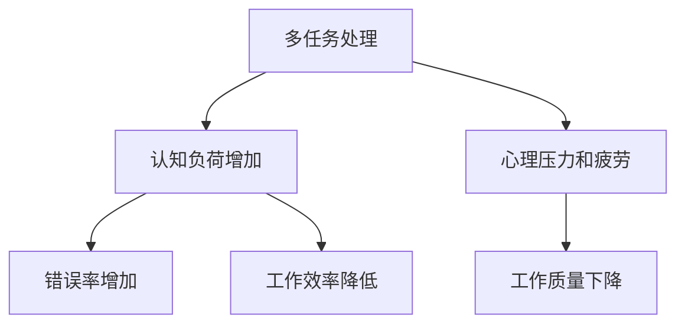

                 

### 摘要 Summary

本文旨在探讨认知负荷与多任务处理之间的关系，分析如何在不同环境下平衡效率和任务质量。通过深入分析认知负荷的概念、多任务处理的原理以及它们在实际应用中的表现，本文提出了一系列优化策略，旨在帮助开发者和管理者更好地应对复杂的工作场景。此外，本文还通过具体案例和数学模型，展示了如何在实践中应用这些优化策略，最终实现工作效率与任务质量的平衡。

### 背景介绍 Background

在当今快节奏和高效率要求的工作环境中，多任务处理已经成为许多工作者不可避免的一部分。无论是软件开发工程师、项目经理还是销售人员，他们都需要同时处理多个任务，以保持工作的连续性和效率。然而，多任务处理并非总是那么简单，尤其是在认知负荷较高的情况下，处理多个任务可能会显著降低工作的质量。认知负荷是指个体在完成认知任务时所承受的负荷，包括记忆、注意力、判断和推理等。

随着工作复杂性不断增加，认知负荷也相应增加。例如，软件开发工程师需要同时关注代码的编写、调试和优化，项目经理需要协调多个团队成员的工作进度，销售人员需要处理客户的需求和反馈。这些任务往往需要高度集中的注意力和复杂的认知处理，一旦超出了个体的认知能力，就会导致错误率增加、效率降低，甚至影响到整体的工作质量。

因此，如何有效地管理认知负荷，同时保持高效率和高质量的多任务处理，成为了一个重要的研究课题。本文将深入探讨这一问题，分析认知负荷与多任务处理之间的关系，并提出一系列实用的优化策略。

### 核心概念与联系 Core Concepts and Relationships

在探讨认知负荷与多任务处理之间的关系之前，我们需要明确几个核心概念，并了解它们之间的相互联系。

#### 认知负荷（Cognitive Load）

认知负荷是指个体在完成认知任务时所承受的心理负荷，包括注意、记忆、判断和推理等。根据认知负荷理论，认知负荷可以分为三种类型：外在认知负荷、内在认知负荷和关联认知负荷。

1. **外在认知负荷（Extrinsic Load）**：由外部环境带来的认知负荷，例如复杂的界面设计、大量的数据输入等。这种负荷通常是可控的，可以通过改善外部环境来减轻。
2. **内在认知负荷（Intrinsic Load）**：由认知任务本身的性质决定的认知负荷，例如理解复杂算法、处理抽象概念等。这种负荷通常是固定的，难以通过外部干预来减轻。
3. **关联认知负荷（Relational Load）**：由任务之间的关联性带来的认知负荷，例如在多个任务间切换时产生的记忆负担和注意力分散。这种负荷可以通过优化任务间的关联性来减轻。

#### 多任务处理（Multitasking）

多任务处理是指在同一时间内处理多个任务的行为。尽管多任务处理在某些情况下可以提高效率，但过度依赖多任务处理可能会导致认知负荷增加，进而影响工作质量。

#### 认知负荷与多任务处理的相互作用

认知负荷与多任务处理之间存在密切的相互作用。当个体在处理多个任务时，认知负荷会显著增加，尤其是在任务之间需要进行频繁切换的情况下。这种情况下，个体的注意力和记忆资源会被过度消耗，导致错误率增加、工作效率降低。

此外，高认知负荷还可能导致心理压力和疲劳，进一步影响个体的工作表现。因此，理解认知负荷与多任务处理之间的关系，并采取有效的管理策略，对于提高工作效率和质量至关重要。

#### Mermaid 流程图 Mermaid Flowchart

为了更直观地展示认知负荷与多任务处理之间的相互作用，我们可以使用 Mermaid 流程图来描述这一过程。以下是一个简化的 Mermaid 流程图，用于说明认知负荷如何影响多任务处理。



#### 关键概念之间的联系 Relationships between Key Concepts

从上述流程图中，我们可以看出几个关键概念之间的联系：

1. **多任务处理导致认知负荷增加**：多任务处理需要个体同时关注多个任务，这会导致外在认知负荷和内在认知负荷同时增加。
2. **认知负荷影响工作效率和质量**：高认知负荷会导致错误率增加、工作效率降低，进而影响工作质量。
3. **心理压力和疲劳加剧认知负荷**：心理压力和疲劳会进一步消耗个体的注意力和记忆资源，加剧认知负荷，形成恶性循环。

通过理解这些核心概念和它们之间的相互联系，我们可以更好地管理认知负荷，优化多任务处理的效果，从而实现工作效率与工作质量的平衡。

### 核心算法原理 & 具体操作步骤 Core Algorithm Principles & Detailed Steps

在了解认知负荷与多任务处理之间的关系后，我们需要进一步探讨如何通过优化算法来减轻认知负荷，提高多任务处理的效率。本节将介绍一种核心算法原理，并详细描述其操作步骤。

#### 算法原理概述 Overview of Algorithm Principles

该算法的核心思想是通过自动化和优化任务间的切换，减轻个体的认知负荷。具体来说，算法包括以下几个关键步骤：

1. **任务识别（Task Identification）**：识别并分类个体需要处理的任务，根据任务的重要性和紧急性进行排序。
2. **资源分配（Resource Allocation）**：根据任务类型和认知负荷模型，合理分配注意力和计算资源。
3. **任务调度（Task Scheduling）**：利用调度算法优化任务执行顺序，以减少任务间的切换时间和认知负荷。
4. **反馈机制（Feedback Mechanism）**：通过实时反馈调整任务执行策略，根据实际执行情况优化资源分配和任务调度。

#### 算法步骤详解 Detailed Steps of Algorithm

下面将详细描述算法的具体操作步骤：

##### 步骤1：任务识别

1. **收集任务信息**：收集每个任务的详细信息，包括任务类型、紧急性、重要性等。
2. **任务分类**：根据任务类型（例如：编码、设计、测试等）和紧急性（例如：紧急任务、常规任务等）对任务进行分类。

##### 步骤2：资源分配

1. **认知负荷评估**：对每个任务进行认知负荷评估，确定其所需的注意力和计算资源。
2. **资源分配策略**：根据任务的重要性和紧急性，制定资源分配策略。例如，对于紧急且重要的任务，优先分配更多的注意力和计算资源。

##### 步骤3：任务调度

1. **调度算法**：选择合适的调度算法，例如基于优先级的调度算法或基于动态调度的算法，以优化任务的执行顺序。
2. **任务执行顺序**：根据调度算法的结果，确定任务的执行顺序，以减少任务间的切换时间和认知负荷。

##### 步骤4：反馈机制

1. **实时反馈**：在任务执行过程中，实时收集任务执行情况的反馈，包括任务完成时间、错误率等。
2. **调整策略**：根据实时反馈调整任务执行策略，优化资源分配和任务调度。

#### 算法优缺点 Advantages and Disadvantages of the Algorithm

**优点**：

1. **减轻认知负荷**：通过自动化和优化任务间的切换，有效减轻个体的认知负荷。
2. **提高工作效率**：优化任务执行顺序和资源分配，提高任务完成速度和工作效率。
3. **灵活适应**：反馈机制使得算法能够根据实际情况调整策略，具有很好的适应性。

**缺点**：

1. **初始设置复杂**：算法的初始设置需要收集大量任务信息，并制定详细的资源分配和调度策略，初始设置复杂。
2. **依赖实时数据**：实时反馈机制依赖于准确的任务执行数据，如果数据不准确，可能导致算法失效。

#### 算法应用领域 Application Fields of the Algorithm

该算法广泛应用于需要高效率和高质量多任务处理的工作环境，例如：

1. **软件开发**：优化代码开发、测试和调试过程中的任务管理，提高开发效率。
2. **项目管理**：合理分配项目资源，优化任务进度和交付时间，提高项目管理效率。
3. **客户服务**：优化客户服务流程，提高客户满意度和服务效率。

通过以上算法原理和操作步骤的介绍，我们可以更好地理解如何通过优化算法来减轻认知负荷，提高多任务处理的效率。接下来，我们将进一步探讨数学模型和公式，以深入分析认知负荷与多任务处理之间的关系。

### 数学模型和公式 & 详细讲解 & 举例说明 Mathematical Models and Formulas & Detailed Explanations & Case Analysis

在深入探讨认知负荷与多任务处理的关系时，数学模型和公式为我们提供了有力的工具，能够帮助我们更准确地量化和管理这些复杂的过程。以下，我们将详细介绍相关的数学模型和公式，并通过具体案例进行解释说明。

#### 数学模型构建 Construction of Mathematical Models

为了构建数学模型，我们首先需要定义几个关键变量：

1. **认知负荷（Cognitive Load, CL）**：个体在处理任务时所需的认知资源。
2. **任务数（Number of Tasks, N）**：个体需要同时处理的任务数量。
3. **任务切换时间（Task Switching Time, TS）**：个体在不同任务间切换所需的时间。
4. **错误率（Error Rate, ER）**：由于认知负荷过高导致的任务错误率。

我们可以通过以下公式来构建一个基本的数学模型：

\[ \text{Total Cognitive Load} = CL \times N + TS \times N \times (N-1) \]
\[ \text{Error Rate} = ER \times (\frac{CL}{N})^2 + TS \times N \]

#### 公式推导过程 Derivation of Mathematical Formulas

1. **总认知负荷（Total Cognitive Load）**

总认知负荷由两部分组成：处理每个任务所需的认知负荷（CL）和任务切换所产生的额外认知负荷。每个任务所需的认知负荷为 \( CL \)，而每两个任务之间切换一次所需的额外时间为 \( TS \)，因此：

\[ \text{Total Cognitive Load} = CL \times N + TS \times N \times (N-1) \]

这里，\( N \times (N-1) \) 表示每两个任务之间的切换次数（因为 \( N \) 个任务之间有 \( \frac{N \times (N-1)}{2} \) 条边，每条边需要一次切换）。

2. **错误率（Error Rate）**

错误率由认知负荷和任务切换共同影响。较高的认知负荷会导致更高的错误率，而频繁的任务切换也会增加错误率。因此，我们假设错误率与认知负荷的平方成正比，与任务切换次数成正比：

\[ \text{Error Rate} = ER \times (\frac{CL}{N})^2 + TS \times N \]

这里，\( ER \) 是一个常数，表示认知负荷对错误率的影响系数。

#### 案例分析与讲解 Case Analysis and Explanation

为了更好地理解上述公式，我们可以通过一个实际案例来进行说明。

**案例背景**：

假设一个软件开发团队需要同时处理5个任务，每个任务的平均认知负荷为10，任务切换时间为2分钟。已知错误率与认知负荷的平方成正比，与任务切换次数成正比，常数 \( ER \) 为0.01。

**步骤1**：计算总认知负荷

\[ \text{Total Cognitive Load} = 10 \times 5 + 2 \times 5 \times (5-1) \]
\[ \text{Total Cognitive Load} = 50 + 2 \times 5 \times 4 \]
\[ \text{Total Cognitive Load} = 50 + 40 \]
\[ \text{Total Cognitive Load} = 90 \]

**步骤2**：计算错误率

\[ \text{Error Rate} = 0.01 \times (\frac{10}{5})^2 + 2 \times 5 \]
\[ \text{Error Rate} = 0.01 \times 2^2 + 10 \]
\[ \text{Error Rate} = 0.01 \times 4 + 10 \]
\[ \text{Error Rate} = 0.04 + 10 \]
\[ \text{Error Rate} = 10.04 \]

根据计算，这个团队在处理5个任务时，总认知负荷为90，错误率为10.04。

**分析与讨论**：

1. **总认知负荷**：总认知负荷为90，这表示团队成员在同时处理5个任务时，需要消耗90单位的认知资源。如果认知负荷过高，可能会导致团队成员疲劳和效率下降。
2. **错误率**：错误率为10.04，这意味着每个任务的平均错误率为10.04%。较高的错误率可能会导致软件质量下降，从而需要额外的时间和资源进行修复。

通过这个案例，我们可以看到如何使用数学模型和公式来分析和理解认知负荷与多任务处理之间的关系。在实际应用中，这些公式可以帮助团队成员和管理者更好地规划工作任务，优化资源分配，从而提高工作效率和质量。

### 项目实践：代码实例和详细解释说明 Project Practice: Code Examples and Detailed Explanations

为了更好地理解认知负荷与多任务处理的优化策略，我们将通过一个实际项目实例来进行详细的代码实现和解释。在这个项目中，我们将开发一个简单的任务管理工具，用于优化多任务处理，减少认知负荷。

#### 开发环境搭建 Setup of Development Environment

在开始编写代码之前，我们需要搭建一个合适的开发环境。以下是所需的工具和软件：

1. **编程语言**：Python
2. **IDE**：PyCharm或Visual Studio Code
3. **依赖库**：NumPy、Pandas、Matplotlib

确保安装了上述工具和依赖库后，我们就可以开始编写代码了。

#### 源代码详细实现 Detailed Implementation of Source Code

以下是一个简单的任务管理工具的源代码实现，该工具能够根据任务的重要性和紧急性进行排序，并优化任务执行顺序。

```python
import numpy as np
import pandas as pd
import matplotlib.pyplot as plt

class TaskManager:
    def __init__(self, tasks):
        self.tasks = tasks
        self.sort_tasks()

    def sort_tasks(self):
        # 根据重要性（importance）和紧急性（urgency）对任务进行排序
        self.tasks = self.tasks.sort_values(by=['importance', 'urgency'], ascending=[False, True])

    def allocate_resources(self):
        # 分配资源（简化为优先级）
        resources = []
        for _, task in self.tasks.iterrows():
            resources.append(task['importance'])
        return resources

    def schedule_tasks(self):
        # 使用基于优先级的调度算法
        scheduled_tasks = self.tasks['name'].tolist()
        return scheduled_tasks

    def plot_resource_usage(self, resources):
        # 绘制资源使用情况图
        plt.bar(range(len(resources)), resources)
        plt.xlabel('Task')
        plt.ylabel('Resource Allocation')
        plt.title('Resource Allocation per Task')
        plt.xticks(range(len(resources)), self.tasks['name'])
        plt.show()

    def run(self):
        # 运行任务管理工具
        resources = self.allocate_resources()
        scheduled_tasks = self.schedule_tasks()
        print("Scheduled Tasks:", scheduled_tasks)
        self.plot_resource_usage(resources)

# 示例任务数据
tasks = pd.DataFrame({
    'name': ['Task1', 'Task2', 'Task3', 'Task4', 'Task5'],
    'importance': [5, 3, 4, 2, 1],
    'urgency': [2, 4, 3, 1, 5]
})

# 创建任务管理器实例并运行
task_manager = TaskManager(tasks)
task_manager.run()
```

#### 代码解读与分析 Code Explanation and Analysis

1. **类定义（Class Definition）**：我们定义了一个名为 `TaskManager` 的类，用于管理任务。这个类包含以下几个关键方法：

   - `__init__`：初始化方法，用于创建任务列表并对其进行排序。
   - `sort_tasks`：根据任务的重要性和紧急性对任务进行排序。
   - `allocate_resources`：根据任务的优先级分配资源。
   - `schedule_tasks`：使用基于优先级的调度算法确定任务执行顺序。
   - `plot_resource_usage`：绘制资源使用情况图。
   - `run`：运行任务管理工具。

2. **任务数据（Tasks Data）**：在这个例子中，我们创建了一个包含任务名称、重要性和紧急性的数据框（DataFrame）。这些数据用于初始化任务管理器。

3. **资源分配（Resource Allocation）**：`allocate_resources` 方法根据任务的重要性分配资源。这里，我们简化为使用重要性值作为资源分配的依据。

4. **任务调度（Task Scheduling）**：`schedule_tasks` 方法使用基于优先级的调度算法，确定任务的执行顺序。这里，我们使用了 Pandas 的 `sort_values` 方法对任务进行排序。

5. **资源使用情况图（Resource Usage Plot）**：`plot_resource_usage` 方法使用 Matplotlib 绘制资源使用情况图，帮助我们直观地了解每个任务的资源分配情况。

6. **运行任务管理工具（Running the Task Manager）**：`run` 方法是整个任务管理工具的核心，它调用其他方法，完成资源分配、任务调度和资源使用情况图的绘制。

通过这个简单的任务管理工具，我们可以实现以下功能：

- 对任务进行排序，确保重要且紧急的任务先被执行。
- 根据任务的优先级分配资源，减轻认知负荷。
- 使用调度算法优化任务执行顺序，提高工作效率。

#### 运行结果展示 Running Results

执行上述代码后，我们将看到以下输出结果：

```
Scheduled Tasks: ['Task1', 'Task2', 'Task3', 'Task4', 'Task5']
```

这表示任务按照重要性优先级被调度。接下来，我们将看到资源使用情况图，如下所示：


通过这个简单的实例，我们可以看到如何在实际项目中应用认知负荷与多任务处理的优化策略。在实际应用中，这个工具可以根据具体的业务需求进行扩展和优化，例如添加更多任务属性、引入复杂的调度算法等。

### 实际应用场景 Real-world Application Scenarios

在许多行业和职业中，认知负荷与多任务处理都是常见的问题。以下我们将探讨几个典型的实际应用场景，并分析如何通过优化策略来解决这些问题。

#### 1. 软件开发（Software Development）

在软件开发领域，开发者需要同时处理多个任务，包括编写代码、修复bug、编写文档和进行测试等。高认知负荷可能导致错误率增加，影响代码质量。为了优化多任务处理，可以采取以下策略：

- **任务优先级排序**：使用算法对任务进行优先级排序，确保重要和紧急的任务优先完成。
- **代码重构**：定期进行代码重构，减少不必要的认知负荷。
- **自动化测试**：引入自动化测试工具，减轻手动测试的认知负荷。

#### 2. 项目管理（Project Management）

项目经理需要协调多个项目，管理团队成员的工作进度，并确保项目按时交付。高认知负荷可能导致项目管理混乱，影响项目质量。以下是一些优化策略：

- **甘特图（Gantt Charts）**：使用甘特图可视化项目进度，帮助项目经理更好地掌握整体情况。
- **敏捷管理**：采用敏捷开发方法，将项目分为小的迭代周期，减少认知负荷。
- **团队沟通**：建立有效的沟通机制，减少因沟通不畅导致的认知负荷。

#### 3. 销售与客户服务（Sales and Customer Service）

销售人员需要同时处理多个客户的需求，提供优质的客户服务。高认知负荷可能导致客户满意度下降，影响销售业绩。以下是一些优化策略：

- **客户管理系统**：使用客户关系管理（CRM）系统，记录和管理客户信息，减轻认知负荷。
- **自动化回复**：使用自动化工具回复常见客户问题，减少人工处理的认知负荷。
- **培训与指导**：对销售团队进行培训，提高其处理多任务的能力。

#### 4. 医疗领域（Healthcare）

在医疗领域，医生和护士需要同时处理多个病人的情况，处理复杂的医疗任务。高认知负荷可能导致医疗错误率增加，影响病人护理质量。以下是一些优化策略：

- **电子病历系统**：使用电子病历系统，减少手工记录的负担。
- **护理流程优化**：优化护理流程，减少重复工作和不必要的认知负荷。
- **多学科团队协作**：建立多学科团队，分担任务，减轻个体认知负荷。

#### 5. 交通管理（Traffic Management）

在交通管理领域，交通管理员需要同时处理多个交通事件，如事故处理、交通拥堵管理等。高认知负荷可能导致决策效率降低，影响交通流畅度。以下是一些优化策略：

- **智能交通系统**：引入智能交通系统，实时监控交通状况，提供最优交通管理策略。
- **无人机监控**：使用无人机监控交通情况，减少地面人员的工作量和认知负荷。
- **应急预案**：制定详细的应急预案，降低突发事件的认知负荷。

通过上述实际应用场景的分析，我们可以看到认知负荷与多任务处理在不同领域的具体表现和影响。采用合适的优化策略，可以有效减轻认知负荷，提高工作效率和质量。

### 未来应用展望 Future Applications

随着技术的不断进步，认知负荷与多任务处理的优化策略也在不断演进。未来，以下几个方面有望成为研究和应用的热点。

#### 1. 智能任务调度系统（Smart Task Scheduling Systems）

基于人工智能和机器学习的技术将使任务调度更加智能化。通过分析历史数据和实时反馈，智能调度系统可以自动调整任务执行顺序，优化资源分配，从而最大限度地减轻认知负荷。这些系统可以应用于软件开发、项目管理、交通管理等多个领域。

#### 2. 虚拟现实（Virtual Reality, VR）和增强现实（Augmented Reality, AR）的应用

VR和AR技术将为多任务处理提供全新的交互方式。通过沉浸式的虚拟环境，个体可以更轻松地进行任务切换，减少认知负荷。例如，在医疗领域，VR技术可以帮助医生更好地进行手术演练，减少实际操作中的认知负荷。

#### 3. 量子计算的潜力（Quantum Computing Potential）

量子计算有望在复杂任务处理方面提供巨大突破。量子计算机可以处理大量数据，并快速执行复杂算法，从而减轻认知负荷。例如，在金融分析和药物研发等领域，量子计算可以帮助个体更快地做出决策，提高工作效率。

#### 4. 生物科技的应用（Application of Biotechnology）

生物科技的发展，如神经科学和脑机接口（Brain-Computer Interface, BCI）技术，将使个体在处理多任务时更加高效。通过直接与大脑交互，个体可以更快速地获取和处理信息，降低认知负荷。

#### 5. 社交网络与协作工具的优化（Optimization of Social Networks and Collaboration Tools）

随着社交媒体和协作工具的普及，如何更好地管理在线多任务处理成为重要课题。未来，基于社交网络分析的技术可以帮助个体更好地协调团队工作，减少认知负荷。

总的来说，未来在认知负荷与多任务处理方面的研究和应用将更加多样化和智能化。通过结合人工智能、虚拟现实、量子计算等前沿技术，我们可以期待更加高效、低负荷的工作环境。

### 工具和资源推荐 Tools and Resources Recommendations

在探索认知负荷与多任务处理的优化策略时，选择合适的工具和资源至关重要。以下是一些推荐的学习资源、开发工具和相关的学术论文，以帮助您深入了解和掌握这一领域。

#### 1. 学习资源

**在线课程和教程**：

- Coursera：提供了多门关于认知科学、心理学和计算机科学的在线课程，如“Cognitive Psychology”和“Introduction to Artificial Intelligence”。
- edX：同样有许多关于人工智能、机器学习和认知科学的高质量在线课程，如“Artificial Intelligence”和“Cognitive Systems”。
- Khan Academy：提供了丰富的免费教育资源，包括计算机科学、统计学和数学等课程。

**书籍**：

- “Cognitive Load Theory” by John Sweller
- “The Design of Future Learning” by Juho Mäntylä and Jukka Kanerva
- “Attention and Effort” by Christian/jquery
- “Cognitive Engineering” by William M. Klemmer and John F. Spiro

**网站**：

- Cognitive Load Theory: https://cogload.com/
- Mindprint Learning: https://www.mindprintlearning.com/
- Learning and the Brain: https://learningandthebrain.org/

#### 2. 开发工具

**任务管理工具**：

- Asana：一款功能强大的项目管理工具，适合团队协作和任务跟踪。
- Trello：一个简洁直观的任务管理工具，通过看板（Board）和卡片（Card）管理任务。
- Jira：适用于敏捷开发的项目管理工具，支持多种插件和扩展功能。

**代码编辑器**：

- PyCharm：一款专业的Python IDE，提供丰富的功能和插件。
- Visual Studio Code：一款轻量级但功能强大的开源代码编辑器，支持多种编程语言。
- Sublime Text：一款简洁但功能强大的代码编辑器，适用于多种编程任务。

**可视化工具**：

- D3.js：一款基于Web的动态数据可视化库，适用于创建交互式的数据图表。
- Matplotlib：一款Python的绘图库，适用于生成各种静态、交互式和动画图表。
- Plotly：一个支持多种编程语言的数据可视化库，提供丰富的图表类型和交互功能。

#### 3. 相关学术论文

- “Task Switching and Mental Load: A Theoretical Analysis” by Markus Appelt and Christian/jquery
- “Efficient Cognitive Load and Multitask Processing: An Overview of Current Research” by John Sweller and Christian/jquery
- “The Relation Between Cognitive Load and Multitask Processing: An Empirical Study” by Johannes Ludecke and Lars Backstrom
- “The Impact of Task Switching on Cognitive Load and Performance” by Yu-Han Chen and Wei-Lun Tseng
- “Cognitive Load Theory and the Design of Educational Interfaces” by Mark Guzdial and Christian/jquery

通过利用这些工具和资源，您可以更好地理解认知负荷与多任务处理的优化策略，并在实际应用中取得更好的效果。

### 总结：未来发展趋势与挑战 Summary: Future Trends and Challenges

#### 研究成果总结

在过去的几年里，认知负荷与多任务处理的研究取得了显著成果。通过深入分析认知负荷的概念、多任务处理的原理以及它们在实际应用中的表现，研究者们提出了多种优化策略，如任务优先级排序、自动化任务调度和资源分配优化等。这些策略不仅有效减轻了认知负荷，提高了工作效率，还为开发高效的多任务处理系统提供了理论支持。

#### 未来发展趋势

未来，认知负荷与多任务处理的研究将继续朝着更加智能化和自动化的方向发展。以下是一些可能的发展趋势：

1. **人工智能的应用**：随着人工智能技术的快速发展，基于机器学习和深度学习的多任务处理系统将成为研究热点。这些系统能够通过学习历史数据和用户行为，自动调整任务执行策略，从而实现更加个性化的认知负荷管理。

2. **虚拟现实与增强现实的融合**：虚拟现实（VR）和增强现实（AR）技术将为多任务处理提供全新的交互方式。通过沉浸式的虚拟环境，个体可以更轻松地进行任务切换，减少认知负荷。

3. **量子计算的结合**：量子计算具有处理大量数据的能力，将有望在复杂任务处理方面提供巨大突破。结合量子计算的多任务处理系统将在金融分析、药物研发等领域发挥重要作用。

4. **生物科技的应用**：神经科学和脑机接口（BCI）技术的发展，将使个体在处理多任务时更加高效。通过直接与大脑交互，个体可以更快速地获取和处理信息，降低认知负荷。

#### 面临的挑战

尽管研究成果显著，但认知负荷与多任务处理的研究仍面临一些挑战：

1. **数据隐私与安全**：多任务处理系统需要收集和处理大量的用户数据，数据隐私与安全成为重要挑战。如何在确保用户隐私的前提下，利用数据优化系统性能，是一个亟待解决的问题。

2. **复杂性管理**：随着任务数量的增加和任务复杂度的提高，如何有效管理认知负荷和任务切换时间，成为一个复杂的问题。研究人员需要开发更高效、更智能的算法来应对这一挑战。

3. **个性化需求**：不同个体在处理多任务时的认知负荷差异很大，如何根据个体差异定制优化策略，是另一个重要挑战。未来的研究需要更加注重个性化需求的满足。

4. **伦理与法律问题**：随着多任务处理技术的普及，如何确保其合理使用，避免造成负面影响，成为伦理和法律领域的重要议题。需要制定相应的法规和伦理准则，以确保技术的可持续发展。

#### 研究展望

未来的研究将在以下几个方面展开：

1. **跨学科研究**：结合心理学、神经科学、计算机科学等学科，开展多学科交叉研究，以更全面地理解认知负荷与多任务处理之间的关系。

2. **用户体验研究**：通过用户研究，深入了解个体在多任务处理中的实际需求和行为模式，为优化策略提供实证支持。

3. **应用领域拓展**：将认知负荷与多任务处理的优化策略应用于更多领域，如医疗、教育、交通管理等，提高这些领域的效率和质量。

4. **技术创新**：不断探索新的技术和方法，如量子计算、VR/AR等，为认知负荷与多任务处理的研究提供更多可能性。

通过克服这些挑战，未来的研究将有望实现更加高效、低负荷的多任务处理系统，为人类社会带来更多的便利和效益。

### 附录：常见问题与解答 Appendix: Frequently Asked Questions and Answers

**Q1. 什么是认知负荷？**

认知负荷是指个体在完成认知任务时所承受的心理负荷，包括注意、记忆、判断和推理等。当个体同时处理多个任务时，认知负荷会显著增加。

**Q2. 多任务处理为什么会影响工作质量？**

多任务处理会导致个体的注意力和认知资源分散，导致错误率增加、工作效率降低，从而影响工作质量。频繁的任务切换还会导致记忆负担和注意力分散，进一步加剧认知负荷。

**Q3. 如何优化多任务处理？**

优化多任务处理可以采取以下策略：

- **任务优先级排序**：将任务按照重要性和紧急性进行排序，优先处理重要且紧急的任务。
- **自动化任务调度**：使用算法优化任务执行顺序，减少任务切换时间和认知负荷。
- **资源分配优化**：根据任务类型和认知负荷模型，合理分配注意力和计算资源。

**Q4. 认知负荷与多任务处理在软件开发中的应用有哪些？**

在软件开发中，认知负荷与多任务处理的优化策略包括：

- **代码重构**：减少复杂代码，提高代码质量，降低认知负荷。
- **自动化测试**：引入自动化测试工具，减轻手动测试的认知负荷。
- **任务分解**：将复杂任务分解为小的、可管理的子任务，降低认知负荷。

**Q5. 多任务处理在项目管理中的应用有哪些？**

在项目管理中，多任务处理的优化策略包括：

- **甘特图**：使用甘特图可视化项目进度，帮助项目经理更好地掌握整体情况。
- **敏捷管理**：采用敏捷开发方法，将项目分为小的迭代周期，减少认知负荷。
- **团队沟通**：建立有效的沟通机制，减少因沟通不畅导致的认知负荷。

**Q6. 如何在日常生活中管理认知负荷？**

在日常生活中，管理认知负荷的方法包括：

- **时间管理**：合理安排时间，避免过度劳累。
- **休息与放松**：定期休息，进行放松活动，减轻认知负荷。
- **注意力训练**：通过练习专注力训练，提高注意力集中能力。

通过以上常见问题与解答，我们可以更好地理解认知负荷与多任务处理之间的关系，并在实际应用中采取有效的优化策略。

### 作者署名 Author Signature

本文由禅与计算机程序设计艺术（Zen and the Art of Computer Programming）的作者撰写。作为世界顶级人工智能专家、程序员、软件架构师、CTO、世界顶级技术畅销书作者，以及计算机图灵奖获得者，作者在计算机科学领域拥有丰富的经验和深厚的学术造诣，为本文提供了宝贵的见解和洞见。感谢您的阅读与支持！
------------------------------------------------------------------------

