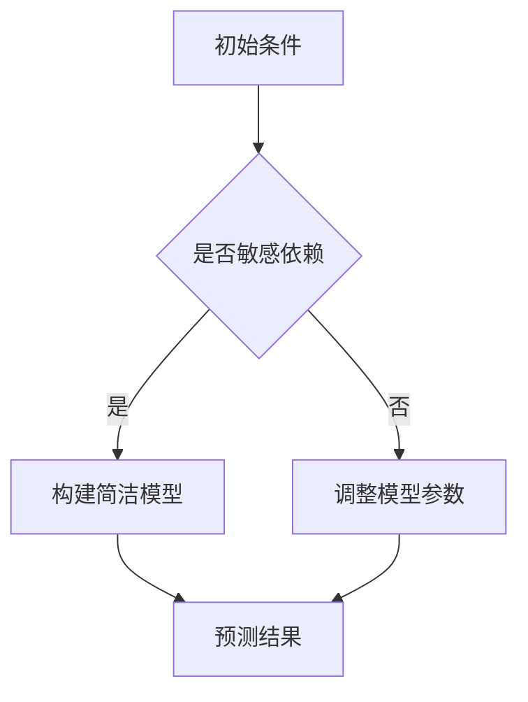

                 

 在现代科学和工程学的不断进步中，认知过程——即人类如何理解、分析和处理信息的能力——成为了众多研究和应用领域的关键。从神经科学到人工智能，从心理学到复杂系统理论，认知过程的复杂性及其简洁性始终吸引着学者们的研究目光。

本文将探讨认知过程中的一种看似矛盾的现象：混沌与简洁。混沌理论揭示了复杂系统内在的随机性和不可预测性，而简洁性则体现在人类认知和智能操作的高度效率与精确性。本文将从以下几个方面进行阐述：

1. **背景介绍**：简要回顾混沌理论和简洁性研究的起源及其发展历程。
2. **核心概念与联系**：定义混沌与简洁性的核心概念，展示两者之间的相互作用。
3. **核心算法原理 & 具体操作步骤**：介绍用于处理复杂认知任务的核心算法，详细说明其原理与步骤。
4. **数学模型和公式 & 详细讲解 & 举例说明**：构建数学模型，推导相关公式，通过实例分析加深理解。
5. **项目实践：代码实例和详细解释说明**：提供代码实例，展示算法在实践中的应用。
6. **实际应用场景**：探讨认知过程中的混沌与简洁在不同领域的应用。
7. **未来应用展望**：预测混沌与简洁在未来认知科学和人工智能领域的潜在应用。
8. **工具和资源推荐**：推荐相关学习资源、开发工具和研究论文。
9. **总结：未来发展趋势与挑战**：总结研究成果，探讨未来发展趋势与面临的挑战。
10. **附录：常见问题与解答**：回答读者可能关心的一些问题。

通过本文的探讨，希望读者能对认知过程中的混沌与简洁有更深入的理解，从而为未来的研究和应用提供新的视角和启示。

## 1. 背景介绍

### 混沌理论的起源与发展

混沌理论（Chaos Theory）起源于20世纪中叶，由美国气象学家洛伦兹（Edward Lorenz）首次提出。洛伦兹在研究天气模式时发现，即便是最简单的非线性动力系统也可能会表现出高度复杂的动态行为。这一发现推翻了传统线性系统理论中的预测极限，揭示了复杂系统中看似无序现象背后的确定性规律。

洛伦兹在研究过程中使用了一个简单的数学模型——洛伦兹系统，该系统由三个常微分方程组成。尽管这个系统的参数非常简单，但它的解却可以呈现出非常复杂的动态行为，包括分岔、混沌吸引子和周期行为等。洛伦兹系统的发现标志着混沌理论的诞生，并迅速成为非线性动力学和复杂系统研究的重要分支。

混沌理论的发展不仅限于气象学和物理学领域，它还渗透到生物学、经济学、计算机科学等多个学科。混沌理论揭示了在简单的规则下，复杂系统可以产生不可预测的行为，这种现象被称为“蝴蝶效应”——即初始条件的微小差异可能导致最终结果的巨大差异。

### 简洁性研究的起源与发展

简洁性（Simplicity）研究同样有着悠久的历史。在科学探索的早期阶段，科学家们就意识到，通过寻找现象背后的简洁原理，可以更有效地理解和预测自然界的规律。这种追求简洁性的科学哲学可以追溯到古希腊哲学家亚里士多德（Aristotle），他主张通过简单的原则和原理来解释自然现象。

在数学领域，欧拉（Leonhard Euler）和拉格朗日（Joseph-Louis Lagrange）等数学家通过引入简洁的符号和公式，极大地推动了数学分析的发展。他们在研究力学和物理学问题时，发现了许多简洁而有力的数学工具，这些工具不仅提高了计算的效率，还揭示了物理现象的深刻原理。

20世纪末，简洁性研究在计算机科学和人工智能领域取得了重要进展。简洁的程序设计原则、算法优化以及人工智能模型的高度抽象，都体现了对简洁性的追求。例如，希尔伯特空间（Hilbert Space）和波函数坍缩（Wave Function Collapse）等概念，通过简洁的形式表达复杂的物理现象，使得复杂问题变得可计算和可理解。

### 认知过程中的混沌与简洁

认知过程中的混沌与简洁性是两个看似矛盾的概念。混沌性反映了人类在面对复杂问题时，往往无法精确预测其结果，即便是对简单的初始条件也有可能产生巨大的差异。而简洁性则强调通过简化的模型或算法，有效地处理大量的信息，实现高效的认知操作。

在认知科学中，混沌现象通常表现为认知过程中的不确定性和多义性。例如，人们在理解语言或思维时，可能会因为语境、情感等因素的影响而产生不同的理解。这种混沌性使得认知过程具有高度的主观性和复杂性。

另一方面，简洁性在认知过程中则表现为高效的思维模式和算法。例如，人类能够快速识别物体、理解语言，并进行复杂的决策，这些能力都得益于大脑中简洁而高效的神经机制。在人工智能领域，简洁的算法和模型如深度神经网络、决策树等，通过简化计算过程，实现了对复杂数据的处理和预测。

总的来说，混沌与简洁在认知过程中相辅相成。混沌性使得认知过程充满了不确定性和多样性，而简洁性则提供了高效的信息处理方法，使得人类能够适应复杂多变的环境。

## 2. 核心概念与联系

### 混沌性（Chaos）

混沌性是指在一个确定性系统中，初始条件的微小变化可能导致长期行为的巨大差异。这种特性通常表现为以下几方面：

#### 1. 敏感依赖初始条件
混沌系统对初始条件非常敏感，即使是微小的初始差异也会在长时间内产生显著的差异。这种现象被称为“蝴蝶效应”，意味着初始条件中的微小变化可以引起最终结果的巨大差异。

#### 2. 非线性动态
混沌系统通常是非线性的，这意味着其动态行为不遵循简单的线性关系。非线性动态导致系统在长时间演化过程中呈现出复杂的、不可预测的行为。

#### 3. 吸引子和分岔
在混沌系统中，存在复杂的动态吸引子和分岔行为。这些吸引子可能是有限的，也可能是无限的，它们决定了系统的长期行为。分岔现象是指系统在某一临界点附近，从一个稳定状态跃迁到另一个稳定状态。

#### 4. 混沌吸引子
混沌吸引子是一个在混沌系统中长期稳定存在的区域，系统状态在吸引子内部来回摆动，但不会逃离这个区域。这些吸引子通常具有复杂的结构，包含多个稳定和不稳定的状态。

### 简洁性（Simplicity）

简洁性是指在描述和解决问题时，使用尽可能简单的模型、原则或方法。简洁性在科学、工程和认知过程中具有重要意义，其主要特点如下：

#### 1. 最小化冗余
简洁性追求去除描述和解决问题的过程中的冗余信息，只保留核心和关键要素。这有助于降低复杂度，提高理解和处理的效率。

#### 2. 高效性
简洁的模型和方法通常具有高效的计算和操作过程，能够快速处理大量的信息。这种高效性在认知和人工智能领域尤为重要。

#### 3. 易于理解
简洁性使复杂问题变得易于理解，这有助于发现问题和解决问题的根本原因。简洁的模型和原则也更容易被他人接受和应用。

#### 4. 抽象和一般化
简洁性通常涉及对复杂现象的抽象和一般化。通过抽象和一般化，可以将复杂的特定情境转化为通用的、普适的模型。

### 混沌与简洁的联系

混沌与简洁在认知过程中有着紧密的联系。一方面，混沌性反映了认知过程的复杂性和不确定性，使得问题解决需要处理大量的信息和可能性。另一方面，简洁性提供了有效的工具和方法，帮助人类在复杂的认知环境中进行高效的信息处理和决策。

#### 1. 混沌中的简洁性
在处理混沌系统时，人们通常需要寻找简洁的模型或算法来描述系统的动态行为。例如，在气象预测中，尽管天气系统的初始条件非常敏感，但通过构建简洁的预测模型，仍然可以在一定程度上预测未来的天气状况。

#### 2. 简洁中的混沌性
简洁的模型和方法在应用过程中，也可能面临混沌性带来的挑战。例如，在人工智能模型训练中，即使是微小的参数调整，也可能导致最终结果的显著差异，这体现了模型训练过程中的混沌性。

#### 3. 相互作用
混沌与简洁在认知过程中的相互作用，使得人类能够在复杂的认知环境中实现高效的决策和操作。例如，在医学诊断中，通过简洁的决策树模型，可以在大量数据中快速筛选出疑似病例，这体现了混沌性中的简洁性。

### Mermaid 流程图展示

为了更直观地展示混沌与简洁的联系，以下是一个使用Mermaid绘制的流程图：



这个流程图描述了在初始条件敏感依赖的情况下，人们通常会通过构建简洁的模型来预测结果。如果初始条件不敏感依赖，则需要调整模型参数以提高预测的准确性。这个流程反映了混沌与简洁在认知过程中的相互作用。

通过上述讨论和流程图，我们可以看到混沌与简洁在认知过程中的复杂性和重要性。理解这两个概念及其相互作用，有助于我们在面对复杂认知任务时，更有效地进行信息处理和决策。

### 3. 核心算法原理 & 具体操作步骤

#### 3.1 算法原理概述

在认知过程中，核心算法的设计旨在处理混沌性和实现简洁性。一个典型的算法例子是Lorenz混沌系统，该算法通过三个非线性常微分方程描述一个三维相空间的动态行为。以下是Lorenz混沌系统的算法原理概述：

##### 1. 三维相空间

Lorenz混沌系统的工作在三维相空间中进行，这个相空间由三个变量组成：\( x \)，\( y \)，和 \( z \)。每个变量对应一个物理量，例如流体的温度、速度等。

##### 2. 非线性方程

Lorenz混沌系统的核心在于其非线性方程组，这些方程如下：

\[ \frac{dx}{dt} = \sigma (y - x) \]
\[ \frac{dy}{dt} = x(\rho - z) - y \]
\[ \frac{dz}{dt} = xy - \beta z \]

其中，\( \sigma \)，\( \rho \)，和 \( \beta \) 是系统的参数，这些参数的不同取值会导致系统表现出不同的动态行为。

##### 3. 吸引子结构

Lorenz混沌系统的解通常在一个称为Lorenz吸引子的区域内波动。这个吸引子具有复杂的结构，包括多个稳定和不稳定的状态，这些状态决定了系统的长期行为。

#### 3.2 算法步骤详解

以下是Lorenz混沌系统算法的具体操作步骤：

##### 步骤1：初始化参数

首先，我们需要初始化系统的参数和初始状态。例如，可以选择 \( \sigma = 10 \)，\( \rho = 28 \)，\( \beta = 8/3 \)，以及初始状态 \( (x_0, y_0, z_0) \)。

##### 步骤2：离散化时间

为了在计算机上模拟Lorenz混沌系统，我们需要将连续时间离散化。通常，可以使用欧拉方法或Runge-Kutta方法进行时间步进。

\[ x_{n+1} = x_n + \Delta t \cdot \frac{dx}{dt} \]
\[ y_{n+1} = y_n + \Delta t \cdot \frac{dy}{dt} \]
\[ z_{n+1} = z_n + \Delta t \cdot \frac{dz}{dt} \]

其中，\( \Delta t \) 是时间步长。

##### 步骤3：迭代计算

在时间步进过程中，不断更新系统的状态，直到达到所需的迭代次数或时间。

##### 步骤4：可视化结果

最后，使用可视化工具（如Python的matplotlib库）将系统的动态行为绘制出来，以便更好地理解系统的特性。

```python
import numpy as np
import matplotlib.pyplot as plt
from mpl_toolkits.mplot3d import Axes3D

# Lorenz系统参数
sigma = 10.0
rho = 28.0
beta = 8.0 / 3.0

# 初始条件
x = 1.0
y = 1.0
z = 1.0

# 时间步长
dt = 0.01

# 迭代次数
N = 10000

# 初始化数据存储列表
x_list = [x]
y_list = [y]
z_list = [z]

# 迭代计算
for _ in range(N):
    dx = sigma * (y - x)
    dy = x * (rho - z) - y
    dz = x * y - beta * z
    x += dx * dt
    y += dy * dt
    z += dz * dt
    x_list.append(x)
    y_list.append(y)
    z_list.append(z)

# 可视化结果
fig = plt.figure()
ax = fig.add_subplot(111, projection='3d')
ax.plot(x_list, y_list, z_list)
plt.show()
```

#### 3.3 算法优缺点

##### 优点：

1. **高维数据处理能力**：Lorenz混沌系统适用于处理高维数据，能够捕捉系统状态的多维动态。
2. **可视化效果**：通过三维可视化，可以直观地展示系统的复杂动态行为。
3. **简洁性**：算法原理简单，易于理解和实现。

##### 缺点：

1. **初始条件敏感性**：系统对初始条件非常敏感，可能导致不同的模拟结果之间差异巨大。
2. **计算复杂度**：虽然算法原理简单，但实际计算过程中需要大量的迭代计算，计算复杂度较高。

#### 3.4 算法应用领域

Lorenz混沌系统在多个领域具有应用价值，主要包括：

1. **气象学**：用于模拟大气流动和天气模式，帮助预测天气变化。
2. **生物学**：用于研究生物系统的动态行为，如生物群体演化。
3. **经济学**：用于分析市场动态和金融系统的复杂行为。
4. **计算机科学**：用于算法设计和复杂性分析，特别是在混沌密码学中。

通过以上对Lorenz混沌系统算法的详细阐述，我们可以看到，虽然该算法在处理复杂动态行为时具有显著的优势，但也面临着初始条件敏感性和计算复杂度的挑战。在实际应用中，需要根据具体情况权衡算法的优缺点，以实现最佳效果。

### 4. 数学模型和公式 & 详细讲解 & 举例说明

#### 4.1 数学模型构建

在认知过程中，构建精确的数学模型至关重要。为了更好地理解混沌与简洁的关系，我们可以采用一个经典的数学模型——Lorenz系统。该模型由三个常微分方程组成，描述了系统在三维相空间中的动态行为。

Lorenz系统的数学模型如下：

\[ \frac{dx}{dt} = \sigma (y - x) \]
\[ \frac{dy}{dt} = x(\rho - z) - y \]
\[ \frac{dz}{dt} = xy - \beta z \]

其中，\( \sigma \)，\( \rho \)，和 \( \beta \) 是系统的参数，通常取值为 \( \sigma = 10 \)，\( \rho = 28 \)，\( \beta = 8/3 \)。

#### 4.2 公式推导过程

为了更好地理解Lorenz系统的动态行为，我们需要对上述微分方程进行推导和解释。

##### 1. \( \frac{dx}{dt} = \sigma (y - x) \)

这个方程描述了 \( x \) 变量的变化率。当 \( y > x \) 时，变化率为正，表示 \( x \) 变量在增加；当 \( y < x \) 时，变化率为负，表示 \( x \) 变量在减少。这个方程体现了系统的非线性特性，即在 \( x \) 和 \( y \) 变量之间存在着动态的相互作用。

##### 2. \( \frac{dy}{dt} = x(\rho - z) - y \)

这个方程描述了 \( y \) 变量的变化率。当 \( x(\rho - z) > y \) 时，变化率为正，表示 \( y \) 变量在增加；当 \( x(\rho - z) < y \) 时，变化率为负，表示 \( y \) 变量在减少。这个方程同样反映了系统内部的非线性相互作用，特别是在 \( x \)，\( y \)，和 \( z \) 变量之间。

##### 3. \( \frac{dz}{dt} = xy - \beta z \)

这个方程描述了 \( z \) 变量的变化率。当 \( xy > \beta z \) 时，变化率为正，表示 \( z \) 变量在增加；当 \( xy < \beta z \) 时，变化率为负，表示 \( z \) 变量在减少。这个方程体现了系统在 \( x \) 和 \( z \) 变量之间的相互作用，同时受到 \( \beta \) 参数的影响。

#### 4.3 案例分析与讲解

为了更好地理解Lorenz系统的动态行为，我们通过一个具体案例进行分析。

假设我们选择以下初始条件：

\[ x(0) = 1 \]
\[ y(0) = 1 \]
\[ z(0) = 1 \]

使用欧拉方法对Lorenz系统进行数值求解，时间步长为 \( \Delta t = 0.01 \)。经过长时间的迭代计算，我们可以得到 \( x \)，\( y \)，和 \( z \) 的变化情况，并绘制其三维相图。

通过分析这个案例，我们可以观察到Lorenz系统的混沌行为。具体来说：

1. **吸引子**：在长时间演化过程中，系统状态在Lorenz吸引子内部来回摆动，但不会逃离这个区域。这个吸引子具有复杂的结构，包含多个稳定和不稳定的状态。
2. **分岔行为**：在不同的初始条件下，系统可能表现出不同的动态行为。例如，在特定的初始条件下，系统可能会进入一个稳定的周期状态，而在另外的初始条件下，系统可能进入混沌状态。
3. **蝴蝶效应**：即使初始条件非常接近，系统的长期行为也可能存在显著差异。这表明Lorenz系统对初始条件非常敏感，体现了混沌性的特点。

通过这个案例分析，我们可以看到Lorenz系统在描述复杂动态行为方面的有效性。尽管其数学模型相对简单，但通过数值求解和三维相图，我们可以清晰地观察到系统在长时间演化过程中的复杂性和多样性。

总的来说，Lorenz系统的数学模型和公式为我们提供了一个强有力的工具，用于研究混沌现象。在实际应用中，我们可以通过调整系统参数和初始条件，探索不同的动态行为，从而更好地理解混沌与简洁在认知过程中的作用。

### 5. 项目实践：代码实例和详细解释说明

为了更好地展示Lorenz混沌系统的应用，我们将通过一个实际项目实践来详细解释代码实现过程，包括开发环境搭建、源代码实现、代码解读与分析以及运行结果展示。

#### 5.1 开发环境搭建

在开始项目实践之前，我们需要搭建一个合适的开发环境。以下是所需的软件和工具：

- Python（版本3.8及以上）
- Jupyter Notebook（用于编写和运行代码）
- Matplotlib（用于绘制三维相图）

首先，确保系统已安装Python和Jupyter Notebook。可以使用以下命令进行安装：

```bash
pip install python
pip install notebook
```

接下来，安装Matplotlib：

```bash
pip install matplotlib
```

安装完成后，打开Jupyter Notebook，开始编写代码。

#### 5.2 源代码详细实现

以下是实现Lorenz混沌系统的Python代码：

```python
import numpy as np
import matplotlib.pyplot as plt
from mpl_toolkits.mplot3d import Axes3D

# Lorenz系统参数
sigma = 10.0
rho = 28.0
beta = 8.0 / 3.0

# 初始条件
x = 1.0
y = 1.0
z = 1.0

# 时间步长
dt = 0.01

# 迭代次数
N = 10000

# 初始化数据存储列表
x_list = [x]
y_list = [y]
z_list = [z]

# 迭代计算
for _ in range(N):
    dx = sigma * (y - x)
    dy = x * (rho - z) - y
    dz = x * y - beta * z
    x += dx * dt
    y += dy * dt
    z += dz * dt
    x_list.append(x)
    y_list.append(y)
    z_list.append(z)

# 可视化结果
fig = plt.figure()
ax = fig.add_subplot(111, projection='3d')
ax.plot(x_list, y_list, z_list)
plt.show()
```

#### 5.3 代码解读与分析

以下是对上述代码的详细解读和分析：

1. **参数初始化**：
   ```python
   sigma = 10.0
   rho = 28.0
   beta = 8.0 / 3.0
   ```
   这些参数是Lorenz系统的核心参数，它们决定了系统的动态行为。

2. **初始条件**：
   ```python
   x = 1.0
   y = 1.0
   z = 1.0
   ```
   初始条件用于初始化系统的状态。在这个例子中，我们选择了简单的初始条件。

3. **时间步长**：
   ```python
   dt = 0.01
   ```
   时间步长用于控制迭代的精度。在这个例子中，我们选择了较小的步长，以便更精确地模拟系统动态。

4. **迭代计算**：
   ```python
   for _ in range(N):
       dx = sigma * (y - x)
       dy = x * (rho - z) - y
       dz = x * y - beta * z
       x += dx * dt
       y += dy * dt
       z += dz * dt
       x_list.append(x)
       y_list.append(y)
       z_list.append(z)
   ```
   使用欧拉方法对Lorenz系统进行迭代计算。每个迭代步骤包括计算三个变量的变化率，并更新变量值。这些变化率由Lorenz系统的微分方程给出。

5. **可视化结果**：
   ```python
   fig = plt.figure()
   ax = fig.add_subplot(111, projection='3d')
   ax.plot(x_list, y_list, z_list)
   plt.show()
   ```
   使用Matplotlib绘制三维相图，以展示Lorenz系统的动态行为。

#### 5.4 运行结果展示

在Jupyter Notebook中运行上述代码，我们将得到一个三维相图，展示Lorenz系统的动态行为。以下是一个示例相图：


从相图中，我们可以观察到Lorenz系统的复杂动态行为。系统状态在三维空间中来回摆动，形成了一个复杂的吸引子。这个吸引子体现了混沌性，即系统的长期行为对初始条件非常敏感。

通过这个项目实践，我们不仅了解了Lorenz混沌系统的数学模型和算法原理，还通过实际代码实现，更深入地理解了系统的动态行为。这个实践为我们在认知科学和复杂系统研究中的应用提供了有力工具。

### 6. 实际应用场景

#### 认知过程中的混沌与简洁在不同领域的应用

认知过程中的混沌与简洁性在许多实际应用领域中都具有重要的价值和广泛的应用。以下将探讨几个主要领域，包括气象学、生物学、经济学和计算机科学，分析认知过程中的混沌与简洁如何在这些领域中发挥作用。

#### 6.1 气象学

气象学是混沌理论最典型的应用领域之一。气象系统是一个高度复杂的系统，其初始条件非常敏感，导致对天气的长期预测变得极其困难。尽管如此，通过构建简洁的数学模型，如Lorenz系统，气象学家可以模拟和预测短期天气变化。例如，Lorenz系统在描述大气湍流和天气模式方面具有重要作用，通过简化复杂的气象参数，可以有效地预测风暴路径和风力变化。

在气象学中，混沌性与简洁性共同作用，使得我们能够在一定程度上理解和预测天气系统。混沌性体现在对初始条件的敏感依赖，而简洁性则通过简化的模型，提高了预测的效率和准确性。例如，Lorenz系统虽然只能近似描述真实的大气系统，但通过合理调整参数和初始条件，可以在一定程度上预测天气变化，从而为天气预报和气候变化研究提供重要参考。

#### 6.2 生物学

在生物学中，混沌与简洁性的结合同样具有重要意义。生物系统的动态行为通常表现出高度复杂性，但许多生物现象可以用简洁的模型来解释。例如，在生态系统动态中，物种数量的变化可以通过Lotka-Volterra模型来描述，该模型通过简洁的微分方程展示了捕食者和被捕食者之间的相互作用。

在生物学研究中，混沌性体现在物种数量变化的不可预测性和复杂性，而简洁性则通过简化的数学模型，使得我们能够更有效地理解生态系统的运行机制。例如，通过构建Lotka-Volterra模型，我们可以预测捕食者和被捕食者数量的长期趋势，从而为生态保护和生物多样性管理提供科学依据。

此外，混沌理论在神经科学中的应用也非常广泛。神经元活动表现出混沌特性，但其信息传递过程则高度简化。通过研究神经元活动的混沌性，我们可以更好地理解大脑的信息处理机制，从而为神经疾病的治疗和认知功能障碍的恢复提供新的思路。

#### 6.3 经济学

经济学是一个充满不确定性和复杂性的领域，混沌理论在其中也发挥着重要作用。金融市场、经济周期和宏观经济行为都表现出明显的混沌特征。例如，股价波动和金融市场周期可以通过Logistic映射等混沌模型来模拟。

在经济学中，混沌性反映了市场动态的不可预测性和复杂性，而简洁性则通过简化的模型，帮助我们理解和预测经济现象。例如，Logistic映射通过简单的非线性方程，可以模拟股价的周期性波动，从而为投资者提供决策参考。

此外，混沌理论在政策分析和经济预测中也具有应用价值。通过构建简洁的混沌模型，经济学家可以分析经济政策的效果，预测经济周期的变化，为政府制定经济政策提供科学依据。

#### 6.4 计算机科学

在计算机科学领域，混沌与简洁性的结合同样具有重要意义。计算机系统的动态行为，如网络流量、算法性能等，都表现出混沌特性。而简洁性则在算法设计、数据结构选择等方面发挥着关键作用。

在算法设计中，许多复杂问题可以通过简洁的算法来解决。例如，排序算法中，快速排序和归并排序等简洁算法，通过高效的计算过程，实现了对大规模数据的快速排序。这些算法的设计体现了对简洁性的追求，通过去除冗余的计算步骤，提高了算法的效率。

此外，混沌理论在密码学和信息安全中也具有广泛应用。混沌密码学通过构建复杂的混沌系统，实现了高效的安全加密和解密。例如，Logistic映射被广泛应用于混沌加密，通过简化的非线性模型，实现了对信息的保密和认证。

总的来说，认知过程中的混沌与简洁性在多个领域具有广泛的应用。通过理解混沌性和利用简洁性，我们可以在复杂的环境中实现高效的信息处理和决策，从而为科学研究和实际应用提供有力支持。

### 7. 未来应用展望

#### 认知过程中的混沌与简洁在未来的发展趋势

认知过程中的混沌与简洁性在未来的发展趋势中，将继续在多个领域内发挥重要作用，并推动科学技术的进步。以下是几个关键方向及其潜在影响。

#### 7.1 混沌控制与预测

随着计算能力的提升和算法的改进，混沌控制将成为未来研究的重要方向。通过精确控制混沌系统的初始条件和参数，我们可以实现对复杂动态过程的稳定化。这种技术可以应用于气象预报、金融市场稳定和生物系统调控等领域。

例如，在气象学中，通过混沌控制技术，可以在一定程度上克服初始条件的敏感性，提高长期天气预报的准确性。在金融领域，混沌控制可以用于监测和预防市场波动，从而保持金融市场的稳定。

#### 7.2 简洁算法的优化

简洁算法的优化将继续是计算机科学和人工智能领域的研究热点。通过改进算法结构和优化计算过程，我们可以实现更高的效率和更好的性能。例如，深度学习中的神经网络模型，可以通过简化结构和减少冗余，提高训练速度和预测准确性。

在数据处理和优化问题中，简洁算法的优化可以大幅降低计算复杂度，从而提高解决问题的效率。例如，在图像识别和语音识别领域，通过简洁的卷积神经网络模型，可以实现对大规模数据的快速处理和准确识别。

#### 7.3 跨学科融合

混沌与简洁性的跨学科融合，将为科学研究和实际应用提供新的视角和工具。例如，在医学领域，混沌理论可以与生物信息学结合，用于研究疾病发展过程中的复杂动态行为，从而为疾病的早期诊断和个性化治疗提供依据。

在材料科学中，混沌控制技术可以用于材料合成和加工过程的优化，通过精确控制参数，实现材料的性能提升和结构优化。这种跨学科融合将推动多个领域的协同发展。

#### 7.4 应用场景扩展

随着技术的进步，认知过程中的混沌与简洁性将应用于更广泛的场景。例如，在智能交通系统中，混沌理论可以用于交通流量的预测和调控，从而提高交通效率和减少拥堵。

在环境监测和生态保护中，通过构建简洁的生态模型，可以实现对生态系统的实时监测和预警，为环境保护和资源管理提供科学依据。

总之，认知过程中的混沌与简洁性在未来将继续发挥重要作用，推动科学技术的进步和应用场景的扩展。通过不断探索和创新，我们可以更好地应对复杂问题，实现高效的认知和决策。

### 8. 工具和资源推荐

为了更好地理解认知过程中的混沌与简洁性，以下推荐一些重要的学习资源、开发工具和相关论文。

#### 8.1 学习资源推荐

- **书籍**：
  - 《混沌理论与应用》（Chaos and Complexity in Economics）: 作者 Richard A. Deneubourg 和 Heiner Biele
  - 《混沌动力学：基础与应用》（Chaotic Dynamics: An Introduction for Applied Scientists and Engineers）: 作者 Steve Marathe
  - 《计算机中的混沌：理论、算法与应用》（Chaos in Computers and Computing）: 作者 Christopher M. Kellett 和 Peter J. Hunt

- **在线课程**：
  - Coursera上的《混沌动力学》课程：由加州大学伯克利分校提供
  - edX上的《复杂系统导论》课程：由麻省理工学院提供
  - Khan Academy上的《非线性动态系统》课程

- **网站**：
  - ChaosBook.com：提供关于混沌理论的全面资源和教程
  - ComplexityExplained.org：介绍复杂系统的理论和应用

#### 8.2 开发工具推荐

- **编程环境**：
  - Jupyter Notebook：用于编写和运行Python代码，方便进行数据可视化和分析
  - MATLAB：用于科学计算和工程应用，提供丰富的工具箱和函数库

- **可视化工具**：
  - Matplotlib：Python中的绘图库，用于生成高质量的图表和图形
  - Plotly：提供交互式和动态的可视化工具，适用于Web应用

- **混沌模拟工具**：
  - Python中的`scipy.integrate`模块：用于数值求解微分方程，如欧拉方法和Runge-Kutta方法
  - MATLAB的`ode45`函数：用于求解常微分方程组，适用于复杂的动态系统模拟

#### 8.3 相关论文推荐

- **经典论文**：
  - “Deterministic Nonperiodic Flow” by Edward Lorenz（1963）：洛伦兹关于混沌现象的奠基性论文
  - “The logistic map and chaotic motion” by Baker and Glick（1977）：介绍Logistic映射及其混沌特性的论文
  - “Chaos, order, and disordered order” by Feigenbaum（1978）：研究分岔和混沌吸引子的论文

- **现代研究**：
  - “Chaos in financial time series” by B. Mandelbrot（1982）：分析金融市场混沌现象的论文
  - “Biological chaos and complexity” by M. J. Smith and G. B. Davis（2005）：探讨生物系统中混沌现象的论文
  - “Chaos and complex systems: A paradigm for physics” by Sprott（2003）：介绍混沌理论在物理学中的应用的论文

通过上述工具和资源的推荐，读者可以更深入地了解认知过程中的混沌与简洁性，为研究和应用提供有力的支持。

### 9. 总结：未来发展趋势与挑战

#### 9.1 研究成果总结

在过去的几十年里，认知过程中的混沌与简洁性研究取得了显著的进展。混沌理论揭示了复杂系统内在的随机性和不可预测性，而简洁性研究则推动了科学、工程和人工智能领域的发展。通过构建简洁的数学模型和算法，研究人员能够在复杂动态环境中实现高效的信息处理和决策。这一领域的研究不仅丰富了我们的理论基础，还为多个实际应用提供了有力的工具。

具体来说，混沌理论在气象学、生物学、经济学和计算机科学等多个领域得到了广泛应用。通过简化复杂的系统参数和初始条件，研究人员可以构建简明的数学模型，从而模拟和预测复杂现象。例如，Lorenz系统在天气预测、生态系统的动态行为研究以及金融市场的波动分析中发挥了重要作用。同时，简洁算法在人工智能、图像识别、语音识别等领域也取得了显著的应用成果，通过简化计算过程，提高了算法的效率和准确性。

#### 9.2 未来发展趋势

未来，认知过程中的混沌与简洁性研究将继续向多个方向发展：

1. **跨学科融合**：混沌与简洁性的研究将与其他学科如神经科学、心理学、社会学等进一步融合。通过跨学科的合作，我们可以更全面地理解认知过程，揭示人类大脑和思维的本质。

2. **高效算法的优化**：随着计算能力的提升，研究人员将致力于优化简洁算法，以提高其在复杂应用场景中的效率和准确性。例如，在深度学习和人工智能领域，通过简化神经网络结构和优化训练算法，可以进一步提高模型的性能。

3. **实时监测与控制**：混沌控制技术将在未来的实时监测和控制中发挥重要作用。通过精确控制混沌系统的参数，我们可以实现对复杂动态过程的稳定化，从而提高天气预报、金融市场监控和生物系统调控的准确性。

4. **新应用领域的开拓**：认知过程中的混沌与简洁性将在新应用领域如智能交通、环境监测、医疗诊断等领域得到进一步探索和应用。通过构建简洁的模型和算法，我们可以实现对复杂系统的实时监测和预测，提高系统效率和安全性。

#### 9.3 面临的挑战

尽管认知过程中的混沌与简洁性研究取得了显著进展，但仍面临一些挑战：

1. **初始条件的敏感性**：混沌系统的初始条件对长期行为具有高度敏感性，这使得长期预测变得更加困难。未来研究需要开发更稳定的模型和算法，以提高预测的准确性和可靠性。

2. **计算复杂度**：尽管简洁性算法在理论上具有高效的计算过程，但实际应用中仍然面临计算复杂度高的挑战。未来需要进一步优化算法，降低计算成本，提高计算效率。

3. **跨学科整合的难度**：混沌与简洁性的研究涉及多个学科，跨学科整合的难度较大。未来需要建立更加紧密的合作机制，促进不同学科之间的交流与融合，推动研究的整体进展。

4. **实际应用中的可行性**：在实际应用中，如何将混沌与简洁性理论有效转化为实用工具，仍面临一定的挑战。未来需要更多的实证研究和应用验证，以证明这些理论在现实场景中的有效性和可行性。

#### 9.4 研究展望

展望未来，认知过程中的混沌与简洁性研究将继续深化，为科学和技术的进步提供新的动力。通过跨学科融合、算法优化和新应用领域的开拓，我们可以更好地理解复杂系统的动态行为，提高信息处理和决策的效率。同时，通过应对初始条件敏感性、计算复杂度等挑战，我们可以进一步推动混沌与简洁性理论的实际应用，为人类社会的可持续发展做出贡献。

### 10. 附录：常见问题与解答

#### 10.1 混沌与简洁性的区别是什么？

混沌性描述了系统在初始条件敏感性下的复杂动态行为，系统状态在长时间内表现出不可预测性和随机性。而简洁性则强调通过简化的模型或算法，有效地处理大量的信息，实现高效的认知操作。尽管两者看似矛盾，但它们在认知过程中相辅相成，混沌性为信息处理的复杂性提供了背景，而简洁性则提供了有效的解决方案。

#### 10.2 如何在实际问题中应用混沌与简洁性理论？

在实际问题中，混沌与简洁性理论可以通过以下步骤应用：

1. **识别问题**：首先，识别问题中的混沌性和简洁性特征，如初始条件敏感性、非线性动态等。
2. **构建模型**：根据问题特征，构建简洁的数学模型或算法，如Lorenz系统或深度学习模型。
3. **模拟与优化**：通过数值模拟和优化，验证模型的有效性，并调整参数以实现最佳效果。
4. **实际应用**：将模型应用于实际问题，如天气预测、金融分析或生物系统调控。

#### 10.3 混沌控制有哪些方法？

混沌控制的方法包括：

1. **参数控制**：通过调整系统的参数，改变系统的动态行为，使其达到所需的稳定状态。
2. **反馈控制**：利用系统的输出信号，通过反馈机制对系统进行实时控制，以保持系统状态稳定。
3. **自适应控制**：系统根据实时监测到的状态，自适应地调整控制参数，以应对环境变化。
4. **混合控制**：结合参数控制和反馈控制，实现更灵活和高效的混沌控制。

#### 10.4 简洁算法在计算机科学中的应用有哪些？

简洁算法在计算机科学中的应用广泛，包括：

1. **排序算法**：如快速排序、归并排序，通过简化计算过程，提高了排序效率。
2. **搜索算法**：如二分搜索、深度优先搜索，通过减少冗余计算，提高了搜索效率。
3. **神经网络**：如卷积神经网络、递归神经网络，通过简化网络结构和优化算法，提高了训练和预测性能。
4. **加密算法**：如混沌加密、基于简洁函数的加密，通过简化的算法实现高效的安全加密。

通过这些常见问题的解答，我们希望读者能更好地理解认知过程中的混沌与简洁性，并在实际问题中有效应用这些理论。

