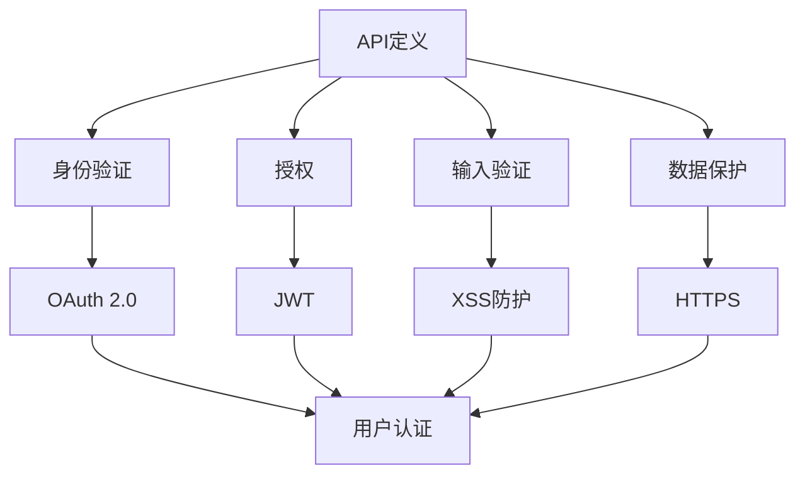

                 

在当今数字化时代，应用程序编程接口（API）已经成为软件开发的重要组成部分。它们允许不同的软件系统之间进行通信，实现数据交换和功能调用。随着API在软件开发中的广泛应用，安全问题也变得日益突出。因此，设计安全的API至关重要。

> 关键词：API设计、安全性、漏洞、最佳实践

本文将详细介绍设计安全API的注意事项，包括核心概念、核心算法原理、数学模型和公式、项目实践、实际应用场景以及未来发展趋势与挑战。

## 1. 背景介绍

API的广泛使用带来了许多便利，但也引入了安全风险。不当的API设计可能导致数据泄露、权限滥用、注入攻击等问题。随着云计算、物联网和移动应用的兴起，API的安全问题变得尤为重要。因此，本文旨在为开发者提供设计安全API的指导。

### 1.1 API的定义

API是应用程序编程接口的缩写，它是一组定义了软件模块之间如何相互通信和交互的规则、协议和工具。API可以是简单的函数调用，也可以是复杂的协议和接口。

### 1.2 API的重要性

API在软件开发中的重要性不可忽视。它促进了软件模块的重用、协作和扩展。通过API，开发者可以轻松地集成第三方服务和工具，提高开发效率。

### 1.3 API的安全性挑战

随着API的广泛应用，安全问题也日益突出。以下是一些常见的API安全挑战：

- **身份验证与授权**：API需要确保只有授权的用户可以访问。
- **数据保护**：API传输的数据必须进行加密，以防止数据泄露。
- **输入验证**：API需要验证输入数据的有效性，以防止注入攻击。
- **会话管理**：API需要确保会话的安全和完整性。

## 2. 核心概念与联系

在讨论API设计之前，我们需要了解一些核心概念和联系。以下是一个简单的Mermaid流程图，展示了API设计的相关概念和它们之间的联系：



### 2.1 API定义

API定义是设计API的第一步。它描述了API的功能、输入参数、输出结果以及API的约束条件。定义API时，需要考虑API的接口设计、数据格式、错误处理等问题。

### 2.2 身份验证与授权

身份验证是确保只有授权用户可以访问API的过程。常见的身份验证方法包括基本认证、OAuth 2.0和JSON Web Token（JWT）。

- **基本认证**：通过用户名和密码进行认证。
- **OAuth 2.0**：一种开放标准，用于授权第三方应用访问用户资源。
- **JWT**：一种基于JSON的令牌，用于身份验证和授权。

### 2.3 输入验证

输入验证是防止注入攻击和其他恶意行为的关键。它包括验证输入数据的类型、长度、范围和格式等。

- **XSS防护**：跨站脚本攻击（XSS）防护是确保用户提交的数据不会在客户端执行的重要措施。
- **HTTPS**：HTTPS是确保数据在传输过程中加密的协议。

### 2.4 数据保护

数据保护是确保API传输的数据不会泄露的关键。HTTPS是一种常用的数据保护方法，它可以确保数据在传输过程中被加密。

## 3. 核心算法原理 & 具体操作步骤

### 3.1 算法原理概述

设计安全API的核心算法包括身份验证、授权、输入验证和数据保护。以下是对这些算法原理的概述：

### 3.2 算法步骤详解

#### 3.2.1 身份验证

1. 用户请求访问API。
2. API要求用户提供身份验证信息（如用户名和密码）。
3. API验证用户身份。
4. 如果身份验证成功，API允许用户访问。

#### 3.2.2 授权

1. 用户请求访问受保护的资源。
2. API检查用户的授权。
3. 如果用户具备访问权限，API允许访问。
4. 如果用户无权访问，API返回错误响应。

#### 3.2.3 输入验证

1. 用户提交请求。
2. API验证请求中的输入数据。
3. 如果输入数据有效，API处理请求。
4. 如果输入数据无效，API返回错误响应。

#### 3.2.4 数据保护

1. API使用HTTPS协议传输数据。
2. API对敏感数据进行加密。
3. API确保数据在传输过程中不会被篡改。

### 3.3 算法优缺点

#### 3.3.1 身份验证

- 优点：确保只有授权用户可以访问API。
- 缺点：可能会影响API的响应时间。

#### 3.3.2 授权

- 优点：确保用户只能访问授权的资源。
- 缺点：可能会增加API的复杂性。

#### 3.3.3 输入验证

- 优点：防止恶意输入和注入攻击。
- 缺点：可能会影响API的性能。

#### 3.3.4 数据保护

- 优点：确保数据在传输过程中安全。
- 缺点：可能会增加API的开销。

### 3.4 算法应用领域

这些算法在多种场景下都有广泛应用，包括：

- **Web应用**：Web应用广泛使用API进行数据交换和功能调用。
- **移动应用**：移动应用通过API与服务器进行通信，实现各种功能。
- **云计算**：云计算平台使用API提供各种服务，如存储、计算和数据库等。

## 4. 数学模型和公式 & 详细讲解 & 举例说明

### 4.1 数学模型构建

在设计安全API时，我们可以使用以下数学模型来分析API的安全性：

1. **身份验证模型**：基于用户名和密码的身份验证。
2. **授权模型**：基于角色和权限的授权。
3. **输入验证模型**：基于数据类型、长度和格式的输入验证。
4. **数据保护模型**：基于加密和哈希函数的数据保护。

### 4.2 公式推导过程

#### 4.2.1 身份验证模型

- **用户名验证**：使用哈希函数验证用户名。
  \[ \text{hash}(user\_name) \]
- **密码验证**：使用哈希函数验证密码。
  \[ \text{hash}(password) \]

#### 4.2.2 授权模型

- **角色验证**：使用角色列表验证用户角色。
  \[ \text{role}(user) \in \text{roles} \]
- **权限验证**：使用权限列表验证用户权限。
  \[ \text{permission}(user) \in \text{permissions} \]

#### 4.2.3 输入验证模型

- **数据类型验证**：使用正则表达式验证数据类型。
  \[ \text{regex}(\text{data}) \]
- **长度验证**：使用长度限制验证数据长度。
  \[ \text{length}(\text{data}) \leq \text{max\_length} \]
- **格式验证**：使用格式匹配验证数据格式。
  \[ \text{format}(\text{data}) \]

#### 4.2.4 数据保护模型

- **加密**：使用对称加密算法加密数据。
  \[ \text{encrypt}(\text{data}, \text{key}) \]
- **哈希**：使用哈希函数对数据进行哈希。
  \[ \text{hash}(\text{data}) \]

### 4.3 案例分析与讲解

以下是一个简单的案例，说明如何使用数学模型来分析API的安全性：

#### 案例背景

假设我们有一个用户登录API，用户需要提供用户名和密码进行身份验证。我们使用哈希函数来验证用户名和密码。

#### 案例步骤

1. **用户请求**：用户请求访问登录API。
2. **身份验证**：API要求用户提交用户名和密码。
3. **用户名验证**：API使用哈希函数对用户名进行哈希，并与数据库中的用户名哈希进行匹配。
4. **密码验证**：API使用哈希函数对密码进行哈希，并与数据库中的密码哈希进行匹配。
5. **授权**：如果用户名和密码都匹配，API检查用户的角色和权限。
6. **响应**：API返回登录成功或失败的信息。

#### 案例分析

在这个案例中，我们使用了身份验证模型和授权模型。通过哈希函数，我们可以确保用户名和密码的安全性。同时，通过角色和权限的验证，我们可以确保用户只能访问授权的资源。

## 5. 项目实践：代码实例和详细解释说明

### 5.1 开发环境搭建

为了更好地理解API设计的安全性，我们将使用Python语言来实现一个简单的用户登录API。以下是如何搭建开发环境：

1. 安装Python 3.8或更高版本。
2. 安装Flask框架：`pip install flask`
3. 安装Flask-JWT：`pip install flask-jwt`
4. 安装Flask-HTTPAuth：`pip install flask-httpauth`

### 5.2 源代码详细实现

以下是一个简单的用户登录API的实现：

```python
from flask import Flask, request, jsonify
from flask_jwt import JWT, jwt_required
from flask_httpauth import HTTPBasicAuth
from werkzeug.security import generate_password_hash, check_password_hash

app = Flask(__name__)
app.config['JWT_SECRET_KEY'] = 'super-secret-key'
auth = HTTPBasicAuth()

users = {
    "user1": generate_password_hash("password1"),
    "user2": generate_password_hash("password2"),
}

@auth.verify_password
def verify_password(username, password):
    if username in users and \
            check_password_hash(users.get(username), password):
        return username

@app.route('/login', methods=['POST'])
def login():
    username = request.json.get('username')
    password = request.json.get('password')
    if username in users and \
            check_password_hash(users.get(username), password):
        token = jwt.generate_token(app.config['JWT_SECRET_KEY'], username)
        return jsonify({'token': token})
    return jsonify({'error': 'Invalid credentials'}), 401

@app.route('/protected', methods=['GET'])
@jwt_required()
def protected():
    return jsonify({'message': 'This is a protected route!'})

if __name__ == '__main__':
    app.run()
```

### 5.3 代码解读与分析

1. **导入库和配置**：我们首先导入所需的库和配置Flask应用。
2. **用户数据库**：我们创建一个简单的用户数据库，存储用户名和密码的哈希值。
3. **身份验证**：我们使用HTTPBasicAuth进行身份验证。当用户请求登录时，API会要求用户提交用户名和密码。
4. **登录路由**：当用户提交正确的用户名和密码时，API会生成JWT令牌，并将其返回给用户。
5. **受保护路由**：我们创建一个受保护的路由，只有持有JWT令牌的用户才能访问。

### 5.4 运行结果展示

1. **启动应用**：运行上述代码，启动Flask应用。
2. **登录**：使用Postman或其他工具向`/login`路由提交用户名和密码。
3. **访问受保护路由**：使用Postman或其他工具向`/protected`路由提交JWT令牌。

## 6. 实际应用场景

API设计的安全性在多种实际应用场景中都非常重要。以下是一些常见的应用场景：

- **Web应用**：Web应用通常使用API进行数据交换和功能调用。确保API安全性可以防止数据泄露和非法访问。
- **移动应用**：移动应用通过API与服务器进行通信，实现各种功能。保护API安全可以确保用户数据的隐私和安全。
- **云计算**：云计算平台使用API提供各种服务。确保API安全性可以防止恶意行为和资源滥用。

## 7. 工具和资源推荐

为了设计安全的API，以下是一些建议的工具和资源：

- **学习资源**： 
  - 《API设计指南》
  - 《Web安全性测试指南》
  - 《Python Web开发：测试、部署和分发》
- **开发工具**：
  - Flask框架：用于快速搭建Web应用。
  - Postman：用于测试API。
  - OWASP ZAP：用于安全测试。
- **相关论文**：
  - "A Survey on API Security: Challenges and Solutions"
  - "Attacks and Countermeasures in API Security"

## 8. 总结：未来发展趋势与挑战

### 8.1 研究成果总结

设计安全的API已经成为软件开发的一个重要领域。研究人员和开发者提出了许多方法和工具，以提高API的安全性。然而，随着API的广泛应用，新的安全挑战也在不断出现。

### 8.2 未来发展趋势

- **自动化安全测试**：自动化安全测试将帮助开发者更快地发现API安全漏洞。
- **零信任架构**：零信任架构将使得API设计更加安全，确保只有授权用户可以访问。
- **AI驱动的安全**：AI驱动的安全解决方案将帮助开发者自动识别和防御API安全威胁。

### 8.3 面临的挑战

- **复杂的API生态系统**：随着API的广泛应用，API生态系统变得越来越复杂，增加了安全设计的难度。
- **新兴技术的挑战**：如物联网、区块链和云计算等新兴技术将带来新的安全挑战。

### 8.4 研究展望

设计安全的API仍然是一个具有挑战性的研究领域。未来的研究可以关注以下几个方面：

- **跨领域安全解决方案**：研究跨领域的安全解决方案，以提高API的安全性。
- **隐私保护**：研究如何在保护用户隐私的同时设计安全的API。
- **自动化安全测试**：研究自动化安全测试的方法和技术，以提高测试效率和准确性。

## 9. 附录：常见问题与解答

### 9.1 什么是API？

API是应用程序编程接口的缩写，它是一组定义了软件模块之间如何相互通信和交互的规则、协议和工具。

### 9.2 如何设计安全的API？

设计安全的API需要考虑身份验证、授权、输入验证和数据保护。遵循最佳实践，如使用HTTPS、实施身份验证和授权机制、验证输入数据等。

### 9.3 常见的API安全漏洞有哪些？

常见的API安全漏洞包括未授权访问、数据泄露、注入攻击、会话管理漏洞等。

### 9.4 如何测试API的安全性？

可以使用自动化工具（如OWASP ZAP）进行安全测试，或者手动测试API，检查是否存在安全漏洞。

## 参考文献

- "API Design: Guide to Creating User-Friendly APIs"
- "Web API Design: Crafting Interfaces that Developers Love"
- "API Security: The Complete Guide to Building Secure APIs"
- "A Survey on API Security: Challenges and Solutions"
- "Attacks and Countermeasures in API Security"  
```

以上内容仅为文章的一部分，您可以根据需要进行扩展和修改。希望对您有所帮助！作者：禅与计算机程序设计艺术 / Zen and the Art of Computer Programming。

