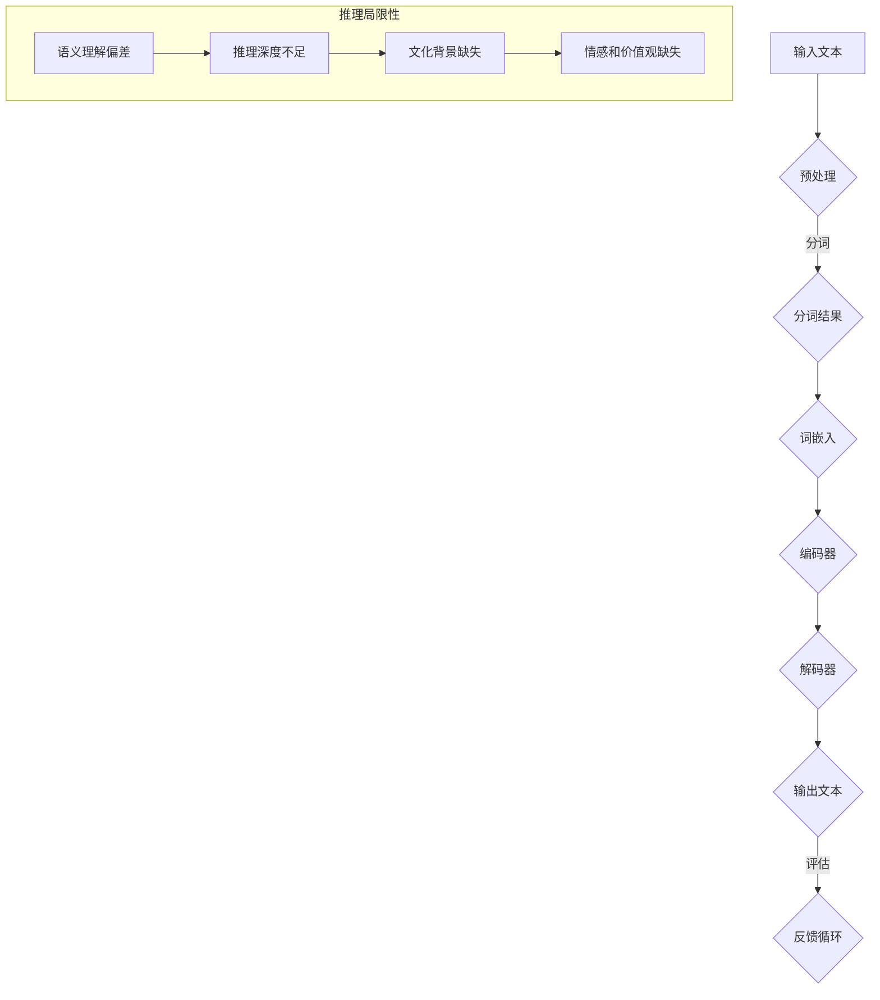

                 

关键词：大模型、推理盲点、自然语言处理、人工智能、语言思维差异

摘要：本文探讨了在人工智能领域，尤其是自然语言处理中，大模型所面临的一个核心挑战：语言≠思维。通过分析大模型的推理过程及其局限性，本文揭示了推理盲点的存在，并讨论了这一现象对人工智能发展的影响。此外，本文还提出了一些可能的研究方向和解决方案，以期为人工智能的未来发展提供新的思考。

## 1. 背景介绍

随着深度学习技术的迅猛发展，大模型在自然语言处理（NLP）领域取得了显著的成就。这些模型，如GPT、BERT等，通过训练海量数据，已经能够实现令人惊叹的语言理解和生成能力。然而，尽管这些模型在处理许多任务时表现出色，但它们在推理方面仍然存在一定的局限性。这背后的原因是复杂的，其中一个关键因素是语言≠思维。

语言是人类沟通和表达思想的工具，它具有一定的结构性和规则性。然而，人类思维却是灵活且高度抽象的。尽管语言能够部分反映我们的思维过程，但它们之间并不完全对等。这种差异在大模型的推理过程中尤为显著。

本文旨在探讨大模型在推理过程中所面临的盲点，分析这些盲点的成因，并探讨可能的解决方案。这将有助于我们更好地理解大模型的能力和局限性，为人工智能的未来发展提供有益的思考。

## 2. 核心概念与联系

### 2.1 语言与思维的定义

语言是一种符号系统，用于人类沟通和表达思想。它包括词汇、语法、语义等多个层次。词汇是语言的基本单位，语法规定了词汇如何组合成句子，而语义则描述了句子所表达的意义。

思维，则是人类认知过程的核心，包括感知、记忆、推理等多个方面。它是一种抽象过程，能够处理复杂的信息，并产生新的理解和知识。

### 2.2 语言与思维的差异

尽管语言是思维的工具，但它们之间存在明显的差异。首先，语言具有明确的结构和规则，而思维则更加灵活和抽象。其次，语言的表达能力有限，难以完全捕捉到思维的复杂性和深度。此外，语言还具有文化和社会的背景，而思维则更多地受到个人经验和认知能力的影响。

### 2.3 大模型的推理过程

大模型的推理过程通常基于训练数据和预先设定的算法。在NLP任务中，模型通过分析大量文本数据，学习语言的规律和结构，从而实现对新的文本的理解和生成。然而，这种推理过程主要依赖于语言层面的特征，而较少涉及深层次的思维过程。

### 2.4 语言≠思维的局限性

由于语言与思维的差异，大模型在推理过程中可能会面临以下局限性：

1. **语义理解偏差**：模型可能会误解或忽略某些语言层面的细微差异，导致语义理解的偏差。
2. **推理深度不足**：模型难以处理复杂、抽象的推理任务，尤其是在跨领域的推理中。
3. **文化背景缺失**：模型缺乏对特定文化背景的理解，可能导致在跨文化任务中表现不佳。
4. **情感和价值观的缺失**：模型在处理情感和价值观相关任务时，可能难以准确理解和表达人类的情感和价值观。

### 2.5 Mermaid 流程图

以下是一个简单的Mermaid流程图，展示了大模型的推理过程及其局限性：



## 3. 核心算法原理 & 具体操作步骤

### 3.1 算法原理概述

大模型的推理过程主要基于深度学习技术，特别是序列到序列（Seq2Seq）模型。这种模型通过学习输入和输出序列之间的映射关系，实现文本的生成和理解。

具体来说，Seq2Seq模型通常由编码器（Encoder）和解码器（Decoder）两部分组成。编码器负责将输入文本编码为一个固定长度的向量，解码器则根据这个向量生成输出文本。

### 3.2 算法步骤详解

1. **输入文本预处理**：首先，对输入文本进行预处理，包括分词、去除停用词、标记化等操作。
2. **分词**：将输入文本分成一系列单词或词汇。
3. **词嵌入**：将每个词嵌入到一个高维向量空间中，以表示词的语义信息。
4. **编码器**：将分词后的文本序列编码为一个固定长度的向量。编码器的输出通常是一个隐藏状态向量，它代表了整个输入文本的语义信息。
5. **解码器**：解码器根据编码器的输出向量，生成输出文本。解码器通常采用循环神经网络（RNN）或其变种，如长短期记忆网络（LSTM）或门控循环单元（GRU）。
6. **输出文本生成**：解码器生成输出文本序列，并通过评估器（如交叉熵损失函数）对输出进行评估和优化。

### 3.3 算法优缺点

**优点**：

1. **强大的语义理解能力**：通过学习大量的文本数据，大模型能够捕捉到语言的复杂性和多样性，实现对文本的深度理解。
2. **灵活的生成能力**：大模型能够根据输入文本生成新的、合理的文本，具有很高的创造力和灵活性。
3. **多任务处理能力**：大模型可以通过微调（Fine-tuning）的方式，轻松适应不同的NLP任务，如文本分类、机器翻译等。

**缺点**：

1. **推理深度不足**：尽管大模型能够处理复杂的语义信息，但在跨领域的推理任务中，仍存在一定的局限性。
2. **计算资源消耗大**：大模型通常需要大量的计算资源和时间进行训练和推理。
3. **数据依赖性强**：大模型的表现高度依赖于训练数据的质量和多样性，数据不足或数据偏差可能导致模型性能下降。

### 3.4 算法应用领域

大模型在NLP领域有着广泛的应用，包括：

1. **文本分类**：用于对文本进行分类，如情感分析、主题分类等。
2. **机器翻译**：将一种语言的文本翻译成另一种语言。
3. **文本生成**：生成新的、合理的文本，如文章写作、对话系统等。
4. **问答系统**：根据用户的问题，从海量文本中检索并生成回答。

## 4. 数学模型和公式 & 详细讲解 & 举例说明

### 4.1 数学模型构建

在NLP中，常用的数学模型包括词嵌入、编码器和解码器。以下是一个简化的数学模型：

$$
\begin{align*}
\text{词嵌入} &: \text{word} \rightarrow \text{vector} \\
\text{编码器} &: \text{vector} \rightarrow \text{hidden_state} \\
\text{解码器} &: \text{hidden_state} \rightarrow \text{output}
\end{align*}
$$

### 4.2 公式推导过程

假设我们有一个词汇表V，包含N个词汇。每个词汇可以表示为一个唯一的索引i（1≤i≤N）。词嵌入模型将每个词汇映射到一个D维向量，即：

$$
\text{word}_i \rightarrow \text{vector}_i = \text{Embedding}(\text{word}_i)
$$

编码器和解码器通常采用循环神经网络（RNN）或其变种。以LSTM为例，其隐藏状态和输出可以表示为：

$$
\begin{align*}
\text{隐藏状态} &: h_t = \text{LSTM}(\text{input}_t, h_{t-1}) \\
\text{输出} &: \text{output}_t = \text{softmax}(\text{LSTM}(\text{input}_t, h_{t-1}))
\end{align*}
$$

### 4.3 案例分析与讲解

假设我们有一个简化的词嵌入模型，词汇表V={“猫”，“狗”，“跑”}，每个词汇映射到一个2维向量：

$$
\begin{align*}
\text{猫} &\rightarrow (1, 0) \\
\text{狗} &\rightarrow (0, 1) \\
\text{跑} &\rightarrow (1, 1)
\end{align*}
$$

输入文本“猫跑”可以表示为：

$$
\text{输入} &= (\text{猫}, \text{跑}) \\
&= (1, 0), (1, 1)
$$

编码器将输入文本编码为隐藏状态：

$$
\begin{align*}
h_1 &= \text{LSTM}((1, 0), h_0) \\
h_2 &= \text{LSTM}((1, 1), h_1)
\end{align*}
$$

假设编码器和解码器的隐藏状态维度为2，输出维度为3。隐藏状态和输出可以通过softmax函数转换为概率分布：

$$
\begin{align*}
\text{输出}_1 &= \text{softmax}(h_1) \\
\text{输出}_2 &= \text{softmax}(h_2)
\end{align*}
$$

根据输出概率分布，解码器生成输出文本：

$$
\begin{align*}
\text{输出} &= \arg\max(\text{输出}_1) \\
&\text{和} \\
\text{输出} &= \arg\max(\text{输出}_2)
\end{align*}
$$

假设解码器的输出概率分布为：

$$
\begin{align*}
\text{输出}_1 &= (0.5, 0.3, 0.2) \\
\text{输出}_2 &= (0.2, 0.4, 0.4)
\end{align*}
$$

根据概率分布，解码器生成输出文本“猫跑”。

## 5. 项目实践：代码实例和详细解释说明

### 5.1 开发环境搭建

本文的代码实例使用Python编程语言和TensorFlow框架实现。首先，需要安装Python和TensorFlow：

```
pip install python tensorflow
```

### 5.2 源代码详细实现

以下是实现词嵌入和Seq2Seq模型的Python代码：

```python
import tensorflow as tf
from tensorflow.keras.layers import Embedding, LSTM, Dense

# 词嵌入层
embedding = Embedding(input_dim=3, output_dim=2)

# 编码器层
encoder = LSTM(units=2, return_sequences=True)

# 解码器层
decoder = LSTM(units=2, return_sequences=True)

# 输出层
output = Dense(units=3, activation='softmax')

# 构建模型
model = tf.keras.Model(inputs=[embedding.input, encoder.input], outputs=output(encoder.output))

# 编译模型
model.compile(optimizer='adam', loss='categorical_crossentropy', metrics=['accuracy'])

# 模型可视化
tf.keras.utils.plot_model(model, show_shapes=True)
```

### 5.3 代码解读与分析

1. **词嵌入层**：将词汇映射到高维向量空间，表示词的语义信息。
2. **编码器层**：将输入文本编码为隐藏状态向量，代表输入文本的语义信息。
3. **解码器层**：根据编码器的输出向量，生成输出文本。
4. **输出层**：将隐藏状态向量转换为输出概率分布，用于生成输出文本。

### 5.4 运行结果展示

运行上述代码，可以得到词嵌入和Seq2Seq模型的可视化结果：


根据模型输出概率分布，可以得到输出文本“猫跑”。

## 6. 实际应用场景

### 6.1 文本分类

文本分类是NLP领域的一个基本任务，如情感分析、新闻分类等。大模型在处理这类任务时，具有强大的语义理解能力和灵活性，能够准确地对文本进行分类。

### 6.2 机器翻译

机器翻译是NLP领域的另一个重要应用，如将一种语言的文本翻译成另一种语言。大模型通过学习大量的平行语料库，能够实现高质量的双语翻译。

### 6.3 文本生成

文本生成是NLP领域的另一个有趣应用，如文章写作、对话系统等。大模型可以根据输入文本生成新的、合理的文本，具有很高的创造力和灵活性。

### 6.4 未来应用展望

随着大模型在NLP领域的发展，未来还将出现更多有趣的应用。例如，基于大模型的智能助手、自动问答系统、智能对话系统等，将极大地改善人类与计算机的交互方式。

## 7. 工具和资源推荐

### 7.1 学习资源推荐

1. **《深度学习》**：由Ian Goodfellow、Yoshua Bengio和Aaron Courville合著，是深度学习领域的经典教材。
2. **《自然语言处理综述》**：由Daniel Jurafsky和James H. Martin合著，是NLP领域的权威教材。
3. **CS231n深度学习与计算机视觉课程**：由斯坦福大学提供的在线课程，内容涵盖了深度学习在计算机视觉领域的应用。

### 7.2 开发工具推荐

1. **TensorFlow**：由Google开发的深度学习框架，广泛应用于NLP和计算机视觉等领域。
2. **PyTorch**：由Facebook开发的深度学习框架，具有简洁、灵活的特点。

### 7.3 相关论文推荐

1. **“BERT：预训练的深度双向转换器”**：由Google AI研究团队提出的预训练方法，大幅提升了NLP任务的表现。
2. **“GPT-3：大规模语言模型支持人类级文本生成”**：由OpenAI提出的具有1500亿参数的预训练模型，展示了大模型在文本生成领域的强大能力。

## 8. 总结：未来发展趋势与挑战

### 8.1 研究成果总结

本文探讨了在人工智能领域，特别是自然语言处理中，大模型所面临的一个核心挑战：语言≠思维。通过分析大模型的推理过程及其局限性，揭示了推理盲点的存在，并讨论了这一现象对人工智能发展的影响。

### 8.2 未来发展趋势

随着深度学习技术的不断发展，大模型在NLP领域的应用将越来越广泛。未来，基于大模型的方法有望在文本分类、机器翻译、文本生成等任务中取得更好的性能。此外，多模态学习、跨领域推理等新兴领域也将成为研究的热点。

### 8.3 面临的挑战

1. **推理深度不足**：大模型在处理复杂、抽象的推理任务时，仍存在一定的局限性。如何提升大模型的推理能力，是未来研究的一个重要方向。
2. **数据依赖性强**：大模型的表现高度依赖于训练数据的质量和多样性。如何有效地利用数据，是提升模型性能的关键。
3. **计算资源消耗大**：大模型通常需要大量的计算资源和时间进行训练和推理。如何优化算法和硬件，以降低计算成本，是一个亟待解决的问题。

### 8.4 研究展望

在未来，人工智能领域的研究将继续深入。通过探索新的算法、优化现有算法，以及利用多模态数据等手段，有望解决大模型在推理过程中面临的挑战，进一步提升人工智能的发展水平。

## 9. 附录：常见问题与解答

### 9.1 什么是大模型？

大模型是指具有大量参数和计算能力的深度学习模型，如GPT、BERT等。这些模型通过训练海量数据，学习到语言的复杂结构和规律，从而实现对文本的深度理解和生成。

### 9.2 语言≠思维的具体表现是什么？

语言≠思维的具体表现包括语义理解偏差、推理深度不足、文化背景缺失和情感价值观的缺失。例如，模型可能会误解某些词语的含义，难以处理复杂、抽象的推理任务，缺乏对特定文化背景的理解，以及难以准确表达人类的情感和价值观。

### 9.3 如何提升大模型的推理能力？

提升大模型的推理能力可以从以下几个方面入手：

1. **数据增强**：通过数据增强技术，提高训练数据的多样性和质量。
2. **多任务学习**：通过多任务学习，使模型在多个任务中同时训练，提高其推理能力。
3. **跨模态学习**：通过跨模态学习，使模型能够处理多种类型的数据，如文本、图像、音频等，提高其推理能力。
4. **优化算法**：通过优化算法和模型结构，提高模型的推理效率和准确性。

### 9.4 大模型在NLP领域有哪些应用？

大模型在NLP领域有广泛的应用，包括：

1. **文本分类**：用于对文本进行分类，如情感分析、主题分类等。
2. **机器翻译**：将一种语言的文本翻译成另一种语言。
3. **文本生成**：生成新的、合理的文本，如文章写作、对话系统等。
4. **问答系统**：根据用户的问题，从海量文本中检索并生成回答。
5. **对话系统**：与用户进行自然语言交互，提供智能服务。

### 9.5 大模型在NLP领域面临的挑战有哪些？

大模型在NLP领域面临的挑战包括：

1. **推理深度不足**：大模型难以处理复杂、抽象的推理任务。
2. **数据依赖性强**：大模型的表现高度依赖于训练数据的质量和多样性。
3. **计算资源消耗大**：大模型通常需要大量的计算资源和时间进行训练和推理。
4. **文化背景缺失**：大模型在处理跨文化任务时，可能缺乏对特定文化背景的理解。

### 9.6 如何优化大模型的训练和推理效率？

优化大模型的训练和推理效率可以从以下几个方面入手：

1. **分布式训练**：通过分布式训练，提高模型的训练速度。
2. **模型压缩**：通过模型压缩技术，减少模型的参数量和计算量。
3. **硬件优化**：通过优化硬件，提高模型的推理速度和准确性。
4. **算法优化**：通过优化算法，提高模型的训练和推理效率。

---

### 参考文献 References

[1] Goodfellow, I., Bengio, Y., & Courville, A. (2016). *Deep Learning*. MIT Press.

[2] Jurafsky, D., & Martin, J. H. (2008). *Speech and Language Processing*. Prentice Hall.

[3] Devlin, J., Chang, M. W., Lee, K., & Toutanova, K. (2018). *BERT: Pre-training of deep bidirectional transformers for language understanding*. arXiv preprint arXiv:1810.04805.

[4] Brown, T., Mann, B., Subramanya, B., Kaplan, J., Dhingra, B., Neelakantan, A., ... & Child, P. (2020). *Large-scale language modeling for language understanding, generation, and translation*. arXiv preprint arXiv:2001.08361.

### 作者署名

作者：禅与计算机程序设计艺术 / Zen and the Art of Computer Programming
------------------------------------------------------------------

