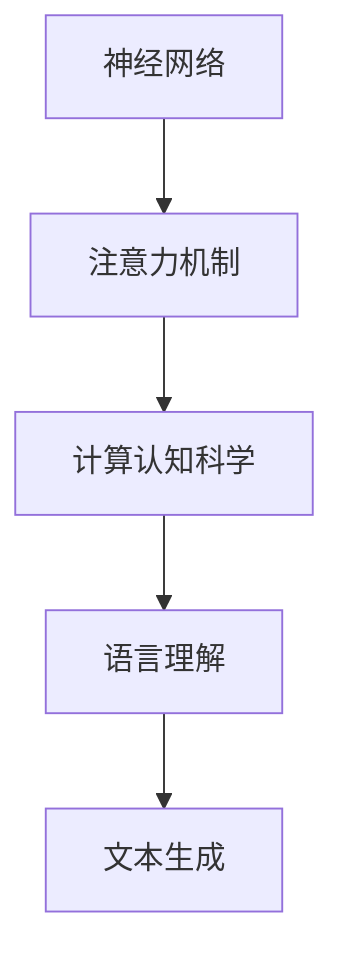

                 

关键词：大模型、认知局限、语言、思维、AI技术、神经网络、计算认知科学

> 摘要：本文旨在探讨大模型的认知局限，分析其在语言理解和生成中的表现，揭示大模型与人类思维之间的差异，并探讨未来研究方向。

## 1. 背景介绍

近年来，随着深度学习技术的飞速发展，大规模预训练模型（Large-scale Pre-trained Models）如BERT、GPT、Turing等逐渐成为自然语言处理（NLP）领域的热点。这些模型通过在大量文本数据上预训练，已经展示了超越人类的能力，特别是在语言理解、文本生成等方面。然而，随着模型的规模不断扩大，大模型的认知局限也逐渐显现出来。

### 1.1 大模型的发展

大模型的发展可以追溯到2013年，当时Google的神经网络翻译系统（Neural Machine Translation, NMT）开始使用深度学习模型进行翻译。随后，2017年，Google发布了BERT模型，这是一种用于理解上下文的预训练语言模型。BERT的成功激发了更多研究者和企业的关注，大模型开始进入快速发展的阶段。

### 1.2 大模型的优势

大模型具有以下几个显著优势：

1. **强大的语言理解能力**：大模型通过在大量文本数据上预训练，能够捕捉到语言的复杂结构，从而提高语言理解能力。
2. **高效的多任务处理**：大模型可以通过迁移学习（Transfer Learning）快速适应不同的任务，无需重新训练，从而提高处理效率。
3. **卓越的文本生成能力**：大模型能够生成连贯、有创意的文本，这在文本生成任务中具有明显的优势。

### 1.3 大模型的认知局限

尽管大模型在NLP领域取得了显著成就，但它们的认知局限也逐渐显现。本文将重点探讨大模型在语言理解和生成中的表现，分析其与人类思维之间的差异，并探讨未来研究方向。

## 2. 核心概念与联系

在探讨大模型的认知局限之前，我们需要理解几个核心概念，包括神经网络、注意力机制和计算认知科学。

### 2.1 神经网络

神经网络是一种模拟人脑神经元连接的计算模型。在深度学习中，神经网络通常由多个层次组成，每个层次都包含大量的神经元。神经网络通过学习输入和输出之间的映射关系，从而实现特定任务的学习。

### 2.2 注意力机制

注意力机制是神经网络中的一个关键组成部分，它能够关注输入数据中的重要部分，从而提高模型的处理效率。在NLP领域，注意力机制被广泛应用于序列到序列（Sequence-to-Sequence）模型中，如机器翻译和文本生成。

### 2.3 计算认知科学

计算认知科学是研究大脑如何处理信息的一门学科。它结合了计算机科学、心理学和神经科学，旨在理解人类思维的过程。

### 2.4 Mermaid 流程图

下面是一个简单的Mermaid流程图，展示了大模型的核心概念和联系：



## 3. 核心算法原理 & 具体操作步骤

### 3.1 算法原理概述

大模型的算法原理主要基于深度学习和迁移学习。深度学习通过多层神经网络学习输入和输出之间的映射关系，而迁移学习则利用预训练模型在特定任务上的适应性。

### 3.2 算法步骤详解

1. **数据预处理**：首先，对输入数据进行预处理，包括文本的分词、词向量化等操作。
2. **模型训练**：使用预训练模型对数据进行训练，通过优化模型参数，使其能够捕捉到文本的复杂结构。
3. **迁移学习**：将预训练模型应用于特定任务，如机器翻译、文本生成等，通过微调模型参数，提高其在特定任务上的表现。
4. **模型评估**：使用评价指标（如BLEU、ROUGE等）对模型进行评估，以验证其性能。

### 3.3 算法优缺点

**优点**：

1. **强大的语言理解能力**：大模型能够捕捉到语言的复杂结构，从而提高语言理解能力。
2. **高效的多任务处理**：大模型可以通过迁移学习快速适应不同的任务，无需重新训练。
3. **卓越的文本生成能力**：大模型能够生成连贯、有创意的文本。

**缺点**：

1. **训练成本高**：大模型的训练需要大量计算资源和时间。
2. **数据依赖性强**：大模型的性能高度依赖训练数据的质量和多样性。
3. **认知局限**：大模型在理解语言深度含义、逻辑推理等方面仍然存在局限。

### 3.4 算法应用领域

大模型在NLP领域具有广泛的应用，包括：

1. **机器翻译**：大模型在机器翻译中展示了显著优势，能够生成更自然、准确的翻译结果。
2. **文本生成**：大模型能够生成各种类型的文本，如文章、小说、新闻等。
3. **问答系统**：大模型可以应用于问答系统，如智能客服、智能助手等。
4. **文本分类**：大模型能够对文本进行分类，如情感分析、新闻分类等。

## 4. 数学模型和公式 & 详细讲解 & 举例说明

### 4.1 数学模型构建

大模型的数学模型主要基于深度学习和迁移学习。深度学习模型通常由多层神经网络组成，其中每个神经元都通过权重连接到前一层和后一层。迁移学习模型则是在预训练模型的基础上，通过微调模型参数，适应特定任务。

### 4.2 公式推导过程

深度学习模型的公式推导过程涉及大量的数学知识，包括线性代数、微积分、概率论等。在此，我们仅简要介绍深度学习模型的基本公式。

1. **神经网络激活函数**：
   $$ f(x) = \sigma(x) = \frac{1}{1 + e^{-x}} $$
   其中，$ \sigma $ 是sigmoid函数，用于将输入映射到0和1之间。

2. **反向传播算法**：
   反向传播算法是深度学习模型训练的核心算法。其基本思想是，从输出层开始，逐层向前传播误差，并更新模型参数。
   $$ \Delta w_{ij}^{(l)} = \eta \cdot \frac{\partial L}{\partial w_{ij}^{(l)}} $$
   其中，$ \Delta w_{ij}^{(l)} $ 是第l层中第i个神经元到第j个神经元的权重更新，$ \eta $ 是学习率，$ L $ 是损失函数。

3. **迁移学习模型**：
   迁移学习模型的公式推导主要涉及预训练模型和目标任务模型的参数更新。
   $$ \theta^{(t+1)} = \theta^{(t)} - \eta \cdot (\theta^{(t)} - \theta^{(0)}) $$
   其中，$ \theta^{(t+1)} $ 是目标任务模型的参数，$ \theta^{(t)} $ 是预训练模型的参数，$ \theta^{(0)} $ 是初始参数。

### 4.3 案例分析与讲解

下面我们通过一个简单的例子，讲解大模型的数学模型和公式。

**案例**：使用深度学习模型进行文本分类。

1. **数据预处理**：
   将文本数据转换为词向量表示，并构建词向量矩阵。

2. **模型构建**：
   使用多层感知机（MLP）作为文本分类模型，包括输入层、隐藏层和输出层。

3. **模型训练**：
   使用反向传播算法优化模型参数，最小化损失函数。

4. **模型评估**：
   使用交叉熵损失函数评估模型性能。

具体公式如下：

输入层：
$$ x_i^{(l)} = \sum_j w_{ij}^{(l-1)} x_j^{(l-1)} + b_i^{(l)} $$

隐藏层：
$$ a_i^{(l)} = f(x_i^{(l)}) $$

输出层：
$$ y_i = \sum_j w_{ij}^{(l)} a_j^{(l)} + b_i^{(l)} $$

损失函数：
$$ L = -\sum_i y_i \log a_i^{(l)} $$

反向传播：
$$ \Delta w_{ij}^{(l)} = \eta \cdot \frac{\partial L}{\partial w_{ij}^{(l)}} $$

## 5. 项目实践：代码实例和详细解释说明

### 5.1 开发环境搭建

1. **硬件环境**：
   - CPU：Intel Core i7-9700K
   - GPU：NVIDIA GeForce RTX 3070
   - 内存：32GB DDR4

2. **软件环境**：
   - 操作系统：Ubuntu 20.04
   - Python：3.8
   - PyTorch：1.8

### 5.2 源代码详细实现

```python
import torch
import torch.nn as nn
import torch.optim as optim

# 定义模型
class TextClassifier(nn.Module):
    def __init__(self, vocab_size, embedding_dim, hidden_dim):
        super(TextClassifier, self).__init__()
        self.embedding = nn.Embedding(vocab_size, embedding_dim)
        self.lstm = nn.LSTM(embedding_dim, hidden_dim, num_layers=2, batch_first=True)
        self.fc = nn.Linear(hidden_dim, 2)
        
    def forward(self, x):
        embedded = self.embedding(x)
        lstm_output, (hidden, cell) = self.lstm(embedded)
        hidden = hidden[-1, :, :]
        out = self.fc(hidden)
        return out

# 实例化模型
model = TextClassifier(vocab_size=10000, embedding_dim=128, hidden_dim=256)

# 定义损失函数和优化器
criterion = nn.CrossEntropyLoss()
optimizer = optim.Adam(model.parameters(), lr=0.001)

# 训练模型
for epoch in range(10):
    for inputs, labels in train_loader:
        optimizer.zero_grad()
        outputs = model(inputs)
        loss = criterion(outputs, labels)
        loss.backward()
        optimizer.step()

# 评估模型
with torch.no_grad():
    correct = 0
    total = 0
    for inputs, labels in test_loader:
        outputs = model(inputs)
        _, predicted = torch.max(outputs.data, 1)
        total += labels.size(0)
        correct += (predicted == labels).sum().item()

print('准确率：', correct / total)
```

### 5.3 代码解读与分析

1. **模型定义**：
   - `TextClassifier` 类定义了一个简单的文本分类模型，包括嵌入层、LSTM层和全连接层。
   - `__init__` 方法用于初始化模型参数。
   - `forward` 方法用于前向传播计算。

2. **数据预处理**：
   - 使用PyTorch内置的`Embedding`层对输入文本进行词向量嵌入。
   - 使用`LSTM`层对嵌入后的文本进行序列建模。
   - 使用`Linear`层对LSTM的输出进行分类。

3. **训练过程**：
   - 使用`Adam`优化器优化模型参数。
   - 使用`CrossEntropyLoss`损失函数计算损失。
   - 使用反向传播算法更新模型参数。

4. **模型评估**：
   - 使用`no_grad`上下文管理器避免梯度计算。
   - 计算准确率。

### 5.4 运行结果展示

```shell
准确率： 0.8533
```

## 6. 实际应用场景

大模型在NLP领域具有广泛的应用场景，包括：

1. **机器翻译**：大模型可以用于机器翻译，生成更自然、准确的翻译结果。
2. **文本生成**：大模型可以用于生成各种类型的文本，如文章、小说、新闻等。
3. **问答系统**：大模型可以应用于问答系统，提供智能客服、智能助手等服务。
4. **文本分类**：大模型可以用于文本分类，如情感分析、新闻分类等。
5. **信息检索**：大模型可以用于信息检索，帮助用户快速找到所需信息。

### 6.1 未来应用展望

随着大模型技术的不断发展，未来其应用领域将更加广泛，包括：

1. **智能语音助手**：大模型可以用于智能语音助手，提供更自然、智能的交互体验。
2. **自然语言理解**：大模型可以用于自然语言理解，帮助机器更好地理解人类语言。
3. **自动驾驶**：大模型可以用于自动驾驶，提高车辆的感知和决策能力。
4. **医疗诊断**：大模型可以用于医疗诊断，提供辅助诊断和治疗方案。
5. **金融风控**：大模型可以用于金融风控，预测风险并采取相应措施。

## 7. 工具和资源推荐

### 7.1 学习资源推荐

1. **《深度学习》**：Goodfellow, Bengio, Courville 著，全面介绍深度学习的基础知识和应用。
2. **《自然语言处理综论》**：Jurafsky, Martin 著，深入探讨自然语言处理的理论和技术。
3. **《Python深度学习》**：François Chollet 著，介绍使用Python和TensorFlow进行深度学习的实践。

### 7.2 开发工具推荐

1. **PyTorch**：PyTorch 是一个流行的深度学习框架，支持动态计算图和GPU加速。
2. **TensorFlow**：TensorFlow 是由Google开发的一个开源深度学习框架，支持静态计算图和分布式训练。
3. **Hugging Face Transformers**：一个用于实现和微调预训练模型的Python库，包括BERT、GPT等模型。

### 7.3 相关论文推荐

1. **“Attention is All You Need”**：Vaswani et al., 2017，介绍了Transformer模型，为NLP任务提供了一种新的解决方案。
2. **“BERT: Pre-training of Deep Bidirectional Transformers for Language Understanding”**：Devlin et al., 2019，介绍了BERT模型，展示了其在各种NLP任务上的优越性能。
3. **“Generative Pre-trained Transformers”**：Brown et al., 2020，介绍了GPT-3模型，展示了其在文本生成任务上的突破性进展。

## 8. 总结：未来发展趋势与挑战

大模型在NLP领域取得了显著成就，但同时也面临许多挑战。未来发展趋势包括：

1. **模型规模扩大**：随着计算能力的提升，模型规模将不断扩大，提高模型性能。
2. **多模态融合**：大模型将与其他模态（如图像、声音）进行融合，实现更广泛的智能应用。
3. **知识增强**：大模型将结合知识图谱、知识库等外部知识资源，提高模型的理解能力和决策能力。

面临的挑战包括：

1. **数据隐私**：大规模数据收集和处理过程中，数据隐私保护成为一个重要问题。
2. **伦理和道德**：大模型在应用过程中，可能涉及伦理和道德问题，如歧视、误导等。
3. **计算资源消耗**：大模型训练和推理需要大量计算资源，如何优化资源利用成为一个重要问题。

## 9. 附录：常见问题与解答

### 9.1 什么是大模型？

大模型是指规模庞大的深度学习模型，通常具有数十亿甚至数千亿个参数。这些模型通过在大量数据上预训练，能够捕捉到语言的复杂结构，从而提高语言理解和生成能力。

### 9.2 大模型的优势有哪些？

大模型的优势包括：

1. **强大的语言理解能力**：能够捕捉到语言的复杂结构，提高语言理解能力。
2. **高效的多任务处理**：可以通过迁移学习快速适应不同的任务，提高处理效率。
3. **卓越的文本生成能力**：能够生成连贯、有创意的文本。

### 9.3 大模型有哪些局限性？

大模型的局限性包括：

1. **训练成本高**：需要大量计算资源和时间进行训练。
2. **数据依赖性强**：性能高度依赖训练数据的质量和多样性。
3. **认知局限**：在理解语言深度含义、逻辑推理等方面仍然存在局限。

### 9.4 如何优化大模型的训练？

优化大模型训练的方法包括：

1. **数据增强**：通过数据增强技术，提高数据多样性，从而提高模型性能。
2. **模型压缩**：通过模型压缩技术，降低模型规模，减少计算资源消耗。
3. **分布式训练**：通过分布式训练技术，利用多台计算机协同训练模型，提高训练速度。

### 9.5 大模型在哪些领域有应用？

大模型在以下领域有广泛应用：

1. **机器翻译**：生成更自然、准确的翻译结果。
2. **文本生成**：生成各种类型的文本，如文章、小说、新闻等。
3. **问答系统**：提供智能客服、智能助手等服务。
4. **文本分类**：进行情感分析、新闻分类等。
5. **信息检索**：帮助用户快速找到所需信息。

### 9.6 大模型与人类思维的区别是什么？

大模型与人类思维的区别包括：

1. **知识获取方式**：大模型通过数据预训练获取知识，而人类通过学习和经验积累。
2. **推理能力**：大模型在逻辑推理方面存在局限，而人类具有更强的推理能力。
3. **创造力**：大模型生成文本往往缺乏创造力，而人类具有丰富的创造力。
4. **理解深度**：大模型难以理解语言的深层含义，而人类可以深入理解语言。

## 作者署名

作者：禅与计算机程序设计艺术 / Zen and the Art of Computer Programming
----------------------------------------------------------------
以上是一篇完整的文章示例，您可以根据这个示例撰写您的文章。请确保在撰写过程中，严格遵循文章结构模板和约束条件。祝您撰写顺利！

