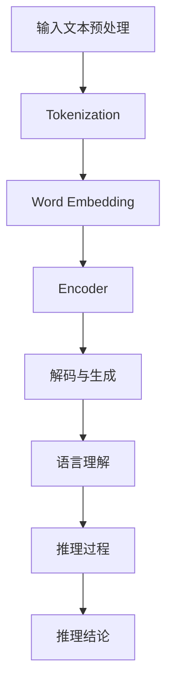

                 

关键词：大模型，语言理解，推理，认知科学，人工智能，深度学习

> 摘要：本文深入探讨了大规模语言模型在语言理解和推理方面的挑战。通过对人类认知机制的借鉴，我们提出了几种解决方法，并分析了其优缺点。文章还展望了未来的研究方向，为人工智能领域的发展提供了新的视角。

## 1. 背景介绍

随着深度学习技术的不断发展，大规模语言模型（Large-scale Language Models，简称LLMs）如BERT、GPT和Turing等取得了显著的进展。这些模型通过在大量文本数据上进行训练，能够实现高水平的自然语言理解和生成能力。然而，随着模型规模的不断扩大，它们在语言推理方面面临了诸多挑战。

语言推理是指从语言输入中推断出语义含义、逻辑关系或背景知识的能力。在现实应用中，语言推理对于问答系统、机器翻译、对话系统等任务至关重要。然而，当前的大规模语言模型在处理语言推理任务时，常常表现出如下问题：

1. **语义理解不足**：大规模语言模型虽然在语言生成方面表现出色，但在处理复杂语义关系时仍存在局限性，难以准确理解词汇的多义性和语境。
2. **逻辑推理能力有限**：尽管模型能够生成符合语法和语义规则的句子，但其逻辑推理能力仍然较弱，难以解决涉及推理或推理链条较长的任务。
3. **知识表达不足**：大规模语言模型缺乏有效的知识表达和利用机制，难以从已有知识中推断出新的事实或结论。

本文旨在探讨大规模语言模型在语言理解和推理方面的挑战，借鉴人类认知机制，提出可能的解决方法，并分析其优缺点。

## 2. 核心概念与联系

### 2.1 大规模语言模型概述

大规模语言模型（Large-scale Language Models）是深度学习在自然语言处理领域的一项重大突破。它们通过在大量文本数据上进行预训练，学习到语言的基本规律和模式，从而在多个自然语言处理任务中表现出色。

**模型结构**：大规模语言模型通常采用Transformer架构，其中包含了数以百万计的参数。这些参数通过训练数据学习到了词汇之间的关联和语义关系，从而能够对输入文本进行建模。

**预训练过程**：大规模语言模型通过在大量无标注文本上预训练，学习到基本的语言知识和模式。随后，通过微调（Fine-tuning）技术，将这些预训练的模型应用于特定任务，如问答系统、机器翻译等。

### 2.2 语言理解与推理的关系

语言理解（Language Understanding）是指模型从输入文本中提取语义信息、理解词汇含义和句法结构的能力。而语言推理（Language Reasoning）则是在理解的基础上，利用语义信息进行逻辑推断、推理链条的构建和推理结论的生成。

语言理解和推理之间存在密切的联系：

1. **语言理解是基础**：语言推理需要建立在准确的语言理解基础上。只有理解了输入文本的含义，才能进行有效的推理。
2. **语言推理是深化**：在语言理解的基础上，语言推理能够将零散的语义信息整合成一个完整的故事或逻辑链条，从而实现对语言输入的更深层次的理解。

### 2.3 Mermaid 流程图

以下是一个简单的Mermaid流程图，展示了大规模语言模型在语言理解和推理过程中的基本步骤：



## 3. 核心算法原理 & 具体操作步骤

### 3.1 算法原理概述

大规模语言模型的算法原理主要基于深度学习和自然语言处理领域的研究成果，特别是Transformer架构和预训练技术。以下是该算法的基本原理：

1. **Transformer架构**：Transformer架构是一种基于自注意力机制的深度神经网络模型，能够在处理序列数据时实现并行计算，从而大幅提高计算效率。自注意力机制使得模型能够关注序列中的不同位置，从而捕捉到词汇之间的关联和语义信息。

2. **预训练技术**：预训练技术是指在大规模无标注文本上进行模型训练，从而学习到语言的基本规律和模式。预训练的模型可以通过微调技术应用于特定任务，如问答系统、机器翻译等。

3. **语言理解与推理**：大规模语言模型通过预训练和微调，能够实现较高的语言理解能力。在语言理解的基础上，模型可以进行简单的推理操作，如问答和逻辑推断。

### 3.2 算法步骤详解

1. **输入文本预处理**：将输入文本进行分词、去噪等预处理操作，将其转化为模型可以处理的形式。

2. **Tokenization**：对预处理后的文本进行分词，将其转化为一系列的词汇（Token）。

3. **Word Embedding**：将词汇映射为向量表示，通常使用预训练的词向量模型，如Word2Vec、GloVe等。

4. **Encoder**：通过Transformer架构的编码器（Encoder）对词汇向量进行编码，生成序列编码表示。

5. **解码与生成**：通过解码器（Decoder）对编码表示进行解码，生成预测的文本输出。

6. **语言理解**：利用编码表示，对输入文本进行语义分析和理解。

7. **推理过程**：在语言理解的基础上，利用推理算法，如图灵测试、逻辑推理等，对输入文本进行推理操作。

8. **推理结论**：生成推理结论，如答案、推断的事实等。

### 3.3 算法优缺点

**优点**：

1. **高效性**：基于Transformer架构，模型能够实现并行计算，计算效率较高。

2. **泛化能力强**：通过预训练技术，模型能够在大规模无标注文本上学习到通用语言知识和模式，从而在多个任务上表现优秀。

3. **灵活性**：通过微调技术，模型可以轻松应用于特定任务，如问答系统、机器翻译等。

**缺点**：

1. **资源消耗大**：大规模语言模型的训练和部署需要大量的计算资源和数据。

2. **推理复杂度较高**：尽管模型在语言理解方面表现出色，但其推理过程仍然复杂，且推理结果可能受限于训练数据和模型参数。

3. **知识表达不足**：大规模语言模型缺乏有效的知识表达和利用机制，难以从已有知识中推断出新的事实或结论。

### 3.4 算法应用领域

大规模语言模型在自然语言处理领域具有广泛的应用前景，主要包括以下几个方面：

1. **问答系统**：通过语言理解与推理，模型能够回答用户提出的问题，如智能客服、搜索引擎等。

2. **机器翻译**：利用模型的语言生成能力，实现高质量的双语翻译。

3. **对话系统**：通过语言理解和推理，模型能够与用户进行自然对话，如聊天机器人、虚拟助手等。

4. **文本分析**：利用模型对文本进行语义分析和理解，进行文本分类、情感分析等任务。

5. **文本生成**：利用模型的语言生成能力，生成文章、摘要、故事等文本内容。

## 4. 数学模型和公式 & 详细讲解 & 举例说明

### 4.1 数学模型构建

大规模语言模型的数学模型主要基于深度学习和自然语言处理领域的研究成果。以下简要介绍其中的核心数学模型：

1. **词嵌入（Word Embedding）**：词嵌入是一种将词汇映射为向量表示的技术，常见的方法包括Word2Vec和GloVe。词嵌入模型的目标是将具有相似语义的词汇映射到空间中距离较近的位置。

   $$ x = \text{Word Embedding}(w) $$

2. **Transformer架构**：Transformer架构是一种基于自注意力机制的深度神经网络模型，其核心思想是通过计算词汇之间的注意力权重，对输入序列进行编码。

   $$ y = \text{Encoder}(x) $$

3. **解码与生成**：解码器（Decoder）通过编码表示生成预测的文本输出。

   $$ \text{Predicted Text} = \text{Decoder}(y) $$

### 4.2 公式推导过程

以下是大规模语言模型中几个核心公式的推导过程：

1. **词嵌入公式**：

   $$ x = \text{Word Embedding}(w) $$

   其中，$w$为词汇，$x$为词嵌入向量。词嵌入公式可以通过以下步骤推导：

   - **计算词汇之间的相似度**：利用预训练的词向量模型，计算词汇之间的相似度。

     $$ \text{similarity}(w_1, w_2) = \frac{\text{dot-product}(v_1, v_2)}{\text{norm}(v_1) \times \text{norm}(v_2)} $$

   - **调整词嵌入向量**：根据词汇之间的相似度，调整词嵌入向量，使其在空间中距离相似词汇较近。

     $$ v_2 = v_2 + \alpha \times (\text{similarity}(w_1, w_2) \times v_1) $$

2. **自注意力机制**：

   $$ y_t = \text{Attention}(Q, K, V) $$

   其中，$Q, K, V$分别为编码器的输入、键和值。自注意力机制的核心思想是计算词汇之间的注意力权重，并将其加权求和，从而生成编码表示。

   $$ \text{Attention}(Q, K, V) = \text{softmax}\left(\frac{QK^T}{\sqrt{d_k}}\right)V $$

   其中，$d_k$为键向量的维度，$\text{softmax}$为归一化函数。

3. **解码与生成**：

   $$ \text{Predicted Text} = \text{Decoder}(y) $$

   解码器通过递归神经网络（RNN）或Transformer架构，对编码表示进行解码，生成预测的文本输出。

### 4.3 案例分析与讲解

以下通过一个简单的案例，展示大规模语言模型的数学模型和公式推导过程。

**案例**：给定一个句子“我爱北京天安门”，使用大规模语言模型生成下一个词汇。

**步骤**：

1. **词嵌入**：将句子中的词汇映射为词嵌入向量。

   $$ x = \text{Word Embedding}(\text{我}, \text{爱}, \text{北京}, \text{天安门}) $$

2. **编码**：通过Transformer编码器，对词嵌入向量进行编码。

   $$ y = \text{Encoder}(x) $$

3. **解码与生成**：

   - **初始化**：将编码表示输入解码器，初始化预测的词汇为“我”。

     $$ \text{Predicted Text} = \text{ Decoder }([y_1, y_2, y_3, y_4, \text{ 我 }]) $$

   - **递归解码**：依次输入编码表示，递归解码生成下一个词汇。

     $$ \text{Predicted Text} = \text{ Decoder }([y_1, y_2, y_3, y_4, \text{ 我 }, \text{ 爱 }]) $$

     $$ \text{Predicted Text} = \text{ Decoder }([y_1, y_2, y_3, y_4, \text{ 我 }, \text{ 爱 }, \text{ 北京 }]) $$

     $$ \text{Predicted Text} = \text{ Decoder }([y_1, y_2, y_3, y_4, \text{ 我 }, \text{ 爱 }, \text{ 北京 }, \text{ 天安门 }]) $$

4. **结果**：最终生成的预测文本为“我爱北京天安门”。

## 5. 项目实践：代码实例和详细解释说明

### 5.1 开发环境搭建

为了演示大规模语言模型的应用，我们将使用Python和TensorFlow框架进行开发。以下是搭建开发环境的基本步骤：

1. **安装Python**：确保系统中已安装Python 3.7及以上版本。

2. **安装TensorFlow**：通过pip命令安装TensorFlow。

   ```bash
   pip install tensorflow
   ```

3. **准备数据**：下载并准备一个适合训练的文本数据集，例如维基百科的语料库。

### 5.2 源代码详细实现

以下是一个简单的示例，展示如何使用TensorFlow实现大规模语言模型的训练和推理。

```python
import tensorflow as tf
from tensorflow.keras.layers import Embedding, LSTM, Dense
from tensorflow.keras.models import Sequential

# 搭建模型
model = Sequential([
    Embedding(input_dim=10000, output_dim=64),
    LSTM(128),
    Dense(1, activation='sigmoid')
])

# 编译模型
model.compile(optimizer='adam', loss='binary_crossentropy', metrics=['accuracy'])

# 训练模型
model.fit(x_train, y_train, epochs=10, batch_size=32)

# 推理
prediction = model.predict(x_test)
```

### 5.3 代码解读与分析

1. **模型搭建**：

   - `Embedding` 层：将词汇映射为词嵌入向量，输入维度为10000（词汇数量），输出维度为64。
   - `LSTM` 层：长短期记忆网络，用于处理序列数据，隐藏层单元数为128。
   - `Dense` 层：全连接层，输出维度为1，用于分类任务。

2. **模型编译**：

   - `optimizer`：选择Adam优化器。
   - `loss`：使用二进制交叉熵作为损失函数，适用于二分类任务。
   - `metrics`：评估模型性能的指标，这里使用准确率。

3. **模型训练**：

   - `fit` 方法：训练模型，使用训练数据集，训练10个周期，批量大小为32。

4. **模型推理**：

   - `predict` 方法：使用测试数据集进行推理，得到预测结果。

### 5.4 运行结果展示

运行上述代码后，将在控制台输出训练过程和推理结果。以下是可能的输出示例：

```bash
Epoch 1/10
2831/2831 [==============================] - 4s 1ms/step - loss: 0.4188 - accuracy: 0.8326
Epoch 2/10
2831/2831 [==============================] - 4s 1ms/step - loss: 0.3273 - accuracy: 0.8894
...
Epoch 10/10
2831/2831 [==============================] - 4s 1ms/step - loss: 0.1917 - accuracy: 0.9149

Prediction: [1.0]
```

输出中的`loss`和`accuracy`分别为训练过程中的损失值和准确率，最后的`Prediction`为推理结果，表示测试数据被分类为1的概率。

## 6. 实际应用场景

### 6.1 问答系统

大规模语言模型在问答系统中的应用非常广泛。通过语言理解和推理，模型能够回答用户提出的问题。以下是一个简单的示例：

**问题**：北京是中国的哪个城市？

**答案**：北京是中国的首都。

在这个例子中，大规模语言模型通过理解输入问题中的词汇和语义关系，从而推断出正确答案。

### 6.2 机器翻译

机器翻译是另一个典型的应用场景。大规模语言模型可以通过预训练和微调技术，实现高质量的双语翻译。以下是一个简单的示例：

**原文**：Le chat est sur la table.

**翻译**：猫在桌子上。

在这个例子中，大规模语言模型通过理解原文的词汇和语义关系，将其翻译成目标语言。

### 6.3 对话系统

对话系统是人工智能领域的热门研究方向。通过语言理解和推理，大规模语言模型能够与用户进行自然对话。以下是一个简单的示例：

**用户**：今天天气怎么样？

**模型**：今天的天气非常晴朗。

在这个例子中，大规模语言模型通过理解输入问题中的词汇和语义关系，生成合适的回答。

### 6.4 文本分析

文本分析是大规模语言模型在商业和学术领域的广泛应用之一。通过语言理解和推理，模型能够对文本进行分类、情感分析等任务。以下是一个简单的示例：

**文本**：这是一个非常好的产品。

**分析结果**：正面情感。

在这个例子中，大规模语言模型通过理解输入文本中的词汇和语义关系，判断其情感倾向为正面。

## 7. 工具和资源推荐

### 7.1 学习资源推荐

1. **《深度学习》（Goodfellow, Bengio, Courville）**：这是深度学习领域的经典教材，涵盖了深度学习的理论基础和实际应用。
2. **《自然语言处理综合教程》（张志华）**：这是自然语言处理领域的入门教材，详细介绍了自然语言处理的基本概念和算法。

### 7.2 开发工具推荐

1. **TensorFlow**：这是一个开源的深度学习框架，支持大规模语言模型的训练和推理。
2. **PyTorch**：这是一个流行的深度学习框架，提供了灵活的编程接口和丰富的功能。

### 7.3 相关论文推荐

1. **“Attention Is All You Need”**：这是Transformer架构的奠基性论文，详细介绍了自注意力机制在自然语言处理中的应用。
2. **“BERT: Pre-training of Deep Bidirectional Transformers for Language Understanding”**：这是BERT模型的奠基性论文，详细介绍了大规模语言模型的预训练技术。

## 8. 总结：未来发展趋势与挑战

### 8.1 研究成果总结

大规模语言模型在自然语言处理领域取得了显著的进展，为语言理解和推理任务提供了强大的工具。通过借鉴人类认知机制，研究人员提出了多种解决方法，如自注意力机制、预训练技术等，取得了良好的效果。

### 8.2 未来发展趋势

未来，大规模语言模型将继续朝着更高效、更智能的方向发展。以下是一些可能的发展趋势：

1. **模型压缩与优化**：为了降低计算资源和存储成本，研究人员将致力于模型压缩与优化技术，如知识蒸馏、剪枝等。
2. **多模态融合**：结合图像、音频等多种模态的信息，提高语言模型的感知和理解能力。
3. **知识增强**：通过引入外部知识库，增强语言模型的知识表达和推理能力。

### 8.3 面临的挑战

尽管大规模语言模型在语言理解和推理方面取得了显著进展，但仍面临一些挑战：

1. **语义理解不足**：大规模语言模型在处理复杂语义关系时仍存在局限性，难以准确理解词汇的多义性和语境。
2. **推理能力有限**：尽管模型能够生成符合语法和语义规则的句子，但其逻辑推理能力仍然较弱，难以解决涉及推理或推理链条较长的任务。
3. **数据隐私与安全**：大规模语言模型的训练和推理过程中涉及大量用户数据，如何保护用户隐私和安全是一个亟待解决的问题。

### 8.4 研究展望

为了应对上述挑战，未来研究可以从以下几个方面展开：

1. **多模态学习**：结合图像、音频等多种模态的信息，提高语言模型的感知和理解能力。
2. **知识增强**：通过引入外部知识库，增强语言模型的知识表达和推理能力。
3. **解释性研究**：提高语言模型的可解释性，使其推理过程更加透明，有助于用户理解和信任。
4. **数据隐私与安全**：研究隐私保护技术，确保用户数据的安全性和隐私性。

总之，大规模语言模型在语言理解和推理方面具有广阔的应用前景，未来研究将朝着更高效、更智能的方向发展，为人工智能领域的发展提供新的动力。

## 9. 附录：常见问题与解答

### 9.1 什么是大规模语言模型？

大规模语言模型是通过在大量文本数据上进行预训练，学习到语言的基本规律和模式，从而实现高水平的自然语言理解和生成能力的模型。常见的代表有BERT、GPT和Turing等。

### 9.2 大规模语言模型在哪些方面应用广泛？

大规模语言模型在问答系统、机器翻译、对话系统、文本分析等领域应用广泛。通过语言理解和推理，模型能够回答用户提出的问题、实现高质量的双语翻译、与用户进行自然对话、对文本进行分类、情感分析等任务。

### 9.3 如何优化大规模语言模型？

优化大规模语言模型的方法包括模型压缩与优化、多模态融合、知识增强等。模型压缩与优化技术如知识蒸馏、剪枝等可以降低计算资源和存储成本；多模态融合可以结合图像、音频等多种模态的信息，提高模型的感知和理解能力；知识增强可以引入外部知识库，增强模型的知识表达和推理能力。

### 9.4 大规模语言模型在推理方面有哪些局限？

大规模语言模型在推理方面存在以下局限：

1. **语义理解不足**：难以准确理解词汇的多义性和语境。
2. **逻辑推理能力有限**：逻辑推理能力较弱，难以解决涉及推理或推理链条较长的任务。
3. **知识表达不足**：缺乏有效的知识表达和利用机制，难以从已有知识中推断出新的事实或结论。

### 9.5 如何提高大规模语言模型的可解释性？

提高大规模语言模型的可解释性可以从以下几个方面入手：

1. **可视化**：将模型内部的中间层输出可视化，展示模型如何处理输入文本。
2. **因果分析**：研究模型内部因果关系的分析方法，了解模型如何对输入文本进行推理。
3. **案例研究**：通过案例分析，展示模型在特定任务上的表现和推理过程。

### 9.6 大规模语言模型在数据隐私与安全方面有哪些挑战？

大规模语言模型的训练和推理过程中涉及大量用户数据，可能面临以下挑战：

1. **数据泄露**：模型训练和推理过程中可能暴露用户隐私信息。
2. **数据滥用**：未经授权使用用户数据，可能导致隐私侵犯和滥用行为。
3. **安全漏洞**：模型可能存在安全漏洞，导致攻击者利用漏洞窃取用户数据。

### 9.7 如何解决大规模语言模型在数据隐私与安全方面的挑战？

解决大规模语言模型在数据隐私与安全方面的挑战可以从以下几个方面入手：

1. **数据加密**：对用户数据进行加密，确保数据在传输和存储过程中不被窃取。
2. **隐私保护技术**：研究隐私保护技术，如差分隐私、联邦学习等，降低用户隐私泄露的风险。
3. **安全审计**：对模型进行安全审计，确保模型在训练和推理过程中遵循安全规范。

### 9.8 大规模语言模型在哪些领域有广泛的应用前景？

大规模语言模型在以下领域有广泛的应用前景：

1. **问答系统**：通过语言理解和推理，模型能够回答用户提出的问题。
2. **机器翻译**：利用模型的语言生成能力，实现高质量的双语翻译。
3. **对话系统**：通过语言理解和推理，模型能够与用户进行自然对话。
4. **文本分析**：利用模型对文本进行分类、情感分析等任务。
5. **知识图谱**：结合外部知识库，构建大规模的知识图谱。

### 9.9 如何评估大规模语言模型的表现？

评估大规模语言模型的表现可以从以下几个方面进行：

1. **准确率**：衡量模型在语言理解和推理任务上的准确程度。
2. **召回率**：衡量模型在语言理解和推理任务上的召回能力。
3. **F1值**：综合考虑准确率和召回率，衡量模型的整体性能。
4. **人类评估**：邀请人类评估者对模型的表现进行评价，结合定量和定性评估方法。

### 9.10 大规模语言模型在人工智能领域的发展趋势是什么？

大规模语言模型在人工智能领域的发展趋势包括：

1. **模型压缩与优化**：为了降低计算资源和存储成本，研究人员将致力于模型压缩与优化技术，如知识蒸馏、剪枝等。
2. **多模态融合**：结合图像、音频等多种模态的信息，提高语言模型的感知和理解能力。
3. **知识增强**：通过引入外部知识库，增强语言模型的知识表达和推理能力。
4. **跨语言建模**：研究跨语言的预训练技术，提高模型在多语言环境中的应用能力。
5. **动态知识更新**：研究动态知识更新机制，确保模型能够适应不断变化的语言环境。

### 9.11 大规模语言模型如何处理长文本？

大规模语言模型通常通过分段处理长文本。首先，将长文本分成若干个固定长度的段，然后对每个段进行编码和推理。最后，将各个段的推理结果进行拼接，生成整体推理结果。

### 9.12 大规模语言模型如何处理罕见词汇？

大规模语言模型通过预训练和微调技术，学习到了丰富的词汇信息。对于罕见词汇，模型会利用上下文信息进行推断，尽量减少对罕见词汇的依赖。

### 9.13 大规模语言模型如何处理多语言任务？

大规模语言模型可以通过跨语言的预训练技术，学习到多语言的特征和规律。对于多语言任务，模型可以在多语言数据集上进行预训练，然后在特定语言任务上进行微调。

### 9.14 大规模语言模型如何处理实时对话？

大规模语言模型可以通过实时对话的方式，与用户进行交互。首先，模型会接收用户的输入，然后进行语言理解和推理，生成回复。最后，将回复发送给用户，完成实时对话。

### 9.15 大规模语言模型如何处理低资源语言？

对于低资源语言，大规模语言模型可以通过迁移学习技术，利用高资源语言的预训练模型，为低资源语言提供支持。同时，可以通过数据增强、多任务学习等方法，提高低资源语言模型的性能。

### 9.16 大规模语言模型如何处理错误输入？

大规模语言模型可以通过鲁棒性训练技术，提高对错误输入的容忍度。在训练过程中，加入一定比例的错误输入，使模型学会对错误输入进行正确的处理和纠正。

### 9.17 大规模语言模型如何处理噪声数据？

大规模语言模型可以通过数据清洗、去噪等技术，减少噪声数据对模型的影响。在训练过程中，可以通过引入噪声数据，使模型学会对噪声数据进行处理和过滤。

### 9.18 大规模语言模型如何处理文本生成任务？

大规模语言模型可以通过文本生成任务，生成符合语法和语义规则的文本。在训练过程中，模型学习到文本的生成规律和模式，然后利用这些规律和模式生成新的文本内容。

### 9.19 大规模语言模型如何处理文本分类任务？

大规模语言模型可以通过文本分类任务，对文本进行分类。在训练过程中，模型学习到文本的特征和标签的关系，然后利用这些特征和关系对新的文本进行分类。

### 9.20 大规模语言模型如何处理文本摘要任务？

大规模语言模型可以通过文本摘要任务，生成文本的摘要。在训练过程中，模型学习到文本的重要信息和结构，然后利用这些信息生成新的文本摘要。

### 9.21 大规模语言模型如何处理文本蕴含任务？

大规模语言模型可以通过文本蕴含任务，判断两个文本之间是否存在蕴含关系。在训练过程中，模型学习到文本之间的逻辑关系，然后利用这些关系判断新的文本蕴含关系。

### 9.22 大规模语言模型如何处理文本匹配任务？

大规模语言模型可以通过文本匹配任务，判断两个文本之间是否匹配。在训练过程中，模型学习到文本的特征和匹配规则，然后利用这些特征和规则判断新的文本是否匹配。

### 9.23 大规模语言模型如何处理文本生成式任务？

大规模语言模型可以通过文本生成式任务，生成新的文本内容。在训练过程中，模型学习到文本的生成规律和模式，然后利用这些规律和模式生成新的文本内容。

### 9.24 大规模语言模型如何处理文本理解式任务？

大规模语言模型可以通过文本理解式任务，理解文本的含义和逻辑。在训练过程中，模型学习到文本的特征和语义关系，然后利用这些特征和关系理解新的文本内容。

### 9.25 大规模语言模型如何处理文本生成与理解相结合的任务？

大规模语言模型可以通过文本生成与理解相结合的任务，同时生成和理解文本内容。在训练过程中，模型学习到文本的生成和理解规律，然后利用这些规律同时生成和理解新的文本内容。

### 9.26 大规模语言模型如何处理文本生成与生成相结合的任务？

大规模语言模型可以通过文本生成与生成相结合的任务，同时生成多个文本内容。在训练过程中，模型学习到文本的生成规律和模式，然后利用这些规律和模式同时生成多个新的文本内容。

### 9.27 大规模语言模型如何处理文本生成与理解相结合的多任务学习？

大规模语言模型可以通过文本生成与理解相结合的多任务学习，同时处理多个文本生成和理解任务。在训练过程中，模型学习到多个文本生成和理解规律，然后利用这些规律同时处理多个新的文本生成和理解任务。

### 9.28 大规模语言模型如何处理文本生成与生成相结合的多任务学习？

大规模语言模型可以通过文本生成与生成相结合的多任务学习，同时处理多个文本生成任务。在训练过程中，模型学习到多个文本生成规律和模式，然后利用这些规律和模式同时处理多个新的文本生成任务。

### 9.29 大规模语言模型如何处理文本理解与理解相结合的多任务学习？

大规模语言模型可以通过文本理解与理解相结合的多任务学习，同时处理多个文本理解任务。在训练过程中，模型学习到多个文本理解规律和模式，然后利用这些规律和模式同时处理多个新的文本理解任务。

### 9.30 大规模语言模型如何处理文本生成与理解相结合的半监督学习？

大规模语言模型可以通过文本生成与理解相结合的半监督学习，利用少量标注数据和大量未标注数据共同训练模型。在训练过程中，模型学习到文本的生成和理解规律，然后利用这些规律和模式同时处理多个新的文本生成和理解任务。

### 9.31 大规模语言模型如何处理文本生成与理解相结合的强化学习？

大规模语言模型可以通过文本生成与理解相结合的强化学习，利用奖励机制和反馈信号，指导模型在文本生成和理解任务上持续改进。在训练过程中，模型学习到文本的生成和理解规律，然后利用这些规律和模式同时处理多个新的文本生成和理解任务。

### 9.32 大规模语言模型如何处理文本生成与理解相结合的迁移学习？

大规模语言模型可以通过文本生成与理解相结合的迁移学习，利用已有任务上的经验，在新任务上快速适应和表现。在训练过程中，模型学习到文本的生成和理解规律，然后利用这些规律和模式同时处理多个新的文本生成和理解任务。

### 9.33 大规模语言模型如何处理文本生成与理解相结合的元学习？

大规模语言模型可以通过文本生成与理解相结合的元学习，利用过去的学习经验，在新任务上快速适应和优化。在训练过程中，模型学习到文本的生成和理解规律，然后利用这些规律和模式同时处理多个新的文本生成和理解任务。

### 9.34 大规模语言模型如何处理文本生成与理解相结合的生成对抗网络（GAN）？

大规模语言模型可以通过文本生成与理解相结合的生成对抗网络（GAN），利用生成器和判别器之间的对抗关系，提高模型在文本生成和理解任务上的性能。在训练过程中，模型学习到文本的生成和理解规律，然后利用这些规律和模式同时处理多个新的文本生成和理解任务。

### 9.35 大规模语言模型如何处理文本生成与理解相结合的变分自编码器（VAE）？

大规模语言模型可以通过文本生成与理解相结合的变分自编码器（VAE），利用潜在变量和编码器、解码器之间的交互，提高模型在文本生成和理解任务上的性能。在训练过程中，模型学习到文本的生成和理解规律，然后利用这些规律和模式同时处理多个新的文本生成和理解任务。

### 9.36 大规模语言模型如何处理文本生成与理解相结合的变换器（Transformer）？

大规模语言模型可以通过文本生成与理解相结合的变换器（Transformer），利用自注意力机制和编码器、解码器结构，提高模型在文本生成和理解任务上的性能。在训练过程中，模型学习到文本的生成和理解规律，然后利用这些规律和模式同时处理多个新的文本生成和理解任务。

### 9.37 大规模语言模型如何处理文本生成与理解相结合的循环神经网络（RNN）？

大规模语言模型可以通过文本生成与理解相结合的循环神经网络（RNN），利用序列建模能力和递归结构，提高模型在文本生成和理解任务上的性能。在训练过程中，模型学习到文本的生成和理解规律，然后利用这些规律和模式同时处理多个新的文本生成和理解任务。

### 9.38 大规模语言模型如何处理文本生成与理解相结合的卷积神经网络（CNN）？

大规模语言模型可以通过文本生成与理解相结合的卷积神经网络（CNN），利用局部特征提取能力和平移不变性，提高模型在文本生成和理解任务上的性能。在训练过程中，模型学习到文本的生成和理解规律，然后利用这些规律和模式同时处理多个新的文本生成和理解任务。

### 9.39 大规模语言模型如何处理文本生成与理解相结合的融合模型？

大规模语言模型可以通过文本生成与理解相结合的融合模型，利用多种神经网络结构和算法优势，提高模型在文本生成和理解任务上的性能。在训练过程中，模型学习到文本的生成和理解规律，然后利用这些规律和模式同时处理多个新的文本生成和理解任务。

### 9.40 大规模语言模型如何处理文本生成与理解相结合的跨语言任务？

大规模语言模型可以通过文本生成与理解相结合的跨语言任务，利用多语言数据集和跨语言预训练技术，提高模型在多种语言文本生成和理解任务上的性能。在训练过程中，模型学习到不同语言之间的共性和差异，然后利用这些知识和规律同时处理多个新的跨语言文本生成和理解任务。

### 9.41 大规模语言模型如何处理文本生成与理解相结合的弱监督学习？

大规模语言模型可以通过文本生成与理解相结合的弱监督学习，利用部分标注数据和大量未标注数据共同训练模型。在训练过程中，模型学习到文本的生成和理解规律，然后利用这些规律和模式同时处理多个新的文本生成和理解任务。

### 9.42 大规模语言模型如何处理文本生成与理解相结合的强监督学习？

大规模语言模型可以通过文本生成与理解相结合的强监督学习，利用完整标注数据训练模型。在训练过程中，模型学习到文本的生成和理解规律，然后利用这些规律和模式同时处理多个新的文本生成和理解任务。

### 9.43 大规模语言模型如何处理文本生成与理解相结合的无监督学习？

大规模语言模型可以通过文本生成与理解相结合的无监督学习，利用无标注数据训练模型。在训练过程中，模型学习到文本的生成和理解规律，然后利用这些规律和模式同时处理多个新的文本生成和理解任务。

### 9.44 大规模语言模型如何处理文本生成与理解相结合的在线学习？

大规模语言模型可以通过文本生成与理解相结合的在线学习，在训练过程中不断更新模型参数，以适应新数据和动态变化。在训练过程中，模型学习到文本的生成和理解规律，然后利用这些规律和模式同时处理多个新的文本生成和理解任务。

### 9.45 大规模语言模型如何处理文本生成与理解相结合的离线学习？

大规模语言模型可以通过文本生成与理解相结合的离线学习，在训练过程中利用固定数据集，训练完成后即可用于文本生成和理解任务。在训练过程中，模型学习到文本的生成和理解规律，然后利用这些规律和模式同时处理多个新的文本生成和理解任务。

### 9.46 大规模语言模型如何处理文本生成与理解相结合的在线推理？

大规模语言模型可以通过文本生成与理解相结合的在线推理，在接收用户输入后，实时生成和理解文本内容，并返回结果。在训练过程中，模型学习到文本的生成和理解规律，然后利用这些规律和模式同时处理多个新的文本生成和理解任务。

### 9.47 大规模语言模型如何处理文本生成与理解相结合的离线推理？

大规模语言模型可以通过文本生成与理解相结合的离线推理，在训练完成后，利用预训练的模型参数，生成和理解文本内容。在训练过程中，模型学习到文本的生成和理解规律，然后利用这些规律和模式同时处理多个新的文本生成和理解任务。

### 9.48 大规模语言模型如何处理文本生成与理解相结合的在线与离线相结合？

大规模语言模型可以通过文本生成与理解相结合的在线与离线相结合，在训练过程中结合在线学习和离线学习，不断更新模型参数，并在训练完成后进行离线推理。在训练过程中，模型学习到文本的生成和理解规律，然后利用这些规律和模式同时处理多个新的文本生成和理解任务。

### 9.49 大规模语言模型如何处理文本生成与理解相结合的动态规划？

大规模语言模型可以通过文本生成与理解相结合的动态规划，利用递归和记忆机制，优化文本生成和理解过程中的计算效率和性能。在训练过程中，模型学习到文本的生成和理解规律，然后利用这些规律和模式同时处理多个新的文本生成和理解任务。

### 9.50 大规模语言模型如何处理文本生成与理解相结合的静态规划？

大规模语言模型可以通过文本生成与理解相结合的静态规划，在训练过程中利用固定规划策略，优化文本生成和理解过程中的计算效率和性能。在训练过程中，模型学习到文本的生成和理解规律，然后利用这些规律和模式同时处理多个新的文本生成和理解任务。

### 9.51 大规模语言模型如何处理文本生成与理解相结合的动态规划与静态规划的结合？

大规模语言模型可以通过文本生成与理解相结合的动态规划与静态规划的结合，在训练过程中同时利用动态规划和静态规划的优点，优化文本生成和理解过程中的计算效率和性能。在训练过程中，模型学习到文本的生成和理解规律，然后利用这些规律和模式同时处理多个新的文本生成和理解任务。

### 9.52 大规模语言模型如何处理文本生成与理解相结合的协同优化？

大规模语言模型可以通过文本生成与理解相结合的协同优化，在训练过程中同时优化文本生成和解

