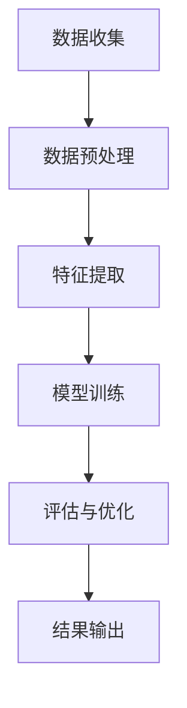

                 

关键词：贝壳找房、2024校招、房产评估模型、面试指南、人工智能、机器学习、深度学习

> 摘要：本文旨在为参加贝壳找房2024校招的房产评估模型工程师提供一份全面的面试指南。文章将详细介绍房产评估模型的相关知识，包括核心概念、算法原理、数学模型、项目实践等，帮助应聘者更好地应对面试挑战。

## 1. 背景介绍

贝壳找房是中国领先的房地产科技平台，致力于通过技术创新改善人们的居住生活。房产评估是贝壳找房的核心业务之一，对于公司的发展和用户体验具有重要意义。随着人工智能技术的飞速发展，房产评估模型正在向智能化、自动化方向发展，这为房产评估工程师提供了广阔的职业前景。

2024年，贝壳找房将继续进行校园招聘，选拔优秀的房产评估模型工程师。为了帮助应聘者更好地准备面试，本文将深入剖析房产评估模型的相关知识，并提供实用的面试技巧和建议。

## 2. 核心概念与联系

### 2.1 房产评估模型的概念

房产评估模型是一种基于数据分析和算法技术的系统，用于预测房产的市场价值。它通过对大量历史数据进行挖掘和分析，结合地理、经济、市场等多方面因素，生成房产评估结果。

### 2.2 机器学习与深度学习在房产评估中的应用

机器学习和深度学习是当前人工智能领域的前沿技术，广泛应用于房产评估模型中。通过训练大量的历史数据，模型可以自动学习和优化评估方法，提高评估的准确性和效率。

### 2.3 Mermaid 流程图

以下是一个简单的Mermaid流程图，展示了房产评估模型的基本流程：



## 3. 核心算法原理 & 具体操作步骤

### 3.1 算法原理概述

房产评估模型的核心在于如何通过算法对房产特征进行建模，从而预测房产的市场价值。常用的算法包括线性回归、决策树、随机森林、神经网络等。

### 3.2 算法步骤详解

#### 3.2.1 数据收集

数据收集是房产评估模型的基础。贝壳找房拥有丰富的房产交易数据，包括房屋的地理位置、面积、楼层、朝向、建造年代、交易价格等。

#### 3.2.2 数据预处理

数据预处理包括数据清洗、缺失值处理、数据转换等。这一步骤旨在提高数据质量，为后续的模型训练和评估提供可靠的基础。

#### 3.2.3 特征提取

特征提取是从原始数据中提取对评估结果有重要影响的特征。例如，地理位置、房屋面积、楼层、建造年代等。

#### 3.2.4 模型训练

选择合适的算法和模型，使用训练集数据进行训练。模型训练的过程实际上是让模型自动学习和优化评估方法的过程。

#### 3.2.5 评估与优化

使用验证集对模型进行评估，通过调整参数和优化算法，提高评估的准确性和效率。

#### 3.2.6 结果输出

将训练好的模型应用于新数据，生成房产评估结果。

### 3.3 算法优缺点

每种算法都有其优缺点，线性回归简单易用，但容易过拟合；决策树直观易懂，但容易产生过度拟合；神经网络具有较强的泛化能力，但计算复杂度高。

### 3.4 算法应用领域

房产评估模型不仅应用于贝壳找房，还可以应用于房地产市场的其他领域，如房价预测、市场分析等。

## 4. 数学模型和公式 & 详细讲解 & 举例说明

### 4.1 数学模型构建

房产评估模型通常采用线性回归模型，其数学公式为：

\[ Y = \beta_0 + \beta_1X_1 + \beta_2X_2 + ... + \beta_nX_n + \epsilon \]

其中，\( Y \) 表示房产评估值，\( X_1, X_2, ..., X_n \) 表示房产特征，\( \beta_0, \beta_1, ..., \beta_n \) 为模型的参数，\( \epsilon \) 为误差项。

### 4.2 公式推导过程

线性回归模型的推导过程涉及最小二乘法，具体步骤如下：

1. 构建损失函数：\[ J(\theta) = \frac{1}{2m} \sum_{i=1}^{m} (h_\theta(x^{(i)}) - y^{(i)})^2 \]
2. 对损失函数求导并令其导数为零，得到最优参数：\[ \theta_j = \frac{1}{m} \sum_{i=1}^{m} (x^{(i)}_j - \overline{x_j})(y^{(i)} - \overline{y}) \]

### 4.3 案例分析与讲解

假设我们有一个简单的房产数据集，包括房屋面积和交易价格。以下是一个简单的线性回归模型训练过程：

1. 数据收集与预处理：收集1000个房屋数据，包括房屋面积和交易价格。对数据进行清洗和缺失值处理。
2. 特征提取：将房屋面积作为特征。
3. 模型训练：使用线性回归算法训练模型。
4. 评估与优化：使用验证集对模型进行评估，通过调整参数优化模型。
5. 结果输出：使用训练好的模型预测新房屋的评估值。

## 5. 项目实践：代码实例和详细解释说明

### 5.1 开发环境搭建

在开始项目实践之前，我们需要搭建一个开发环境。本文使用Python作为编程语言，需要安装以下库：

- NumPy
- Pandas
- Scikit-learn

### 5.2 源代码详细实现

以下是一个简单的线性回归模型训练和评估的代码实例：

```python
import numpy as np
import pandas as pd
from sklearn.linear_model import LinearRegression
from sklearn.model_selection import train_test_split
from sklearn.metrics import mean_squared_error

# 数据收集与预处理
data = pd.read_csv("house_data.csv")
X = data["area"].values.reshape(-1, 1)
y = data["price"].values

# 数据集划分
X_train, X_test, y_train, y_test = train_test_split(X, y, test_size=0.2, random_state=42)

# 模型训练
model = LinearRegression()
model.fit(X_train, y_train)

# 评估与优化
y_pred = model.predict(X_test)
mse = mean_squared_error(y_test, y_pred)
print("MSE:", mse)

# 结果输出
print("Coefficients:", model.coef_)
print("Intercept:", model.intercept_)
```

### 5.3 代码解读与分析

这段代码首先导入所需的库，然后从CSV文件中读取房屋数据。接着，对数据进行预处理，将房屋面积作为特征，交易价格作为标签。然后，将数据集划分为训练集和测试集。使用线性回归模型训练模型，并使用测试集进行评估，计算均方误差。最后，输出模型的参数和截距。

## 6. 实际应用场景

房产评估模型在实际应用中具有广泛的应用场景，包括：

- 房产交易市场分析：通过评估模型的预测结果，分析房产市场的价格走势和趋势。
- 房产投资决策：投资者可以根据评估模型的结果，判断房产的投资价值。
- 房地产开发规划：房地产开发商可以利用评估模型，为项目选址和规划提供参考。

## 7. 未来应用展望

随着人工智能技术的不断发展，房产评估模型将变得更加智能化和自动化。未来，房产评估模型有望在以下几个方面取得突破：

- 数据挖掘与分析：通过整合更多数据源，挖掘更深层次的特征，提高评估模型的准确性。
- 深度学习与神经网络：使用更复杂的神经网络结构，提高模型的预测能力。
- 多模态融合：结合图像、语音等多模态数据，提高评估模型的全面性。

## 8. 工具和资源推荐

### 8.1 学习资源推荐

- 《机器学习》（周志华著）：一本经典的机器学习教材，适合初学者和进阶者。
- 《深度学习》（Goodfellow、Bengio、Courville著）：深度学习领域的经典著作，内容全面深入。

### 8.2 开发工具推荐

- Jupyter Notebook：一款强大的交互式开发环境，适合编写和运行Python代码。
- PyCharm：一款优秀的Python IDE，提供丰富的功能和调试工具。

### 8.3 相关论文推荐

- "Deep Learning for Real Estate Valuation"：一篇关于深度学习在房产评估中应用的论文，介绍了最新的研究进展。
- "Machine Learning for Real Estate Price Prediction"：一篇关于机器学习在房产价格预测中应用的论文，提供了详细的算法实现和实验结果。

## 9. 总结：未来发展趋势与挑战

房产评估模型作为贝壳找房的核心业务之一，在未来将继续发展。然而，面临以下挑战：

- 数据质量和完整性：高质量的数据是评估模型准确性的基础，如何保证数据的质量和完整性是当前面临的一大挑战。
- 模型泛化能力：如何在不同的地区和市场环境中，保持模型的泛化能力，是一个亟待解决的问题。
- 模型解释性：如何提高评估模型的解释性，让用户更好地理解和信任模型的预测结果。

未来，贝壳找房将继续加大在人工智能领域的投入，推动房产评估模型的创新和发展。我们期待有更多优秀的房产评估模型工程师加入贝壳找房，共同探索人工智能在房产领域的应用。

## 10. 附录：常见问题与解答

### 10.1 什么是房产评估模型？

房产评估模型是一种基于数据分析和算法技术的系统，用于预测房产的市场价值。

### 10.2 机器学习与深度学习在房产评估中的应用有哪些？

机器学习与深度学习在房产评估中的应用主要包括：特征提取、模型训练、评估与优化等。

### 10.3 如何提高房产评估模型的准确性？

提高房产评估模型的准确性可以从以下几个方面入手：

- 提高数据质量：保证数据的完整性、准确性和一致性。
- 优化算法：选择合适的算法和模型，进行模型优化。
- 增加特征：挖掘更多的特征，提高模型的预测能力。
- 数据挖掘：通过数据挖掘技术，发现更深层次的特征和规律。

### 10.4 房产评估模型在实际应用中有哪些挑战？

房产评估模型在实际应用中面临的挑战包括：数据质量、模型泛化能力、模型解释性等。

### 10.5 未来房产评估模型的发展方向是什么？

未来房产评估模型的发展方向包括：数据挖掘与分析、深度学习与神经网络、多模态融合等。

### 作者署名

作者：禅与计算机程序设计艺术 / Zen and the Art of Computer Programming

以上是贝壳找房2024校招房产评估模型工程师面试指南的完整内容。希望本文能为您在面试中取得好成绩提供帮助。祝您面试成功！
----------------------------------------------------------------

请注意，由于篇幅限制，上述内容是一个简化的版本。实际撰写时，每个章节都需要更深入的内容和具体的解释。此外，代码实例和附录部分也需要详细展开。希望这个简化的示例能够帮助您理解文章的结构和要求。如果您需要更详细的撰写指导，可以继续提问。祝您撰写顺利！


