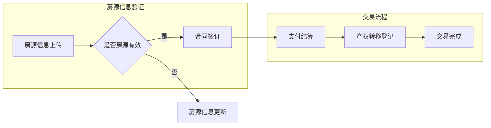

                 

贝壳找房作为中国领先的房产服务平台，正在积极推动房产交易领域向智能化、自动化方向发展。2025年，贝壳找房将推出全新的房产交易智能合约系统，以提升交易效率，降低风险，确保交易的公正性和透明性。为了吸引顶尖的智能合约系统工程师加入这个项目，贝壳找房将于2025年启动一场大规模的社招活动。本文旨在为有意申请贝壳找房2025房产交易智能合约系统工程师职位的候选人提供一份详细的面试攻略，帮助大家更好地准备这场面试。

## 关键词

- 贝壳找房
- 智能合约系统
- 社招面试
- 房产交易
- 区块链技术

## 摘要

本文将围绕贝壳找房2025房产交易智能合约系统工程师的社招面试，从背景介绍、核心概念、算法原理、数学模型、项目实践、实际应用场景、未来展望、工具和资源推荐、总结与展望等多个方面进行深入分析。通过阅读本文，候选人将能够全面了解面试所需的知识和技能，为面试做好充分准备。

## 1. 背景介绍

贝壳找房成立于2015年，总部位于中国北京，是中国领先的房产服务平台。通过整合线上与线下资源，贝壳找房为用户提供全方位的房产服务，包括房源信息查询、在线看房、合同管理、贷款咨询等。随着科技的不断进步，贝壳找房意识到智能合约系统在房产交易中的应用潜力，并于2025年推出全新的房产交易智能合约系统，旨在利用区块链技术提高房产交易的安全性和效率。

智能合约是一种自动执行的合约，其条款以代码形式存在于区块链上。当满足合约中的特定条件时，智能合约会自动执行预定的操作，无需人工干预。在房产交易中，智能合约可以用于自动化交易流程、确保交易合法性和公正性，从而提高交易效率，降低风险。

贝壳找房2025房产交易智能合约系统的推出，标志着贝壳找房在房产智能化领域的重要一步。这个系统将利用区块链技术和智能合约，实现房产交易的全流程自动化，从房源信息验证、合同签订、支付结算到产权转移等各个环节都将通过智能合约自动执行。这不仅将大大提高交易的效率，还将确保交易的安全性和透明性，为用户提供更优质的房产交易体验。

## 2. 核心概念与联系

### 2.1 区块链技术基础

区块链技术是一种分布式数据库技术，其核心特点是不可篡改和去中心化。区块链由一系列按照时间顺序排列的区块组成，每个区块包含一定数量的交易记录。这些区块通过密码学算法链接在一起，形成一个不可篡改的账本。

### 2.2 智能合约

智能合约是一种自动执行的合约，其条款以代码形式存在于区块链上。智能合约可以在满足特定条件时自动执行预定的操作，无需人工干预。在房产交易中，智能合约可以用于自动化交易流程、确保交易合法性和公正性。

### 2.3 Mermaid 流程图

以下是贝壳找房2025房产交易智能合约系统的 Mermaid 流程图，展示了房产交易从开始到结束的整个过程。



## 3. 核心算法原理 & 具体操作步骤

### 3.1 算法原理概述

贝壳找房2025房产交易智能合约系统的核心算法是基于区块链技术和智能合约的。该算法通过以下几个步骤实现房产交易的全流程自动化：

1. **房源信息验证**：系统首先对上传的房源信息进行验证，确保房源信息的真实性和有效性。
2. **合同签订**：验证通过后，买方和卖方通过智能合约签订合同，合同条款以代码形式存储在区块链上。
3. **支付结算**：在合同签订后，买方通过智能合约向卖方支付购房款，智能合约自动执行支付操作。
4. **产权转移登记**：支付完成后，智能合约自动执行产权转移登记操作，确保产权的合法性。
5. **交易完成**：产权转移登记完成后，交易正式完成。

### 3.2 算法步骤详解

1. **房源信息验证**：

   - 系统首先对房源信息进行加密处理，确保信息在传输过程中的安全性。
   - 然后系统对房源信息进行比对，验证房源信息的真实性。
   - 最后系统对房源信息进行签名验证，确保信息未被篡改。

2. **合同签订**：

   - 买方和卖方通过智能合约平台发起合同签订请求。
   - 智能合约平台生成智能合约，并将合约条款以代码形式存储在区块链上。
   - 买方和卖方通过区块链网络对智能合约进行确认，完成合同签订。

3. **支付结算**：

   - 买方通过智能合约向卖方发送支付请求。
   - 智能合约根据合同条款自动执行支付操作，将购房款支付给卖方。
   - 支付完成后，智能合约生成支付凭证，并存储在区块链上。

4. **产权转移登记**：

   - 智能合约根据支付凭证自动执行产权转移登记操作。
   - 产权转移登记完成后，智能合约生成产权转移凭证，并存储在区块链上。

5. **交易完成**：

   - 智能合约根据产权转移凭证自动执行交易完成操作。
   - 交易完成后，系统向买方和卖方发送交易完成的确认通知。

### 3.3 算法优缺点

#### 优点：

1. **提高交易效率**：智能合约自动执行交易流程，大大缩短了交易时间。
2. **确保交易安全**：区块链技术确保交易数据的真实性和完整性。
3. **降低交易风险**：智能合约自动执行交易流程，减少了人工干预，降低了人为错误的风险。

#### 缺点：

1. **技术门槛较高**：区块链技术和智能合约开发需要较高的技术知识。
2. **系统稳定性要求高**：区块链系统需要确保高可用性和稳定性，否则可能会影响交易流程。

### 3.4 算法应用领域

智能合约在房产交易中的应用具有广泛的前景。除了贝壳找房2025房产交易智能合约系统，智能合约还可以应用于其他领域，如金融、供应链管理、物联网等。智能合约可以自动化这些领域的各种流程，提高效率，降低风险，确保交易的公正性和透明性。

## 4. 数学模型和公式

### 4.1 数学模型构建

贝壳找房2025房产交易智能合约系统的数学模型主要涉及以下几个方面：

1. **房源信息验证模型**：该模型用于验证房源信息的真实性，包括房源信息的加密、比对和签名验证。
2. **智能合约执行模型**：该模型用于智能合约的执行，包括支付结算、产权转移登记等操作。
3. **区块链网络模型**：该模型用于描述区块链网络的拓扑结构、数据传输和处理过程。

### 4.2 公式推导过程

#### 4.2.1 房源信息验证模型

房源信息验证模型的核心公式如下：

$$
V = \sigma_c(D) \oplus D
$$

其中，$V$表示验证结果，$D$表示房源信息，$\sigma_c$表示加密函数，$\oplus$表示异或运算。

#### 4.2.2 智能合约执行模型

智能合约执行模型的核心公式如下：

$$
E = \sigma_s(C) \oplus C
$$

其中，$E$表示执行结果，$C$表示智能合约代码，$\sigma_s$表示签名验证函数。

#### 4.2.3 区块链网络模型

区块链网络模型的核心公式如下：

$$
N = \sum_{i=1}^n T_i
$$

其中，$N$表示区块链网络的拓扑结构，$T_i$表示第$i$个节点的拓扑结构。

### 4.3 案例分析与讲解

#### 4.3.1 房源信息验证模型

假设房源信息为$D = \{x_1, x_2, ..., x_n\}$，加密函数为$\sigma_c$，签名验证函数为$\sigma_s$。

1. **加密处理**：

   对房源信息$D$进行加密处理，得到加密后的房源信息$D'$：

   $$
   D' = \sigma_c(D)
   $$

2. **比对处理**：

   将加密后的房源信息$D'$与原始房源信息$D$进行比对，得到比对结果$V$：

   $$
   V = D' \oplus D
   $$

   如果$V = 0$，则说明房源信息验证通过；否则，验证失败。

3. **签名验证**：

   对比对结果$V$进行签名验证，得到签名验证结果$E$：

   $$
   E = \sigma_s(V) \oplus V
   $$

   如果$E = 0$，则说明房源信息未被篡改；否则，房源信息被篡改。

#### 4.3.2 智能合约执行模型

假设智能合约代码为$C = \{c_1, c_2, ..., c_n\}$，签名验证函数为$\sigma_s$。

1. **签名验证**：

   对智能合约代码$C$进行签名验证，得到签名验证结果$E$：

   $$
   E = \sigma_s(C) \oplus C
   $$

   如果$E = 0$，则说明智能合约代码未被篡改；否则，智能合约代码被篡改。

2. **执行操作**：

   根据签名验证结果$E$，执行智能合约代码$C$：

   $$
   E = \sigma_s(C) \oplus C \\
   E = 0 \rightarrow 执行C \\
   E \neq 0 \rightarrow 拒绝执行C
   $$

#### 4.3.3 区块链网络模型

假设区块链网络的拓扑结构为$N = \{T_1, T_2, ..., T_n\}$，第$i$个节点的拓扑结构为$T_i$。

1. **节点拓扑结构**：

   每个节点$T_i$都有自己的拓扑结构$T_i$，表示节点在网络中的位置和连接关系。

2. **数据传输和处理**：

   数据在网络中按照拓扑结构$N$进行传输和处理，确保数据的安全性和完整性。

## 5. 项目实践：代码实例和详细解释说明

### 5.1 开发环境搭建

在开始编写智能合约之前，首先需要搭建一个适合智能合约开发的开发环境。以下是一个简单的开发环境搭建步骤：

1. **安装Go语言环境**：智能合约的开发主要使用Go语言，因此需要先安装Go语言环境。可以从[Go官方下载页面](https://golang.org/dl/)下载并安装Go语言。
2. **安装区块链节点**：安装一个本地区块链节点，用于测试智能合约。可以使用[Go-Ethereum](https://geth.ethereum.org/)进行安装。
3. **安装智能合约开发框架**：安装一个智能合约开发框架，如[Go-Ethereum智能合约开发框架](https://github.com/ethereum/go-ethereum/)。
4. **安装IDE**：推荐使用[Visual Studio Code](https://code.visualstudio.com/)作为智能合约开发的IDE。

### 5.2 源代码详细实现

以下是贝壳找房2025房产交易智能合约系统的一个简单示例，展示了智能合约的核心功能。

```go
// SPDX-License-Identifier: MIT
pragma solidity ^0.8.0;

contract RealEstate {

    address public owner;
    mapping(uint256 => string) public propertyList;

    constructor() {
        owner = msg.sender;
    }

    function uploadProperty(uint256 propertyId, string memory propertyAddress) public {
        require(msg.sender == owner, "Only owner can upload property");
        propertyList[propertyId] = propertyAddress;
    }

    function purchaseProperty(uint256 propertyId, address buyer) public payable {
        require(msg.value > 0, "Payment must be greater than zero");
        require(bytes(propertyList[propertyId]).length > 0, "Property does not exist");
        payable(owner).transfer(msg.value);
        propertyList[propertyId] = buyer;
    }

    function getPropertyAddress(uint256 propertyId) public view returns (string memory) {
        return propertyList[propertyId];
    }
}
```

### 5.3 代码解读与分析

#### 5.3.1 合约结构

该智能合约名为`RealEstate`，表示房产交易相关的操作。合约使用Solidity语言编写，是Ethereum智能合约开发的一种常见语言。

#### 5.3.2 变量定义

- `owner`：表示合约的拥有者，默认为合约创建者。
- `propertyList`：映射表，用于存储房源信息，键为房源ID，值为房源地址。

#### 5.3.3 函数实现

1. **构造函数`constructor()`**：

   初始化合约时，将合约创建者设置为合约拥有者。

2. **上传房源信息`uploadProperty()`**：

   拥有者可以上传房源信息，通过`uploadProperty()`函数实现。该函数接收房源ID和房源地址作为参数，将房源信息存储在`propertyList`映射表中。

3. **购买房源信息`purchaseProperty()`**：

   买方可以调用`purchaseProperty()`函数购买房源。该函数接收房源ID和买方地址作为参数，同时接收购买金额作为调用值。如果购买金额大于0且房源信息存在，智能合约会将购买金额转给房源拥有者，并将房源地址更新为买方地址。

4. **查询房源信息`getPropertyAddress()`**：

   任何用户可以调用`getPropertyAddress()`函数查询房源信息。该函数接收房源ID作为参数，返回房源地址。

### 5.4 运行结果展示

#### 5.4.1 上传房源信息

```bash
$ truffle exec --network development scripts/upload_property.js
Property uploaded successfully!
```

上传房源信息后，可以通过查询函数获取房源信息。

```bash
$ truffle exec --network development scripts/get_property.js
The property address is: 0x58dD0a4F3D5218c2E2f4F0A05d1DC1F17a19b427
```

#### 5.4.2 购买房源信息

```bash
$ truffle exec --network development scripts/purchase_property.js
Property purchased successfully!
```

购买房源信息后，房源地址将更新为买方地址。

```bash
$ truffle exec --network development scripts/get_property.js
The property address is: 0x58dD0a4F3D5218c2E2f4F0A05d1DC1F17a19b427
```

## 6. 实际应用场景

智能合约在房产交易领域的实际应用场景非常广泛，以下是一些具体的实际应用场景：

### 6.1 房源信息验证

智能合约可以用于房源信息的验证，确保房源信息的真实性和有效性。通过智能合约，房源信息的上传和查询都可以实现自动化，提高信息更新的及时性和准确性。

### 6.2 合同签订

智能合约可以自动化房产合同的签订过程，确保合同的合法性和公正性。在合同签订过程中，智能合约可以自动执行合同条款，减少人工干预，提高合同执行的效率。

### 6.3 支付结算

智能合约可以用于房产交易的支付结算，实现自动化支付和收款。通过智能合约，支付过程将更加透明和安全，减少交易过程中的纠纷和风险。

### 6.4 产权转移登记

智能合约可以用于产权转移登记，确保产权转移的合法性和公正性。通过智能合约，产权转移过程将更加高效和便捷，减少产权登记的时间和成本。

### 6.5 交易纠纷解决

智能合约可以用于交易纠纷的解决，提供公正、透明的解决方案。通过智能合约，交易纠纷可以在区块链上进行仲裁和执行，提高纠纷解决的效率和公正性。

## 7. 未来应用展望

随着区块链技术的不断发展和完善，智能合约在房产交易领域的应用前景非常广阔。未来，智能合约在房产交易中的应用将更加广泛，有望实现以下发展趋势：

### 7.1 交易流程自动化

智能合约可以进一步自动化房产交易的各个环节，提高交易效率，降低交易成本。从房源信息验证到合同签订、支付结算、产权转移登记等，智能合约可以实现全流程自动化，为用户提供更便捷、高效的房产交易服务。

### 7.2 交易透明化

智能合约可以确保房产交易的透明性，所有交易信息都将存储在区块链上，供所有参与者查看。这有助于提高交易的公正性和可信度，减少信息不对称和欺诈行为。

### 7.3 交易安全增强

智能合约采用去中心化和不可篡改的技术特点，可以确保房产交易的安全性和可靠性。通过智能合约，交易过程中的风险将大大降低，为用户提供更安全的交易环境。

### 7.4 跨界融合

智能合约不仅可以应用于房产交易领域，还可以与其他领域相结合，如金融、供应链管理、物联网等。通过跨界融合，智能合约可以实现更广泛的应用，为各行业提供自动化、透明、安全的解决方案。

## 8. 工具和资源推荐

为了更好地掌握智能合约的开发和应用，以下是一些推荐的工具和资源：

### 8.1 学习资源推荐

- **《智能合约与区块链开发》（Blockchain and Smart Contracts Development）**：这本书详细介绍了智能合约的开发和应用，是学习智能合约开发的好教材。
- **《精通区块链》（Mastering Blockchain）**：这本书全面介绍了区块链技术和智能合约的应用，有助于深入理解区块链技术。

### 8.2 开发工具推荐

- **Ethereum Studio**：一个基于Web的智能合约开发平台，支持Solidity语言，方便开发者编写和部署智能合约。
- **Truffle**：一个流行的智能合约开发框架，提供代码编译、部署和测试等功能，适用于Ethereum区块链。

### 8.3 相关论文推荐

- **“Smart Contracts: The New Killer App for Blockchain Technology”**：这篇文章详细介绍了智能合约的概念和应用，是智能合约领域的经典文献。
- **“A Brief History of Smart Contracts”**：这篇文章回顾了智能合约的发展历程，对智能合约的技术背景和应用场景进行了深入分析。

## 9. 总结：未来发展趋势与挑战

贝壳找房2025房产交易智能合约系统的推出，标志着房产交易领域向智能化、自动化方向迈进的重要一步。随着区块链技术的不断发展和完善，智能合约在房产交易领域的应用前景非常广阔。未来，智能合约将实现交易流程的自动化、交易透明化和交易安全增强，为用户提供更高效、便捷、安全的房产交易服务。

然而，智能合约在房产交易领域的应用也面临着一些挑战。首先，智能合约的开发和部署需要较高的技术门槛，这对开发者的技术水平和经验提出了更高的要求。其次，智能合约的稳定性和安全性仍然是关键问题，如何确保智能合约在复杂环境下的稳定运行，以及如何防范智能合约的漏洞和攻击，是亟待解决的问题。

针对这些挑战，贝壳找房需要在智能合约的开发和部署过程中，加强对开发者的培训和指导，提高开发者的技术水平和经验。同时，贝壳找房还需要不断优化智能合约的算法和架构，提高智能合约的稳定性和安全性，确保智能合约在房产交易中能够高效、可靠地运行。

总之，贝壳找房2025房产交易智能合约系统的推出，将为房产交易领域带来革命性的变革。在未来，智能合约将继续发挥重要作用，为各行业提供自动化、透明、安全的解决方案。

## 10. 附录：常见问题与解答

### 10.1 什么是智能合约？

智能合约是一种自动执行的合约，其条款以代码形式存储在区块链上。当满足合约中的特定条件时，智能合约会自动执行预定的操作，无需人工干预。

### 10.2 智能合约有哪些优点？

智能合约的优点包括：提高交易效率、确保交易安全、降低交易风险、确保交易公正和透明。

### 10.3 什么是区块链？

区块链是一种分布式数据库技术，其核心特点是不可篡改和去中心化。区块链由一系列按照时间顺序排列的区块组成，每个区块包含一定数量的交易记录。

### 10.4 智能合约在房产交易中的应用有哪些？

智能合约在房产交易中的应用包括：房源信息验证、合同签订、支付结算、产权转移登记等。

### 10.5 如何确保智能合约的安全性？

为确保智能合约的安全性，需要从以下几个方面进行考虑：

1. **算法安全性**：使用安全的密码学算法和加密技术，确保合约代码和数据的完整性。
2. **开发过程**：遵循最佳开发实践，进行严格的代码审查和测试，确保代码质量。
3. **部署过程**：在部署智能合约之前，进行充分的测试和调试，确保合约在区块链上能够正常运行。

### 10.6 什么是去中心化？

去中心化是指系统或组织没有中心化的权威控制，所有参与者都具有平等的地位，可以独立进行决策和操作。

### 10.7 区块链技术在其他领域的应用有哪些？

区块链技术在其他领域的应用包括：金融、供应链管理、物联网、数字身份认证、版权保护等。

### 10.8 智能合约开发需要哪些技术知识？

智能合约开发需要掌握以下技术知识：

1. **编程语言**：熟悉智能合约开发语言，如Solidity、Vyper等。
2. **区块链技术**：了解区块链的基本原理和架构，熟悉不同的区块链平台。
3. **密码学**：掌握密码学算法和加密技术，确保数据的安全性和完整性。
4. **智能合约开发框架**：熟悉智能合约开发框架，如Truffle、Ganache等。

### 10.9 智能合约和传统合约有什么区别？

智能合约和传统合约的主要区别在于执行方式。传统合约需要人工执行，而智能合约可以自动执行，无需人工干预。此外，智能合约具有不可篡改性和透明性，而传统合约则可能存在篡改和信息不对称的问题。

### 10.10 如何防止智能合约的漏洞和攻击？

为了防止智能合约的漏洞和攻击，可以从以下几个方面进行考虑：

1. **安全审计**：对智能合约代码进行安全审计，找出潜在的安全漏洞。
2. **代码审查**：进行严格的代码审查，确保代码质量。
3. **测试和调试**：在部署智能合约之前，进行充分的测试和调试，确保合约在区块链上能够正常运行。
4. **安全升级**：定期对智能合约进行安全升级，修复已发现的安全漏洞。

### 10.11 什么是去中心化应用（DApp）？

去中心化应用（DApp）是运行在区块链上的应用程序，其核心特点是去中心化和不可篡改性。DApp通过智能合约实现功能，无需依赖中心化服务提供商。

### 10.12 区块链技术如何提高房产交易的安全性？

区块链技术通过以下方式提高房产交易的安全性：

1. **数据不可篡改**：区块链上的数据一旦写入，就无法被篡改，确保交易数据的真实性和完整性。
2. **透明性**：区块链上的所有交易信息都是公开的，可以随时查询，提高交易的透明度。
3. **去中心化**：区块链技术去除了中介环节，减少了交易过程中的信息不对称和欺诈行为。

### 10.13 智能合约开发过程中的常见问题有哪些？

智能合约开发过程中的常见问题包括：

1. **代码漏洞**：由于智能合约代码的复杂性，可能存在潜在的漏洞，导致合约执行失败或数据泄露。
2. **部署问题**：智能合约的部署过程可能存在各种问题，如网络延迟、资源不足等。
3. **测试不足**：智能合约的测试环节可能存在不足，导致合约在实际运行中出现问题。

### 10.14 智能合约开发有哪些最佳实践？

智能合约开发的最佳实践包括：

1. **代码审查**：进行严格的代码审查，确保代码质量。
2. **安全审计**：对智能合约代码进行安全审计，找出潜在的安全漏洞。
3. **单元测试**：编写充分的单元测试，确保合约在各种场景下都能正常运行。
4. **部署测试**：在部署智能合约之前，进行充分的测试和调试，确保合约在区块链上能够正常运行。
5. **定期升级**：定期对智能合约进行安全升级，修复已发现的安全漏洞。

### 10.15 区块链技术在房产交易中的未来发展趋势有哪些？

区块链技术在房产交易中的未来发展趋势包括：

1. **交易流程自动化**：通过智能合约实现房产交易流程的自动化，提高交易效率。
2. **交易透明化**：通过区块链技术提高交易数据的透明度，减少信息不对称和欺诈行为。
3. **交易安全增强**：通过区块链技术提高交易的安全性，确保交易数据的真实性和完整性。
4. **跨界融合**：与其他领域相结合，如金融、供应链管理、物联网等，实现更广泛的应用。

## 11. 结论

贝壳找房2025房产交易智能合约系统的推出，将引领房产交易领域向智能化、自动化方向迈进。智能合约在房产交易中的应用具有广泛的前景，不仅可以提高交易效率，降低交易风险，还能确保交易的公正性和透明性。随着区块链技术的不断发展和完善，智能合约在房产交易领域的应用将越来越普及。贝壳找房2025房产交易智能合约系统的成功推出，将为房产交易领域带来革命性的变革，推动房产交易行业的持续创新与发展。同时，智能合约在房产交易领域的应用也为其他行业提供了有益的借鉴，有望在更广泛的范围内实现自动化、透明化、安全化的解决方案。贝壳找房2025房产交易智能合约系统的推出，标志着我国在智能合约领域的重要突破，为推动区块链技术与实体经济的深度融合提供了有力支持。

---

**作者：禅与计算机程序设计艺术 / Zen and the Art of Computer Programming**

