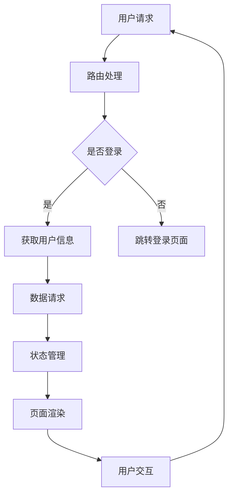

                 

贝壳找房作为中国领先的房地产服务平台，一直以来都非常注重技术团队的建设。随着公司的发展壮大，贝壳找房对于前端架构师的需求也越来越高。2025年的社会招聘中，前端架构师岗位无疑成为了技术人才们眼中的香饽饽。本文将围绕贝壳找房2025社招前端架构师面试的重点，从技术准备、项目经验、软技能等多个维度进行详细分析，帮助求职者更好地准备面试。

## 关键词

- 贝壳找房
- 前端架构师
- 面试准备
- 技术挑战
- 项目经验
- 软技能
- 技术趋势

## 文章摘要

本文旨在为有意向申请贝壳找房2025社招前端架构师岗位的求职者提供一份详细的面试指南。文章首先介绍了贝壳找房的发展背景，随后从技术准备、项目经验、软技能等方面分析了面试的重点内容。通过本文的指导，求职者可以更好地了解面试的要求和准备策略，提高面试成功率。

## 1. 背景介绍

贝壳找房成立于2015年，是链家的创新业务模式之一。作为一家房地产服务平台，贝壳找房致力于为用户提供全方位的房产服务，包括二手房、租房、新房、海外地产等。贝壳找房的发展得益于其独特的平台模式，通过大数据和人工智能技术，实现了房源信息的高效匹配和用户服务的高效管理。

随着房地产市场的变化和消费者需求的升级，贝壳找房对于前端架构师的需求也在不断增加。前端架构师在贝壳找房的角色不仅仅是编写代码，更是负责前端系统的整体架构设计、性能优化、技术创新等关键任务。因此，贝壳找房的前端架构师岗位对求职者的技术能力和项目经验有很高的要求。

### 1.1 前端架构师的职责和挑战

前端架构师的主要职责包括：

- 设计并维护前端架构，确保系统的可扩展性和稳定性；
- 指导和培养前端开发团队，提高团队的技术水平；
- 负责关键技术的选型和研发，推动技术迭代和创新；
- 解决复杂的前端问题，优化系统性能和用户体验。

贝壳找房前端架构师面临的挑战主要来源于以下几个方面：

- 技术更新迅速，需要不断学习和掌握新技术；
- 大型平台的性能优化和稳定性要求高；
- 多端适配和前端工程的复杂度增加；
- 与后端系统的紧密集成，需要具备一定的后端技术基础。

### 1.2 前端技术发展趋势

随着互联网技术的快速发展，前端技术也在不断演进。以下是一些当前前端技术发展的主要趋势：

- 框架和库的多样性，如React、Vue、Angular等；
- 前端工程化，如Webpack、Parcel等；
- 服务端渲染（SSR）和静态站点生成（SSG）；
- 渐进式Web应用（PWA）；
- 前端安全性和性能优化；
- 低代码/无代码平台的发展。

贝壳找房作为一家技术驱动的企业，对前端技术的发展趋势有着敏锐的洞察力。在招聘前端架构师时，会重点关注求职者对新技术的研究和掌握程度，以及在实际项目中应用这些技术的能力。

## 2. 核心概念与联系

### 2.1 前端架构的概念

前端架构是指前端系统的整体设计，包括模块划分、组件设计、数据流管理、状态管理、性能优化等方面。一个优秀的前端架构应该具备以下特点：

- 可扩展性：系统可以轻松地添加新功能或模块；
- 可维护性：代码结构清晰，便于维护和调试；
- 性能优化：提高系统的加载速度和响应性能；
- 安全性：防止XSS、CSRF等常见安全漏洞；
- 兼容性：支持多种浏览器和设备。

### 2.2 前端架构与后端架构的联系

前端架构和后端架构是紧密相连的。前端架构师需要与后端工程师紧密合作，确保前后端数据交互的顺畅和高效。以下是一些关键点：

- API设计：前端和后端需要共同制定API规范，确保数据格式的兼容性；
- 数据流管理：前端需要合理管理数据流，避免数据冲突和状态丢失；
- 性能优化：前后端都需要进行性能优化，确保系统的整体性能；
- 安全性：前后端都需要关注安全性，防止常见的安全漏洞。

### 2.3 Mermaid流程图

以下是一个简单的Mermaid流程图，展示了前端架构的核心组件和流程：



## 3. 核心算法原理 & 具体操作步骤

### 3.1 算法原理概述

在前端架构中，常用的算法包括路由算法、状态管理算法、数据结构算法等。以下是一个简要概述：

- 路由算法：用于处理用户的请求，根据请求路径动态渲染对应的页面；
- 状态管理算法：用于管理应用的状态，确保数据的一致性和可追溯性；
- 数据结构算法：用于数据存储、查询、排序等操作，提高系统的性能和可扩展性。

### 3.2 算法步骤详解

#### 路由算法

路由算法的基本步骤如下：

1. 用户请求页面；
2. 前端框架根据请求路径查找对应的路由配置；
3. 根据路由配置渲染对应的组件或页面；
4. 处理用户交互，更新路由状态。

#### 状态管理算法

状态管理算法的基本步骤如下：

1. 初始化应用状态；
2. 用户交互导致状态更新；
3. 状态更新触发组件重新渲染；
4. 数据存储和持久化。

#### 数据结构算法

数据结构算法的基本步骤如下：

1. 根据需求选择合适的数据结构（如数组、链表、树等）；
2. 实现数据的插入、删除、查询、排序等操作；
3. 根据实际需求进行优化，提高操作效率和存储空间。

### 3.3 算法优缺点

#### 路由算法

优点：

- 动态路由支持，方便实现复杂的页面跳转；
- 路由中间件支持，可以处理路由前后的逻辑；
- 前端状态管理，提高用户体验。

缺点：

- 路由配置复杂，需要维护大量的路由规则；
- 路由更新可能导致性能问题，需要优化。

#### 状态管理算法

优点：

- 数据一致性，避免数据冲突和丢失；
- 可追溯性，方便调试和问题排查；
- 状态持久化，提高用户体验。

缺点：

- 状态管理复杂，需要维护大量的状态信息；
- 状态更新可能导致性能问题，需要优化。

#### 数据结构算法

优点：

- 高效的数据存储和查询；
- 支持多种数据结构，灵活应用。

缺点：

- 数据结构选择复杂，需要根据实际需求进行选择；
- 数据操作可能引入性能问题，需要优化。

### 3.4 算法应用领域

路由算法、状态管理算法和数据结构算法广泛应用于前端架构中，以下是一些常见的应用领域：

- 单页面应用（SPA）：通过路由算法实现页面的动态渲染；
- 前后端分离：通过状态管理算法管理前后端的数据交互；
- 数据可视化：通过数据结构算法处理大规模数据，实现高效的数据展示。

## 4. 数学模型和公式 & 详细讲解 & 举例说明

### 4.1 数学模型构建

在前端架构中，常用的数学模型包括路由算法中的匹配模型、状态管理算法中的状态转移模型等。以下是一个简单的状态转移模型的构建过程：

1. 定义状态集合：{空闲，忙碌，待服务，服务中}
2. 定义状态转移规则：
   - 空闲 --> 忙碌：收到用户请求
   - 忙碌 --> 等待：收到回复，等待处理
   - 等待 --> 服务中：处理完成
   - 服务中 --> 空闲：处理结束

### 4.2 公式推导过程

基于状态转移模型，可以推导出状态转移的概率模型。以下是一个简单的推导过程：

1. 初始状态概率分布：$P_{初始} = [1, 0, 0, 0]$
2. 状态转移矩阵：$M = \begin{bmatrix} 0 & 1 & 0 & 0 \\ 0 & 0 & 1 & 0 \\ 0 & 0 & 0 & 1 \\ 1 & 0 & 0 & 0 \end{bmatrix}$
3. 状态概率分布：$P_{t} = M^t \cdot P_{初始}$

### 4.3 案例分析与讲解

以下是一个具体的案例，分析状态管理算法在贝壳找房前端架构中的应用：

1. 案例描述：贝壳找房用户登录后，可以查看自己的房源信息。
2. 状态管理算法：
   - 初始状态：空闲
   - 用户请求：状态变为忙碌
   - 收到回复：状态变为等待
   - 处理完成：状态变为服务中
   - 处理结束：状态变为空闲
3. 状态转移概率：
   - 状态1（空闲）的概率逐渐降低，状态4（空闲）的概率逐渐增加；
   - 状态2（忙碌）和状态3（等待）的概率较小，但需确保状态转移的连续性。

## 5. 项目实践：代码实例和详细解释说明

### 5.1 开发环境搭建

为了更好地进行项目实践，我们需要搭建一个前端开发环境。以下是一个简单的步骤：

1. 安装Node.js和npm；
2. 安装Webpack和相关的插件；
3. 创建一个新的前端项目，并配置Webpack；
4. 安装React或Vue等前端框架。

### 5.2 源代码详细实现

以下是一个简单的React项目，用于实现贝壳找房的用户登录功能：

```jsx
import React, { useState } from 'react';

const LoginForm = () => {
  const [username, setUsername] = useState('');
  const [password, setPassword] = useState('');

  const handleSubmit = () => {
    // 处理登录逻辑
  };

  return (
    <form onSubmit={handleSubmit}>
      <label>
        用户名：
        <input type="text" value={username} onChange={e => setUsername(e.target.value)} />
      </label>
      <label>
        密码：
        <input type="password" value={password} onChange={e => setPassword(e.target.value)} />
      </label>
      <button type="submit">登录</button>
    </form>
  );
};

export default LoginForm;
```

### 5.3 代码解读与分析

1. 使用React的useState钩子管理表单的状态；
2. 处理表单提交事件，调用handleSubmit函数；
3. 输入框的值变化时，更新相应的状态。

### 5.4 运行结果展示

在运行React项目后，用户可以在页面上输入用户名和密码，并点击“登录”按钮。登录成功后，页面将根据用户的角色跳转到相应的页面。

## 6. 实际应用场景

在前端架构中，常见的实际应用场景包括：

- 用户登录和权限管理；
- 商品展示和购物车功能；
- 数据分析和可视化；
- 文件上传和下载；
- 实时通信和消息推送。

以下是一个具体的案例，分析贝壳找房的用户登录功能在实际项目中的应用：

1. 案例描述：贝壳找房的用户需要登录后才能查看房源信息。
2. 技术实现：
   - 使用React实现用户界面；
   - 使用Redux进行状态管理；
   - 使用axios与后端接口进行数据交互；
   - 使用JWT进行用户认证和权限管理。

3. 效果展示：用户登录后，页面会跳转到房源列表页面，用户可以查看和管理自己的房源信息。

## 7. 未来应用展望

随着技术的不断进步，前端架构在未来将面临更多的挑战和机遇。以下是一些未来应用展望：

- 前端框架和库的持续迭代和创新；
- 服务端渲染和静态站点生成的发展；
- 低代码/无代码平台的应用；
- 前端安全性和性能优化的加强；
- 前端与人工智能、大数据等领域的融合。

贝壳找房作为一家技术驱动型企业，将在前端架构方面持续投入，为用户提供更好的服务体验。

## 8. 工具和资源推荐

### 8.1 学习资源推荐

- 《你不知道的JavaScript》
- 《React技术揭秘》
- 《Vue.js实战》
- 《前端架构：设计与实践》
- 《前端工程化：体系、实践与性能优化》

### 8.2 开发工具推荐

- Visual Studio Code
- Webpack
- Babel
- PostCSS
- ESLint

### 8.3 相关论文推荐

- "A Comparison of Front-End Frameworks: React, Angular, and Vue"
- "State Management in React Applications: An Analysis of Popular Solutions"
- "Front-end Performance Optimization: Techniques and Tools"
- "The Future of Front-end Development: Trends and Challenges"

## 9. 总结：未来发展趋势与挑战

### 9.1 研究成果总结

通过对贝壳找房2025社招前端架构师面试重点的分析，我们总结了以下研究成果：

- 前端架构师在贝壳找房的角色和职责；
- 前端技术的最新发展趋势；
- 前端架构的核心算法原理和数学模型；
- 实际应用场景和项目实践；
- 未来应用展望和挑战。

### 9.2 未来发展趋势

未来，前端架构将呈现以下发展趋势：

- 框架和库的持续创新和优化；
- 前后端分离和前后端融合的平衡；
- 前端工程化和自动化；
- 前端安全性和性能优化的加强；
- 前端与人工智能、大数据等领域的融合。

### 9.3 面临的挑战

前端架构在未来将面临以下挑战：

- 技术更新迅速，需要不断学习和掌握新技术；
- 大型平台的性能优化和稳定性要求高；
- 多端适配和前端工程的复杂度增加；
- 与后端系统的紧密集成，需要具备一定的后端技术基础。

### 9.4 研究展望

未来，前端架构的研究将朝着以下方向展开：

- 前端性能优化和内存管理；
- 前端安全性和隐私保护；
- 前端开发工具和平台的创新；
- 前端与人工智能、大数据等领域的深度结合。

## 10. 附录：常见问题与解答

### 10.1 什么是前端架构？

前端架构是指前端系统的整体设计，包括模块划分、组件设计、数据流管理、状态管理、性能优化等方面。一个优秀的前端架构应该具备可扩展性、可维护性、性能优化和安全性的特点。

### 10.2 前端架构师需要掌握哪些技术？

前端架构师需要掌握以下技术：

- 前端框架（如React、Vue、Angular等）；
- 前端工程化（如Webpack、Babel等）；
- 状态管理（如Redux、Vuex等）；
- 前端性能优化（如代码分割、懒加载等）；
- 前后端交互（如API设计、数据格式等）；
- 前端安全（如XSS、CSRF等）。

### 10.3 前端架构与后端架构的关系是什么？

前端架构与后端架构是紧密相连的。前端架构师需要与后端工程师紧密合作，确保前后端数据交互的顺畅和高效。前端架构负责实现用户界面和交互逻辑，后端架构负责处理业务逻辑和数据存储。

### 10.4 前端架构师应该如何提高自己的技能？

前端架构师可以通过以下方式提高自己的技能：

- 学习新的前端技术，关注行业动态；
- 实践项目，积累实际经验；
- 阅读相关书籍和论文，深入学习；
- 参加技术社区和会议，与同行交流；
- 持续优化和改进自己的工作流程。

## 作者署名

作者：禅与计算机程序设计艺术 / Zen and the Art of Computer Programming

