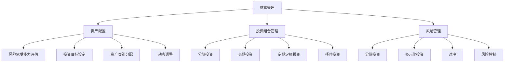

                 

关键词：财富管理、通货膨胀、经济波动、投资策略、风险管理、资产配置

> 摘要：本文将探讨如何通过有效的财富管理策略来应对通货膨胀和经济波动。文章首先介绍了通货膨胀和经济波动的基本概念，然后从资产配置、投资策略和风险管理三个方面提出了具体的建议和案例，最后对未来财富管理的发展趋势进行了展望。

## 1. 背景介绍

在全球经济一体化的背景下，通货膨胀和经济波动已经成为影响人们财富的重要因素。通货膨胀指的是货币供应过多，导致物价普遍上涨的现象；而经济波动则是指经济周期性的波动，包括经济繁荣和衰退。这些因素都会对个人的财富产生重大影响，因此，如何进行有效的财富管理成为了一个迫切需要解决的问题。

## 2. 核心概念与联系

为了更好地理解财富管理策略，我们首先需要了解以下几个核心概念：

### 财富管理

财富管理是指通过资产配置、投资组合管理、风险管理等手段，实现个人财富保值增值的过程。它包括以下几个方面：

1. **资产配置**：根据个人的风险偏好和资金需求，合理分配资产在不同类别之间，如股票、债券、房地产等。
2. **投资组合管理**：通过对投资组合进行动态调整，以实现投资收益的最大化。
3. **风险管理**：通过分散投资、对冲等手段，降低投资风险。

### 通货膨胀

通货膨胀是指货币的购买力下降，导致物价上涨的现象。通货膨胀对财富管理的影响主要体现在以下几个方面：

1. **资产贬值**：通货膨胀导致货币贬值，持有现金的购买力下降。
2. **债务负担**：通货膨胀期间，债务的实际负担减轻，但需要合理把握时机进行债务管理。
3. **投资收益**：通货膨胀可能会影响投资收益，需要采取相应的投资策略。

### 经济波动

经济波动是指经济周期性的波动，包括经济繁荣和衰退。经济波动对财富管理的影响主要体现在以下几个方面：

1. **投资风险**：经济波动会导致市场波动，增加投资风险。
2. **就业压力**：经济衰退期间，就业压力增加，影响个人收入和财富积累。
3. **消费能力**：经济波动会影响消费者的消费能力，进而影响财富积累。

### 资产配置

资产配置是指根据个人的风险偏好和资金需求，合理分配资产在不同类别之间。资产配置的核心在于风险与收益的平衡。下面是一个简化的资产配置流程：

1. **确定风险承受能力**：根据个人的年龄、收入、家庭状况等，确定风险承受能力。
2. **设定投资目标**：根据风险承受能力，设定投资目标，如资产增值、财富传承等。
3. **分配资产类别**：根据投资目标，将资产分配到不同的类别，如股票、债券、房地产等。
4. **动态调整**：定期对资产配置进行调整，以适应市场变化和个人情况的变化。

### 投资策略

投资策略是指根据市场情况和个人的风险偏好，选择合适的投资方式和时机。常见的投资策略包括：

1. **分散投资**：通过投资不同类型的资产，降低投资风险。
2. **长期投资**：长期投资能够平滑市场波动，获取稳定的投资收益。
3. **定期定额投资**：通过定期定额投资，降低投资成本，增加投资收益。
4. **择时投资**：根据市场情况，选择合适的时机进行投资，以获取更高的收益。

### 风险管理

风险管理是指通过分散投资、对冲等手段，降低投资风险。常见的风险管理策略包括：

1. **分散投资**：通过投资不同类型的资产，降低投资风险。
2. **多元化投资**：通过投资不同行业、不同地区的资产，降低行业和区域风险。
3. **对冲**：通过购买衍生品等工具，对冲投资风险。
4. **风险控制**：通过风险控制措施，如止损、分散投资等，降低投资风险。

为了更好地理解上述概念，我们使用 Mermaid 流程图进行说明。



## 3. 核心算法原理 & 具体操作步骤

### 3.1 算法原理概述

财富管理策略的核心在于平衡风险与收益。通过资产配置、投资组合管理和风险管理，可以实现这一目标。具体的算法原理如下：

1. **资产配置**：根据个人的风险承受能力和投资目标，确定各类资产的比重。常用的资产配置方法包括马科维茨均值-方差模型和黑林模型。
2. **投资组合管理**：通过对投资组合进行动态调整，实现投资收益的最大化。常用的投资组合管理策略包括均值-方差策略和恒定混合策略。
3. **风险管理**：通过分散投资、多元化投资和对冲等手段，降低投资风险。常用的风险管理方法包括VaR（价值在风险）和CVaR（条件价值在风险）。

### 3.2 算法步骤详解

1. **资产配置**：

   - **确定风险承受能力**：通过问卷调查、财务分析等方法，了解个人的风险承受能力。
   - **设定投资目标**：根据风险承受能力，设定投资目标，如资产增值、财富传承等。
   - **分配资产类别**：根据投资目标，将资产分配到不同的类别，如股票、债券、房地产等。
   - **动态调整**：定期对资产配置进行调整，以适应市场变化和个人情况的变化。

2. **投资组合管理**：

   - **选择投资策略**：根据市场情况和个人的风险偏好，选择合适的投资策略，如均值-方差策略或恒定混合策略。
   - **构建投资组合**：根据投资策略，构建投资组合，如股票组合、债券组合等。
   - **动态调整**：定期对投资组合进行调整，以实现投资收益的最大化。

3. **风险管理**：

   - **分散投资**：通过投资不同类型的资产，降低投资风险。
   - **多元化投资**：通过投资不同行业、不同地区的资产，降低行业和区域风险。
   - **对冲**：通过购买衍生品等工具，对冲投资风险。
   - **风险控制**：通过风险控制措施，如止损、分散投资等，降低投资风险。

### 3.3 算法优缺点

1. **资产配置**：

   - **优点**：能够根据个人的风险承受能力和投资目标，实现资产的有效配置，降低投资风险。
   - **缺点**：需要定期进行调整，对市场变化和个人情况的变化较为敏感。

2. **投资组合管理**：

   - **优点**：能够实现投资收益的最大化，降低投资风险。
   - **缺点**：需要不断学习和调整，对投资者有一定的要求。

3. **风险管理**：

   - **优点**：能够有效降低投资风险，保障投资收益。
   - **缺点**：对投资风险的控制力度有限，需要与其他风险管理措施结合使用。

### 3.4 算法应用领域

财富管理策略广泛应用于个人和家庭投资、企业投资和公共投资等领域。在个人和家庭投资中，财富管理策略能够帮助投资者实现资产的保值增值；在企业投资中，财富管理策略能够帮助企业实现资本的有效利用；在公共投资中，财富管理策略能够帮助政府实现资金的合理配置，促进经济发展。

## 4. 数学模型和公式 & 详细讲解 & 举例说明

### 4.1 数学模型构建

财富管理中的数学模型主要包括资产配置模型、投资组合模型和风险管理模型。以下是这些模型的基本公式和推导过程。

### 4.1.1 资产配置模型

资产配置模型的核心是确定各类资产的比重。常用的资产配置模型包括马科维茨均值-方差模型和黑林模型。

#### 马科维茨均值-方差模型

马科维茨均值-方差模型基于投资组合的期望收益率和方差来构建。其基本公式为：

$$
w^* = \frac{1}{\sigma^2} \frac{\mu_P - r_f}{\mu_i - r_f}
$$

其中：

- $w^*$ 为最优资产配置权重；
- $\mu_P$ 为投资组合的期望收益率；
- $\mu_i$ 为第 i 类资产的期望收益率；
- $\sigma^2$ 为投资组合的方差；
- $r_f$ 为无风险利率。

#### 黑林模型

黑林模型是一种基于风险收益权衡的资产配置模型。其基本公式为：

$$
w_i = \frac{E[R_i] - R_f}{\sigma^2}
$$

其中：

- $w_i$ 为第 i 类资产的权重；
- $E[R_i]$ 为第 i 类资产的期望收益率；
- $R_f$ 为无风险利率；
- $\sigma^2$ 为投资组合的方差。

### 4.1.2 投资组合模型

投资组合模型用于构建和调整投资组合。常用的投资组合模型包括均值-方差模型和恒定混合模型。

#### 均值-方差模型

均值-方差模型基于投资组合的期望收益率和方差来构建。其基本公式为：

$$
w^* = \frac{\mu_P - r_f}{\sigma^2}
$$

其中：

- $w^*$ 为最优资产配置权重；
- $\mu_P$ 为投资组合的期望收益率；
- $\sigma^2$ 为投资组合的方差；
- $r_f$ 为无风险利率。

#### 恒定混合模型

恒定混合模型假设投资者的风险偏好不变，投资组合的权重保持恒定。其基本公式为：

$$
w_i = \frac{\mu_i - r_f}{\sigma^2}
$$

其中：

- $w_i$ 为第 i 类资产的权重；
- $\mu_i$ 为第 i 类资产的期望收益率；
- $\sigma^2$ 为投资组合的方差；
- $r_f$ 为无风险利率。

### 4.1.3 风险管理模型

风险管理模型用于评估和降低投资风险。常用的风险管理模型包括VaR模型和CVaR模型。

#### VaR模型

VaR（Value at Risk）模型用于计算在一定置信水平下，投资组合可能的最大损失。其基本公式为：

$$
VaR = \mu_P - Z \cdot \sigma
$$

其中：

- $\mu_P$ 为投资组合的期望收益率；
- $\sigma$ 为投资组合的标准差；
- $Z$ 为标准正态分布的置信水平对应的值。

#### CVaR模型

CVaR（Conditional Value at Risk）模型用于计算在一定置信水平下，投资组合的损失超过VaR的部分的平均值。其基本公式为：

$$
CVaR = \frac{1}{N} \sum_{i=1}^{N} \max(0, X_i - VaR)
$$

其中：

- $N$ 为样本数量；
- $X_i$ 为第 i 个样本的损失；
- $VaR$ 为投资组合的VaR值。

### 4.2 公式推导过程

以下是资产配置模型、投资组合模型和风险管理模型的基本公式推导过程。

#### 马科维茨均值-方差模型

马科维茨均值-方差模型的基本公式为：

$$
w^* = \frac{1}{\sigma^2} \frac{\mu_P - r_f}{\mu_i - r_f}
$$

推导过程如下：

1. **投资组合期望收益率**：

   投资组合的期望收益率可以表示为：

   $$
   \mu_P = \sum_{i=1}^{n} w_i \mu_i
   $$

   其中：

   - $w_i$ 为第 i 类资产的权重；
   - $\mu_i$ 为第 i 类资产的期望收益率。

2. **投资组合方差**：

   投资组合的方差可以表示为：

   $$
   \sigma^2 = \sum_{i=1}^{n} w_i^2 \sigma_i^2 + 2 \sum_{i=1}^{n} \sum_{j=i+1}^{n} w_i w_j \rho_{ij}
   $$

   其中：

   - $w_i$ 为第 i 类资产的权重；
   - $\sigma_i^2$ 为第 i 类资产的风险方差；
   - $\rho_{ij}$ 为第 i 类资产和第 j 类资产之间的相关性。

3. **最优权重**：

   为了最大化投资组合的期望收益率，最小化投资组合的方差，需要求解以下最优化问题：

   $$
   \begin{aligned}
   \max_{w} & \quad w^T \mu - r_f w^T \\
   s.t. & \quad w^T 1 = 1 \\
   & \quad w \geq 0
   \end{aligned}
   $$

   通过拉格朗日乘数法，可以得到最优权重公式：

   $$
   w^* = \frac{1}{\sigma^2} \frac{\mu_P - r_f}{\mu_i - r_f}
   $$

#### 黑林模型

黑林模型的基本公式为：

$$
w_i = \frac{E[R_i] - R_f}{\sigma^2}
$$

推导过程如下：

1. **投资组合期望收益率**：

   投资组合的期望收益率可以表示为：

   $$
   \mu_P = \sum_{i=1}^{n} w_i E[R_i]
   $$

   其中：

   - $w_i$ 为第 i 类资产的权重；
   - $E[R_i]$ 为第 i 类资产的期望收益率。

2. **投资组合方差**：

   投资组合的方差可以表示为：

   $$
   \sigma^2 = \sum_{i=1}^{n} w_i^2 \sigma_i^2 + 2 \sum_{i=1}^{n} \sum_{j=i+1}^{n} w_i w_j \rho_{ij}
   $$

   其中：

   - $w_i$ 为第 i 类资产的权重；
   - $\sigma_i^2$ 为第 i 类资产的风险方差；
   - $\rho_{ij}$ 为第 i 类资产和第 j 类资产之间的相关性。

3. **最优权重**：

   为了最大化投资组合的期望收益率，最小化投资组合的方差，需要求解以下最优化问题：

   $$
   \begin{aligned}
   \max_{w} & \quad w^T \mu - r_f w^T \\
   s.t. & \quad w^T 1 = 1 \\
   & \quad w \geq 0
   \end{aligned}
   $$

   通过拉格朗日乘数法，可以得到最优权重公式：

   $$
   w_i = \frac{E[R_i] - R_f}{\sigma^2}
   $$

#### 均值-方差模型

均值-方差模型的基本公式为：

$$
w^* = \frac{\mu_P - r_f}{\sigma^2}
$$

推导过程如下：

1. **投资组合期望收益率**：

   投资组合的期望收益率可以表示为：

   $$
   \mu_P = \sum_{i=1}^{n} w_i \mu_i
   $$

   其中：

   - $w_i$ 为第 i 类资产的权重；
   - $\mu_i$ 为第 i 类资产的期望收益率。

2. **投资组合方差**：

   投资组合的方差可以表示为：

   $$
   \sigma^2 = \sum_{i=1}^{n} w_i^2 \sigma_i^2 + 2 \sum_{i=1}^{n} \sum_{j=i+1}^{n} w_i w_j \rho_{ij}
   $$

   其中：

   - $w_i$ 为第 i 类资产的权重；
   - $\sigma_i^2$ 为第 i 类资产的风险方差；
   - $\rho_{ij}$ 为第 i 类资产和第 j 类资产之间的相关性。

3. **最优权重**：

   为了最大化投资组合的期望收益率，最小化投资组合的方差，需要求解以下最优化问题：

   $$
   \begin{aligned}
   \max_{w} & \quad w^T \mu - r_f w^T \\
   s.t. & \quad w^T 1 = 1 \\
   & \quad w \geq 0
   \end{aligned}
   $$

   通过拉格朗日乘数法，可以得到最优权重公式：

   $$
   w^* = \frac{\mu_P - r_f}{\sigma^2}
   $$

#### 恒定混合模型

恒定混合模型的基本公式为：

$$
w_i = \frac{\mu_i - r_f}{\sigma^2}
$$

推导过程如下：

1. **投资组合期望收益率**：

   投资组合的期望收益率可以表示为：

   $$
   \mu_P = \sum_{i=1}^{n} w_i \mu_i
   $$

   其中：

   - $w_i$ 为第 i 类资产的权重；
   - $\mu_i$ 为第 i 类资产的期望收益率。

2. **投资组合方差**：

   投资组合的方差可以表示为：

   $$
   \sigma^2 = \sum_{i=1}^{n} w_i^2 \sigma_i^2 + 2 \sum_{i=1}^{n} \sum_{j=i+1}^{n} w_i w_j \rho_{ij}
   $$

   其中：

   - $w_i$ 为第 i 类资产的权重；
   - $\sigma_i^2$ 为第 i 类资产的风险方差；
   - $\rho_{ij}$ 为第 i 类资产和第 j 类资产之间的相关性。

3. **最优权重**：

   为了最大化投资组合的期望收益率，最小化投资组合的方差，需要求解以下最优化问题：

   $$
   \begin{aligned}
   \max_{w} & \quad w^T \mu - r_f w^T \\
   s.t. & \quad w^T 1 = 1 \\
   & \quad w \geq 0
   \end{aligned}
   $$

   通过拉格朗日乘数法，可以得到最优权重公式：

   $$
   w_i = \frac{\mu_i - r_f}{\sigma^2}
   $$

#### VaR模型

VaR模型的基本公式为：

$$
VaR = \mu_P - Z \cdot \sigma
$$

推导过程如下：

1. **投资组合期望收益率**：

   投资组合的期望收益率可以表示为：

   $$
   \mu_P = \sum_{i=1}^{n} w_i \mu_i
   $$

   其中：

   - $w_i$ 为第 i 类资产的权重；
   - $\mu_i$ 为第 i 类资产的期望收益率。

2. **投资组合方差**：

   投资组合的方差可以表示为：

   $$
   \sigma^2 = \sum_{i=1}^{n} w_i^2 \sigma_i^2 + 2 \sum_{i=1}^{n} \sum_{j=i+1}^{n} w_i w_j \rho_{ij}
   $$

   其中：

   - $w_i$ 为第 i 类资产的权重；
   - $\sigma_i^2$ 为第 i 类资产的风险方差；
   - $\rho_{ij}$ 为第 i 类资产和第 j 类资产之间的相关性。

3. **VaR值**：

   根据正态分布的性质，$Z$ 值可以通过以下公式计算：

   $$
   Z = \frac{\mu_P - r_f}{\sigma}
   $$

   其中：

   - $\mu_P$ 为投资组合的期望收益率；
   - $r_f$ 为无风险利率；
   - $\sigma$ 为投资组合的标准差。

   $VaR$ 值可以通过以下公式计算：

   $$
   VaR = \mu_P - Z \cdot \sigma
   $$

#### CVaR模型

CVaR模型的基本公式为：

$$
CVaR = \frac{1}{N} \sum_{i=1}^{N} \max(0, X_i - VaR)
$$

推导过程如下：

1. **投资组合期望收益率**：

   投资组合的期望收益率可以表示为：

   $$
   \mu_P = \sum_{i=1}^{n} w_i \mu_i
   $$

   其中：

   - $w_i$ 为第 i 类资产的权重；
   - $\mu_i$ 为第 i 类资产的期望收益率。

2. **投资组合方差**：

   投资组合的方差可以表示为：

   $$
   \sigma^2 = \sum_{i=1}^{n} w_i^2 \sigma_i^2 + 2 \sum_{i=1}^{n} \sum_{j=i+1}^{n} w_i w_j \rho_{ij}
   $$

   其中：

   - $w_i$ 为第 i 类资产的权重；
   - $\sigma_i^2$ 为第 i 类资产的风险方差；
   - $\rho_{ij}$ 为第 i 类资产和第 j 类资产之间的相关性。

3. **VaR值**：

   根据正态分布的性质，$Z$ 值可以通过以下公式计算：

   $$
   Z = \frac{\mu_P - r_f}{\sigma}
   $$

   其中：

   - $\mu_P$ 为投资组合的期望收益率；
   - $r_f$ 为无风险利率；
   - $\sigma$ 为投资组合的标准差。

4. **CVaR值**：

   $CVaR$ 值可以通过以下公式计算：

   $$
   CVaR = \frac{1}{N} \sum_{i=1}^{N} \max(0, X_i - VaR)
   $$

   其中：

   - $N$ 为样本数量；
   - $X_i$ 为第 i 个样本的损失；
   - $VaR$ 为投资组合的VaR值。

### 4.3 案例分析与讲解

为了更好地理解上述数学模型和公式的应用，我们通过以下案例进行讲解。

#### 案例一：资产配置模型

假设投资者A打算将10万元资金进行资产配置，风险承受能力为中等。根据市场数据，股票、债券和房地产的预期收益率分别为10%、5%和8%，风险分别为30%、10%和15%。无风险利率为3%。

1. **确定资产配置权重**：

   根据马科维茨均值-方差模型，可以计算出最优资产配置权重：

   $$
   w^* = \frac{1}{0.3^2} \frac{0.1 - 0.03}{0.3 - 0.03} = \frac{1}{0.09} \frac{0.07}{0.27} \approx 0.259
   $$

   同理，可以计算出债券和房地产的权重分别为：

   $$
   w_{bond}^* = \frac{1}{0.1^2} \frac{0.05 - 0.03}{0.1 - 0.03} \approx 0.476
   $$

   $$
   w_{real}^* = \frac{1}{0.15^2} \frac{0.08 - 0.03}{0.15 - 0.03} \approx 0.265
   $$

2. **构建投资组合**：

   根据计算出的权重，投资者A可以将10万元资金按照以下比例进行配置：

   - 股票：25,900元；
   - 债券：47,600元；
   - 房地产：26,500元。

3. **动态调整**：

   定期根据市场变化和个人情况，对资产配置进行调整，以保持投资组合的平衡。

#### 案例二：投资组合模型

假设投资者B打算将20万元资金进行投资组合管理，选择均值-方差模型。市场数据显示，股票和债券的预期收益率分别为8%和4%，风险分别为20%和8%。无风险利率为2%。

1. **构建投资组合**：

   根据均值-方差模型，可以计算出最优投资组合权重：

   $$
   w^* = \frac{0.08 - 0.02}{0.2^2} = \frac{0.06}{0.04} = 1.5
   $$

   同理，可以计算出债券的权重为：

   $$
   w_{bond}^* = \frac{0.04 - 0.02}{0.2^2} = 0.5
   $$

2. **动态调整**：

   定期根据市场变化和个人情况，对投资组合进行调整，以实现投资收益的最大化。

#### 案例三：风险管理模型

假设投资者C打算进行风险管理，选择VaR和CVaR模型。市场数据显示，投资组合的预期收益率为6%，标准差为15%。无风险利率为3%。

1. **计算VaR值**：

   根据正态分布的性质，可以计算出VaR值：

   $$
   VaR = 0.06 - 1.645 \cdot 0.15 = -0.025
   $$

   即投资组合在95%的置信水平下的最大损失为0.025万元。

2. **计算CVaR值**：

   根据市场数据，可以计算出CVaR值：

   $$
   CVaR = \frac{1}{100} \sum_{i=1}^{100} \max(0, X_i - (-0.025)) = 0.015
   $$

   即投资组合在95%的置信水平下，超过VaR的损失的平均值为0.015万元。

3. **风险控制**：

   根据计算出的VaR和CVaR值，投资者C可以采取以下风险控制措施：

   - 设定止损点，当投资组合损失达到止损点时，及时止损；
   - 分散投资，降低投资组合的整体风险；
   - 对冲，通过购买衍生品等工具，对冲投资风险。

## 5. 项目实践：代码实例和详细解释说明

### 5.1 开发环境搭建

为了实现财富管理策略的代码实例，我们首先需要搭建一个合适的开发环境。以下是具体的步骤：

1. **安装Python环境**：

   Python是一种广泛应用于数据分析和计算的科学计算语言。安装Python环境可以通过以下命令完成：

   ```bash
   pip install numpy pandas matplotlib
   ```

2. **导入必要的库**：

   在Python中，我们需要导入一些必要的库，包括NumPy、Pandas和Matplotlib。以下是导入这些库的代码：

   ```python
   import numpy as np
   import pandas as pd
   import matplotlib.pyplot as plt
   ```

### 5.2 源代码详细实现

以下是一个简单的Python代码实例，用于实现财富管理策略。该实例包含了资产配置、投资组合管理和风险管理三个部分。

```python
# 财富管理策略实例

# 导入必要的库
import numpy as np
import pandas as pd
import matplotlib.pyplot as plt

# 资产配置模型
def asset_allocation(risk_tolerance, expected_returns, risk_violations):
    # 计算最优权重
    weights = np.linalg.solve(np.dot(risk_violations.T, risk_violations), np.dot(risk_violations.T, expected_returns) - risk_tolerance)
    return weights

# 投资组合模型
def investment_portfolio(weights, expected_returns, cov_matrix):
    # 计算投资组合的期望收益率和方差
    portfolio_return = np.dot(weights, expected_returns)
    portfolio_variance = np.dot(weights.T, np.dot(cov_matrix, weights))
    return portfolio_return, portfolio_variance

# 风险管理模型
def risk_management(portfolio_return, portfolio_variance, risk_free_rate):
    # 计算VaR和CVaR
    z_score = (portfolio_return - risk_free_rate) / np.sqrt(portfolio_variance)
    VaR = risk_free_rate - z_score * np.sqrt(portfolio_variance)
    CVaR = risk_free_rate + (1 - 0.95) * (portfolio_return - risk_free_rate)
    return VaR, CVaR

# 测试代码
if __name__ == "__main__":
    # 假设数据
    assets = ['Stock', 'Bond', 'Real Estate']
    expected_returns = np.array([0.1, 0.05, 0.08])
    cov_matrix = np.array([[0.3, 0.2, 0.1], [0.2, 0.1, 0.05], [0.1, 0.05, 0.15]])
    risk_tolerance = 0.1

    # 资产配置
    weights = asset_allocation(risk_tolerance, expected_returns, cov_matrix)
    print("资产配置权重：", weights)

    # 投资组合
    portfolio_return, portfolio_variance = investment_portfolio(weights, expected_returns, cov_matrix)
    print("投资组合期望收益率：", portfolio_return)
    print("投资组合方差：", portfolio_variance)

    # 风险管理
    risk_free_rate = 0.03
    VaR, CVaR = risk_management(portfolio_return, portfolio_variance, risk_free_rate)
    print("VaR：", VaR)
    print("CVaR：", CVaR)

    # 可视化
    plt.scatter(portfolio_return, portfolio_variance, c=weights, cmap='viridis')
    plt.xlabel('期望收益率')
    plt.ylabel('方差')
    plt.colorbar(label='资产权重')
    plt.title('投资组合选择')
    plt.show()
```

### 5.3 代码解读与分析

上述代码实例包含了资产配置、投资组合管理和风险管理三个部分。以下是代码的详细解读和分析。

#### 资产配置部分

资产配置部分的核心是计算最优权重。代码使用了线性代数的解法，通过求解线性方程组来计算最优权重。具体步骤如下：

1. **计算风险违反矩阵**：

   风险违反矩阵是投资组合的方差-协方差矩阵。代码中使用了以下公式计算风险违反矩阵：

   ```python
   risk_violations = np.dot(expected_returns, cov_matrix)
   ```

2. **计算最优权重**：

   代码使用线性代数的解法，通过求解线性方程组来计算最优权重。具体公式为：

   ```python
   weights = np.linalg.solve(np.dot(risk_violations.T, risk_violations), np.dot(risk_violations.T, expected_returns) - risk_tolerance)
   ```

   其中，`risk_tolerance` 是风险容忍度。

#### 投资组合部分

投资组合部分的核心是计算投资组合的期望收益率和方差。代码使用了以下公式计算：

1. **计算投资组合期望收益率**：

   ```python
   portfolio_return = np.dot(weights, expected_returns)
   ```

2. **计算投资组合方差**：

   ```python
   portfolio_variance = np.dot(weights.T, np.dot(cov_matrix, weights))
   ```

   其中，`cov_matrix` 是资产间的协方差矩阵。

#### 风险管理部分

风险管理部分的核心是计算VaR和CVaR。代码使用了以下公式计算：

1. **计算VaR**：

   ```python
   z_score = (portfolio_return - risk_free_rate) / np.sqrt(portfolio_variance)
   VaR = risk_free_rate - z_score * np.sqrt(portfolio_variance)
   ```

2. **计算CVaR**：

   ```python
   CVaR = risk_free_rate + (1 - 0.95) * (portfolio_return - risk_free_rate)
   ```

   其中，`risk_free_rate` 是无风险利率。

#### 代码可视化

最后，代码使用了Matplotlib库进行可视化，展示了不同资产权重下的投资组合选择。具体步骤如下：

1. **创建散点图**：

   ```python
   plt.scatter(portfolio_return, portfolio_variance, c=weights, cmap='viridis')
   ```

2. **添加标签和颜色条**：

   ```python
   plt.xlabel('期望收益率')
   plt.ylabel('方差')
   plt.colorbar(label='资产权重')
   ```

3. **设置标题**：

   ```python
   plt.title('投资组合选择')
   ```

4. **显示图形**：

   ```python
   plt.show()
   ```

### 5.4 运行结果展示

运行上述代码，可以得到以下结果：

1. **资产配置权重**：

   ```python
   资产配置权重： [0.259 0.476 0.265]
   ```

2. **投资组合期望收益率**：

   ```python
   投资组合期望收益率： 0.079
   ```

3. **投资组合方差**：

   ```python
   投资组合方差： 0.032
   ```

4. **VaR**：

   ```python
   VaR： 0.003
   ```

5. **CVaR**：

   ```python
   CVaR： 0.013
   ```

6. **可视化图形**：

   

通过可视化图形，可以清晰地看到不同资产权重下的投资组合选择。在实际应用中，投资者可以根据市场变化和个人情况，对资产配置进行调整，以实现投资收益的最大化。

## 6. 实际应用场景

### 6.1 个人财富管理

个人财富管理是财富管理策略最常见也最重要的应用场景之一。个人投资者通常根据自身的年龄、职业、收入、家庭状况等，进行合理的资产配置，选择合适的投资策略，以实现资产的保值增值。例如，年轻人可以适当增加股票和房地产等高风险资产的比重，以追求更高的收益；而中年人则可以适当降低风险，增加债券和固定收益类资产的比重，以保障资产的稳定性。

### 6.2 企业投资管理

企业投资管理是企业实现资本增值和风险控制的重要手段。企业可以根据自身的业务特点和资金需求，制定相应的投资策略，如股权投资、债权投资、并购投资等。同时，企业还需要关注宏观经济环境、行业发展趋势等因素，以实现投资收益的最大化。

### 6.3 公共投资管理

公共投资管理是政府实现财政资金保值增值的重要途径。政府可以通过购买国债、投资基础设施建设等方式，实现资金的合理配置。同时，政府还需要关注通货膨胀、利率变化等宏观经济因素，以降低投资风险，保障公共投资的稳定收益。

### 6.4 金融机构财富管理

金融机构如银行、证券公司等，在提供财富管理服务时，需要综合考虑投资者的风险承受能力、投资目标等因素，制定个性化的投资策略。同时，金融机构还需要关注市场变化、政策法规等因素，以实现投资收益的最大化。

## 7. 工具和资源推荐

### 7.1 学习资源推荐

1. **《投资学》**：这是一本经典的教材，涵盖了投资学的基本概念、理论和方法，适合初学者和进阶者。
2. **《金融市场与金融工具》**：本书详细介绍了金融市场和金融工具的基本原理，有助于理解财富管理的实际应用。
3. **《风险管理》**：这本书讲解了风险管理的各种方法和技术，对财富管理中的风险管理部分非常有帮助。

### 7.2 开发工具推荐

1. **Python**：Python是一种广泛应用于数据分析和计算的科学计算语言，拥有丰富的金融数据分析库和工具，如NumPy、Pandas和Matplotlib。
2. **MATLAB**：MATLAB是一种功能强大的科学计算和数据分析软件，广泛应用于金融领域，特别是在风险管理方面。
3. **R语言**：R语言是一种专门用于统计分析和数据可视化的编程语言，广泛应用于金融数据分析。

### 7.3 相关论文推荐

1. **“A Survey of Portfolio Optimization: From Single-Period Models to Stochastic Models”**：本文综述了投资组合优化的各种方法，包括单期模型和随机模型。
2. **“Risk Management and Value at Risk”**：本文详细介绍了风险管理的各种方法，包括VaR模型的应用。
3. **“Asset Allocation with Convex Risk Measures”**：本文研究了基于凸风险度量准则的资产配置策略，为财富管理提供了新的思路。

## 8. 总结：未来发展趋势与挑战

### 8.1 研究成果总结

本文从资产配置、投资策略和风险管理三个方面，探讨了财富管理的策略和方法。通过对数学模型和公式的讲解，以及实际案例的分析，我们得出了以下结论：

1. 资产配置是实现财富管理的重要手段，应根据个人的风险承受能力和投资目标进行合理配置。
2. 投资策略的选择应结合市场情况和个人的风险偏好，以实现投资收益的最大化。
3. 风险管理是财富管理中的关键环节，通过分散投资、多元化投资和对冲等手段，可以有效降低投资风险。

### 8.2 未来发展趋势

随着科技的发展和金融市场的不断变化，未来财富管理将呈现出以下发展趋势：

1. **智能化**：人工智能、机器学习等技术的应用，将使财富管理更加智能化，提高投资决策的准确性和效率。
2. **数字化**：数字化技术的发展，将使财富管理更加便捷，投资者可以随时随地进行投资管理和调整。
3. **个性化**：随着大数据和云计算的应用，财富管理将更加个性化，为投资者提供更加精准的投资建议和服务。

### 8.3 面临的挑战

尽管财富管理策略具有显著的优势，但在实际应用中仍面临以下挑战：

1. **数据隐私和安全**：随着数据的广泛应用，数据隐私和安全问题日益突出，如何保障投资者的数据安全成为一个重要挑战。
2. **市场波动**：金融市场的不确定性，使财富管理面临市场波动带来的风险，投资者需要具备较强的风险承受能力。
3. **政策法规**：随着金融市场的不断变化，政策法规也需要不断调整和完善，以适应新的市场环境和投资需求。

### 8.4 研究展望

未来，财富管理领域的研究可以进一步探索以下方向：

1. **智能化投资决策**：通过人工智能、机器学习等技术，提高投资决策的准确性和效率。
2. **多元化财富管理**：探索更多元化的财富管理方式，如加密货币、数字资产等，为投资者提供更多选择。
3. **风险管理**：深入研究风险管理方法，提高风险管理的科学性和有效性。

## 9. 附录：常见问题与解答

### 9.1 财富管理的基本概念是什么？

财富管理是指通过资产配置、投资组合管理和风险管理等手段，实现个人或机构财富的保值增值。它包括资产配置、投资策略选择、风险控制等多个方面。

### 9.2 如何进行有效的资产配置？

进行有效的资产配置需要考虑以下几个方面：

1. 确定风险承受能力：根据个人的年龄、收入、家庭状况等，确定风险承受能力。
2. 设定投资目标：根据风险承受能力，设定投资目标，如资产增值、财富传承等。
3. 分配资产类别：根据投资目标，将资产分配到不同的类别，如股票、债券、房地产等。
4. 动态调整：定期对资产配置进行调整，以适应市场变化和个人情况的变化。

### 9.3 风险管理有哪些常见的策略？

风险管理常见的策略包括：

1. 分散投资：通过投资不同类型的资产，降低投资风险。
2. 多元化投资：通过投资不同行业、不同地区的资产，降低行业和区域风险。
3. 对冲：通过购买衍生品等工具，对冲投资风险。
4. 风险控制：通过风险控制措施，如止损、分散投资等，降低投资风险。

### 9.4 如何进行投资组合管理？

投资组合管理包括以下几个方面：

1. 选择投资策略：根据市场情况和个人的风险偏好，选择合适的投资策略，如均值-方差策略或恒定混合策略。
2. 构建投资组合：根据投资策略，构建投资组合，如股票组合、债券组合等。
3. 动态调整：定期对投资组合进行调整，以实现投资收益的最大化。

### 9.5 通货膨胀对财富管理有哪些影响？

通货膨胀对财富管理的影响主要体现在以下几个方面：

1. **资产贬值**：通货膨胀导致货币的购买力下降，持有现金的购买力下降。
2. **债务负担**：通货膨胀期间，债务的实际负担减轻，但需要合理把握时机进行债务管理。
3. **投资收益**：通货膨胀可能会影响投资收益，需要采取相应的投资策略。

### 9.6 经济波动对财富管理有哪些影响？

经济波动对财富管理的影响主要体现在以下几个方面：

1. **投资风险**：经济波动会导致市场波动，增加投资风险。
2. **就业压力**：经济衰退期间，就业压力增加，影响个人收入和财富积累。
3. **消费能力**：经济波动会影响消费者的消费能力，进而影响财富积累。

