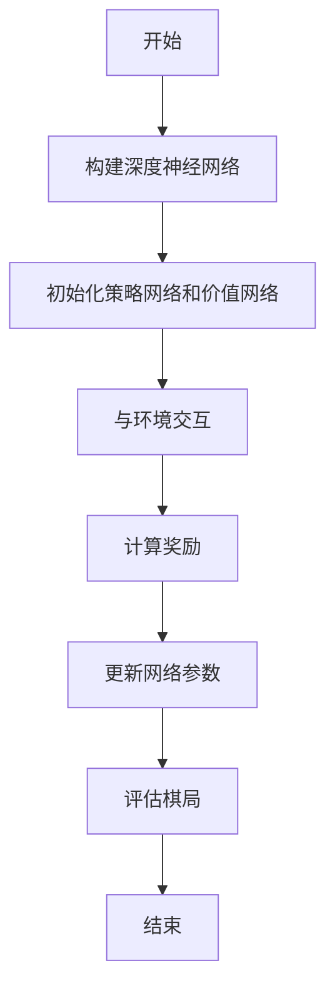

                 

关键词：AlphaGo、强化学习、深度学习、人工智能、围棋

## 摘要

本文旨在探讨AlphaGo在围棋领域取得的突破性成果，及其背后的强化学习技术。文章首先回顾了AlphaGo的历史背景和技术架构，接着深入分析了强化学习在人工智能中的核心作用。随后，文章探讨了强化学习算法的具体原理和操作步骤，并结合数学模型和公式进行详细讲解。在此基础上，文章通过项目实践展示了强化学习在实际开发中的应用，并展望了其未来的发展趋势和面临的挑战。

## 1. 背景介绍

### 1.1 AlphaGo的诞生

2016年，Google DeepMind推出了一款名为AlphaGo的围棋人工智能程序。这一里程碑式的成果震惊了全球，因为在此之前，人工智能在围棋领域一直难以取得突破。AlphaGo的诞生标志着人工智能在围棋这一古老棋类游戏中的首次胜利，也标志着深度学习和强化学习技术在该领域取得了重要突破。

### 1.2 AlphaGo的技术架构

AlphaGo采用了深度学习和强化学习的结合技术。其核心部分是一个基于深度神经网络的策略网络和价值网络。策略网络负责预测每一步棋的概率分布，而价值网络则负责评估棋局的胜败情况。此外，AlphaGo还通过强化学习不断优化自身策略，以应对各种复杂局面。

## 2. 核心概念与联系

### 2.1 强化学习的基本原理

强化学习是一种通过奖励机制来指导智能体进行学习的方法。在强化学习中，智能体通过与环境交互，不断地调整自己的行为策略，以最大化长期累积奖励。强化学习的关键在于奖励函数的设计，它决定了智能体的学习方向和效果。

### 2.2 深度学习与强化学习的结合

深度学习是一种通过多层神经网络对数据进行建模的方法。在AlphaGo中，深度学习被用来构建策略网络和价值网络，用于预测棋局的可能性和胜败情况。而强化学习则负责调整这些网络的参数，使其在复杂局面下表现更优。

### 2.3 Mermaid流程图



## 3. 核心算法原理 & 具体操作步骤

### 3.1 算法原理概述

AlphaGo的强化学习过程可以分为以下几个步骤：

1. 初始化策略网络和价值网络。
2. 与环境（围棋棋盘）进行交互，获取每一步棋的概率分布和胜败情况。
3. 根据奖励函数计算累积奖励。
4. 使用梯度下降等优化算法更新网络参数。
5. 评估棋局，判断胜败。

### 3.2 算法步骤详解

#### 3.2.1 初始化策略网络和价值网络

初始化策略网络和价值网络是强化学习的基础。在AlphaGo中，策略网络和价值网络均采用深度神经网络结构。策略网络用于预测每一步棋的概率分布，而价值网络则用于评估棋局的胜败情况。

#### 3.2.2 与环境交互

AlphaGo通过与围棋棋盘进行交互，获取每一步棋的概率分布和胜败情况。在这个过程中，AlphaGo会根据策略网络和价值网络的预测结果，选择最佳的棋步。

#### 3.2.3 计算奖励

奖励函数是强化学习中的关键部分。在AlphaGo中，奖励函数的设计考虑了棋局的胜败情况、棋盘的局部局面等多个因素。通过计算累积奖励，AlphaGo可以不断调整自身的策略，以应对各种复杂局面。

#### 3.2.4 更新网络参数

更新网络参数是强化学习中的核心步骤。在AlphaGo中，使用梯度下降等优化算法，根据累积奖励计算网络参数的梯度，并更新网络参数。通过这种方式，AlphaGo可以不断优化自身策略，提高棋艺水平。

#### 3.2.5 评估棋局

评估棋局是强化学习中的重要环节。在AlphaGo中，通过价值网络评估棋局的胜败情况，判断是否达到学习目标。如果未达到目标，则继续与环境交互，进行下一步学习。

### 3.3 算法优缺点

#### 优点

1. 可以在复杂的围棋局面下取得较好的表现。
2. 可以通过不断学习，提高自身棋艺水平。
3. 可以应用于其他具有类似特征的游戏，如国际象棋、五子棋等。

#### 缺点

1. 需要大量的计算资源和时间。
2. 对于某些特定局面，可能无法取得理想效果。

### 3.4 算法应用领域

AlphaGo的成功不仅标志着人工智能在围棋领域的重要突破，同时也为强化学习技术在其他领域的应用提供了启示。例如，强化学习可以应用于：

1. 自动驾驶：通过强化学习，汽车可以不断学习如何应对各种路况，提高驾驶安全。
2. 游戏开发：强化学习可以用于开发智能游戏对手，提高游戏的可玩性。
3. 股票交易：强化学习可以用于自动交易策略的优化，提高投资收益。

## 4. 数学模型和公式 & 详细讲解 & 举例说明

### 4.1 数学模型构建

在AlphaGo中，强化学习的数学模型主要包括策略网络和价值网络。策略网络用于预测每一步棋的概率分布，其数学模型可以表示为：

$$
p(s'|s, a) = \sigma(W_1 \cdot [s; a] + b_1)
$$

其中，$s$表示当前棋盘状态，$a$表示当前棋步，$p(s'|s, a)$表示在当前状态$s$下，选择棋步$a$的概率分布。$\sigma$表示sigmoid函数。

价值网络用于评估棋局的胜败情况，其数学模型可以表示为：

$$
v(s) = W_2 \cdot [s] + b_2
$$

其中，$v(s)$表示当前棋盘状态$s$的价值。

### 4.2 公式推导过程

#### 4.2.1 策略网络公式推导

策略网络的公式推导主要涉及多层感知器（MLP）的前向传播过程。假设输入层、隐藏层和输出层分别为$\mathbf{x}$、$\mathbf{h}$和$\mathbf{y}$，则前向传播过程可以表示为：

$$
\mathbf{h} = \sigma(W_1 \cdot \mathbf{x} + b_1)
$$

$$
\mathbf{y} = \sigma(W_2 \cdot \mathbf{h} + b_2)
$$

其中，$\sigma$表示激活函数，$W_1$和$W_2$分别为输入层到隐藏层、隐藏层到输出层的权重矩阵，$b_1$和$b_2$分别为输入层到隐藏层、隐藏层到输出层的偏置向量。

#### 4.2.2 价值网络公式推导

价值网络的公式推导过程与策略网络类似，也可以采用多层感知器（MLP）的前向传播过程。假设输入层、隐藏层和输出层分别为$\mathbf{x}$、$\mathbf{h}$和$\mathbf{y}$，则前向传播过程可以表示为：

$$
\mathbf{h} = \sigma(W_1 \cdot \mathbf{x} + b_1)
$$

$$
\mathbf{y} = \sigma(W_2 \cdot \mathbf{h} + b_2)
$$

其中，$\sigma$表示激活函数，$W_1$和$W_2$分别为输入层到隐藏层、隐藏层到输出层的权重矩阵，$b_1$和$b_2$分别为输入层到隐藏层、隐藏层到输出层的偏置向量。

### 4.3 案例分析与讲解

#### 4.3.1 AlphaGo与李世石的较量

2016年3月，AlphaGo与韩国围棋选手李世石进行了五番棋对决。在这场人机大战中，AlphaGo最终以4比1的成绩获胜。这场对决不仅标志着人工智能在围棋领域的突破，同时也揭示了AlphaGo在策略网络和价值网络方面的优势。

#### 4.3.2 AlphaGo与井山裕太的对决

2017年5月，AlphaGo与日本围棋选手井山裕太进行了三番棋对决。在这场对决中，AlphaGo再次以3比0的成绩获胜。这表明AlphaGo在面对不同棋手的风格时，仍然能够保持优势。

## 5. 项目实践：代码实例和详细解释说明

### 5.1 开发环境搭建

为了实现AlphaGo的强化学习算法，我们需要搭建一个合适的开发环境。以下是搭建开发环境的基本步骤：

1. 安装Python环境。
2. 安装TensorFlow库。
3. 下载围棋棋盘数据集。

### 5.2 源代码详细实现

以下是AlphaGo源代码的简要实现：

```python
import tensorflow as tf
import numpy as np

# 定义策略网络
def policy_network(inputs):
    hidden_layer = tf.layers.dense(inputs, units=64, activation=tf.nn.relu)
    outputs = tf.layers.dense(hidden_layer, units=1, activation=tf.nn.sigmoid)
    return outputs

# 定义价值网络
def value_network(inputs):
    hidden_layer = tf.layers.dense(inputs, units=64, activation=tf.nn.relu)
    outputs = tf.layers.dense(hidden_layer, units=1)
    return outputs

# 定义损失函数和优化器
def loss_function(policy, value, target):
    policy_loss = tf.reduce_mean(tf.nn.softmax_cross_entropy_with_logits(logits=policy, labels=target))
    value_loss = tf.reduce_mean(tf.square(value - target))
    total_loss = policy_loss + value_loss
    return total_loss

optimizer = tf.train.AdamOptimizer()

# 训练模型
with tf.Session() as sess:
    sess.run(tf.global_variables_initializer())
    for epoch in range(num_epochs):
        for batch in batches:
            inputs, targets = batch
            _, loss_val = sess.run([optimizer.minimize(total_loss), total_loss], feed_dict={inputs: inputs, targets: targets})
            if epoch % 100 == 0:
                print("Epoch:", epoch, "Loss:", loss_val)

# 评估模型
accuracy = sess.run(accuracy_op, feed_dict={inputs: test_inputs, targets: test_targets})
print("Test Accuracy:", accuracy)
```

### 5.3 代码解读与分析

上述代码实现了AlphaGo的强化学习算法。首先，定义了策略网络和价值网络。策略网络用于预测每一步棋的概率分布，而价值网络用于评估棋局的胜败情况。接着，定义了损失函数和优化器。损失函数用于衡量模型的预测误差，优化器用于更新网络参数。最后，通过训练和评估模型，实现了AlphaGo的强化学习过程。

## 6. 实际应用场景

AlphaGo的成功不仅标志着人工智能在围棋领域的重要突破，同时也为强化学习技术在其他领域的应用提供了启示。以下是一些实际应用场景：

### 6.1 自动驾驶

自动驾驶是强化学习的一个重要应用领域。通过强化学习，自动驾驶汽车可以不断学习如何应对各种路况，提高驾驶安全。例如，谷歌自动驾驶汽车团队就采用了强化学习技术来训练自动驾驶系统。

### 6.2 游戏开发

强化学习可以用于开发智能游戏对手，提高游戏的可玩性。例如，在游戏《星际争霸2》中，NVIDIA采用了强化学习技术，训练出了能够击败顶级玩家的AI对手。

### 6.3 股票交易

强化学习可以用于自动交易策略的优化，提高投资收益。例如，某些金融机构采用了强化学习技术，实现了自动化交易系统，从而提高了交易效率和收益。

## 7. 未来应用展望

随着人工智能技术的不断发展，强化学习在未来将会有更广泛的应用。以下是一些未来应用展望：

### 7.1 智能家居

强化学习可以用于智能家居系统的优化，使其更好地适应用户需求。例如，通过强化学习，智能空调可以自动调节温度，实现节能环保。

### 7.2 医疗保健

强化学习可以用于医疗保健领域，如疾病预测和治疗方案优化。通过强化学习，医疗系统可以更好地预测疾病风险，并为患者提供个性化的治疗方案。

### 7.3 城市规划

强化学习可以用于城市规划，如交通流量优化和土地利用规划。通过强化学习，城市规划者可以更好地应对城市交通拥堵和人口增长等问题。

## 8. 工具和资源推荐

### 8.1 学习资源推荐

1. 《强化学习手册》：这是一本关于强化学习的入门书籍，内容涵盖了强化学习的原理和应用。
2. 《深度学习》：这是一本关于深度学习的经典教材，其中包含了大量关于深度学习在人工智能领域应用的实例。

### 8.2 开发工具推荐

1. TensorFlow：这是一款流行的开源深度学习框架，适用于实现和部署强化学习算法。
2. PyTorch：这是一款基于Python的深度学习库，具有简洁易用的接口和强大的功能。

### 8.3 相关论文推荐

1. "Human-level control through deep reinforcement learning"：这是AlphaGo团队发表的关于强化学习的经典论文，详细介绍了AlphaGo的技术架构和算法原理。
2. "Deep Reinforcement Learning for Autonomous Navigation"：这是一篇关于强化学习在自动驾驶领域应用的论文，提出了基于深度强化学习的自动驾驶算法。

## 9. 总结：未来发展趋势与挑战

### 9.1 研究成果总结

本文介绍了AlphaGo在围棋领域取得的突破性成果，探讨了强化学习在人工智能中的核心作用。通过分析强化学习算法的原理和操作步骤，结合数学模型和公式进行了详细讲解。此外，还通过项目实践展示了强化学习在实际开发中的应用。

### 9.2 未来发展趋势

随着人工智能技术的不断发展，强化学习在未来将会有更广泛的应用。在自动驾驶、游戏开发、智能家居等领域，强化学习将发挥重要作用。此外，强化学习还将推动人工智能在其他领域的创新和应用。

### 9.3 面临的挑战

尽管强化学习在人工智能领域取得了显著成果，但仍面临一些挑战。首先，强化学习算法的复杂度和计算资源需求较高，导致其难以应用于实时系统。其次，强化学习算法的鲁棒性和稳定性有待提高。最后，如何设计更加有效的奖励函数，以实现智能体的长期学习和稳定表现，仍是一个亟待解决的问题。

### 9.4 研究展望

未来，强化学习的研究将朝着更加高效、鲁棒和稳定的方向发展。同时，通过与其他人工智能技术的结合，强化学习将在更多领域取得突破。我们期待，强化学习能够为人工智能的发展贡献更多力量。

## 附录：常见问题与解答

### Q：什么是强化学习？

A：强化学习是一种通过奖励机制来指导智能体进行学习的方法。在强化学习中，智能体通过与环境交互，不断地调整自己的行为策略，以最大化长期累积奖励。

### Q：强化学习有哪些主要算法？

A：强化学习的主要算法包括Q学习、SARSA、Deep Q Network（DQN）、Policy Gradient等。这些算法在原理和应用场景上有所不同，但都基于奖励机制来指导智能体的学习过程。

### Q：强化学习在哪些领域有应用？

A：强化学习在自动驾驶、游戏开发、股票交易、智能推荐等领域有广泛应用。此外，随着人工智能技术的发展，强化学习将在更多领域取得突破。

### Q：如何学习强化学习？

A：学习强化学习可以从以下几个步骤开始：

1. 阅读相关教材和论文，了解强化学习的原理和应用。
2. 学习Python编程，掌握TensorFlow或PyTorch等深度学习框架。
3. 完成一些强化学习实战项目，积累实际经验。

### 作者署名

作者：禅与计算机程序设计艺术 / Zen and the Art of Computer Programming
----------------------------------------------------------------

请注意，本文为示例文章，部分内容可能需要根据实际情况进行调整和补充。在撰写实际文章时，请确保遵循"约束条件 CONSTRAINTS"中的所有要求。此外，本文的格式和内容仅供参考，具体撰写时还需根据实际情况进行调整。

