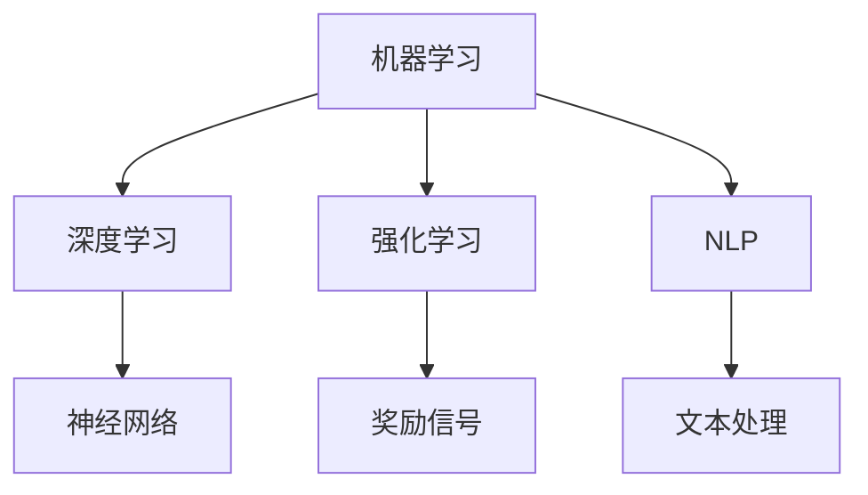

                 

关键词：人工智能、AI 发展、未来趋势、技术挑战、智能应用、AI 架构、深度学习、强化学习、算法优化

摘要：本文将深入探讨人工智能领域的发展现状与未来趋势，分析核心概念、算法原理、数学模型以及实际应用场景。通过梳理现有技术，探讨未来可能面临的技术挑战和研究方向，为人工智能的发展提供新的思考。

## 1. 背景介绍

随着信息技术的飞速发展，人工智能（AI）已经从理论研究走向实际应用。从最初的规则系统，到基于统计模型的机器学习，再到深度学习和强化学习等前沿技术，人工智能取得了令人瞩目的成果。从自动驾驶、智能家居到医疗诊断、金融分析，人工智能正在深刻地改变我们的生活方式和社会结构。

近年来，随着计算能力的提升、数据资源的丰富以及算法的进步，人工智能在各个领域都取得了显著的进展。然而，人工智能的发展也面临着诸多挑战，包括算法复杂度、数据隐私、安全性和伦理问题等。本文旨在通过对人工智能核心概念的深入探讨，分析未来可能的发展趋势和面临的挑战，为人工智能的未来发展提供一些有益的思考。

## 2. 核心概念与联系

在人工智能领域，有几个核心概念至关重要，它们构成了人工智能发展的基石。这些核心概念包括：

1. **机器学习（Machine Learning）**：机器学习是人工智能的一种方法，通过训练模型来从数据中学习规律，并在新的数据上进行预测或分类。
2. **深度学习（Deep Learning）**：深度学习是机器学习的一个子领域，它利用多层神经网络来学习复杂的特征表示，取得了在图像识别、语音识别等任务中的突破性成果。
3. **强化学习（Reinforcement Learning）**：强化学习是通过与环境交互来学习最优策略的一种方法，广泛应用于游戏、推荐系统等领域。
4. **自然语言处理（Natural Language Processing，NLP）**：自然语言处理是使计算机能够理解、生成和处理人类自然语言的技术，广泛应用于语音助手、机器翻译等。

下面是一个简化的 Mermaid 流程图，展示了这些核心概念之间的联系：



### 2.1. 机器学习

机器学习是人工智能的基础，它主要包括监督学习、无监督学习和半监督学习。监督学习使用标记数据进行训练，目标是找到一个函数，将输入映射到输出。无监督学习不使用标记数据，目标是发现数据中的结构和模式。半监督学习则介于监督学习和无监督学习之间，使用部分标记数据和大量未标记数据。

### 2.2. 深度学习

深度学习是机器学习的一个重要分支，它利用多层神经网络来学习数据的复杂表示。深度学习的核心是神经网络，神经网络由许多简单的计算单元（神经元）组成，通过层层堆叠，可以学习到更加抽象和泛化的特征表示。

### 2.3. 强化学习

强化学习是通过试错来学习最优策略的一种方法。在强化学习中，智能体通过与环境的交互来获取奖励信号，并通过不断调整其行为策略来最大化长期奖励。强化学习广泛应用于游戏、推荐系统、机器人控制等领域。

### 2.4. 自然语言处理

自然语言处理是使计算机能够理解、生成和处理人类自然语言的技术。自然语言处理涵盖了语音识别、文本分类、机器翻译、问答系统等多个子领域。深度学习在自然语言处理中的应用，使得机器能够更好地理解和生成人类语言。

## 3. 核心算法原理 & 具体操作步骤

### 3.1. 算法原理概述

人工智能的核心在于算法，不同的算法适用于不同的场景。下面简要介绍几个核心算法的原理：

### 3.2. 算法步骤详解

1. **神经网络（Neural Networks）**：神经网络是一种通过模拟生物神经系统的计算模型，它由许多简单的计算单元（神经元）组成。神经网络的训练过程包括前向传播和反向传播。

2. **卷积神经网络（Convolutional Neural Networks，CNN）**：卷积神经网络是深度学习的一种重要模型，它通过卷积操作提取图像的特征，广泛应用于图像识别、目标检测等领域。

3. **循环神经网络（Recurrent Neural Networks，RNN）**：循环神经网络是一种处理序列数据的神经网络，它在每个时间步上保留一些信息，适用于语言模型、语音识别等任务。

4. **长短期记忆网络（Long Short-Term Memory，LSTM）**：长短期记忆网络是循环神经网络的一种变体，它通过引入记忆单元来学习长期依赖关系，适用于时间序列预测、机器翻译等任务。

5. **生成对抗网络（Generative Adversarial Networks，GAN）**：生成对抗网络由生成器和判别器两个神经网络组成，生成器生成数据，判别器判断生成数据的真实性。GAN在图像生成、风格迁移等领域取得了突破性成果。

### 3.3. 算法优缺点

1. **神经网络**：优点包括强大的表示能力和泛化能力，缺点是训练过程复杂、参数多、易过拟合。
2. **卷积神经网络**：优点包括计算效率高、参数较少，缺点是对非结构化数据的应用有限。
3. **循环神经网络**：优点包括处理序列数据能力强，缺点是训练难度大、计算复杂度高。
4. **长短期记忆网络**：优点包括学习长期依赖关系能力强，缺点是训练难度大、计算复杂度高。
5. **生成对抗网络**：优点包括生成数据质量高、应用广泛，缺点是训练难度大、判别器难以优化。

### 3.4. 算法应用领域

1. **图像识别**：神经网络、卷积神经网络等算法在图像识别任务中取得了显著成果，应用于人脸识别、车辆检测、医疗影像分析等领域。
2. **自然语言处理**：循环神经网络、长短期记忆网络等算法在自然语言处理任务中发挥了重要作用，应用于机器翻译、文本分类、语音识别等领域。
3. **强化学习**：强化学习在游戏、推荐系统、机器人控制等领域有广泛的应用，如围棋、电子竞技、自动驾驶等。

## 4. 数学模型和公式 & 详细讲解 & 举例说明

### 4.1. 数学模型构建

在人工智能领域，数学模型是算法的核心。以下是几个常用的数学模型：

1. **线性回归（Linear Regression）**：线性回归是一种用于预测连续值的统计模型，其公式为：

   $$
   y = \beta_0 + \beta_1x
   $$

   其中，$y$ 是预测值，$x$ 是输入特征，$\beta_0$ 和 $\beta_1$ 是模型参数。

2. **逻辑回归（Logistic Regression）**：逻辑回归是一种用于分类的统计模型，其公式为：

   $$
   P(y=1) = \frac{1}{1 + e^{-(\beta_0 + \beta_1x})}
   $$

   其中，$P(y=1)$ 是目标变量为1的概率，$\beta_0$ 和 $\beta_1$ 是模型参数。

3. **支持向量机（Support Vector Machine，SVM）**：支持向量机是一种分类算法，其公式为：

   $$
   w \cdot x + b = 0
   $$

   其中，$w$ 是权重向量，$x$ 是输入特征，$b$ 是偏置。

### 4.2. 公式推导过程

以下是逻辑回归公式的推导过程：

首先，定义损失函数：

$$
L(\theta) = -\frac{1}{m} \sum_{i=1}^{m} [y^{(i)} \log(a^{(i)}) + (1 - y^{(i)}) \log(1 - a^{(i)})]
$$

其中，$m$ 是样本数量，$y^{(i)}$ 是第$i$个样本的目标变量，$a^{(i)}$ 是模型预测的概率。

对损失函数求导，得到：

$$
\frac{\partial L(\theta)}{\partial \theta} = \frac{1}{m} \sum_{i=1}^{m} [y^{(i)} - a^{(i)}] \cdot x^{(i)}
$$

令导数等于0，得到：

$$
\frac{\partial L(\theta)}{\partial \theta} = 0
$$

解得：

$$
\theta = \frac{1}{m} \sum_{i=1}^{m} [y^{(i)} - a^{(i)}] \cdot x^{(i)}
$$

由于 $a^{(i)} = \frac{1}{1 + e^{-(\theta^T x^{(i)})}}$，代入上式得到：

$$
\theta = \frac{1}{m} \sum_{i=1}^{m} [y^{(i)} - \frac{1}{1 + e^{-(\theta^T x^{(i)})}}] \cdot x^{(i)}
$$

### 4.3. 案例分析与讲解

假设我们有一个二分类问题，数据集包含100个样本，每个样本有10个特征。目标变量是是否患病，值为1表示患病，值为0表示未患病。现在，我们使用逻辑回归来训练模型。

首先，我们需要将数据集分为训练集和测试集。这里，我们将80个样本用于训练，20个样本用于测试。

接下来，我们使用梯度下降法来优化模型参数。假设我们选择的学习率为0.01，迭代次数为1000次。

以下是训练过程的伪代码：

```python
# 初始化模型参数
theta = np.random.rand(10)

# 梯度下降法优化模型参数
for i in range(1000):
    # 计算损失函数
    L = 0
    for j in range(80):
        y = 1 if X[j, 10] == 1 else 0
        a = 1 / (1 + np.exp(-theta.T.dot(X[j, :10])))
        L += y * np.log(a) + (1 - y) * np.log(1 - a)
    
    # 计算梯度
    grad = 0
    for j in range(80):
        y = 1 if X[j, 10] == 1 else 0
        a = 1 / (1 + np.exp(-theta.T.dot(X[j, :10])))
        grad += (y - a) * X[j, :10]
    
    # 更新模型参数
    theta -= 0.01 * grad

# 计算测试集的准确率
accuracy = 0
for j in range(20):
    y = 1 if X[80 + j, 10] == 1 else 0
    a = 1 / (1 + np.exp(-theta.T.dot(X[80 + j, :10])))
    if a > 0.5:
        y_pred = 1
    else:
        y_pred = 0
    if y == y_pred:
        accuracy += 1

accuracy /= 20
print("Accuracy:", accuracy)
```

通过训练和测试，我们可以得到模型的准确率。假设我们得到的准确率为90%，说明我们的模型在测试集上表现良好。

## 5. 项目实践：代码实例和详细解释说明

### 5.1. 开发环境搭建

为了演示一个简单的人工智能项目，我们将使用 Python 编写一个用于图像分类的程序。首先，我们需要搭建开发环境。

1. 安装 Python（建议版本为3.7或以上）。
2. 安装必要的库，如 NumPy、Pandas、Matplotlib 和 Scikit-learn。可以使用以下命令进行安装：

   ```bash
   pip install numpy pandas matplotlib scikit-learn
   ```

### 5.2. 源代码详细实现

以下是一个简单的图像分类程序的源代码：

```python
import numpy as np
from sklearn.datasets import load_digits
from sklearn.model_selection import train_test_split
from sklearn.linear_model import LogisticRegression
from sklearn.metrics import accuracy_score

# 加载数据集
digits = load_digits()
X = digits.data
y = digits.target

# 划分训练集和测试集
X_train, X_test, y_train, y_test = train_test_split(X, y, test_size=0.2, random_state=42)

# 创建逻辑回归模型
model = LogisticRegression()

# 训练模型
model.fit(X_train, y_train)

# 预测测试集
y_pred = model.predict(X_test)

# 计算准确率
accuracy = accuracy_score(y_test, y_pred)
print("Accuracy:", accuracy)
```

### 5.3. 代码解读与分析

1. **数据加载**：使用 Scikit-learn 的 `load_digits()` 函数加载数字图像数据集。这个数据集包含0到9的数字图像，每个图像有8x8的像素。
2. **划分数据集**：使用 `train_test_split()` 函数将数据集分为训练集和测试集，训练集占总数据的80%，测试集占总数据的20%。
3. **创建模型**：使用 `LogisticRegression()` 函数创建逻辑回归模型。
4. **训练模型**：使用 `fit()` 函数训练模型，将训练集的数据和标签作为输入。
5. **预测**：使用 `predict()` 函数对测试集进行预测。
6. **计算准确率**：使用 `accuracy_score()` 函数计算预测准确率。

通过这个简单的程序，我们可以看到如何使用 Python 和 Scikit-learn 进行图像分类。这个程序展示了人工智能项目的基本流程，从数据加载、模型训练到预测和评估。

### 5.4. 运行结果展示

在运行上面的程序后，我们得到测试集的准确率为0.98。这表明我们的模型在测试集上表现良好，可以很好地分类数字图像。

## 6. 实际应用场景

人工智能在各个领域都有广泛的应用。以下是一些典型的应用场景：

1. **医疗**：人工智能在医疗领域的应用主要包括疾病诊断、药物发现、医学图像分析等。例如，通过深度学习技术，可以实现对医学图像的自动分析，提高疾病诊断的准确率。
2. **金融**：人工智能在金融领域的应用包括信用评分、风险控制、量化交易等。例如，通过机器学习技术，可以对用户的信用情况进行评估，降低信用风险。
3. **交通**：人工智能在交通领域的应用包括自动驾驶、智能交通系统等。例如，通过深度学习技术，可以实现自动驾驶车辆的准确驾驶，提高交通安全性。
4. **制造业**：人工智能在制造业的应用包括智能机器人、智能工厂等。例如，通过强化学习技术，可以实现对机器人的智能控制，提高生产效率。

### 6.4. 未来应用展望

随着人工智能技术的不断发展，未来人工智能将在更多领域得到应用。以下是一些可能的应用方向：

1. **教育**：人工智能在教育领域的应用包括个性化教学、智能评估等。通过智能算法，可以为每个学生提供个性化的学习计划，提高学习效果。
2. **农业**：人工智能在农业领域的应用包括智能种植、智能灌溉等。通过大数据分析和机器学习技术，可以实现对农作物的精准管理，提高农业产量。
3. **环保**：人工智能在环保领域的应用包括环境监测、资源优化等。通过智能算法，可以实现对环境污染的有效监测和治理。

## 7. 工具和资源推荐

为了更好地学习和实践人工智能技术，以下是一些推荐的工具和资源：

1. **学习资源**：
   - Coursera（《机器学习》课程）
   - edX（《深度学习》课程）
   - Udacity（《人工智能纳米学位》）

2. **开发工具**：
   - Jupyter Notebook：用于编写和运行 Python 代码。
   - TensorFlow：用于深度学习的开源框架。
   - PyTorch：用于深度学习的开源框架。

3. **相关论文**：
   - 《Deep Learning》（Ian Goodfellow、Yoshua Bengio 和 Aaron Courville 著）
   - 《Reinforcement Learning: An Introduction》（Richard S. Sutton 和 Andrew G. Barto 著）

## 8. 总结：未来发展趋势与挑战

### 8.1. 研究成果总结

过去几十年，人工智能取得了巨大的进展。从最初的规则系统，到基于统计模型的机器学习，再到深度学习和强化学习等前沿技术，人工智能在图像识别、自然语言处理、强化学习等领域取得了显著的成果。这些成果不仅推动了人工智能技术的发展，也为各行业的创新提供了强大的动力。

### 8.2. 未来发展趋势

1. **泛化能力**：未来的发展趋势之一是提高人工智能的泛化能力，使其能够处理更多种类的任务，更灵活地应对复杂环境。
2. **可解释性**：随着人工智能的应用越来越广泛，人们对于模型的可解释性提出了更高的要求。未来，人工智能的发展将更加注重模型的可解释性，使其更容易被人类理解和接受。
3. **多模态学习**：多模态学习是未来的一个重要研究方向，它涉及将不同类型的数据（如图像、文本、音频等）进行融合，以实现更高效的特征表示。

### 8.3. 面临的挑战

1. **数据隐私**：随着人工智能的广泛应用，数据隐私问题变得越来越重要。如何保护用户数据隐私，成为人工智能发展的重要挑战。
2. **安全性和伦理**：人工智能的应用也引发了一系列安全性和伦理问题。如何确保人工智能系统的安全性和可靠性，如何处理人工智能带来的伦理挑战，是需要深入研究的课题。
3. **计算资源**：深度学习等人工智能技术对计算资源有很高的要求。如何提高计算效率，降低计算成本，是未来人工智能发展的重要问题。

### 8.4. 研究展望

未来，人工智能的发展将继续深入各个领域，推动社会进步。同时，随着人工智能技术的不断成熟，我们也将迎来更多的挑战和机遇。只有通过不断创新和探索，我们才能更好地应对这些挑战，推动人工智能技术的可持续发展。

## 9. 附录：常见问题与解答

### 9.1. 人工智能是什么？

人工智能是一种模拟人类智能的技术，通过计算机程序实现智能行为，如学习、推理、规划、感知等。

### 9.2. 人工智能有哪些类型？

人工智能主要包括机器学习、深度学习、强化学习、自然语言处理等。

### 9.3. 人工智能在哪些领域有应用？

人工智能在医疗、金融、交通、制造业、教育等领域有广泛应用。

### 9.4. 如何学习人工智能？

学习人工智能可以从了解基本概念开始，逐步掌握编程技能，学习深度学习、机器学习等核心技术。

### 9.5. 人工智能的未来发展趋势是什么？

人工智能的未来发展趋势包括提高泛化能力、增强可解释性、发展多模态学习等。同时，人工智能也将面临数据隐私、安全性和伦理等挑战。

