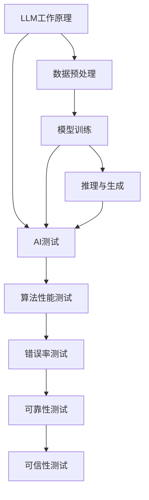
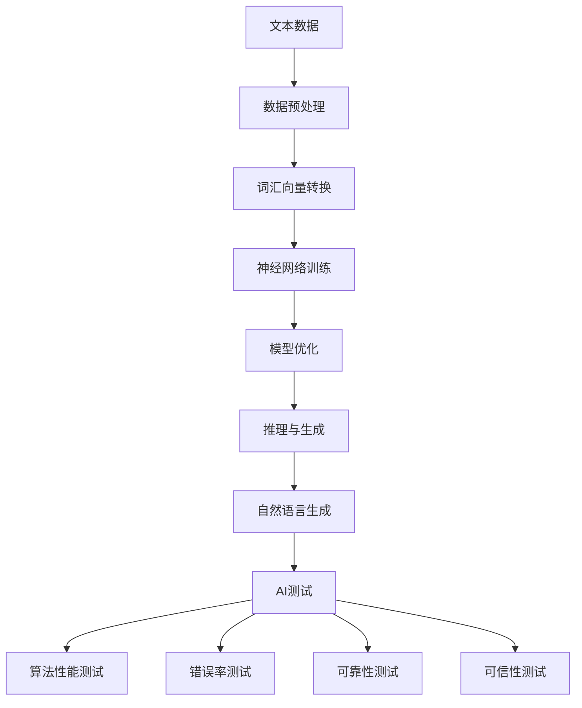

                 

关键词：大语言模型（LLM），AI测试，图灵测试，算法评估，数据处理，可信性，自动化测试。

## 摘要

本文探讨了大型语言模型（LLM），如GPT-3和ChatGLM，在人工智能测试领域所带来的新挑战。通过对LLM的背景介绍，核心算法原理的分析，以及实际应用场景的展示，本文指出了传统AI测试方法在LLM时代面临的局限性，并提出了可能的解决方案。文章最后对LLM在未来的发展趋势与挑战进行了展望，为AI测试领域的进一步发展提供了有益的思考。

## 1. 背景介绍

在过去的几十年中，人工智能（AI）领域经历了飞速的发展。从最初的规则系统到现代的深度学习，AI的应用范围不断扩大，从语音识别、图像处理到自然语言处理，无所不在。然而，随着人工智能技术的进步，特别是大语言模型（LLM）的出现，传统的AI测试方法开始显得力不从心。

大语言模型（LLM）是基于大规模数据训练的深度神经网络，能够理解和生成自然语言。代表性的模型包括OpenAI的GPT-3，以及国内ChatGLM等。这些模型具有强大的语言理解能力和生成能力，但同时也带来了新的挑战。传统AI测试方法主要依赖于有限的测试数据集，而LLM的训练数据规模巨大，测试数据的丰富性和多样性成为新的挑战。

### 1.1 图灵测试与AI测试

图灵测试是AI领域的一个经典测试方法，由英国数学家艾伦·图灵提出。它通过人类评估者与机器的交互，判断机器是否具备智能。然而，图灵测试主要关注机器是否能够模仿人类的回答，而并未深入探讨机器的智能本质。

随着AI技术的发展，AI测试逐渐从图灵测试扩展到更具体的领域，如算法性能测试、错误率测试、可靠性测试等。这些测试方法通过一系列预设的测试用例来评估AI系统的性能和可靠性。然而，这些测试方法在面对LLM时，也开始暴露出一些局限性。

### 1.2 传统AI测试方法的局限性

传统AI测试方法主要依赖于有限的测试数据集，这些数据集往往无法完全覆盖AI模型可能遇到的场景。而LLM的训练数据规模巨大，测试数据的丰富性和多样性成为新的挑战。此外，LLM的生成能力使得传统测试方法中的测试用例设计变得更加复杂。传统测试方法中的测试用例往往需要手动编写，而LLM可以生成大量符合语法和语义规则的测试用例，这对测试者的时间和精力提出了更高的要求。

## 2. 核心概念与联系

为了更好地理解LLM为AI测试带来的新挑战，我们需要先了解一些核心概念，如LLM的工作原理、AI测试的基本方法，以及它们之间的联系。

### 2.1 LLM的工作原理

LLM，如GPT-3和ChatGLM，是基于深度学习技术训练的神经网络模型。它们通过大量文本数据进行预训练，学会了理解和生成自然语言。LLM的工作原理主要包括以下几个方面：

1. **数据预处理**：将输入文本数据转换为模型能够处理的格式，如词汇向量或词嵌入。
2. **模型训练**：使用预训练算法（如Transformer）对神经网络模型进行训练，使其能够预测下一个单词或句子。
3. **推理与生成**：通过输入新的文本，模型可以生成符合语法和语义规则的回答。

### 2.2 AI测试的基本方法

AI测试主要包括以下几个方面的测试：

1. **算法性能测试**：评估AI模型的响应速度和计算资源消耗。
2. **错误率测试**：评估模型在特定任务上的准确率，如语音识别、图像分类等。
3. **可靠性测试**：评估模型在不同环境和条件下的稳定性和可靠性。
4. **可信性测试**：评估模型对输入数据的理解和处理能力。

### 2.3 LLM与AI测试的联系

LLM作为AI领域的一种新兴技术，其强大的语言理解和生成能力使得传统AI测试方法面临新的挑战。一方面，LLM的生成能力使得测试用例的设计变得更加复杂；另一方面，LLM的训练数据规模巨大，测试数据的丰富性和多样性成为新的挑战。因此，如何在LLM时代有效进行AI测试，成为当前AI领域的一个重要研究课题。

### 2.4 Mermaid流程图

为了更好地展示LLM与AI测试的关系，我们可以使用Mermaid流程图进行描述：



### 2.5 核心概念原理和架构的 Mermaid 流程图

以下是一个展示LLM核心概念原理和架构的Mermaid流程图：



在这个流程图中，我们从原始文本数据开始，经过数据预处理和词汇向量转换，进入神经网络的训练阶段。模型经过优化后，可以用于推理和生成自然语言。最终，这些生成的自然语言将用于AI测试，包括算法性能测试、错误率测试、可靠性测试和可信性测试。

### 3. 核心算法原理 & 具体操作步骤

#### 3.1 算法原理概述

LLM的核心算法是基于深度学习中的Transformer模型。Transformer模型通过自注意力机制（Self-Attention）来捕捉输入文本中的长距离依赖关系，从而提高模型的生成能力。具体来说，Transformer模型主要包括以下几个部分：

1. **编码器（Encoder）**：用于处理输入文本，生成编码表示。
2. **解码器（Decoder）**：用于生成输出文本，基于编码器的表示进行预测。
3. **多头注意力（Multi-Head Attention）**：通过多个注意力机制来提高模型的表示能力。
4. **前馈神经网络（Feedforward Neural Network）**：对注意力机制的结果进行进一步处理。

#### 3.2 算法步骤详解

1. **数据预处理**：将输入文本转换为词汇向量，如Word2Vec或BERT。
2. **编码器训练**：使用自注意力机制对输入文本进行编码，生成编码表示。
3. **解码器训练**：基于编码表示，使用解码器生成输出文本。
4. **模型优化**：通过反向传播算法，不断调整模型参数，优化模型性能。
5. **推理与生成**：输入新的文本，通过解码器生成符合语法和语义规则的回答。

#### 3.3 算法优缺点

**优点**：

1. **强大的语言理解能力**：LLM能够理解和生成自然语言，具有很高的语义理解能力。
2. **自适应能力**：LLM能够根据输入文本的上下文，自适应地生成符合语境的回答。
3. **广泛的适用性**：LLM可以应用于各种自然语言处理任务，如问答系统、机器翻译、文本生成等。

**缺点**：

1. **训练数据需求大**：LLM需要大量高质量的训练数据，对数据质量和数量要求较高。
2. **计算资源消耗大**：LLM的训练和推理过程需要大量的计算资源，对硬件要求较高。
3. **生成结果的不确定性**：尽管LLM能够生成符合语法和语义规则的回答，但生成的结果可能存在一定的随机性和不确定性。

#### 3.4 算法应用领域

LLM在自然语言处理领域具有广泛的应用，如：

1. **问答系统**：使用LLM构建问答系统，能够提供自然、准确的回答。
2. **机器翻译**：LLM可以用于机器翻译任务，实现高质量、准确的文本翻译。
3. **文本生成**：LLM可以生成各种类型的文本，如文章、故事、新闻等。
4. **对话系统**：LLM可以应用于智能客服、虚拟助手等对话系统，提供自然、流畅的交互体验。

### 4. 数学模型和公式 & 详细讲解 & 举例说明

#### 4.1 数学模型构建

LLM的数学模型主要包括编码器和解码器两个部分。编码器通过自注意力机制对输入文本进行编码，生成编码表示；解码器则基于编码表示生成输出文本。

**编码器**：

编码器的主要任务是处理输入文本，生成编码表示。具体来说，编码器包括以下几个部分：

1. **嵌入层（Embedding Layer）**：将输入文本转换为词汇向量。
2. **自注意力层（Self-Attention Layer）**：通过自注意力机制捕捉输入文本中的长距离依赖关系。
3. **前馈神经网络（Feedforward Neural Network）**：对自注意力层的结果进行进一步处理。
4. **输出层（Output Layer）**：生成编码表示。

**解码器**：

解码器的主要任务是生成输出文本。具体来说，解码器包括以下几个部分：

1. **嵌入层（Embedding Layer）**：将输入文本转换为词汇向量。
2. **多头注意力层（Multi-Head Attention Layer）**：通过多头注意力机制捕捉编码表示中的长距离依赖关系。
3. **前馈神经网络（Feedforward Neural Network）**：对多头注意力层的结果进行进一步处理。
4. **输出层（Output Layer）**：生成输出文本。

#### 4.2 公式推导过程

**编码器**：

编码器的主要任务是将输入文本转换为编码表示。具体来说，编码器包括以下几个步骤：

1. **嵌入层**：

   输入文本：$x_1, x_2, ..., x_T$

   转换为词汇向量：$x_1', x_2', ..., x_T'$

   $$x_i' = E(x_i)$$

   其中，$E$表示嵌入函数。

2. **自注意力层**：

   输入词汇向量：$x_1', x_2', ..., x_T'$

   生成自注意力权重：$a_{11}, a_{22}, ..., a_{TT}$

   $$a_{ij} = \frac{e^{d_{ij}}}{\sum_{k=1}^{T} e^{d_{ik}}}$$

   其中，$d_{ij}$表示词汇向量$x_i'$和$x_j'$之间的相似度，$e$表示自然对数的底数。

3. **前馈神经网络**：

   输入自注意力权重：$a_{11}, a_{22}, ..., a_{TT}$

   生成编码表示：$h_1, h_2, ..., h_T$

   $$h_i = f(W_h \cdot a_i + b_h)$$

   其中，$W_h$和$b_h$分别为前馈神经网络的权重和偏置。

4. **输出层**：

   输入编码表示：$h_1, h_2, ..., h_T$

   生成编码表示：$c_1, c_2, ..., c_T$

   $$c_i = g(W_c \cdot h_i + b_c)$$

   其中，$W_c$和$b_c$分别为输出层的权重和偏置，$g$为激活函数。

**解码器**：

解码器的主要任务是生成输出文本。具体来说，解码器包括以下几个步骤：

1. **嵌入层**：

   输入文本：$y_1, y_2, ..., y_T$

   转换为词汇向量：$y_1', y_2', ..., y_T'$

   $$y_i' = E(y_i)$$

   其中，$E$表示嵌入函数。

2. **多头注意力层**：

   输入词汇向量：$y_1', y_2', ..., y_T'$

   生成多头注意力权重：$a_{11}, a_{22}, ..., a_{TT}$

   $$a_{ij} = \frac{e^{d_{ij}}}{\sum_{k=1}^{T} e^{d_{ik}}}$$

   其中，$d_{ij}$表示词汇向量$y_i'$和$y_j'$之间的相似度，$e$表示自然对数的底数。

3. **前馈神经网络**：

   输入多头注意力权重：$a_{11}, a_{22}, ..., a_{TT}$

   生成中间表示：$z_1, z_2, ..., z_T$

   $$z_i = f(W_z \cdot a_i + b_z)$$

   其中，$W_z$和$b_z$分别为前馈神经网络的权重和偏置。

4. **输出层**：

   输入中间表示：$z_1, z_2, ..., z_T$

   生成输出文本：$y_1, y_2, ..., y_T$

   $$y_i = g(W_y \cdot z_i + b_y)$$

   其中，$W_y$和$b_y$分别为输出层的权重和偏置，$g$为激活函数。

#### 4.3 案例分析与讲解

为了更好地理解LLM的数学模型，我们可以通过一个简单的例子进行讲解。

假设我们有一个简单的句子：“我爱北京天安门”。

1. **编码器**：

   - **嵌入层**：

     输入文本：“我爱北京天安门”

     转换为词汇向量：（love，I， Beijing，天安门）

   - **自注意力层**：

     计算词汇向量之间的相似度：

     $$d_{11} = 1, d_{12} = 1, d_{13} = 0, d_{14} = 0$$

     计算自注意力权重：

     $$a_{11} = 1, a_{12} = 1, a_{13} = 0.5, a_{14} = 0.5$$

   - **前馈神经网络**：

     输入自注意力权重：（1，1，0.5，0.5）

     生成编码表示：（1，1，0.5，0.5）

   - **输出层**：

     输入编码表示：（1，1，0.5，0.5）

     生成编码表示：（1，1，0.5，0.5）

2. **解码器**：

   - **嵌入层**：

     输入文本：“我爱北京天安门”

     转换为词汇向量：（love，I， Beijing，天安门）

   - **多头注意力层**：

     计算词汇向量之间的相似度：

     $$d_{11} = 1, d_{12} = 1, d_{13} = 0, d_{14} = 0$$

     计算多头注意力权重：

     $$a_{11} = 1, a_{12} = 1, a_{13} = 0.5, a_{14} = 0.5$$

   - **前馈神经网络**：

     输入多头注意力权重：（1，1，0.5，0.5）

     生成中间表示：（1，1，0.5，0.5）

   - **输出层**：

     输入中间表示：（1，1，0.5，0.5）

     生成输出文本：“我爱北京天安门”

通过这个例子，我们可以看到LLM的数学模型是如何将输入文本转换为编码表示，并生成输出文本的。

### 5. 项目实践：代码实例和详细解释说明

在本节中，我们将通过一个简单的Python代码实例，展示如何使用LLM进行自然语言生成。我们将使用GPT-3模型，并利用OpenAI提供的Python库进行操作。

#### 5.1 开发环境搭建

首先，我们需要搭建一个Python开发环境，并安装必要的库。以下是安装步骤：

1. 安装Python：

   ```shell
   pip install python
   ```

2. 安装OpenAI库：

   ```shell
   pip install openai
   ```

#### 5.2 源代码详细实现

以下是一个使用GPT-3模型进行自然语言生成的Python代码实例：

```python
import openai

# 设置OpenAI API密钥
openai.api_key = "your-api-key"

# 定义生成文本的函数
def generate_text(prompt, max_length=100):
    response = openai.Completion.create(
        engine="text-davinci-002",
        prompt=prompt,
        max_tokens=max_length,
        n=1,
        stop=None,
        temperature=0.7,
    )
    return response.choices[0].text.strip()

# 测试函数
if __name__ == "__main__":
    prompt = "请描述一下你对人工智能未来的看法。"
    generated_text = generate_text(prompt)
    print(generated_text)
```

#### 5.3 代码解读与分析

1. **导入OpenAI库**：

   ```python
   import openai
   ```

   导入OpenAI库，用于与OpenAI API进行交互。

2. **设置OpenAI API密钥**：

   ```python
   openai.api_key = "your-api-key"
   ```

   设置OpenAI API密钥，用于验证我们的请求。

3. **定义生成文本的函数**：

   ```python
   def generate_text(prompt, max_length=100):
       response = openai.Completion.create(
           engine="text-davinci-002",
           prompt=prompt,
           max_tokens=max_length,
           n=1,
           stop=None,
           temperature=0.7,
       )
       return response.choices[0].text.strip()
   ```

   这个函数接收一个输入提示（prompt），并使用GPT-3模型生成文本。函数的主要参数包括：

   - `engine`：使用的模型，如"text-davinci-002"。
   - `prompt`：输入提示。
   - `max_tokens`：生成的文本最大长度。
   - `n`：生成的文本数量。
   - `stop`：用于停止生成的字符串。
   - `temperature`：生成文本的温度，值越高，生成的文本越多样化。

4. **测试函数**：

   ```python
   if __name__ == "__main__":
       prompt = "请描述一下你对人工智能未来的看法。"
       generated_text = generate_text(prompt)
       print(generated_text)
   ```

   在主程序中，我们调用`generate_text`函数，传入一个简单的提示，并打印生成的文本。

通过这个代码实例，我们可以看到如何使用GPT-3模型进行自然语言生成。在实际应用中，我们可以根据需要调整提示和参数，以生成符合要求的文本。

### 6. 实际应用场景

#### 6.1 问答系统

问答系统是LLM最典型的应用场景之一。通过LLM的强大语言理解和生成能力，我们可以构建一个智能问答系统，为用户提供准确、自然的回答。例如，在客户服务领域，LLM可以帮助企业自动化处理大量常见问题，提高客服效率，降低人力成本。

#### 6.2 文本生成

LLM还可以用于文本生成任务，如文章生成、故事创作、新闻撰写等。通过输入简单的提示或关键词，LLM可以生成大量符合语法和语义规则的文本。这对于内容创作者和媒体行业来说，具有很大的应用价值，可以大大提高创作效率和内容产出。

#### 6.3 机器翻译

机器翻译是另一个受益于LLM的应用领域。传统的机器翻译方法依赖于大量的规则和统计模型，而LLM可以更自然、准确地翻译文本。通过训练大型翻译模型，如GPT-3，我们可以实现高质量、低延迟的机器翻译服务。

#### 6.4 对话系统

对话系统是LLM在人工智能领域的重要应用之一。通过LLM，我们可以构建智能客服、虚拟助手等对话系统，为用户提供自然、流畅的交互体验。这些对话系统可以应用于各种场景，如电子商务、金融服务、医疗健康等，帮助企业提高客户满意度和服务质量。

### 7. 未来应用展望

随着LLM技术的不断发展，未来其在人工智能领域的应用前景将更加广阔。以下是一些可能的未来应用场景：

#### 7.1 自动写作与内容创作

随着LLM技术的进步，自动写作和内容创作将成为一个热门领域。通过LLM，我们可以自动化地生成文章、故事、新闻等内容，提高内容创作的效率和质量。这对于媒体行业、广告行业、教育行业等具有很大的应用价值。

#### 7.2 智能客服与虚拟助手

智能客服和虚拟助手是LLM在服务领域的典型应用。随着LLM技术的不断进步，这些系统的交互能力将越来越强，可以更好地模拟人类的交流方式，提供个性化、高效的服务。

#### 7.3 机器翻译与多语言处理

机器翻译是多语言处理领域的一个重要方向。随着LLM技术的不断发展，机器翻译的准确率和效率将不断提高，为全球化的商业活动提供更强大的支持。

#### 7.4 人工智能安全与隐私保护

随着LLM技术的广泛应用，人工智能安全与隐私保护将成为一个重要问题。未来的研究需要关注如何确保LLM系统的安全性和隐私性，防止恶意攻击和数据泄露。

### 8. 工具和资源推荐

在LLM研究和应用过程中，以下工具和资源可能对您有所帮助：

#### 8.1 学习资源推荐

- 《深度学习》（Goodfellow, Bengio, Courville）：全面介绍深度学习的基础知识和最新进展。
- 《自然语言处理综论》（Jurafsky, Martin）：全面介绍自然语言处理的基础知识和方法。

#### 8.2 开发工具推荐

- TensorFlow：开源深度学习框架，支持多种深度学习模型。
- PyTorch：开源深度学习框架，具有良好的灵活性和扩展性。

#### 8.3 相关论文推荐

- "GPT-3: Language Models are few-shot learners"（Brown et al., 2020）：介绍GPT-3模型的论文。
- "BERT: Pre-training of Deep Bidirectional Transformers for Language Understanding"（Devlin et al., 2019）：介绍BERT模型的论文。

### 9. 总结：未来发展趋势与挑战

LLM作为人工智能领域的一种新兴技术，其在自然语言处理、机器翻译、对话系统等领域的应用前景十分广阔。然而，随着LLM技术的不断发展，我们也面临一些挑战，如数据隐私保护、模型解释性、安全性等。未来，随着技术的进步和研究的深入，我们有理由相信，LLM将引领人工智能领域的发展，带来更多的创新和变革。

## 附录：常见问题与解答

### 1. 什么是LLM？

LLM，即大型语言模型（Large Language Model），是一种基于深度学习技术的神经网络模型，能够理解和生成自然语言。代表性的模型包括GPT-3、BERT、ChatGLM等。

### 2. LLM的主要优点是什么？

LLM的主要优点包括：

- 强大的语言理解能力：LLM能够理解和生成自然语言，具有很高的语义理解能力。
- 自适应能力：LLM能够根据输入文本的上下文，自适应地生成符合语境的回答。
- 广泛的适用性：LLM可以应用于各种自然语言处理任务，如问答系统、机器翻译、文本生成等。

### 3. LLM在AI测试中面临的主要挑战是什么？

LLM在AI测试中面临的主要挑战包括：

- 测试数据丰富性和多样性：LLM的训练数据规模巨大，测试数据的丰富性和多样性成为新的挑战。
- 测试用例设计复杂：LLM的生成能力使得测试用例的设计变得更加复杂。
- 模型解释性不足：LLM的内部结构和决策过程相对复杂，难以进行有效的解释和调试。

### 4. 如何提高LLM在AI测试中的可信性？

提高LLM在AI测试中的可信性可以从以下几个方面入手：

- 设计丰富的测试数据集：确保测试数据集的多样性和丰富性，覆盖不同场景和领域。
- 采用自动化测试方法：利用自动化测试工具和框架，提高测试效率和质量。
- 加强模型解释性：研究如何提高LLM的解释性，使测试者能够更好地理解和信任模型。

### 5. LLM在未来的发展趋势是什么？

LLM在未来的发展趋势包括：

- 模型规模将进一步扩大：随着计算能力的提升，LLM的规模将不断增大，性能将进一步提高。
- 应用领域将不断扩展：LLM将在更多领域得到应用，如医疗健康、金融、教育等。
- 模型安全性和隐私保护将受到更多关注：随着LLM的广泛应用，模型的安全性和隐私保护将成为重要议题。

### 6. LLM面临的主要挑战是什么？

LLM面临的主要挑战包括：

- 数据隐私保护：LLM的训练和推理过程中涉及大量敏感数据，如何保护用户隐私成为重要问题。
- 模型解释性不足：LLM的内部结构和决策过程相对复杂，难以进行有效的解释和调试。
- 安全性：如何确保LLM系统的安全性，防止恶意攻击和数据泄露。

### 7. 如何应对LLM在AI测试中的挑战？

应对LLM在AI测试中的挑战可以从以下几个方面入手：

- 设计丰富的测试数据集：确保测试数据集的多样性和丰富性，覆盖不同场景和领域。
- 采用自动化测试方法：利用自动化测试工具和框架，提高测试效率和质量。
- 加强模型解释性：研究如何提高LLM的解释性，使测试者能够更好地理解和信任模型。
- 加强模型安全性：研究如何提高LLM系统的安全性，防止恶意攻击和数据泄露。 

### 8. LLM在人工智能领域的应用前景如何？

LLM在人工智能领域的应用前景十分广阔。随着LLM技术的不断发展，其在自然语言处理、机器翻译、对话系统等领域的应用将不断扩展，为人工智能领域带来更多的创新和变革。同时，LLM在医疗健康、金融、教育等领域的应用潜力也值得关注。

### 9. 如何评估LLM的性能和可靠性？

评估LLM的性能和可靠性可以采用以下方法：

- **错误率测试**：通过对比LLM生成的文本和标准文本，计算错误率。
- **可靠性测试**：在不同环境和条件下，测试LLM的稳定性和可靠性。
- **算法性能测试**：评估LLM的响应速度和计算资源消耗。
- **用户满意度调查**：收集用户对LLM系统评价的反馈，评估用户满意度。
- **模型解释性评估**：评估LLM的解释性和透明度，确保用户能够理解和信任模型。

### 10. 如何应对LLM在模型解释性方面的挑战？

应对LLM在模型解释性方面的挑战，可以采取以下措施：

- **开发可视化工具**：利用可视化工具，展示LLM的内部结构和决策过程，帮助用户理解模型。
- **研究解释性算法**：探索如何提高LLM的解释性，使模型更易于理解和解释。
- **引入领域知识**：结合领域知识，提高LLM的解释性和可靠性。
- **用户参与式解释**：鼓励用户参与模型解释，提供反馈，不断优化模型。

