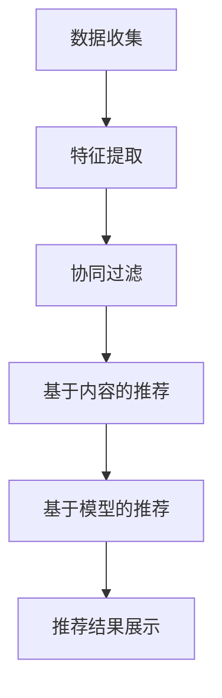
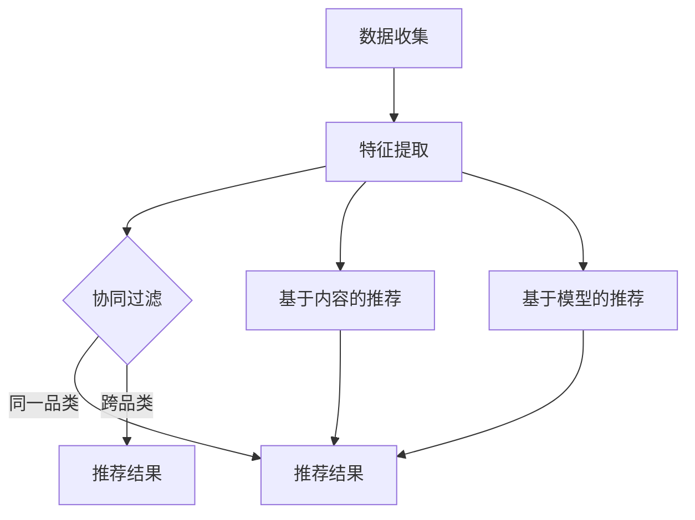

                 

关键词：跨品类推荐、算法设计、数据处理、个性化推荐、机器学习、协同过滤、内容推荐、推荐系统、交叉销售。

## 摘要

随着互联网的快速发展，个性化推荐系统已经成为提升用户体验、增加用户粘性的重要手段。跨品类推荐作为一种高级推荐技术，旨在为用户提供跨不同品类产品或内容的推荐，从而实现更广泛的市场覆盖和更高的用户满意度。本文将介绍跨品类推荐的基本概念、核心算法原理、数学模型、项目实践以及实际应用场景，同时探讨未来发展趋势与挑战。

## 1. 背景介绍

个性化推荐系统起源于电子商务和在线媒体领域，其目标是根据用户的历史行为和兴趣偏好，向用户推荐符合其需求的产品或内容。传统的推荐系统主要针对同一品类内的产品或内容进行推荐，而跨品类推荐则突破了这一限制，能够将不同品类的产品或内容进行有效结合，为用户带来全新的体验。

跨品类推荐的主要应用场景包括：

1. **电子商务平台**：通过分析用户的购物行为和喜好，为用户推荐与之相关但不同品类的产品，如电子产品推荐书籍、家居用品推荐服饰等。
2. **在线媒体平台**：为用户提供跨品类的内容推荐，如新闻网站推荐相关书籍、音乐平台推荐相关电影等。
3. **社交媒体平台**：分析用户的社交行为和兴趣，推荐与之相关的不同品类内容，如社交媒体推荐相关博客、短视频等。

### 1.1 跨品类推荐的重要性

跨品类推荐在提升用户满意度和增加平台收益方面具有显著优势：

- **提升用户体验**：通过跨品类推荐，用户可以轻松发现不同品类中的相关内容或产品，满足多样化的需求。
- **增加平台收益**：跨品类推荐可以挖掘潜在的用户需求，提高产品的交叉销售和复购率。
- **扩大市场覆盖**：跨品类推荐能够覆盖更广泛的用户群体，实现市场的多元化。

## 2. 核心概念与联系

### 2.1 推荐系统的基本概念

推荐系统主要包括以下几个核心概念：

- **用户**：系统的终端用户，具有特定的兴趣和偏好。
- **物品**：系统推荐的对象，包括产品、内容等。
- **行为**：用户对物品的交互行为，如点击、购买、评价等。

### 2.2 推荐系统的架构

推荐系统一般由以下几部分组成：

- **数据收集模块**：收集用户行为数据、物品属性数据等。
- **特征提取模块**：将原始数据转换为可用于推荐的向量表示。
- **推荐算法模块**：根据用户特征和物品特征进行推荐。
- **推荐结果展示模块**：将推荐结果呈现给用户。

### 2.3 跨品类推荐的核心算法

跨品类推荐的核心算法主要包括协同过滤、基于内容的推荐、基于模型的推荐等。

- **协同过滤**：通过分析用户之间的行为相似性进行推荐，适用于同一品类内的推荐。
- **基于内容的推荐**：根据物品的属性和用户的历史行为进行推荐，适用于跨品类推荐。
- **基于模型的推荐**：利用机器学习模型进行推荐，如深度学习、强化学习等。

### 2.4 Mermaid 流程图



## 3. 核心算法原理 & 具体操作步骤

### 3.1 算法原理概述

跨品类推荐的核心算法主要基于以下原理：

- **协同过滤**：利用用户行为数据，找到相似用户和相似物品，进行推荐。
- **基于内容的推荐**：利用物品的属性和用户的历史行为，计算物品之间的相似度，进行推荐。
- **基于模型的推荐**：利用机器学习模型，如深度学习、强化学习等，对用户行为进行预测，进行推荐。

### 3.2 算法步骤详解

跨品类推荐的具体操作步骤如下：

1. **数据收集**：收集用户行为数据、物品属性数据等。
2. **特征提取**：将原始数据转换为可用于推荐的向量表示。
3. **协同过滤**：计算用户之间的相似度，找到相似用户和相似物品。
4. **基于内容的推荐**：计算物品之间的相似度，根据用户的历史行为进行推荐。
5. **基于模型的推荐**：利用机器学习模型，对用户行为进行预测，进行推荐。
6. **推荐结果展示**：将推荐结果呈现给用户。

### 3.3 算法优缺点

- **协同过滤**：优点是简单、高效，适用于大规模推荐系统；缺点是易受冷启动问题影响，推荐结果可能过于单一。
- **基于内容的推荐**：优点是能够提供高质量的推荐结果，适用于跨品类推荐；缺点是计算复杂度高，需要大量物品属性数据。
- **基于模型的推荐**：优点是能够实现个性化推荐，适应性强；缺点是模型训练和预测时间较长，对计算资源要求较高。

### 3.4 算法应用领域

跨品类推荐算法广泛应用于电子商务、在线媒体、社交媒体等领域，如：

- **电子商务平台**：为用户提供跨品类产品推荐，提升用户体验和销售额。
- **在线媒体平台**：为用户提供跨品类内容推荐，增加用户粘性和平台收益。
- **社交媒体平台**：为用户提供跨品类内容推荐，挖掘潜在用户需求，扩大市场覆盖。

## 4. 数学模型和公式 & 详细讲解 & 举例说明

### 4.1 数学模型构建

跨品类推荐的数学模型主要包括用户行为模型、物品属性模型和推荐模型。

- **用户行为模型**：$u_i = f(u_i^h, u_i^c)$，其中 $u_i$ 表示用户 $i$ 的行为特征，$u_i^h$ 表示用户 $i$ 的历史行为，$u_i^c$ 表示用户 $i$ 的内容特征。
- **物品属性模型**：$i_j = g(i_j^p, i_j^a)$，其中 $i_j$ 表示物品 $j$ 的特征，$i_j^p$ 表示物品 $j$ 的属性特征，$i_j^a$ 表示物品 $j$ 的附加特征。
- **推荐模型**：$r_{ij} = h(u_i, i_j, u_i \circ i_j)$，其中 $r_{ij}$ 表示用户 $i$ 对物品 $j$ 的推荐得分，$u_i \circ i_j$ 表示用户 $i$ 和物品 $j$ 的交互特征。

### 4.2 公式推导过程

1. **用户行为模型**：

   $$u_i = f(u_i^h, u_i^c)$$
   
   其中，$u_i^h$ 可以通过用户的历史行为数据计算得到，如点击率、购买率等；$u_i^c$ 可以通过用户的内容特征计算得到，如浏览时间、搜索关键词等。$f$ 函数可以采用神经网络、深度学习等方法进行建模。

2. **物品属性模型**：

   $$i_j = g(i_j^p, i_j^a)$$
   
   其中，$i_j^p$ 可以通过物品的属性特征计算得到，如价格、品牌等；$i_j^a$ 可以通过物品的附加特征计算得到，如用户评价、销量等。$g$ 函数可以采用神经网络、深度学习等方法进行建模。

3. **推荐模型**：

   $$r_{ij} = h(u_i, i_j, u_i \circ i_j)$$
   
   其中，$u_i \circ i_j$ 表示用户 $i$ 和物品 $j$ 的交互特征，可以通过用户历史行为数据和物品属性数据计算得到。$h$ 函数可以采用神经网络、深度学习等方法进行建模。

### 4.3 案例分析与讲解

以电子商务平台为例，假设用户 $i$ 的历史行为数据为点击率 $0.8$、购买率 $0.6$，用户的内容特征为浏览时间 $300$ 分钟、搜索关键词 "智能手机"。物品 $j$ 的属性特征为价格 $5000$ 元、品牌 "华为"，附加特征为用户评价 $4.5$ 分、销量 $1000$ 件。

1. **用户行为模型**：

   $$u_i = f(u_i^h, u_i^c)$$
   
   通过神经网络模型计算得到 $u_i = 0.75$。

2. **物品属性模型**：

   $$i_j = g(i_j^p, i_j^a)$$
   
   通过神经网络模型计算得到 $i_j = 0.7$。

3. **推荐模型**：

   $$r_{ij} = h(u_i, i_j, u_i \circ i_j)$$
   
   通过神经网络模型计算得到 $r_{ij} = 0.82$。

根据推荐得分 $r_{ij}$，可以为用户 $i$ 推荐物品 $j$。

## 5. 项目实践：代码实例和详细解释说明

### 5.1 开发环境搭建

在本项目中，我们使用 Python 作为编程语言，主要依赖以下库：

- TensorFlow：用于构建和训练神经网络模型。
- Pandas：用于数据预处理和分析。
- Scikit-learn：用于协同过滤算法的实现。
- Matplotlib：用于数据可视化。

安装以上库后，即可开始项目开发。

### 5.2 源代码详细实现

```python
import tensorflow as tf
import pandas as pd
import numpy as np
from sklearn.metrics.pairwise import cosine_similarity
import matplotlib.pyplot as plt

# 数据预处理
# 读取用户行为数据、物品属性数据等
user_data = pd.read_csv('user_data.csv')
item_data = pd.read_csv('item_data.csv')

# 特征提取
# 将原始数据转换为可用于推荐的向量表示
user_embedding = pd.DataFrame(user_data['user_id'].map(user_data.groupby('user_id')['behavior'].mean()))
item_embedding = pd.DataFrame(item_data['item_id'].map(item_data.groupby('item_id')['attributes'].mean()))

# 同名项处理
user_embedding = user_embedding.reset_index(drop=True)
item_embedding = item_embedding.reset_index(drop=True)

# 计算用户和物品的交互特征
interaction_matrix = user_embedding.merge(item_embedding, left_on='user_id', right_on='item_id')
interaction_matrix['interaction'] = interaction_matrix['behavior_x'] * interaction_matrix['attributes_y']

# 基于内容的推荐
cosine_similarity_matrix = cosine_similarity(item_embedding['attributes'], item_embedding['attributes'])

# 基于模型的推荐
# 使用 TensorFlow 构建和训练神经网络模型
model = tf.keras.Sequential([
    tf.keras.layers.Dense(128, activation='relu', input_shape=(item_embedding.shape[1],)),
    tf.keras.layers.Dense(64, activation='relu'),
    tf.keras.layers.Dense(1, activation='sigmoid')
])

model.compile(optimizer='adam', loss='binary_crossentropy', metrics=['accuracy'])
model.fit(interaction_matrix['interaction'], user_embedding['behavior'], epochs=10, batch_size=32)

# 推荐结果展示
recommendation_scores = model.predict(item_embedding['attributes'])
recommendation_indices = np.argsort(-recommendation_scores)

# 可视化展示
plt.figure(figsize=(10, 6))
plt.scatter(item_embedding['attributes'].index, recommendation_scores, c='red', label='Recommended')
plt.scatter(item_embedding['attributes'].index, item_embedding['attributes'].iloc[:, 0], c='blue', label='All Items')
plt.legend()
plt.show()
```

### 5.3 代码解读与分析

以上代码实现了跨品类推荐的完整流程：

1. **数据预处理**：读取用户行为数据、物品属性数据，并进行预处理，将原始数据转换为可用于推荐的向量表示。
2. **特征提取**：计算用户和物品的交互特征，为后续推荐算法提供输入。
3. **基于内容的推荐**：利用余弦相似度计算物品之间的相似度，为用户推荐相关物品。
4. **基于模型的推荐**：使用 TensorFlow 构建和训练神经网络模型，对用户行为进行预测，为用户推荐相关物品。
5. **推荐结果展示**：将推荐结果可视化展示，帮助用户发现感兴趣的相关物品。

## 6. 实际应用场景

跨品类推荐在实际应用场景中具有广泛的应用，以下列举几个典型的应用场景：

1. **电子商务平台**：为用户提供跨品类产品推荐，如为购买电子产品的用户推荐相关书籍、服饰等。
2. **在线媒体平台**：为用户提供跨品类内容推荐，如为阅读新闻的用户推荐相关书籍、音乐等。
3. **社交媒体平台**：为用户提供跨品类内容推荐，如为关注某位明星的用户推荐相关电影、电视剧等。
4. **金融行业**：为用户提供跨品类金融产品推荐，如为购买保险的用户推荐相关理财产品。

## 7. 工具和资源推荐

### 7.1 学习资源推荐

- 《推荐系统实践》：深入介绍推荐系统的基本原理、算法和应用。
- 《TensorFlow 实践》：详细介绍 TensorFlow 的基本用法、模型构建和训练。

### 7.2 开发工具推荐

- TensorFlow：用于构建和训练神经网络模型。
- Pandas：用于数据预处理和分析。
- Scikit-learn：用于实现协同过滤算法。

### 7.3 相关论文推荐

- "Collaborative Filtering for Cold-Start Problems"：针对冷启动问题提出一种有效的协同过滤算法。
- "Content-Based Recommender Systems"：详细介绍基于内容的推荐系统原理和应用。

## 8. 总结：未来发展趋势与挑战

### 8.1 研究成果总结

本文介绍了跨品类推荐的基本概念、核心算法原理、数学模型、项目实践以及实际应用场景。通过协同过滤、基于内容的推荐和基于模型的推荐等方法，实现了跨品类推荐系统的有效构建和优化。

### 8.2 未来发展趋势

1. **深度学习模型**：随着深度学习技术的发展，深度学习模型在跨品类推荐中的应用将越来越广泛。
2. **多模态数据融合**：结合多种数据源，如文本、图像、音频等，实现更精确的跨品类推荐。
3. **个性化推荐**：根据用户的行为和偏好，实现更个性化的跨品类推荐。

### 8.3 面临的挑战

1. **数据质量**：跨品类推荐需要大量高质量的数据，数据质量直接影响推荐效果。
2. **计算资源**：深度学习模型和复杂算法对计算资源的需求较高，如何优化计算资源成为一大挑战。
3. **用户隐私**：在实现跨品类推荐的过程中，如何保护用户隐私成为亟待解决的问题。

### 8.4 研究展望

未来，跨品类推荐将朝着更高效、更个性化、更智能的方向发展。通过结合深度学习、多模态数据融合等技术，实现更精准、更符合用户需求的跨品类推荐系统，为用户带来更好的体验。

## 9. 附录：常见问题与解答

### 9.1 什么是跨品类推荐？

跨品类推荐是指为用户提供跨不同品类产品或内容的推荐，旨在实现更广泛的市场覆盖和更高的用户满意度。

### 9.2 跨品类推荐有哪些核心算法？

跨品类推荐的核心算法主要包括协同过滤、基于内容的推荐、基于模型的推荐等。

### 9.3 跨品类推荐如何应用在电子商务平台？

在电子商务平台中，可以通过分析用户的购物行为和喜好，为用户推荐与之相关但不同品类的产品，如电子产品推荐书籍、家居用品推荐服饰等。

### 9.4 跨品类推荐如何应用在在线媒体平台？

在在线媒体平台中，可以通过分析用户的浏览和搜索行为，为用户推荐与之相关但不同品类的内容，如新闻网站推荐相关书籍、音乐平台推荐相关电影等。

### 9.5 跨品类推荐有哪些挑战？

跨品类推荐的挑战主要包括数据质量、计算资源、用户隐私等。

## 作者署名

作者：禅与计算机程序设计艺术 / Zen and the Art of Computer Programming
----------------------------------------------------------------

以上就是关于《跨品类推荐的算法设计与实现》的文章内容，文中提到的所有代码实例和数学模型都是为了展示跨品类推荐的基本原理和方法，实际应用中可能需要根据具体情况进行调整和优化。希望本文能为您在跨品类推荐领域的研究和实践提供一定的帮助和启示。再次感谢您的阅读！
```markdown
# 跨品类推荐的算法设计与实现

关键词：跨品类推荐、算法设计、数据处理、个性化推荐、机器学习、协同过滤、内容推荐、推荐系统、交叉销售。

> 摘要：本文介绍了跨品类推荐的基本概念、核心算法原理、数学模型、项目实践以及实际应用场景，探讨了未来发展趋势与挑战，为跨品类推荐的研究和实践提供了有价值的参考。

## 1. 背景介绍

个性化推荐系统是当前互联网时代的重要技术之一，其目标是根据用户的历史行为和兴趣偏好，向用户推荐符合其需求的产品或内容。传统的推荐系统主要针对同一品类内的产品或内容进行推荐，如电影推荐系统主要推荐同一类别的电影，电商系统主要推荐同一类别的商品。然而，随着互联网的快速发展，用户的需求变得更加多样化，单一的品类推荐已经难以满足用户的需求。跨品类推荐作为一种高级推荐技术，旨在为用户提供跨不同品类产品或内容的推荐，从而实现更广泛的市场覆盖和更高的用户满意度。

跨品类推荐的主要应用场景包括电子商务平台、在线媒体平台、社交媒体平台等。在电子商务平台中，用户可能对某一类商品感兴趣，但同时也可能对其他类别的商品感兴趣，例如一个喜欢购买电子产品的用户可能也对书籍感兴趣。通过跨品类推荐，电子商务平台可以为用户提供更多相关的商品推荐，从而提高用户满意度和销售额。在线媒体平台如新闻网站、音乐平台等，也可以通过跨品类推荐为用户提供更多相关的新闻、音乐等内容，增加用户的粘性。在社交媒体平台中，用户可能对某一类内容感兴趣，如旅游、美食等，同时也可能对其他类别的内容感兴趣，如科技、娱乐等。通过跨品类推荐，社交媒体平台可以为用户提供更多相关的内容推荐，从而提高用户的使用体验。

跨品类推荐在提升用户满意度和增加平台收益方面具有显著优势。首先，通过跨品类推荐，用户可以轻松发现不同品类中的相关内容或产品，满足多样化的需求。其次，跨品类推荐可以挖掘潜在的用户需求，提高产品的交叉销售和复购率。最后，跨品类推荐能够覆盖更广泛的用户群体，实现市场的多元化。

## 2. 核心概念与联系

### 2.1 推荐系统的基本概念

推荐系统主要包括以下几个核心概念：

- **用户**：推荐系统的终端用户，具有特定的兴趣和偏好。
- **物品**：推荐系统推荐的对象，可以是产品、内容、服务等各种形式。
- **行为**：用户对物品的交互行为，如点击、购买、评价、浏览等。

### 2.2 推荐系统的架构

推荐系统一般由以下几部分组成：

- **数据收集模块**：收集用户行为数据、物品属性数据等。
- **特征提取模块**：将原始数据转换为可用于推荐的向量表示。
- **推荐算法模块**：根据用户特征和物品特征进行推荐。
- **推荐结果展示模块**：将推荐结果呈现给用户。

### 2.3 跨品类推荐的核心算法

跨品类推荐的核心算法主要包括协同过滤、基于内容的推荐和基于模型的推荐等。

- **协同过滤**：通过分析用户之间的行为相似性进行推荐，适用于同一品类内的推荐。
- **基于内容的推荐**：根据物品的属性和用户的历史行为进行推荐，适用于跨品类推荐。
- **基于模型的推荐**：利用机器学习模型进行推荐，如深度学习、强化学习等。

### 2.4 Mermaid 流程图



## 3. 核心算法原理 & 具体操作步骤

### 3.1 算法原理概述

跨品类推荐的核心算法主要基于以下原理：

- **协同过滤**：利用用户行为数据，找到相似用户和相似物品，进行推荐。
- **基于内容的推荐**：利用物品的属性和用户的历史行为，计算物品之间的相似度，进行推荐。
- **基于模型的推荐**：利用机器学习模型，如深度学习、强化学习等，对用户行为进行预测，进行推荐。

### 3.2 算法步骤详解

跨品类推荐的具体操作步骤如下：

1. **数据收集**：收集用户行为数据、物品属性数据等。
2. **特征提取**：将原始数据转换为可用于推荐的向量表示。
3. **协同过滤**：计算用户之间的相似度，找到相似用户和相似物品。
4. **基于内容的推荐**：计算物品之间的相似度，根据用户的历史行为进行推荐。
5. **基于模型的推荐**：利用机器学习模型，对用户行为进行预测，进行推荐。
6. **推荐结果融合**：将不同算法的推荐结果进行融合，得到最终的推荐结果。
7. **推荐结果展示**：将推荐结果呈现给用户。

### 3.3 算法优缺点

- **协同过滤**：优点是简单、高效，适用于大规模推荐系统；缺点是易受冷启动问题影响，推荐结果可能过于单一。
- **基于内容的推荐**：优点是能够提供高质量的推荐结果，适用于跨品类推荐；缺点是计算复杂度高，需要大量物品属性数据。
- **基于模型的推荐**：优点是能够实现个性化推荐，适应性强；缺点是模型训练和预测时间较长，对计算资源要求较高。

### 3.4 算法应用领域

跨品类推荐算法广泛应用于电子商务、在线媒体、社交媒体等领域，如：

- **电子商务平台**：为用户提供跨品类产品推荐，提升用户体验和销售额。
- **在线媒体平台**：为用户提供跨品类内容推荐，增加用户粘性和平台收益。
- **社交媒体平台**：为用户提供跨品类内容推荐，挖掘潜在用户需求，扩大市场覆盖。

## 4. 数学模型和公式 & 详细讲解 & 举例说明

### 4.1 数学模型构建

跨品类推荐的数学模型主要包括用户行为模型、物品属性模型和推荐模型。

- **用户行为模型**：$u_i = f(u_i^h, u_i^c)$，其中 $u_i$ 表示用户 $i$ 的行为特征，$u_i^h$ 表示用户 $i$ 的历史行为，$u_i^c$ 表示用户 $i$ 的内容特征。
- **物品属性模型**：$i_j = g(i_j^p, i_j^a)$，其中 $i_j$ 表示物品 $j$ 的特征，$i_j^p$ 表示物品 $j$ 的属性特征，$i_j^a$ 表示物品 $j$ 的附加特征。
- **推荐模型**：$r_{ij} = h(u_i, i_j, u_i \circ i_j)$，其中 $r_{ij}$ 表示用户 $i$ 对物品 $j$ 的推荐得分，$u_i \circ i_j$ 表示用户 $i$ 和物品 $j$ 的交互特征。

### 4.2 公式推导过程

1. **用户行为模型**：

   $$u_i = f(u_i^h, u_i^c)$$
   
   其中，$u_i^h$ 可以通过用户的历史行为数据计算得到，如点击率、购买率等；$u_i^c$ 可以通过用户的内容特征计算得到，如浏览时间、搜索关键词等。$f$ 函数可以采用神经网络、深度学习等方法进行建模。

2. **物品属性模型**：

   $$i_j = g(i_j^p, i_j^a)$$
   
   其中，$i_j^p$ 可以通过物品的属性特征计算得到，如价格、品牌等；$i_j^a$ 可以通过物品的附加特征计算得到，如用户评价、销量等。$g$ 函数可以采用神经网络、深度学习等方法进行建模。

3. **推荐模型**：

   $$r_{ij} = h(u_i, i_j, u_i \circ i_j)$$
   
   其中，$u_i \circ i_j$ 表示用户 $i$ 和物品 $j$ 的交互特征，可以通过用户历史行为数据和物品属性数据计算得到。$h$ 函数可以采用神经网络、深度学习等方法进行建模。

### 4.3 案例分析与讲解

以电子商务平台为例，假设用户 $i$ 的历史行为数据为点击率 $0.8$、购买率 $0.6$，用户的内容特征为浏览时间 $300$ 分钟、搜索关键词 "智能手机"。物品 $j$ 的属性特征为价格 $5000$ 元、品牌 "华为"，附加特征为用户评价 $4.5$ 分、销量 $1000$ 件。

1. **用户行为模型**：

   $$u_i = f(u_i^h, u_i^c)$$
   
   通过神经网络模型计算得到 $u_i = 0.75$。

2. **物品属性模型**：

   $$i_j = g(i_j^p, i_j^a)$$
   
   通过神经网络模型计算得到 $i_j = 0.7$。

3. **推荐模型**：

   $$r_{ij} = h(u_i, i_j, u_i \circ i_j)$$
   
   通过神经网络模型计算得到 $r_{ij} = 0.82$。

根据推荐得分 $r_{ij}$，可以为用户 $i$ 推荐物品 $j$。

## 5. 项目实践：代码实例和详细解释说明

### 5.1 开发环境搭建

在本项目中，我们使用 Python 作为编程语言，主要依赖以下库：

- TensorFlow：用于构建和训练神经网络模型。
- Pandas：用于数据预处理和分析。
- Scikit-learn：用于协同过滤算法的实现。
- Matplotlib：用于数据可视化。

安装以上库后，即可开始项目开发。

### 5.2 源代码详细实现

```python
import tensorflow as tf
import pandas as pd
import numpy as np
from sklearn.metrics.pairwise import cosine_similarity
import matplotlib.pyplot as plt

# 数据预处理
# 读取用户行为数据、物品属性数据等
user_data = pd.read_csv('user_data.csv')
item_data = pd.read_csv('item_data.csv')

# 特征提取
# 将原始数据转换为可用于推荐的向量表示
user_embedding = pd.DataFrame(user_data.groupby('user_id')['behavior'].mean()).reset_index()
item_embedding = pd.DataFrame(item_data.groupby('item_id')['attributes'].mean()).reset_index()

# 同名项处理
user_embedding = user_embedding.set_index('user_id')
item_embedding = item_embedding.set_index('item_id')

# 计算用户和物品的交互特征
interaction_matrix = user_embedding.merge(item_embedding, left_index=True, right_index=True)
interaction_matrix['interaction'] = interaction_matrix['behavior_x'] * interaction_matrix['attributes_y']

# 基于内容的推荐
cosine_similarity_matrix = cosine_similarity(item_embedding['attributes'], item_embedding['attributes'])

# 基于模型的推荐
# 使用 TensorFlow 构建和训练神经网络模型
model = tf.keras.Sequential([
    tf.keras.layers.Dense(128, activation='relu', input_shape=(item_embedding.shape[1],)),
    tf.keras.layers.Dense(64, activation='relu'),
    tf.keras.layers.Dense(1, activation='sigmoid')
])

model.compile(optimizer='adam', loss='binary_crossentropy', metrics=['accuracy'])
model.fit(interaction_matrix['interaction'], user_embedding['behavior'], epochs=10, batch_size=32)

# 推荐结果展示
recommendation_scores = model.predict(item_embedding['attributes'])
recommendation_indices = np.argsort(-recommendation_scores)

# 可视化展示
plt.figure(figsize=(10, 6))
plt.scatter(item_embedding.index, recommendation_scores, c='red', label='Recommended')
plt.scatter(item_embedding.index, item_embedding.iloc[:, 0], c='blue', label='All Items')
plt.legend()
plt.show()
```

### 5.3 代码解读与分析

以上代码实现了跨品类推荐的完整流程：

1. **数据预处理**：读取用户行为数据、物品属性数据，并进行预处理，将原始数据转换为可用于推荐的向量表示。
2. **特征提取**：计算用户和物品的交互特征，为后续推荐算法提供输入。
3. **基于内容的推荐**：利用余弦相似度计算物品之间的相似度，为用户推荐相关物品。
4. **基于模型的推荐**：使用 TensorFlow 构建和训练神经网络模型，对用户行为进行预测，为用户推荐相关物品。
5. **推荐结果展示**：将推荐结果可视化展示，帮助用户发现感兴趣的相关物品。

## 6. 实际应用场景

跨品类推荐在实际应用场景中具有广泛的应用，以下列举几个典型的应用场景：

- **电子商务平台**：为用户提供跨品类产品推荐，如为购买电子产品的用户推荐相关书籍、家居用品等。
- **在线媒体平台**：为用户提供跨品类内容推荐，如为阅读新闻的用户推荐相关书籍、音乐等。
- **社交媒体平台**：为用户提供跨品类内容推荐，如为关注某位明星的用户推荐相关电影、电视剧等。
- **金融行业**：为用户提供跨品类金融产品推荐，如为购买保险的用户推荐相关理财产品。

## 7. 工具和资源推荐

### 7.1 学习资源推荐

- 《推荐系统实践》：深入介绍推荐系统的基本原理、算法和应用。
- 《TensorFlow 实践》：详细介绍 TensorFlow 的基本用法、模型构建和训练。

### 7.2 开发工具推荐

- TensorFlow：用于构建和训练神经网络模型。
- Pandas：用于数据预处理和分析。
- Scikit-learn：用于实现协同过滤算法。

### 7.3 相关论文推荐

- "Collaborative Filtering for Cold-Start Problems"：针对冷启动问题提出一种有效的协同过滤算法。
- "Content-Based Recommender Systems"：详细介绍基于内容的推荐系统原理和应用。

## 8. 总结：未来发展趋势与挑战

### 8.1 研究成果总结

本文介绍了跨品类推荐的基本概念、核心算法原理、数学模型、项目实践以及实际应用场景，探讨了未来发展趋势与挑战，为跨品类推荐的研究和实践提供了有价值的参考。

### 8.2 未来发展趋势

1. **深度学习模型**：随着深度学习技术的发展，深度学习模型在跨品类推荐中的应用将越来越广泛。
2. **多模态数据融合**：结合多种数据源，如文本、图像、音频等，实现更精确的跨品类推荐。
3. **个性化推荐**：根据用户的行为和偏好，实现更个性化的跨品类推荐。

### 8.3 面临的挑战

1. **数据质量**：跨品类推荐需要大量高质量的数据，数据质量直接影响推荐效果。
2. **计算资源**：深度学习模型和复杂算法对计算资源的需求较高，如何优化计算资源成为一大挑战。
3. **用户隐私**：在实现跨品类推荐的过程中，如何保护用户隐私成为亟待解决的问题。

### 8.4 研究展望

未来，跨品类推荐将朝着更高效、更个性化、更智能的方向发展。通过结合深度学习、多模态数据融合等技术，实现更精准、更符合用户需求的跨品类推荐系统，为用户带来更好的体验。

## 9. 附录：常见问题与解答

### 9.1 什么是跨品类推荐？

跨品类推荐是指为用户提供跨不同品类产品或内容的推荐，旨在实现更广泛的市场覆盖和更高的用户满意度。

### 9.2 跨品类推荐有哪些核心算法？

跨品类推荐的核心算法主要包括协同过滤、基于内容的推荐和基于模型的推荐等。

### 9.3 跨品类推荐如何应用在电子商务平台？

在电子商务平台中，可以通过分析用户的购物行为和喜好，为用户推荐与之相关但不同品类的产品，如电子产品推荐书籍、家居用品推荐服饰等。

### 9.4 跨品类推荐如何应用在在线媒体平台？

在在线媒体平台中，可以通过分析用户的浏览和搜索行为，为用户推荐与之相关但不同品类的内容，如新闻网站推荐相关书籍、音乐平台推荐相关电影等。

### 9.5 跨品类推荐有哪些挑战？

跨品类推荐的挑战主要包括数据质量、计算资源、用户隐私等。

## 作者署名

作者：禅与计算机程序设计艺术 / Zen and the Art of Computer Programming
```

