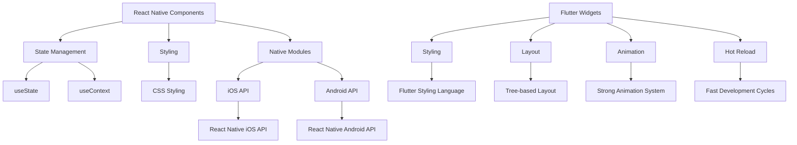

                 

关键词：跨平台移动开发、React Native、Flutter、性能优化、开发工具、社区支持、用户体验

摘要：随着移动设备的普及和跨平台开发需求的增长，React Native和Flutter成为了开发者们青睐的两种框架。本文将深入探讨这两种框架的优缺点、适用场景以及未来的发展趋势，帮助开发者做出更为明智的选择。

## 1. 背景介绍

移动应用的跨平台开发已经成为当前软件行业的重要趋势。开发者们希望通过使用单一的代码库来同时支持iOS和Android平台，以提高开发效率、降低成本和缩短上市时间。React Native和Flutter是两种主流的跨平台移动开发框架，它们分别由Facebook和Google推出，并因其高性能、丰富的功能和强大的社区支持而受到广泛关注。

React Native于2015年首次发布，由Facebook开发，旨在让开发者使用JavaScript和React来构建原生应用的界面。它通过使用原生组件来实现性能优化，并且能够直接调用原生API，这使得React Native在用户体验上接近原生应用。

Flutter是Google于2017年推出的一个全新的UI框架，旨在通过使用Dart语言来构建高性能、高质量的跨平台应用。Flutter通过自己的渲染引擎来渲染UI，因此能够提供一致且美观的界面体验，并且具有快速的开发周期。

## 2. 核心概念与联系

### 2.1 React Native

React Native通过React的组件模型来构建应用界面。它使用JavaScript作为开发语言，结合React的声明式编程范式，使得开发者可以快速构建复杂的用户界面。React Native的核心概念包括：

- **组件（Components）**：React Native的基本构建块，用于构建应用的UI。
- **状态管理（State Management）**：React Native通过useState和useContext等Hook来管理组件的状态。
- **样式（Styling）**：React Native支持CSS样式，开发者可以轻松地为组件设置样式。
- **原生模块（Native Modules）**：React Native通过原生模块来访问原生API，这使得React Native可以调用iOS和Android平台上的特定功能。

### 2.2 Flutter

Flutter通过Dart语言来构建应用，它提供了一个丰富的UI组件库和一套完整的工具链。Flutter的核心概念包括：

- **组件（Widgets）**：Flutter的基本构建块，用于构建应用的UI。
- **样式（Styling）**：Flutter使用自己的样式语言来定义UI样式，这使得开发者可以轻松地创建美观的界面。
- **布局（Layout）**：Flutter的布局系统是基于树状结构，这使得开发者可以灵活地定义复杂的布局。
- **动画（Animation）**：Flutter提供了强大的动画系统，使得开发者可以轻松地为应用添加流畅的动画效果。
- **热重载（Hot Reload）**：Flutter支持热重载，这使得开发者可以快速地看到代码更改的效果，极大地提高了开发效率。

### 2.3 Mermaid 流程图

下面是一个简单的Mermaid流程图，展示了React Native和Flutter的主要组件和流程：



## 3. 核心算法原理 & 具体操作步骤

### 3.1 算法原理概述

React Native和Flutter在渲染UI方面采用了不同的策略。React Native使用原生组件和JavaScript桥接来渲染UI，而Flutter则使用自己的渲染引擎。这两种方法各有优缺点。

### 3.2 算法步骤详解

#### React Native

1. **组件创建**：开发者使用JavaScript编写React组件。
2. **状态管理**：使用useState和useContext等Hook来管理组件的状态。
3. **样式设置**：为组件设置CSS样式。
4. **原生模块调用**：通过原生模块来调用iOS和Android平台上的特定功能。

#### Flutter

1. **组件创建**：开发者使用Dart编写Flutter组件。
2. **样式定义**：使用Flutter的样式语言来定义UI样式。
3. **布局构建**：通过树状结构来构建复杂的布局。
4. **动画实现**：使用Flutter的动画系统来创建流畅的动画效果。

### 3.3 算法优缺点

#### React Native

- **优点**：性能接近原生应用，能够直接调用原生API，丰富的社区支持。
- **缺点**：开发初期成本较高，JavaScript和原生代码的混合可能影响性能。

#### Flutter

- **优点**：快速开发，热重载功能，一致且美观的界面体验。
- **缺点**：由于Dart语言的普及度较低，社区支持相对较弱。

### 3.4 算法应用领域

React Native和Flutter的应用领域非常广泛，包括社交媒体应用、电子商务平台、金融应用等。开发者可以根据项目需求和技术栈选择合适的框架。

## 4. 数学模型和公式 & 详细讲解 & 举例说明

### 4.1 数学模型构建

在移动应用开发中，性能优化是一个重要的考虑因素。下面是一个简单的数学模型，用于评估应用性能：

$$
P = \frac{C \cdot L}{T}
$$

其中，$P$代表性能（Performance），$C$代表计算能力（Computational Capacity），$L$代表负载（Load），$T$代表响应时间（Response Time）。

### 4.2 公式推导过程

1. **计算能力（$C$）**：计算能力取决于硬件配置和软件优化。
2. **负载（$L$）**：负载是指应用运行时需要处理的数据量。
3. **响应时间（$T$）**：响应时间是指从用户操作到应用响应的时间。

### 4.3 案例分析与讲解

假设一个应用的计算能力为1000 MIPS（每秒百万条指令），负载为100 MB，响应时间为5秒。根据上面的公式，我们可以计算出性能为：

$$
P = \frac{1000 \cdot 100}{5} = 200,000 \text{ MIPS}
$$

这意味着该应用的性能为每秒处理200,000条指令。

## 5. 项目实践：代码实例和详细解释说明

### 5.1 开发环境搭建

为了开始使用React Native和Flutter进行开发，我们需要搭建相应的开发环境。

#### React Native

1. 安装Node.js（版本需大于10.0.0）。
2. 安装React Native CLI工具：`npm install -g react-native-cli`。
3. 创建新项目：`react-native init MyProject`。

#### Flutter

1. 安装Dart（版本需大于2.12.0）。
2. 安装Flutter SDK：`flutter install`。
3. 创建新项目：`flutter create MyProject`。

### 5.2 源代码详细实现

#### React Native

下面是一个简单的React Native代码示例：

```javascript
import React from 'react';
import { View, Text, StyleSheet } from 'react-native';

const App = () => {
  return (
    <View style={styles.container}>
      <Text style={styles.welcome}>Hello React Native!</Text>
    </View>
  );
};

const styles = StyleSheet.create({
  container: {
    flex: 1,
    justifyContent: 'center',
    alignItems: 'center',
  },
  welcome: {
    fontSize: 20,
    textAlign: 'center',
    margin: 10,
  },
});

export default App;
```

#### Flutter

下面是一个简单的Flutter代码示例：

```dart
import 'package:flutter/material.dart';

void main() {
  runApp(MyApp());
}

class MyApp extends StatelessWidget {
  @override
  Widget build(BuildContext context) {
    return MaterialApp(
      title: 'Flutter Demo',
      theme: ThemeData(
        primarySwatch: Colors.blue,
      ),
      home: MyHomePage(title: 'Flutter Demo Home Page'),
    );
  }
}

class MyHomePage extends StatefulWidget {
  MyHomePage({Key? key, required this.title}) : super(key: key);
  final String title;

  @override
  _MyHomePageState createState() => _MyHomePageState();
}

class _MyHomePageState extends State<MyHomePage> {
  @override
  Widget build(BuildContext context) {
    return Scaffold(
      appBar: AppBar(
        title: Text(widget.title),
      ),
      body: Center(
        child: Text(
          'Hello Flutter!',
          style: Theme.of(context).textTheme.headline4,
        ),
      ),
    );
  }
}
```

### 5.3 代码解读与分析

React Native和Flutter的代码风格有所不同，但它们都遵循组件化的开发模式。React Native使用JavaScript，而Flutter使用Dart。两种框架都提供了丰富的API和工具来帮助开发者构建高性能的应用。

### 5.4 运行结果展示

运行React Native和Flutter项目后，开发者可以在模拟器或真实设备上看到应用的运行效果。React Native和Flutter都提供了强大的调试工具，以便开发者可以快速定位和修复问题。

## 6. 实际应用场景

### 6.1 社交媒体应用

社交媒体应用通常需要快速响应用户的操作，并且要处理大量的数据。React Native和Flutter都适合这种场景，但Flutter由于其快速的开发周期和强大的动画系统，可能在视觉效果的实现上更具优势。

### 6.2 电子商务平台

电子商务平台需要处理大量的商品信息和用户互动。React Native由于其丰富的社区支持和良好的性能，是构建电子商务平台的一个很好的选择。

### 6.3 金融应用

金融应用需要高度的安全性和可靠性。React Native和Flutter都可以提供这样的性能，但Flutter由于其更接近原生的性能，可能在金融应用开发中更受欢迎。

## 7. 工具和资源推荐

### 7.1 学习资源推荐

- React Native官方文档：[https://reactnative.dev/docs/getting-started](https://reactnative.dev/docs/getting-started)
- Flutter官方文档：[https://flutter.dev/docs/get-started/install](https://flutter.dev/docs/get-started/install)
- 《React Native实战》
- 《Flutter实战：Dart语言与Flutter开发完全解析》

### 7.2 开发工具推荐

- React Native开发工具：Android Studio、Visual Studio Code
- Flutter开发工具：Android Studio、Visual Studio Code、IntelliJ IDEA

### 7.3 相关论文推荐

- "Cross-Platform Mobile App Development with React Native and Flutter" by Lukasz Kucharski and Przemyslaw Gauda
- "Comparing React Native and Flutter for Cross-Platform Mobile Development" by Abhishek Kumar and Sourabh Shrivastava

## 8. 总结：未来发展趋势与挑战

### 8.1 研究成果总结

React Native和Flutter在移动应用开发领域都取得了显著的成果。React Native凭借其社区支持和性能优势，在开发复杂应用时表现出色。Flutter则因其快速开发周期和一致的用户体验，成为许多开发者首选的框架。

### 8.2 未来发展趋势

1. **性能优化**：随着移动设备的性能不断提升，React Native和Flutter将继续优化渲染引擎和编译器，以提高应用的性能。
2. **新功能引入**：开发者将不断探索新的功能，如AR、VR等，这些新功能将推动跨平台开发框架的进步。
3. **生态建设**：社区将不断完善工具链和资源，为开发者提供更好的支持。

### 8.3 面临的挑战

1. **性能瓶颈**：尽管React Native和Flutter在性能上已经取得了很大的进步，但与原生应用相比，仍存在一定的差距。
2. **开发者技能**：Dart语言的普及度较低，可能影响Flutter的社区支持。
3. **市场变化**：随着技术的不断进步，市场将涌现出更多的跨平台开发框架，这对React Native和Flutter来说是一个挑战。

### 8.4 研究展望

未来，React Native和Flutter将继续在移动应用开发领域发挥重要作用。开发者可以根据项目需求选择合适的框架，同时期待这两大框架在未来带来更多的创新和优化。

## 9. 附录：常见问题与解答

### 9.1 React Native和Flutter哪个更好？

这取决于项目的具体需求。React Native更适合需要快速开发复杂应用的项目，而Flutter则适合需要一致且美观的界面体验的项目。

### 9.2 React Native和Flutter哪个性能更好？

React Native在性能上接近原生应用，但Flutter由于使用了自己的渲染引擎，通常在渲染性能上更具优势。

### 9.3 React Native和Flutter哪个社区支持更好？

React Native的社区支持更广泛，但Flutter正在迅速发展，社区资源也在不断增加。

### 9.4 React Native和Flutter哪个更适合新手？

React Native更适合新手，因为JavaScript是一个广泛使用的语言，而Flutter则更适合有Dart语言基础的开发者。

---

作者：禅与计算机程序设计艺术 / Zen and the Art of Computer Programming
----------------------------------------------------------------

这篇文章详细比较了React Native和Flutter这两大流行的跨平台移动开发框架，探讨了它们的优缺点、适用场景以及未来发展趋势。希望这篇文章能为开发者提供有价值的参考，帮助他们做出明智的选择。随着技术的不断进步，React Native和Flutter将继续在移动应用开发领域发挥重要作用。让我们一起期待未来的创新和优化！

