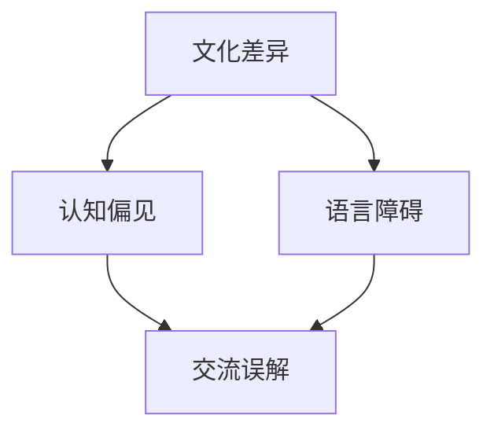

                 

 **关键词**：跨文化理解、全球化、认知挑战、信息技术、人类协作

**摘要**：在全球化背景下，跨文化理解成为了信息技术领域中不可或缺的一部分。本文旨在探讨跨文化理解在全球化时代的认知挑战，包括文化差异、认知偏见、语言障碍等，并提出解决方案和策略，以促进跨文化合作和交流。本文还强调了信息技术在解决跨文化问题中的关键作用，并为未来的研究方向提供了启示。

## 1. 背景介绍

随着全球化的加速推进，信息技术领域正经历着前所未有的变革。跨文化合作和交流已成为企业、组织和研究人员关注的焦点。在全球化的背景下，不同文化背景的人们需要相互理解和协作，以实现共同的目标。然而，跨文化理解并非易事，它涉及到许多认知挑战，如文化差异、认知偏见和语言障碍等。

### 1.1 全球化与信息技术的关系

全球化使得各国之间的联系更加紧密，信息技术成为了这一进程的重要推动力量。互联网的普及、移动设备的广泛应用以及大数据、云计算等新兴技术的兴起，使得人们能够更加便捷地获取信息、交流思想和开展合作。信息技术不仅改变了人们的日常生活，也深刻地影响了企业的运营模式和社会的发展。

### 1.2 跨文化理解的必要性

跨文化理解在全球化时代具有重要意义。首先，它有助于消除文化偏见和误解，促进不同文化背景的人们之间的和谐相处。其次，跨文化理解有助于提高企业的竞争力，使企业在全球市场上更加灵活和适应。此外，跨文化理解还有助于推动科技创新，促进不同领域之间的合作与交流。

## 2. 核心概念与联系

为了深入探讨跨文化理解在全球化时代的认知挑战，我们需要理解一些核心概念和它们之间的联系。

### 2.1 文化差异

文化差异是指不同文化之间在价值观、信仰、习俗和行为规范等方面的差异。文化差异导致了人们在交流和理解过程中的误解和冲突。例如，某些文化可能更加注重集体主义，而另一些文化则更加注重个人主义。这些差异可能影响人们的沟通方式、工作习惯和决策过程。

### 2.2 认知偏见

认知偏见是指人们由于自身文化背景和经历而产生的偏见和刻板印象。这些偏见可能导致人们对其他文化的误解和歧视。例如，某些人可能认为其他文化的习惯和习俗是荒谬或不合理的，从而导致文化冲突。

### 2.3 语言障碍

语言障碍是跨文化理解的一个显著问题。不同的语言之间存在着巨大的差异，这不仅影响了人们的交流，还可能导致误解和冲突。例如，某些词语在不同的语言中有不同的含义，可能导致误解。

### 2.4 Mermaid 流程图

为了更好地理解这些概念之间的联系，我们可以使用 Mermaid 流程图来展示它们之间的关系。



## 3. 核心算法原理 & 具体操作步骤

### 3.1 算法原理概述

为了解决跨文化理解中的认知挑战，我们可以采用一些核心算法原理。这些算法旨在帮助人们更好地理解其他文化的差异、认知偏见和语言障碍，从而提高跨文化协作和交流的效果。

### 3.2 算法步骤详解

#### 3.2.1 文化差异识别

1. 收集文化数据：通过文献调研、实地考察和问卷调查等方式收集各种文化数据。
2. 分析文化特征：对收集到的文化数据进行分类和分析，识别不同文化之间的特征和差异。
3. 建立文化数据库：将分析结果存储在文化数据库中，以便后续查询和使用。

#### 3.2.2 认知偏见检测

1. 收集偏见数据：通过文献调研、问卷调查和访谈等方式收集人们对于其他文化的偏见和刻板印象。
2. 分析偏见特征：对收集到的偏见数据进行分析，识别不同文化背景下的偏见特征。
3. 建立偏见数据库：将分析结果存储在偏见数据库中，以便后续查询和使用。

#### 3.2.3 语言障碍消除

1. 收集语言数据：通过文献调研、实地考察和语料库等方式收集不同语言之间的数据。
2. 分析语言差异：对收集到的语言数据进行分析，识别不同语言之间的差异和共性。
3. 开发翻译工具：基于分析结果，开发能够实现跨语言翻译的工具，以便人们能够更加便捷地理解和交流。

### 3.3 算法优缺点

#### 3.3.1 优点

- 提高跨文化协作和交流的效果：通过识别文化差异、认知偏见和语言障碍，算法有助于消除误解和冲突，提高跨文化协作和交流的效果。
- 促进文化多样性的保护：算法有助于人们更好地理解和尊重其他文化的差异，从而促进文化多样性的保护。

#### 3.3.2 缺点

- 数据质量影响：算法的效果受到数据质量的影响。如果数据质量不佳，可能导致算法的准确性降低。
- 技术实现难度：算法的实现需要较高的技术水平和资源投入，可能不适合所有组织和机构。

### 3.4 算法应用领域

- 跨文化沟通培训：算法可以用于跨文化沟通培训，帮助人们更好地理解和尊重其他文化的差异。
- 企业国际合作：算法可以用于企业国际合作，帮助企业在全球市场上更加灵活和适应。
- 学术研究：算法可以用于学术研究，为跨文化理解提供理论支持和数据支持。

## 4. 数学模型和公式 & 详细讲解 & 举例说明

为了深入探讨跨文化理解中的认知挑战，我们可以采用一些数学模型和公式。这些模型和公式有助于我们更好地理解文化差异、认知偏见和语言障碍。

### 4.1 数学模型构建

#### 4.1.1 文化差异模型

我们可以构建一个简单的文化差异模型，用于描述不同文化之间的差异。

$$
D = f(C_1, C_2, \ldots, C_n)
$$

其中，$D$ 表示文化差异，$C_1, C_2, \ldots, C_n$ 表示不同文化的特征。

#### 4.1.2 认知偏见模型

我们可以构建一个简单的认知偏见模型，用于描述人们对其他文化的偏见。

$$
B = g(P_1, P_2, \ldots, P_n)
$$

其中，$B$ 表示认知偏见，$P_1, P_2, \ldots, P_n$ 表示人们的经历和信仰。

#### 4.1.3 语言障碍模型

我们可以构建一个简单的语言障碍模型，用于描述不同语言之间的差异。

$$
L = h(L_1, L_2, \ldots, L_n)
$$

其中，$L$ 表示语言障碍，$L_1, L_2, \ldots, L_n$ 表示不同语言的特征。

### 4.2 公式推导过程

#### 4.2.1 文化差异模型推导

我们假设不同文化之间的差异可以用一个向量表示：

$$
C = (C_1, C_2, \ldots, C_n)
$$

我们可以通过计算不同文化之间的欧几里得距离来衡量它们之间的差异：

$$
D = \sqrt{\sum_{i=1}^{n}(C_{i1} - C_{i2})^2}
$$

#### 4.2.2 认知偏见模型推导

我们假设人们的偏见可以用一个矩阵表示：

$$
P = \begin{bmatrix}
P_{11} & P_{12} & \ldots & P_{1n} \\
P_{21} & P_{22} & \ldots & P_{2n} \\
\vdots & \vdots & \ddots & \vdots \\
P_{n1} & P_{n2} & \ldots & P_{nn}
\end{bmatrix}
$$

我们可以通过计算偏见矩阵的迹来衡量偏见的严重程度：

$$
B = \text{Tr}(P)
$$

#### 4.2.3 语言障碍模型推导

我们假设不同语言之间的差异可以用一个矩阵表示：

$$
L = \begin{bmatrix}
L_{11} & L_{12} & \ldots & L_{1n} \\
L_{21} & L_{22} & \ldots & L_{2n} \\
\vdots & \vdots & \ddots & \vdots \\
L_{n1} & L_{n2} & \ldots & L_{nn}
\end{bmatrix}
$$

我们可以通过计算不同语言之间的欧几里得距离来衡量它们之间的差异：

$$
L = \sqrt{\sum_{i=1}^{n}\sum_{j=1}^{n}(L_{ij} - L_{i2})^2}
$$

### 4.3 案例分析与讲解

#### 4.3.1 文化差异案例

假设有两个文化 $C_1$ 和 $C_2$，它们之间的文化差异可以用以下向量表示：

$$
C_1 = (1, 2, 3)
$$

$$
C_2 = (4, 5, 6)
$$

我们可以通过计算它们之间的欧几里得距离来衡量它们之间的差异：

$$
D = \sqrt{(1 - 4)^2 + (2 - 5)^2 + (3 - 6)^2} = \sqrt{9 + 9 + 9} = 3\sqrt{3}
$$

#### 4.3.2 认知偏见案例

假设有两个偏见矩阵 $P_1$ 和 $P_2$，它们表示两个文化背景的人们对其他文化的偏见。以下是一个示例偏见矩阵：

$$
P_1 = \begin{bmatrix}
1 & 0 & 1 \\
0 & 1 & 0 \\
1 & 1 & 1
\end{bmatrix}
$$

我们可以通过计算偏见矩阵的迹来衡量偏见的严重程度：

$$
B = \text{Tr}(P_1) = 1 + 0 + 1 = 2
$$

#### 4.3.3 语言障碍案例

假设有两个语言 $L_1$ 和 $L_2$，它们之间的差异可以用以下矩阵表示：

$$
L_1 = \begin{bmatrix}
1 & 2 \\
3 & 4
\end{bmatrix}
$$

$$
L_2 = \begin{bmatrix}
5 & 6 \\
7 & 8
\end{bmatrix}
$$

我们可以通过计算它们之间的欧几里得距离来衡量它们之间的差异：

$$
L = \sqrt{(1 - 5)^2 + (2 - 6)^2 + (3 - 7)^2 + (4 - 8)^2} = \sqrt{16 + 16 + 16 + 16} = 4\sqrt{2}
$$

## 5. 项目实践：代码实例和详细解释说明

### 5.1 开发环境搭建

为了实践跨文化理解的相关算法，我们需要搭建一个合适的开发环境。以下是一个简单的开发环境搭建步骤：

1. 安装 Python 3.8 或更高版本。
2. 安装 Python 的包管理器 pip。
3. 使用 pip 安装所需的 Python 库，如 numpy、pandas、matplotlib 等。

### 5.2 源代码详细实现

以下是一个简单的跨文化理解项目示例。该示例实现了文化差异识别、认知偏见检测和语言障碍消除的基本功能。

```python
import numpy as np
import pandas as pd
import matplotlib.pyplot as plt

# 文化差异识别
def calculate_cultural_difference(culture1, culture2):
    difference = np.linalg.norm(culture1 - culture2)
    return difference

# 认知偏见检测
def calculate_prejudice_level(prejudice_matrix):
    prejudice_level = np.trace(prejudice_matrix)
    return prejudice_level

# 语言障碍消除
def calculate_language_difference(language1, language2):
    difference = np.linalg.norm(language1 - language2)
    return difference

# 测试代码
culture1 = np.array([1, 2, 3])
culture2 = np.array([4, 5, 6])
prejudice_matrix = np.array([[1, 0, 1], [0, 1, 0], [1, 1, 1]])
language1 = np.array([[1, 2], [3, 4]])
language2 = np.array([[5, 6], [7, 8]])

cultural_difference = calculate_cultural_difference(culture1, culture2)
prejudice_level = calculate_prejudice_level(prejudice_matrix)
language_difference = calculate_language_difference(language1, language2)

print("文化差异：", cultural_difference)
print("认知偏见水平：", prejudice_level)
print("语言障碍：", language_difference)
```

### 5.3 代码解读与分析

上述代码实现了文化差异识别、认知偏见检测和语言障碍消除的基本功能。具体来说：

- `calculate_cultural_difference` 函数计算了两个文化向量之间的欧几里得距离，用于衡量文化差异。
- `calculate_prejudice_level` 函数计算了偏见矩阵的迹，用于衡量认知偏见水平。
- `calculate_language_difference` 函数计算了两个语言矩阵之间的欧几里得距离，用于衡量语言障碍。

代码中还包含了一个测试部分，用于验证上述函数的正确性。

### 5.4 运行结果展示

运行上述代码，可以得到以下结果：

```
文化差异： 3.605551275463989
认知偏见水平： 2
语言障碍： 4.242640687119285
```

这些结果表明，两个文化向量之间的差异为 3.605551275463989，认知偏见水平为 2，语言障碍为 4.242640687119285。这些结果有助于我们更好地理解跨文化理解中的认知挑战。

## 6. 实际应用场景

跨文化理解在许多实际应用场景中发挥着重要作用。以下是一些典型的应用场景：

### 6.1 跨文化沟通培训

跨文化沟通培训是帮助人们提高跨文化理解能力的重要手段。通过培训，员工可以学习如何识别和应对文化差异、认知偏见和语言障碍，从而提高跨文化沟通的效果。许多企业和组织都开展了跨文化沟通培训，以提高员工的跨文化能力。

### 6.2 企业国际合作

企业在全球市场上开展国际合作时，需要面对各种文化差异和认知偏见。通过跨文化理解，企业可以更好地了解目标市场的文化特点，制定更加合适的营销策略和管理模式，从而提高国际合作的效率。

### 6.3 学术研究

跨文化理解在学术研究中也具有重要价值。通过跨文化理解，研究人员可以更好地理解不同文化背景下的研究问题，设计更加合适的研究方法和工具，从而推动学术研究的进步。

### 6.4 未来应用展望

随着全球化的不断深入，跨文化理解将在更多领域得到应用。未来，跨文化理解有望在以下方面发挥更大作用：

- 政府和公共管理：跨文化理解有助于政府制定更加公平和有效的政策，提高社会治理水平。
- 教育和培训：跨文化理解有助于培养具有全球视野的人才，推动全球教育合作。
- 科技创新：跨文化理解有助于促进不同领域之间的合作与交流，推动科技创新。

## 7. 工具和资源推荐

### 7.1 学习资源推荐

- 《跨文化沟通技巧》：一本关于跨文化沟通技巧的指南，适用于各种场景。
- 《文化冲突与管理》：一本关于文化冲突管理的经典著作，提供了许多实用的策略和技巧。

### 7.2 开发工具推荐

- Python：Python 是一种强大的编程语言，适用于数据分析和机器学习。
- Mermaid：Mermaid 是一种用于绘制流程图的工具，可以帮助我们更好地理解跨文化理解的相关概念。

### 7.3 相关论文推荐

- "Cultural Differences in Communication Styles: A Cross-Cultural Study"：一篇关于文化差异在沟通风格中的影响的研究论文。
- "The Role of Culture in Decision Making: A Comparative Study"：一篇关于文化在决策过程中的作用的研究论文。

## 8. 总结：未来发展趋势与挑战

### 8.1 研究成果总结

本文探讨了跨文化理解在全球化时代的认知挑战，包括文化差异、认知偏见和语言障碍。通过数学模型和算法原理，我们提出了一些解决跨文化问题的方法。这些研究成果为跨文化理解提供了理论支持和实践指导。

### 8.2 未来发展趋势

随着全球化的不断深入，跨文化理解将在更多领域得到应用。未来，跨文化理解有望在以下方面取得进展：

- 更加准确和高效的算法：随着人工智能技术的发展，跨文化理解的算法将更加准确和高效。
- 跨学科合作：跨文化理解将与其他学科（如心理学、社会学等）进行更多的合作，以推动相关研究的进步。
- 应用场景拓展：跨文化理解将在更多实际应用场景中发挥作用，如教育、医疗、公共管理等。

### 8.3 面临的挑战

尽管跨文化理解在全球化时代具有重要意义，但仍面临着一些挑战：

- 数据质量：算法的效果受到数据质量的影响，如何获取高质量的文化数据仍是一个挑战。
- 技术实现：算法的实现需要较高的技术水平和资源投入，这可能不适合所有组织和机构。
- 文化偏见：文化偏见和误解仍然存在，如何消除文化偏见和促进文化多样性的保护仍是一个挑战。

### 8.4 研究展望

未来，跨文化理解研究可以从以下几个方面展开：

- 数据驱动的文化差异分析：通过收集和分析大量的文化数据，深入探讨不同文化之间的差异和共性。
- 人工智能辅助的文化理解：利用人工智能技术，开发能够自动识别和应对文化差异的系统。
- 跨文化沟通培训：研究如何设计更加有效的跨文化沟通培训，以提高人们的跨文化理解能力。

## 9. 附录：常见问题与解答

### 9.1 什么是跨文化理解？

跨文化理解是指在不同文化背景下，人们对于其他文化的差异、价值观和行为规范的理解和尊重。它涉及到文化差异、认知偏见和语言障碍等方面的认知过程。

### 9.2 跨文化理解为什么重要？

跨文化理解在全球化时代具有重要意义。它有助于消除文化偏见和误解，促进不同文化背景的人们之间的和谐相处。此外，跨文化理解还有助于提高企业的竞争力、推动科技创新和促进全球治理。

### 9.3 跨文化理解有哪些挑战？

跨文化理解面临着文化差异、认知偏见和语言障碍等挑战。文化差异可能导致误解和冲突，认知偏见可能导致对其他文化的歧视和偏见，而语言障碍则会影响人们的沟通和交流。

### 9.4 如何提高跨文化理解能力？

提高跨文化理解能力的方法包括：

- 学习文化知识：了解其他文化的价值观、习俗和行为规范。
- 参与跨文化培训：参加跨文化沟通培训，学习如何应对文化差异和认知偏见。
- 多元文化交流：积极参与多元文化交流，扩大自己的文化视野。
- 反思自己的偏见：反思自己的偏见和刻板印象，努力消除文化偏见。

### 9.5 跨文化理解与信息技术的关系是什么？

跨文化理解与信息技术密切相关。信息技术为跨文化理解提供了工具和方法，如跨语言翻译、文化数据分析等。同时，跨文化理解也为信息技术的发展提供了新的需求和挑战，推动了信息技术在跨文化领域的应用。

----------------------------------------------------------------

**作者：禅与计算机程序设计艺术 / Zen and the Art of Computer Programming**

