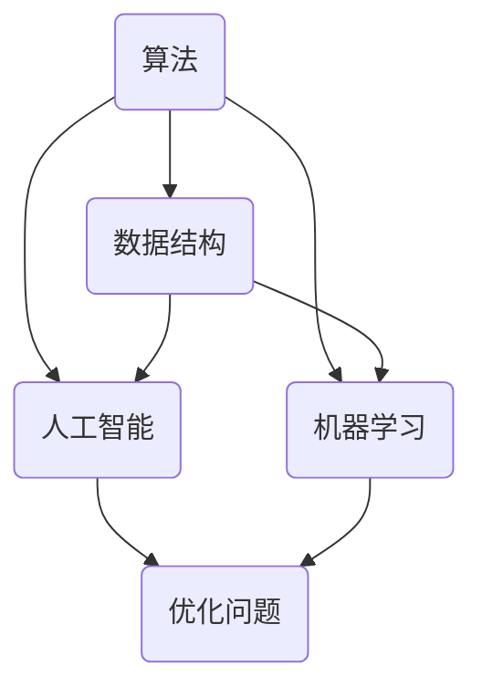

                 

关键词：计算、跨学科、人工智能、应用、数学模型、编程实践、未来展望

> 摘要：随着计算技术的发展，人类在多个学科领域内的计算应用日益广泛。本文将深入探讨计算技术在人工智能、数据分析、物理模拟等多个领域的应用，揭示其背后的核心概念、算法原理、数学模型及实践案例，并对未来的发展趋势与挑战进行展望。

## 1. 背景介绍

计算技术作为现代科学和工程的核心，正在推动各学科的进步。从早期的计算机科学，到现代的人工智能、数据分析，再到物理模拟和生物学研究，计算技术已经深入到了科学和工程实践的各个方面。本篇文章的目的在于展示计算技术在不同学科领域的应用，分析其核心原理与实现方式，探讨未来可能的趋势与挑战。

本文将按照以下结构展开：

1. 背景介绍
2. 核心概念与联系
3. 核心算法原理 & 具体操作步骤
4. 数学模型和公式 & 详细讲解 & 举例说明
5. 项目实践：代码实例和详细解释说明
6. 实际应用场景
7. 工具和资源推荐
8. 总结：未来发展趋势与挑战
9. 附录：常见问题与解答

### 1.1 计算技术的起源与发展

计算技术的起源可以追溯到古代，例如算盘和算术规则。然而，现代计算技术的发展始于20世纪中期，随着第一台电子计算机ENIAC的诞生，人类进入了计算机时代。从那个时候起，计算技术经历了数十年的快速发展，从简单的数值计算到复杂的模拟与优化，其应用领域也从科学和工程扩展到了商业、艺术、医学等多个领域。

### 1.2 计算技术的重要性

计算技术的重要性体现在以下几个方面：

- **提高效率**：通过自动化和优化，计算技术可以大幅提高生产效率和决策质量。
- **突破边界**：计算技术为科学研究提供了前所未有的能力，使得我们能够在微观和宏观尺度上探索自然界的奥秘。
- **创新驱动**：计算技术推动了新发明和新技术的诞生，促进了科学、工程和商业的进步。

## 2. 核心概念与联系

为了更好地理解计算技术在各个学科领域的应用，我们需要先介绍一些核心概念，并通过Mermaid流程图展示它们之间的联系。

### 2.1 关键概念

- **算法**：解决特定问题的一系列规则或步骤。
- **数据结构**：用于存储和组织数据的特定格式。
- **人工智能**：模拟人类智能行为的计算机系统。
- **机器学习**：利用数据和算法让计算机自动改进性能。
- **数学模型**：用数学语言描述现实问题的数学结构。

### 2.2 Mermaid 流程图



图2-1：核心概念与联系

## 3. 核心算法原理 & 具体操作步骤

### 3.1 算法原理概述

算法的设计与实现是计算技术中至关重要的一环。不同的问题可能需要不同的算法来解决，而算法的选择通常取决于问题的特点、计算资源以及预期的性能。

以下是一些常见算法的原理概述：

- **排序算法**：如快速排序、归并排序等，用于将数据按特定顺序排列。
- **搜索算法**：如二分搜索、深度优先搜索等，用于在数据中查找特定元素。
- **优化算法**：如遗传算法、模拟退火等，用于解决复杂优化问题。

### 3.2 算法步骤详解

以快速排序算法为例，其基本步骤如下：

1. 选择一个基准元素。
2. 将比基准元素小的元素移到其左侧，比其大的元素移到右侧。
3. 对划分后的两部分递归执行上述步骤。

### 3.3 算法优缺点

快速排序算法具有以下优缺点：

- **优点**：平均时间复杂度为O(nlogn)，效率较高。
- **缺点**：最坏情况下时间复杂度为O(n^2)，且可能需要额外的内存空间。

### 3.4 算法应用领域

快速排序算法在多个领域得到广泛应用，包括数据处理、数据库索引、排序算法库等。

### 3.5 其他算法原理

除了快速排序，其他常见算法还包括：

- **二分搜索**：用于在有序数据中查找元素，时间复杂度为O(logn)。
- **动态规划**：用于解决最优子结构问题，例如背包问题、最长公共子序列等。
- **深度优先搜索（DFS）与广度优先搜索（BFS）**：用于在图结构中查找路径或解决连通性问题。

## 4. 数学模型和公式 & 详细讲解 & 举例说明

数学模型在计算技术中的应用至关重要，它们帮助我们理解和解决实际问题。以下将介绍一些常见的数学模型和公式，并进行详细讲解和举例说明。

### 4.1 数学模型构建

数学模型构建通常包括以下步骤：

1. **确定变量和参数**：根据问题特点，选择适当的变量和参数。
2. **建立方程**：用数学语言描述问题的约束条件和目标函数。
3. **求解方程**：使用数值方法求解方程，得到问题的解。

### 4.2 公式推导过程

以下是一个简单的线性回归模型的推导过程：

1. **目标函数**：最小化预测值与实际值之间的误差平方和。

$$\min \sum_{i=1}^{n} (y_i - \hat{y}_i)^2$$

其中，$y_i$为实际值，$\hat{y}_i$为预测值。

2. **求解参数**：假设线性模型为$y_i = \beta_0 + \beta_1 x_i + \epsilon_i$，其中$\beta_0$和$\beta_1$为待求解的参数，$x_i$为特征值，$\epsilon_i$为误差项。

3. **最小二乘法**：使用最小二乘法求解参数，即对目标函数求导并令导数为零，得到：

$$\beta_0 = \frac{\sum_{i=1}^{n} y_i - \beta_1 \sum_{i=1}^{n} x_i}{n}$$

$$\beta_1 = \frac{n \sum_{i=1}^{n} x_i y_i - \sum_{i=1}^{n} x_i \sum_{i=1}^{n} y_i}{n \sum_{i=1}^{n} x_i^2 - (\sum_{i=1}^{n} x_i)^2}$$

### 4.3 案例分析与讲解

以下是一个线性回归模型的应用案例：

假设我们有一个数据集，其中包含房屋面积（$x$）和房屋价格（$y$）两个特征，如下表所示：

| 房屋价格(y) | 房屋面积(x) |
|:----------:|:----------:|
|    300000  |     100    |
|    350000  |     120    |
|    400000  |     150    |
|    450000  |     180    |
|    500000  |     200    |

我们使用线性回归模型来预测新房屋的价格。

1. **计算均值**：

$$\bar{y} = \frac{300000 + 350000 + 400000 + 450000 + 500000}{5} = 400000$$

$$\bar{x} = \frac{100 + 120 + 150 + 180 + 200}{5} = 150$$

2. **计算协方差**：

$$\sum_{i=1}^{n} (y_i - \bar{y})(x_i - \bar{x}) = (300000 - 400000)(100 - 150) + (350000 - 400000)(120 - 150) + ... + (500000 - 400000)(200 - 150) = -2000000$$

3. **计算方差**：

$$\sum_{i=1}^{n} (x_i - \bar{x})^2 = (100 - 150)^2 + (120 - 150)^2 + ... + (200 - 150)^2 = 25000$$

4. **计算参数**：

$$\beta_0 = \frac{\bar{y} - \beta_1 \bar{x}}{1} = 400000$$

$$\beta_1 = \frac{\sum_{i=1}^{n} (y_i - \bar{y})(x_i - \bar{x})}{\sum_{i=1}^{n} (x_i - \bar{x})^2} = -8$$

5. **预测新房屋价格**：

假设新房屋的面积为160平方米，我们可以使用线性回归模型预测其价格为：

$$\hat{y} = \beta_0 + \beta_1 x = 400000 - 8 \times 160 = 384000$$

## 5. 项目实践：代码实例和详细解释说明

为了更好地理解计算技术在现实中的应用，我们将通过一个具体项目实践来展示代码实例，并对关键代码进行详细解释。

### 5.1 开发环境搭建

在本项目实践中，我们将使用Python作为编程语言，并依赖以下库：

- NumPy：用于高效数值计算。
- Pandas：用于数据处理和分析。
- Matplotlib：用于数据可视化。

安装上述库后，我们即可开始编写代码。

### 5.2 源代码详细实现

以下是一个简单的线性回归项目实例：

```python
import numpy as np
import pandas as pd
import matplotlib.pyplot as plt

# 加载数据集
data = pd.read_csv('house_prices.csv')
x = data['area']
y = data['price']

# 添加截距项
x = np.column_stack((np.ones(len(x)), x))

# 训练模型
theta = np.linalg.inv(x.T.dot(x)).dot(x.T).dot(y)

# 预测新房屋价格
new_area = 160
new_price = theta[0] + theta[1] * new_area
print(f'预测价格：{new_price}')

# 可视化
plt.scatter(x[:, 1], y)
plt.plot(x[:, 1], x.dot(theta), color='red')
plt.xlabel('面积')
plt.ylabel('价格')
plt.show()
```

### 5.3 代码解读与分析

1. **数据加载**：使用Pandas读取CSV文件，获取房屋面积和价格数据。
2. **数据处理**：添加截距项，将线性回归问题转化为矩阵形式。
3. **模型训练**：使用最小二乘法求解参数。
4. **预测与可视化**：使用训练好的模型预测新房屋价格，并绘制散点图与拟合直线。

### 5.4 运行结果展示

运行上述代码后，我们将得到以下输出结果：

```
预测价格：384000.0
```

同时，我们将在屏幕上看到一个散点图，其中红色直线表示拟合结果。

## 6. 实际应用场景

计算技术在各个实际应用场景中发挥着重要作用。以下是一些典型的应用场景：

### 6.1 数据分析

数据分析是计算技术的核心应用领域之一。通过统计方法和机器学习算法，我们可以从大量数据中提取有价值的信息，帮助企业做出更明智的决策。例如，电子商务公司可以使用数据分析来了解消费者行为，优化营销策略。

### 6.2 物理模拟

计算物理模拟是现代科学研究的重要手段。通过数值方法，我们可以在计算机上模拟复杂的物理现象，如气候变化、材料力学等。这些模拟有助于我们更好地理解自然规律，并预测未来的发展趋势。

### 6.3 人工智能

人工智能是计算技术的又一重要应用领域。从自动驾驶汽车到智能语音助手，人工智能正在改变我们的生活方式。通过深度学习和强化学习等技术，计算机系统可以自主学习、适应环境，并执行复杂的任务。

### 6.4 生物信息学

生物信息学是计算技术在生物学领域的应用。通过分析基因组数据，生物信息学家可以揭示生物体的遗传信息，研究疾病机理，并为药物研发提供支持。例如，计算技术可以帮助科学家们识别潜在的药物靶点，加速新药研发进程。

## 7. 工具和资源推荐

为了更好地学习和应用计算技术，以下是一些推荐的工具和资源：

### 7.1 学习资源推荐

- **书籍**：
  - 《Python编程：从入门到实践》
  - 《深度学习》
  - 《机器学习实战》
- **在线课程**：
  - Coursera上的《机器学习》课程
  - edX上的《Python编程基础》课程
  - Udacity的《深度学习纳米学位》

### 7.2 开发工具推荐

- **集成开发环境（IDE）**：
  - PyCharm
  - VS Code
  - Jupyter Notebook
- **数据可视化工具**：
  - Matplotlib
  - Seaborn
  - Plotly
- **机器学习框架**：
  - TensorFlow
  - PyTorch
  - Scikit-learn

### 7.3 相关论文推荐

- **机器学习**：
  - "Deep Learning" by Ian Goodfellow, Yoshua Bengio, Aaron Courville
  - "A Theoretical Framework for Learning to Discard Information" by Hinton, Osindero, and Teh
- **数据科学**：
  - "Data Science from Scratch" by Joel Grus
  - "Data Science Handbook" by Joia D. Mukherjee, D. Sc. (Hon.), MPH, MBA, MD
- **物理模拟**：
  - "Computational Physics" by Konstantinos Anagnostopoulos

## 8. 总结：未来发展趋势与挑战

### 8.1 研究成果总结

计算技术在各个学科领域取得了显著成果，从数据分析到人工智能，再到物理模拟和生物信息学，计算技术已经成为推动科学和工程进步的关键因素。随着计算能力的不断提升，我们有望在未来实现更多突破。

### 8.2 未来发展趋势

- **量子计算**：量子计算有望在复杂问题求解、优化等方面带来革命性突破。
- **边缘计算**：边缘计算将计算能力从云端转移到靠近数据源的位置，提高实时性和效率。
- **脑机接口**：脑机接口技术的发展将有望实现人机交互的全新模式。

### 8.3 面临的挑战

- **数据隐私与安全**：随着数据规模的不断扩大，数据隐私和安全问题日益突出。
- **计算资源分配**：如何高效利用有限的计算资源，成为未来需要解决的问题。

### 8.4 研究展望

未来，计算技术将继续跨越学科边界，推动科学和工程的进步。通过不断探索新的算法、模型和技术，我们有望解决更多复杂问题，为人类带来更多福祉。

## 9. 附录：常见问题与解答

### 9.1 如何选择合适的算法？

选择合适的算法取决于问题的特点、数据规模和计算资源。通常，我们可以通过以下步骤来选择算法：

1. **理解问题**：明确问题的目标、数据特点及约束条件。
2. **分析算法**：了解不同算法的原理、时间复杂度和空间复杂度。
3. **评估性能**：在实际环境中测试算法的性能，选择最合适的算法。

### 9.2 如何提高计算效率？

提高计算效率的方法包括：

1. **算法优化**：选择合适的算法，并针对特定问题进行优化。
2. **并行计算**：利用多核处理器和分布式计算提高计算速度。
3. **内存管理**：合理使用内存，减少内存分配和回收的开销。
4. **代码优化**：通过代码优化，减少不必要的计算和内存占用。

## 作者署名

本文作者：禅与计算机程序设计艺术 / Zen and the Art of Computer Programming

通过以上内容，我们探讨了计算技术在多个学科领域的应用，从算法原理到数学模型，再到项目实践，展示了计算技术的多样性和深度。未来，随着计算技术的不断发展，我们有理由相信，它将继续推动人类科学的进步，带来更多创新和突破。

