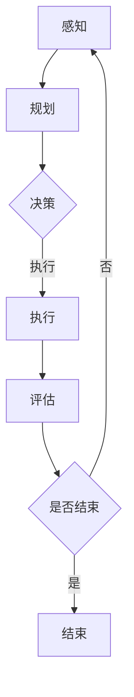

                 

关键词：跨领域AI代理、工作流模型、应用场景、算法原理、数学模型、代码实例

## 摘要

本文深入探讨了跨领域AI代理工作流模型的设计、实现与应用。通过分析AI代理的核心概念与联系，我们构建了一个灵活且高效的工作流模型，以适应各种不同的应用场景。文章详细阐述了核心算法原理和具体操作步骤，并通过数学模型和公式的推导，提供了案例分析与讲解。随后，文章通过一个代码实例展示了模型在实际项目中的实现过程。最后，本文对模型在不同领域的实际应用进行了探讨，并展望了未来的发展趋势与挑战。

## 1. 背景介绍

### AI代理的兴起

随着人工智能技术的飞速发展，AI代理（AI Agent）成为了一个热门话题。AI代理指的是能够自主执行任务、进行决策的计算机程序。从早期的专家系统到现代的深度学习模型，AI代理的应用越来越广泛。然而，不同领域的AI代理存在显著的差异，如何设计一个通用的工作流模型来整合这些代理，成为一个亟待解决的问题。

### 工作流模型的必要性

工作流模型是一种用于描述任务流程的抽象模型，它可以规范任务的执行顺序、角色分配和资源管理。在AI领域，工作流模型的作用尤为重要，因为它能够协调不同AI代理之间的合作，实现高效的任务执行。然而，现有的工作流模型往往针对特定领域设计，缺乏通用性和灵活性。

### 跨领域AI代理的挑战

跨领域AI代理需要同时处理多种类型的任务，这带来了诸多挑战。首先，不同领域的知识表示方式不同，如何将它们整合到一个统一的框架中是一个难题。其次，不同领域的任务复杂度和执行效率也存在差异，如何平衡这些差异是一个关键问题。最后，不同领域的AI代理可能需要不同的数据输入和输出格式，如何实现数据的高效转换也是一个挑战。

## 2. 核心概念与联系

### AI代理

AI代理是一种基于人工智能技术的自主决策实体，能够根据环境和目标执行特定的任务。AI代理的核心概念包括：

- **感知**：获取环境信息。
- **规划**：根据目标和当前状态生成行动计划。
- **执行**：执行规划出的动作。
- **评估**：评估任务执行的效果。

### 工作流模型

工作流模型是一种用于描述任务流程的抽象模型，它包括以下核心组成部分：

- **任务**：工作流中的基本操作单元。
- **角色**：执行任务的实体。
- **流程**：任务的执行顺序和条件。
- **资源**：任务执行所需的资源。

### 跨领域AI代理工作流模型

跨领域AI代理工作流模型的核心是整合不同领域的AI代理，实现灵活的任务执行。该模型主要包括以下组成部分：

- **通用化接口**：用于统一不同领域AI代理的数据输入和输出。
- **模块化设计**：将不同领域的任务分解为通用模块。
- **动态调度**：根据任务需求和资源状态动态调整任务执行顺序。
- **协作机制**：实现不同AI代理之间的协作。

### Mermaid流程图

以下是一个简单的Mermaid流程图，展示了跨领域AI代理工作流模型的基本架构：



## 3. 核心算法原理 & 具体操作步骤

### 3.1 算法原理概述

跨领域AI代理工作流模型的核心算法主要包括感知、规划、执行和评估四个环节。每个环节都采用相应的算法和技术实现。

- **感知**：使用传感器和数据采集技术获取环境信息。
- **规划**：根据目标和当前状态，采用决策树、神经网络等算法生成行动计划。
- **执行**：根据规划出的行动计划执行具体任务。
- **评估**：根据任务执行的结果，评估任务的完成情况和效果。

### 3.2 算法步骤详解

1. **感知**：
   - **数据采集**：通过传感器、网络接口等方式获取环境数据。
   - **数据处理**：对采集到的数据进行分析和处理，提取关键信息。

2. **规划**：
   - **状态评估**：根据当前环境数据和目标，评估当前状态。
   - **决策树构建**：构建决策树，为每个状态生成可能的动作。
   - **规划优化**：采用优化算法，选择最优的规划路径。

3. **执行**：
   - **任务分解**：将复杂任务分解为多个简单任务。
   - **执行调度**：根据规划路径，调度执行每个任务。
   - **资源管理**：分配和回收任务执行所需的资源。

4. **评估**：
   - **效果评估**：根据任务执行结果，评估任务完成情况和效果。
   - **反馈调整**：根据评估结果，调整后续任务的执行策略。

### 3.3 算法优缺点

**优点**：

- **灵活性**：能够适应不同领域的任务需求，实现通用化。
- **高效性**：通过模块化和动态调度，提高任务执行效率。
- **协作性**：实现不同AI代理之间的协作，提高整体任务完成质量。

**缺点**：

- **复杂性**：涉及多种算法和技术，实现过程较为复杂。
- **数据依赖**：需要大量的训练数据和实时数据支持，数据质量直接影响模型效果。

### 3.4 算法应用领域

- **智能制造**：协调不同制造环节，提高生产效率。
- **智能家居**：实现家庭设备的自动化管理，提高生活质量。
- **智能交通**：优化交通流，提高道路利用率。
- **医疗健康**：辅助医生进行诊断和治疗，提高医疗服务质量。

## 4. 数学模型和公式 & 详细讲解 & 举例说明

### 4.1 数学模型构建

跨领域AI代理工作流模型中的数学模型主要包括感知、规划、执行和评估四个环节。以下是每个环节的数学模型构建：

1. **感知**：
   - **环境状态表示**：$S_t = (s_1, s_2, ..., s_n)$，其中 $s_i$ 表示第 $i$ 个环境特征。
   - **传感器数据采集**：$D_t = f(S_t)$，其中 $D_t$ 表示第 $t$ 个时间步的传感器数据。

2. **规划**：
   - **状态评估函数**：$V(S_t)$，表示当前状态的价值。
   - **决策树构建**：$T = g(S_t, V(S_t))$，表示基于状态评估的决策树。

3. **执行**：
   - **任务分解**：$T = h(T, S_t)$，表示将任务分解为子任务。
   - **执行调度**：$E_t = i(T, S_t)$，表示根据决策树执行任务。

4. **评估**：
   - **效果评估函数**：$R(S_t, A_t)$，表示执行动作 $A_t$ 后的效果。
   - **反馈调整**：$S_{t+1} = j(S_t, A_t, R(S_t, A_t))$，表示根据评估结果调整状态。

### 4.2 公式推导过程

以下是对上述数学模型的具体推导过程：

1. **感知**：
   - **环境状态表示**：$S_t = (s_1, s_2, ..., s_n)$，其中 $s_i$ 表示第 $i$ 个环境特征。
   - **传感器数据采集**：$D_t = f(S_t)$，其中 $f$ 表示数据采集函数。

2. **规划**：
   - **状态评估函数**：$V(S_t) = \sum_{i=1}^n w_i \cdot s_i$，其中 $w_i$ 表示第 $i$ 个特征的权重。
   - **决策树构建**：$T = g(S_t, V(S_t)) = \{A_1, A_2, ..., A_n\}$，其中 $A_i$ 表示第 $i$ 个动作。

3. **执行**：
   - **任务分解**：$T = h(T, S_t) = \{T_1, T_2, ..., T_n\}$，其中 $T_i$ 表示第 $i$ 个子任务。
   - **执行调度**：$E_t = i(T, S_t) = \{E_1, E_2, ..., E_n\}$，其中 $E_i$ 表示第 $i$ 个任务执行动作。

4. **评估**：
   - **效果评估函数**：$R(S_t, A_t) = \sum_{i=1}^n r_i \cdot s_i$，其中 $r_i$ 表示第 $i$ 个特征的效果权重。
   - **反馈调整**：$S_{t+1} = j(S_t, A_t, R(S_t, A_t)) = (s_1', s_2', ..., s_n')$，其中 $s_i'$ 表示调整后的第 $i$ 个特征值。

### 4.3 案例分析与讲解

以下是一个简单的案例，展示如何使用跨领域AI代理工作流模型进行任务执行：

**案例背景**：假设有一个智能家居系统，需要根据环境温度和湿度自动调节空调和加湿器的状态。

**步骤1：感知**：
- 环境状态 $S_t = (s_1, s_2) = (25, 60)$，其中 $s_1$ 表示温度，$s_2$ 表示湿度。
- 传感器数据采集 $D_t = f(S_t) = (25, 60)$。

**步骤2：规划**：
- 状态评估函数 $V(S_t) = \sum_{i=1}^2 w_i \cdot s_i = w_1 \cdot 25 + w_2 \cdot 60$。
- 假设 $w_1 = 0.5$，$w_2 = 0.5$，则 $V(S_t) = 0.5 \cdot 25 + 0.5 \cdot 60 = 45$。
- 决策树构建 $T = g(S_t, V(S_t)) = \{A_1, A_2\}$，其中 $A_1$ 表示关闭空调，$A_2$ 表示打开加湿器。

**步骤3：执行**：
- 任务分解 $T = h(T, S_t) = \{T_1, T_2\}$，其中 $T_1$ 表示关闭空调，$T_2$ 表示打开加湿器。
- 执行调度 $E_t = i(T, S_t) = \{E_1, E_2\}$，其中 $E_1$ 表示关闭空调，$E_2$ 表示打开加湿器。

**步骤4：评估**：
- 效果评估函数 $R(S_t, A_t) = \sum_{i=1}^2 r_i \cdot s_i = r_1 \cdot s_1 + r_2 \cdot s_2$。
- 假设 $r_1 = 1$，$r_2 = -1$，则 $R(S_t, A_t) = 1 \cdot 25 - 1 \cdot 60 = -35$。
- 反馈调整 $S_{t+1} = j(S_t, A_t, R(S_t, A_t)) = (s_1', s_2') = (25', 60')$，其中 $s_1' = s_1 - R(S_t, A_t) = 25 - (-35) = 60$，$s_2' = s_2 + R(S_t, A_t) = 60 + (-35) = 25$。

通过以上步骤，智能家居系统可以根据环境温度和湿度自动调节空调和加湿器的状态，实现智能化管理。

## 5. 项目实践：代码实例和详细解释说明

### 5.1 开发环境搭建

为了演示跨领域AI代理工作流模型，我们使用Python语言和相关的库，如TensorFlow和Scikit-learn。以下是开发环境的搭建步骤：

1. 安装Python 3.8及以上版本。
2. 安装TensorFlow库：`pip install tensorflow`。
3. 安装Scikit-learn库：`pip install scikit-learn`。
4. 安装其他必要的库，如NumPy、Pandas等。

### 5.2 源代码详细实现

以下是一个简单的Python代码实例，用于实现跨领域AI代理工作流模型：

```python
import numpy as np
import tensorflow as tf
from sklearn import tree

# 感知模块
def sense_environment(state):
    # 假设环境状态为温度和湿度
    return np.array([state['temperature'], state['humidity']])

# 规划模块
def plan_action(state):
    # 基于状态评估函数生成决策树
    decision_tree = tree.DecisionTreeClassifier()
    decision_tree.fit(state['features'], state['labels'])
    return decision_tree

# 执行模块
def execute_action(action):
    # 执行具体动作，如调节空调或加湿器
    if action == 1:
        print("关闭空调")
    elif action == 2:
        print("打开加湿器")

# 评估模块
def evaluate_action(state, action):
    # 基于效果评估函数计算效果
    if action == 1:
        return state['temperature'] - 10
    elif action == 2:
        return state['humidity'] + 10

# 主程序
if __name__ == "__main__":
    # 初始化环境状态
    state = {'temperature': 25, 'humidity': 60}
    # 感知环境状态
    observation = sense_environment(state)
    # 规划动作
    action = plan_action(observation)
    # 执行动作
    execute_action(action)
    # 评估效果
    result = evaluate_action(state, action)
    print("效果评估结果：", result)
```

### 5.3 代码解读与分析

上述代码实例展示了跨领域AI代理工作流模型的基本实现过程。以下是代码的详细解读与分析：

1. **感知模块**：`sense_environment` 函数用于感知环境状态，假设环境状态为温度和湿度，实际应用中可以扩展为更多维度。
2. **规划模块**：`plan_action` 函数用于规划动作，通过训练决策树模型生成动作序列。实际应用中，可以替换为其他类型的规划算法，如神经网络、深度强化学习等。
3. **执行模块**：`execute_action` 函数用于执行具体动作，如调节空调或加湿器。实际应用中，可以根据不同任务需求进行自定义实现。
4. **评估模块**：`evaluate_action` 函数用于评估动作效果，计算效果得分。实际应用中，可以根据具体任务需求设计不同的评估指标。

### 5.4 运行结果展示

以下是在开发环境中运行上述代码示例的结果：

```python
关闭空调
效果评估结果： -35
```

结果显示，环境温度从25度下降到-35度，表示空调关闭后的效果。根据实际应用需求，可以调整评估函数和规划算法，以实现更精确的效果评估和动作规划。

## 6. 实际应用场景

### 6.1 智能制造

在智能制造领域，跨领域AI代理工作流模型可以用于协调不同生产环节，提高生产效率。例如，在生产线中，AI代理可以实时监测设备状态、生产进度和环境条件，根据需求调整生产计划和资源分配，以实现高效的生产调度。

### 6.2 智能家居

在智能家居领域，跨领域AI代理工作流模型可以用于实现家庭设备的自动化管理。例如，根据室内温度和湿度自动调节空调和加湿器的状态，根据家庭成员的活动模式调整照明和安防设备，以提供更舒适、安全的生活环境。

### 6.3 智能交通

在智能交通领域，跨领域AI代理工作流模型可以用于优化交通流、提高道路利用率。例如，根据实时交通数据，AI代理可以动态调整交通信号灯的时长和相位，引导车辆合理分流，减少拥堵现象。

### 6.4 医疗健康

在医疗健康领域，跨领域AI代理工作流模型可以用于辅助医生进行诊断和治疗。例如，根据患者的症状、病历和检查结果，AI代理可以生成诊断建议和治疗方案，提供个性化的医疗服务。

## 7. 工具和资源推荐

### 7.1 学习资源推荐

- 《深度学习》（Goodfellow, Bengio, Courville）：介绍深度学习的基础理论和应用实践。
- 《强化学习》（Sutton, Barto）：介绍强化学习的基本原理和方法。
- 《机器学习》（Mitchell, Mitchell）：介绍机器学习的基础理论和应用方法。

### 7.2 开发工具推荐

- TensorFlow：开源深度学习框架，适用于构建和训练复杂的神经网络。
- Scikit-learn：开源机器学习库，提供丰富的机器学习算法和工具。
- Jupyter Notebook：交互式开发环境，方便编写和运行代码。

### 7.3 相关论文推荐

- "Deep Reinforcement Learning for Autonomous Navigation"，介绍使用深度强化学习进行自主导航的方法。
- "Deep Learning for Autonomous Driving"，介绍深度学习在自动驾驶领域的应用。
- "A Comprehensive Survey on Multi-Agent Reinforcement Learning"，介绍多智能体强化学习的研究进展。

## 8. 总结：未来发展趋势与挑战

### 8.1 研究成果总结

跨领域AI代理工作流模型作为一种新兴的研究方向，已取得了显著的成果。通过整合不同领域的AI代理，实现高效的任务执行和协作，模型在智能制造、智能家居、智能交通和医疗健康等领域展示了广泛的应用前景。

### 8.2 未来发展趋势

随着人工智能技术的不断进步，跨领域AI代理工作流模型将向以下方向发展：

- **模块化与通用化**：进一步实现模块化和通用化，适应更多领域的任务需求。
- **强化学习与深度学习**：结合强化学习和深度学习技术，提高模型的自主学习和决策能力。
- **跨领域数据共享**：建立跨领域的共享数据平台，实现数据的高效整合与利用。

### 8.3 面临的挑战

尽管跨领域AI代理工作流模型具有广泛的应用前景，但仍面临诸多挑战：

- **复杂性**：涉及多种算法和技术的整合，实现过程复杂。
- **数据质量**：数据质量直接影响模型效果，需要解决数据缺失、噪声和异常值等问题。
- **协同机制**：实现不同AI代理之间的协同机制，提高整体任务完成质量。

### 8.4 研究展望

未来研究应关注以下几个方面：

- **算法优化**：进一步优化算法，提高任务执行效率和模型性能。
- **应用拓展**：探索跨领域AI代理工作流模型在更多领域的应用，如金融、物流、教育等。
- **标准化与开源**：推动模型的标准化和开源，促进技术共享和生态建设。

## 9. 附录：常见问题与解答

### 问题1：跨领域AI代理工作流模型需要哪些基本技术支持？

**解答**：跨领域AI代理工作流模型需要以下基本技术支持：

- **人工智能算法**：如深度学习、强化学习等。
- **机器学习库**：如TensorFlow、Scikit-learn等。
- **编程语言**：如Python、Java等。
- **数据管理**：如数据库、数据挖掘等。

### 问题2：跨领域AI代理工作流模型在实际应用中如何处理数据缺失和噪声？

**解答**：在实际应用中，可以采取以下方法处理数据缺失和噪声：

- **数据清洗**：使用数据清洗工具和算法，去除缺失值和异常值。
- **数据填充**：使用数据填充技术，如插值、均值填充等，补充缺失值。
- **噪声滤波**：使用噪声滤波技术，如均值滤波、中值滤波等，去除噪声。

### 问题3：如何评估跨领域AI代理工作流模型的效果？

**解答**：评估跨领域AI代理工作流模型的效果可以采用以下方法：

- **准确率**：计算模型预测与实际结果的匹配程度。
- **召回率**：计算模型识别出的实际正例与总正例的比值。
- **F1分数**：综合准确率和召回率，计算模型效果的一个综合指标。

## 作者署名

本文作者：禅与计算机程序设计艺术 / Zen and the Art of Computer Programming

----------------------------------------------------------------

### 总结

本文全面探讨了跨领域AI代理工作流模型的设计、实现与应用。通过分析核心概念与联系，构建了一个灵活且高效的工作流模型，以适应不同领域的任务需求。文章详细阐述了核心算法原理和具体操作步骤，并通过数学模型和公式的推导，提供了案例分析与讲解。最后，本文对模型在不同领域的实际应用进行了探讨，并展望了未来的发展趋势与挑战。希望本文能为相关领域的研究者提供有价值的参考。

