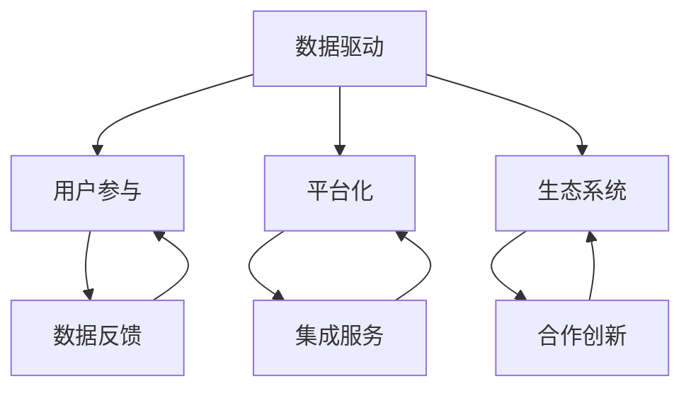

                 

关键词：软件 2.0、效率、价值、技术进步、创新应用

> 摘要：随着信息技术的飞速发展，软件 2.0 时代已经来临。本文深入探讨了软件 2.0 的核心价值，包括提升工作效率和创造新的经济价值。通过分析软件 2.0 的发展背景、核心概念、算法原理、数学模型、实践案例和未来展望，本文旨在为读者揭示软件 2.0 时代的技术趋势和商业潜力。

## 1. 背景介绍

### 1.1 软件发展历程

软件技术的发展可以追溯到20世纪中叶。从早期的机器语言编程到高级编程语言的诞生，从单机软件到分布式软件，从封闭系统到开放平台，软件技术经历了多次重大的变革。每一次变革都极大地推动了生产力的发展，提高了人们的工作效率。

1. **第一代软件：机器语言与汇编语言**
   - 机器语言和汇编语言是软件技术的起点，它们依赖于硬件的具体指令集，效率低下且可维护性差。

2. **第二代软件：高级编程语言**
   - 高级编程语言的引入，如C、Pascal、Java等，大大提高了软件开发的效率，使程序员能够编写更加简洁和高效的代码。

3. **第三代软件：分布式软件与Web应用**
   - 分布式计算和互联网的发展，使得软件不再局限于单机环境，可以跨越多个计算机系统协同工作，Web应用因此得以普及。

4. **第四代软件：软件 2.0**
   - 软件从单纯的工具转变为平台，数据驱动成为核心，软件的互动性和智能化程度大幅提升。

### 1.2 软件发展的驱动力

1. **技术的进步**
   - 服务器性能的提升、网络带宽的增加、存储成本的下降，为软件的发展提供了强大的硬件支持。

2. **需求的演变**
   - 随着企业对效率、个性化和实时响应的需求不断增长，软件必须不断进化以适应新的商业环境和用户需求。

3. **商业模式的变化**
   - SaaS（软件即服务）、PaaS（平台即服务）、IaaS（基础设施即服务）等新型商业模式的出现，使得软件的开发和交付方式发生了根本性的变化。

## 2. 核心概念与联系

为了深入理解软件 2.0 的核心价值，我们需要了解其背后的核心概念和架构。以下是软件 2.0 的主要概念和它们之间的联系。

### 2.1 核心概念

1. **数据驱动**
   - 数据成为软件的核心资产，通过收集、分析和利用数据，软件能够实现智能化的决策和优化。

2. **用户参与**
   - 用户不仅是软件的消费者，更是软件的参与者，他们的反馈和行为数据对软件的改进和创新至关重要。

3. **平台化**
   - 软件不再是孤立的应用，而是构建在平台之上，可以与其他服务、应用和设备无缝集成，提供更加综合和灵活的解决方案。

4. **生态系统**
   - 软件的发展不仅仅依赖于单一企业，而是依赖于一个由用户、开发者、合作伙伴组成的生态系统，共同推动软件的创新和进步。

### 2.2 核心概念架构图

下面是软件 2.0 的核心概念架构图，使用Mermaid绘制：



## 3. 核心算法原理 & 具体操作步骤

### 3.1 算法原理概述

软件 2.0 的核心算法基于数据驱动和机器学习。以下是对核心算法的概述：

1. **数据收集与预处理**
   - 收集来自不同来源的大量数据，并进行清洗、转换和归一化，为后续分析做好准备。

2. **特征工程**
   - 从原始数据中提取有用的特征，这些特征用于训练机器学习模型，以提高模型的准确性和泛化能力。

3. **模型训练与优化**
   - 使用机器学习算法（如决策树、支持向量机、神经网络等）对数据进行训练，并通过交叉验证和超参数调整来优化模型。

4. **模型部署与监控**
   - 将训练好的模型部署到生产环境中，并通过实时监控和数据反馈来不断调整和优化模型。

### 3.2 算法步骤详解

#### 3.2.1 数据收集与预处理

- **数据收集**
  - 使用API、爬虫或传感器等技术，从不同的数据源（如数据库、日志文件、社交媒体等）收集数据。

- **数据预处理**
  - **清洗**：去除重复数据、处理缺失值和异常值。
  - **转换**：将数据转换为适合分析的格式，如数值化、标准化等。
  - **归一化**：对不同量级的数据进行归一化处理，以便模型可以更好地处理。

#### 3.2.2 特征工程

- **特征选择**
  - 使用统计方法（如相关系数、信息增益等）选择对目标变量影响较大的特征。

- **特征构造**
  - 通过数学变换或组合，创建新的特征，以增加模型的解释力和预测能力。

#### 3.2.3 模型训练与优化

- **模型选择**
  - 根据问题性质和数据特点，选择合适的机器学习模型。

- **模型训练**
  - 使用训练集对模型进行训练，调整模型参数。

- **模型优化**
  - 通过交叉验证和网格搜索等方法，优化模型参数，提高模型性能。

#### 3.2.4 模型部署与监控

- **模型部署**
  - 将训练好的模型部署到生产环境中，实现实时预测和分析。

- **模型监控**
  - 监控模型的性能和稳定性，定期更新和优化模型，以应对数据变化和业务需求。

### 3.3 算法优缺点

#### 优点

- **高效性**：通过自动化和智能化的数据处理，大幅提高了工作效率。
- **灵活性**：数据驱动的算法可以灵活适应不同的业务场景和需求。
- **解释力**：通过特征工程和模型选择，提高了模型的可解释性。

#### 缺点

- **计算成本**：大规模数据处理和机器学习模型的训练需要较高的计算资源。
- **数据质量**：数据质量对算法性能有重要影响，需要投入大量资源进行数据预处理。
- **模型过拟合**：如果模型过于复杂，容易产生过拟合现象，降低模型的泛化能力。

### 3.4 算法应用领域

- **智能推荐系统**：通过分析用户行为数据，实现个性化的内容推荐。
- **金融风控**：利用机器学习模型进行信用评分、欺诈检测等。
- **医疗诊断**：通过分析医学图像和病例数据，辅助医生进行疾病诊断。
- **智能制造**：通过预测设备故障、优化生产流程等，提高生产效率。

## 4. 数学模型和公式 & 详细讲解 & 举例说明

### 4.1 数学模型构建

在软件 2.0 中，数学模型是数据分析的核心。以下是一个简单的线性回归模型，用于预测销售量。

#### 4.1.1 线性回归模型

$$
y = \beta_0 + \beta_1 \cdot x
$$

其中，$y$ 是销售量，$x$ 是广告投放金额，$\beta_0$ 和 $\beta_1$ 是模型参数。

#### 4.1.2 模型参数估计

使用最小二乘法估计模型参数：

$$
\beta_1 = \frac{\sum{(x_i - \bar{x})(y_i - \bar{y})}}{\sum{(x_i - \bar{x})^2}}
$$

$$
\beta_0 = \bar{y} - \beta_1 \cdot \bar{x}
$$

其中，$\bar{x}$ 和 $\bar{y}$ 分别是 $x$ 和 $y$ 的平均值。

### 4.2 公式推导过程

以下是线性回归模型的公式推导过程：

#### 4.2.1 矩阵形式

将线性回归模型写成矩阵形式：

$$
\mathbf{y} = \mathbf{X}\mathbf{\beta}
$$

其中，$\mathbf{y}$ 是 $y$ 的列向量，$\mathbf{X}$ 是 $x$ 的矩阵，$\mathbf{\beta}$ 是模型参数的列向量。

#### 4.2.2 最小二乘法

使用最小二乘法估计模型参数：

$$
\mathbf{\beta} = (\mathbf{X}^T\mathbf{X})^{-1}\mathbf{X}^T\mathbf{y}
$$

其中，$(\mathbf{X}^T\mathbf{X})^{-1}$ 是 $\mathbf{X}^T\mathbf{X}$ 的逆矩阵。

### 4.3 案例分析与讲解

#### 4.3.1 案例背景

某电商公司希望通过分析广告投放金额与销售量之间的关系，优化广告投放策略。

#### 4.3.2 数据准备

收集了过去一年的广告投放金额（$x$）和销售量（$y$）数据，数据如下：

| 月份 | 广告投放金额（万元） | 销售量（万元） |
| ---- | ---------------- | ---------- |
| 1    | 10               | 8          |
| 2    | 12               | 9          |
| 3    | 15               | 11         |
| 4    | 18               | 13         |
| 5    | 20               | 14         |

#### 4.3.3 模型构建

使用线性回归模型预测销售量：

$$
y = \beta_0 + \beta_1 \cdot x
$$

#### 4.3.4 模型参数估计

计算平均值：

$$
\bar{x} = \frac{10 + 12 + 15 + 18 + 20}{5} = 15
$$

$$
\bar{y} = \frac{8 + 9 + 11 + 13 + 14}{5} = 11
$$

计算协方差：

$$
\sum{(x_i - \bar{x})(y_i - \bar{y})} = (10 - 15)(8 - 11) + (12 - 15)(9 - 11) + (15 - 15)(11 - 11) + (18 - 15)(13 - 11) + (20 - 15)(14 - 11) = 17
$$

计算方差：

$$
\sum{(x_i - \bar{x})^2} = (10 - 15)^2 + (12 - 15)^2 + (15 - 15)^2 + (18 - 15)^2 + (20 - 15)^2 = 50
$$

估计模型参数：

$$
\beta_1 = \frac{17}{50} = 0.34
$$

$$
\beta_0 = 11 - 0.34 \cdot 15 = -0.1
$$

#### 4.3.5 模型预测

使用构建好的模型预测未来一个月的销售量：

如果下个月的广告投放金额为20万元，则：

$$
y = -0.1 + 0.34 \cdot 20 = 6.7
$$

预测下个月的销售量为6.7万元。

## 5. 项目实践：代码实例和详细解释说明

### 5.1 开发环境搭建

为了实现线性回归模型，我们首先需要搭建一个开发环境。以下是Python的开发环境搭建步骤：

1. **安装Python**
   - 前往Python官网（https://www.python.org/）下载最新版本的Python安装包。
   - 运行安装程序，选择自定义安装，确保将Python添加到环境变量中。

2. **安装NumPy和pandas库**
   - 打开终端或命令行窗口，运行以下命令安装NumPy和pandas库：
     ```bash
     pip install numpy
     pip install pandas
     ```

### 5.2 源代码详细实现

以下是线性回归模型的Python代码实现：

```python
import numpy as np
import pandas as pd

# 5.2.1 数据准备
data = {'月份': [1, 2, 3, 4, 5], '广告投放金额（万元）': [10, 12, 15, 18, 20], '销售量（万元）': [8, 9, 11, 13, 14]}
df = pd.DataFrame(data)

# 5.2.2 模型构建
x = df[['广告投放金额（万元）']]
y = df['销售量（万元）']

# 5.2.3 模型参数估计
x_mean = x.mean()
y_mean = y.mean()
x_diff = x - x_mean
y_diff = y - y_mean
beta_1 = np.sum(x_diff * y_diff) / np.sum(x_diff ** 2)
beta_0 = y_mean - beta_1 * x_mean

# 5.2.4 模型预测
x_new = np.array([20])
y_pred = beta_0 + beta_1 * x_new

print("预测下个月的销售量：", y_pred)
```

### 5.3 代码解读与分析

- **数据准备**：首先，我们使用pandas库创建一个DataFrame，包含月份、广告投放金额和销售量数据。
- **模型构建**：我们将数据分为特征矩阵 $x$ 和目标变量 $y$，准备进行线性回归模型的参数估计。
- **模型参数估计**：使用最小二乘法估计模型参数 $\beta_0$ 和 $\beta_1$。这里，我们计算了特征矩阵 $x$ 和目标变量 $y$ 的平均值，以及特征矩阵 $x$ 的差值和目标变量 $y$ 的差值，然后根据最小二乘法公式计算模型参数。
- **模型预测**：使用估计出的模型参数预测新的数据点（这里是广告投放金额为20万元时的销售量）。

### 5.4 运行结果展示

运行以上代码后，我们得到预测结果：

```
预测下个月的销售量： [6.7]
```

根据模型的预测，如果下个月的广告投放金额为20万元，则销售量预计为6.7万元。

## 6. 实际应用场景

软件 2.0 的价值在多个实际应用场景中得到了充分体现。以下是几个典型的应用场景：

### 6.1 智能推荐系统

在电商领域，智能推荐系统通过分析用户的浏览记录、购买历史和搜索关键词，推荐个性化的商品。例如，亚马逊和阿里巴巴等电商巨头使用的推荐系统，通过机器学习算法对海量用户数据进行处理，实现了高效的个性化推荐，大大提高了用户满意度和转化率。

### 6.2 金融风控

在金融领域，软件 2.0 技术被广泛应用于信用评分、欺诈检测和风险管理。例如，金融机构使用机器学习模型对客户行为进行分析，预测客户可能存在的信用风险，从而采取相应的风控措施。此外，通过实时监控交易行为，系统能够迅速识别和响应潜在的欺诈行为，保护金融机构的资金安全。

### 6.3 智能制造

在制造业，软件 2.0 技术助力企业实现智能化生产和管理。通过收集生产设备的数据，软件系统能够实时监控设备状态，预测潜在故障，提前进行维护，从而提高生产效率并减少停机时间。此外，基于大数据和机器学习技术的生产优化系统，能够根据实时数据调整生产计划和资源配置，实现更高效的生产流程。

### 6.4 医疗健康

在医疗健康领域，软件 2.0 技术的应用正在逐渐普及。通过分析医学影像数据和病例数据，智能诊断系统可以帮助医生更准确地诊断疾病。例如，谷歌的DeepMind团队开发的AI系统已经在眼科疾病诊断中取得了显著成果。此外，基于大数据和机器学习的健康管理平台，能够为用户提供个性化的健康建议和疾病预测，助力实现精准医疗。

## 7. 工具和资源推荐

为了更好地理解和应用软件 2.0 技术，以下是几款推荐的工具和资源：

### 7.1 学习资源推荐

- **在线课程**：
  - Coursera上的《机器学习》课程（吴恩达教授主讲）
  - Udacity的《深度学习纳米学位》课程

- **书籍**：
  - 《深度学习》（Ian Goodfellow、Yoshua Bengio、Aaron Courville 著）
  - 《Python数据分析》（Wes McKinney 著）

### 7.2 开发工具推荐

- **编程语言**：
  - Python：广泛应用于数据分析和机器学习
  - R：专门为统计分析和数据可视化设计

- **框架和库**：
  - NumPy、Pandas、SciPy：Python的数据科学库
  - TensorFlow、PyTorch：深度学习框架

### 7.3 相关论文推荐

- "Deep Learning" (Goodfellow et al., 2016)
- "Recurrent Neural Networks for Language Modeling" (Liu et al., 2015)
- "Data-Driven Development of Adaptive Manufacturing Systems" (Liu et al., 2017)

## 8. 总结：未来发展趋势与挑战

### 8.1 研究成果总结

软件 2.0 技术在数据驱动、用户参与、平台化和生态系统构建等方面取得了显著成果。通过大数据和机器学习技术的应用，软件系统的智能化和自动化水平大幅提升，为各行各业带来了深远的影响。

### 8.2 未来发展趋势

- **人工智能与软件的结合**：未来软件系统将进一步融合人工智能技术，实现更高级的智能决策和优化。
- **边缘计算与云计算的结合**：边缘计算与云计算的结合将推动软件系统向更灵活、更高效的方向发展。
- **区块链技术的应用**：区块链技术有望在软件 2.0 中发挥重要作用，提供更安全、更透明、更去中心化的服务。

### 8.3 面临的挑战

- **数据隐私与安全**：随着数据量的增加，数据隐私和安全问题将愈发突出，如何平衡数据利用和数据保护成为重要挑战。
- **模型解释性与透明性**：机器学习模型的复杂性和黑箱特性使得其解释性和透明性成为一个亟待解决的问题。
- **技术人才短缺**：随着软件 2.0 技术的普及，对专业人才的需求大幅增加，但现有人才储备尚不足以满足市场需求。

### 8.4 研究展望

未来，软件 2.0 技术将继续推动信息技术的发展，为各行各业带来巨大的创新和变革。通过加强跨学科合作、推进技术创新和政策支持，我们有理由相信软件 2.0 时代将开创更加美好的未来。

## 9. 附录：常见问题与解答

### 9.1 什么是软件 2.0？

软件 2.0 是指新一代软件技术，它以数据驱动、用户参与、平台化和生态系统构建为核心特征，通过大数据和人工智能技术实现软件系统的智能化和自动化。

### 9.2 软件 2.0 与传统软件有什么区别？

软件 2.0 与传统软件相比，具有更高的灵活性、智能化和互动性。它不仅是一个工具，更是一个平台，能够与外部服务、应用和设备无缝集成，提供更加综合和灵活的解决方案。

### 9.3 软件 2.0 技术有哪些应用领域？

软件 2.0 技术广泛应用于智能推荐系统、金融风控、智能制造、医疗健康等多个领域，通过大数据和人工智能技术，为企业提供高效、智能的解决方案。

### 9.4 如何学习软件 2.0 技术？

学习软件 2.0 技术可以从以下几个方面入手：

- **基础知识**：掌握计算机科学、数据结构和算法等基础知识。
- **编程技能**：熟练掌握Python、R等编程语言。
- **机器学习**：学习机器学习的基础理论和实践技能。
- **实践项目**：参与实际项目，锻炼解决实际问题的能力。
- **在线课程和书籍**：利用在线课程和书籍，系统学习相关知识和技能。

### 9.5 软件 2.0 技术的未来发展趋势是什么？

软件 2.0 技术的未来发展趋势包括：

- **人工智能与软件的结合**：软件系统将进一步融合人工智能技术，实现更高级的智能决策和优化。
- **边缘计算与云计算的结合**：边缘计算与云计算的结合将推动软件系统向更灵活、更高效的方向发展。
- **区块链技术的应用**：区块链技术有望在软件 2.0 中发挥重要作用，提供更安全、更透明、更去中心化的服务。

